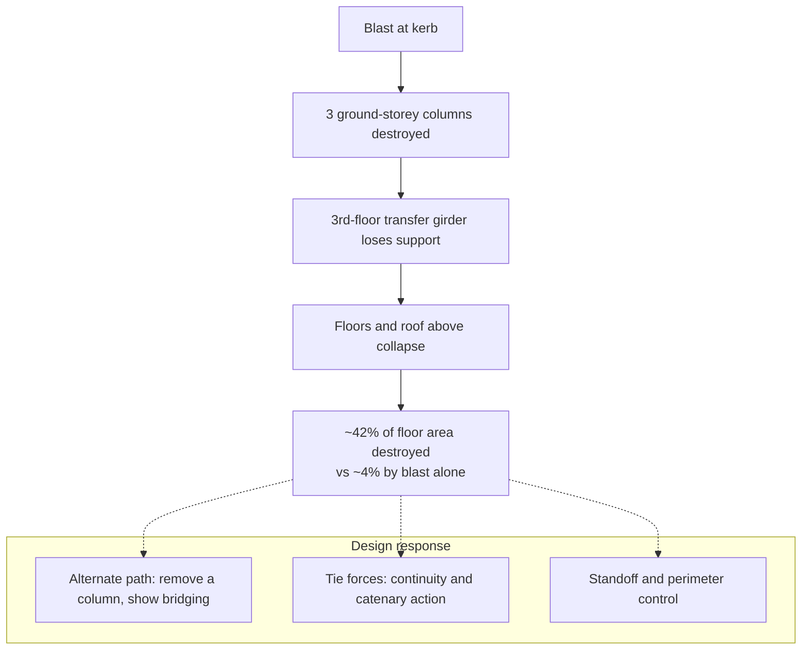

# CS-3 · Oklahoma City, 1995: progressive collapse, forensic scale and protective design

**Read after** [04.3 Structural effects](lessons/stage-04/lesson-03.md) · **Revisit after** [08.2 Reconstruction as an inverse problem](lessons/stage-08/lesson-02.md) · **Also exercises** [01.6 Structural response](lessons/stage-01/lesson-06.md), [04.2 Distance, reflection, confinement](lessons/stage-04/lesson-02.md), [08.1 The post-blast scene](lessons/stage-08/lesson-01.md)

**Estimated time** 2 h (reading 50 min · questions 70 min) · **Level** Intermediate → Advanced

structuresprogressive collapseforensicsstandardsSim D

**Boundary.** The attack is described only as "a large vehicle bomb". Its composition and
construction are not discussed. The engineering content is about how the *building* responded
and how design standards changed afterwards. Those topics are public, peer-reviewed and
protective in purpose.

## Situation

At **9:02 a.m. on 19 April 1995** a large vehicle bomb in a rented truck detonated at the kerb on
the north side of the **Alfred P. Murrah Federal Building** in downtown Oklahoma City. **168
people were killed, including 19 children**, and several hundred more were injured. More than
300 nearby buildings were damaged or destroyed (FBI, *Oklahoma City Bombing*). The
Congressional Research Service puts the injured at more than 680 (CRS RS22121). It was the
deadliest act of domestic terrorism in US history.

The building was a **nine-storey reinforced-concrete (RC) frame with shear walls**. It was
designed in the early 1970s to the ACI 318-71 code and built in 1974–76. On the north face the
ground-storey columns were widely spaced and carried a **transfer girder at the third floor**.
The girder picked up the more closely spaced columns above it (Lew, NIST). That configuration
turned out to be central.

## Technology available

**For structural assessment and rescue (1995)**

- Engineering judgement, conventional survey, and photography on wet film.
- Blast-load prediction tools of the era (empirical charts and codes such as ConWep) and
  single-degree-of-freedom (SDOF) analysis. The later FEMA/NIST re-analysis used both (Lew, NIST).
- No routine terrestrial laser scanning, no photogrammetry pipelines, no digital photography.

**For the investigation**

- Laboratory chemistry for residue identification (see [08.3](lessons/stage-08/lesson-03.md)).
- Manual evidence logging. A retired FBI agent recalled that the investigation produced
  **238,000 wet-film photographs** and that "when you remembered seeing something, you had to
  be able to find it" (FBI, *25 years after*).
- Paper-based and early computerised records searches.

## Information available to responders

| Time | Known | Unknown |
|---|---|---|
| Minutes after | A massive explosion; a large part of the building collapsed; many trapped | Cause; whether more devices existed; stability of the remaining structure |
| Hours | Scale of casualties; structural hazard from hanging slabs and damaged columns | Where survivors were; how much of the remaining structure might collapse |
| Days | Vehicle identified from a recovered component (see below) | The full chain of responsibility |

Rescue and recovery went on inside a **partially collapsed, still-unstable structure**. Every
decision to send people in was a structural-stability judgement made with incomplete
information.

## Hazards

- **Primary blast** on the north façade and into the building. A kerbside vehicle bomb at short
  standoff produces very high reflected pressures on the nearest members
  ([04.2](lessons/stage-04/lesson-02.md)).
- **Loss of load-bearing elements, then progressive collapse.** This is the dominant hazard
  and the main subject of this case.
- **Glazing and debris** injuries across a wide radius. Hundreds of buildings were damaged.
- **Secondary hazards during rescue**: overhanging slabs, falling debris, the possibility of a
  secondary device, fire, and utilities.

## What happened to the structure

NIST's case-study presentation (Lew), which summarises FEMA 277 and later FEMA work, gives the
chain:

1. The blast **destroyed three ground-storey columns** on the north face (G16, G20, G24).
2. Without those supports, the **third-floor transfer girders** between G16 and G26 failed.
3. **All floors and roof panels** supported through that girder line **collapsed**.

The numbers are the heart of the lesson:

| Quantity | ft² | m² (converted) | Share of total |
|---|---|---|---|
| Total building floor area | ~137,800 | ~12,800 | 100% |
| Destroyed by **blast alone** | ~5,850 | ~540 | **~4%** |
| Destroyed by **blast + progressive collapse** | ~58,100 | ~5,400 | **~42%** |

The collapse destroyed about **ten times** the floor area that the blast destroyed directly
($58{,}100/5{,}850 \approx 9.9$). **The structure's
failure to redistribute load, not the blast itself, decided the scale of the disaster.**

**Key idea — disproportionate collapse.** A building is *robust* if the damage it suffers is
proportionate to the triggering event. The Murrah building was not robust. Losing a small number
of members led to collapse across nearly half the floor area. In systems terms, the transfer
girder was a **single point of failure** with a large downstream dependency tree.

## Decisions

**Decision point 1 — rescue inside an unstable structure**

| Known | Unknown |
|---|---|
| People are trapped and alive; survival falls quickly with time | Remaining capacity of damaged members; risk of further collapse; a possible secondary device |

The trade-off is the same exposure logic as in [CS-1](case-studies/cs01-wheelbarrow.md), now with
a structure as the hazard. Rescuers accepted exposure because the expected benefit (lives) was
high. They managed the risk with shoring, monitoring and stand-downs when the hazard changed.

**Decision point 2 — scene as a crime scene versus a rescue site**

Rescue has priority, but evidence is perishable. The decision is how to preserve evidence
*while* rescuing: documenting, recording the positions of recovered items, and controlling
access ([08.1](lessons/stage-08/lesson-01.md)). One recovered component carried an identifying
number. It was found on 20 April and traced to a truck-rental body shop in Kansas, which led
quickly to a suspect (FBI). This happened because searchers recognised a significant item
inside a huge debris field.

**Decision point 3 — policy: retrofit, redesign or accept?**

| Known (after FEMA 277) | Unknown |
|---|---|
| Collapse, not blast, drove the losses; seismic-style detailing helps | Cost of retrofitting the federal building stock; the threat to any particular building |

The policy choices after the event were between prescriptive rules (standoff, specific
detailing) and risk-based standards that scale protection to the assessed threat. The US
government built an interagency framework to make those choices consistently (see below).

## Technology used

- **Structural engineering assessment** during the rescue, and the FEMA **Building Performance
  Assessment Team** afterwards (FEMA 277, 1996).
- **Re-analysis** with blast-load generation (ConWep), SDOF member response and plastic-mechanism
  progressive-collapse checks. Blast-damaged members were removed from the model and the
  capacity/demand ratio of what remained was checked. A ratio below 1 was taken as failure and
  a ratio above 2 as no collapse (Lew, NIST, summarising FEMA 439).
- **Forensic investigation at national scale**: more than **1,400 investigators**, more than
  **28,000 interviews**, some **43,000 leads**, more than **three tons of evidence** and
  record searches across millions of hotel, truck-rental and airline records (FBI).

## Outcome

- Criminal: the perpetrators were identified within days and convicted (FBI).
- Structural: FEMA 277 concluded that many of the techniques used to improve seismic resistance
  also improve a building's resistance to blast and progressive collapse (Lew, NIST, quoting
  FEMA 277).
- A **re-analysis of the Murrah building with seismic-style detailing** (special moment frame
  detailing, continuity of reinforcement, mechanical splices) estimated that **damage would
  have been reduced by more than 80%** (Lew, NIST; FEMA 439). Some strengthening schemes
  eliminated progressive-collapse damage on the upper floors entirely.

## Lessons learned

1. **Design for the loss of a member, not only for the load.** Robustness means alternative
   load paths. When a member is lost, the structure must be able to bridge the gap.
2. **Avoid single points of failure.** Transfer girders over sparse columns concentrate risk
   in exactly the place most exposed to a vehicle at the kerb.
3. **Ductility and continuity buy robustness.** Seismic detailing makes members able to deform
   without losing strength and ties the structure together, so it redistributes load when a
   member fails.
4. **Standoff is the cheapest protection.** Blast pressure falls steeply with scaled distance
   ([04.2](lessons/stage-04/lesson-02.md)). Kerbside access defeated every other defence.
5. **Forensic scale is a data-management problem.** A quarter of a million film photographs and
   tons of evidence without digital indexing is the pre-digital version of the Boston problem
   ([CS-7](case-studies/cs07-boston-2013.md)).

## Technological developments that followed

| Development | What it did | Source |
|---|---|---|
| **Executive Order 12977** (19 Oct 1995) | Created the **Interagency Security Committee (ISC)** to set security standards for federal facilities, including long-term construction standards for blast-resistant buildings | CRS RS22121; American Presidency Project |
| **FEMA 277** (1996) | Building-performance assessment of the Murrah building; linked seismic detailing to blast and collapse resistance | Lew, NIST |
| **Corley et al.; Mlakar et al. (1998)** | Peer-reviewed analysis of the blast damage and collapse, with recommendations for multihazard mitigation | ASCE *J. Perf. Constr. Facilities* 12(3) |
| **UFC 4-023-03** *Design of Buildings to Resist Progressive Collapse* (Jan 2005, later revised) | DoD design criteria built on **tie forces** (catenary action) and the **alternate-path** method (bridging over a removed member) | WBDG |
| **FEMA 439A/439** (2005) | *Blast-Resistance Benefits of Seismic Design*: Murrah re-analysis with strengthening schemes | Lew, NIST |
| **3D documentation and damage-based inference** | Low-cost laser scanning and photogrammetry combined with simulation to infer blast parameters from structural damage | Whelan & Weggel, NIJ 2019 |

The **alternate-path method** is the direct engineering answer to Oklahoma City. The designer
notionally removes a column (for example, a ground-floor perimeter column) and shows that the
remaining structure can carry the load, with dynamic effects accounted for. It is a
threat-independent robustness check: it does not ask *what* removed the column. That makes it
a good analogue of **N−1 contingency analysis** in power systems, or of chaos testing in
distributed software.

**Simulator link.** In [Sim D](sims/blast-physics/index.html), use an abstract charge in yield
units (YU) and see how peak reflected pressure and impulse on a façade element change as standoff
goes from about 5 m (a kerb) to 30 m (a controlled perimeter). Then use the SDOF/P–I panel to
see how a member that fails at kerbside survives at the larger standoff. This is the quantitative
basis of lesson 4 above.

## Discussion questions

1. Blast alone destroyed about 4% of the floor area; blast plus collapse about 42%. Define an
   "amplification factor" and compute it. Why is this ratio a better indicator of structural
   robustness than the absolute area destroyed?

Answer — then reveal

Amplification $A = 58{,}100 / 5{,}850 \approx 9.9$. The absolute area depends on the size of the
threat, which the designer does not control. The ratio measures how much the *structure* added
to the damage. A robust structure has $A$ close to 1, so the damage is proportionate to the
cause. That is the criterion the progressive-collapse standards try to enforce.

2. Explain in your own words why seismic detailing (ductility, continuity, strong column–weak
   beam) improves progressive-collapse resistance even though earthquakes and blasts load a
   structure very differently.

Answer — then reveal

Both situations need the structure to survive large deformations and redistribute load when
some elements yield or fail. Continuous reinforcement lets beams and slabs act as ties and
develop catenary (membrane) action over a lost support. Ductile detailing lets members deform
plastically without brittle failure, so energy is absorbed and load can find another path.
Strong column–weak beam ordering keeps columns, which are critical for collapse, from failing
first. The *loads* differ, but the required *properties* (redundancy, ductility, continuity)
are the same. FEMA 439 is careful to say this is not the same as claiming that seismic design
*is* blast design.

3. The alternate-path method is threat-independent. Give one advantage and one limitation of a
   threat-independent robustness requirement compared with designing for a specified threat.

4. The FBI managed 238,000 film photographs and three tons of evidence without digital search.
   Sketch a data model for evidence items, photographs and locations that would support the
   query "show every photograph that includes item X, and where it was found". Which fields are
   essential for chain of custody ([08.1](lessons/stage-08/lesson-01.md))?

5. The recovered component with an identifying number was found within a day. What search
   strategy and scene-management decisions make finding such items more likely in a large
   debris field? Relate your answer to search theory ([05.7](lessons/stage-05/lesson-07.md)).

Answer — then reveal

Divide the scene into sectors and prioritise search effort by the probability density of
significant items, for example along the likely trajectories of heavy vehicle parts from the
seat. Use systematic sweeps with recorded coverage so that the probability of detection per
sector is known. Record the position of items before moving them. Control access so that items
are not displaced. Brief searchers on what "significant" looks like so their detection
probability for relevant items goes up. This is Koopman search: allocate effort where the
product of prior probability and detectability is highest, and track cumulative coverage.

6. EO 12977 created a *committee* that sets *risk-based* standards rather than a single
   prescriptive rule. Argue for and against that institutional design.

## Sources

| Title | Organisation / author | Date | URL |
|---|---|---|---|
| Case Study: Alfred P. Murrah Federal Building, Oklahoma City (slides; summarises FEMA 277 and FEMA 439) | H. S. Lew, NIST | c. 2002–2005 | https://www.nist.gov/system/files/documents/2017/05/09/OklahomaCityLew2002.pdf |
| Oklahoma City Bombing (Famous Cases) | FBI History | accessed 2026 | https://www.fbi.gov/history/famous-cases/oklahoma-city-bombing |
| The Oklahoma City Bombing: Retired FBI Agent Reflects… (25 years after) | FBI | 15 Apr 2020 | https://www.fbi.gov/news/stories/25-years-after-oklahoma-city-bombing-041520 |
| The Interagency Security Committee and Security Standards for Federal Buildings (RS22121) | Congressional Research Service | accessed 2026 | https://www.congress.gov/crs-product/RS22121 |
| Executive Order 12977 — Interagency Security Committee | The American Presidency Project (UCSB) | 19 Oct 1995 | https://www.presidency.ucsb.edu/documents/executive-order-12977-interagency-security-committee |
| Corley, Mlakar, Sozen, Thornton, "The Oklahoma City Bombing: Summary and Recommendations for Multihazard Mitigation", *J. Performance of Constructed Facilities* 12(3):100–112 | ASCE | 1998 | https://ascelibrary.org/doi/10.1061/(ASCE)0887-3828(1998)12:3(100) |
| Mlakar, Corley, Sozen, Thornton, "The Oklahoma City Bombing: Analysis of Blast Damage to the Murrah Building", *J. Performance of Constructed Facilities* 12(3):113–119 | ASCE | 1998 | https://ascelibrary.org/doi/10.1061/(ASCE)0887-3828(1998)12:3(113) |
| UFC 4-023-03 Design of Buildings to Resist Progressive Collapse (2005 edition, archived) | US DoD, via WBDG | 25 Jan 2005 | https://www.wbdg.org/FFC/DOD/UFC/ARCHIVES/ufc_4_023_03_2005.pdf |
| UFC 4-023-03 (current, with changes) | US DoD, via WBDG | current | https://www.wbdg.org/ffc/dod/unified-facilities-criteria-ufc/ufc-4-023-03 |
| Post-Blast Investigative Tools for Structural Forensics by 3D Scene Reconstruction and Advanced Simulation (NCJ 252954) | M. Whelan, D. Weggel, NIJ | May 2019 | https://www.ojp.gov/library/publications/post-blast-investigative-tools-structural-forensics-3d-scene-reconstruction |
| A Guide for Explosion and Bombing Scene Investigation (NCJ 181869) | NIJ Technical Working Group | Jun 2000 | https://nij.ojp.gov/library/publications/guide-explosion-and-bombing-scene-investigation |
