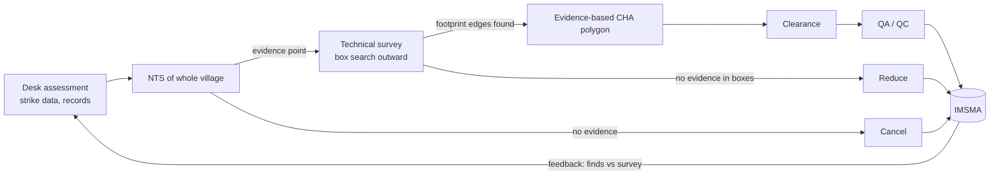

# CS-5 · Lao PDR: cluster munition contamination, evidence-based survey and land release

**Read after** [05.7 Search theory & land release](lessons/stage-05/lesson-07.md) · **Also exercises** [03.3 Mines, cluster munitions & legacy ordnance](lessons/stage-03/lesson-03.md), [05.5 Imaging & remote sensing](lessons/stage-05/lesson-05.md), [05.6 Sensor fusion](lessons/stage-05/lesson-06.md), [09.5 Active perception](lessons/stage-09/lesson-05.md)

**Estimated time** 2 h (reading 50 min · questions 70 min) · **Level** Intermediate → Advanced

mine actionsurveyland releasespatial statisticsdata managementIMSMA

**Boundary.** Submunitions are discussed only as a hazard *category* and as a statistical object
(how they are distributed in space). How they function, and anything about disposal technique,
is excluded.

## Situation

Between **1964 and 1973** the United States dropped more than **two million tonnes** of
ordnance on Lao PDR, including more than **270 million submunitions**, known locally as
"bombies" (Landmine & Cluster Munition Monitor). The failure rate is unknown. Lao PDR has
reported that it may have been as high as 30%, which implies roughly 80 million unexploded
submunitions (Mine Action Review, 2020). Laos has the heaviest cluster-munition contamination in
the world.

The human cost is documented by a national retrospective survey run by the National Regulatory
Authority (NRA). It covered 139 of 141 districts and identified **44,874 casualties from
explosive remnants of war between 1964 and 2008**, of whom **26,178 died**. About 74% of
incidents occurred during the conflict period (1964–79) and about 26% afterwards, and 87% of
casualties were male (Pizzino et al., 2018).

Contamination sits in farmland, villages, forest and near schools, in a largely rural country.
It is spread over a very large area at low and highly *clustered* density. Each aircraft
strike leaves a "footprint" of submunitions, and land between footprints is often clean.

## Technology available

| Capability | Notes |
|---|---|
| Hand-held metal detectors and large-loop detectors | The core detection tool. Laos has a lot of metal clutter from bomb fragments, which raises false alarms ([05.1](lessons/stage-05/lesson-01.md), [05.2](lessons/stage-05/lesson-02.md)) |
| Historical data | US bombing records (strike data); earlier operator records |
| Community knowledge | Villagers' reports of finds, accidents and strikes, collected through non-technical survey (NTS) |
| GPS and GIS | Mapping evidence points, polygons and cleared areas |
| IMSMA | Information Management System for Mine Action, the national database. It was upgraded over time, including VPN access for operators (Mine Action Review, 2020) |
| Remote sensing and AI (emerging) | Drone imagery, multispectral and thermal survey, and machine learning are being explored in the sector (GICHD & ICRC, 2021) |

## Information available to planners

| Known | Unknown |
|---|---|
| Aggregate bombing statistics; many strike records | Where submunitions actually landed and failed |
| Village reports of finds and accidents | Density inside each footprint; footprint boundaries |
| Past clearance records (of variable quality) | How much historical data was wrong or incomplete |
| Land-use needs (paddy, grazing, development) | Total contaminated area: the official estimate of about 8,470 km² dates from 2011 and was not evidence-based (Mine Action Review, 2020) |

## Hazards

- **Unexploded submunitions** on the surface and at shallow depth, often decades old. Their
  condition after years of corrosion and soil movement is unknown
  ([02.3](lessons/stage-02/lesson-03.md), [03.3](lessons/stage-03/lesson-03.md)).
- **Larger air-dropped bombs** and other UXO.
- **Behavioural hazards**: farming, cooking fires over buried items, and the scrap-metal trade.
- **Programme hazard**: spending clearance effort on clean land. This does not kill directly,
  but it delays clearing the land that does.

## Decisions

### Decision point 1 — where to put clearance effort: by request or by evidence?

**Before about 2014**, operators mostly did general survey on areas intended for clearance and
**roving clearance tasks based on requests and reports from villagers** (Mine Action Review,
2020). That puts effort where land is *needed*, which is a reasonable humanitarian criterion.
It is also statistically inefficient. Much of the requested land contains few or no
submunitions, so large areas were cleared with few finds per hectare.

**From 2015**, Laos adopted the **Cluster Munition Remnants Survey (CMRS)**, an evidence-based
survey methodology introduced with US funding (Monitor). Under CMRS:

1. **Desk assessment** of historical data and **non-technical survey of whole villages** (all
   land within a village boundary, not just individual plots) identify **evidence points**:
   locations where physical evidence of submunitions has been reported or seen.
2. **Technical survey** starts only from evidence points. It works outwards over a grid of
   boxes, searching a specified fraction of each box with detectors, until the edges of the
   contaminated footprint are found (Mine Action Review, 2020; IMAS 08.20/02).
3. The output is an **evidence-based confirmed hazardous area (CHA)**: a polygon whose
   contamination is confirmed by direct evidence (IMAS 08.20/02).
4. Clearance then targets CHAs, "across land boundaries where necessary, and away from the
   clearance of areas with low or no CMR contamination" (Mine Action Review, 2020).

| Known at the time of the switch | Unknown |
|---|---|
| Finds per hectare under request-based clearance were low | Whether evidence-based survey would miss contamination between evidence points |
| Strike footprints are spatially clustered | How communities would react to their requested land being deprioritised |

### Decision point 2 — accept the CHA figure rising

Evidence-based survey changed the *measured* size of the problem. The old 8,470 km² estimate
was not evidence-based, and survey progressively replaced it with confirmed polygons. By the end
of 2024 about **1,500 km² of CHA** remained (1,502.08 km² in Laos's second Article 4 extension
request) in 15 of 18 provinces. Systematic CMRS was complete in five provinces but still
ongoing in the most contaminated province, Xieng Khouang (Monitor). A programme that switches to
honest measurement must be prepared for numbers that look worse in some places before they look
better, and it has to explain that to donors.

### Decision point 3 — data first

A survey methodology is only as good as its data. Historical IMSMA records contained errors and
omissions. The national standard requires survey to correct them, and the sector reviewed its
information-management standard (Mine Action Review, 2020). Investment in data quality competes
with investment in field teams, and the case shows that it cannot be skipped.

## Technology used

- **Detectors** for technical survey and clearance.
- **GPS/GIS and IMSMA** to record evidence points, box searches, CHAs and cleared land.
- **National standards**: *Lao PDR UXO Survey Standards* (No. 21/NRA), completed in 2017 and
  approved in July 2018, aligned with IMAS and reflected in operators' SOPs (Mine Action
  Review, 2020).
- **Institutions**: UXO Lao, the national operator founded in 1996 with UNDP and UNICEF support,
  and the NRA, established in 2005, which coordinates the sector. In 2024 four international
  NGOs and two national operators worked in clearance (UXO Lao; Monitor).

## Outcome

| Metric | Value | Source |
|---|---|---|
| Items destroyed by UXO Lao (cumulative) | ~1.9 million, including > 1 million submunitions | UXO Lao |
| Land cleared in 2024 | **75.03 km²** (70 km² agricultural, 5.03 km² development) | Monitor |
| Items destroyed in 2024 technical operations | 107 large bombs and 26,057 other UXO | Monitor |
| CHA remaining, end-2024 | ~1,500 km² | Monitor |
| CCM Article 4 clearance deadline | Extended to **1 August 2030** | Monitor |
| Efficiency effect of CMRS | "Significant improvement in the number of CMR destroyed per hectare cleared since 2015" | Mine Action Review, 2020 |

A side effect shows the efficiency gain. Because more submunitions are found per hectare, more
demolition material is needed per km², and operating costs per km² went *up* (Mine Action
Review, 2020). The cost per item found went down. Which of those is the right metric is a
question of values as well as engineering.

At the 2024 clearance rate, the remaining CHA would take about $1{,}502/75 \approx 20$ years.
That rough extrapolation explains why the 2030 deadline is widely seen as difficult.

## Lessons learned

1. **Evidence-based survey is Bayesian search.** The prior (strike data, village reports) is
   updated by observations (evidence points, box searches), and effort goes where the posterior
   probability of contamination is highest ([05.7](lessons/stage-05/lesson-07.md)). Request-based
   clearance ignores the posterior.
2. **Spatial clustering is the key statistical fact.** Submunitions are not spread uniformly.
   They come in footprints. A method that finds footprint edges efficiently beats blanket
   coverage by a large factor.
3. **Land release has three outputs, not one**: cancel (no evidence after NTS), reduce (no
   evidence after technical survey), and clear (IMAS 07.11). Most of the efficiency comes from
   *not clearing* clean land, with documented evidence that it is clean.
4. **Metrics shape behaviour.** "km² cleared" rewards clearing clean land. "Items per km²" or
   "confirmed contaminated area removed" rewards finding contamination. Programmes need both,
   together with a measure of land handed back to productive use.
5. **The database is part of the clearance system.** Historical data errors propagate into
   survey decisions. Data cleaning is a safety activity.
6. **Honest measurement can make a problem look larger before it looks smaller.** That needs
   careful communication with donors and national authorities.

## Technological developments that followed

- **IMAS 08.20/02 *Cluster Munition Remnant Survey*** (edition 1, January 2024), which
  codifies evidence points, CHAs and a grid-and-box technical survey, with feedback from
  clearance to verify survey accuracy (IMAS).
- **IMAS 07.11 *Land Release*** (edition 2, January 2026), which formalises cancellation,
  reduction and clearance under "all reasonable effort" (IMAS).
- **Remote sensing and AI in survey**: drone RGB, multispectral and thermal imagery and ML
  detection are being explored to support non-technical survey (GICHD & ICRC, 2021; Baur et al.,
  2020, 2021). Public datasets now exist for surrogate targets (Lekhak et al., 2025; Gallagher &
  Oughton, 2025). See [09.1](lessons/stage-09/lesson-01.md) and
  [09.3](lessons/stage-09/lesson-03.md).
- **Information management**: IMSMA upgrades with remote access for operators, and a sustained
  effort to clean historical records (Mine Action Review, 2020).

## Discussion questions

1. Treat each strike footprint as a cluster. Suppose a village contains 20 km² of land, of which
   2 km² lie in footprints with a residual density of 50 items/ha and the rest is clean.
   Request-based clearance clears 4 km² chosen without regard to footprints. Evidence-based
   clearance clears the 2 km² of CHA. Compute the expected items found per hectare in each
   case. What does this say about the efficiency metric?

Answer — then reveal

Footprint land is 2 km² = 200 ha, holding $200 \times 50 = 10{,}000$ items. Request-based:
4 km² chosen at random from 20 km² covers on average 10% of the footprint land (0.4 km² =
40 ha), so it finds about $40 \times 50 = 2{,}000$ items over 400 ha, or **5 items/ha**.
Evidence-based: all 10,000 items over 200 ha, or **50 items/ha**, ten times more efficient,
and all known contamination in the village removed. Items/ha measures *targeting*.
km² cleared alone would have made the request-based approach look twice as productive.

2. Evidence-based survey starts only from evidence points. What is the failure mode, and how
   would you estimate the probability that a contaminated footprint has *no* reported evidence
   point? Which data sources could you use to reduce that probability?

Answer — then reveal

Failure mode: a footprint in land nobody uses or reports, such as forest or remote slopes, is
missed, and the surrounding area is cancelled. Estimate it by capture–recapture between
independent sources (village reports, strike records, operator finds), or by randomised
technical survey in a sample of cancelled areas to measure the miss rate directly. Reduce it by
fusing strike data (the prior over where bombs fell), remote-sensing indicators, and structured
NTS of whole villages rather than only requested plots. Post-clearance feedback (finds in
"clean" land) should be recorded and used to re-estimate the miss rate.

3. The national figure rose from "no reliable estimate" (an old 8,470 km² claim) to a
   progressively confirmed CHA. Write a short note to a donor explaining why a rising
   confirmed-hazard figure can be good news.

4. Design an IMSMA-style data model for evidence points, technical-survey boxes, CHAs and
   clearance tasks. Which integrity constraints would stop the historical data errors the
   programme had to clean up? Which fields would a machine-learning model for prioritising
   survey need?

5. The 2024 clearance rate implies about 20 years to clear the remaining CHA, against a 2030
   deadline. Identify three levers (technology, method or policy) that could change that
   timeline, and estimate which has the largest effect. State your assumptions.

6. Drone imagery with ML detection is being tested for survey. Where in the CMRS workflow would
   it add most value (desk assessment, NTS, technical survey, QA)? What would it need to
   demonstrate in a CWA 14747-style blind trial before being trusted?

## Sources

| Title | Organisation / author | Date | URL |
|---|---|---|---|
| Lao PDR: Impact (country profile) | Landmine & Cluster Munition Monitor | accessed 2026 | https://the-monitor.org/country-profile/lao-pdr/impact |
| Clearing Cluster Munition Remnants 2020: Lao PDR | Mine Action Review / Norwegian People's Aid | 2020 | https://www.mineactionreview.org/assets/downloads/903_NPA_Cluster_Munition_Remnants_2020_Lao_PDR.pdf |
| Population trends related to injury from explosive munitions in Lao PDR (1964–2008): a retrospective analysis, *Conflict and Health* | Pizzino et al. | 2018 | https://pmc.ncbi.nlm.nih.gov/articles/PMC6103997/ |
| About us | UXO Lao | accessed 2026 | https://uxolao.gov.la/about-us/ |
| U.S. Conventional Weapons Destruction Program in Lao PDR (fact sheet) | US Department of State | Oct 2024 | https://www.state.gov/bureau-of-political-military-affairs/releases/2024/10/u-s-conventional-weapons-destruction-program-in-lao-pdr |
| IMAS 08.20/02 Cluster Munition Remnant Survey | International Mine Action Standards | 23 Jan 2024 | https://www.mineactionstandards.org/standards/08-20-02/ |
| IMAS 07.11 Land Release (edition 2) | International Mine Action Standards | 16 Jan 2026 | https://www.mineactionstandards.org/standards/07-11/ |
| A Guide to Mine Action, 5th ed. | GICHD | Mar 2014 | https://www.gichd.org/fileadmin/uploads/gichd/Media/GICHD-resources/rec-documents/Guide-to-mine-action-2014.pdf |
| Webinar Report: The Use of Remote Sensing and Artificial Intelligence in the Mine Action Sector | GICHD and ICRC | Apr 2021 | https://www.gichd.org/fileadmin/uploads/gichd/Publications/ICRC_GICHD_Webinar_Report_-_The_Use_of_Remote_Sensing_and_Artificial_Intelligence_in_the_Mine_Action_Sector.pdf |
| Applying Deep Learning to Automate UAV-Based Detection of Scatterable Landmines, *Remote Sensing* 12(5):859 | J. Baur et al. | 2020 | https://www.mdpi.com/2072-4292/12/5/859 |
| How to Implement Drones and Machine Learning to Reduce Time, Costs, and Dangers Associated with Landmine Detection, *JCWD* 25(1) | J. Baur et al. | 2021 | https://commons.lib.jmu.edu/cisr-journal/vol25/iss1/29/ |
| A UAV-Based VNIR Hyperspectral Benchmark Dataset for Landmine and UXO Detection | S. Lekhak et al. (RIT), arXiv | 2025 | https://arxiv.org/abs/2510.02700 |
| AMLID: An Adaptive Multispectral Landmine Identification Dataset for Drone-Based Detection | J. E. Gallagher, E. J. Oughton, arXiv | 2025 | https://arxiv.org/abs/2512.18738 |
| CWA 14747-1:2003 Humanitarian Mine Action — Test and Evaluation — Metal Detectors | CEN Workshop 7 | May 2003 | https://www.mineactionstandards.org/standards/07-05-2003/ |
