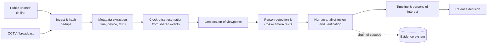

# CS-7 · Boston Marathon, 2013: post-blast investigation at data scale

**Read after** [08.3 Laboratory & digital forensics](lessons/stage-08/lesson-03.md) · **Also exercises** [08.1 The post-blast scene](lessons/stage-08/lesson-01.md), [08.2 Reconstruction](lessons/stage-08/lesson-02.md), [07.2 Incident management](lessons/stage-07/lesson-02.md), [09.1 Perception tasks](lessons/stage-09/lesson-01.md), [09.6 Trustworthy deployment](lessons/stage-09/lesson-06.md)

**Estimated time** 2 h (reading 50 min · questions 70 min) · **Level** Advanced

forensicsscene managementvideo analyticscrowdsourcingtimeline reconstructionSim E

**Boundary.** The devices are described only as "two improvised devices". Their construction and
components are not discussed. The case is about investigative *process*, evidence management and
the data engineering behind them.

## Situation

On **15 April 2013**, during the 117th Boston Marathon, two improvised devices functioned about
12 seconds apart near the finish line on Boylston Street, among thousands of spectators. Three
people were killed. The FBI reports more than 500 injured. The state's after-action report,
based on hospital data available at the time, counted 264 (FBI, *Boston Marathon Bombing*; MEMA
et al., *After Action Report*, 2014). **Sixteen people suffered traumatic amputations** (AAR, as
summarised in reporting).

Three days later the FBI released photographs and video of two suspects. That evening the
suspects killed an MIT police officer, carjacked a vehicle and engaged police in Watertown. One
suspect died and the other was arrested the next day. The surviving perpetrator was convicted
on **all 30 counts** and sentenced to death in June 2015 (FBI).

For this course, the defining feature is that the investigation was **a data-engineering
problem as much as a scene-examination problem.**

## Technology available

| Domain | Available in 2013 |
|---|---|
| Scene documentation | Digital photography, total stations, 3D laser scanning (available to major agencies), GPS |
| Evidence tracking | Barcode-based evidence management; chain-of-custody forms and databases |
| Laboratory | Mature explosives-residue chemistry, DNA, fingerprints, device reconstruction (FBI Laboratory, TEDAC) |
| Digital media | Smartphones everywhere; commercial CCTV; broadcast video; social media platforms |
| Ingest | A **dedicated digital tip line** set up to take photos and video from the public (FBI) |
| Analytics | Commercial video-management tools, metadata extraction, face detection. Automated face *recognition* at the time performed poorly on low-resolution, off-angle crowd imagery (see [09.1](lessons/stage-09/lesson-01.md)) |

## Information available to investigators

| Time | Known | Unknown |
|---|---|---|
| Minutes | Two explosions; mass casualties; exact locations of the seats | Whether more devices existed; who; whether an attack was ongoing |
| Hours | Scene extent; initial device fragments; a flood of public imagery | Which images mattered; timelines |
| Days 1–3 | Candidate individuals from imagery; device components from the scene | Identities |
| Day 3 on | Images of suspects released; public tips | Whereabouts; further plans |

## Hazards

- **Secondary devices** and unattended bags among thousands abandoned by fleeing spectators.
  Each one had to be treated as suspicious until cleared ([03.4](lessons/stage-03/lesson-04.md),
  [07.2](lessons/stage-07/lesson-02.md)).
- **Mass-casualty care** in the same space as the crime scene.
- **Perpetrators still at large** during the investigation.
- **Information hazards**: misidentification of innocent people by online crowds, and leaks.
- **Evidence degradation**: weather, foot traffic, cleaning, and the need to reopen the city.

## Decisions

### Decision point 1 — scene scope and management

| Known | Unknown |
|---|---|
| Two seats; debris thrown over long distances | Full extent of evidence scatter; the presence of further devices |

The scene was set **large**. FBI Boston's Evidence Response Team, working with the Boston Police
Department, Massachusetts State Police and ATF, spent **nine days processing 12 square blocks**.
About **176 FBI Laboratory and ERT personnel** were deployed. Technicians processed **more than
3,500 items of evidence** and shipped **2,749** to the FBI Laboratory at Quantico (FBI). A large
scene costs city disruption. A small scene risks losing fragments that identify the device and
link it to its makers ([08.1](lessons/stage-08/lesson-01.md)). Unified command, with an ad-hoc
Unified Command Center at a nearby hotel, coordinated the competing priorities of rescue,
public safety, investigation and reopening. The after-action report highlighted this as a
strength (MEMA et al., 2014).

### Decision point 2 — ask the public for imagery

| Known | Unknown |
|---|---|
| Thousands of spectators had filmed the finish area | Volume; quality; how to ingest and triage it; privacy and legal issues |

The FBI asked the public for photos and video and set up a **digital tip line**. More than **33
terabytes** of digital information were collected, including public submissions (FBI). This
turned the investigation into a large-scale **search problem over unstructured media**.

A rough scale estimate: if 33 TB were entirely 3 MB photographs, that would be
$33\times10^{12}/3\times10^{6} = 1.1\times10^{7}$ images. At 10 seconds of human review per
image, that is about **30,000 person-hours**. Video is worse: at about 1 MB/s, 33 TB is roughly
**9,000 hours** of footage. Manual review alone is not feasible on a timescale of days.
Triage is essential.

### Decision point 3 — when to release suspect images

| Known | Unknown |
|---|---|
| Two individuals of interest from imagery; online crowds were misidentifying innocent people | Identities; whether release would help or make the suspects flee or act |

The FBI released images **three days** after the attack (FBI). According to reporting, the timing
was partly intended to limit the damage from online misidentifications (see Sources). Releasing
images crowdsources *identification*. It also warns the suspects. What followed that night shows
both effects.

### Decision point 4 — crowdsourced analysis: use it, ignore it, or counter it?

Online communities, most prominently on Reddit, ran their own "investigation" of public photos.
They **named several innocent people**, including a missing student who had in fact already
died. The episode became a standard example of crowdsourced investigation failing (Fast
Company, 2013; ABC News, 2013). The distinction to draw is between **crowdsourcing data**
(photos, which worked) and **crowdsourcing inference** (identification, which failed without
controls).

## Technology used

- **Evidence Response Teams** with systematic grid search, digital documentation and barcode
  evidence tracking. The workflow follows the NIJ bombing-scene guide: initial response,
  evaluation, documentation, evidence processing, completion (NIJ, 2000).
- **Laboratory analysis** at the FBI Laboratory of the recovered items (FBI).
- A **digital tip line** and ingestion pipeline for public media (FBI).
- **Video and image review** to reconstruct movements. Investigators reviewed imagery of the
  finish area to find people whose movements before and after the explosions matched the
  events, and assembled a timeline from many independent cameras.
- **Linguists** spent more than 2,500 hours translating material (FBI).

## Timeline reconstruction as an engineering problem

Every image or clip is an observation $(t_i, \text{camera}_i, \text{content}_i)$. The clocks
behind $t_i$ are unreliable: phone clocks, CCTV clocks and broadcast time codes all drift or
are offset. Reconstruction therefore has to:

1. **Estimate each source's clock offset** from shared events visible in several sources. The
   explosions themselves are the best synchronisation signal: a sharp, simultaneous event seen
   or heard by many cameras. Solve for the offsets $\delta_k$ by least squares over matched
   events:
   $$\min_{\{\delta_k\}} \sum_{(i,j)\in\text{matches}} \big( (t_i + \delta_{k(i)}) - (t_j + \delta_{k(j)}) \big)^2 ,$$
   with one camera fixed as reference.
2. **Geolocate** each camera's viewpoint (metadata, landmarks, photogrammetry).
3. **Track** individuals across cameras (re-identification) and build a space–time path.
4. **Quantify uncertainty** on every step so that investigators know which links are solid.

This is the same structure as sensor fusion ([05.6](lessons/stage-05/lesson-06.md)) and
multi-camera tracking ([09.4](lessons/stage-09/lesson-04.md)).

## Outcome

- Suspects identified from imagery within **three days**. Arrest within five days. Conviction on
  all counts (FBI).
- At trial the prosecution introduced **more than 1,000 exhibits** and called **more than 100
  witnesses** (FBI).
- The after-action report praised unified command and inter-agency relationships. Later
  reporting also criticised aspects of the Watertown response, including weapons discipline
  (MEMA et al., 2014; WBUR, 2015).
- The online misidentifications caused real harm to innocent people and their families.

## Lessons learned

1. **Scene management and data management are one discipline.** Twelve blocks, 3,500 items and
   33 TB need the same things: identifiers, provenance, chain of custody and a queryable index.
2. **Ask for data, not verdicts.** Public imagery was invaluable. Public inference was harmful.
   Design intake so the public contributes observations while analysis stays controlled.
3. **Time synchronisation is a first-class problem.** Without it, a multi-source timeline is
   unreliable. Shared events (the explosions) are natural calibration signals.
4. **Triage before analysis.** At this volume, the pipeline order (dedupe, then time/place
   filter, then detect, then human review) decides what gets looked at in time.
5. **Automation assists, humans verify.** Automated tools narrow the search. Identification
   decisions with legal consequences need human verification and documented uncertainty
   ([09.6](lessons/stage-09/lesson-06.md)).
6. **Release decisions are decisions under uncertainty with an adversary.** Publishing images
   gains identification and loses surprise.

## Technological developments that followed

- **Structured public-media intake portals** used in later major investigations, building on
  the Boston digital tip-line model.
- **Maturing video analytics**: deep-learning person detection, re-identification and face
  recognition improved a great deal after 2013. So did concern about accuracy, bias and
  oversight. Both matter for forensic use ([09.1](lessons/stage-09/lesson-01.md),
  [09.6](lessons/stage-09/lesson-06.md)).
- **3D scene capture and damage-based reconstruction** (laser scanning, photogrammetry,
  simulation) for post-blast scenes (Whelan & Weggel, NIJ 2019;
  [08.2](lessons/stage-08/lesson-02.md)).
- **Forensic standards** on OSAC and ASTM for explosives examination (e.g. ANSI/ASTM E3253-21),
  and the 2024 NFPA 921 guidance on confirmation bias and expressing certainty.
- **Event-security training** changed after Boston: suspicious-item assessment, large-event
  planning and multi-agency exercises (ASIS, 2023).

**Simulator link.** In [Sim E](sims/post-blast/index.html), take a fictional post-blast scene
with scattered evidence and several simulated "camera" feeds whose clocks have unknown offsets.
Estimate the offsets from the shared event, then reconstruct a fictional person's path. See how
the uncertainty of the path grows when you remove the cameras that share the most events.

## Discussion questions

1. Three cameras record the same explosion at local timestamps 14:49:43.2 (A), 14:49:41.0 (B)
   and 14:50:02.5 (C). Taking A as reference, what are the offsets of B and C? B also records a
   second, later event at 14:49:53.0 local. What is that time on A's clock?

Answer — then reveal

The offset is chosen so that the explosion times agree: $\delta_B = 43.2 - 41.0 = +2.2$ s and
$\delta_C = 43.2 - 62.5 = -19.3$ s (C's 14:50:02.5 is 62.5 s past 14:49:00). B's second event
on A's clock: 14:49:53.0 + 2.2 s = **14:49:55.2**. With more shared events you would fit
$\delta$ by least squares and also estimate clock *drift* (a linear term), not just a constant
offset.

2. Of more than 3,500 evidence items processed, 2,749 (about 79%) were sent to the Laboratory.
   What criteria might decide which items travel? What is the cost of sending too many, and of
   sending too few?

3. Design a triage pipeline for 33 TB of mixed media that has to surface the most relevant
   images of two locations within a 30-minute window before the explosions in under 24 hours.
   State each stage, its expected reduction factor, and where a human must be in the loop.

Answer — then reveal

An example design: (1) Perceptual-hash deduplication (removes re-uploads and forwards, perhaps
×2–5). (2) Metadata filter on time and location where available, with a wide window to allow for
clock error (perhaps ×10). (3) For items without metadata, scene classification against
reference views of the two locations (perhaps ×5–10). (4) Person detection and clustering by
appearance to group sightings. (5) Rank by coverage of target locations and time. (6) Human
analysts review the top-ranked clusters and verify every candidate. Humans set the queries,
verify candidate persons, and decide releases. Log every automated filter decision so that
excluded material can be revisited, which also keeps an audit trail for the defence.

4. Crowdsourced inference produced wrongful accusations. Propose a design for a public portal
   that keeps the benefits of crowdsourced *data* while preventing crowdsourced *inference* from
   causing harm. What are the ethical and legal constraints?

5. The FBI chose to release images on day three. Frame the release decision as a trade-off
   between the probability of identification, the risk of flight or further attacks, and the
   harm from ongoing misidentifications. What information would have changed the decision?

6. Compare the data problem in Boston (33 TB, digital) with Oklahoma City (238,000 film
   photographs, 3 tons of evidence) ([CS-3](case-studies/cs03-oklahoma-city.md)). Which problems
   did digitisation solve, and which did it create?

## Sources

| Title | Organisation / author | Date | URL |
|---|---|---|---|
| Boston Marathon Bombing | FBI History, Cases and Criminals | accessed 2026 | https://www.fbi.gov/history/cases-and-criminals/boston-marathon-bombing |
| After Action Report for the Response to the 2013 Boston Marathon Bombings | Massachusetts Emergency Management Agency et al. | 2014 | https://www.mass.gov/files/documents/2016/09/uz/after-action-report-for-the-response-to-the-2013-boston-marathon-bombings.pdf (mirror: https://www.policinginstitute.org/wp-content/uploads/2015/05/after-action-report-for-the-response-to-the-2013-boston-marathon-bombings_0.pdf) |
| ATF's critical role investigating the Boston Marathon bombing | ATF | accessed 2026 | https://www.atf.gov/our-history/historical-articles/atfs-critical-role-investigating-boston-marathon-bombing |
| A Guide for Explosion and Bombing Scene Investigation (NCJ 181869) | NIJ Technical Working Group | Jun 2000 | https://nij.ojp.gov/library/publications/guide-explosion-and-bombing-scene-investigation |
| How Reddit became a hub of the crowdsourced Boston Marathon bombing investigation | Fast Company | Apr 2013 | https://www.fastcompany.com/3008466/how-reddit-became-hub-crowdsourced-boston-marathon-bombing-investigation |
| Why Reddit, 4chan attempt to ID Marathon bomber went bad | ABC News | Apr 2013 | https://abcnews.com/ABC_Univision/Entertainment/reddit-4chan-attempt-id-boston-marathon-bomber-bad/story?id=18987236 |
| Report on bombing response cites lack of 'weapons discipline' in Watertown manhunt | WBUR News | 3 Apr 2015 | https://www.wbur.org/news/2015/04/03/boston-marathon-bombing-response-report |
| Training Pre- and Post-Boston: How the Bombing Affected Event Security Training | ASIS Security Management | Sep 2023 | https://www.asisonline.org/security-management-magazine/articles/2023/09/marathon-and-mass-event-security/training-pre-and-post-boston-bombing/ |
| Post-Blast Investigative Tools for Structural Forensics by 3D Scene Reconstruction and Advanced Simulation (NCJ 252954) | M. Whelan, D. Weggel, NIJ | May 2019 | https://www.ojp.gov/library/publications/post-blast-investigative-tools-structural-forensics-3d-scene-reconstruction |
| ANSI/ASTM E3253-21 Standard Practice for Establishing an Examination Scheme for Intact Explosives | ASTM E30 / OSAC | 2021 | https://www.nist.gov/osac/standards-library/ansiastm-e3253-21 |
| NFPA 921 Guide for Fire and Explosion Investigations, 2024 ed. | NFPA | 2024 | https://www.nfpa.org/product/nfpa-921-guide-for-fire-and-explosion-investigations/p0921code/nfpa-921-guide-for-fire-and-explosion-investigations-2024/92124 |
| Towards Automatic Threat Detection: A Survey of Advances of Deep Learning within X-ray Security Imaging (for evaluation pitfalls in security ML) | S. Akcay, T. Breckon | 2020 | https://arxiv.org/abs/2001.01293 |
