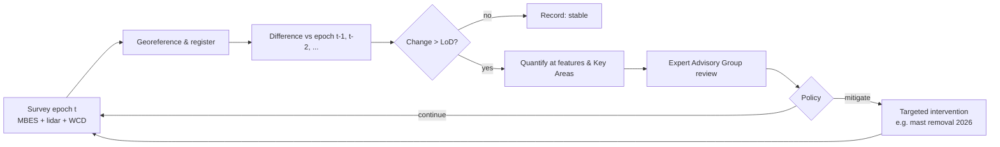

# CS-9 · SS *Richard Montgomery*: 80 years of managing a munitions wreck

**Read after** [07.1 Decisions under uncertainty](lessons/stage-07/lesson-01.md) · **Also exercises** [02.3 Sensitivity, stability & ageing](lessons/stage-02/lesson-03.md), [03.3 Legacy & underwater munitions](lessons/stage-03/lesson-03.md), [05.5 Imaging & remote sensing](lessons/stage-05/lesson-05.md), [06.7 Mapping & SLAM](lessons/stage-06/lesson-07.md), [09.1 Perception tasks](lessons/stage-09/lesson-01.md)

**Estimated time** 2 h (reading 50 min · questions 70 min) · **Level** Advanced

legacy munitionsmonitoringmultibeam sonarlidarchange detectiondeep uncertainty

**Boundary.** The cargo is described only by its total net explosive quantity, as the UK
government publishes it. This case is about monitoring, risk management and decision-making.
It says nothing about handling or disposing of munitions.

## Situation

The SS *Richard Montgomery* was a US Liberty ship of 7,146 gross tons, built in 1943 in
Jacksonville, Florida. In August 1944 she crossed the Atlantic in convoy HX-301 with about
**7,000 tons of munitions** and anchored at the Great Nore off Sheerness, at the mouth of the
Thames, to wait for a convoy to France. On **20 August 1944** she dragged her anchor in shallow
water and **grounded on a sandbank** about 250 m north of the Medway Approach Channel. A crack
appeared in the hull the next day. Salvage continued until **25 September 1944**, by which time
about half the cargo had been removed. Then the ship flooded completely and the work stopped
(MCA, *Background information*).

About **1,400 tons (net explosive quantity) of munitions remain in holds 1–3** of the forward
section. The wreck lies in two sections in about 18 m of water, **1.5 miles from Sheerness** and
5 miles from Southend. All three masts show above the water at every state of the tide (MCA,
2016 and 2025 survey reports).

The UK government's long-standing assessment is that "the risk of a major explosion is believed
to be remote", but that the wreck should be monitored (MCA, *Background information*). The case
is a textbook example of **managing a hazard you cannot easily remove.**

## Technology available

| Period | Monitoring method | Notes |
|---|---|---|
| 1944–1984 | Ministry of Defence salvage divers | Very poor visibility and strong tides make diving difficult and hazardous |
| 1993–2000 | **Sonar surveys** preferred over divers | After 1993, a baseline model of the wreck and seabed was built from sonar |
| 2002 onward | **High-resolution multibeam echosounder (MBES)** | Georeferenced 3D point clouds of the wreck and seabed, repeated regularly |
| 2003, 2013 | Divers for **ultrasonic hull-thickness** measurements and seabed support | Targeted, not routine |
| 2008 onward | **Laser scanning (lidar)** of the parts above water, mainly the masts | Fills the gap MBES cannot see |
| 2016 | Magnetometer survey (March 2016) | Ferrous debris and contacts |
| 2025 | Kongsberg EM2042 MBES plus water-column data; Ouster OS1 lidar on the survey vessel | Denser point clouds; full overlap of MBES and lidar on the masts |

Sources: MCA *Background information*; MCA survey reports 2016 and 2025.

## Information available to decision-makers

**Known**

- The location, the approximate quantity of munitions, and which holds they are in.
- A **time series of georeferenced surveys** since the 1990s, repeated so that each can be
  compared directly with earlier ones.
- **96 tracked features** on the wreck, and **six "Key Areas"** that have repeatedly shown faster
  deterioration (MCA, 2016).
- No evidence that munitions have escaped from the wreck (MCA, 2016).

**Unknown or deeply uncertain**

- The **internal condition** of munitions after 80 years in seawater: corrosion, water ingress,
  degradation of fillings ([02.3](lessons/stage-02/lesson-03.md)).
- The **response of the cargo** to disturbances: structural collapse, a ship strike, or an
  intervention.
- The **probability** of any significant event. There is no reference class of similar wrecks
  large enough to estimate it statistically.
- The **consequences** of an event: they depend on how much of the cargo would react, which
  cannot be predicted with confidence.

This is **deep uncertainty**. Experts cannot agree on the probability distributions, or even on
the structure of the model.

## Hazards

- **Cargo reaction** triggered by structural collapse, a ship strike, trawling, anchoring,
  unauthorised access or a badly planned intervention.
- **Structural deterioration**: plating collapse, cracks, tilting, scour. Heavy masts put load on
  weakened decks and could fall onto them (MCA, 2025).
- **Shipping**: the Medway Approach Channel is about 250 m away.
- **Environmental release** of munition constituents as casings corrode.
- **Intervention risk**: every action on the wreck is itself a potential trigger.

## Decisions

### Decision point 1 (1944 onward) — salvage, destroy, or leave and monitor?

| Known | Unknown |
|---|---|
| Salvage stopped when the ship flooded | The effect of disturbing the remaining cargo |
| The wreck is next to a shipping channel and towns | How the cargo will age |

The long-running policy has been **leave in place, protect and monitor**. The wreck is
designated under **section 2 of the Protection of Wrecks Act 1973**. It is an offence to enter
the prohibited area without permission. The area is marked on Admiralty charts and ringed by
**four lit cardinal buoys and twelve red danger buoys**, and it is under **24-hour radar
surveillance** by Medway Ports (MCA, 2016; MCA *Background information*).

"Leave and monitor" is not doing nothing. It is an **active strategy** that keeps options open
and buys information. Its value depends entirely on whether monitoring would spot a change in
time to act.

### Decision point 2 (1993 onward) — how to monitor

Divers produce detailed local information at high risk and cost, with poor repeatability.
Sonar produces a repeatable, georeferenced, whole-wreck picture at low risk. The MCA moved to
sonar after 1993 and to multibeam from 2002 because it is "faster, more cost-effective" and more
accurate and repeatable than diving in these conditions (MCA, 2016). Divers are kept for
specific measurements (hull thickness in 2003 and 2013).

### Decision point 3 (2017 onward) — intervene partially?

An independent **Expert Advisory Group** was formed in **2017** to advise the Department for
Transport (MCA, 2025). The surveys showed the wreck deteriorating steadily: plating collapsing,
the forward section tilting further east, the seabed eroding. The masts are the heaviest
structures above the decks. Removing or shortening them "should prevent further deflection of
the connected decks, minimise future potential deterioration and mitigate the risk of collapse
onto the decking below" (MCA, 2025). Rigging had already been trimmed from the masts in 1999 to
reduce stress (MCA *Background information*).

The decision trades a **small, controlled, well-planned intervention now** against an
**uncontrolled collapse later**. Plans to remove the masts were first made public in 2020, and
plans from 2022 were delayed (Marine Industry News, 2026). In **July 2026**
the government confirmed that work would begin in **early September 2026**: **£9.5 million**,
specialist marine contractor Resolve Marine, an **underwater platform** from which the three
masts would be cut below sea level over several weeks, the masts to go to the Historic Dockyard
Chatham for preservation, and the **exclusion zone to remain** afterwards. Independent expert
advice concluded that the work could be done "without increasing the risk posed by the
explosives remaining onboard" (DfT & MCA, 14 July 2026).

At the time of writing (September 2026), the work was scheduled to finish by the end of September,
subject to weather. Check the MCA page for the outcome.

## Technology used: monitoring as change detection

Each full survey produces a georeferenced point cloud (MBES below water, lidar above). The core
analysis is **change detection** between epochs:

1. **Register** each epoch to a common datum (GNSS positioning, vertical reference, overlap
   with stable seabed features).
2. **Grid** the point clouds into digital elevation models (DEMs) or compare them point to point.
3. **Difference**: $\Delta z(x,y) = z_t(x,y) - z_{t-1}(x,y)$.
4. **Threshold** against the **level of detection**. If each survey has vertical uncertainty
   $\sigma_t$, the minimum detectable change at about 95% confidence is
   $$\text{LoD}_{95} \approx 1.96\sqrt{\sigma_t^2 + \sigma_{t-1}^2}.$$
   With $\sigma = 0.05$ m for both epochs, $\text{LoD}_{95}\approx 0.14$ m.
5. **Track named features** (96 of them) and **Key Areas** over time, and report quantified
   changes.

Examples from the MCA reports:

| Survey | Observed change (MCA) | Above a 0.14 m LoD? |
|---|---|---|
| 2016 | Key Area 2 deck plating collapsed a further **0.35 m**; an adjacent section of gunwale broke away | Yes |
| 2016 | Holes in hull plating at Key Area 1 grew by **0.2 m**; holes at Hold 2 grew by 0.2 m | Yes, marginally |
| 2016 | Height difference of about **1.5 m** in the gunnery officer's cabin | Yes |
| 2016 | 7 additional seabed contacts; orientation of both sections unchanged; no evidence of munitions escaping | n/a |
| 2025 | **Key Area 6 collapsed by about 2 m** between 2024 and 2025; the forward section's eastward tilt continues to increase; surrounding seabed continues to erode | Yes |

The 2025 report concludes that the Key Area 6 displacement "highlights the rate of
deterioration" and that continued tilt and erosion confirm the importance of regular surveys
(MCA, 2025).

## Outcome (to date)

- More than 80 years with **no major incident**, and **no evidence of munitions escaping** in
  the surveys reported.
- A continuous, public, **repeatable survey record** from 1995 to 2025, published on GOV.UK.
- **Steady structural deterioration** documented quantitatively, which led to the first major
  physical intervention: mast removal, begun in September 2026.
- A standing governance arrangement: MCA, DfT, independent Expert Advisory Group, Medway Ports
  surveillance, and explosives advice for the intervention.

## Lessons learned

1. **"Monitor" is a strategy with a job to do.** It must be able to detect change early enough to
   act. That needs repeatability, georeferencing and a quantified level of detection.
2. **Choose sensors for repeatability, not just resolution.** Multibeam replaced diving because
   it is repeatable and safe at the scale of the whole wreck. Divers still have a role for
   targeted measurements.
3. **Focus on leading indicators.** Tracking features and Key Areas turns a huge point cloud into
   a few quantities that can be trended.
4. **Under deep uncertainty, prefer robust, reversible, small steps.** Mast removal reduces a
   known structural driver without disturbing the cargo. It also keeps the exclusion zone and
   the monitoring regime.
5. **Governance matters as much as technology.** Independent expert advice, public reports and
   a clear lead department make the decision process legitimate and auditable.
6. **Time matters in both directions.** Waiting preserves options, but deterioration closes
   them. The analysis must include the rate at which the "leave" option is losing its value.

## Technological developments that followed

- **Higher-density MBES with water-column data** and **vessel-mounted lidar** giving full overlap
  between the parts below and above water (MCA, 2025).
- **Point-cloud change-detection** methods (DEM differencing, cloud-to-cloud distance, feature
  tracking) that transfer directly to other wreck and infrastructure monitoring. The same
  mathematics as the SLAM and mapping in [06.7](lessons/stage-06/lesson-07.md).
- **Machine learning on survey deltas**: segmentation of wreck components and anomaly detection
  on change maps are natural next steps ([09.1](lessons/stage-09/lesson-01.md)). This is a
  proposed direction, not something the MCA reports describe.
- **Scientific research support** from Dstl (for example, the Dstl final report on research in
  financial year 2016/17, published on the MCA's reports page).
- A precedent for **engineering intervention on a munitions wreck under continuous oversight**
  (the 2026 mast removal).

## Discussion questions

1. Two surveys each have a vertical uncertainty of 0.10 m. What is the 95% level of detection
   for a difference? Would the 2016 hole-size changes of 0.2 m be reliably detected? What does
   this say about survey specifications?

Answer — then reveal

$\text{LoD}_{95} = 1.96\sqrt{0.10^2+0.10^2} = 1.96\times0.141 \approx 0.28$ m. A 0.2 m change
would **not** be reliably detected. It could be noise. The specification must set the
survey's vertical and horizontal accuracy from the *smallest change that matters* for the
decision. Denser point clouds, better positioning (for example, post-processed kinematic GNSS)
and consistent survey geometry all reduce $\sigma$. Feature-based measurement (for example,
the size of a hole edge) can be more precise than raw DEM differencing.

2. Formulate "leave and monitor" versus "intervene now" as a decision under deep uncertainty.
   Explain why minimising expected loss is hard to apply, and describe an alternative criterion
   (for example minimax regret or robust decision-making) and how it would treat mast removal.

Answer — then reveal

Expected-loss minimisation needs a probability for each outcome (collapse, cargo reaction,
consequences), and none can be estimated with confidence. There is no reference class, and the
cargo's condition is unobservable. **Minimax regret** picks the option whose worst-case regret
(the gap to the best option in each scenario) is smallest. **Robust decision-making** looks for
options that perform acceptably across many plausible scenarios. Mast removal does well under
both. In scenarios where collapse is imminent, it removes a driver. In scenarios where the wreck
is stable, it costs money but, by independent expert judgement, does not add risk. The worst-case
regret is low. A full cargo removal has potentially very large regret in scenarios where
disturbance triggers the hazard.

3. The masts will be removed but the exclusion zone stays. Explain in terms of layers of
   protection why that is consistent.

4. Design a data pipeline that ingests each new MBES/lidar survey, registers it to earlier
   epochs, computes change maps with uncertainty, and alerts the Expert Advisory Group. What
   thresholds would you use, and how would you avoid alert fatigue from noise? Link your answer
   to detection theory ([05.1](lessons/stage-05/lesson-01.md)).

5. The forward section's eastward tilt has increased over several surveys. With three or four
   epochs, how would you estimate the tilt rate and its uncertainty? How would you decide whether
   it is accelerating?

Answer — then reveal

Fit a linear model of tilt against time by weighted least squares, using each epoch's
measurement uncertainty as weights. The slope is the rate and its standard error comes from the
fit. To test acceleration, fit a quadratic and check whether the quadratic term is
significantly non-zero, or compare models with an information criterion. With only three or
four points, the power is low. Say so, and consider increasing survey frequency if acceleration
would change the decision. That is the value-of-information argument.

6. Compare this case with the legacy bombs in [CS-8](case-studies/cs08-wwii-legacy-ordnance.md).
   Why does a city evacuate 60,000 people for one bomb, yet the Thames estuary lives next to
   1,400 tons of munitions for 80 years? Discuss probability, consequence, controllability,
   familiarity and the cost of each option.

## Sources

| Title | Organisation / author | Date | URL |
|---|---|---|---|
| SS Richard Montgomery: background information | Maritime and Coastguard Agency (GOV.UK) | updated 11 Mar 2026 | https://www.gov.uk/government/publications/the-ss-richard-montgomery-information-and-survey-reports/ss-richard-montgomery-background-information |
| The SS Richard Montgomery: Information and survey reports (index of reports 1995–2025) | Maritime and Coastguard Agency (GOV.UK) | updated 11 Mar 2026 | https://www.gov.uk/government/publications/the-ss-richard-montgomery-information-and-survey-reports |
| SS Richard Montgomery Survey Report 2016 | Maritime and Coastguard Agency | Jan 2019 | https://assets.publishing.service.gov.uk/media/5cf5309ae5274a79460b5407/SSRM_Survey_Report_2016.pdf |
| SS Richard Montgomery: Survey report 2025 | Maritime and Coastguard Agency | 16 Oct 2025 | https://assets.publishing.service.gov.uk/media/699c2f41d2b9c6ec5b6fbb84/SS-richard-montgomery-annual-survey-report-2025.pdf |
| Safe removal of masts from historic WWII shipwreck carrying wartime explosives begins | Department for Transport, MCA and Keir Mather MP (GOV.UK news) | 14 Jul 2026 | https://www.gov.uk/government/news/safe-removal-of-masts-from-historic-wwii-shipwreck-carrying-wartime-explosives-begins |
| SS Richard Montgomery mast removal begins | Marine Industry News | 2026 | https://marineindustrynews.co.uk/mast-removal-begins-on-sunken-wwii-bomb-ship-in-thames/ |
| Protection of Wrecks Act 1973 | UK legislation | 1973 | https://www.legislation.gov.uk/ukpga/1973/33 |
| Webinar Report: The Use of Remote Sensing and Artificial Intelligence in the Mine Action Sector | GICHD and ICRC | Apr 2021 | https://www.gichd.org/fileadmin/uploads/gichd/Publications/ICRC_GICHD_Webinar_Report_-_The_Use_of_Remote_Sensing_and_Artificial_Intelligence_in_the_Mine_Action_Sector.pdf |
