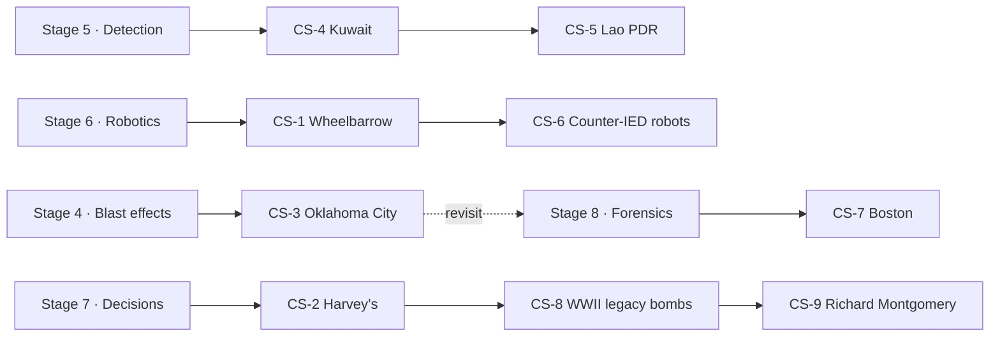

# Case studies

Nine researched historical cases, each worked through in the same order: **Situation ·
Technology available · Information available · Hazards · Decisions (known / unknown at each
decision point) · Technology used · Outcome · Lessons learned · Technological developments that
followed · Discussion questions · Sources.**

Read each case after the stage whose concepts it exercises. The cases are not stories to
memorise. They are **worked examples of reasoning under uncertainty**, with real data, and every
one ends with quantitative or design questions.

**What is deliberately left out.** Devices are described only at the level of "a large
improvised device" or by munition type and mass as published in the press. No construction,
components, initiation, or render-safe or disposal technique appears in any case. Where a public
source (for example an FBI history page) gives more detail, the case study does not reproduce
it. The analysis in each case works at the level of decisions, systems, physics of effects,
forensics method, data and organisations. That is where the lessons are, and it keeps the course
inside its safety boundary.

## Index

| Case | Year | Themes | Related lessons | Read after |
|---|---|---|---|---|
| [CS-1 · Wheelbarrow: origin of the remote-handling robot](case-studies/cs01-wheelbarrow.md) | 1972 | Remote means; time–distance–shielding as an exposure integral; "the robot is the consumable"; rapid iteration | [06.1](lessons/stage-06/lesson-01.md), [06.5](lessons/stage-06/lesson-05.md), [06.9](lessons/stage-06/lesson-09.md), [07.2](lessons/stage-07/lesson-02.md), [00.2](lessons/stage-00/lesson-02.md) | Stage 6 (after 06.1) |
| [CS-2 · Harvey's Resort Hotel](case-studies/cs02-harveys-1980.md) | 1980 | Deep uncertainty; no-regret actions; value of information; decision vs outcome quality; radiography; training | [07.1](lessons/stage-07/lesson-01.md), [07.2](lessons/stage-07/lesson-02.md), [05.3](lessons/stage-05/lesson-03.md), [03.4](lessons/stage-03/lesson-04.md) | Stage 7 |
| [CS-3 · Oklahoma City](case-studies/cs03-oklahoma-city.md) | 1995 | Progressive collapse (4% vs 42% of floor area); alternate-path design; forensic scale; protective design standards | [04.3](lessons/stage-04/lesson-03.md), [04.2](lessons/stage-04/lesson-02.md), [01.6](lessons/stage-01/lesson-06.md), [08.1](lessons/stage-08/lesson-01.md), [08.2](lessons/stage-08/lesson-02.md) | Stage 4 (revisit after Stage 8) |
| [CS-4 · Kuwait post-1991 clearance](case-studies/cs04-kuwait-clearance.md) | 1991–95 | National-scale contracted clearance; sectorisation; QA as acceptance sampling; deminer casualties | [05.7](lessons/stage-05/lesson-07.md), [05.1](lessons/stage-05/lesson-01.md), [03.3](lessons/stage-03/lesson-03.md) | Stage 5 |
| [CS-5 · Lao PDR cluster munitions](case-studies/cs05-laos-cluster-munitions.md) | 1964–today | Evidence-based survey (CMRS); land release; spatial clustering; IMSMA and data quality; metrics | [05.7](lessons/stage-05/lesson-07.md), [03.3](lessons/stage-03/lesson-03.md), [05.5](lessons/stage-05/lesson-05.md), [09.5](lessons/stage-09/lesson-05.md) | Stage 5 |
| [CS-6 · Counter-IED robots in Iraq and Afghanistan](case-studies/cs06-counter-ied-robots.md) | 2002–18 | PackBot/TALON; JIEDDO; fleet fragmentation and consolidation; interoperability; HRI (Carpenter) | [06.1](lessons/stage-06/lesson-01.md), [06.5](lessons/stage-06/lesson-05.md), [06.9](lessons/stage-06/lesson-09.md), [09.6](lessons/stage-09/lesson-06.md) | Stage 6 |
| [CS-7 · Boston Marathon](case-studies/cs07-boston-2013.md) | 2013 | Scene management; 33 TB of media; crowdsourced imagery; clock synchronisation and timeline reconstruction; video analytics | [08.1](lessons/stage-08/lesson-01.md), [08.2](lessons/stage-08/lesson-02.md), [08.3](lessons/stage-08/lesson-03.md), [09.1](lessons/stage-09/lesson-01.md), [07.2](lessons/stage-07/lesson-02.md) | Stage 8 |
| [CS-8 · WWII legacy bombs: Frankfurt and London City Airport](case-studies/cs08-wwii-legacy-ordnance.md) | 2017, 2018 | Mass evacuation (~60,000); exclusion zones as policy; compliance; infrastructure disruption; aerial-photo analysis | [07.2](lessons/stage-07/lesson-02.md), [02.3](lessons/stage-02/lesson-03.md), [03.2](lessons/stage-03/lesson-02.md), [04.4](lessons/stage-04/lesson-04.md), [01.5](lessons/stage-01/lesson-05.md) | Stage 7 |
| [CS-9 · SS *Richard Montgomery*](case-studies/cs09-ss-richard-montgomery.md) | 1944–2026 | Long-term monitoring; multibeam and lidar change detection; level of detection; deep uncertainty; mast removal (2026) | [07.1](lessons/stage-07/lesson-01.md), [02.3](lessons/stage-02/lesson-03.md), [03.3](lessons/stage-03/lesson-03.md), [05.5](lessons/stage-05/lesson-05.md), [06.7](lessons/stage-06/lesson-07.md) | Stage 7 |

## Suggested reading order

## Cross-cutting threads

| Thread | Cases | Question to carry across |
|---|---|---|
| Exposure and remote means | CS-1, CS-2, CS-6 | What does a machine buy, and what does it cost? |
| Decisions under deep uncertainty | CS-2, CS-8, CS-9 | Which actions are robust when probabilities are unknown? |
| Survey, sampling and QA | CS-4, CS-5, CS-9 | How do you bound what you have *not* found? |
| Data at scale | CS-3, CS-5, CS-7 | What data model makes the evidence usable? |
| Standards born from incidents | CS-3, CS-4, CS-6 | Which standard came from which failure? |
| Estimates vs evidence | CS-4, CS-5, CS-7 | How wrong were the first numbers, and why? |

## How to use a case

1. Read the **Situation** and **Information available**, then stop. Before reading on, write
   down what you would have decided at each decision point.
2. Read **Decisions** and compare. Separate the quality of the decision from the outcome
   ([CS-2](case-studies/cs02-harveys-1980.md) makes this explicit).
3. Work the **Discussion questions** in writing. Where an answer is hidden, attempt it first.
4. Follow at least one **Source** to the primary document, and check one number yourself.

Figures are quoted from the cited sources. Where sources disagree (Boston injury counts, Kuwait clearance cost, the mass of the Frankfurt bomb), the case says so
rather than choosing one silently.
