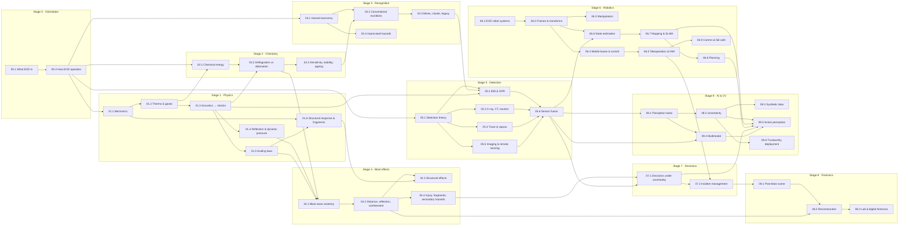

# Curriculum — complete outline & dependency graph

This is deliverable **1 (complete curriculum)** and **2 (dependency graph)** from `plan.md` §23.
The per-module specifications (objectives, theory, reading, visual, exercise, simulation, code,
assessment, time, next) are in [module-specs.md](module-specs.md); how the structure was derived
from real training pathways is in [research-synthesis.md](research-synthesis.md).

## Design principles

1. **Derived, not invented.** The knowledge domains come from comparing public descriptions of
   military EOD schools, police bomb-technician certification, humanitarian mine-action
   standards (IMAS/IATG), NATO EOD doctrine and university explosives/blast/forensics programmes
   (see [research-synthesis.md](research-synthesis.md)). Where those pathways teach
   *operational* skills (render-safe, demolition, live ordnance handling), this course teaches
   the **science, engineering and decision framework underneath** instead.
2. **Dependency-aware.** Every lesson lists hard prerequisites; the graph below is acyclic and
   each stage only uses mathematics introduced earlier (or assumed from an engineering degree).
3. **Simulation-first.** Every stage has at least one interactive simulator or programming
   project; reading supports doing, not the other way round.
4. **Engineer-adapted.** The maths is not diluted. Robotics, sensing and AI (Stages 5, 6, 9) are
   the deepest sections because they map onto the learner's background and onto where the
   field is changing fastest.
5. **Hard safety boundary.** No formulations, device construction, render-safe or defeat
   procedures, no actionable initiation/timing/wiring content. See [CLAUDE.md](../CLAUDE.md).

## Stage map

| Stage | Title | Lessons | Level | Core maths | Simulators / projects | Est. hours |
|---|---|---|---|---|---|---|
| 0 | Orientation | 00.1–00.2 | Beginner | — | Sim A (tutorial mode) | 6 |
| 1 | Physics foundations | 01.1–01.6 | Beginner→Int. | calculus, ODEs, dimensional analysis | Shock-tube explorer, P01 | 30 |
| 2 | Chemistry & energetic materials (science) | 02.1–02.3 | Intermediate | thermochemistry, Arrhenius kinetics | CJ/ZND explorer | 18 |
| 3 | Explosive hazards & ordnance recognition | 03.1–03.4 | Beginner→Int. | — (classification, risk) | Recognition trainer (Sim H) | 16 |
| 4 | Blast effects | 04.1–04.4 | Intermediate | scaling laws, SDOF ODEs, P–I | Sim D, P01 | 24 |
| 5 | Detection | 05.1–05.6 | Int.→Adv. | detection theory, Bayes, signals, EM, attenuation | Sim C, P02, P03 | 36 |
| 6 | Robotics | 06.1–06.9 | Int.→Expert | linear algebra, Lie groups (light), control, KF, SLAM, planning | Sim B, Sim G, P04–P08, P11 | 60 |
| 7 | EOD decision-making | 07.1–07.2 | Advanced | decision theory, VOI, POMDP intuition | Sim A, Sim F, P12 | 14 |
| 8 | Forensics & post-blast investigation | 08.1–08.3 | Advanced | inverse problems, photogrammetry, Bayesian reconstruction | Sim E | 18 |
| 9 | AI & computer vision for EOD | 09.1–09.6 | Advanced→Expert | deep learning, calibration, conformal prediction, info gain | P09, P10, P12 | 48 |
| 10 | Case studies & professional practice | CS-1…CS-8 | All | — | — | 16 |
| — | Capstones | C1–C4 | Expert | all | full stack | 60–120 |

Total ≈ **350–400 hours** (a serious part-time year).

## Complete lesson list

### Stage 0 — Orientation
- **00.1** What EOD is: the field, its organisations and its vocabulary (military EOD, police bomb disposal, humanitarian mine action, ammunition technical work; UXO/ERW/AXO/IED/EH; the life-cycle of an explosive hazard).
- **00.2** How EOD organisations operate: command structure, the incident life-cycle, roles (technician/operator/team leader/ATO/bomb tech), certification, why the training is long, and the technology stack of a modern team.

### Stage 1 — Physics foundations
- **01.1** Mechanics refresher for energetic events: energy, work, power, force, pressure, momentum, impulse, conservation laws, control volumes.
- **01.2** Gases and thermodynamics: ideal & real gases, first/second law, adiabatic processes, specific heats, enthalpy, heat transfer modes.
- **01.3** Waves: from acoustics to shocks — linear acoustics, nonlinear steepening, normal shocks, Rankine–Hugoniot, shock Mach number ↔ overpressure.
- **01.4** Reflection, transmission, dynamic pressure: impedance, normal & oblique reflection, Mach stem, stagnation & dynamic pressure, drag loading.
- **01.5** Dimensional analysis and scaling laws: Buckingham Π, Hopkinson–Cranz cube-root scaling, Sachs scaling, similarity, where scaling breaks.
- **01.6** Structural response and fragmentation physics (conceptual): SDOF oscillators, impulsive vs quasi-static regimes, pressure–impulse diagrams, energy methods, fragment velocity/deceleration and statistics at a conceptual level.

### Stage 2 — Chemistry and energetic materials (science only)
- **02.1** Chemical energy: redox, combustion, bond energies, enthalpy of formation/reaction, Hess's law, gas generation, adiabatic flame temperature, Arrhenius kinetics — with non-explosive textbook examples.
- **02.2** Deflagration vs detonation: flame propagation, deflagration-to-detonation transition (concept), Chapman–Jouguet theory, ZND structure, detonation as a reactive shock.
- **02.3** Sensitivity, stability, ageing and classification: hazard divisions (UN Class 1, 1.1–1.6), compatibility groups, sensitivity concepts (impact/friction/ESD/thermal — what is measured and why), thermal runaway (Semenov/Frank-Kamenetskii), stabiliser depletion and why old ordnance is dangerous.

### Stage 3 — Explosive hazards and ordnance recognition
- **03.1** Taxonomy of explosive hazards: EO, UXO, AXO, ERW, IEDs, mines, CBRN overlap; ammunition categories and marking conventions; why the category drives the professional response.
- **03.2** Conventional munitions families: projected (artillery, mortar, rocket), thrown (grenades), dropped (aircraft bombs, submunitions), placed (mines, demolition stores) — features used for recognition, and fuzing/safety-and-arming as a *design concept* (why fired/dropped ordnance may be more hazardous than stored ordnance).
- **03.3** Landmines, cluster munitions, abandoned & historical ordnance: humanitarian context, legacy contamination (WWI/WWII, Indochina), degradation over decades, underwater/dumped munitions.
- **03.4** Improvised explosive hazards and vehicle-related hazards at the recognition level: the concept of an improvised hazard, indicators and the "suspicious item" assessment (unattended vs suspicious), victim-operated vs command concepts as *threat categories*, why every improvised item is treated as unique, and the counter-IED "defeat the network / train the force / defeat the device" framework.

### Stage 4 — Blast effects
- **04.1** Anatomy of a blast wave: Friedlander waveform, peak overpressure, positive/negative phase, impulse, arrival time, the physics behind the curves.
- **04.2** Distance, reflection, confinement, urban environments: scaled distance, reflected pressure, Mach reflection, internal (confined) blast & quasi-static pressure, venting, channelling in streets.
- **04.3** Structural effects: glazing, walls, frames; SDOF & P–I diagrams; progressive collapse concept; protective design philosophy and quantity-distance.
- **04.4** Injury mechanisms, fragmentation & secondary hazards: primary/secondary/tertiary/quaternary blast injury, fragment hazards, standoff and evacuation distances as *published public-safety tables*, secondary hazards (fire, structural, secondary devices, CBRN, utilities).

### Stage 5 — Detection
- **05.1** Detection theory: signal detection, ROC, base rates, Bayes, false-alarm economics in mine clearance, test & evaluation (e.g. CWA 14747 style trials).
- **05.2** Electromagnetic induction & ground-penetrating radar: eddy currents, pulse induction vs frequency domain, soil effects, GPR physics, hyperbolas, clutter.
- **05.3** Penetrating radiation: X-ray attenuation, portable radiography, dual-energy material discrimination, backscatter, CT reconstruction, neutron-based interrogation concepts.
- **05.4** Trace and vapour detection: vapour pressure, sampling, ion-mobility spectrometry, mass spectrometry, colorimetry, canines, false positives from interferents.
- **05.5** Imaging and remote sensing: millimetre-wave, thermal IR (diurnal contrast of buried objects), acoustic/seismic, hyperspectral, drones for non-technical survey.
- **05.6** Sensor fusion: Bayesian fusion, Dempster–Shafer (and its pitfalls), feature- vs decision-level fusion, correlated errors, sensor selection by expected information gain.

### Stage 6 — Robotics
- **06.1** EOD robot systems: history (Wheelbarrow → PackBot/TALON/tEODor → modern common robotic systems), architecture (mobility, manipulation, sensing, comms, OCU), requirements & standard test methods (NIST/ASTM E54.09).
- **06.2** Spatial mathematics: coordinate frames, rotations (SO(3)), homogeneous transforms (SE(3)), composition, camera frames, pan/tilt kinematics.
- **06.3** Manipulators: DH/product-of-exponentials, forward & inverse kinematics, Jacobians, singularities, manipulability, grippers & grasp basics.
- **06.4** Mobile bases and control: tracks vs wheels, skid-steer kinematics, terrain & stairs, PID and state-space control, motor/battery models.
- **06.5** Teleoperation & human–machine interfaces: latency and its effect on control, move-and-wait, predictive displays, supervisory control, force feedback & haptics, situational awareness, workload.
- **06.6** State estimation: Bayes filter, Kalman filter, EKF, UKF (concept), particle filter, localization.
- **06.7** Mapping & SLAM: occupancy grids, scan matching, EKF-SLAM, graph SLAM, loop closure, visual/LiDAR SLAM in practice.
- **06.8** Path & motion planning: graph search (Dijkstra/A*), sampling (RRT/RRT*), cost maps, coverage planning for survey, arm motion planning.
- **06.9** Communications, reliability & fail-safe design: radio propagation, link budgets, relays/tethers, loss-of-comms behaviours, FMEA, fault trees, reliability maths.

### Stage 7 — EOD decision-making
- **07.1** Decisions under uncertainty: the incident as a sequential decision problem, hypotheses and evidence, value of information, exposure minimisation, belief-state (POMDP) framing, cognitive biases.
- **07.2** Incident management at the conceptual level: cordons and isolation logic, information gathering, sensor/robot tasking, secondary hazards, evacuation considerations, evidence preservation, escalation to specialist resources, ICS/command interfaces.

### Stage 8 — Forensics and post-blast investigation
- **08.1** The post-blast scene: scene safety, zoning, search patterns, documentation (photography, measurement), evidence collection & chain of custody.
- **08.2** Reconstruction as an inverse problem: seat location from damage/fragment patterns, crater and damage-pattern interpretation (conceptual), displacement analysis, Bayesian reconstruction, 3D scene capture (photogrammetry, LiDAR).
- **08.3** Laboratory and digital forensics: material identification methods (what the lab does, not how to make anything), standards (OSAC/ASTM), digital reconstruction, computer vision for evidence triage.

### Stage 9 — AI and computer vision for EOD
- **09.1** Perception tasks: classification, detection, segmentation, anomaly detection for EOD imagery (RGB/thermal/X-ray/GPR); metrics that matter (recall at fixed FAR).
- **09.2** Uncertainty-aware ML: aleatoric vs epistemic, calibration, deep ensembles, MC dropout, conformal prediction, selective prediction / abstention.
- **09.3** Synthetic data & sim-to-real: procedural scene generation, domain randomisation, domain adaptation, validating on real data.
- **09.4** Multimodal sensing: camera + depth + thermal fusion, low-light and IR processing, calibration & registration between sensors.
- **09.5** Active perception & autonomous exploration: next-best-view, information-gain planning, frontier exploration, risk-aware autonomy.
- **09.6** Trustworthy deployment: adversarial robustness, explainability, edge inference, human-in-the-loop design, false-positive management, test & evaluation.

### Stage 10 — Case studies & professional practice
Researched historical case studies (see [case-studies](../case-studies/index.md)) placed after the
stage whose concepts they exercise.

### Capstones
C1 Autonomous EOD robot mission (robotics + CV + fusion + localization + planning + uncertainty
+ HITL + visualisation), C2 Humanitarian survey optimiser, C3 Post-blast digital reconstruction
lab, C4 Decision-support system with calibrated risk. See [capstones](../capstones/index.md).

## Dependency graph

Solid arrows are hard prerequisites. Case studies and simulators hang off the lessons they
exercise.

### Reading the graph (critical paths)

- **Physics path:** 01.1 → 01.2 → 01.3 → {01.4, 01.5} → 04.1 → 04.2 → {04.3, 04.4} → 08.2.
- **Sensing path:** 05.1 → {05.2–05.5} → 05.6 → 06.6 → 09.1 → 09.2 → 09.5.
- **Robotics path:** 06.1 → 06.2 → {06.3, 06.4 → 06.5 → 06.9, 06.6 → 06.7 → 06.8} → 09.5 → Capstone C1.
- **Decision path:** 03.x + 04.4 + 05.6 → 07.1 → 07.2 → 08.1.

A learner with the robotics background can fast-track Stage 6 math lessons (06.2, 06.3, 06.6) by
passing their assessments first — but should not skip 06.1, 06.5 and 06.9, which carry the
EOD-specific engineering constraints.

## Beginner / intermediate / advanced mapping

| Level | What it means here | Lessons |
|---|---|---|
| Beginner | vocabulary, organisation, hazard categories, basic mechanics | 00.x, 01.1–01.2, 03.1 |
| Intermediate | quantitative physics & chemistry, recognition reasoning, blast effects, individual sensors | 01.3–01.6, 02.x, 03.2–03.4, 04.x, 05.1–05.5, 06.1–06.4 |
| Advanced | fusion, estimation, teleoperation, decision-making, forensics | 05.6, 06.5–06.9, 07.x, 08.x, 09.1–09.4 |
| Expert | autonomy, active perception, trustworthy AI, capstones | 09.5–09.6, expert extensions, C1–C4 |

## Academic vs operational (what this course does with each)

| Domain (from training pathways) | Taught academically? | Taught operationally? | This course |
|---|---|---|---|
| Explosives science, blast physics | yes (universities, ATO courses) | partly | **full depth** |
| Ordnance recognition | partly (IMAS, ATO) | yes | categories, recognition features, *why* response differs |
| Render-safe / disposal procedures | no | yes (restricted) | **excluded** — decision framework only |
| Demolition / explosive handling | no | yes | **excluded** |
| Detection technology | yes | yes (equipment use) | full physics + T&E + ML |
| Robotics & remote means | yes (research) | yes (operator training) | full engineering depth |
| Incident command / cordons | yes (ICS, public doctrine) | yes | conceptual decision-making + simulators |
| Post-blast investigation | yes (forensic science) | yes | scientific method + reconstruction sims |
| Ammunition management / storage safety | yes (IATG, DDESB) | yes | classification, QD concepts, ageing |
