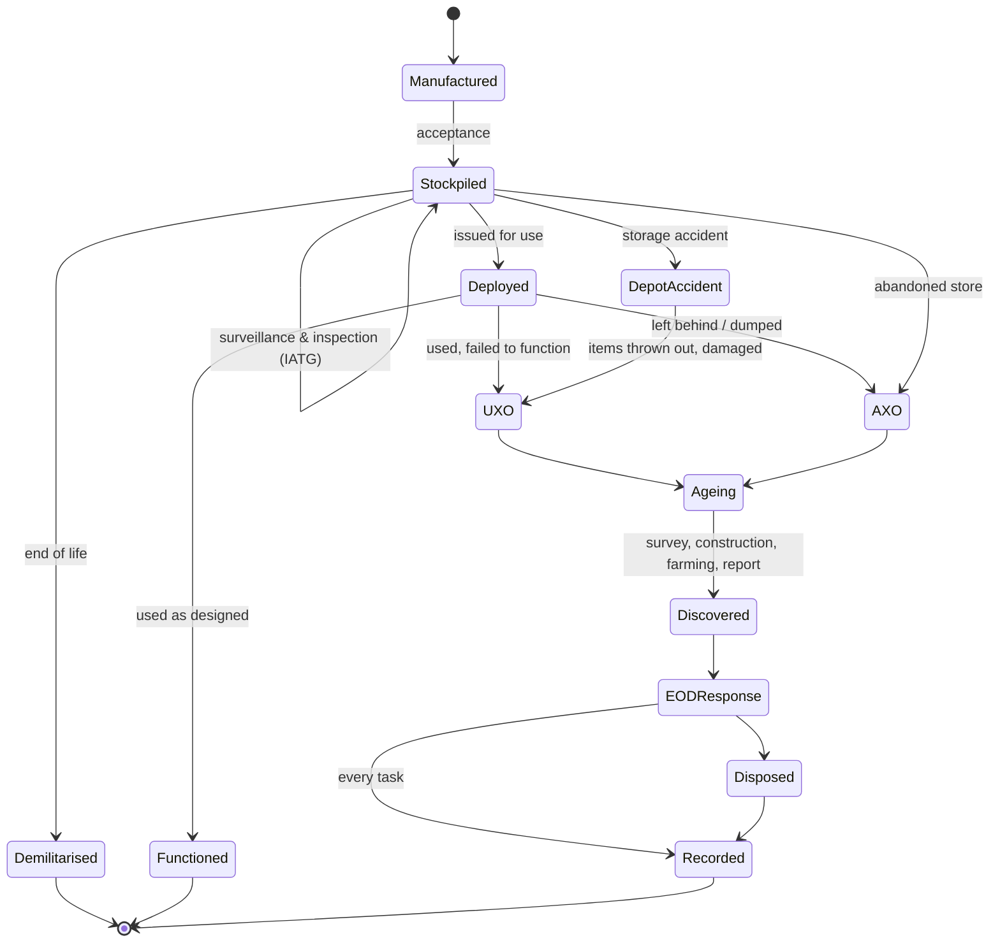
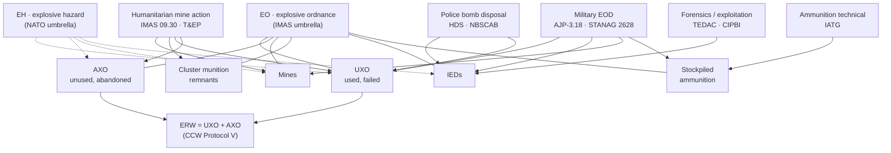

# 00.1 · What EOD is: the field, its organisations and its vocabulary

<div class="module-card">

**Prerequisites** None. This is the entry point of the course. It helps to have skimmed the [course outline](curriculum/course-outline.md).

**Estimated time** 3 h (1.5 h reading · 1 h classification exercises · 0.5 h programming)  ·  **Level** Beginner

**Next** [00.2 How EOD organisations operate](lessons/stage-00/lesson-02.md), then [01.1 Mechanics refresher](lessons/stage-01/lesson-01.md).

<p class="tags"><span>orientation</span><span>terminology</span><span>standards</span><span>IMAS</span><span>AJP-3.18</span><span>taxonomy</span></p>
</div>

## Why this matters

"Bomb disposal" is not one profession. It is at least four: **military EOD**, **police bomb
disposal**, **humanitarian mine action** and **ammunition technical work**. Each has its own
standards, legal basis, training pipeline and vocabulary. The same physical object, say a corroded
80-year-old projectile in a building site, can fall to a municipal ordnance-disposal service in
one country, an army team in another and a mine-action operator in a third. The label it gets
(*UXO*, *AXO*, *ERW*, *explosive hazard*) decides which legal regime applies, who is authorised to
respond, how it is recorded and who pays.

If you build technology for this field (a robot, a detector, a classifier, a reporting system), you
need this map first. Requirements in the field are written in this vocabulary. A dataset labelled
"UXO" by a humanitarian operator and one labelled "EH" by a military unit may not mean the same
thing. And the people who will use your system have trained for months or years inside one of these
institutions. Their mental models are the ones you are designing for.

## Learning objectives

By the end of this lesson you can:

1. Name the four professional domains of EOD and state, for each, its governing standards, the
   typical legal context and the typical responder.
2. Define EO, UXO, AXO, ERW, IED, mine and explosive hazard (EH) as IMAS and NATO use them, and
   identify where the two vocabularies differ.
3. Classify a described (fictional) situation into a hazard category and a responsible organisation,
   and justify the classification from the definitions rather than from intuition.
4. Draw the life-cycle of an explosive hazard from manufacture to final disposal and say at which
   stages each domain intervenes.
5. Distinguish the role titles (bomb technician, EOD operator/technician, Ammunition Technician,
   ATO, IEDD operator, deminer, EOD Level 1–3 operator) and relate them to their certifying bodies.
6. Explain, with a simple reliability model, why training is long and why recertification exists.

## Theory

### 1. Four domains, one core

Every public training pathway surveyed for this course converges on the same core knowledge:
explosives science, effects, electricity, ordnance recognition, safety and risk, and command and
reporting. Different institutions then wrap that core in different missions
([research-synthesis](curriculum/research-synthesis.md)).

| Domain | Mission | Main standards / governance | Typical responders | Typical hazard |
|---|---|---|---|---|
| **Military EOD** | Keep forces and operations moving; protect bases, routes, airfields, ports; support Counter-IED | NATO **AJP-3.18** (STANAG 2628); national doctrine | Service EOD technicians (e.g. US joint-service graduates of NAVSCOLEOD); UK RLC and Royal Engineers | Everything, including enemy ordnance, IEDs, underwater and CBRN in specialist units |
| **Police / public-safety bomb disposal** | Protect the public during civil incidents; preserve evidence for prosecution | US: FBI **Hazardous Devices School** certification + **NBSCAB** *National Guidelines*; national equivalents (Canada PETC, Australian national diploma) | Bomb technicians in police/fire bomb squads | Suspicious items, IEDs, found legacy ordnance, hoaxes |
| **Humanitarian mine action** | Return land to safe use after conflict; reduce civilian casualties | **IMAS** (UNMAS/GICHD), especially IMAS 09.30 and T&EP 09.30/09.31; national mine-action authorities | Deminers, EOD Level 1–3 operators working for national or NGO/commercial operators | Mines, cluster-munition remnants, UXO, AXO, sometimes IEDs |
| **Ammunition technical work** | Through-life safety of stockpiles: storage, transport, inspection, surveillance, demilitarisation, accident investigation | **IATG** (UNODA / UN SaferGuard); national regulations | Ammunition Technicians and ATOs (UK); ammunition handlers, inspectors and managers (IATG 01.90) | Stored and aged ammunition, depot explosions, bulk disposal |

Two more communities sit at the edges. **Forensic and technical exploitation** includes post-blast
investigation, laboratory analysis and bodies such as the FBI's TEDAC and the ATF's certified
explosives specialists. **Civil legacy-ordnance services** include, for example, the German state
*Kampfmittelräumdienst* that deals with WWII bombs found during construction.

<div class="callout key">

**Key idea.** The domains differ mainly in **mission, legal basis and risk tolerance**, not in
physics. A humanitarian operator clearing a field must reach a very high confidence that the land
is clear, because farmers will walk on it. A military team clearing a route under time pressure
accepts a different trade-off. A police squad must also preserve evidence. The same sensor or robot
therefore gets different requirements in each domain.

</div>

### 2. The vocabulary: IMAS and NATO definitions

Two families of definitions dominate. **IMAS 04.10** (the IMAS glossary of mine-action terms)
serves the humanitarian sector. The **AJP-3.18 lexicon** and NATO terminology serve military EOD.
The definitions below are *paraphrased*. For normative wording, consult the documents themselves.

| Term | Meaning (paraphrased) | Key discriminator | Notes |
|---|---|---|---|
| **EO**: explosive ordnance | Any munition containing explosives, nuclear fission or fusion materials, or biological or chemical agents. This covers bombs, warheads, missiles, artillery, mortar, rocket and small-arms ammunition, mines, torpedoes, depth charges, pyrotechnics, cluster munitions and dispensers, cartridge- and propellant-actuated devices, electro-explosive devices, improvised devices, and similar items or components that are explosive in nature | Is it (or does it contain) an explosive or CBRN munition item? | The umbrella term. Recent IMAS editions use "EO" for the whole contamination problem that mine action deals with |
| **UXO**: unexploded ordnance | EO that was primed, fuzed, armed or otherwise prepared for use, **and was used**: fired, dropped, launched or projected. It should have functioned but did not | *Used* and *failed* | Its internal state is unknown. This is why UXO is treated as more hazardous than the same item in a store (03.2) |
| **AXO**: abandoned explosive ordnance | EO **not used** in conflict, left behind or dumped by a party to the conflict, and no longer under that party's control | *Not used*, *abandoned* | May or may not have been prepared for use. Examples: abandoned stockpiles, dumped crates |
| **ERW**: explosive remnants of war | **UXO + AXO** | Legal category | Defined in CCW Protocol V (2003). **Mines are excluded** from ERW in that instrument because other treaties cover them |
| **Mine** | A munition designed to be placed under, on or near the ground or another surface, and to function because a person or vehicle is present, near or in contact | Victim-activated by design | Anti-personnel mines are regulated by the Anti-Personnel Mine Ban Convention (1997) |
| **Cluster munition / submunition** | A container that disperses many explosive submunitions | Area effect, high item counts | Unexploded submunitions are the dominant legacy problem in Lao PDR ([cs05](case-studies/cs05-laos-cluster-munitions.md)) |
| **IED**: improvised explosive device | A device placed or fabricated in an improvised manner that incorporates explosive or other harmful materials, designed to destroy, incapacitate, harass or distract | *Improvised*, not a manufactured munition | May incorporate military items. Every IED is treated as unique (03.4) |
| **EH**: explosive hazard | NATO/military umbrella for any hazard containing an explosive component: UXO, AXO, IEDs, mines, captured or bulk munitions | Operational umbrella | Military counterpart of the IMAS "EO" umbrella. **Do not assume the two map one-to-one** |
| **EOD** | Detection, identification, on-site evaluation, rendering safe, recovery and final disposal of EO | An *activity*, not an object | In this course the render-safe and disposal stages appear only as **named stages and decision concepts** |

<div class="callout hazard">

**Why the label matters.** "UXO" versus "AXO" is not pedantry. A used-and-failed item may be in an
unknown, partly armed state. An abandoned item that was never used is usually (not always) in its
as-manufactured safe condition. The category is a *prior* on the item's internal state. That prior
drives the whole response, which is exactly the Bayesian framing you will formalise in 07.1.

</div>

### 3. The life-cycle of an explosive hazard

An explosive item has a life that spans decades and several institutions. A life-cycle view shows
where each domain intervenes and where data about the item can be captured. It also shows why
legacy ordnance, the subject of 03.3, is a problem of ageing chemistry (02.3) as much as of
recognition.



- **Stockpile phase.** This is the ammunition-technical domain: storage, compatibility, transport,
  surveillance of chemical stability (IATG 07.10; 02.3).
- **Use phase.** A fraction of items fails to function and becomes UXO. Clearance can be
  planned at scale only if that fraction and the use density can be estimated (05.7).
- **Ageing phase.** This can last decades. Corrosion, migration of materials and stabiliser depletion
  change the item's state in ways a technician cannot see from outside.
- **Discovery and response.** Here the domains meet: police for a civil find, military on
  operations, a mine-action operator in a post-conflict survey.
- **Record.** Every task produces data that goes into national databases, threat reports and
  forensic repositories. This is the software engineer's natural entry point (00.2).

Improvised devices have a different life-cycle, one that starts with an adversary network. That is
why NATO's Counter-IED approach separates *defeat the device* from *attack the network* and
*prepare the force*. EOD contributes mainly to the first and, through technical exploitation, to the
second (AJP-3.18).

### 4. Who does the work: role titles

| Title | Domain | What it denotes | Certifying / training body (public descriptions) |
|---|---|---|---|
| **Bomb technician** | US public safety | Police/fire officer certified to respond to hazardous devices | FBI Hazardous Devices School (≈ 6-week basic course, recertification every 3 years); NBSCAB guidelines |
| **EOD technician / operator** | Military | Service member qualified in EOD across ordnance families | e.g. NAVSCOLEOD (≈ 41–42 weeks basic); US Army 89D (≈ 7 weeks Phase 1 + ≈ 7 months Phase 2) |
| **Ammunition Technician (AT)** | UK Army (RLC) | Ammunition engineer first, EOD/IEDD operator second | ≈ 9-month basic course incl. a science phase (maths, physics, chemistry, electronics); Class 2 → Class 1 after ≈ 3 years |
| **Ammunition Technical Officer (ATO)** | UK Army (RLC) | Commissioned officer; commands EOD troops or ammunition units | ≈ 17–20-month technical course (Defence Academy + DEMS) |
| **IEDD operator** | Military, mine action | Qualified for improvised devices | National schools; UN IEDD Standards; T&EP 09.31 L1–L3+ |
| **EOD Level 1 / 2 / 3 / 3+** | Humanitarian | Ladder of competence and authority | IMAS 09.30 + T&EP 09.30 (93 / 89 / 156 competencies for L1/L2/L3, six 3+ modules) |
| **Deminer / searcher** | Humanitarian | Detection and excavation in clearance, under supervision | National mine-action authority accreditation |
| **Police explosives technician** | Canada | Police bomb-response role | Canadian Police College PETC (24 days + online pre-course), revalidation every 3–5 years |

"EOD operator", "bomb tech" and "ATO" are often used interchangeably in the press. They are not the
same. An ATO's first identity is *ammunition engineer*. A bomb technician's is *police officer*.
An EOD Level 3 operator's authority is to lead a mine-action team within a certified NEQ limit
(Level 3: net explosive quantity up to 50 kg).

### 5. Why the training is long: a reliability argument

The public course lengths above range from weeks (for already-experienced police officers) to about
20 months (ATO). Three structural reasons explain the length:

1. **Breadth.** NAVSCOLEOD's divisions list Core, Demolition, Tools & Methods, Ground Ordnance, Air
   Ordnance, IEDs, Underwater, Bio/Chem and Nuclear. Each covers both domestic and foreign items.
2. **Science before procedure.** The UK AT pipeline puts mathematics, physics, chemistry,
   metallurgy and electronics *first*. Army Phase 1 and HDS put electricity first. The reason is
   that an unknown or improvised item cannot be handled from a lookup table. It has to be reasoned
   about from principles.
3. **Error intolerance.** This one is quantifiable.

Suppose each task a technician performs carries a small, independent probability $p$ of a serious
error. The probability of at least one serious error over $N$ tasks is

$$ P_{\ge 1} = 1 - (1-p)^N \;\approx\; 1 - e^{-pN} \quad (p \ll 1). $$

| Symbol | Meaning | Unit |
|---|---|---|
| $p$ | probability of a serious error per task (assumed independent, identical) | — |
| $N$ | number of tasks over a career or a deployment | — |
| $P_{\ge 1}$ | probability of at least one serious error | — |

**Intuition.** Per-task risks that look negligible compound over a career. Keeping the career risk
small requires per-task error rates that are *orders of magnitude* below everyday human error rates
(which are often quoted as roughly 10⁻³ to 10⁻² per action in routine work). Training, procedure,
remote tools and recertification are all ways of pushing $p$ down or keeping it down as skills
decay.

**Numerical example.** $p = 10^{-4}$, $N = 500$: $P_{\ge1} = 1-(0.9999)^{500} = 0.049$, about 5 %.
With $p = 10^{-3}$: 39 %. Keeping $P_{\ge1} \le 1\%$ over 500 tasks needs
$p \le 1-0.99^{1/500} = 2.0\times10^{-5}$.

```python
import numpy as np

def p_at_least_one(p: float, n: int) -> float:
    """Probability of >= 1 failure in n independent Bernoulli(p) trials."""
    return 1.0 - (1.0 - p) ** n

def max_p_for_budget(budget: float, n: int) -> float:
    """Largest per-task p that keeps P(>=1 failure) <= budget over n tasks."""
    return 1.0 - (1.0 - budget) ** (1.0 / n)

print(p_at_least_one(1e-4, 500))      # 0.0488
print(max_p_for_budget(0.01, 500))    # 2.01e-05
```

<div class="callout physics">

**Where the model is wrong, and why that matters.** Errors are not independent. Fatigue, a bad
procedure or a new adversary technique create *correlated* failures. $p$ is not constant either:
skill decays between rare tasks, which is exactly why HDS recertifies every 3 years and why the
Australian diploma prescribes monthly, quarterly and annual sustainment. The model still gets the
order of magnitude right. That is its only purpose here.

</div>

<details class="answer"><summary>Exercise 1 — then reveal</summary>

A squad's technicians average 120 call-outs per year over a 15-year career. Management wants the
career probability of at least one serious error to be below 2 %. (a) What per-call $p$ is
required? (b) A robot is used for the initial approach in 80 % of calls and cuts $p$ tenfold on
those calls. If the unassisted $p$ is $5\times10^{-5}$, is the target met?

*Answer.* (a) $N = 1800$. $p \le 1-0.98^{1/1800} = 1.12\times10^{-5}$.
(b) Effective $p = 0.2\cdot5\times10^{-5} + 0.8\cdot5\times10^{-6} = 1.4\times10^{-5}$, so
$P_{\ge1} = 1-(1-1.4\times10^{-5})^{1800} = 2.5\,\%$. Not quite met. Note that the unassisted 20 % of
calls contribute 10⁻⁵ of the 1.4×10⁻⁵. The remaining risk sits in the calls where the tool is *not*
used. This is a general lesson for technology adoption: improving the assisted case further buys
little.

</details>

### 6. The scale of the problem: a quantitative aside

The humanitarian problem is large enough to need an engineering view. For Lao PDR, public sources
report more than 270 million submunitions dropped between 1964 and 1973, roughly 1,500 km² of
confirmed hazardous area remaining at the end of 2024, and 75 km² released in 2024 (research note
03, C7). At a constant release rate $r$, the time to finish an area $A$ is

$$ T = \frac{A}{r} = \frac{1500\ \text{km}^2}{75\ \text{km}^2/\text{yr}} = 20\ \text{years}. $$

The real number could be shorter or longer. Better survey can shrink $A$ by cancelling land that
was never contaminated, which is why survey-driven land release beats blanket clearance (05.7).
Funding changes $r$. This one division is the whole argument for why detection, survey and data
technology matter.

<details class="answer"><summary>Exercise 2 — then reveal</summary>

Suppose better non-technical survey (drone imagery, records, interviews) shows that 30 % of the
remaining confirmed hazardous area was in fact never contaminated, and that a new detector raises
the clearance rate by 20 %. What is the new completion time? Which intervention contributed more?

*Answer.* $A' = 1050$ km², $r' = 90$ km²/yr, $T' = 11.7$ yr. Survey alone gives $1050/75 = 14$ yr
(−6 yr). Detector alone gives $1500/90 = 16.7$ yr (−3.3 yr). Here, reducing the problem beats
solving it faster. This pattern recurs in 05.7 and in the AI survey work of Stage 9.

</details>

## Visual explanation

The concept map below connects domains, hazard categories and governing standards. Read it from the
hazard categories outward: every category has at least one domain responsible for it, and every
domain has a standard that governs it.



A second view places the same domains on the life-cycle: *ammunition technical* owns the left
(stockpile), *military EOD* the middle (use, on operations), *humanitarian* and *police* the right
(discovery decades later, or civil incidents), and *forensics* the record.

## Worked example — one object, three jurisdictions

A fictional object, **"Item K-7"**, is an 80-year-old, heavily corroded, elongated metal item
consistent with a projected munition. Consider three fictional discovery contexts.

| Context | Category reasoning | Responsible organisation (typical) | What the category changes |
|---|---|---|---|
| (a) Found by an excavator on a construction site in a European city that was bombed in WWII | Used in armed conflict and failed ⇒ **UXO**, also ERW | Municipal/state ordnance-disposal service or military EOD, depending on national law; police for the cordon | Evacuation planning and the logistics of the public response (cf. the 2017 Frankfurt evacuation, research C4) |
| (b) Found in a crate among 40 identical items in a collapsed, long-unused bunker in a post-conflict country | Not used, left behind ⇒ **AXO**, also ERW | Mine-action operator (EOD L3 team) under the national mine-action authority; ammunition technical advice if quantities are large | Bulk-quantity logic (NEQ limits, transport), recording in the national database |
| (c) Found strapped to a gas cylinder in a car park | Incorporated into an improvised assembly ⇒ **IED** (the munition is a component) | Police bomb squad (civil) or military IEDD (on operations); forensic exploitation afterwards | Presumption of adversary intent, evidence preservation, secondary-hazard search (03.4, 07.2) |

The object is physically identical in all three cases. Its **context** (history, intent, location,
quantity) sets the category. The category then sets the organisation, the legal regime and the
prior on its state. A classifier that looks only at pixels of the object cannot make this
distinction. The metadata carries as much information as the image. Stage 9 will come back to this.

## Simulation work

<div class="callout sim">

**Sim A: Scene Assessment, Beginner level.** Sim A has no separate tutorial: open it at
*Beginner* (most time and battery, least ambiguous evidence) and do a first walk-through without
trying to score well. As you go: (1) note every term in the interface (item marks, cordon, control
point, inspection types, debrief headings) that appears in this lesson's terminology table.
(2) For each fictional item (I1, I2, …) you inspect with the robot camera, write down which
category you would record it under *before* you open the debrief, and what context information
(the call text, location, inspection result) you used. (3) Note which information the scene
*does not* give you that the definitions need (for example, "was it used?"). You will return to Sim A in [00.2](lessons/stage-00/lesson-02.md) to look at roles
and reporting.

</div>

<iframe class="sim-frame" src="sims/scene-assessment/index.html?embed=1" height="720" loading="lazy"></iframe>

<a class="sim-link" href="sims/scene-assessment/index.html" target="_blank">Open Sim A full-screen ↗</a>

## Practical exercises

Classify each fictional scenario by **hazard category** and **responsible organisation (type)**, and
give your **reasoning from the definitions**. Also state what additional information would change
your answer. More than one answer can be defensible. The quality of the reasoning is what counts.

<details class="answer"><summary>Scenario 1 — A farmer in a post-conflict country ploughs up a small, rounded object in a field that was a front line 25 years ago. Villagers say "many of these fell from aircraft".</summary>

**Category:** UXO. Specifically a probable cluster-munition remnant (submunition), since "fell from
aircraft" plus many small items is the pattern. It is also ERW.
**Organisation:** the national mine-action authority tasks an accredited operator (EOD L1/L2 for
spot tasks on trained items, L3 supervision). The finding should also trigger survey of the area
(cluster remnants rarely occur singly).
**Would change:** evidence of a store rather than a strike pattern would suggest AXO. Military
presence in an active conflict would bring in military EOD.

</details>

<details class="answer"><summary>Scenario 2 — An ammunition depot has an internal explosion. Hundreds of items are thrown over the perimeter into a village 800 m away.</summary>

**Category:** Items that were stored, not used in conflict, but have been ejected and possibly
damaged or heated. They are not straightforwardly AXO (still under the owner's control, at least
nominally) and not conflict UXO. Many frameworks treat them as UXO-like hazards because their state
is unknown. This is the "depot accident" transition in the life-cycle diagram.
**Organisation:** ammunition technical specialists (IATG domain, accident investigation) plus EOD
teams for clearance. IATG 01.90 points to T&EP 09.30 for "clearance after depot explosions".
**Would change:** if the state is at war and the site was struck, the items may be treated as
conflict ERW.

</details>

<details class="answer"><summary>Scenario 3 — A backpack is left beside a ticket barrier in a city railway station. No threat call was received.</summary>

**Category:** An **unattended item**, not yet a "suspicious item". Nothing about it is known to be
explosive. Whether it becomes a suspected IED depends on indicators (03.4).
**Organisation:** station staff/police first, with their own assessment protocol. A bomb squad is
called only if the item is assessed as suspicious.
**Would change:** a threat call, indicators on the item, or a location of symbolic significance.
The key point is that most such calls are benign. Base rates matter (05.1). The response must be
proportionate but never complacent.

</details>

<details class="answer"><summary>Scenario 4 — Divers surveying a harbour for a new pier find dozens of corroded cylindrical objects on the seabed near a WWII-era wreck.</summary>

**Category:** Probably AXO/dumped munitions or cargo from the wreck. They may be UXO if they
were fired. Underwater and legacy (03.3).
**Organisation:** military EOD with underwater capability (AJP-3.18 maritime domain). Several
NATO nations have *no* underwater EOD capability and record reservations, so in those nations
this would need allied or contracted support. Harbour authority and environmental regulators are
involved. Compare the SS *Richard Montgomery* ([cs09](case-studies/cs09-ss-richard-montgomery.md)),
where the chosen answer is long-term monitoring, not removal.
**Would change:** evidence that they are cargo rather than dumped stores changes the legal owner,
not the physics.

</details>

<details class="answer"><summary>Scenario 5 — During a military convoy's movement, a route-clearance team detects an anomaly under a culvert.</summary>

**Category:** Potential **IED** (location, operational context). Could also be a legacy mine or UXO.
**Organisation:** military EOD / IEDD within the EOD capability subset "IED Disposal" (AJP-3.18).
Technical exploitation afterwards feeds the Counter-IED "attack the network" line.
**Would change:** absence of any adversary activity and a known historical minefield would make a
mine more likely.

</details>

<details class="answer"><summary>Scenario 6 — A family clearing a deceased relative's attic finds a WWI shell kept as a souvenir, polished and apparently inert.</summary>

**Category:** EO of unknown state. Probably fired UXO taken home, or an unfired round (then AXO is
not quite right either, since it was never "abandoned by a party to a conflict"). "Souvenirs" are a
well-known category of civil finds. Polish and age do **not** establish that it is inert.
**Organisation:** police, who call the bomb squad or the military/state EOD service according to
national arrangements.
**Would change:** nothing about the response. Only a qualified examination can establish whether
the item is inert. The lesson is that everyday context strongly biases lay judgement toward
"harmless".

</details>

<details class="answer"><summary>Scenario 7 — A national army's stockpile contains 30-year-old propellant charges whose stability tests show declining stabiliser content.</summary>

**Category:** Stockpiled ammunition. Not ERW, not UXO, not an EOD "incident" at all yet.
**Organisation:** ammunition technical domain (IATG 07.10 surveillance; ATs/ATOs in the UK model).
Outcome families include continued surveillance, restricted use or demilitarisation.
**Would change:** the stability trend reaching a threshold that makes the items unsafe to store.
This is the chemistry of 02.3 turning into an organisational decision.

</details>

## Programming exercise — a taxonomy as code

**Goal.** Encode the terminology table as a data structure and a decision function that classifies
fictional incident records *with an explanation trace*. The point is that the definitions, not your
intuition, drive the output, and that missing information is surfaced rather than guessed.

- **Input:** a record such as
  `{"used_in_conflict": True, "functioned": False, "abandoned": None, "improvised": False, "placement_design": "unknown", "context": "construction"}`.
  Any field may be `None` (unknown).
- **Output:** `(categories: set[str], responsible: list[str], trace: list[str], missing: list[str])`.
  Example: `({"UXO", "ERW"}, ["state ordnance-disposal service", "police (cordon)"], [...], ["country/legal regime"])`.
- **Constraints:** pure Python; the definitions live in one declarative table (so a reviewer can
  audit them against IMAS/AJP-3.18); no category may be emitted without at least one trace line
  that names the definition used.
- **Expected behaviour:** an unknown discriminating field yields *all* consistent categories plus an
  entry in `missing`, never a silent default. `improvised=True` always yields `IED` regardless of
  other fields. `ERW` is emitted if and only if `UXO` or `AXO` is.
- **Test cases:** the seven scenarios above (your answers become the fixtures); a record with every
  field `None` returns every category and lists every field as missing; property test: `"ERW" in
  categories` iff `{"UXO","AXO"} & categories`.
- **Extensions:** attach a probability to each category (a prior table plus likelihoods for each
  field). You have just built a naive Bayes classifier, the seed of 07.1 and
  [P12](projects/p12-hitl-decision/README.md). Add a second vocabulary (NATO EH) and a mapping layer
  that flags terms that do not map one-to-one.

## Reading

- **NATO, *AJP-3.18 Ed. B v1: Allied Joint Doctrine for EOD Support to Operations*** (via UK MOD,
  Sept 2023). https://assets.publishing.service.gov.uk/media/65d48f3f38fef90011b5b03b/AJP_3_18_EOD_EdB_V1.pdf
  Read ch. 1 (fundamentals) and the lexicon. This is the military vocabulary and the five capability
  subsets you will use in 00.2.
- **UNMAS / IMAS, *IMAS 09.30 Explosive Ordnance Disposal*** (amdt. Sept 2022).
  https://www.mineactionstandards.org/standards/09-30/. Read the scope and the EOD level definitions.
  The IMAS glossary (IMAS 04.10) is on the same standards site. Use it for the normative wording of
  every term in this lesson.
- **GICHD, *A Guide to Mine Action*, 5th ed.** (2014).
  https://www.gichd.org/fileadmin/uploads/gichd/Media/GICHD-resources/rec-documents/Guide-to-mine-action-2014.pdf
  Read the chapters on the mine-action pillars and land release. It is the best system-level
  introduction to the humanitarian domain.
- **UNODA, *IATG 01.90 Ammunition Management Personnel Competences*, 3rd ed.** (2021).
  https://data.unsaferguard.org/iatg/en/IATG-01.90-Personnel-competencies-IATG-V.3.pdf. Skim the role
  definitions (handler → manager → inspector). This is the ammunition-technical domain's own view of
  its people.
- **D. Prater, "IMAS Levels of EOD & IEDD Qualifications"**, *JCWD* (JMU CISR, 2023).
  https://www.jmu.edu/news/cisr/2023/02/271/07-271-prater.shtml. A short plain-language explanation
  of the humanitarian competence ladder.
- **Wikipedia, "Ammunition technical officer"** and **"Ammunition technician"** (accessed 2026-09).
  https://en.wikipedia.org/wiki/Ammunition_technical_officer. The best public summary of the UK
  "ammunition engineer first" model.

Full bibliographic entries: [curriculum/sources.md](curriculum/sources.md).

## Assessment

1. *(Conceptual)* Explain why mines are excluded from ERW under CCW Protocol V yet included in the
   IMAS "EO" umbrella. What practical problem does this create for a database that stores both?
2. *(Interpretation)* A news report says "an unexploded bomb from a depot fire was found 2 km away".
   Using the life-cycle diagram, list the transitions the item went through, and argue whether
   "UXO" is the right label.
3. *(Mathematical)* Using $P_{\ge1}=1-(1-p)^N$, show that for small $p$ the number of tasks at which
   the career risk reaches 50 % is $N_{1/2}\approx 0.693/p$. Evaluate it for $p=10^{-4}$.
4. *(Design)* You are specifying a hazard-labelling scheme for a dataset of images that will be
   shared between a NATO army and a humanitarian NGO. Propose the label fields (not just a single
   class) so that neither community loses information.
5. *(Conceptual)* Why does the UK model train an **ammunition engineer** first and a bomb-disposal
   operator second? Give one advantage and one cost.

<details class="answer"><summary>Answers to 3 and 4</summary>

3. $1-e^{-pN}=0.5 \Rightarrow pN=\ln 2$, so $N_{1/2}=0.693/p$. For $p=10^{-4}$, $N_{1/2}\approx 6{,}930$
   tasks. The exact value is $\ln 0.5/\ln(1-10^{-4}) = 6{,}931$.
4. Keep **orthogonal fields** instead of one class. Examples: `object_family` (projected, dropped,
   placed, thrown, improvised, unknown); `use_status` (used / not used / unknown); `control_status`
   (under control / abandoned / unknown); `improvised` (bool/unknown); `context`; `vocabulary_source`
   (IMAS/NATO); and derived labels (UXO, AXO, ERW, EH) computed by a documented function, not
   hand-entered. Unknowns are first-class values. Derived labels can then be recomputed if a
   definition changes, and each community can view the data in its own vocabulary.

</details>

## Expert extension

- **Ontology engineering.** The field has no single machine-readable ontology spanning IMAS, NATO
  and police terminology. Try expressing the terms as an OWL or SKOS vocabulary with
  `skos:broader` / `skos:closeMatch` relations, and find where the vocabularies genuinely conflict
  (for example, the scope of "EO" versus "EH", or the treatment of depot-accident items).
- **Standards genealogy.** T&EP 09.30 descends from CEN Workshop Agreement CWA 15464 (2005), which
  CEN transferred to UNMAS/GICHD in 2011 (Evans & Perkins, *JCWD* 25(3), 2022,
  https://commons.lib.jmu.edu/cisr-journal/vol25/iss3/11/). Read how competency standards evolve,
  and compare with how software standards bodies version specifications.

## What comes next

[00.2](lessons/stage-00/lesson-02.md) looks inside the organisations: command structures,
competence levels, the incident life-cycle and the data that flows through it. That is where your
engineering skills first attach to the field. After Stage 0, [01.1](lessons/stage-01/lesson-01.md)
starts the physics that sits under every decision described here.
