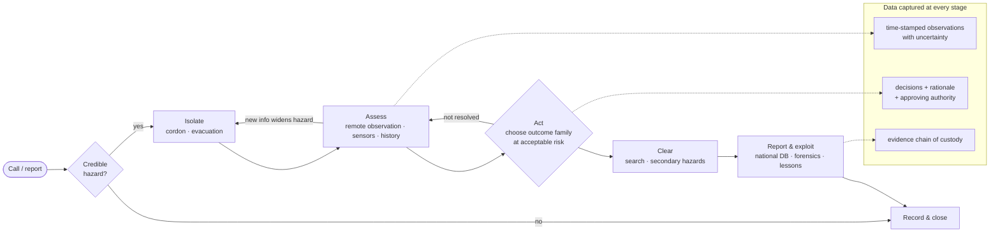

# 00.2 · How EOD organisations operate

<div class="module-card">

**Prerequisites** [00.1 What EOD is](lessons/stage-00/lesson-01.md) (domains, terminology, life-cycle) · basic probability (Poisson processes) for §7.

**Estimated time** 3 h (1.25 h theory · 0.5 h Sim A tutorial · 1.25 h data-model design exercise) · **Level** Beginner

**Next** [01.1 Mechanics refresher](lessons/stage-01/lesson-01.md) (physics path), or [03.1 Hazard taxonomy](lessons/stage-03/lesson-01.md) and [05.1 Detection theory](lessons/stage-05/lesson-01.md), which also depend on this lesson.

<p class="tags"><span>organisation</span><span>certification</span><span>AJP-3.18</span><span>IMAS</span><span>incident life-cycle</span><span>data model</span><span>queueing</span><span>Sim A</span></p>
</div>

## Why this matters

Technology in EOD fails more often at the **organisational interface** than at the physics. A robot
the team cannot sustain, a detector whose false alarms nobody has budgeted time for, or a
reporting system that does not survive a comms-denied field site will be abandoned, however good the
engineering. In the Iraq/Afghanistan period the US Army fielded more than 7,000 ground robots of
many ad-hoc types. Rapid fielding saved lives, but the fleet was fragmented, with high sustainment
and training costs, and in 2018 it was consolidated into three interoperable platform classes
(research note 03, C9). That was an organisational lesson, not a robotics one.

This lesson describes how EOD organisations are structured, how they certify people, how an
incident moves through them *at the conceptual level*, and what data they produce. The main
exercise asks you to do what a software engineer in this field actually does: design the
information flow and data model for an incident-reporting system.

## Learning objectives

1. Describe a generic EOD command structure and the responsibilities of team members, team leaders,
   squad commanders and staff officers, and map national titles onto it.
2. Explain the IMAS EOD Level 1 / 2 / 3 / 3+ ladder, US bomb-technician certification (HDS) and
   squad accreditation (NBSCAB), and the UK AT/ATO model, and state what each certifies.
3. List NATO AJP-3.18's five EOD capability subsets and the operating domains, and say why some
   nations lack some subsets.
4. Walk a fictional incident through the conceptual life-cycle *call → isolate → assess → act →
   clear → report/exploit*, naming the decision and the data produced at each stage.
5. Use Little's law and the Erlang-C model to estimate the team capacity needed for a given call
   load, and state the model's limitations.
6. Design and test a data model for incident reporting that meets field constraints (offline,
   low bandwidth, auditability, uncertainty, access control).

## Theory

### 1. Command structure and roles

Public descriptions from all domains show the same three layers. Titles differ, functions do not.

| Layer | Function | Military (NATO) | Police (US) | Humanitarian (IMAS/UN) |
|---|---|---|---|---|
| **Staff / management** | Doctrine, capability planning, threat analysis, tasking, standards, accreditation | EOD staff officers (NATO EOD COE's Staff Officer Training covers EOD C2, NATO reporting, threat analysis, planning) | Bomb-squad commander; NBSCAB at national level | National mine-action authority; operator's operations manager; QA/QC |
| **Team leadership** | Owns the on-scene technical decision and its risk; authorises others | EOD team leader | Lead bomb technician | EOD Level 3 team leader (authorises Level 2s); IEDD L3 operator |
| **Team member** | Executes tasks within competence, supports, observes, records | EOD technician / assistant | Bomb technician, assistant | EOD Level 1/2, deminer, team assistant |

The *on-scene incident commander* is often **not** the EOD team leader. At a civil incident, the
overall commander is usually a police or fire officer working within an incident command system,
and the bomb technician is the technical authority for the hazard. This split between overall
command and technical authority, each with a clear boundary, is the organisational counterpart of
separation of concerns. Most doctrinal friction happens at that boundary (07.2).

### 2. Competence and certification

#### 2.1 Humanitarian: IMAS 09.30 and T&EP 09.30

IMAS 09.30 (amended Sept 2022) and its competency standard T&EP 09.30/01/2022 define the clearest
public beginner → advanced ladder in the field:

| Level | Scope (organisational description) | Competencies (T&EP 2022) |
|---|---|---|
| EOD 1 | Locate and destroy, in situ, the *specific items they were trained on*. Team member | 93 |
| EOD 2 | Adds transportability assessment and multiple-item disposal. Supervised by a Level 3 | 89 |
| EOD 3 | Full range of munitions within a 50 kg NEQ limit. Authorises Level 2s. Team leader | 156 |
| EOD 3+ | Specialist modules: Advanced Explosive Theory, Bulk Demolitions, Aerial Bombs, Guided Weapons, Chemical Ordnance (Basic), AFV Clearance | 6 modules |

Competencies fall into **seven categories**: Theory & Knowledge; Equipment Skills; Practical EOD
Skills; Management & Leadership; Deployment & Post-Task; **Reporting & Data**; Storage & Transport.
The T&EP is a data model in its own right: *Category → Competency Cluster* (e.g. "Explosive
Theory") *→ Competency Root → individual competency*. Each competency is tagged with a level and an
assessment method (written, or timed/assessed practical). Knowledge items deepen by level:
*awareness* (L1) → *understand* (L2) → *describe/explain the full cycle* (L3). The IEDD standard
T&EP 09.31 has a parallel ladder (L1 searcher → L2 team assistant → L3 operator → L3+ advanced).

<div class="callout key">

**Key idea.** Levels define **authority**, not only knowledge. A Level 3 may authorise a Level 2.
A Level 1 may act only on items they were trained on. For a system designer, this is role-based
access control with a competence dimension: who may *record*, *approve* or *close* a task should
follow the same ladder.

</div>

#### 2.2 US public safety: HDS and NBSCAB

The **FBI Hazardous Devices School** (Redstone Arsenal) is the only US facility that trains and
certifies public-safety bomb technicians. The basic course is roughly six weeks, and certification
must be **renewed every three years**. The **National Bomb Squad Commanders Advisory Board**
(12 elected squad commanders from four regions) publishes the *National Guidelines for Bomb
Technicians*. These define (a) individual certification requirements, (b) **squad accreditation**
and (c) baseline doctrine and safety principles. Some US states reference the Guidelines in statute.
The distinction matters: *people* are certified, *units* are accredited. An incident system should
know both.

#### 2.3 United Kingdom: DEMS, AT and ATO

The **Defence EOD, Munitions and Search Training Regiment** (MoD Kineton and Bicester) has four
squadrons that map onto four domains: *Munitions*, *Conventional Munitions Disposal*, *Specialist
Search* and *IED Disposal*. The Royal Engineers own conventional EOD (for example WWII air-dropped
bombs) and military search. The Royal Logistic Corps owns ammunition and IEDD. RLC Ammunition
Technicians (≈ 9-month basic course with a science phase, then Class 2 → Class 1) and Ammunition
Technical Officers (≈ 17–20 months) are ammunition engineers first. In other words, the same person
is responsible for the stockpile and for the incident.

#### 2.4 Other public-safety models

Canada: the Police Explosives Technician Course at the Canadian Police College is 24 days plus an
online pre-course, with revalidation every 3–5 years. Israel: the police Bomb Disposal Division has
about one year of training, handles tens of thousands of suspicious-object calls per year, and runs
the national bomb data centre. Australia: a national *Diploma of Police Bomb Technical Response*
with monthly, quarterly and annual sustainment, and an Australian Bomb Data Centre. Every model
pairs **certification** with **sustainment** and with a **national data centre**.

### 3. NATO: capability subsets and domains

AJP-3.18 Ed. B (2023, ratified via STANAG 2628) divides joint EOD into five **capability subsets**:

| # | Subset | What it provides (conceptually) |
|---|---|---|
| 1 | **Explosive Ordnance Reconnaissance (EOR)** | Locating, reporting and first assessment of suspected EO. The information-gathering layer |
| 2 | **Explosive Ordnance Clearance** | Systematic removal of EO from an area or route |
| 3 | **Conventional Munitions Disposal (CMD)** | Dealing with manufactured munitions |
| 4 | **IED Disposal (IEDD)** | Dealing with improvised devices; feeds technical exploitation |
| 5 | **CBRN EOD** | Munitions with chemical, biological, radiological or nuclear fills |

These subsets operate across **land, maritime (including underwater EOD and mine countermeasures),
air (aircraft explosive hazards, airfield recovery) and cyberspace**. Several nations record
reservations because they have no CBRN or underwater EOD capability. The subsets are therefore
*building blocks* that an alliance combines, not a baseline every nation owns. EOD contributes to
Counter-IED mainly through "defeat the device" and technical exploitation for "attack the network".

### 4. The incident life-cycle (conceptual)

Every domain runs some version of the loop below. What follows is a **decision-level** description:
what question each stage answers and what information it needs. Actions and techniques are
deliberately left out (see the stage [boundary note](lessons/stage-00/README.md)).

| Stage | Question it answers | Typical information | Data produced |
|---|---|---|---|
| **Call** | Is there a credible hazard report, and how urgent is it? | Caller, location, description, time, context (threat message? find during works?) | Incident record created; initial priority |
| **Isolate** | Who and what must be kept away, and how far? | Hazard category (00.1), rough scale, terrain, buildings, population, *time–distance–shielding* | Cordon geometry, evacuation status, access control log |
| **Assess** | What is it, what state is it probably in, and what are the secondary hazards? | Remote observation (robot, cameras), sensors (Stage 5), history, indicators | Evidence/observations with uncertainty; hypotheses; photographs |
| **Act** | Which *family* of outcome carries acceptable risk: remove, destroy in place, or render safe? | Risk to people and property, evidential needs, collateral constraints, available means | Decision record with rationale and approving authority |
| **Clear** | Is the area now free of hazards, including secondary ones? | Search results, residual-hazard checks | Clearance declaration; cordon release time |
| **Report / exploit** | What happened, what did we learn, what goes to the national database and forensics? | Everything above | Final report; items to exploitation/forensics; lessons learned |

The loop is **not linear**. New information during *assess* can widen the cordon (back to
*isolate*). A failed or aborted action returns to *assess*. The 1980 Harvey's case
([cs02](case-studies/cs02-harveys-1980.md)) is the classic illustration: when the chosen technical
approach failed, it was the *isolate* stage (evacuation and standoff) that protected everyone.

<div class="callout safety">

**Design principle.** Isolation is the one stage whose value does not depend on the technical
diagnosis being correct. Systems that shorten the time to a sound cordon therefore give robust
benefit, whatever happens later. In the language of 07.1, isolation is a robust action under model
uncertainty.

</div>

### 5. Reporting and data

**Reporting & Data** is one of the seven T&EP competency categories, which says how central the
profession considers it. In humanitarian mine action, national authorities keep an
information-management system, the widely used one being **IMSMA** (Information Management System
for Mine Action), stewarded by GICHD. Conceptually it is a geospatial database of hazardous areas,
survey and clearance activities, items found and destroyed, accidents and land released. National
programmes such as Lao PDR's rely on it for survey-driven land release (research note 03, C7).
Military EOD uses standard NATO reports and messages, which the NATO EOD COE teaches in its Staff
Officer Training. Police services feed national **bomb data centres** (Israel, Australia). Physical
IED evidence goes to exploitation laboratories such as the FBI's TEDAC.

What makes EOD data hard is not volume but **conditions**:

- captured offline in the field, often by gloved hands, and synchronised later;
- mixed **sensitivity**: some fields are public (a hazardous-area polygon), some restricted (device
  characteristics, sources);
- evidential: chain of custody and tamper-evident history (08.1);
- **uncertain by nature**: "probable projected munition, 60 %", not "Projectile type X";
- long-lived: a hazardous-area record may be reopened 30 years later.

### 6. Where technology plugs in

| Technology | Life-cycle stage it serves | Organisational constraint it must respect |
|---|---|---|
| Ground robots (Stage 6) | Assess (remote observation), sometimes Act | Common interfaces and payloads (the US Army's common-robotic-system family and interoperability profile), sustainment, operator training; NIST/ASTM E54.09 standard test methods for procurement |
| Sensors (Stage 5) | Call triage, Isolate (extent), Assess, Clear | Known ROC operating points; false-alarm cost is measured in team-hours (05.1) |
| Drones and remote sensing | Survey (humanitarian), Isolate, Assess | Airspace rules; data volume; georeferencing |
| AI decision support (Stage 9) | Assess (recognition, triage), Report (data quality) | Calibrated uncertainty, human accountability, audit. The *level of automation* must be chosen per function (Parasuraman, Sheridan & Wickens 2000) |
| Information systems | Every stage | Offline-first, access control, provenance, interoperability with national databases |

Parasuraman et al. split automation into four functions: information acquisition, analysis,
decision selection and action implementation, each with its own level from 1 (manual) to 10 (full
autonomy). EOD organisations generally accept high automation in *acquisition* (sensors, robots),
moderate automation in *analysis* (decision support), and keep *decision selection* human. That is
the design envelope for Stages 6 and 9.

### 7. Capacity: how many teams does a squad need?

A squad must answer calls promptly *most* of the time, not just on average. Queueing theory gives a
first estimate.

**Little's law** (holds for any stable queue in steady state):

$$ L = \lambda W $$

**Erlang-C** (M/M/c queue: Poisson arrivals, exponential service times, $c$ identical teams). With
offered load $a=\lambda/\mu = \lambda \bar{S}$ and $a<c$, the probability that a new call must wait
is

$$ P_{\text{wait}} = \frac{\dfrac{a^c}{c!}\dfrac{c}{c-a}}{\displaystyle\sum_{k=0}^{c-1}\frac{a^k}{k!} + \frac{a^c}{c!}\frac{c}{c-a}}, \qquad
W_q = \frac{P_{\text{wait}}\,\bar{S}}{c-a}. $$

| Symbol | Meaning | Unit |
|---|---|---|
| $\lambda$ | mean call arrival rate | calls h⁻¹ |
| $\bar{S} = 1/\mu$ | mean time a team is committed per call (travel + on scene + recovery) | h |
| $a=\lambda\bar{S}$ | offered load = mean number of teams busy | teams (Erlang) |
| $c$ | number of teams available | — |
| $\rho = a/c$ | utilisation | — |
| $L$ | mean number of calls in the system | — |
| $W$ | mean time in the system (waiting + service) | h |
| $P_{\text{wait}}$ | probability an arriving call finds all teams busy | — |
| $W_q$ | mean waiting time before a team is assigned (over all calls) | h |

**Intuition.** $a$ tells you how many teams are busy *on average*. You need more than $a$, because
calls cluster at random. The waiting time rises sharply as utilisation approaches 1, the same
non-linearity you see in server farms. One extra team at high load buys a large reduction in waiting.

**Numerical example (fictional "Metro squad").** 50 calls/day ($\lambda=2.083$ h⁻¹), $\bar S=2$ h ⇒
$a=4.17$ teams busy on average.

| Teams $c$ | $\rho$ | $P_{\text{wait}}$ | $W_q$ (min) |
|---|---|---|---|
| 5 | 0.83 | 0.62 | 89 |
| 6 | 0.69 | 0.33 | 21 |
| 7 | 0.60 | 0.16 | 6.8 |
| 8 | 0.52 | 0.072 | 2.3 |

Going from 5 to 6 teams cuts the mean wait by a factor of four.

```python
import math

def erlang_c(c: int, a: float) -> float:
    """P(wait) for an M/M/c queue with offered load a (Erlangs), a < c."""
    if a >= c:
        return 1.0
    tail = a**c / math.factorial(c) * c / (c - a)
    head = sum(a**k / math.factorial(k) for k in range(c))
    return tail / (head + tail)

lam, S = 50 / 24, 2.0               # calls/h, h per call
a = lam * S
for c in range(5, 9):
    pw = erlang_c(c, a)
    print(c, round(pw, 3), round(60 * pw * S / (c - a), 1))   # teams, P(wait), Wq [min]
```

<div class="callout physics">

**Where the model breaks.** Real calls are *prioritised*: a credible threat pre-empts a legacy find.
Service times are **heavy-tailed**: most calls are short (many unattended items are benign), but a
few last many hours. Arrivals cluster after publicised incidents (copycats and heightened public
reporting). Heavy tails raise waiting well above the M/M/c prediction. Use Erlang-C for
first-order sizing, and a discrete-event simulation with empirical distributions for decisions.
That simulation is an extension of the programming exercise.

</div>

<details class="answer"><summary>Exercise 1 — then reveal</summary>

(a) By Little's law, if the Metro squad averages 4.17 busy teams and each call takes 2 h, what is
the arrival rate? (b) A robot reduces mean time on scene so that $\bar S$ falls from 2.0 h to 1.6 h.
With $c=6$, compute the new $P_{\text{wait}}$ and $W_q$. (c) Is it better to buy the robot or a 7th
team, judged on $W_q$ only?

*Answer.* (a) $\lambda = L/W = 4.17/2 = 2.08$ h⁻¹ = 50/day (consistent). (b) $a = 3.33$;
$P_{\text{wait}} = 0.148$; $W_q = 0.148\cdot1.6/(6-3.33)\cdot60 \approx 5.3$ min. (c) The robot gives
≈ 5.3 min against 6.8 min for a 7th team. The robot also *reduces exposure time*, which the queue
model does not capture at all. A real decision needs the safety benefit and the sustainment cost as
well.

</details>

## Visual explanation



<iframe class="sim-frame" src="sims/scene-assessment/index.html?embed=1" height="720" loading="lazy"></iframe>

<a class="sim-link" href="sims/scene-assessment/index.html" target="_blank">Open Sim A full-screen ↗</a>

## Worked example: the "Canal Street" incident as a data flow

A fictional incident. At 09:12 a building-site foreman reports a corroded metal object exposed by an
excavator. Walk through it and look at **what is recorded**, not at what is done to the object.

1. **Call (09:12).** Dispatcher creates incident `INC-0417` with a free-text description, the caller,
   and a location from the caller's phone (±30 m). Priority is "legacy find, no threat message":
   urgent but not immediate. *Data issue:* location uncertainty must be stored, not just a point.
2. **Isolate (09:40).** First police unit sets an initial cordon from a generic distance table for the
   reported category (04.4). Record: cordon polygon v1, time, author, basis ("generic table,
   category = suspected projected munition").
3. **Assess (10:30).** EOD team arrives. The team leader (certified, current) takes technical
   authority, which is recorded as a *handover event*, not an overwrite of the commander field.
   Remote camera images and site history (the site is on a WWII bomb-damage map) support "UXO,
   probable projected munition, state unknown". Observations are stored with their source and
   confidence.
4. **Isolate v2 (10:55).** Assessment suggests a larger item than reported. Cordon polygon v2 is
   larger, with rationale. v1 is **not deleted**: an inquiry may later ask what the cordon was at
   10:50.
5. **Act (12:10).** The team leader selects an outcome family. The decision record holds the options
   considered, the chosen family, the risk rationale and the approving authority.
6. **Clear (14:30).** Area search finds no further items. The clearance declaration and cordon
   release time are recorded.
7. **Report (next day).** The final report goes to the national database. The item's category and
   location update the municipal hazard map, so future construction on neighbouring plots triggers a
   pre-construction survey.

Four data-design lessons follow: store **uncertainty** (location ±, category confidence); make
records **append-only with versions** (cordon v1 → v2); **separate** command authority from technical
authority as distinct, time-stamped assignments; and make the **rationale** a required field of
every decision.

## Simulation work

<div class="callout sim">

**Sim A: Scene Assessment, tutorial mode (Beginner).** The tutorial walks you through one scene
end to end. Work it twice:

1. **As observer.** Complete the tutorial and, at each step, write down which life-cycle stage
   (call, isolate, assess, act, clear, report) the interface is asking you to perform.
2. **As systems engineer.** Replay with the same `?seed=` and list every piece of information you
   entered or received: sensor readings, cordon edits, hazard marks, decisions. Check the list
   against the schema you design in the practical exercise below. Did the sim ask you for anything
   your schema cannot hold?

In the debrief, read the "What uncertainty existed" section and check that your schema could have
recorded that uncertainty at the time, not just afterwards.

</div>

## Practical exercises

### Exercise A: design an incident-reporting data model (main exercise)

You are the lead engineer for a fictional national service that responds to explosive-hazard
incidents. It combines a police bomb-disposal function and a legacy-ordnance function. Design the
**information flow and data model** for its incident reporting system.

**Functional requirements**

1. R1: Create an incident from a call. Capture caller, reported location (with uncertainty),
   description, and time received.
2. R2: Record every life-cycle stage transition with time, author and role.
3. R3: Store cordons as versioned polygons. Old versions are never destroyed.
4. R4: Store observations (sensor, camera, human) with source, time, and a **confidence or
   probability**, not only a label.
5. R5: Store decisions with the options considered, the chosen outcome family, the rationale and the
   approving authority, where the authority's **certification must be current** at decision time.
6. R6: Track evidence items with an unbroken chain of custody.
7. R7: Export a summary to a national database (IMSMA-like, geospatial) and a restricted
   technical-exploitation record to a separate system.
8. R8: Support after-action queries such as "show the state of `INC-0417` as known at 10:50".

**Constraints**

- C1: Field tablets work **offline** for hours; sync is intermittent and low bandwidth (assume
  ≤ 64 kbit/s, bursts).
- C2: Two users can edit the same incident offline. Merges must never lose data.
- C3: Field-level **classification**: some fields are public, some are restricted to technical staff.
- C4: Records must be **tamper-evident** (evidential use in court).
- C5: Records must stay readable for ≥ 30 years (format longevity).

**Deliverables:** an entity–relationship or event schema, a sequence diagram of the sync path, and
answers to the test cases below.

<details class="answer"><summary>A reference design — then compare with yours</summary>

**Core idea: event sourcing.** The incident is an **append-only log of immutable events**
(`IncidentCreated`, `StageEntered`, `CordonDrawn(version, polygon, basis)`,
`ObservationRecorded(source, value, confidence)`, `AuthorityAssigned(role, person, cert_id)`,
`DecisionRecorded(options, chosen_family, rationale, approver)`, `EvidenceTransferred(item, from,
to, time, signature)`, ...). Current state is a *projection* (fold) over the log. R8 ("state as of
10:50") is then just folding the events with `t ≤ 10:50`.

- **Identity:** events carry a UUID, the device id, a per-device Lamport counter and wall-clock time
  (clocks drift offline, so never order by wall clock alone).
- **Offline merge (C1, C2):** the log is a grow-only set (a CRDT). Merging is set union, so no
  conflicts arise at the storage level. *Semantic* conflicts (two different cordon v3s) are resolved
  in the projection by an explicit rule and surfaced to a human, never silently resolved.
- **Tamper evidence (C4):** hash-chain each device's events (each event includes the hash of that
  device's previous event) and sign them. Periodically anchor the heads to the server.
- **Classification (C3):** a classification label per event or per field, enforced at projection
  and export. Restricted content is stored as encrypted payloads that public projections can
  reference but not read.
- **Certification (R5):** `DecisionRecorded` references `cert_id`. A validator checks
  `cert.valid_from ≤ t ≤ cert.valid_to` and that the certificate's level authorises the decision
  type (the competence-based access control of §2).
- **Uncertainty (R4):** observations store a distribution or at least a (label, probability) set and
  a location with covariance, not a point.
- **Longevity (C5):** a schema-versioned, self-describing format (for example JSON with an explicit
  schema id, plus GeoJSON geometry), and upcasters for old event versions.
- **Bandwidth:** sync events, not state. Compress; send media (images) as a separate low-priority
  channel with content hashes in the event log.

</details>

<details class="answer"><summary>Test cases your design must pass — then check</summary>

1. **Offline divergence.** Tablets A and B are both offline. A adds cordon v2, B adds an
   observation. After sync, both events are present and the projection shows cordon v2 *and* the
   observation. *Fails if* state (not events) is synced with last-writer-wins.
2. **Concurrent cordon edits.** A and B each create "cordon v2" offline. After sync, both exist, the
   projection flags a conflict, and a human must choose. Neither is lost.
3. **Point-in-time query.** "State as of 10:50" returns cordon v1 even though v2 exists now.
4. **Expired certification.** A decision approved by a technician whose certification lapsed
   yesterday is rejected (or flagged, per policy) with a clear reason.
5. **Tamper attempt.** Altering the rationale of a past decision in the database breaks the hash
   chain, and verification reports exactly which event.
6. **Classification leak.** The public export for the national hazard map contains the item category
   and polygon, and no restricted field. This must be tested by property-based generation of random
   incidents.
7. **Clock skew.** A device whose clock is 2 h fast still produces a causally consistent order
   (Lamport/vector clocks), and wall-clock anomalies are flagged.
8. **Longevity.** An event written with schema v1 is still readable after the schema moves to v3
   (upcaster test).

</details>

### Exercise B: map a fictional organisation

A fictional country has (i) a police bomb squad in the capital, (ii) an army EOD regiment with no
underwater capability, (iii) a national mine-action centre regulating two NGO operators, and (iv)
an ammunition depot staff. For each life-cycle stage of each scenario in
[00.1's practical exercises](lessons/stage-00/lesson-01.md), name the organisation that leads, who
supports, and which data system receives the report. Identify one scenario where **no**
organisation has the capability, and propose how an alliance or contract fills the gap.

<details class="answer"><summary>Hint — then reveal</summary>

The harbour scenario (00.1, Scenario 4) exposes the missing underwater capability. The usual
solutions are allied support under a bilateral agreement or a contracted commercial underwater UXO
survey plus military supervision. In the data model, this means incidents must support
**multi-organisation participation** with per-organisation access, which is one more reason for
event-level classification.

</details>

## Programming exercise — an event-sourced incident log

**Goal.** Implement the core of Exercise A: an append-only incident event log with projections,
point-in-time queries, hash-chain verification and certification validation.

- **Input:** a list of event dicts (JSON), for example
  `{"id": "...", "device": "tabA", "lamport": 7, "t": "2026-05-04T10:55:00Z", "type": "CordonDrawn", "version": 2, "polygon": [...], "basis": "...", "prev_hash": "..."}`.
  Also a certification registry `{cert_id: {"level": 3, "valid_from": ..., "valid_to": ...}}`.
- **Output:** `project(events, as_of=None) -> IncidentState`; `verify(events) -> list[Problem]`;
  `merge(log_a, log_b) -> log`; `export_public(state) -> dict`.
- **Constraints:** Python standard library only (`hashlib`, `json`, `dataclasses`); deterministic
  output independent of input order; `merge` is commutative, associative and idempotent.
- **Expected behaviour:** passes the eight test cases above. Your test suite must include the
  CRDT laws as property tests: `merge(a,b)==merge(b,a)`, `merge(a,merge(b,c))==merge(merge(a,b),c)`,
  `merge(a,a)==a`.
- **Extensions:** (1) a discrete-event simulation of the "Metro squad" call load using your events as
  output, with heavy-tailed (lognormal) service times, compared with the Erlang-C numbers in §7.
  (2) A GeoJSON export of cordon versions for a map viewer. (3) Attach a calibrated probability to
  each observation and propagate it into the projection. This is a preview of
  [P12](projects/p12-hitl-decision/README.md).

## Reading

- **NATO, *AJP-3.18 Ed. B v1*** (2023).
  https://assets.publishing.service.gov.uk/media/65d48f3f38fef90011b5b03b/AJP_3_18_EOD_EdB_V1.pdf.
  Read ch. 1 for the five capability subsets and ch. 3 for EOD command and control.
- **UNMAS / GICHD, *T&EP 09.30/01/2022 Conventional EOD Competency Standards*** (2022).
  https://www.mineactionstandards.org/fileadmin/uploads/imas/Standards/English/TEP_09.30.01.2022_Ed.2.pdf.
  Skim the structure (categories, clusters, roots), and read the *Reporting & Data* category in full.
- **UNMAS / DPKO, *United Nations IEDD Standards*** (2018).
  https://unmas.org/sites/default/files/un_iedd_standards.pdf. Read the sections on roles, threat
  assessment levels and information management.
- **AOAV, "National Bomb Squad Commanders Advisory Board"** (2016).
  https://aoav.org.uk/2016/national-bomb-squad-commanders-advisory-board/. A short account of
  certification versus accreditation in the US public-safety model.
- **NIST, *Standard Test Methods for Response Robots*** (ongoing).
  https://www.nist.gov/el/intelligent-systems-division-73500/standard-test-methods-response-robots.
  Skim the test categories. This is how organisations buy and qualify robots.
- **R. Parasuraman, T. B. Sheridan, C. D. Wickens, "A model for types and levels of human
  interaction with automation"**, *IEEE Trans. SMC-A* 30(3) (2000). https://doi.org/10.1109/3468.844354.
  Read the whole paper (it is short). It is the framework for deciding what technology should
  automate.

Full bibliographic entries: [curriculum/sources.md](curriculum/sources.md).

## Assessment

1. *(Conceptual)* Why does a bomb-squad accreditation scheme accredit **units** in addition to
   certifying **individuals**? Give one failure that individual certification alone would not
   prevent.
2. *(Interpretation)* A nation ratifies AJP-3.18 with a reservation on subsets 5 and underwater.
   What does this imply for a multinational exercise plan, and for a software system that allocates
   tasks to national teams?
3. *(Mathematical)* A squad has $c=4$ teams, $\bar S=3$ h, and 24 calls/day. Compute $\rho$,
   $P_{\text{wait}}$ and $W_q$. What happens if the call rate rises by 25 %?
4. *(Design)* Name three fields of an incident record that must be **versioned**, not overwritten,
   and justify each with a question an inquiry might ask.
5. *(Conceptual)* Using the Parasuraman four-function model, propose a level of automation for each
   function in a robot-assisted *assess* stage, and justify the level you give to *decision
   selection*.

<details class="answer"><summary>Answer to 3</summary>

$\lambda = 1$ h⁻¹, $a = 3$, $\rho = 0.75$. Erlang-C: $P_{\text{wait}} = 0.509$,
$W_q = 0.509\cdot3/(4-3) = 1.53$ h ≈ 92 min. With a 25 % rise: $a = 3.75$, $\rho = 0.94$,
$P_{\text{wait}} \approx 0.865$, $W_q \approx 0.865\cdot3/0.25 = 10.4$ h. The queue is close to
instability. This is why capacity planning uses peak rather than mean load, and why the triage at
the *call* stage (filtering benign unattended items) is such high-leverage technology.

</details>

## Expert extension

- **Formal methods for procedures.** Life-cycle rules such as "no *act* without a current level-3
  authority" and "no *clear* while any observation is unresolved" are temporal-logic properties.
  Model the life-cycle as a state machine in TLA+ or Alloy and check that your event schema cannot
  reach a state that violates them.
- **Interoperability.** Humanitarian, military and police systems rarely share schemas. Study how
  the humanitarian sector's move to common data standards compares with NATO message
  standardisation. The hard part is semantics (00.1's vocabulary mismatch), not transport.
- **Queueing with priorities.** Replace M/M/c with a preemptive-priority M/G/c model and derive
  (or simulate) waiting times per priority class.

## What comes next

Stage 0 ends here. Take the [Stage 0 gate](assessments/stage-00.md). Then start the physics that
every decision in this lesson depends on: [01.1 Mechanics refresher](lessons/stage-01/lesson-01.md).
