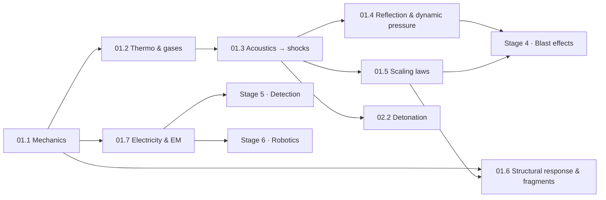

# Stage 1 · Physics foundations

**Purpose** The physics underneath every protective decision in the field: how energy is stored
and released, how gases behave when compressed and heated, how pressure disturbances become
shocks, how shocks reflect and scale, how structures and fragments respond, and the electricity
and electromagnetism that sensing, robotics and communications rest on. Nothing later in the
course uses mathematics that is not introduced here or assumed from an engineering degree.

**Estimated time** ≈ 30 h · **Level** Beginner → Intermediate · **Simulators** Sim D (Blast Physics), Sim I (Shock tube) · **Project** [P01 Blast-wave visualisation](projects/p01-blast-wave/README.md) · **Gate** [Stage 1 assessment](assessments/stage-01.md)

mechanicsthermodynamicsshocksscalingstructural responseelectromagnetism

## Lessons

| Id | Lesson | Time | Level | Core outputs |
|---|---|---|---|---|
| 01.1 | [Mechanics refresher for energetic events](lessons/stage-01/lesson-01.md) | 4 h | Beginner | Energy vs power; pressure as energy density; impulse of pressure pulses; momentum of fragments; Reynolds transport theorem; energy densities |
| 01.2 | [Gases and thermodynamics](lessons/stage-01/lesson-02.md) | 4.5 h | Beginner → Int. | Ideal/real gas; first and second law; isentropic relations; $\gamma$; vessel burst energy (Brode); conduction, convection, radiation; when a process is adiabatic |
| 01.3 | [Waves: from acoustics to shocks](lessons/stage-01/lesson-03.md) | 6 h | Intermediate | Linear acoustics; nonlinear steepening; Rankine–Hugoniot; shock Mach number ↔ overpressure; entropy |
| 01.4 | [Reflection, transmission and dynamic pressure](lessons/stage-01/lesson-04.md) | 4 h | Intermediate | Impedance; normal and oblique reflection; Mach stem; stagnation and dynamic pressure; drag loading |
| 01.5 | [Dimensional analysis and scaling laws](lessons/stage-01/lesson-05.md) | 4 h | Intermediate | Buckingham Π; Hopkinson–Cranz cube-root scaling; Sachs scaling; similarity; where scaling breaks |
| 01.6 | [Structural response and fragmentation physics (conceptual)](lessons/stage-01/lesson-06.md) | 4.5 h | Intermediate | SDOF oscillators; impulsive vs quasi-static regimes; P–I diagrams; energy methods; fragment velocity and deceleration at a conceptual level |
| 01.7 | [Electricity, electromagnetism and electronics for EOD technology](lessons/stage-01/lesson-07.md) | 4 h | Beginner → Int. | Circuits and energy storage; sensors and transducers; EM waves and RF propagation; ESD and electromagnetic-environment hazards as safety concepts |

## How to work through this stage

- **Physics path first:** 01.1 → 01.2 → 01.3 → {01.4, 01.5} → 01.6. 01.7 can be taken any time after
  01.1 and must be done before Stage 5 and Stage 6.
- Every equation comes with a variable table, a checked numerical example, a Python snippet and a
  hidden exercise. Run the snippets. The programming exercises accumulate into
  [P01](projects/p01-blast-wave/README.md).
- Use Sim D and Sim I to *predict, then check*: write your prediction down before you move a slider.

**What this stage deliberately leaves out, and why.** Stage 1 is general physics. It uses
non-explosive examples (compressed gases, fuels, batteries, fires), shock-tube and blast-wave
physics that is identical whatever the source, and abstract yield units in the simulators. It does
not relate any of this to the design, composition, quantity or placement of explosive devices, and
it does not discuss fragment *generation* from real munition designs. Fragments appear only as
fictional masses and velocities for momentum and energy reasoning. In 01.7, electrostatic discharge
and electromagnetic-environment hazards are treated as **safety concepts** (why protection exists),
never as initiation or triggering details. These limits keep the course an education in the science
of effects and protection, which is what engineering, detection and robotics work requires, and
keep it from becoming a source of harmful capability.

