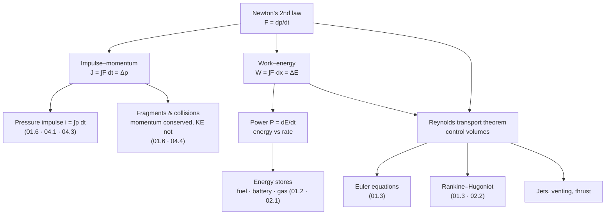

# 01.1 · Mechanics refresher for energetic events

<div class="module-card">

**Prerequisites** [00.2 How EOD organisations operate](lessons/stage-00/lesson-02.md) · single-variable and vector calculus (integrals, divergence theorem) · first-year mechanics.

**Estimated time** 4 h (2 h theory · 0.5 h simulator · 1.5 h exercises & programming) · **Level** Beginner

**Next** [01.2 Gases & thermodynamics](lessons/stage-01/lesson-02.md), then [01.3 Waves: from acoustics to shocks](lessons/stage-01/lesson-03.md). Also a prerequisite for [01.6 Structural response & fragmentation](lessons/stage-01/lesson-06.md) and [01.7 Electricity & EM](lessons/stage-01/lesson-07.md).

<p class="tags"><span>physics</span><span>mechanics</span><span>conservation laws</span><span>impulse</span><span>control volumes</span><span>Sim D</span><span>P01</span></p>
</div>

## Why this matters

Every quantity that appears in blast and fragment literature is a mechanics quantity in disguise.
**Overpressure** is a force per area. **Impulse** is the time integral of that pressure, and it, not
the peak, often decides whether a window or a person is harmed. A fragment is dangerous because of
its **momentum and kinetic energy**. And the equations that govern a blast wave (01.3) are nothing
but **conservation of mass, momentum and energy** applied to a control volume.

This lesson is a refresher aimed at a specific destination. It revisits the concepts you already
know but frames each one the way the blast, fragment and structural-response lessons will use it.
One distinction runs through the whole lesson and is the most important idea in energetic-event
physics: **energy versus power**. Energetic events are rarely remarkable for how much energy they
release. They are remarkable for how *fast* they release it.

## Learning objectives

1. Convert fluently between energy, work, power, force, pressure, momentum and impulse, and check
   any expression by dimensional analysis.
2. Explain why pressure can be read as an energy density, and use it to interpret overpressure
   numbers.
3. Compute the impulse delivered by a pressure pulse (triangular, exponential and Friedlander) and
   the response of a free plate, and explain when impulse rather than peak force governs.
4. Apply momentum and energy conservation to collisions (the ballistic pendulum) and explain why
   momentum is conserved while kinetic energy is not.
5. State the Reynolds transport theorem and derive integral mass and momentum balances for a
   control volume. Use them to compute jet reaction forces.
6. Compare published energy densities of fuels, batteries and compressed gas, and explain why energy
   density alone does not characterise a hazard.

## Theory

### 1. Quantities, units and dimensions

| Quantity | Symbol | Definition | SI unit | Dimensions |
|---|---|---|---|---|
| Force | $F$ | $F = \dfrac{dp}{dt}$ (= $ma$ at constant mass) | N = kg m s⁻² | M L T⁻² |
| Work / energy | $W$, $E$ | $W=\int \mathbf F\cdot d\mathbf x$ | J = N m | M L² T⁻² |
| Power | $P$ | $P = \dfrac{dE}{dt}$ | W = J s⁻¹ | M L² T⁻³ |
| Pressure | $p$ | normal force per area | Pa = N m⁻² = **J m⁻³** | M L⁻¹ T⁻² |
| Momentum | $\mathbf p = m\mathbf v$ | — | kg m s⁻¹ = N s | M L T⁻¹ |
| Impulse | $\mathbf J$ | $\int \mathbf F\,dt = \Delta \mathbf p$ | N s | M L T⁻¹ |
| Specific impulse (blast) | $i$ | $\int p\,dt$ (per unit area) | Pa s = N s m⁻² | M L⁻¹ T⁻¹ |
| Energy density | $e$ | energy per mass or per volume | J kg⁻¹ or J m⁻³ | L² T⁻² or M L⁻¹ T⁻² |

<div class="callout physics">

**Pressure is energy density.** Pa = N m⁻² = N m / m³ = J m⁻³. An overpressure of 100 kPa means a
compressed or moving gas carrying about 100 kJ per cubic metre of mechanical energy (up to
factors of order one that depend on the process). This dual reading will be used constantly: as a
*force per area* when loading a wall, and as an *energy per volume* when asking how much energy a
compressed gas or a blast wave holds (01.2).

</div>

The specific impulse in blast literature ($i$, Pa s) is **not** the same as the rocket-propulsion
"specific impulse" (s). The blast $i$ is impulse per unit *area*. Multiply by the loaded area to get
an impulse in N s.

### 2. Work, energy and power

$$ W = \int_{\mathbf x_1}^{\mathbf x_2} \mathbf F\cdot d\mathbf x = \Delta E_k + \Delta E_p + \Delta U + \dots, \qquad P = \frac{dE}{dt} = \mathbf F\cdot\mathbf v . $$

| Symbol | Meaning | Unit |
|---|---|---|
| $W$ | work done on the system | J |
| $E_k=\tfrac12 mv^2$ | kinetic energy | J |
| $E_p = mgh$ | gravitational potential energy (near surface) | J |
| $U$ | internal energy (thermal, chemical, strain) | J |
| $P$ | power (rate of energy transfer) | W |

**Intuition.** Energy is a *stock*, power a *flow*. The same stock delivered slowly heats a room.
Delivered in microseconds, it drives a shock wave, because the surrounding medium cannot move out
of the way in time. The medium's response time is set by the speed of sound (01.3) and its inertia.

**Numerical example A: a robot on stairs.** A 60 kg robot climbs a 3 m flight in 10 s:
$E_p = 60\cdot9.807\cdot3 = 1765$ J, and the average mechanical power is $176.5$ W. That ignores
losses, and real track drives are rarely more than about 50 % efficient, so the battery must deliver
roughly 350 W or more. Stage 6 uses budgets like this.

**Numerical example B: the same energy, different power.** Release 1 MJ (about the chemical energy
in 23 g of petrol) over 10 s: $P = 100$ kW, a car engine. Release it over 10 µs:
$P = 10^{11}$ W = 100 GW, comparable to the output of a hundred large power stations, but only for
10 µs. Same energy, a factor of $10^6$ in power, and completely different physics.

```python
import numpy as np
G0 = 9.80665

def lift_power(m_kg: float, h_m: float, t_s: float, eta: float = 1.0) -> float:
    """Average electrical power to raise mass m by h in time t with drive efficiency eta [W]."""
    return m_kg * G0 * h_m / t_s / eta

def mean_power(E_J: float, t_s: float) -> float:
    return E_J / t_s

print(lift_power(60, 3, 10))            # 176.5 W (ideal)
print(mean_power(1e6, 10), mean_power(1e6, 10e-6))   # 1e5 W vs 1e11 W
```

<details class="answer"><summary>Exercise 1 — then reveal</summary>

A 2 kWh robot battery pack is fully discharged in (a) 4 h of normal operation or (b) 60 s in an
internal short-circuit failure. Compute the mean power in each case. Express the stored energy
in MJ, in kg of petrol-equivalent (lower heating value 43.4 MJ/kg), and in the energy unit
"kg TNT-equivalent" (defined as 4.184 MJ). What does the comparison *not* tell you about hazard?

*Answer.* $E = 7.2$ MJ. (a) 500 W. (b) 120 kW. It is equivalent to 0.166 kg of petrol or 1.72 "kg
TNT-eq" of energy. The comparison says nothing about **rate** (a battery fire releases its energy
over seconds to minutes, not microseconds) or about **form** (heat and flammable gas, not a shock).
TNT-equivalence is only meaningful for similar release rates (04.1). Battery thermal runaway is
still a serious hazard, a *fire* hazard of the kind you will model in 02.3.

</details>

### 3. Force and pressure

$$ F = \int_A p\,dA \;=\; \bar p\,A \quad\text{(uniform pressure).} $$

| Symbol | Meaning | Unit |
|---|---|---|
| $p$ | pressure acting normal to the surface (overpressure $\Delta p$ if the other side is at ambient) | Pa |
| $A$ | loaded area | m² |
| $F$ | resultant normal force | N |

**Intuition.** Pressures that sound small produce enormous forces on large areas, because the area
multiplies them. Buildings are designed for wind pressures of the order of 1 kPa. Blast overpressures
of 10 kPa and more therefore overload façades by an order of magnitude, briefly.

**Numerical example.** A 1.2 m × 0.8 m window ($A=0.96$ m²) sees a side-on overpressure of 10 kPa:
$F = 10^4\cdot0.96 = 9.6$ kN, the weight of about 980 kg. Whether the pane fails depends on how
long that force lasts compared with how fast the pane can respond. That comparison is the subject of
§4 and of 01.6.

<details class="answer"><summary>Exercise 2 — then reveal</summary>

A door (2.0 m × 0.9 m) separates a room at 101.3 kPa from a corridor where a ventilation fault
has dropped the pressure by 1 kPa. What net force acts on the door? Could a person open it by
pulling with 200 N at the handle, 0.8 m from the hinge line, against a uniform load?

*Answer.* $F = 1000\cdot1.8 = 1.8$ kN. The resultant acts at the door's centre, 0.45 m from the
hinge, giving a moment of $1800\cdot0.45 = 810$ N m. The person supplies $200\cdot0.8 = 160$ N m.
No. A 1 % pressure difference jams a door. Building engineers meet this in pressurised stairwells.

</details>

### 4. Momentum and impulse: the loading that matters

Newton's second law in integral form:

$$ \mathbf J \equiv \int_{t_0}^{t_1} \mathbf F\,dt = \mathbf p(t_1)-\mathbf p(t_0), \qquad
i \equiv \int_{0}^{t_d} \Delta p(t)\,dt, \qquad J = i\,A . $$

| Symbol | Meaning | Unit |
|---|---|---|
| $\mathbf J$ | impulse delivered by the force | N s |
| $i$ | specific (areal) impulse of a pressure pulse | Pa s |
| $\Delta p(t)$ | overpressure history at the surface | Pa |
| $t_d$ | positive-phase duration | s |

For three standard pulse shapes, the analytic impulses are:

| Pulse | $\Delta p(t)$ for $t\ge0$ | $i$ |
|---|---|---|
| Triangular | $p_m(1-t/t_d)$ for $t\le t_d$ | $\tfrac12 p_m t_d$ |
| Exponential | $p_m e^{-t/\tau}$ | $p_m\tau$ |
| Friedlander (positive phase) | $p_m(1-t/t_d)e^{-bt/t_d}$ | $p_m t_d\left[\dfrac1b-\dfrac{1-e^{-b}}{b^2}\right]$ |

The Friedlander form is the standard idealised blast waveform (Rigby et al. 2014, Eq. 1; 04.1). Its
impulse follows by integration by parts.

**Intuition.** A structure that responds *slowly* compared with the load duration cannot tell a
short, sharp pulse from a longer, gentler one of the same impulse. It just receives a momentum kick.
A structure that responds *quickly* follows the force and cares about the peak. The ratio of load
duration to natural period decides which regime you are in. That ratio is the backbone of
pressure–impulse (P–I) diagrams (01.6, 04.3).

**Numerical example: free plate.** A triangular pulse, $p_m=50$ kPa, $t_d=5$ ms, loads a free,
rigid 10 kg plate of area 0.5 m²:

| Step | Result |
|---|---|
| $i=\tfrac12\cdot 5\times10^4\cdot 5\times10^{-3}$ | 125 Pa s |
| $J = iA$ | 62.5 N s |
| $v = J/m$ | 6.25 m/s |
| $E_k = \tfrac12 m v^2$ | 195 J |

A pulse with a lower peak and a longer duration but the same impulse, for example 12.5 kPa for 20 ms,
gives the *same* 6.25 m/s to a free plate. A free plate is the limiting case of "infinitely slow
structure".

```python
import numpy as np

def impulse(t: np.ndarray, p: np.ndarray) -> float:
    """Specific impulse of a sampled overpressure history [Pa s] (trapezoidal)."""
    return float(np.trapezoid(p, t))

def friedlander(t, p_m, t_d, b):
    t = np.asarray(t)
    return np.where((t >= 0) & (t <= t_d), p_m * (1 - t / t_d) * np.exp(-b * t / t_d), 0.0)

t = np.linspace(0, 5e-3, 20001)
p_tri = 50e3 * (1 - t / 5e-3)
i = impulse(t, p_tri)
print(i, i * 0.5 / 10)                     # 125 Pa s, 6.25 m/s

pf = friedlander(t, 50e3, 5e-3, 1.0)
print(impulse(t, pf), 50e3 * 5e-3 * (1 - (1 - np.exp(-1))))   # both ~91.97 Pa s
```

<details class="answer"><summary>Exercise 3 — then reveal</summary>

(a) Show that the Friedlander impulse factor $\frac1b-\frac{1-e^{-b}}{b^2}$ equals $e^{-1}$ at $b=1$
and tends to $\tfrac12$ as $b\to0$. Interpret the limit. (b) For $p_m=50$ kPa, $t_d=5$ ms, $b=1$,
compute $i$ and compare with the triangular pulse.

*Answer.* (a) At $b=1$: $1-(1-e^{-1}) = e^{-1} = 0.368$. As $b\to0$, expand
$1-e^{-b} = b - b^2/2 + b^3/6 - \dots$, so $\frac{1-e^{-b}}{b^2} = \frac1b - \frac12 + \frac b6 - \dots$
and the factor $\to \tfrac12$. With no exponential decay the Friedlander pulse *is* the triangle.
(b) $i = 50\,000\cdot0.005\cdot0.368 = 92.0$ Pa s, about 74 % of the triangle's 125 Pa s. The
exponential decay removes impulse from the tail.

</details>

### 5. Collisions and fragments: momentum is conserved, kinetic energy is not

For an isolated system, total momentum is conserved in every collision. Kinetic energy is conserved
only in perfectly elastic collisions. For a projectile of mass $m$ and speed $v$ embedding in a
block of mass $M$ at rest (perfectly inelastic):

$$ V = \frac{m v}{m+M}, \qquad \frac{E_{k,\text{after}}}{E_{k,\text{before}}} = \frac{m}{m+M}, \qquad E_k = \frac{p^2}{2m}. $$

| Symbol | Meaning | Unit |
|---|---|---|
| $m$, $v$ | projectile mass and speed | kg, m/s |
| $M$ | target (block) mass | kg |
| $V$ | common speed after impact | m/s |
| $p = mv$ | momentum | N s |

**Intuition.** $E_k = p^2/2m$ means that **for a given momentum, a lighter body carries more
energy**. A small, fast fragment and a thrown ball can carry similar momentum, which is why a
ballistic pendulum barely moves in either case. But the fragment carries far more kinetic energy,
and that energy concentrated on a small area is what makes it penetrate (01.6, 04.4).

**Numerical example (fictional).** A fictional fragment, "F-1", has $m=8$ g and $v=900$ m/s:

| Quantity | Fragment F-1 | Baseball (0.145 kg, 40 m/s) |
|---|---|---|
| Momentum | 7.2 N s | 5.8 N s |
| Kinetic energy | 3,240 J | 116 J |

Similar momentum, 28× the energy. Now let F-1 embed in a 2.0 kg ballistic-pendulum block:
$V = 7.2/2.008 = 3.59$ m/s, the pendulum rises $h=V^2/2g = 0.656$ m, and only
$m/(m+M) = 0.40\%$ of the kinetic energy (12.9 J) remains as bulk motion. The other 99.6 % went into
deforming and heating the block. The ballistic pendulum, invented in the 18th century, measures
projectile speed from *momentum* precisely because energy is not conserved.

```python
def inelastic(m, v, M):
    V = m * v / (m + M)
    ke_before, ke_after = 0.5 * m * v**2, 0.5 * (m + M) * V**2
    return V, ke_after / ke_before, V**2 / (2 * 9.80665)

print(inelastic(0.008, 900.0, 2.0))   # (3.586 m/s, 0.00398, 0.656 m)
```

<details class="answer"><summary>Exercise 4 — then reveal</summary>

A second fictional fragment has $m=2$ g and $v=1500$ m/s. (a) Compute its momentum and energy.
(b) Which would swing the 2 kg pendulum higher, this or F-1? (c) Which carries more energy? Explain
why a pendulum is a poor proxy for damage potential.

*Answer.* (a) $p=3.0$ N s, $E_k=2{,}250$ J. (b) F-1 (7.2 N s against 3.0 N s): the height scales
with $p^2$, so F-1 swings $(7.2/3.0)^2\approx5.8$ times higher. (c) F-1 again (3,240 J against
2,250 J), but the energy ratio (1.44) is much smaller than the momentum-squared ratio (5.8).
Damage depends on energy, and on energy per presented area, which the pendulum ignores.

</details>

### 6. Conservation laws on a control volume: the Reynolds transport theorem

Mechanics of particles uses *systems* (fixed collections of mass). Fluids, blast waves and jets need
*control volumes* (CV): fixed or moving regions of space that matter flows through. The **Reynolds
transport theorem** (RTT) links the two. For any extensive property $B$ with specific value
$b = dB/dm$:

$$ \frac{dB_{\text{sys}}}{dt} = \frac{d}{dt}\int_{CV} \rho\, b\, dV \;+\; \oint_{CS} \rho\, b\,(\mathbf u_r\cdot\mathbf n)\,dA , $$

where $\mathbf u_r$ is the fluid velocity relative to the control surface (CS) and $\mathbf n$ is the
outward normal. Choosing $b = 1,\ \mathbf u,\ e = u_{\text{int}}+\tfrac12|\mathbf u|^2$ gives the
three integral balances:

$$
\underbrace{\frac{d}{dt}\int_{CV}\rho\,dV + \oint_{CS}\rho\,\mathbf u_r\cdot\mathbf n\,dA = 0}_{\text{mass}},\qquad
\underbrace{\frac{d}{dt}\int_{CV}\rho\mathbf u\,dV + \oint_{CS}\rho\mathbf u\,(\mathbf u_r\cdot\mathbf n)\,dA = -\oint_{CS} p\,\mathbf n\,dA + \mathbf F_{\text{body}} + \mathbf F_{\text{ext}}}_{\text{momentum}} .
$$

Energy follows the same way, with heat and work terms (01.2).

| Symbol | Meaning | Unit |
|---|---|---|
| $B$, $b$ | extensive property, and per unit mass | varies |
| $\rho$ | density | kg m⁻³ |
| $\mathbf u$, $\mathbf u_r$ | fluid velocity (absolute, relative to CS) | m s⁻¹ |
| $\mathbf n$ | outward unit normal | — |
| $\mathbf F_{\text{ext}}$ | force exerted on the CV contents by solid boundaries or supports | N |

**Intuition.** Rate of change inside the box plus net outflow through its walls equals the sources.
It is bookkeeping, exactly like reconciling a bank account, with deposits and withdrawals through
the boundary. Shrink the box to a point and you get the Euler equations of 01.3. Wrap it tightly
around a shock and you get Rankine–Hugoniot. Wrap it around a nozzle and you get thrust.

**Numerical example: jet reaction.** A steady water jet leaves a nozzle at $\dot m = 15$ kg/s and
$u_e = 30$ m/s at atmospheric pressure. With a steady state and the CV around the nozzle, the
momentum balance in the jet direction gives the force needed to hold the nozzle:
$F = \dot m\,u_e = 450$ N, the weight of about 46 kg. Firefighters brace for exactly this.
For a gas jet exiting above ambient pressure, add $(p_e-p_a)A_e$.

```python
def jet_reaction(mdot: float, u_e: float, p_e: float = 0.0, p_a: float = 0.0, A_e: float = 0.0) -> float:
    """Steady CV momentum balance: holding force for a jet [N]."""
    return mdot * u_e + (p_e - p_a) * A_e

print(jet_reaction(15.0, 30.0))   # 450 N
```

<details class="answer"><summary>Exercise 5 — derive, then reveal</summary>

Apply the mass balance to a rigid tank of volume $V$ venting gas through an opening at mass flow
$\dot m(t)$. (a) Write $d\rho/dt$. (b) If the gas stays at constant temperature and the flow is
proportional to tank pressure, $\dot m = k p$, show that pressure decays exponentially and find the
time constant. (c) Why is the constant-temperature assumption questionable for fast venting? (Hint:
01.2, adiabatic expansion.)

*Answer.* (a) $V\,d\rho/dt = -\dot m$. (b) With $p = \rho R T$: $\frac{V}{RT}\frac{dp}{dt} = -kp$
⇒ $p = p_0 e^{-t/\tau}$, $\tau = V/(kRT)$. (c) Fast venting expands the remaining gas
approximately adiabatically, so $T$ falls, the pressure drops faster than the isothermal model
predicts, and $k$ itself depends on $T$. When the pressure ratio is large the flow is also choked,
so $\dot m \propto p/\sqrt T$. The mass balance is exact. The *closure* (the model for $\dot m$ and
$T$) is where the physics enters.

</details>

### 7. Energy densities: what stores energy, and why density is not hazard

Published energy densities of common energy stores (typical handbook values. Fuels are quoted as
lower heating values *excluding the mass of the air they need*. Batteries are at cell level.
Expect ±10 % variation by grade and source):

| Store | MJ/kg | MJ/L | Comment |
|---|---|---|---|
| Hydrogen (LHV) | 120 | ≈ 4.8 at 700 bar | highest per mass, poor per volume |
| Methane / natural gas (LHV) | 50 | ≈ 0.036 at 1 atm | |
| Petrol (gasoline, LHV) | 43.4 | ≈ 32 | |
| Diesel (LHV) | 42.6 | ≈ 36 | |
| Sugar (food energy) | ≈ 17 | — | |
| Lithium-ion cell | 0.7–1.0 | 1.8–2.7 | 200–280 Wh/kg |
| Lead-acid cell | ≈ 0.13 | — | ≈ 35 Wh/kg |
| Compressed air, 300 bar, gas only (ideal isothermal work) | ≈ 0.47 | 0.17 | the vessel mass makes the system value far lower (01.2) |
| Supercapacitor | ≈ 0.02 | — | ≈ 5 Wh/kg, but very high power |
| *Reference unit:* "TNT-equivalent" | 4.184 | — | a **defined energy unit** used to express blast yields |

The compressed-air row is computed from $W = pV\ln(p/p_0)$ with $p=300$ bar: 171 kJ per litre, and
$\rho \approx 363$ kg/m³ (ideal gas) gives 0.47 MJ/kg. You will derive the formula in 01.2.

<div class="callout key">

**Three lessons from this table.**

1. **Fuels store more energy per kilogram than the TNT-equivalent reference unit, about 10× in
   petrol's case.** So energy per kilogram is not what makes a material hazardous. The rate of
   release is (§2).
2. **Fuel values exclude the oxidiser.** A hydrocarbon draws its oxygen from the surrounding air,
   which limits how fast it can react (mixing is slow). A material that carries its own oxidiser
   internally is not limited by mixing. That is the key distinction taught *as principle* in 02.1–02.2.
3. **Stored energy is everywhere in an EOD scene:** vehicle fuel tanks, gas cylinders, robot and
   phone batteries. Secondary hazards (04.4) are often ordinary energy stores that an incident
   releases.

</div>

```python
ENERGY_DENSITY_MJ_PER_KG = {
    "hydrogen_LHV": 120.0, "methane_LHV": 50.0, "petrol_LHV": 43.4, "diesel_LHV": 42.6,
    "li_ion_cell": 0.9, "lead_acid": 0.13, "compressed_air_300bar_gas": 0.47,
    "supercap": 0.018, "TNT_equivalent_unit": 4.184,
}
for k, v in sorted(ENERGY_DENSITY_MJ_PER_KG.items(), key=lambda kv: -kv[1]):
    print(f"{k:28s} {v:8.3f} MJ/kg  = {v / 4.184:6.2f} TNT-eq units per kg")
```

<details class="answer"><summary>Exercise 6 — then reveal</summary>

A delivery van carries 60 L of diesel and a 20 kWh traction battery. (a) Compute the stored energy of
each in MJ. (b) The diesel would take roughly an hour to burn in a vehicle fire. Estimate its mean
thermal power. (c) Why is "the van is equivalent to X kg of TNT" a misleading statement for
emergency planning, even though you can compute X?

*Answer.* (a) Diesel: 60 L × 36 MJ/L ≈ 2,160 MJ (2.2 GJ). Battery: 72 MJ. (b) 2.16 GJ / 3600 s
≈ 600 kW mean, with a much higher peak. (c) X ≈ 516 "kg TNT-eq" by energy, but the release is a fire
lasting tens of minutes, not a detonation lasting microseconds. The hazards are heat radiation,
smoke, possible container bursts and fire spread, not a blast wave of that magnitude. Planning must
use the right *mechanism* (01.2, heat transfer; 04.4, secondary hazards).

</details>

## Visual explanation



Sim D's structural-response panel turns §4 into something you can see: it integrates a Friedlander
load into an impulse and drives a single-degree-of-freedom structure with it.

<iframe class="sim-frame" src="sims/blast-physics/index.html?embed=1" height="760" loading="lazy"></iframe>

<a class="sim-link" href="sims/blast-physics/index.html" target="_blank">Open Sim D full-screen ↗</a>

## Worked example: a door panel and a pressure pulse

A fictional test: a free-standing, unlatched door panel (2.0 m × 0.9 m, 30 kg) faces a triangular
overpressure pulse with $p_m = 20$ kPa and $t_d = 8$ ms, arriving uniformly over its face. Its
latch (in the latched configuration) is rated at 3 kN static.

1. **Peak force.** $F_m = p_m A = 2\times10^4\cdot1.8 = 36$ kN, twelve times the latch rating.
2. **Impulse.** $i = \tfrac12\cdot2\times10^4\cdot0.008 = 80$ Pa s, so $J = iA = 144$ N s.
3. **Free response (unlatched).** $v = J/m = 4.8$ m/s, and $E_k = 346$ J. Its momentum equals that of
   a 70 kg person walking at about 2 m/s, except that the panel acquires it in 8 ms.
4. **Latched response: which regime?** Whether the latch fails is **not** decided by 36 kN against
   3 kN alone. If the door–latch system's natural period $T_n$ is much longer than 8 ms, the load is
   *impulsive*. The door absorbs 144 N s of momentum and the question becomes whether the latch and
   frame can absorb ≈ 346 J of kinetic energy by deforming. If $T_n \ll 8$ ms, the load is
   *quasi-static* and the peak force governs. For a typical door $T_n$ is tens of ms (a guess, to be
   checked in 01.6), so the impulsive energy criterion is the right starting point.
5. **Sanity check with dimensions.** Pa s × m² = N s ✓; N s / kg = m/s ✓.

This is the reasoning skeleton of every P–I diagram. The two asymptotes of a P–I curve are exactly
"peak force governs" and "impulse (energy) governs".

## Simulation work

<div class="callout sim">

**Sim D, structural-response (SDOF) and P–I panels.** (1) Choose a source and distance, read the
peak overpressure and impulse on the waveform plot, and verify the impulse by estimating the area
under the curve by eye (triangle approximation). How far off is the triangle, and why? (Compare
Exercise 3.) (2) Keep the impulse roughly constant while changing the peak, by moving along a
constant-$i$ line. Watch the SDOF response for a stiff (short-period) and a soft (long-period)
structure. Which one cares about the peak? (3) Locate the two asymptotes of the P–I curve and name
them in the vocabulary of this lesson.

</div>

## Practical exercises

<details class="answer"><summary>Exercise 7: dimensional audit — then reveal</summary>

A colleague proposes that the maximum displacement of a lightly restrained panel under a short pulse
is $x_{\max} = i^2 A / (2 m k)$, where $k$ is the restraint stiffness in N/m. Check the dimensions.
If the formula is wrong, correct it using energy conservation.

*Answer.* The impulsive limit: $\tfrac12 m v^2 = \tfrac12 k x_{\max}^2$ with $v = iA/m$ ⇒
$x_{\max} = iA/\sqrt{mk}$. The proposed $i^2A/(2mk)$ has dimensions
(Pa s)²·m² / (kg · N/m) = (N² s² m⁻²) / (kg² s⁻²) = N² s⁴ m⁻² kg⁻² = m². That is an area, not a
length. In fact it equals $x_{\max}^2/(2A)$: the colleague squared the wrong quantity and lost a
factor of $A$. Correct form: $x_{\max} = iA/\sqrt{mk}$.

</details>

<details class="answer"><summary>Exercise 8: momentum budget of a two-body separation — then reveal</summary>

A fictional 50 kg sensor sled, initially at rest on frictionless rails, ejects a 0.5 kg protective
cover at 20 m/s (spring-driven, both bodies initially at rest). (a) What is the sled's recoil speed?
(b) What fraction of the spring energy goes to the cover? (c) Generalise: when two bodies are pushed
apart from rest, how is kinetic energy shared?

*Answer.* (a) $V = 0.5\cdot20/50 = 0.2$ m/s. (b) $E_{\text{cover}} = 100$ J and
$E_{\text{sled}} = \tfrac12\cdot50\cdot0.04 = 1$ J, so the cover gets 99 %. (c) Equal and opposite
momenta ⇒ $E_1/E_2 = m_2/m_1$. The **lighter** body takes most of the energy. This is why, in any
energetic separation, the lighter fragments are the fast ones (01.6).

</details>

## Programming exercise — impulse and free-body response from pressure data

**Goal.** Build a small, tested library that takes a sampled overpressure history, which could come
from a gauge, from Sim D or from your 01.3 solver, and returns impulse, peak, duration and the
response of a free rigid plate.

- **Input:** arrays `t` [s] and `p` [Pa] (overpressure), plate area `A` [m²] and mass `m` [kg].
  Data may be noisy and may start before arrival.
- **Output:** `peak`, `arrival_time` (first crossing of a threshold), `t_d` (positive-phase
  duration), `i_pos` (positive impulse), `i_neg` (negative-phase impulse), `v_plate(t)`.
- **Constraints:** NumPy only; handle non-uniform sampling; do not use a fixed threshold. Estimate
  the noise floor from the pre-arrival segment.
- **Expected behaviour:** the analytic triangular, exponential and Friedlander pulses (§4) are
  reproduced to < 0.5 % with 2,000 samples. Adding Gaussian noise (σ = 1 % of peak) changes
  `i_pos` by < 2 %.
- **Test cases:** (i) triangular 50 kPa / 5 ms → 125 Pa s; (ii) Friedlander with $b=1$ →
  $p_m t_d e^{-1}$; (iii) a pulse shifted by an arrival delay gives an unchanged impulse;
  (iv) the plate velocity at the end equals `i_pos*A/m` plus the negative-phase contribution.
- **Extensions:** add a linear spring restraint (SDOF: $m\ddot x + kx = p(t)A$) and reproduce the
  two P–I asymptotes numerically. This is the seed of 01.6 and of
  [Project P01](projects/p01-blast-wave/README.md).

## Reading

- **P. W. Cooper, *Explosives Engineering*** (Wiley-VCH, 1996).
  https://www.wiley-vch.de/en/areas-interest/engineering/explosives-engineering-978-0-471-18636-6.
  Read the early chapters on units and energetics, and the "fragment dynamics" material in Part 6 for
  the momentum and energy arguments of §5. Written for engineers who know calculus.
- **MIT OCW 2.26 *Compressible Fluid Dynamics*** (A. E. Hosoi, 2004).
  https://ocw.mit.edu/courses/2-26-compressible-fluid-dynamics-spring-2004/. Read the first lectures
  on conservation laws and control volumes. They take §6 straight to the equations of 01.3.
- **J. D. Anderson, *Modern Compressible Flow*, 4th ed.** (McGraw-Hill, 2021).
  https://www.mheducation.com/highered/product/modern-compressible-flow-with-historical-perspective-anderson.html.
  Ch. 2, integral forms of the conservation equations. The cleanest RTT-to-flow derivation.
- **S. E. Rigby et al., "The Negative Phase of the Blast Load"**, *IJPS* 5(1) (2014).
  https://eprints.whiterose.ac.uk/id/eprint/78295/. Read §1–3 for the Friedlander form and impulse
  definitions used in §4.
- **W. E. Baker et al., *Explosion Hazards and Evaluation*** (Elsevier, 1983).
  https://shop.elsevier.com/books/explosion-hazards-and-evaluation/baker/978-0-444-42094-7. Skim the
  chapters on loading and on fragments. They show where this lesson's quantities are used in hazard
  evaluation.

Full bibliographic entries: [curriculum/sources.md](curriculum/sources.md).

## Assessment

1. *(Conceptual)* Explain, without equations, why a heavy wall "does not notice" the difference
   between two pulses of equal impulse but different peaks, while a light window does.
2. *(Mathematical)* Derive the impulse of the Friedlander pulse (§4) by integration by parts.
3. *(Computation)* A 0.5 m² plate of 5 kg receives an exponential pulse $p_m = 30$ kPa,
   $\tau = 2$ ms. Compute $i$, the free-plate velocity, and its kinetic energy.
4. *(Interpretation)* Two tables report "energy density" for the same Li-ion product: 250 Wh/kg
   and 160 Wh/kg. Give two legitimate reasons they could differ.
5. *(Design)* A robot arm must survive a sideways gust impulse of 50 N s delivered in under 10 ms
   (a fictional specification). What two properties of the arm and its joints would you
   specify and test, and why is a static force rating insufficient?

<details class="answer"><summary>Answers to 3 and 4</summary>

3. $i = p_m\tau = 60$ Pa s; $J = 30$ N s; $v = 6.0$ m/s; $E_k = 90$ J.
4. Cell-level versus pack-level values (the pack adds casing, cooling and electronics, typically
   30–40 % more mass), different chemistries or generations, different discharge rates (capacity
   falls at high rate), and the use of nominal versus usable capacity.

</details>

## Expert extension

- **Noether's theorem.** Conservation of momentum and energy follow from spatial and temporal
  translation symmetry of the Lagrangian. Derive both for a system of particles, then see why
  energy is not conserved in a CV whose boundary moves in a time-dependent way (an explicit
  $t$-dependence).
- **RTT for a moving, deforming CV.** Derive the RTT from the Leibniz integral rule and apply it to
  a CV attached to a moving shock (01.3). The Rankine–Hugoniot conditions drop out in the limit of
  zero thickness.
- **Weak solutions.** Conservation laws in integral form admit discontinuous solutions (shocks) that
  the differential form cannot represent. This is why finite-volume codes (like Sim D's solver)
  update integral cell averages. Compare with the programming exercise of
  [01.3](lessons/stage-01/lesson-03.md).

## What comes next

[01.2](lessons/stage-01/lesson-02.md) adds heat and internal energy to the balances: ideal gases,
the first and second laws, adiabatic processes, the energy stored in a compressed-gas vessel, and
how heat moves. Then [01.3](lessons/stage-01/lesson-03.md) uses the control-volume balances of §6
to build shocks.
