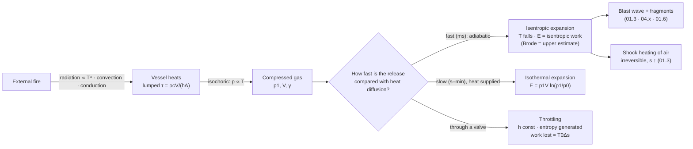

# 01.2 · Gases and thermodynamics

<div class="module-card">

**Prerequisites** [01.1 Mechanics refresher](lessons/stage-01/lesson-01.md) (energy vs power, pressure as energy density, control volumes) · calculus incl. simple ODEs.

**Estimated time** 4.5 h (2.5 h theory · 0.5 h simulator · 1.5 h exercises & programming) · **Level** Beginner → Intermediate

**Next** [01.3 Waves: from acoustics to shocks](lessons/stage-01/lesson-03.md) (uses $\gamma$, isentropic relations and entropy directly), and later [02.1 Chemical energy](lessons/stage-02/lesson-01.md).

<p class="tags"><span>physics</span><span>thermodynamics</span><span>ideal gas</span><span>isentropic</span><span>pressure vessels</span><span>heat transfer</span><span>Sim I</span></p>
</div>

## Why this matters

Almost everything that moves in an energetic event is a **hot, compressed gas**. The gas pushes air
into a shock (01.3), the shock heats and compresses the air behind it, and the resulting
temperatures, pressures and flows are governed by the thermodynamics of this lesson. Two quantities
in particular, the ratio of specific heats $\gamma$ and the isentropic relations, appear in every
formula of Stages 1, 2 and 4.

Thermodynamics also explains hazards an EOD scene contains *without* any explosive: a pressurised
gas cylinder that bursts in a fire, an oxygen regulator that ignites on sudden pressurisation, a
vehicle fire radiating heat across a street. The pressure-vessel burst energy (the **Brode
equation**) is a standard industrial-safety calculation. It is also the cleanest possible example of
"stored energy released quickly makes a blast", with no chemistry involved. Finally, **heat
transfer** tells you when a process is fast enough to count as adiabatic, and how quickly a fire
heats an object: questions that come back in thermal stability (02.3) and in secondary hazards
(04.4).

## Learning objectives

1. Use the ideal-gas law in mass and molar forms, and estimate when real-gas corrections matter.
2. Apply the first law to closed and open systems. Define internal energy, enthalpy, $c_v$, $c_p$
   and $\gamma$, and explain $c_p - c_v = R$.
3. Derive and apply the isentropic relations, and use them to predict temperatures in fast
   compressions and expansions.
4. Compute entropy changes of an ideal gas and explain lost work in irreversible processes.
5. Compute the stored energy of a compressed-gas vessel with three models (Brode, isentropic,
   isothermal), justify which applies, and compare with a liquid-filled vessel.
6. Estimate conductive, convective and radiative heat fluxes. Use the lumped-capacitance model and
   the Biot number, and use the thermal diffusion length to decide whether a process is adiabatic.

## Theory

### 1. The ideal gas, and when it is not ideal

$$ pV = nR_uT = mRT \quad\Longleftrightarrow\quad p = \rho R T, \qquad R = \frac{R_u}{\mathcal M}. $$

| Symbol | Meaning | SI unit |
|---|---|---|
| $p$ | absolute pressure | Pa |
| $V$ | volume | m³ |
| $n$ | amount of substance | mol |
| $R_u$ | universal gas constant, 8.314 J mol⁻¹ K⁻¹ | J mol⁻¹ K⁻¹ |
| $\mathcal M$ | molar mass (air ≈ 0.02897 kg/mol) | kg mol⁻¹ |
| $R$ | specific gas constant (air: 287.05) | J kg⁻¹ K⁻¹ |
| $\rho$ | density | kg m⁻³ |
| $T$ | absolute temperature | K |

**Intuition.** Pressure is the momentum flux of molecules hitting a wall. Doubling $T$ doubles the
mean molecular kinetic energy and so doubles $p$ at fixed density. Always use **absolute** pressure
and temperature. Gauge pressures (relative to ambient) are the most common source of error in
vessel calculations.

**Numerical examples.** Sea-level air at 15 °C: $\rho = 101\,325/(287.05\cdot288.15) = 1.225$ kg/m³.
A 50 L industrial cylinder at 200 bar and 15 °C holds, ideally,
$m = 2\times10^7\cdot0.05/(287.05\cdot288.15) = 12.1$ kg of air, roughly 10 m³ at ambient.

**Real gases.** Write $p = Z\rho RT$ with a compressibility factor $Z$. For air and nitrogen near
room temperature, $Z$ departs from 1 by only a few percent up to about 200 bar. For gases near
condensation ($\mathrm{CO_2}$, propane) the ideal-gas law fails badly, and the vessel holds a
*liquid* in equilibrium with its vapour. That changes the burst hazard completely (see the Expert
extension on BLEVE). The van der Waals equation
$\left(p + a/v^2\right)(v-b) = RT$ captures both effects qualitatively: $a$ models attraction,
$b$ the finite molecular volume.

```python
import numpy as np
R_U, M_AIR = 8.314462618, 0.0289647
R_AIR = R_U / M_AIR              # 287.05 J/(kg K)

def gas_mass(p_abs: float, V: float, T: float, R: float = R_AIR, Z: float = 1.0) -> float:
    """Mass of gas in a rigid volume [kg]."""
    return p_abs * V / (Z * R * T)

print(101325 / (R_AIR * 288.15))       # 1.225 kg/m^3
print(gas_mass(200e5, 0.050, 288.15))  # 12.09 kg
```

<details class="answer"><summary>Exercise 1 — then reveal</summary>

A 12 L diving cylinder is filled to 232 bar (absolute, as a simplification) at 15 °C. (a) What mass
of air does it hold? (b) The filled cylinder is left in a car that reaches 60 °C. What is the new
pressure? (c) By what percentage would a $Z=1.03$ correction change your answer to (a)?

*Answer.* (a) $232\times10^5\cdot0.012/(287.05\cdot288.15) = 3.37$ kg. (b) Isochoric:
$p_2 = 232\cdot333.15/288.15 = 268$ bar. That is why cylinders carry temperature limits and relief
devices. (c) $m \propto 1/Z$, so 3 % less: 3.27 kg.

</details>

### 2. The first law, internal energy, enthalpy and specific heats

For a closed system (fixed mass), and for a steady-flow open system:

$$ dU = \delta Q - \delta W,\qquad \delta W = p\,dV \;(\text{quasi-static}); \qquad
\dot Q - \dot W_s = \dot m\left[(h_2 - h_1) + \tfrac12(u_2^2-u_1^2) + g(z_2-z_1)\right]. $$

For an ideal gas, $u$ and $h$ depend on $T$ only:

$$ du = c_v\,dT,\qquad dh = c_p\,dT,\qquad h = u + pv,\qquad c_p - c_v = R,\qquad \gamma = \frac{c_p}{c_v},\qquad c_v = \frac{R}{\gamma-1},\quad c_p = \frac{\gamma R}{\gamma-1}. $$

| Symbol | Meaning | SI unit |
|---|---|---|
| $U$, $u$ | internal energy (total, per mass) | J, J kg⁻¹ |
| $h$ | specific enthalpy $u + p/\rho$ | J kg⁻¹ |
| $Q$, $W$ | heat added to, work done by, the system | J |
| $\dot W_s$ | shaft work rate (steady flow) | W |
| $c_v$, $c_p$ | specific heats at constant volume / pressure (air: 718, 1005) | J kg⁻¹ K⁻¹ |
| $\gamma$ | ratio of specific heats (air: 1.40) | — |

**Intuition.** Enthalpy is internal energy plus the "flow work" $pv$ needed to push a parcel of gas
into a control volume. It is the natural energy variable for anything that flows, including gas
crossing a shock (01.3: $h_1 + \tfrac12 w_1^2 = h_2 + \tfrac12 w_2^2$). Heating at constant pressure
costs more than at constant volume, because part of the heat does expansion work against the
surroundings. The difference per kelvin is exactly $R$.

$\gamma$ encodes how many ways a molecule can store energy. Monatomic gases (3 translational
degrees of freedom) have $\gamma = 5/3$. Diatomic gases near room temperature (+2 rotational)
have $\gamma = 7/5$. Hot, polyatomic combustion products, with vibrational modes active, have
$\gamma \approx 1.2$–1.3. A lower $\gamma$ means more of the energy is locked in internal modes
and less shows up as pressure. You will see this in 02.2.

**Numerical example.** Heat 1 kg of air by 100 K. At constant volume: $Q = c_v\Delta T = 71.8$ kJ.
At constant pressure: $Q = c_p\Delta T = 100.5$ kJ. The 28.7 kJ difference is the expansion work
$p\Delta V = R\Delta T$.

```python
GAMMA = 1.4
CV = R_AIR / (GAMMA - 1)          # 717.6
CP = GAMMA * R_AIR / (GAMMA - 1)  # 1004.7
print(CV * 100, CP * 100, (CP - CV) * 100)   # 71.8 kJ, 100.5 kJ, 28.7 kJ
```

<details class="answer"><summary>Exercise 2 — then reveal</summary>

Using equipartition (each quadratic degree of freedom contributes $\tfrac12 R$ per unit mass to
$c_v$), derive $\gamma$ for (a) argon, (b) nitrogen at 300 K, and (c) a hypothetical linear
triatomic gas with all vibrational modes fully excited (3 translational + 2 rotational + 4
vibrational modes, each vibration contributing 2 quadratic terms). Explain why hot combustion
products have $\gamma$ well below 1.4.

*Answer.* (a) $f=3$: $c_v = \tfrac32R$, $\gamma = 5/3 = 1.667$. (b) $f=5$: $\gamma = 7/5 = 1.4$.
(c) $f = 3+2+8 = 13$: $c_v = 6.5R$, $\gamma = 7.5/6.5 = 1.154$. At high temperature vibrational
modes are excited (and dissociation absorbs energy too), so $c_v$ rises and $\gamma$ falls
toward 1.2–1.3 for real product mixtures. Equipartition overestimates the effect because
vibrational modes switch on only gradually with temperature (a quantum effect).

</details>

### 3. Adiabatic and isentropic processes

A process with no heat exchange ($\delta Q = 0$) that is also reversible is **isentropic**. For an
ideal gas with constant $\gamma$:

$$ p v^{\gamma} = \text{const},\qquad \frac{T_2}{T_1} = \left(\frac{p_2}{p_1}\right)^{\frac{\gamma-1}{\gamma}} = \left(\frac{v_1}{v_2}\right)^{\gamma-1},\qquad
w_{1\to2} = c_v\,(T_1 - T_2) = \frac{p_1v_1 - p_2v_2}{\gamma-1}. $$

| Symbol | Meaning | SI unit |
|---|---|---|
| $v = 1/\rho$ | specific volume | m³ kg⁻¹ |
| $w_{1\to2}$ | work done *by* the gas per unit mass (closed system) | J kg⁻¹ |
| $(\gamma-1)/\gamma$ | isentropic exponent (air: 0.2857) | — |

**Intuition.** Compress a gas fast and the work you do has nowhere to go but into the gas's internal
energy, so it heats up. Let it expand fast and it pays for the expansion work from its own
internal energy, so it cools. "Fast" means faster than heat can diffuse in or out (§6.5).

**Numerical examples.**

- *Compression ignition.* Air at 20 °C compressed isentropically by a factor of 20 in pressure:
  $T_2 = 293.15\cdot20^{0.2857} = 690$ K (417 °C). This is how a diesel engine ignites its fuel
  without a spark.
- *Rapid expansion.* Air at 15 °C expanding isentropically from 200 bar to 1 bar:
  $T_2 = 288.15\cdot(1/200)^{0.2857} = 63$ K. In reality heat transfer and real-gas effects intervene,
  but the frost that forms on a rapidly discharging cylinder valve is this effect. The expansion
  work is $w = c_v(T_1-T_2) = 161$ kJ/kg.

```python
def isentropic_T(T1: float, p_ratio: float, gamma: float = GAMMA) -> float:
    """T2 for an isentropic change with p2/p1 = p_ratio."""
    return T1 * p_ratio ** ((gamma - 1) / gamma)

print(isentropic_T(293.15, 20))        # 690 K
print(isentropic_T(288.15, 1 / 200))   # 63.4 K
```

<details class="answer"><summary>Exercise 3: adiabatic compression ignition in oxygen systems — then reveal</summary>

A closed valve suddenly opens and admits 200 bar oxygen into a small dead-ended regulator cavity that
was at 1 bar and 20 °C. Treating the trapped gas as compressed isentropically ($\gamma = 1.4$), what
temperature could it reach? Why do oxygen-equipment standards insist on slow valve opening and on
clean, compatible materials?

*Answer.* $T_2 = 293.15\cdot200^{0.2857} = 1{,}332$ K, above 1,000 °C. That is hot enough to
ignite oils, polymer seats and even some metals in pure oxygen. Slow opening lets heat escape (the
process is then no longer adiabatic), and compatible materials raise the ignition threshold. This
is a pure-thermodynamics ignition mechanism: no spark and no fuel added. The same physics, a
fast compression heating a gas, reappears at the microscale as "hot spots" in 02.3.

</details>

### 4. The second law and entropy

$$ ds = \frac{\delta q_{\text{rev}}}{T}, \qquad s_2 - s_1 = c_p\ln\frac{T_2}{T_1} - R\ln\frac{p_2}{p_1} \;\;(\text{ideal gas}), \qquad \Delta S_{\text{universe}} \ge 0 . $$

| Symbol | Meaning | SI unit |
|---|---|---|
| $s$ | specific entropy | J kg⁻¹ K⁻¹ |
| $\delta q_{\text{rev}}$ | heat added along a reversible path | J kg⁻¹ |
| $T_0\,\Delta s_{\text{gen}}$ | lost work (exergy destroyed) at ambient $T_0$ | J kg⁻¹ |

**Intuition.** Entropy measures how much of a system's energy is no longer available to do work.
Irreversible processes (throttling, mixing, friction, heat flow across a finite temperature
difference and, crucially, **shocks**) generate entropy. The Gouy–Stodola theorem gives the work
you have lost for good: $T_0\,\Delta s_{\text{gen}}$.

**Numerical example: throttling.** Air leaks from 200 bar to 1 bar through a valve, with the
temperature (roughly) unchanged. The enthalpy is constant, and for an ideal gas that means $T$ is
constant. Then $\Delta s = R\ln 200 = 1{,}521$ J kg⁻¹ K⁻¹, and the lost work is
$T_0\Delta s = 288\cdot1521 = 438$ kJ/kg. Compare the 161 kJ/kg of *adiabatic* expansion work in §3:
throttling squanders more than the adiabatic process could ever have delivered, because the
isothermal ideal (what throttling "wastes") uses heat from the surroundings as well.

```python
def ds_ideal(T1, T2, p1, p2, cp=CP, R=R_AIR):
    return cp * np.log(T2 / T1) - R * np.log(p2 / p1)

ds = ds_ideal(288.15, 288.15, 200e5, 1e5)
print(ds, 288.15 * ds)     # 1521 J/(kg K), 438 kJ/kg
```

<details class="answer"><summary>Exercise 4 — then reveal</summary>

Verify that the isentropic relation of §3 gives $\Delta s = 0$ when substituted into the entropy
formula. Then use 01.3's shock result ($M_s=1.359$: $p_2/p_1 = 1.987$, $T_2/T_1 = 1.228$) to
compute the entropy generated per kg of air processed by that shock.

*Answer.* With $T_2/T_1 = (p_2/p_1)^{(\gamma-1)/\gamma}$:
$c_p\frac{\gamma-1}{\gamma}\ln\frac{p_2}{p_1} - R\ln\frac{p_2}{p_1} = \left(\frac{c_p(\gamma-1)}{\gamma}-R\right)\ln\frac{p_2}{p_1} = 0$,
since $c_p(\gamma-1)/\gamma = R$. For the shock: $\Delta s = 1004.7\ln1.228 - 287.05\ln1.987
= 206.4 - 197.1 \approx 9$ J kg⁻¹ K⁻¹. That is small but not zero: a 1-atmosphere shock is
already measurably irreversible (01.3 §5).

</details>

### 5. Stored energy in a compressed-gas vessel

If a rigid vessel of volume $V$ containing gas at absolute pressure $p_1$ fails suddenly, how much
energy is available to drive a blast wave and throw fragments? Three standard models give different
answers because they assume different processes.

$$
\underbrace{E_{\text{Brode}} = \frac{(p_1-p_0)\,V}{\gamma-1}}_{\text{constant-volume energy difference}},\qquad
\underbrace{E_{\text{isen}} = \frac{p_1V}{\gamma-1}\left[1-\left(\frac{p_0}{p_1}\right)^{\frac{\gamma-1}{\gamma}}\right]}_{\text{reversible adiabatic expansion work}},\qquad
\underbrace{E_{\text{isoT}} = p_1V\ln\frac{p_1}{p_0}}_{\text{isothermal expansion work}}
$$

| Symbol | Meaning | SI unit |
|---|---|---|
| $p_1$ | absolute pressure inside the vessel at failure | Pa |
| $p_0$ | ambient absolute pressure | Pa |
| $V$ | internal (gas) volume | m³ |
| $\gamma$ | ratio of specific heats of the *contained* gas | — |
| $E$ | stored mechanical energy estimate | J |

**Where they come from.**

- **Brode (1959).** The internal energy of the gas at $p_1$, minus that of the same volume at
  $p_0$: $\frac{p_1V}{\gamma-1} - \frac{p_0V}{\gamma-1}$. It is simple and widely used in
  pressure-vessel safety, and it is an upper estimate for a fast (adiabatic) burst.
- **Isentropic.** The work the gas does expanding reversibly and adiabatically to $p_0$
  ($w = c_v(T_1-T_2)$ times the mass). It is always less than Brode. The difference is internal
  energy the cooled gas keeps.
- **Isothermal.** This assumes that heat flows in during the expansion to keep $T$ constant.
  That is physically implausible in a millisecond burst (§6.5), and it overestimates at high
  pressure ratios.

**Numerical example.** A 50 L cylinder of air at 200 bar ($p_0 = 1$ bar):

| Model | Energy | "TNT-equivalent" energy units (÷ 4.184 MJ) |
|---|---|---|
| Brode | 2.49 MJ | 0.59 |
| Isentropic | 1.95 MJ | 0.47 |
| Isothermal | 5.30 MJ | 1.27 |
| Same vessel filled with **water** at 200 bar: $E = V\Delta p^2/(2K)$, $K = 2.2$ GPa | 4.5 kJ | 0.001 |

The gas-filled cylinder stores about **550 times** the energy of the water-filled one. That is why
vessels are proof-tested **hydrostatically** (with water), never with gas: if the vessel fails
during the test, almost nothing is released. Only part of the gas energy becomes blast. The rest goes
into kinetic energy of the vessel fragments and heat, and the split depends on how the vessel
fails. Baker et al. (1983) treat blast and fragments from bursting vessels in detail.

```python
def vessel_energies(p1: float, V: float, p0: float = 1.01325e5, gamma: float = GAMMA) -> dict:
    """Stored-energy estimates for a gas-filled rigid vessel [J]."""
    k = (gamma - 1) / gamma
    return {
        "brode": (p1 - p0) * V / (gamma - 1),
        "isentropic": p1 * V / (gamma - 1) * (1 - (p0 / p1) ** k),
        "isothermal": p1 * V * np.log(p1 / p0),
    }

def liquid_energy(dp: float, V: float, K: float = 2.2e9) -> float:
    """Elastic energy of a compressed liquid (bulk modulus K) [J]."""
    return V * dp**2 / (2 * K)

e = vessel_energies(200e5, 0.050, p0=1e5)
print({k: round(v / 1e6, 3) for k, v in e.items()})     # brode 2.488, isentropic 1.950, isothermal 5.298 MJ
print(liquid_energy(199e5, 0.050))                       # ~4.5 kJ
```

<details class="answer"><summary>Exercise 5 — then reveal</summary>

(a) Show that for $p_1/p_0 \to 1$ the Brode and isothermal estimates differ, and find their ratio
in the limit. (Hint: expand $\ln(1+x)$.) (b) Compute the three estimates for a 12 L cylinder at
232 bar. (c) A car tyre (30 L, 2.2 bar gauge, air): compute the Brode energy. Why can a tyre that
bursts during inflation injure a mechanic badly despite this "small" number?

*Answer.* (a) Let $x = p_1/p_0 - 1$. Brode: $p_0Vx/(\gamma-1)$. Isothermal:
$p_0V(1+x)\ln(1+x)\approx p_0Vx$. Ratio isothermal/Brode $\to \gamma-1 = 0.4$. At low pressure
ratios Brode *exceeds* isothermal (they cross near $p_1/p_0 \approx 10$). At 200 the isothermal
estimate is 2.1× Brode. (b) Brode 0.693 MJ, isentropic ≈ 0.54 MJ, isothermal ≈ 1.52 MJ.
(c) $E = 2.2\times10^5\cdot0.03/0.4 = 16.5$ kJ. That is comparable to a 1,000 kg car at 5.7 m/s,
delivered in milliseconds through a heavy rim or ring component. Energy *concentration* and *rate*
matter (01.1 §2, §5).

</details>

### 6. Heat transfer: conduction, convection, radiation

#### 6.1 Conduction (Fourier's law)

$$ q'' = -k\,\nabla T \;\;\Rightarrow\;\; q'' = k\frac{\Delta T}{L}\ \text{(slab, steady)} $$

| Symbol | Meaning | SI unit |
|---|---|---|
| $q''$ | heat flux | W m⁻² |
| $k$ | thermal conductivity (steel ≈ 45, glass ≈ 1, mineral wool ≈ 0.04) | W m⁻¹ K⁻¹ |
| $L$ | thickness | m |

**Example.** A 50 K difference across 10 mm of steel drives $45\cdot50/0.01 = 225$ kW/m². Across
50 mm of mineral wool it drives $0.04\cdot50/0.05 = 40$ W/m². The factor of 5,600 is why insulation
works.

#### 6.2 Convection (Newton's law of cooling)

$$ q'' = h\,(T_s - T_\infty) $$

$h$ is not a material property but a flow property: natural convection in air 2–25 W m⁻² K⁻¹,
forced air 25–250, boiling water ≫ 1,000. For 1 m² at 50 K: $h=10$ gives 500 W, $h=100$ gives
5 kW.

#### 6.3 Radiation (Stefan–Boltzmann, with a view factor)

$$ q''_{\text{emit}} = \varepsilon\sigma T^4,\qquad q''_{\text{recv}} \approx F\,\varepsilon\sigma\left(T_f^4 - T_r^4\right),\qquad F \approx \left(\frac{R_f}{d}\right)^2 \;(\text{sphere of radius } R_f \text{ at distance } d \gg R_f,\ \text{facing surface}) $$

| Symbol | Meaning | SI unit |
|---|---|---|
| $\sigma$ | Stefan–Boltzmann constant, 5.670×10⁻⁸ | W m⁻² K⁻⁴ |
| $\varepsilon$ | emissivity (0–1) | — |
| $F$ | view factor from receiver to source | — |
| $T_f$, $T_r$ | source (flame) and receiver temperatures | K |

**Example.** A sooty flame region at 1,300 K ($\varepsilon \approx 1$) emits
$5.67\times10^{-8}\cdot1300^4 = 162$ kW/m² from its surface. A receiver 20 m from a fire ball of
2 m radius sees $F = 0.01$, so about **1.6 kW/m²**, comparable to strong midday sunlight
(≈ 1 kW/m²). The $T^4$ law makes radiation dominate at fire temperatures. The $1/d^2$ fall-off is
why *distance* is the first protection against thermal effects, as it is for blast.

#### 6.4 Lumped capacitance and the Biot number

If a body conducts heat internally much faster than it receives it at the surface, its temperature
is nearly uniform and obeys

$$ \rho c V\frac{dT}{dt} = hA\,(T_\infty - T)\;\Rightarrow\; T(t) = T_\infty - (T_\infty - T_0)\,e^{-t/\tau},\qquad \tau = \frac{\rho c V}{hA},\qquad \mathrm{Bi} = \frac{h L_c}{k} \ll 0.1 , $$

with $L_c = V/A$ (for a plate heated on one face, its thickness).

**Example.** A 5 mm steel plate ($\rho = 7850$, $c = 490$, $k = 45$) exposed on one face to a fire
environment at 1,100 K with an effective $h = 50$ W m⁻² K⁻¹: $\tau = 7850\cdot490\cdot0.005/50
= 385$ s, and $\mathrm{Bi} = 0.0056$ (so the lumped model is valid). After 10 min,
$T = 1100 - 812\,e^{-600/385} = 930$ K. Radiation actually makes $h$ temperature-dependent. The
linearised radiative coefficient is $h_r = \varepsilon\sigma(T^2+T_\infty^2)(T+T_\infty) \approx 121$
W m⁻² K⁻¹ at $T=600$ K, $T_\infty = 1100$ K, $\varepsilon = 0.8$, so $h=50$ is optimistic. The
programming exercise treats the nonlinear case.

#### 6.5 When is a process adiabatic? The thermal diffusion length

Heat diffuses a distance $\delta \sim \sqrt{\alpha t}$ in time $t$, with thermal diffusivity
$\alpha = k/(\rho c)$ (steel ≈ 1.2×10⁻⁵ m²/s, air ≈ 2.2×10⁻⁵ m²/s).

- In 1 ms, heat penetrates steel by $\sqrt{1.2\times10^{-5}\cdot10^{-3}} = 0.11$ mm.
- In 10 ms, heat diffuses 0.47 mm through air, while a sound wave travels 3.4 m.

So **fast events are adiabatic** to excellent approximation: heat has no time to move over the
length scales that matter. This single estimate justifies the adiabatic, inviscid (Euler) model of
01.3 and the isentropic and Brode estimates of §5, and rules out the isothermal one for bursts.

```python
SIGMA = 5.670374419e-8

def conduction_flux(k, dT, L):          return k * dT / L
def convection_flux(h, Ts, Tinf):       return h * (Ts - Tinf)
def radiation_flux(T_f, T_r=293.15, eps=1.0, F=1.0):
    return F * eps * SIGMA * (T_f**4 - T_r**4)

def lumped_T(t, T0, Tinf, rho, c, L, h):
    tau = rho * c * L / h
    return Tinf - (Tinf - T0) * np.exp(-t / tau), tau

print(conduction_flux(45, 50, 0.01))                 # 225 kW/m^2
print(SIGMA * 1300**4, radiation_flux(1300, 0.0, 1.0, 0.01))   # 162 kW/m^2; 1.62 kW/m^2
print(lumped_T(600, 293, 1100, 7850, 490, 0.005, 50))           # (930 K, 385 s)
print(np.sqrt(1.2e-5 * 1e-3), np.sqrt(2.2e-5 * 1e-2))          # 0.11 mm, 0.47 mm
```

<details class="answer"><summary>Exercise 6 — then reveal</summary>

(a) A fire ball of radius 5 m at 1,400 K ($\varepsilon=1$). At what distance does the received
flux fall to 5 kW/m²? (b) A thermocouple bead ($d = 0.5$ mm, steel-like properties, $h = 200$) must
follow a fast temperature transient. Estimate its time constant. What does this imply for measuring
the temperature behind a shock (01.3)?

*Answer.* (a) Emitted $\sigma T^4 = 5.67\times10^{-8}\cdot1400^4 = 217.8$ kW/m². We need
$F = 5/217.8 = 0.023$, so $d = R_f/\sqrt F = 5/0.1515 \approx 33$ m. (b) Sphere: $L_c = d/6 = 8.3\times10^{-5}$
m, $\tau = 7850\cdot490\cdot8.3\times10^{-5}/200 \approx 1.6$ s. A shock heats the gas for
milliseconds, so the bead reads essentially nothing. Transient gas temperatures are inferred from
pressure and velocity measurements via Rankine–Hugoniot, or measured optically, not with contact
sensors. Sensor time constants recur in Stage 5.

</details>

## Visual explanation



The loop at the bottom is the fire-exposed-cylinder problem of the worked example. Heat raises
pressure, pressure raises stored energy, and the wall weakens as it heats.

Sim I's shock tube is a controlled vessel burst. A high-pressure *driver* section is separated from
a low-pressure *driven* section by a diaphragm, and when the diaphragm breaks you see both
processes of this lesson at once: an isentropic expansion fan cooling the driver gas and a shock
heating the driven gas.

<iframe class="sim-frame" src="sims/shock-tube/index.html?embed=1" height="720" loading="lazy"></iframe>

<a class="sim-link" href="sims/shock-tube/index.html" target="_blank">Open Sim I full-screen ↗</a>

## Worked example: a workshop air receiver in a fire

A fictional workshop has a 500 L steel compressed-air receiver at 11 bar absolute, 15 °C, with a
6 mm wall. A fire starts nearby. Ambient is 1.013 bar.

1. **Contents.** $m = 11\times10^5\cdot0.5/(287.05\cdot288.15) = 6.65$ kg of air.
2. **Stored energy now.** Brode: $(11 - 1.013)\times10^5\cdot0.5/0.4 = 1.25$ MJ. Isentropic:
   0.68 MJ. Isothermal: 1.31 MJ. At this modest pressure ratio (≈ 11) Brode and isothermal almost
   coincide (Exercise 5a). For a fast burst, 0.7–1.25 MJ is the defensible range.
3. **Why it was hydrotested.** At a 1.5× test pressure (16.5 bar abs) the vessel full of *water*
   stores $V\Delta p^2/2K = 0.5\cdot(15.5\times10^5)^2/(4.4\times10^9) \approx 270$ J. Full of *air* at
   the same pressure it would store 1.94 MJ, 7,000 times more.
4. **Heating.** Wall lumped time constant with $h_{\text{eff}} = 100$ W m⁻² K⁻¹ (convection plus
   linearised radiation): $\tau = 7850\cdot490\cdot0.006/100 = 231$ s, $\mathrm{Bi} = 0.013$.
   With a 1,100 K environment the wall reaches 600 K after
   $t = \tau\ln\frac{1100-288}{1100-600} = 112$ s, under two minutes.
5. **Pressure rise.** If the gas follows the wall temperature (isochoric),
   $p = 11\cdot600/288 = 22.9$ bar. The Brode energy more than doubles, to ≈ 2.7 MJ, while steel
   strength falls with temperature. Pressure relief devices exist for exactly this failure path.
6. **What this means for a responder (conceptually).** A fire-exposed pressure vessel is a
   time-dependent hazard: its stored energy *increases* while its strength *decreases*, over
   minutes. That is the reasoning behind treating cylinders in fires as secondary hazards with
   their own isolation distances (04.4, 07.2).

Checks: Pa·m³ = J ✓. $\tau$: (kg m⁻³)(J kg⁻¹ K⁻¹)(m)/(W m⁻² K⁻¹) = s ✓.

## Simulation work

<div class="callout sim">

**Sim I: Shock-tube explorer.** (1) Set a driver-to-driven pressure ratio of 10 with air on both
sides. Before revealing, predict the temperature of the driver gas after the expansion fan passes,
using §3 and the pressure it expands to (read it from the plot). Compare. (2) Replace the driver gas
with helium ($\gamma = 5/3$, much lower molar mass) at the same pressure ratio. Does the shock get
stronger or weaker? Explain with $a = \sqrt{\gamma RT}$ (01.3). (3) Compute the Brode energy per unit
cross-section of your driver section and compare it with the kinetic energy in the flow behind the
shock at a chosen time. Where is the rest?

</div>

## Practical exercises

<details class="answer"><summary>Exercise 7: which model applies? — then reveal</summary>

For each case, choose isothermal, isentropic/adiabatic or throttling, and justify it with a time
scale: (a) a compressor slowly filling a large receiver over 20 minutes; (b) a cylinder valve
snapping off in 5 ms; (c) a slow leak through a cracked fitting over a day; (d) the air behind a
shock front, over the first millisecond.

*Answer.* (a) Nearly isothermal: over minutes the vessel wall exchanges heat with the gas and room,
although the gas initially heats. Receivers get warm while filling. (b) Adiabatic, close to
isentropic for the bulk gas; the nozzle flow itself chokes. (c) Throttling: enthalpy conserved
across the leak, with entropy generated, while the vessel contents stay near room temperature.
(d) Adiabatic but *not* isentropic: the shock generates entropy (01.3). Behind it, the flow is
isentropic along particle paths until the next shock.

</details>

<details class="answer"><summary>Exercise 8: open-system first law — then reveal</summary>

Air flows steadily through an insulated nozzle from a large plenum (stagnation state 10 bar, 300 K,
velocity ≈ 0) to an exit at 1 bar. Assuming isentropic flow, find the exit temperature and velocity.
Is this velocity supersonic?

*Answer.* $T_e = 300\cdot(0.1)^{0.2857} = 155.4$ K. Energy: $u_e = \sqrt{2c_p(T_0-T_e)}
= \sqrt{2\cdot1004.7\cdot144.6} = 539$ m/s. Local sound speed $\sqrt{1.4\cdot287.05\cdot155.4} = 250$ m/s,
so $M_e = 2.16$: supersonic. That requires a converging–diverging nozzle. A simple hole would choke
at $M=1$ and the flow would expand outside it (a jet with shock cells).

</details>

## Programming exercise — a stored-energy and fire-exposure calculator

**Goal.** A small library that a safety engineer could use to compare stored-energy models for
vessels and to estimate time-to-temperature for a fire-exposed object with nonlinear radiation.

- **Input:** vessel `(p_abs [Pa], V [m³], gas γ, fill: "gas"|"liquid", K for liquids)`;
  exposure `(T_env [K], ε, h_conv [W m⁻² K⁻¹], wall ρ, c, thickness)`.
- **Output:** `energies()` → dict of Brode / isentropic / isothermal / liquid [J] plus energy-unit
  equivalents; `time_to(T_target)` [s] from integrating
  $\rho c L\,\dot T = h(T_{env}-T) + \varepsilon\sigma(T_{env}^4 - T^4)$; `pressure_at(T)` [Pa]
  for an isochoric gas.
- **Constraints:** NumPy only (write your own RK4, or use `scipy.integrate.solve_ivp` as an
  extension); SI units internally, with explicit conversion helpers for bar and °C; raise if
  $\mathrm{Bi} > 0.1$ (the lumped model is invalid).
- **Expected behaviour:** reproduces every number in §5 and the worked example; with
  $\varepsilon=0$ the time-to-temperature matches the analytic lumped solution to < 0.1 %; with
  radiation on, it is *faster* than the $h=100$ linear estimate.
- **Test cases:** (i) 50 L / 200 bar air → Brode 2.4875 MJ (with $p_0 = 1$ bar); (ii) Brode ≥
  isentropic for all $p_1 > p_0$ (property test); (iii) the isothermal/Brode ratio → 0.4 as
  $p_1/p_0 \to 1$; (iv) liquid energy scales with $\Delta p^2$; (v) the lumped analytic check.
- **Extensions:** add a real-gas $Z(p,T)$ correction from a virial fit; add a relief valve that
  opens at a set pressure and vents with a choked-flow law (01.1 Exercise 5); plot stored energy
  against time during fire exposure. The stored-energy output becomes an input to the abstract-yield
  blast calculations of [Project P01](projects/p01-blast-wave/README.md).

## Reading

- **J. D. Anderson, *Modern Compressible Flow*, 4th ed.** (McGraw-Hill, 2021).
  https://www.mheducation.com/highered/product/modern-compressible-flow-with-historical-perspective-anderson.html.
  Ch. 1 has the thermodynamics review (first and second law, isentropic relations, $\gamma$) written
  with shocks in mind. It is the most direct preparation for 01.3.
- **MIT OCW 2.26 *Compressible Fluid Dynamics*** (A. E. Hosoi, 2004).
  https://ocw.mit.edu/courses/2-26-compressible-fluid-dynamics-spring-2004/. The early lecture
  notes on thermodynamics of gases and on the shock tube (Sim I).
- **W. E. Baker et al., *Explosion Hazards and Evaluation*** (Elsevier, 1983).
  https://shop.elsevier.com/books/explosion-hazards-and-evaluation/baker/978-0-444-42094-7. Read the
  material on blast and fragments from bursting gas vessels. It is the standard engineering treatment
  of §5.
- **P. W. Cooper, *Explosives Engineering*** (Wiley-VCH, 1996).
  https://www.wiley-vch.de/en/areas-interest/engineering/explosives-engineering-978-0-471-18636-6.
  The energetics and thermochemistry part. Read the thermodynamics chapters now, the chemistry in 02.1.
- **Ya. B. Zel'dovich & Yu. P. Raizer, *Physics of Shock Waves and High-Temperature Hydrodynamic
  Phenomena*** (Dover, 2002). Keep it as a reference for real-gas effects and variable $\gamma$ at
  high temperature (Expert extension).

Full bibliographic entries: [curriculum/sources.md](curriculum/sources.md).

## Assessment

1. *(Conceptual)* Why does air cool when it expands through a fast-opening valve but not (for an
   ideal gas) when it leaks slowly through a porous plug? Name the conserved quantity in each case.
2. *(Mathematical)* Derive the Brode expression from $U = pV/(\gamma-1)$ for an ideal gas with
   constant $\gamma$. State every assumption.
3. *(Computation)* A 10 L helium cylinder ($\gamma = 5/3$) at 150 bar. Compute the Brode energy and
   compare with the same cylinder filled with air. Explain the difference physically.
4. *(Interpretation)* Two published hazard assessments of the same vessel give 0.8 MJ and 2.1 MJ.
   Without seeing either, what are the two most likely reasons?
5. *(Design)* You must specify a temperature sensor for a robot that approaches fire scenes. Use the
   lumped time constant and the Biot number to set requirements on sensor size and mounting.

<details class="answer"><summary>Answers to 3 and 4</summary>

3. Helium: $(150-1)\times10^5\cdot0.01/(2/3) = 0.224$ MJ. Air: $149\times10^5\cdot0.01/0.4 = 0.373$ MJ.
   At the same $p$ and $V$ the internal energy is $pV/(\gamma-1)$. Helium's monatomic molecules
   store energy only in translation, which *is* pressure, so there is less internal energy per unit
   of pressure than in air, whose rotational modes store extra energy.
4. Different models (isentropic against isothermal, or Brode), and gauge against absolute pressure,
   or a different assumed failure pressure (working pressure against relief-valve set point against
   burst pressure). Any assessment must state which model and which pressure.

</details>

## Expert extension

- **BLEVE.** A vessel of liquefied gas (e.g. propane) contains a liquid held above its atmospheric
  boiling point. On sudden depressurisation part of the liquid flashes to vapour, and the available
  energy is dominated by the superheated liquid, not the vapour space. Model the flash fraction from
  an enthalpy balance and compare with the Brode estimate of the vapour space alone.
- **Variable $\gamma$ and real gases.** Above about 2,000 K in air, vibration and dissociation make
  $\gamma = \gamma(T,p)$. Implement an equilibrium $c_p(T)$ from polynomial fits and redo the
  isentropic compression of Exercise 3. (Zel'dovich & Raizer, ch. III.)
- **Exergy analysis.** Recast §5 as an exergy (availability) calculation,
  $\Phi = (U - U_0) + p_0(V - V_0) - T_0(S - S_0)$, and show which of the three models it
  reproduces under which assumptions.

## What comes next

[01.3](lessons/stage-01/lesson-03.md) uses $\gamma$, the isentropic relations and the entropy
formula of this lesson to build sound waves and then shocks. [02.1](lessons/stage-02/lesson-01.md)
adds *chemical* energy to the first law: enthalpies of reaction and adiabatic flame temperature.
