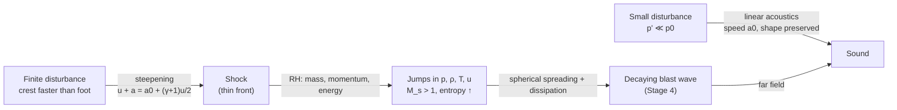

# 01.3 · Waves: from acoustics to shocks

<div class="module-card">

**Prerequisites** [01.1 Mechanics](lessons/stage-01/lesson-01.md) (conservation laws, control volumes) · [01.2 Gases & thermodynamics](lessons/stage-01/lesson-02.md) (ideal gas, adiabatic processes, $\gamma$) · calculus incl. partial derivatives.

**Estimated time** 6 h (3 h theory · 1.5 h simulator · 1.5 h programming) · **Level** Intermediate

**Next** [01.4 Reflection, transmission & dynamic pressure](lessons/stage-01/lesson-04.md) and [01.5 Scaling laws](lessons/stage-01/lesson-05.md), then [04.1 Anatomy of a blast wave](lessons/stage-04/lesson-01.md).

<p class="tags"><span>physics</span><span>PDEs</span><span>conservation laws</span><span>Sim D · Sim I</span><span>P01</span></p>
</div>

## Why this matters

Every protective decision in EOD — how far to push a cordon, what a wall will do, why a window
two streets away breaks while one next to a building corner survives — rests on how pressure
disturbances travel through air. Weak disturbances are sound: linear, superposable, travelling at
the speed of sound $a_0 \approx 340$ m/s. Strong disturbances are **shocks**: nonlinear,
travelling *faster* than sound, carrying an almost discontinuous jump in pressure, density,
temperature and velocity. The blast wave of Stage 4 is a decaying shock. This lesson builds the
bridge, and the single most useful result — the **Rankine–Hugoniot jump conditions** — is
derived from nothing more than conservation of mass, momentum and energy.

## Learning objectives

1. Derive the linear acoustic wave equation from the Euler equations and explain every
   linearisation it needs.
2. Explain **why large-amplitude waves steepen** into shocks (amplitude-dependent wave speed).
3. Derive the **Rankine–Hugoniot** relations for a normal shock in an ideal gas and use them to
   map shock Mach number $M_s$ ↔ overpressure ↔ density, temperature and particle velocity.
4. Explain why a shock is **irreversible** (entropy rises) and why that matters for how blast
   energy is dissipated with distance.
5. Represent all of the above computationally: closed-form functions, and a finite-volume solver
   that *produces* a shock from smooth initial data.

## Theory

### 1. The governing equations (1D Euler)

For inviscid, non-heat-conducting gas flow in one dimension:

$$
\frac{\partial \rho}{\partial t} + \frac{\partial (\rho u)}{\partial x} = 0,\qquad
\frac{\partial (\rho u)}{\partial t} + \frac{\partial (\rho u^2 + p)}{\partial x} = 0,\qquad
\frac{\partial E}{\partial t} + \frac{\partial \big((E+p)u\big)}{\partial x} = 0,
$$

with total energy per volume $E = \dfrac{p}{\gamma-1} + \tfrac12 \rho u^2$.

| Symbol | Meaning | SI unit | Dimensions |
|---|---|---|---|
| $\rho$ | density | kg m⁻³ | M L⁻³ |
| $u$ | particle (flow) velocity | m s⁻¹ | L T⁻¹ |
| $p$ | pressure | Pa = N m⁻² | M L⁻¹ T⁻² |
| $E$ | total energy per unit volume | J m⁻³ (= Pa) | M L⁻¹ T⁻² |
| $\gamma$ | ratio of specific heats $c_p/c_v$ | — | 1 (1.4 for air) |

<div class="callout physics">

**Intuition.** These are bookkeeping statements. Mass in minus mass out equals accumulation;
the same for momentum (where pressure acts as a momentum flux) and for energy (where $pu$ is the
work done by pressure). Everything in this lesson — sound, shocks, blast — is a consequence.

</div>

### 2. Linear acoustics

Write $\rho=\rho_0+\rho'$, $p=p_0+p'$, $u=u'$ with primes small, keep first-order terms, and use
the isentropic relation $p' = a_0^2 \rho'$, where

$$ a_0^2 = \left(\frac{\partial p}{\partial \rho}\right)_s = \frac{\gamma p_0}{\rho_0} = \gamma R T_0 . $$

Eliminating $u'$ gives the **wave equation**

$$ \frac{\partial^2 p'}{\partial t^2} = a_0^2\,\frac{\partial^2 p'}{\partial x^2}, \qquad p'(x,t) = f(x-a_0t) + g(x+a_0t). $$

- **Variables:** $p'$ acoustic overpressure [Pa]; $a_0$ speed of sound [m/s]; $R$ specific gas
  constant (287 J kg⁻¹ K⁻¹ for air); $T_0$ ambient temperature [K].
- **Intuition:** pressure pushes fluid, which compresses the fluid ahead, which pushes further:
  a relay whose speed depends only on the medium's stiffness-to-inertia ratio $\gamma p_0/\rho_0$.
  Any *shape* $f$ travels unchanged.
- **Numerical example:** at 15 °C, $a_0 = \sqrt{1.4 \times 287 \times 288.15} = 340.3$ m/s. At
  −20 °C: $\sqrt{1.4\times287\times253.15} = 318.9$ m/s — cold air carries sound 6 % slower.
- **Acoustic impedance.** For a right-running wave $p' = \rho_0 a_0 u'$. The product
  $Z_a=\rho_0 a_0 \approx 413$ Pa·s/m for air — it reappears in 01.4 for reflection.

```python
import numpy as np
R_AIR, GAMMA = 287.05, 1.4

def sound_speed(T_kelvin: float, gamma: float = GAMMA, R: float = R_AIR) -> float:
    """Isentropic speed of sound of an ideal gas [m/s]."""
    return np.sqrt(gamma * R * T_kelvin)

print(sound_speed(288.15))   # 340.3
```

<details class="answer"><summary>Exercise 1 — then reveal</summary>

A sound level of 140 dB SPL corresponds to an RMS overpressure of 200 Pa. (a) What particle
velocity amplitude does this imply? (b) What fraction of $p_0$ is this, and is linear acoustics
still reasonable?

*Answer.* (a) $u' = p'/(\rho_0 a_0) = 200/413 \approx 0.48$ m/s (RMS). (b) $200/101\,325
\approx 0.2\,\%$ — comfortably linear. Linearity starts to fail when $p'/p_0$ is a few percent
*and* the wave has travelled far enough for steepening to accumulate (next section).

</details>

### 3. Why strong waves steepen

The linearisation hid the key fact: each part of a finite-amplitude wave travels at the *local*
signal speed $u + a$. In a compression, the gas is both moving forward ($u>0$) and hotter
($a>a_0$). For a simple (right-running) isentropic wave,

$$ u + a = a_0 + \frac{\gamma+1}{2}\,u . $$

So the high-pressure crest outruns the ambient-pressure foot. The front **steepens** until
gradients become so large that viscosity and heat conduction — neglected in Euler — act over a
few mean free paths (≈ 0.1 µm in air). On any engineering scale the front is then a
**discontinuity: a shock**. Rarefactions do the opposite: they spread out.

<div class="callout key">

**Key idea.** The time to shock formation scales like $t_s \sim \dfrac{2\lambda}{(\gamma+1)\,2\pi\,u'_{\max}}$
for a wave of wavelength $\lambda$: the bigger the amplitude, the sooner it shocks. Near an
energetic event amplitudes are enormous, so the wave is a shock essentially from birth.

</div>

<details class="answer"><summary>Exercise 2 — then reveal</summary>

Take $u'_{\max}=10$ m/s and $\lambda = 3.4$ m (100 Hz). Estimate $t_s$ and the distance travelled
before shocking. Then repeat for $u'_{\max}=0.5$ m/s.

*Answer.* $t_s \approx 2(3.4)/(2.4\cdot 2\pi\cdot 10) \approx 0.045$ s ⇒ ≈ 15 m. With 0.5 m/s:
≈ 0.9 s ⇒ ≈ 310 m (and in reality absorption usually wins first). Loud-but-ordinary sounds rarely
shock; blast waves always start as shocks.

</details>

### 4. The Rankine–Hugoniot jump conditions

Move into the frame of a steady normal shock travelling at speed $U_s$ into still gas (state 1).
In that frame gas enters at $w_1 = U_s$ and leaves at $w_2 = U_s - u_2$. Applying the three
conservation laws to a thin control volume around the discontinuity:

$$ \rho_1 w_1 = \rho_2 w_2,\qquad p_1 + \rho_1 w_1^2 = p_2 + \rho_2 w_2^2,\qquad h_1 + \tfrac12 w_1^2 = h_2 + \tfrac12 w_2^2, $$

with enthalpy $h = \dfrac{\gamma}{\gamma-1}\dfrac{p}{\rho}$. Define the **shock Mach number**
$M_s = U_s/a_1$. Solving (a page of algebra — do it once, see the exercise):

<div class="callout eq">

$$
\frac{p_2}{p_1} = 1+\frac{2\gamma}{\gamma+1}\left(M_s^2-1\right),\qquad
\frac{\rho_2}{\rho_1} = \frac{(\gamma+1)M_s^2}{(\gamma-1)M_s^2+2},\qquad
\frac{T_2}{T_1} = \frac{p_2}{p_1}\,\frac{\rho_1}{\rho_2},
$$

$$
\frac{u_2}{a_1} = \frac{2}{\gamma+1}\left(M_s-\frac{1}{M_s}\right),\qquad
\Delta p \equiv p_2 - p_1 \;\Rightarrow\; M_s = \sqrt{1+\frac{\gamma+1}{2\gamma}\frac{\Delta p}{p_1}} .
$$

For air ($\gamma=1.4$): $\Delta p/p_1 = \tfrac{7}{6}(M_s^2-1)$.

</div>

| Quantity | Meaning | Unit |
|---|---|---|
| $M_s$ | shock speed / ambient sound speed | — |
| $p_2/p_1$ | static pressure ratio across the shock | — |
| $\Delta p$ | (peak) **overpressure** — the number blast literature tabulates | Pa, kPa |
| $\rho_2/\rho_1$ | compression; bounded by $(\gamma+1)/(\gamma-1)=6$ for air | — |
| $u_2$ | velocity of the gas *behind* the shock (the "blast wind") | m/s |

**Physical intuition.**

- A shock of any strength moves faster than sound ($M_s>1$); as $\Delta p\to0$, $M_s\to1$ and
  everything reduces to acoustics.
- Density saturates at 6× (ideal air) no matter how strong the shock: you cannot compress gas
  arbitrarily by *shocking* it — the energy goes into temperature instead. That is why strong
  shocks are so hot.
- The gas behind the shock *moves*. That flow carries kinetic energy per volume
  $q = \tfrac12\rho_2u_2^2$ — the **dynamic pressure** (01.4), which is what knocks things over.

**Numerical example.** A shock with $\Delta p = 100$ kPa into sea-level air
($p_1=101.3$ kPa, $a_1 = 340.3$ m/s, $T_1=288$ K):

| Step | Result |
|---|---|
| $M_s=\sqrt{1+\tfrac{2.4}{2.8}\cdot\tfrac{100}{101.3}}$ | 1.359 |
| $U_s = M_s a_1$ | 462 m/s |
| $p_2/p_1$ | 1.987 |
| $\rho_2/\rho_1 = \dfrac{2.4\cdot1.846}{0.4\cdot1.846+2}$ | 1.618 |
| $T_2 = 288\cdot1.987/1.618$ | 354 K (+66 °C) |
| $u_2 = \tfrac{2}{2.4}(1.359-1/1.359)\cdot340.3$ | 177 m/s |

A 1-atmosphere overpressure shock drags the air behind it at ≈ 180 m/s — hurricane winds are
~70 m/s.

```python
def shock_jump(M: float, gamma: float = GAMMA) -> dict:
    """Normal-shock Rankine–Hugoniot ratios for an ideal gas (state 2 / state 1)."""
    M2 = M * M
    pr = 1 + 2 * gamma / (gamma + 1) * (M2 - 1)
    rr = (gamma + 1) * M2 / ((gamma - 1) * M2 + 2)
    return {"p": pr, "rho": rr, "T": pr / rr, "u_over_a1": 2 / (gamma + 1) * (M - 1 / M)}

def mach_from_overpressure(dp: float, p1: float = 101.325e3, gamma: float = GAMMA) -> float:
    return np.sqrt(1 + (gamma + 1) / (2 * gamma) * dp / p1)

M = mach_from_overpressure(100e3)
print(M, shock_jump(M))
```

<details class="answer"><summary>Exercise 3 — derive, then reveal</summary>

Starting from the three conservation statements, derive $\rho_2/\rho_1$ as a function of $M_s$.
Hint: eliminate $p_2$ using momentum, substitute into energy, and solve the resulting quadratic in
$w_2/w_1$; discard the trivial root $w_2=w_1$.

*Sketch.* Let $x=w_2/w_1=\rho_1/\rho_2$. Momentum: $p_2 = p_1 + \rho_1w_1^2(1-x)$. Energy with
$h=\frac{\gamma}{\gamma-1}p/\rho$ gives
$\frac{\gamma}{\gamma-1}\big(\frac{p_1}{\rho_1} - \frac{p_2 x}{\rho_1}\big) = \tfrac12 w_1^2(x^2-1)$.
Substituting $p_2$ and dividing by $w_1^2$ (using $a_1^2=\gamma p_1/\rho_1$) yields
$(\gamma+1)x^2 - 2\big(\gamma + \tfrac{1}{M_s^2}\big)x + \big(\gamma-1 + \tfrac{2}{M_s^2}\big) = 0$,
whose non-trivial root is $x = \dfrac{(\gamma-1)M_s^2+2}{(\gamma+1)M_s^2}$. ∎

</details>

### 5. Entropy and irreversibility

Across a shock the entropy jump is

$$ \frac{s_2-s_1}{c_v} = \ln\!\left[\frac{p_2}{p_1}\left(\frac{\rho_1}{\rho_2}\right)^{\gamma}\right] \;\approx\; \frac{\gamma^2-1}{12\gamma^2}\left(\frac{\Delta p}{p_1}\right)^{3}\quad(\text{leading order, weak shocks}). $$

Only compression shocks ($M_s>1$) are allowed — an "expansion shock" would reduce entropy. The
cubic dependence means weak shocks are *almost* isentropic, while strong shocks convert a large
fraction of mechanical energy into heat left behind in the gas. **Practical consequence:** a blast
wave loses strength faster than geometric spreading alone predicts in the near field (where it is
strong), and approaches acoustic $1/r$ decay only far away. You will see this in the log–log slope
of the $p_s(Z)$ curve in [Sim D](sims/blast-physics/index.html).

<details class="answer"><summary>Exercise 4 — then reveal</summary>

Compute $(s_2-s_1)/c_v$ for $M_s=1.1$ and $M_s=3$. By what factor does the dissipation grow?

*Answer.* $M_s=1.1$: $p_2/p_1=1.245$, $\rho_2/\rho_1=1.169$, $\ln(1.245\cdot1.169^{-1.4}) = 4.3\times10^{-4}$
(the cubic weak-shock formula gives $6\times10^{-4}$ — already only approximate at $\Delta p/p_1 = 0.25$).
$M_s=3$: $p_2/p_1=10.33$, $\rho_2/\rho_1 = 3.857$, $\ln(10.33\cdot3.857^{-1.4})=0.445$. About 1000×
more entropy per unit mass processed.

</details>

## Visual explanation



Open the wave-field panel of **Sim D** and run *Open field*: the initial high-pressure region
releases a shock that weakens as it spreads, followed by a region below ambient (blue) — the
negative phase you will study in 04.1.

<iframe class="sim-frame" src="sims/blast-physics/index.html?embed=1" height="760" loading="lazy"></iframe>

<a class="sim-link" href="sims/blast-physics/index.html" target="_blank">Open Sim D full-screen ↗</a>

## Worked example — from a measured shock speed to everything else

Two pressure gauges 2.00 m apart on a test range record arrival times 4.40 ms apart (fictional
data). Ambient: 101.3 kPa, 20 °C. What is the overpressure?

1. $U_s = 2.00/0.00440 = 454.5$ m/s; $a_1 = \sqrt{1.4\cdot287\cdot293.15}=343.2$ m/s;
   $M_s = 1.324$.
2. $\Delta p = p_1\cdot\tfrac{7}{6}(M_s^2-1) = 101.3\cdot\tfrac{7}{6}\cdot0.753 = 89.0$ kPa.
3. Sensitivity: $\dfrac{d\Delta p}{\Delta p} = \dfrac{2M_s^2}{M_s^2-1}\dfrac{dM_s}{M_s} \approx 4.7\,\dfrac{dM_s}{M_s}$.
   A 1 % timing error ⇒ ≈ 4.7 % pressure error. *Time-of-arrival* methods are cheap but
   error-amplifying for weak shocks — an instrumentation lesson that matters again in forensics
   (08.2), where arrival-time and damage data are inverted to infer a source.

## Simulation work

<div class="callout sim">

**Sim D, wave field.** (1) *Open field*: place P1 near the source and P2 far away; compare peak
$\Delta p/p_0$ and the pulse shapes — which one has the sharper front and why? (2) Toggle the
*peak map*: where did the wave dissipate most? (3) Estimate the front speed from the frame counter
and compare it to $a_0=\sqrt{\gamma}$ in the solver's non-dimensional units: is the near-field
front supersonic?

</div>

## Programming exercise — a shock from smooth data

**Goal.** Write a 1D finite-volume Euler solver and watch a smooth pressure pulse steepen into a
shock; then verify your numerical shock against Rankine–Hugoniot.

- **Input:** grid of $N$ cells on $[0, L]$; initial state $\rho=1$, $u=0$,
  $p=1+A\exp(-(x-x_0)^2/w^2)$ (non-dimensional).
- **Output:** arrays $\rho,u,p$ at time $t$; the measured front speed and the jump ratios
  behind the right-running front.
- **Constraints:** conservative update; HLL or Rusanov flux; CFL ≤ 0.5; NumPy only; ≤ 1 s for
  $N=2000$, $t=0.3L$.
- **Expected behaviour:** for $A=0.01$ the pulse splits into two acoustic pulses travelling at
  $\sqrt{\gamma}$; for $A=2$ the right-running front sharpens into a shock whose measured
  $M_s$ and $p_2/p_1$ agree with `shock_jump` to within 3 %.
- **Test cases:** (i) Sod shock tube ($\rho,p=1,1\,|\,0.125,0.1$) at $t=0.2$ — shock at
  $x\approx0.85$, contact ≈ 0.69 (compare to the exact Riemann solution); (ii) mass, momentum and
  energy conserved to machine precision with periodic boundaries; (iii) weak-pulse speed within
  1 % of $\sqrt{\gamma}$.
- **Extensions:** second-order MUSCL reconstruction with a minmod limiter and measure the
  convergence order on a smooth problem; add spherical geometry source terms
  $\partial_t U + \partial_r F = -\frac{2}{r}S(U)$ to model a spherical blast in 1D.

This is the engine of [Project P01](projects/p01-blast-wave/README.md); the JavaScript version
running inside Sim D is `sims/common/euler2d.js` (2D, HLL, first order).

## Reading

- NASA Glenn Research Center, *Normal Shock Wave* (web) — the jump relations with an interactive
  calculator: https://www.grc.nasa.gov/www/k-12/airplane/normal.html
- Anderson, J. D., *Modern Compressible Flow*, 4th ed., McGraw-Hill (2021), ch. 3 (normal shocks) and
  ch. 7 (unsteady waves, shock tube).
- Glasstone, S. & Dolan, P. J., *The Effects of Nuclear Weapons*, 3rd ed., US DoD/DOE (1977),
  ch. III §3.01–3.60 — the clearest public-domain physical description of blast-wave behaviour
  (the physics is yield-independent).
- MIT OpenCourseWare 2.26 *Compressible Fluid Dynamics* (A. Hosoi, 2004), lecture notes on
  characteristics and shock formation.
- LeVeque, R. J., *Finite Volume Methods for Hyperbolic Problems*, CUP (2002) — for the solver.

Full bibliographic entries: [curriculum/sources.md](curriculum/sources.md).

## Assessment

1. *(Conceptual)* Why does a shock's density ratio saturate at $(\gamma+1)/(\gamma-1)$ while its
   pressure ratio does not? What happens to the "missing" energy?
2. *(Mathematical)* Show that for weak shocks $M_s \approx 1 + \frac{\gamma+1}{4\gamma}\frac{\Delta p}{p_1}$.
   Use it to estimate $U_s$ for $\Delta p = 5$ kPa and compare to the exact value.
3. *(Interpretation)* Two probe traces from Sim D show the same peak but different rise times.
   Which one is closer to the source, and what numerical effect could fake a slow rise?
4. *(Computation)* At 3000 m altitude ($p_1 = 70.1$ kPa, $T_1 = 268.7$ K), what overpressure
   corresponds to $M_s=1.5$? Compare to sea level. Which is "stronger"?
5. *(Programming)* Your solver conserves energy exactly, yet the shock loses strength. Explain
   where the energy goes in the *exact* Euler solution, and where in your *numerical* one.

<details class="answer"><summary>Answers to 2 and 4</summary>

2. From $M_s=\sqrt{1+\epsilon}$ with $\epsilon=\frac{\gamma+1}{2\gamma}\frac{\Delta p}{p_1}$,
   $M_s\approx1+\epsilon/2$. For 5 kPa: $M_s\approx1+\frac{2.4}{5.6}\cdot0.0493 = 1.0211$ →
   $U_s\approx347.5$ m/s; exact $\sqrt{1.04226}=1.02091$ → 347.4 m/s.
4. $\Delta p = 70.1\cdot\frac76(2.25-1)=102.3$ kPa vs 147.8 kPa at sea level. Same Mach number,
   lower overpressure: the *pressure ratio* (and hence the flow physics) is identical — which is
   exactly the basis of Sachs scaling in 01.5.

</details>

## Expert extension

- **Real-gas effects.** Above $M_s\approx 6$–8 in air, vibrational excitation and dissociation
  make $\gamma$ state-dependent; density ratios exceed 6. Look up equilibrium-air Hugoniots
  (e.g. in Zel'dovich & Raizer, *Physics of Shock Waves and High-Temperature Hydrodynamic
  Phenomena*).
- **Taylor–von Neumann–Sedov blast wave.** Dimensional analysis alone (01.5) gives the radius of
  a strong point-source blast $R(t)=\xi_0 (E t^2/\rho_0)^{1/5}$. Derive the exponent and compare
  with Sim D's near-field front.
- **Shock structure.** Solve the steady Navier–Stokes (Becker) profile to see the shock
  thickness of a few mean free paths.

## What comes next

[01.4](lessons/stage-01/lesson-04.md) takes this shock and hits a wall with it (reflection,
Mach stems, dynamic pressure); [01.5](lessons/stage-01/lesson-05.md) shows why one set of curves
describes every yield; [02.2](lessons/stage-02/lesson-02.md) reuses the Hugoniot for a *reacting*
shock — detonation.
