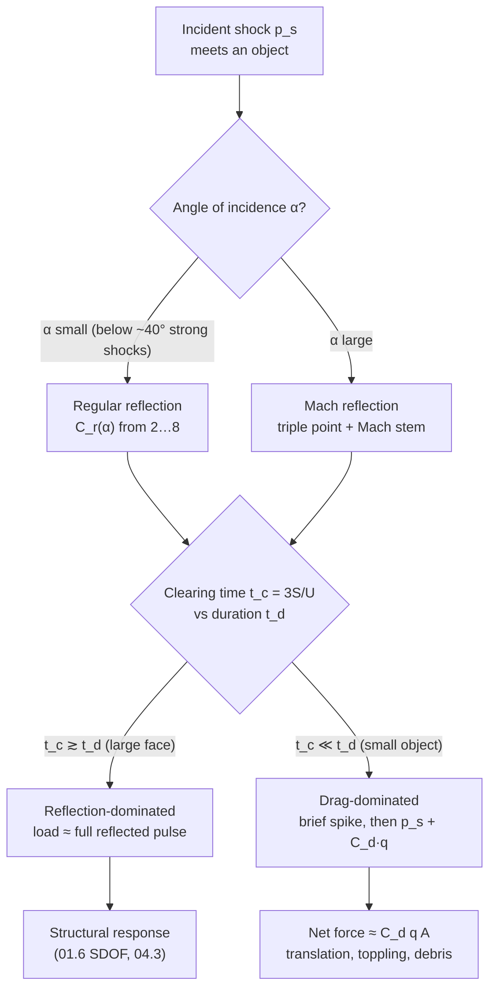

# 01.4 · Reflection, transmission & dynamic pressure

<div class="module-card">

**Prerequisites** [01.3 Waves: from acoustics to shocks](lessons/stage-01/lesson-03.md) (Rankine–Hugoniot, shock Mach number, acoustic impedance) · [01.1 Mechanics](lessons/stage-01/lesson-01.md) (momentum flux, drag) · [01.2 Gases & thermodynamics](lessons/stage-01/lesson-02.md) (stagnation quantities).

**Estimated time** 6 h (3 h theory · 1.5 h simulator · 1.5 h programming) · **Level** Intermediate

**Next** [01.5 Dimensional analysis & scaling laws](lessons/stage-01/lesson-05.md), then [04.1 Anatomy of a blast wave](lessons/stage-04/lesson-01.md) and [04.2 Distance, reflection, confinement](lessons/stage-04/lesson-02.md).

<p class="tags"><span>physics</span><span>shock reflection</span><span>impedance</span><span>dynamic pressure</span><span>Sim D</span><span>P01</span></p>
</div>

## Why this matters

Nobody is hurt by a *free-field* blast wave travelling through empty air. Damage happens when the
wave meets something: a wall, a window, a vehicle, a robot, a person. At that moment two very
different loads appear. **Reflection** converts the oncoming flow's momentum into extra pressure —
a head-on reflection at least *doubles* the overpressure and, for strong shocks, multiplies it by
up to eight (more with real-gas effects). **Dynamic pressure** — the kinetic energy of the "blast
wind" behind the shock — pushes, drags and tumbles anything that stands in the flow. Whether a
target feels mostly one or mostly the other depends on its size relative to the pulse length:
a building front is loaded by reflection for tens of milliseconds, a lamp post by reflection for
about a millisecond and by drag thereafter.

For EOD this is the physics behind statements you will meet in Stage 4 and Stage 7: "stand behind
the corner, not facing the wall", "the robot's camera mast sees drag loading", "sheltering in a
concrete building protects against the incident wave but reflections inside rooms can be worse".
It also explains why an item *in water* or *next to a hard surface* behaves differently from one in
open air — impedance mismatch.

## Learning objectives

1. Derive pressure reflection and transmission coefficients at a plane interface from continuity of
   pressure and particle velocity, and apply them to air–water and air–concrete interfaces.
2. Derive (sketch) and use the ideal-gas normal reflection formula
   $p_r = 2p_s(7p_0+4p_s)/(7p_0+p_s)$ and its general-$\gamma$ form; explain the limits 2 and 8 and
   why real explosions exceed 8 near the source.
3. Explain regular vs Mach reflection, the Mach stem and triple point, and why the reflection
   coefficient depends on angle of incidence.
4. Derive the peak dynamic pressure $q = \tfrac52 p_s^2/(7p_0+p_s)$ from Rankine–Hugoniot and
   compute stagnation pressure and drag loads $F = C_d\,q\,A$.
5. Estimate the **clearing time** of reflected pressure on a finite target and decide whether a
   target is reflection-dominated or drag-dominated.
6. Implement these relations and cross-check them against Sim D's 2D Euler solver.

## Theory

### 1. Acoustic impedance, reflection and transmission

A plane acoustic wave in medium 1 (impedance $Z_1=\rho_1c_1$) hits a plane interface with medium 2
($Z_2=\rho_2c_2$) at normal incidence. Write incident, reflected and transmitted pressures
$p_i, p_r, p_t$. For a travelling wave $p=\pm Z u$ (sign by direction, 01.3). Two physical
conditions hold at the interface: the pressure is continuous (the interface is massless) and the
particle velocity is continuous (the media stay in contact):

$$ p_i + p_r = p_t,\qquad \frac{p_i}{Z_1}-\frac{p_r}{Z_1} = \frac{p_t}{Z_2}. $$

Solving:

<div class="callout eq">

$$ R \equiv \frac{p_r}{p_i} = \frac{Z_2-Z_1}{Z_2+Z_1},\qquad T \equiv \frac{p_t}{p_i} = \frac{2Z_2}{Z_2+Z_1},\qquad
\tau_I \equiv \frac{I_t}{I_i} = \frac{4Z_1Z_2}{(Z_1+Z_2)^2}. $$

</div>

| Symbol | Meaning | SI unit | Dimensions |
|---|---|---|---|
| $Z=\rho c$ | specific acoustic impedance | Pa s m⁻¹ (rayl) | M L⁻² T⁻¹ |
| $R$ | pressure reflection coefficient | — | 1 |
| $T$ | pressure transmission coefficient | — | 1 |
| $\tau_I$ | intensity (energy-flux) transmission coefficient, $I = p^2/(2Z)$ for a harmonic wave | — | 1 |

<div class="callout physics">

**Intuition.** Impedance is "how much pressure it takes to make the medium move at unit speed".
Going from soft (air) to hard (water, concrete), the hard medium barely moves; to keep velocity
continuous the reflected wave must cancel the incident velocity, which *adds* to the pressure:
$R\to+1$, $T\to2$ — **pressure doubling**. Almost no *energy* crosses, because the transmitted wave
has high pressure but negligible velocity. Going hard → soft the opposite happens: $R\to-1$, the
reflected wave is a *rarefaction* (this is why an underwater shock reaching the surface produces
tension and spall — a Stage 4 topic).

</div>

**Numerical example** (20 °C air, $Z_1 = 1.204\times343.2 = 413$ rayl):

| Interface | $Z_2$ [rayl] | $R$ | $T$ | $\tau_I$ | $10\log_{10}\tau_I$ |
|---|---|---|---|---|---|
| air → water ($998\times1482$) | $1.48\times10^6$ | 0.99944 | 1.9994 | $1.12\times10^{-3}$ | −29.5 dB |
| air → concrete ($2400\times3700$, typical) | $8.9\times10^6$ | 0.99991 | 1.9999 | $1.9\times10^{-4}$ | −37.3 dB |
| water → air | 413 | −0.99944 | $5.6\times10^{-4}$ | $1.12\times10^{-3}$ | −29.5 dB |

Two conclusions matter later. (i) To an airborne wave, water and concrete are effectively *rigid*,
so the linear limit of any reflection off them is exactly a factor 2 — the weak-shock limit of the
formula in §2. (ii) The energy barrier is symmetric (−29.5 dB in both directions), which is why an
underwater event couples poorly into air, and an airborne blast couples poorly into water or
into a building's material — but the *pressure* doubling at the surface is what loads that surface.

```python
import numpy as np

def interface_coeffs(Z1: float, Z2: float) -> dict:
    """Normal-incidence plane-wave coefficients from medium 1 into medium 2."""
    R = (Z2 - Z1) / (Z2 + Z1)
    T = 2 * Z2 / (Z2 + Z1)
    tauI = 4 * Z1 * Z2 / (Z1 + Z2) ** 2
    return {"R": R, "T": T, "tauI": tauI, "tauI_dB": 10 * np.log10(tauI)}

Z_AIR, Z_WATER = 1.204 * 343.2, 998 * 1482
print(interface_coeffs(Z_AIR, Z_WATER))   # R≈0.99944, T≈1.9994, tauI≈1.12e-3 (−29.5 dB)
```

<details class="answer"><summary>Exercise 1 — then reveal</summary>

(a) Show that energy is conserved: $R^2 + \tau_I = 1$. (b) Steel has $\rho\approx7850$ kg/m³,
$c\approx5900$ m/s. What fraction of an airborne acoustic wave's energy enters a steel plate, in dB?
(c) A thin plate is *not* a half-space. Which extra physics decides whether a thin panel "sees" the
doubled pressure?

*Answer.* (a) $R^2+\tau_I = \frac{(Z_2-Z_1)^2 + 4Z_1Z_2}{(Z_1+Z_2)^2} = 1$. ✓ (b) $Z_2 = 4.63\times10^7$ rayl,
$\tau_I = 4(413)(4.63\times10^7)/(4.63\times10^7)^2 \approx 3.6\times10^{-5}$ → about −44 dB. (c) The
panel's own motion: a panel moves as a structure (mass per area, stiffness), so the relevant
"impedance" is its mechanical impedance $\sim \omega m''$ at the frequencies of the pulse. That is
the SDOF picture of [01.6](lessons/stage-01/lesson-06.md). For blast pulses (milliseconds) and
massive walls, the surface is effectively rigid during the reflection.

</details>

### 2. Normal reflection of a shock from a rigid wall

Now let the incident wave be a shock of overpressure $p_s$ (state 1 ambient at rest, state 2 behind
the shock moving toward the wall with velocity $u_2$). At a rigid wall the gas must come to rest.
The only way to stop it is a **reflected shock** travelling back out into state 2, leaving state 5
(the conventional label) at rest against the wall with pressure $p_0+p_r$.

The condition is kinematic: the velocity jump across the reflected shock must equal $u_2$. For any
shock from state $a$ into state $b$ in an ideal gas, the Rankine–Hugoniot relations of 01.3 give
the velocity jump in terms of pressures alone:

$$ (\Delta u)^2 = \frac{2\,(p_b-p_a)^2}{\rho_a\big[(\gamma+1)p_b+(\gamma-1)p_a\big]} . $$

Apply it twice — incident ($1\to2$) and reflected ($2\to5$) — set the two jumps equal, use the
Hugoniot density ratio for $\rho_2/\rho_1$, and solve for $p_5$. The result (Glasstone & Dolan 1977,
§3.56; general form in Baker 1973 and Kinney & Graham 1985):

<div class="callout eq">

$$ p_r = 2p_s + \frac{(\gamma+1)\,p_s^2}{(\gamma-1)\,p_s + 2\gamma p_0}
\;\;\xrightarrow{\;\gamma=1.4\;}\;\;
p_r = 2p_s\,\frac{7p_0+4p_s}{7p_0+p_s},\qquad C_r\equiv\frac{p_r}{p_s}. $$

Limits: $C_r\to 2$ as $p_s/p_0\to0$ (acoustic doubling); $C_r\to \dfrac{3\gamma-1}{\gamma-1}=8$ as
$p_s/p_0\to\infty$ ($\gamma=1.4$). Mach-number form ($\gamma=1.4$, absolute pressure):
$\dfrac{p_0+p_r}{p_0} = \dfrac{(7M_s^2-1)(4M_s^2-1)}{3(M_s^2+5)}$.

</div>

| Symbol | Meaning | SI unit |
|---|---|---|
| $p_s$ | incident (side-on) peak overpressure | Pa (kPa in tables) |
| $p_r$ | peak normally reflected overpressure (relative to $p_0$) | Pa |
| $p_0$ | ambient absolute pressure | Pa |
| $C_r$ | reflection coefficient | — |
| $M_s$ | incident shock Mach number | — |

<div class="callout physics">

**Intuition.** Two contributions add. The "2" is the acoustic part: the wall must reflect the
pressure wave (§1). The second term is the **momentum of the blast wind** being destroyed: gas
behind the shock carries momentum flux $\rho_2u_2^2$, and stopping it costs extra pressure. For
weak shocks $u_2$ is small and the wind term is negligible; for strong shocks the wind dominates
and the reflected shock runs into gas already compressed and heated, giving the factor 8.

</div>

**Numerical example** ($p_0 = 101.325$ kPa), checked with `py`:

| $p_s$ [kPa] | 1 | 10 | 50 | 100 | 200 | 500 | 1000 | $10^4$ |
|---|---|---|---|---|---|---|---|---|
| $p_r$ [kPa] | 2.008 | 20.83 | 119.8 | 274.1 | 663.9 | 2240 | 5510 | 76 030 |
| $C_r$ | 2.008 | 2.083 | 2.395 | 2.741 | 3.320 | 4.481 | 5.510 | 7.603 |

Check at 100 kPa: $2\cdot100\cdot(709.28+400)/(709.28+100) = 200\cdot1109.28/809.28 = 274.1$ kPa. The
Mach-number form with $M_s=1.3587$ ($M_s^2=1.8460$): $(11.922)(6.384)/(3\cdot6.846)=3.706$ →
$375.4-101.3 = 274.1$ kPa. ✓

<div class="callout hazard">

**Beyond ideal gas.** Measured and computed reflection factors near real explosive sources exceed
8 — Baker et al. (1983) and the UFC 3-340-02 curves show values of roughly 13 or more at small
scaled distance — because at very high temperature air's $\gamma$ falls (vibrational excitation,
dissociation), and with $\gamma = 1.2$ the strong-shock limit is already $(3.6-1)/0.2 = 13$.
Treat the ideal-gas formula as exact physics for *moderate* shocks and a lower bound close in.
Sim D uses the $\gamma=1.4$ formula throughout (`reflectedOverpressure` in `sims/common/blast.js`).

</div>

```python
def reflected_overpressure(ps, p0=101.325, gamma=1.4):
    """Normally reflected overpressure from a rigid wall, ideal gas (same units as ps, p0)."""
    return 2 * ps + (gamma + 1) * ps**2 / ((gamma - 1) * ps + 2 * gamma * p0)

ps = np.array([1, 10, 100, 1000, 1e6])
print(reflected_overpressure(ps) / ps)            # 2.008 2.083 2.741 5.510 7.996
print(reflected_overpressure(1e6, gamma=1.2) / 1e6)  # ≈ 12.99 → limit 13
```

<details class="answer"><summary>Exercise 2 — derive, then reveal</summary>

(a) Verify that the general-$\gamma$ form reduces to $2p_s(7p_0+4p_s)/(7p_0+p_s)$ for $\gamma=1.4$.
(b) Show the strong-shock limit is $(3\gamma-1)/(\gamma-1)$. (c) A gauge flush with a rigid wall
reads 1135 kPa. What incident overpressure produced it?

*Answer.* (a) Multiply numerator and denominator of the second term by 5/2:
$2p_s + \frac{6p_s^2}{p_s+7p_0} = \frac{2p_s(7p_0+p_s)+6p_s^2}{7p_0+p_s}=\frac{2p_s(7p_0+4p_s)}{7p_0+p_s}$. ✓
(b) $C_r = 2 + \frac{(\gamma+1)y}{(\gamma-1)y+2\gamma}\to 2+\frac{\gamma+1}{\gamma-1} = \frac{3\gamma-1}{\gamma-1}$.
(c) Solve numerically (bisection or `brentq`): $p_s = 300$ kPa ($C_r = 3.78$). Note the inversion is
well-conditioned — $p_r$ is monotonic in $p_s$.

</details>

### 3. Oblique reflection and the Mach stem

When the shock meets a surface at an angle, define the **angle of incidence** $\alpha$ between the
shock's direction of travel and the surface normal ($\alpha=0$ is head-on; $\alpha=90°$ is a
shock sliding along the surface, i.e. side-on). Two regimes exist:

- **Regular reflection** (small $\alpha$). Incident and reflected shocks meet *at the surface*.
  Behind the reflected shock the flow must again be parallel to the wall; the reflection
  coefficient falls from its normal value toward 1 as $\alpha\to90°$ — but not monotonically.
- **Mach reflection** (large $\alpha$). Beyond a critical angle no reflected shock can turn the
  flow parallel to the wall. Instead the incident and reflected shocks meet at a **triple point**
  *above* the surface, joined to the wall by a third, nearly normal shock — the **Mach stem**. The
  triple point rises as the wave travels along the surface, so the stem grows.

| Feature | Regular reflection | Mach reflection |
|---|---|---|
| Shocks at the surface | 2 (incident + reflected) | 1 (the Mach stem, near-normal) |
| Meeting point | on the surface | triple point, rising with distance |
| Pressure behind | $p_r(\alpha)$ from oblique-shock theory | stem pressure > incident, roughly uniform with height |
| Critical angle (air) | — | ≈ 40° for strong shocks; larger for weak shocks |

<div class="callout key">

**Key idea.** The reflection coefficient versus angle is *not* a smooth decline from $C_r(0)$ to
1. Near the regular→Mach transition it can *exceed* the head-on value (IATG 01.80 notes increases up
to about 50 %; Schwer 2017 shows the UFC 3-340-02 angle curves and checks them against
Rankine–Hugoniot). The transition angle depends on shock strength: strong shocks transition near
40°; weak shocks remain regular to larger angles. Exact transition criteria (detachment vs sonic)
come from shock-polar analysis — see Expert extension.

</div>

**Why it matters for EOD.** For a burst *above* the ground, the ground near directly beneath sees
regular reflection; farther out $\alpha$ exceeds critical and a Mach stem forms and sweeps along
the ground. A person, vehicle or robot standing in the Mach-stem region is loaded by a single,
merged, stronger-than-incident shock whose front is nearly vertical — the reason height-of-burst
curves (04.2) show *enhanced* ground-level pressure over a band of ranges. For a surface burst the
reflection is complete from the start; that is why Sim D offers a hemispherical *surface burst*
option that multiplies the effective yield by ≈ 1.8 (ideal rigid surface: 2 — the doubling of §1
applied to energy confined into a half-space).

<details class="answer"><summary>Exercise 3 — then reveal</summary>

A shock travels along a long wall that is *parallel* to its direction of motion ($\alpha=90°$).
What does a flush-mounted gauge on the wall read, and why is that the definition of "side-on"
(incident) pressure? What changes if the wall is tilted 5° toward the source?

*Answer.* It reads $p_s$ itself: the flow behind the shock is parallel to the wall, so nothing has
to be stopped and no reflection occurs. That is exactly how "side-on" gauges are mounted (face
parallel to the flow). Tilting by 5° ($\alpha = 85°$) makes a grazing Mach reflection with a small
stem; the gauge reads slightly above $p_s$. Gauge orientation errors of a few degrees are a known
source of scatter in field data (Farrimond et al. 2024 discuss measurement variability).

</details>

### 4. Dynamic pressure and stagnation pressure

Behind the shock the gas moves with $u_2$ and density $\rho_2$. Its kinetic energy per unit volume is
the **dynamic pressure** $q=\tfrac12\rho_2u_2^2$. Substituting the Rankine–Hugoniot ratios for
$\rho_2/\rho_1$ and $u_2/a_1$ (01.3) and eliminating $M_s$ in favour of $p_s$ gives, after algebra,
an expression in pressures only:

<div class="callout eq">

$$ q = \frac{p_s^2}{2\gamma p_0 + (\gamma-1)p_s}\;\;\xrightarrow{\;\gamma=1.4\;}\;\; q = \frac52\,\frac{p_s^2}{7p_0+p_s}. $$

Limits: weak shocks $q\approx p_s^2/(2\gamma p_0)$ — quadratic, so $q\ll p_s$; strong shocks
$q\to p_s/(\gamma-1) = 2.5\,p_s$. Crossover $q=p_s$ at $p_s = 2\gamma p_0/(2-\gamma)\approx 4.67\,p_0\approx 473$ kPa.

</div>

(Glasstone & Dolan 1977 §3.55; IATG 01.80 Table 6. The general-$\gamma$ form and the $\gamma=1.4$
form were checked symbolically for this lesson; `dynamicPressure` in `sims/common/blast.js` uses the
$\gamma = 1.4$ form.)

| Symbol | Meaning | SI unit |
|---|---|---|
| $q$ | peak dynamic pressure (kinetic energy density of the flow) | Pa |
| $\rho_2, u_2$ | density and particle velocity behind the shock | kg m⁻³, m s⁻¹ |
| $M_2 = u_2/a_2$ | flow Mach number behind the shock (lab frame) | — |
| $p_{\text{stag}}$ | stagnation (total) pressure: pressure if the flow is brought to rest isentropically | Pa |

**Numerical example.** $p_s=100$ kPa: $q = 2.5\cdot10^4/809.3 = 30.9$ kPa. Cross-check from 01.3:
$\rho_2 = 1.225\cdot1.618 = 1.982$ kg/m³, $u_2 = 176.6$ m/s, $\tfrac12\rho_2u_2^2 = 30.9$ kPa. ✓

**Stagnation pressure.** A blunt object in the flow brings the gas at its nose to rest. If the flow
is subsonic ($M_2<1$) the compression is nearly isentropic:
$p_{\text{stag}} = p_2\,(1+\tfrac{\gamma-1}{2}M_2^2)^{\gamma/(\gamma-1)}$, which for low $M_2$ is
$\approx p_2 + q$. At $p_s=100$ kPa, $M_2 = 0.468$: exact stagnation overpressure 132.6 kPa vs
$p_s+q=130.9$ kPa (1.3 % low). The flow behind the shock becomes **supersonic** for
$p_s \gtrsim 387$ kPa ($M_s\approx2.07$); then a detached bow shock stands in front of the object and
$p_s + q$ is no longer a good estimate. $M_2$ never exceeds $\sqrt{2/(\gamma(\gamma-1))}=1.89$.

```python
def dynamic_pressure(ps, p0=101.325, gamma=1.4):
    return ps**2 / (2 * gamma * p0 + (gamma - 1) * ps)

print(dynamic_pressure(np.array([10, 100, 473, 1000])))  # 0.348 30.9 ~473 1463 kPa
```

<details class="answer"><summary>Exercise 4 — then reveal</summary>

(a) At what $p_s$ does $q$ reach 10 % of $p_s$? (b) Explain physically why, in the far field
(say $p_s = 5$ kPa), dynamic pressure is almost irrelevant to a wall but still relevant to a person.

*Answer.* (a) $q/p_s = p_s/(2.8p_0+0.4p_s) = 0.1$ → $p_s(1-0.04) = 0.28p_0$ → $p_s = 29.6$ kPa.
(b) $q = 2.5\cdot25/(709.3+5) = 0.088$ kPa — 1.8 % of $p_s$, negligible compared to the reflected 10 kPa on
a wall. A person is not loaded by distributed pressure causing structural failure but by
*translation*: the net force on a small body is the drag term (the reflected pressure clears in
well under a millisecond, §6), and even modest winds acting for tens of ms can topple — the
tertiary-injury mechanism of 04.4.

</details>

### 5. Drag loading

For an object whose size is small compared with the pulse length, the net translational load after
the brief diffraction phase is aerodynamic drag:

$$ F_D(t) = C_d\,q(t)\,A, $$

with $C_d$ the drag coefficient (dimensionless, based on frontal area $A$). $C_d$ is empirical and
depends on shape, Reynolds number and flow Mach number: roughly 1.2–2 for flat plates and
box-like shapes normal to the flow, about 1.2 for long circular cylinders in the subcritical regime
and much lower (≈ 0.3–0.5) above the drag crisis, ≈ 0.5 for spheres at moderate $Re$ (Glasstone &
Dolan ch. IV; Baker et al. 1983). Blast flows are unsteady, and the $C_d$ values during the first
few transit times differ from steady-flow handbook values — a documented source of uncertainty.

**Numerical example.** A fictional 0.5 m² sign plate ($C_d=1.5$) facing a $p_s = 100$ kPa wave:
$F = 1.5\cdot30.9\,\text{kPa}\cdot0.5\,\text{m}^2 = 23.2$ kN — the weight of about 2.4 t.

<div class="callout safety">

**Why robots are designed around this.** The same arithmetic tells a robotics engineer why an EOD
robot's manipulator and mast are kept low and compact near a hazard, why tipping stability is a
design requirement, and why a vehicle's broadside area matters. It is also the physics of
secondary fragments: loose objects are accelerated by drag (see [01.6](lessons/stage-01/lesson-06.md)).

</div>

### 6. Clearing: why small targets escape the reflected pressure

The reflected pressure on a finite target's front face cannot last. At the edges the high-pressure
reflected region is next to the lower-pressure incident flow; a **rarefaction wave** runs in from
the edges at roughly the local sound speed and relieves the face down to the **stagnation
pressure** $p_s + C_d q$ (with $C_d\approx1$ for a front face). The time taken is the **clearing
time**. Glasstone & Dolan (1977, ch. IV) give the classic estimate

$$ t_c \approx \frac{3S}{U}, $$

where $S$ is the smaller of the target height or half-width and $U$ the shock-front speed. UFC
3-340-02 (Ch. 2) uses the refined form $t_c = 4S/[(1+R)C_r]$ with $R=S/G$ ($G$ the larger of height
or half-width) and $C_r$ the sound speed in the reflected region; the two agree within ~10–20 % for
moderate shocks. Clearing is also a live research area: Isaac et al. (2023) review measurements
showing that simple clearing models are good for moderate targets but can mis-estimate impulse for
very small or very large ones.

| Symbol | Meaning | SI unit |
|---|---|---|
| $t_c$ | clearing time | s |
| $S$ | smaller of height or half-width of the loaded face | m |
| $U$ | incident shock speed $=M_s a_0$ | m s⁻¹ |
| $G, R$ | larger dimension; ratio $S/G$ | m; — |

<div class="callout key">

**Decision rule.** Compare $t_c$ with the positive-phase duration $t_d$.
$t_c \gtrsim t_d$ → the face sees the **full reflected pulse** (big walls, building fronts).
$t_c \ll t_d$ → a brief reflected spike, then **stagnation/drag loading** (posts, people, robots).
This one ratio sorts most targets into "reflection-dominated" or "drag-dominated".

</div>

**Numerical example.** $p_s=100$ kPa → $U=462$ m/s. A 3 m high wall: $t_c = 9/462 = 19.5$ ms. A
0.3 m wide post ($S = 0.15$ m): $t_c = 0.97$ ms.

```python
def clearing_time(height, width, U):
    S = min(height, width / 2)
    return 3 * S / U

def front_face_load(t, pr_t, ps_t, q_t, tc, Cd=1.0):
    """Simplified front-face overpressure (t = 0 at arrival; works on NumPy arrays).
    pr_t, ps_t, q_t: reflected, incident and dynamic pressure histories as functions of t.
    Blends linearly from the reflected history to the stagnation history p_s + Cd*q over tc."""
    w = np.minimum(t / tc, 1.0)
    return pr_t(t) + (ps_t(t) + Cd * q_t(t) - pr_t(t)) * w
```

<details class="answer"><summary>Exercise 5 — then reveal</summary>

A wave with $p_s=50$ kPa ($U = 406$ m/s) and $t_d = 12$ ms loads (a) a 2 m wide, 2.5 m tall panel,
(b) a person-sized target (0.5 m wide, 1.8 m tall). Classify each and estimate the peak and the
long-time front-face overpressure.

*Answer.* $p_r = 119.8$ kPa, $q = 8.2$ kPa, stagnation $\approx 58.2$ kPa. (a) $S = \min(2.5,1)=1$ m,
$t_c = 3/406 = 7.4$ ms — comparable to $t_d$: partial clearing, a large fraction of the reflected
impulse survives. (b) $S = 0.25$ m, $t_c = 1.8$ ms ≪ 12 ms: a 120 kPa spike for ~2 ms, then
≈ 58 kPa decaying with the wave. The *net* force on the person also subtracts the back-face
pressure, which lags; the lasting net load is drag.

</details>

## Visual explanation



Below, Sim D. Choose the **Wall (reflection)** scene, run it, and watch P1 (in front of the wall)
record the incident *and* reflected shock while P2 (behind) sits in the shadow. Then choose
**Building corner (shadow)** to see diffraction: the wave wraps around the corner, weakened, with a
vortex shed at the edge.

<iframe class="sim-frame" src="sims/blast-physics/index.html?embed=1" height="760" loading="lazy"></iframe>

<a class="sim-link" href="sims/blast-physics/index.html" target="_blank">Open Sim D full-screen ↗</a>

## Worked example — a wall and a post at the same range

*Fictional scenario.* A training range models a 10 YU free-air release. At 15 m stand (a) a
concrete wall 3 m high and 12 m wide facing the source, and (b) a 0.3 m wide, 2 m tall sign post.
Ambient is sea level. Sim D's free-air curves (Kinney–Graham fit, introduced in
[04.1](lessons/stage-04/lesson-01.md)) give at $Z = 15/10^{1/3} = 6.96$ m·YU⁻¹ᐟ³:

| Quantity | Formula | Value |
|---|---|---|
| incident $p_s$ | K–G fit | 16.7 kPa |
| duration $t_d$ | K–G fit | 8.5 ms |
| $M_s$, $U$ | $\sqrt{1+\tfrac67 p_s/p_0}$, $M_sa_0$ | 1.068, 364 m/s |
| reflected $p_r$ | §2 | 35.8 kPa ($C_r = 2.14$) |
| dynamic $q$ | §4 | 0.97 kPa |
| stagnation (front face) | $p_s+q$ | 17.7 kPa |

1. **Wall.** $S=\min(3,6)=3$ m, $t_c = 9/364 = 24.8$ ms (UFC form with $C_r\approx355$ m/s in the
   reflected region: 22.5 ms). Both exceed $t_d=8.5$ ms, so the wall sees the full reflected pulse:
   peak 35.8 kPa, reflected impulse (same Friedlander shape, Sim D's approximation) ≈ 129 kPa·ms
   (≈ 122 kPa·ms if the slow clearing is blended in as in §6) versus 61 kPa·ms incident. **Reflection more than doubles the impulse.**
2. **Post.** $S=0.15$ m, $t_c = 1.2$ ms ≪ 8.5 ms. The front face sees 35.8 kPa for ≈ 1 ms, then
   ≈ 17.7 kPa. The *net* horizontal force, once the wave has enveloped the post, is drag:
   $F\approx 1.2\cdot 0.97\,\text{kPa}\cdot0.6\,\text{m}^2 \approx 0.7$ kN at peak — modest, because at
   16.7 kPa the blast wind is weak ($q/p_s\approx6$ %).
3. **Interpretation.** At this range the hazard to structures is overpressure and reflected
   impulse; the hazard to small objects is mostly the brief pressure pulse, not wind. Move ten
   times closer in scaled distance and $q$ would rival $p_s$ — the drag term, and debris, would
   dominate for small objects.

## Simulation work

<div class="callout sim">

**Sim D, reflection and diffraction.**

1. *Pressure panels.* With the rigid-wall box ticked, sweep standoff from 100 m to 3 m at 10 YU
   and record $C_r=p_r/p_s$ from the live equations. Plot $C_r$ against $p_s/p_0$ and overlay the
   §2 formula: they must agree exactly (same code). Where does $C_r$ exceed 4?
2. *Wall scene.* Run the 2D Euler field. P1 sits just in front of the wall: identify the incident
   and reflected arrivals in its trace. Measure the ratio of the second peak to the first. Why is it
   not the ideal $C_r$? (Hint: P1 is a few cells *off* the wall, so it sees the incident and
   reflected waves separated in time, not superposed; and the solver is first-order, which smears
   peaks.) Move P1 right up against the wall and repeat.
3. *Corner scene.* Put P1 in the open and P2 in the geometric shadow behind the corner. Compare
   peak $\Delta p/p_0$ and positive impulse. Switch to *peak map*: sketch the shadow boundary. Is
   it sharp? Why not (diffraction)?
4. *Mach stem (qualitative).* In the Wall scene the incident front hits the wall head-on at the
   centre and obliquely toward the wall ends. Use the peak map to look for a region near the wall
   ends where the reflected front detaches from the wall surface.

</div>

## Practical exercises

1. **Gauge inversion.** A face-on gauge on a wide wall records a peak of 250 kPa; a side-on gauge
   at the same range was lost. Recover $p_s$, $M_s$, $U$ and $q$.
2. **Water surface.** A weak airborne pressure wave of 2 kPa hits a calm water surface at normal
   incidence. What pressure amplitude is transmitted into the water and what fraction of the
   incident energy? Why does this *not* contradict the fact that water "feels" twice the pressure?
3. **Target classification.** For $p_s = 30$ kPa, $t_d = 20$ ms, classify: a 10 m × 6 m façade, a
   1 m × 1 m window pane in a large wall (careful), a 0.6 m wide robot chassis.
4. **Sensitivity.** Using the $\gamma$-general formula, compute how much $p_r$ changes at
   $p_s = 1000$ kPa if the effective $\gamma$ is 1.3 instead of 1.4. What does this say about using
   ideal-gas reflection factors close to a source?

<details class="answer"><summary>Answers</summary>

1. Invert $p_r(p_s)=250$ (bisection): $p_s \approx 92.8$ kPa ($C_r = 2.69$); $M_s = \sqrt{1+\tfrac67\cdot0.916} = 1.336$,
   $U = 454.7$ m/s; $q = 2.5\cdot92.8^2/(709.3+92.8) = 26.8$ kPa.
2. $T = 1.9994$ → 4.0 kPa in the water; $\tau_I = 1.1\times10^{-3}$. Pressure doubles but water
   particle velocity is ~3600× smaller than in air for the same pressure, so the energy flux
   $p\,u$ is tiny. No contradiction: pressure and energy are different quantities.
3. $U = 340.3\sqrt{1+0.857\cdot0.296} = 381$ m/s. Façade: $S=3$ m → $t_c = 23.6$ ms ≳ $t_d$:
   reflection-dominated. Window pane in a large wall: the *wall* sets the clearing geometry, not the
   pane — the pane sees the full reflected pulse. Robot chassis: $S=0.3$ m → 2.4 ms ≪ 20 ms:
   drag-dominated (for net force), with a short reflected spike on sensors facing the source.
4. $\gamma = 1.4$: $p_r = 5510$ kPa. $\gamma = 1.3$: $2000 + 2.3\cdot10^6/(300+263.4) = 2000+4082 = 6082$ kPa,
   about 10 % higher. Close to a source the ideal-gas reflection factor underestimates reflected
   loads; empirical curves (UFC) are used for exactly this reason.

</details>

## Programming exercise — a finite-target front-face load model

**Goal.** Build `front_face_history(W, R, H, B, Cd=1.0)` that returns the front-face overpressure
history of a rectangular target of height $H$ and width $B$ facing a free-air release of $W$ YU at
range $R$, including reflection and clearing.

- **Input:** yield [YU], range [m], target height and width [m]; optional ambient $p_0$, $a_0$.
- **Output:** arrays $t$ [ms], $p(t)$ [kPa]; scalars $p_r$, $t_c$, $t_d$, reflected impulse $i_r$
  and *cleared* impulse $i_{\text{eff}}$.
- **Constraints:** incident wave: Friedlander with $p_s$, $t_d$, $b$ from a port of
  `predict()` in `sims/common/blast.js` (Kinney–Graham fits); $q(t)$: assume
  $q(t)=q_{\text{peak}}(1-t/t_d)^2e^{-2bt/t_d}$ (a common simplification — state it); reflected
  history = Friedlander at $p_r$ with the same $t_d, b$ (Sim D's approximation), blended linearly
  into $p_s(t)+C_dq(t)$ over $t_c$ as in `front_face_load`; NumPy only.
- **Expected behaviour:** $i_{\text{eff}}\to i_r$ as target size → ∞; $i_{\text{eff}}\to$ stagnation
  impulse as size → 0; monotonic in between.
- **Test cases:** (i) $W=10$, $R=15$, $H=3$, $B=12$ → $p_r = 35.8$ kPa, $t_c = 24.8$ ms,
  $i_{\text{eff}}\approx122$ kPa·ms, i.e. ≈ 95 % of $i_r\approx129$ kPa·ms; (ii) same wave, $H=2$,
  $B=0.3$ → $t_c=1.24$ ms and $i_{\text{eff}}\approx73$ kPa·ms ≈ 1.2× the incident 60.5 kPa·ms
  (the cleared reflected spike adds ≈ 10 kPa·ms, the $q$ term ≈ 2 kPa·ms); (iii) $p_s\to0$ limit gives
  $C_r\to2$.
- **Extensions:** replace $3S/U$ with the UFC form (compute $C_r$ from the reflected-state
  temperature via Rankine–Hugoniot); validate against Sim D probe traces for the Wall scene by
  non-dimensionalising both.

This feeds [Project P01](projects/p01-blast-wave/README.md) and the loading step of the SDOF work
in [01.6](lessons/stage-01/lesson-06.md).

## Reading

- Glasstone, S. & Dolan, P. J., *The Effects of Nuclear Weapons*, 3rd ed., US DoD/DOE (1977),
  ch. III §3.53–3.56 (RH relations, dynamic pressure, normal reflection) and ch. III on Mach
  reflection — the source of the $\gamma=1.4$ formulas used here; ch. IV for diffraction/drag
  loading and clearing. https://atomicarchive.com/resources/documents/effects/glasstone-dolan/chapter3.html
- Isaac, O. S., Alshammari, O. G., Pickering, E. G., Clarke, S. D. & Rigby, S. E., "Blast wave
  interaction with structures – an overview", *Int. J. Protective Structures* 14(4) (2023),
  open access: https://eprints.whiterose.ac.uk/192170/ — read the sections on reflection and on
  clearing; best modern review.
- Schwer, L., "Air Blast Reflection Ratios and Angle of Incidence", 11th European LS-DYNA Conf.
  (2017): https://lsdyna.ansys.com/wp-content/uploads/attachments/air-blast-reflections-and-angle-of-incidence.pdf
  — short; regular vs Mach reflection and a check of UFC curves against Rankine–Hugoniot.
- UNODA, *IATG 01.80 Formulae for ammunition management*, 3rd ed. (2021), dynamic-pressure and
  reflected-pressure sections: https://data.unsaferguard.org/iatg/en/IATG-01.80-Formulae-ammunition-management-IATG-V.3.pdf
- US DoD, *UFC 3-340-02 Structures to Resist the Effects of Accidental Explosions* (2008, Change 2
  2014), Ch. 2 (reflection coefficient vs angle, front-wall loading and clearing):
  https://www.wbdg.org/dod/ufc/ufc-3-340-02 — read the curves as physics, not as a design exercise.
- Needham, C. E., *Blast Waves*, 2nd ed., Springer (2018) — chapters on reflection (regular vs Mach).

## Assessment

1. *(Conceptual)* Explain, in terms of momentum, why the reflection factor exceeds 2 for any
   finite-strength shock, and why it saturates.
2. *(Mathematical)* Starting from $q=\tfrac12\rho_2u_2^2$ and the RH ratios, derive
   $q = p_s^2/(2\gamma p_0+(\gamma-1)p_s)$.
3. *(Interpretation)* Two identical gauges face a source at the same range; one is mounted in a
   large wall, the other on a thin pole. Sketch both traces and explain every difference.
4. *(Computation)* At what incident overpressure does the reflected overpressure first exceed
   1 MPa? What is $q$ there, and is the flow behind the incident shock supersonic?
5. *(Design)* An EOD robot's forward camera housing is 0.15 m wide. Argue whether its design load
   should be $p_r$, $p_s+q$, or $C_dqA$, and what additional information you would want.

<details class="answer"><summary>Answers to 2 and 4</summary>

2. With $x=M_s^2$: $\rho_2/\rho_1 = \frac{(\gamma+1)x}{(\gamma-1)x+2}$, $u_2^2 = \frac{4a_1^2(x-1)^2}{(\gamma+1)^2x}$,
   so $q = \frac{2\rho_1a_1^2(x-1)^2}{(\gamma+1)[(\gamma-1)x+2]}$. Use $\rho_1a_1^2=\gamma p_0$ and
   $x-1 = \frac{\gamma+1}{2\gamma}\frac{p_s}{p_0}$, $(\gamma-1)x+2 = \frac{(\gamma+1)[2\gamma p_0+(\gamma-1)p_s]}{2\gamma p_0}$.
   Substituting: $q = \frac{p_s^2}{2\gamma p_0+(\gamma-1)p_s}$. ∎
4. Solve $p_r(p_s)=1000$: $p_s\approx 272.7$ kPa ($C_r\approx3.67$). $q = 2.5\cdot272.7^2/(709.3+272.7)\approx189$ kPa.
   Sonic flow behind the incident shock needs $p_s\gtrsim387$ kPa, so the flow is still subsonic
   ($M_2\approx0.85$).

</details>

## Expert extension

- **Shock polars and the von Neumann paradox.** Regular-reflection limits come from the
  shock-polar construction (detachment and sonic criteria). For weak shocks, observed Mach
  reflections exist where three-shock theory has no solution (the von Neumann paradox), resolved
  by "Guderley reflection" with an embedded expansion fan — see Needham (2018) and the reviews
  therein.
- **Real-gas reflection.** Recompute §2 with a temperature-dependent $\gamma$ (equilibrium air)
  and reproduce reflection factors above 8 (Zel'dovich & Raizer).
- **Clearing as an inverse problem.** Isaac et al. (2023) summarise experiments where the cleared
  impulse on finite targets was measured with arrays of gauges; fit $t_c = kS/U$ to Sim D data and
  report $k$ with uncertainty.
- **Transmission into structures.** Couple §1 (impedance) with an elastic plate to see when the
  "rigid wall" assumption fails.

## What comes next

[01.5](lessons/stage-01/lesson-05.md) shows, from dimensional analysis alone, why a single set of
curves $p_s(Z)$, $p_r(Z)$, $q(Z)$ describes every yield and atmosphere. [01.6](lessons/stage-01/lesson-06.md)
takes the loads computed here and asks how a structure responds. [04.2](lessons/stage-04/lesson-02.md)
applies reflection, Mach stems and channelling to real urban geometry.
