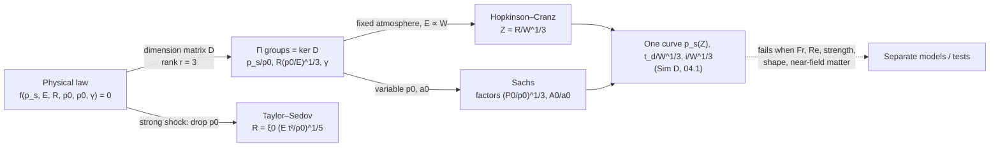

# 01.5 · Dimensional analysis & scaling laws

<div class="module-card">

**Prerequisites** [01.3 Waves: from acoustics to shocks](lessons/stage-01/lesson-03.md) (Rankine–Hugoniot, sound speed) · [01.4 Reflection & dynamic pressure](lessons/stage-01/lesson-04.md) · linear algebra (rank, null space).

**Estimated time** 5 h (2.5 h theory · 1 h simulator challenge · 1.5 h programming) · **Level** Intermediate

**Next** [01.6 Structural response & fragmentation](lessons/stage-01/lesson-06.md), then [04.1 Anatomy of a blast wave](lessons/stage-04/lesson-01.md).

<p class="tags"><span>physics</span><span>dimensional analysis</span><span>similarity</span><span>scaling</span><span>Sim D challenge</span><span>P01</span></p>
</div>

## Why this matters

Every blast table, every stand-off chart and every quantity-distance rule you will meet in Stage 4
is written in terms of one number: the **scaled distance** $Z = R/W^{1/3}$. Public safety tables,
IATG 02.20 separation distances and the DHS-DOJ stand-off card all rest on it. The reason one curve
can cover a firework and a warehouse is not empirical luck but **dimensional analysis**: when the
physics contains no intrinsic length scale, geometrically similar events must look identical after
rescaling. This lesson derives that claim from first principles, extends it to non-standard
atmospheres (Sachs scaling), shows the same tool producing G. I. Taylor's famous estimate of the
energy of the first nuclear test from published photographs, and — just as important — lists
exactly where scaling **fails** so that you never apply it blindly.

For an engineer this is also the justification of *scale-model testing*, the standard way blast
physics is studied without full-size events, and of dimensionless feature engineering in the
machine-learning surrogates you may build in Stage 9.

## Learning objectives

1. State and prove the **Buckingham Π theorem** (via rank–nullity and unit-change invariance), and
   compute a complete set of Π groups for a physical problem by finding the null space of its
   dimension matrix.
2. Derive **Hopkinson–Cranz cube-root scaling** for pressures, times and impulses from similarity,
   and apply it to predict a full-scale measurement from a scale test.
3. Derive **Sachs scaling** for ambient pressure and temperature and apply it to altitude.
4. Derive the **Taylor–Sedov** strong-blast radius law $R\propto(Et^2/\rho_0)^{1/5}$ and reproduce
   the dimensional estimate of a blast's energy from a radius–time measurement.
5. Identify, with Π groups, when scaling breaks: gravity, material strength and strain rate,
   viscosity, charge shape and near-field effects, non-ideal energy release.

## Theory

### 1. Dimensions and the dimension matrix

Choose base dimensions mass M, length L, time T (add temperature Θ if heat enters). Any physical
quantity $Q$ has dimension $[Q] = \mathrm{M}^{a}\mathrm{L}^{b}\mathrm{T}^{c}$. For a problem with
variables $Q_1,\dots,Q_n$, the **dimension matrix** $D\in\mathbb{Q}^{k\times n}$ holds those exponent
columns. A product $\Pi = \prod_j Q_j^{x_j}$ is dimensionless iff $D\mathbf{x}=\mathbf{0}$.

Example: the peak side-on overpressure $p_s$ of a blast from energy release $E$ at range $R$ in an
atmosphere $(p_0,\rho_0,\gamma)$.

| Variable | Meaning | SI unit | M | L | T |
|---|---|---|---|---|---|
| $p_s$ | peak overpressure | Pa | 1 | −1 | −2 |
| $E$ | energy released | J | 1 | 2 | −2 |
| $R$ | range | m | 0 | 1 | 0 |
| $p_0$ | ambient pressure | Pa | 1 | −1 | −2 |
| $\rho_0$ | ambient density | kg m⁻³ | 1 | −3 | 0 |
| $\gamma$ | ratio of specific heats | — | 0 | 0 | 0 |

### 2. The Buckingham Π theorem

<div class="callout eq">

**Theorem.** If a physical law $f(Q_1,\dots,Q_n)=0$ is *dimensionally homogeneous* (valid in every
system of units), and the dimension matrix has rank $r$, then it can be rewritten as
$F(\Pi_1,\dots,\Pi_{n-r})=0$, where the $\Pi_i$ are independent dimensionless products forming a
basis of $\ker D$.

</div>

*Proof sketch.* (i) **Counting.** Dimensionless products correspond to vectors $\mathbf{x}$ with
$D\mathbf{x}=0$. By rank–nullity, $\dim\ker D = n-r$, so there are exactly $n-r$ independent
groups (any basis will do; bases differ by invertible monomial transformations). (ii) **Reduction.**
Pick $r$ variables whose columns are linearly independent (the "repeating" variables). Changing
units multiplies each variable by $\lambda_{\mathrm M}^{a}\lambda_{\mathrm L}^{b}\lambda_{\mathrm T}^{c}$.
Because the repeating columns span the column space, one can choose the three unit factors to set
each repeating variable to 1 numerically. Every other variable $Q_j$ then takes the numerical value
of its Π group $Q_j/\prod_{\text{rep}}Q^{y}$. Since the law holds in *all* unit systems, it holds
in this one, where it involves only the $n-r$ Π values. ∎

The theorem tells you *which combinations* can appear, never the function $F$ — that needs theory,
simulation or experiment. Its power is the collapse of dimensionality: an $n$-variable experiment
becomes an $(n-r)$-variable one.

**Apply it.** For §1, $n=6$ (including $\gamma$), $r=3$, so three groups. Solving $D\mathbf{x}=0$
(a null space computation — see the snippet) gives, after choosing a convenient basis,

$$ \Pi_1 = \frac{p_s}{p_0},\qquad \Pi_2 = R\left(\frac{p_0}{E}\right)^{1/3},\qquad \Pi_3=\gamma
\quad\Longrightarrow\quad \frac{p_s}{p_0} = \Phi\!\left(R\left(\frac{p_0}{E}\right)^{1/3},\,\gamma\right). $$

Notice what is **missing**: $\rho_0$ cannot enter. It is the only variable carrying mass without
time, so no dimensionless product can contain it without introducing a time. Peak overpressure
ratios, at fixed $\gamma$, do not depend on ambient density or temperature — a non-obvious
prediction that is borne out by the Sachs scaling tables. Quantities that *carry time* (duration,
arrival time, impulse) do bring in $\rho_0$, via the sound speed $a_0=\sqrt{\gamma p_0/\rho_0}$:

$$ \frac{t_d\,a_0}{(E/p_0)^{1/3}} = \Psi\!\left(R\left(\frac{p_0}{E}\right)^{1/3},\gamma\right),\qquad
\frac{i\,a_0}{p_0^{2/3}E^{1/3}} = \Xi\!\left(R\left(\frac{p_0}{E}\right)^{1/3},\gamma\right). $$

```python
import sympy as sp

# columns: ps, E, R, p0, rho0 ; rows: M, L, T
D = sp.Matrix([[ 1,  1, 0,  1,  1],
               [-1,  2, 1, -1, -3],
               [-2, -2, 0, -2,  0]])
print(D.rank())          # 3  -> 5 - 3 = 2 groups (+ gamma)
for v in D.nullspace():  # basis of ker D: exponent vectors of dimensionless products
    print(v.T)           # [1/3, -1/3, 1, 0, 0] = R (ps/E)^(1/3);  [-1, 0, 0, 1, 0] = p0/ps
```

The basis sympy returns, $R(p_s/E)^{1/3}$ and $p_0/p_s$, is equivalent to ours:
$R(p_0/E)^{1/3} = R(p_s/E)^{1/3}\cdot(p_0/p_s)^{1/3}$.

<details class="answer"><summary>Exercise 1 — then reveal</summary>

A small robot-mounted camera mast (height $h$, diameter $d$) is struck by a blast wind of density
$\rho$, speed $u$, kinematic viscosity $\nu$, sound speed $a$. The quantity of interest is the root
bending moment $M_b$. Find a complete set of Π groups and name each one.

*Answer.* Variables $M_b$ [M L² T⁻²], $h$, $d$ [L], $\rho$ [M L⁻³], $u$, $a$ [L T⁻¹], $\nu$ [L² T⁻¹]:
$n=7$, $r=3$ → 4 groups: $\dfrac{M_b}{\rho u^2 d h^2}$ (moment coefficient), $h/d$ (aspect ratio),
$\mathrm{Re}=ud/\nu$ (Reynolds), $\mathrm{Ma}=u/a$ (Mach). A drag-coefficient law $C_d(\mathrm{Re},\mathrm{Ma})$
is exactly a statement of this form.

</details>

### 3. Hopkinson–Cranz (cube-root) scaling

Fix the atmosphere ($p_0$, $\rho_0$, $\gamma$) and the energetic material, so $E\propto W$ (the
yield, here in abstract **yield units, YU**). Then $\Pi_2 = R(p_0/E)^{1/3}\propto R/W^{1/3}$, and §2
becomes

<div class="callout eq">

$$ Z \equiv \frac{R}{W^{1/3}},\qquad p_s = p_0\,\Phi(Z),\qquad \frac{t_d}{W^{1/3}} = \Psi'(Z),\qquad \frac{i_s}{W^{1/3}} = \Xi'(Z). $$

Equivalently, two events with yields $W_1, W_2$ are similar if every length and time is multiplied
by $\lambda = (W_2/W_1)^{1/3}$: pressures and velocities are unchanged, times and impulses are
multiplied by $\lambda$.

</div>

| Symbol | Meaning | Unit |
|---|---|---|
| $Z$ | scaled distance | m YU⁻¹ᐟ³ (literature: m kg⁻¹ᐟ³ TNT-equivalent) |
| $W$ | yield (energy release expressed in a reference unit) | YU |
| $\lambda$ | length/time scale factor between two similar events | — |
| $\Phi,\Psi',\Xi'$ | empirical or computed scaling functions (e.g. Kinney–Graham fits, 04.1) | — |

**Derivation from similarity (no Π needed).** The Euler equations (01.3) are invariant under
$x\to\lambda x$, $t\to\lambda t$ with $\rho,u,p$ unchanged — both sides of every equation pick up the
same factor $1/\lambda$. The initial energy release in a sphere of radius $r_0$ has energy density
$E/r_0^3$; similarity requires the *same* energy density, hence $r_0\propto E^{1/3}$ and
$\lambda = (E_2/E_1)^{1/3}$. Everything else follows. This is Hopkinson's (1915) and Cranz's (1926)
observation, stated in modern form in IATG 01.80 §5.1.1 and Rigby et al. (2014), eq. 2.

**Intuition.** The blast "does not know" any length other than the size of its own energy source.
Double every length and time, and the flow is the same film played bigger and slower.

**Numerical example.** A gauge 5 m from a 1 YU release reads some $p_s$. For 1000 YU the same
$p_s$ occurs at $5\cdot1000^{1/3} = 50$ m, with a positive-phase duration and impulse 10× larger.

```python
import numpy as np

def hopkinson_equivalent(R1, W1, W2):
    """Range at which a W2 event reproduces the peak overpressure seen at R1 from W1."""
    lam = (W2 / W1) ** (1 / 3)
    return {"R2": R1 * lam, "time_factor": lam, "impulse_factor": lam, "pressure_factor": 1.0}

print(hopkinson_equivalent(5.0, 1.0, 1000.0))   # R2 = 50 m; times and impulses x10
```

<details class="answer"><summary>Exercise 2 — then reveal</summary>

(a) Why do impulses scale as $W^{1/3}$ and not as $W$? (b) A stand-off rule of the form
$R_{\min} = K\,W^{1/3}$ is stated for 1 YU as 20 m. What does it give for 64 YU and 0.125 YU?

*Answer.* (a) Impulse is $\int p\,dt$: pressure is unchanged under similarity, time is multiplied
by $\lambda = W^{1/3}$. (Energy does scale as $W$: it is pressure × *volume*, $\lambda^3$.)
(b) $K = 20$ m·YU⁻¹ᐟ³ → $20\cdot4 = 80$ m and $20\cdot0.5 = 10$ m. A 512× change in yield
changes the distance only 8×: the cube root is why stand-off tables are so "flat".

</details>

### 4. Sachs scaling: non-standard atmospheres

Now let the atmosphere change: altitude, weather, or a test site differing from the reference.
Keep $\gamma$ fixed and use the full Π result with $E\propto W$:

<div class="callout eq">

$$ \frac{p_s}{p_0} = \Phi\!\left(\frac{R\,p_0^{1/3}}{W^{1/3}}\right),\qquad
\frac{t\,a_0\,p_0^{1/3}}{W^{1/3}} = \Psi\!\left(\cdot\right),\qquad
\frac{i\,a_0}{p_0^{2/3}W^{1/3}} = \Xi\!\left(\cdot\right). $$

Relative to a reference atmosphere $(P_0,A_0,T_0)$: distance factor $S_d=(P_0/p_0)^{1/3}$,
pressure factor $S_p = p_0/P_0$, time factor $S_t = (P_0/p_0)^{1/3}(A_0/a_0)$, impulse factor
$S_i = (p_0/P_0)^{2/3}(A_0/a_0)$, with $A_0/a_0 = (T_0/T)^{1/2}$.

</div>

These match the factors tabulated in IATG 01.80 §5.1.3 (after Sachs 1944, BRL-466), and are exactly
what `predict()` in `sims/common/blast.js` does: it computes a sea-level-equivalent
$Z_{\text{eq}} = Z\,(p_0/P_0)^{1/3}$, reads the reference curves there, multiplies pressure by
$p_0/P_0$, and rescales time and impulse.

**Numerical example** (Sim D's ISA atmospheres). 10 YU at 20 m. Sea level: $Z = 9.283$,
$p_s = 11.03$ kPa, $t_d = 9.68$ ms. At 3000 m ($p_0 = 70.12$ kPa, $a_0 = 328.6$ m/s):
$Z_{\text{eq}} = 9.283\cdot(70.12/101.325)^{1/3} = 8.211$, giving $p_s = 9.06$ kPa and $t_d = 10.79$ ms.
The *absolute* overpressure is 18 % lower at altitude; the *ratio* $p_s/p_0$ is higher (0.129 vs
0.109), and the pulse is longer. Which one matters depends on the damage mechanism — a question you
will meet again for glazing and for injury criteria in Stage 4.

```python
def sachs_factors(p0, a0, P0=101.325, A0=340.3):
    Sd = (P0 / p0) ** (1 / 3)
    return {"distance": Sd, "pressure": p0 / P0, "time": Sd * A0 / a0,
            "impulse": (p0 / P0) ** (2 / 3) * A0 / a0}

f = sachs_factors(70.12, 328.6)
print(f, 9.283 / f["distance"])   # Z_eq = 8.211
```

<details class="answer"><summary>Exercise 3 — then reveal</summary>

Show that Sachs scaling reduces to Hopkinson scaling when the atmosphere is fixed, and that the
peak-overpressure law contains no temperature dependence. Then: on a hot day (T = 313 K, same
$p_0$) is $t_d$ longer or shorter than at 288 K, and by how much?

*Answer.* With $p_0,a_0$ fixed, all factors are constants absorbed into $\Phi,\Psi,\Xi$ →
Hopkinson. $p_s/p_0=\Phi(Rp_0^{1/3}/W^{1/3})$ has no $a_0$ (no $T$). Hot day: $a_0\propto\sqrt T$ is
higher by $\sqrt{313/288}=1.0425$, so times are 4.1 % **shorter** (and impulses 4.1 % smaller) at
the same scaled distance.

</details>

### 5. Taylor–Sedov: the strong-blast similarity solution

Very close to an intense point release, the shock is so strong that $p_0$ is negligible compared
with the pressure behind it ($p_s/p_0\gg1$). Drop $p_0$ from the list. The shock radius $R$ then
depends on $E$, $t$, $\rho_0$ and $\gamma$ only: $n=5$ ($R,E,t,\rho_0,\gamma$), $r=3$, two groups.

<div class="callout eq">

$$ \frac{R}{(E t^2/\rho_0)^{1/5}} = \xi_0(\gamma)\quad\Longrightarrow\quad R(t) = \xi_0\left(\frac{E\,t^2}{\rho_0}\right)^{1/5},\qquad
U=\dot R = \frac{2}{5}\frac{R}{t},\qquad p_s\approx\frac{2\rho_0U^2}{\gamma+1}\propto\frac{E}{R^3}. $$

</div>

| Symbol | Meaning | SI unit |
|---|---|---|
| $R(t)$ | shock radius | m |
| $E$ | energy released (instantaneous, point-like) | J |
| $t$ | time since release | s |
| $\rho_0$ | ambient density | kg m⁻³ |
| $\xi_0(\gamma)$ | constant from the full similarity solution; ≈ 1.03 for $\gamma=1.4$ (Taylor 1950) | — |

The exponent 2/5 comes from dimensional analysis alone; only $\xi_0$ requires solving the
similarity ODEs (Taylor 1950; Sedov; von Neumann; see Zel'dovich & Raizer). Note the pressure
behind the front falls like $R^{-3}$ — energy spread over a volume — much faster than the
$\approx R^{-1}$ of the acoustic far field.

**The historical estimate (public history).** In 1950 G. I. Taylor published an estimate of the
energy of the 1945 Trinity test using only a sequence of declassified photographs of the fireball
with time stamps and a length scale. Reading one representative frame — radius of order 140 m at
about 25 ms — and taking $\rho_0\approx1.2$ kg/m³:

$$ E \approx \frac{\rho_0R^5}{\xi_0^5t^2} = \frac{1.2\times140^5}{1.033^5\times(0.025)^2}
= \frac{1.03\times10^{14}}{1.177}\ \text{J} \approx 8.8\times10^{13}\ \text{J}. $$

The estimate is within a few tens of percent of the officially released value, published later.
Check the strong-shock assumption: $U = 0.4\cdot140/0.025 = 2240$ m/s, $M_s\approx6.6$ — strong. ✓
Taylor's actual method was to plot $\tfrac52\log R$ against $\log t$ for the whole sequence, confirm
slope 1, and read $E$ from the intercept: a regression, not a single point.

```python
def taylor_energy(R, t, rho0=1.2, xi0=1.033):
    return rho0 * R**5 / (xi0**5 * t**2)

print(f"{taylor_energy(140.0, 0.025):.3e} J")        # ~8.8e13 J

# Fit the exponent from (synthetic) radius–time data
rng = np.random.default_rng(1)
t = np.geomspace(1e-4, 5e-2, 15)
R = 1.033 * (8.8e13 * t**2 / 1.2) ** 0.2 * (1 + 0.02 * rng.standard_normal(t.size))
slope, intercept = np.polyfit(np.log(t), np.log(R), 1)
print(slope)                                           # ≈ 0.40
```

<details class="answer"><summary>Exercise 4 — then reveal</summary>

(a) Derive the 1/5 exponents by hand. (b) If the radius measurement has a 5 % error, what is the
error in $E$? (c) At what radius does the strong-shock assumption fail for $E = 8.8\times10^{13}$ J,
if we demand $p_s > 10p_0$?

*Answer.* (a) $R = E^a t^b\rho_0^c$: M: $a+c=0$; L: $2a-3c=1$; T: $-2a+b=0$ → $a=1/5$, $c=-1/5$,
$b=2/5$. (b) $E\propto R^5$ → ≈ 25 % (5 × 5 %), which is why Taylor used a fit over many frames.
(c) $p_s\approx 2\rho_0U^2/(\gamma+1)$ with $U = \tfrac25 \xi_0^{5/2}(E/\rho_0)^{1/2}R^{-3/2}$. Setting
$p_s = 10p_0 = 1.013$ MPa: $U^2 = 1.013\times10^6\cdot2.4/2.4 = 1.013\times10^6$ → $U = 1006$ m/s;
$R^{3/2} = 0.4\cdot1.084\cdot\sqrt{7.33\times10^{13}}/1006 = 3697$ → $R\approx239$ m. Beyond a
few hundred metres the solution must transition to the finite-$p_0$ regime.

</details>

### 6. Where scaling breaks

Hopkinson and Sachs scaling are exact only if *every* relevant Π group is matched between two
events. The following groups are **not** preserved when only $W$ changes:

| Effect | Governing group | How it scales under cube-root scaling | Consequence |
|---|---|---|---|
| Gravity | Froude $\mathrm{Fr}=U^2/(gL)$ | $\propto1/\lambda$ (velocities fixed, lengths × λ) | crater ejecta, debris trajectories, buoyant fireball/dust rise do not scale; debris and fragment *ranges* need separate treatment (01.6) |
| Material strength | Cauchy-type $p/\sigma_y$, plus self-weight $\rho g L/\sigma_y$ | $p/\sigma_y$ fixed but self-weight stress ∝ λ | in a 1:10 replica the dead-load stresses are 10× too small |
| Strain rate | $\dot\varepsilon\sim u/L$ | $\propto1/\lambda$ | small models deform at higher strain rates; rate-sensitive materials look stronger in models |
| Viscosity | Reynolds $\mathrm{Re}=UL/\nu$ | $\propto\lambda$ | drag coefficients of small objects (01.4) can differ between model and full scale (drag crisis) |
| Heat transfer / afterburning | Damköhler-type ratios of chemical to flow time | not preserved | non-ideal energy release; late-time energy addition differs with size |
| Charge shape & near field | aspect ratio, $Z$ small | preserved only if shape is similar | non-spherical sources give directional near-field loads; cube-root curves assume spherical (or hemispherical) symmetry |
| Real-gas effects | $\gamma(T)$ | same at same $Z$, but the ideal-$\gamma$ Π analysis misses it | reflection factors > 8 (01.4) |
| Ground & terrain | soil properties, roughness length | not scaled | surface-burst factor (≈ 1.8 in Sim D) is itself empirical |

<div class="callout hazard">

**Practical boundary.** Empirical fits are validated only over stated ranges — IATG 01.80 notes the
Kingery–Bulmash surface-burst curves are used for $Z\le40$ and the Kinney–Graham air-burst fit to
$Z\approx500$ — and Farrimond et al. (2024) show measurable scatter around them even for
well-controlled trials. Scaling transports *data*; it does not create accuracy the data never had.

</div>

<details class="answer"><summary>Exercise 5 — then reveal</summary>

A 1:10 replica of a small masonry wall is loaded by a 1000× smaller yield at a tenth of the range.
List every quantity that is correctly reproduced and every one that is not, and propose one fix
for the gravity problem.

*Answer.* Correct: peak pressures, reflection factors, $\omega t_d$ (both the wall's period and the
pulse duration scale by 1/10, so the response *regime* of 01.6 is preserved), strains at a given
scaled time. Not reproduced: self-weight (10× too small — matters for masonry, whose resistance
depends on compressive preload), strain-rate effects (10× higher), Reynolds-dependent drag on
debris, debris throw distances. Fix: centrifuge testing (raise $g$ by λ), or add equivalent
pre-compression, or correct analytically.

</details>

## Visual explanation



In Sim D, drag the **Yield** slider and the **Standoff** slider together so that $Z$ in the live
equation panel stays constant: the pressure peak on the $p(Z)$ plot does not move, while the
pressure–time trace stretches in time exactly by $W^{1/3}$. Then change the atmosphere to 3000 m
and watch the $Z$ read-out change even though $R$ and $W$ did not — that is Sachs scaling.

<iframe class="sim-frame" src="sims/blast-physics/index.html?embed=1" height="760" loading="lazy"></iframe>

<a class="sim-link" href="sims/blast-physics/index.html" target="_blank">Open Sim D full-screen ↗</a>

## Worked example — planning a scale-model trial

*Fictional scenario.* An engineering team wants the incident loading on a small prototype guard
post 40 m from a 100 YU free-air release at sea level. They can only run 0.8 YU events at a test
range at 1500 m altitude ($p_0 = 84.56$ kPa, $a_0 = 334.4$ m/s).

1. **Prototype target (sea level).** $Z_p = 40/100^{1/3} = 8.618$ m·YU⁻¹ᐟ³. Sim D's curves give
   $p_s = 12.22$ kPa, $t_d = 20.26$ ms, $i_s = 105.5$ kPa·ms.
2. **Hopkinson alone.** $\lambda = (0.8/100)^{1/3} = 0.2$ → model at $R_m = 8.0$ m. But the range
   is at altitude.
3. **Add Sachs.** Match the *Sachs-scaled* distance: $R_m = Z_p W_m^{1/3}(P_0/p_m)^{1/3}
   = 8.618\cdot0.9283\cdot1.0621 = 8.50$ m.
4. **Measure and convert.** At 8.50 m the model gauge would read (Sim D) $p_{s,m} = 10.20$ kPa,
   $t_{d,m} = 4.38$ ms, $i_m = 19.04$ kPa·ms. Convert:
   pressure × $P_0/p_m = 1.1983$ → 12.22 kPa ✓;
   time × $(W_p/W_m)^{1/3}(p_m/P_0)^{1/3}(a_m/A_0) = 5\cdot0.9415\cdot0.9827$ → 20.26 ms ✓;
   impulse × $(W_p/W_m)^{1/3}(P_0/p_m)^{2/3}(a_m/A_0) = 5\cdot1.128\cdot0.9827$ → 105.5 kPa·ms ✓.
5. **What if Sachs is ignored?** Placing the gauge at 8.0 m and quoting the reading directly gives
   11.1 kPa — 9 % low. Small, but larger than typical gauge uncertainty and systematic.
6. **What does not transfer** (§6): debris throw from the post, any gravity-driven collapse
   sequence, and drag on small fittings. The report must say so.

## Simulation work

<div class="callout sim">

**Sim D, challenge mode.** Set difficulty to *Intermediate* and press *Start challenge*. Questions
1 and 4 are pure scaling (range and duration under a yield change); question 5 previews 01.6. At
*Advanced* the live equations are hidden — you must do the cube roots yourself. Aim for 5/5 at
*Expert* (3 % tolerance). Then, outside challenge mode:

1. Keep $Z$ fixed at 5 m·YU⁻¹ᐟ³ while moving $W$ from 0.1 to 1000 YU. Record $t_d$ and $i_s$; plot
   $t_d$ vs $W^{1/3}$ and confirm a straight line through the origin.
2. Switch the atmosphere between sea level, 1500 m and 3000 m at fixed $R$, $W$. Tabulate
   $p_s$, $p_s/p_0$, $t_d$. Which changes most?
3. In the 2D field, the solver is non-dimensional: argue from §3 why a single run represents every
   yield.

</div>

## Practical exercises

1. **Π for arrival time.** Using the null-space method, derive the dimensionless form of the
   shock arrival time $t_a(R, E, p_0, \rho_0, \gamma)$. Show that in the far field
   ($t_a\approx R/a_0$) it reduces to a trivially true identity.
2. **Scaling a stand-off table.** A published stand-off chart (like the DHS-DOJ card) gives an
   evacuation distance for one threat size. Explain what extra assumptions you need to extrapolate
   it to a size 20× larger, compute the factor, and list two reasons the extrapolation might be
   unsafe.
3. **Taylor regression.** Generate synthetic $(t,R)$ data with 3 % multiplicative noise from
   $E = 5\times10^{12}$ J, fit $E$ from the intercept with the exponent fixed at 2/5, and bootstrap a
   95 % confidence interval.
4. **Design of experiments.** You have to characterise $\Phi(Z)$ from $Z = 2$ to 40 with at most
   12 gauges and 3 events. How do you place them (yield, range), and why is log-spacing in $Z$
   the right choice?

<details class="answer"><summary>Answers</summary>

1. Groups: $t_a a_0(p_0/E)^{1/3} = \Theta(R(p_0/E)^{1/3},\gamma)$. Far field: $t_a a_0(p_0/E)^{1/3}\approx R(p_0/E)^{1/3}$,
   i.e. $\Theta(x)\to x$ — the dimensionless arrival time tends to the dimensionless distance.
2. Assume the same material (so $E\propto W$), the same geometry (burst type, shape), the same
   atmosphere, and that the governing mechanism is scalable (pressure/impulse). Factor
   $20^{1/3} = 2.71$. Unsafe because: fragment and debris hazards do *not* follow cube-root scaling
   (gravity, drag — 01.6) and often set the stand-off; and a chart may include a policy safety
   factor that is not a physical scaling function.
3. With the exponent fixed, $\ln R - 0.4\ln t = 0.2\ln(E/\rho_0) + \ln\xi_0$; the intercept's
   standard error × 5 gives the relative error in $E$ — expect roughly ±(3 %·5)/√N.
4. Put gauges at geometrically spaced ranges on several rays; use two or three yields spanning a
   factor ~8 (λ = 2) so that the same $Z$ is hit by different $(R,W)$ pairs — that *tests* scaling
   rather than assuming it. Log-spacing matches the log–log behaviour of $\Phi$ and equalises
   information per gauge.

</details>

## Programming exercise — automatic Π-group finder and scaling validator

**Goal.** Write `pi_groups(variables)` that takes a dict of variable names → dimension exponents
and returns a basis of dimensionless groups, and `check_scaling(model)` that tests whether a given
black-box blast model obeys Hopkinson and Sachs scaling.

- **Input:** e.g. `{"ps": (1,-1,-2), "E": (1,2,-2), "R": (0,1,0), "p0": (1,-1,-2), "rho0": (1,-3,0)}`;
  a callable `model(W, R, p0, a0) -> (ps, td, i)` (use your port of `predict()` from
  `sims/common/blast.js`).
- **Output:** list of Π groups as readable strings with rational exponents; a scaling report with
  maximum relative deviation of $p_s/p_0$, $t_d a_0 p_0^{1/3}/W^{1/3}$ and $i a_0/(p_0^{2/3}W^{1/3})$
  across random $(W,R,p_0,a_0)$ at fixed Sachs-scaled $Z$.
- **Constraints:** exact rational arithmetic (sympy or `fractions`); prefer a basis in which a
  user-chosen "target" variable appears in only one group; ≤ 100 lines.
- **Expected behaviour:** the $p_s$ problem returns 2 groups (+ dimensionless inputs passed through);
  Taylor's problem returns 1; the port of `predict()` passes the scaling check to ≤ 10⁻⁹ (it is
  built to scale exactly), while a deliberately broken model (e.g. $p_s$ from $R/W^{1/2}$) fails.
- **Test cases:** (i) Taylor: `{"R":(0,1,0),"E":(1,2,-2),"t":(0,0,1),"rho0":(1,-3,0)}` →
  $R^5\rho_0/(Et^2)$ or equivalent; (ii) pendulum `{"T":(0,0,1),"L":(0,1,0),"g":(0,1,-2),"m":(1,0,0)}` →
  $T\sqrt{g/L}$ and a warning that $m$ cannot appear; (iii) scaling check on `predict`.
- **Extensions:** add temperature as a base dimension and handle $c_p$; rank candidate bases by
  sparsity; use the groups as features for a small regression model of $\Phi(Z)$ and compare
  extrapolation to a model trained on raw $(W,R)$.

Related: [Project P01](projects/p01-blast-wave/README.md).

## Reading

- UNODA, *IATG 01.80 Formulae for ammunition management*, 3rd ed. (2021), §5.1.1 (Hopkinson–Cranz)
  and §5.1.3 (Sachs factors): https://data.unsaferguard.org/iatg/en/IATG-01.80-Formulae-ammunition-management-IATG-V.3.pdf
- Rigby, S. E., Tyas, A., Bennett, T., Clarke, S. D. & Fay, S. D., "The Negative Phase of the Blast
  Load", *IJPS* 5(1) (2014), §2 on scaling: https://eprints.whiterose.ac.uk/id/eprint/78295/
- Baker, W. E., *Explosions in Air*, Univ. of Texas Press (1973) — the classic treatment of
  dimensional analysis and model laws for blast (Hopkinson, Sachs, replica scaling).
- Zel'dovich, Ya. B. & Raizer, Yu. P., *Physics of Shock Waves and High-Temperature Hydrodynamic
  Phenomena*, Dover (2002) — the sections on the strong point explosion and on self-similar motions.
- MIT OpenCourseWare 2.26 *Compressible Fluid Dynamics* (Hosoi, 2004), self-similar flows:
  https://ocw.mit.edu/courses/2-26-compressible-fluid-dynamics-spring-2004/
- Taylor, G. I., "The formation of a blast wave by a very intense explosion", *Proc. R. Soc. A*
  201 (1950), Parts I and II — the original similarity solution and the photographic estimate
  (history of science; read Part II's figures).
- Farrimond, D. G. et al., "Far-field positive phase blast parameter characterisation…", *IJPS*
  15(1) (2024): https://eprints.whiterose.ac.uk/id/eprint/195373/ — how good the scaled curves
  actually are.

## Assessment

1. *(Conceptual)* Explain why peak overpressure ratio is independent of ambient temperature but
   positive-phase duration is not.
2. *(Mathematical)* Prove that if $\Phi$ is a pure power law $\Phi = CZ^{-n}$ then the energy
   dependence of $p_s$ at fixed $R$ is $W^{n/3}$. What $n$ holds in the Taylor regime, and what in the
   acoustic far field?
3. *(Computation)* A 2 YU event is scaled up to 250 YU. A gauge at 6 m in the small event read
   $t_d = 3.1$ ms and $i_s = 40$ kPa·ms. Predict the corresponding range, duration and impulse.
4. *(Interpretation)* A student claims Sim D's 2D Euler field "shows that pressure falls as 1/R".
   Explain what dimensional analysis says about the exponent in 2D vs 3D and in strong vs weak
   regimes.
5. *(Design)* List the Π groups you must match to scale-test a robot's *tipping* under blast wind,
   and explain which one cannot be matched with cube-root scaling.

<details class="answer"><summary>Answers to 2, 3 and 5</summary>

2. $p_s = p_0C(R/W^{1/3})^{-n} = p_0CR^{-n}W^{n/3}$. Taylor regime $p_s\propto E/R^3$ → $n=3$,
   $p_s\propto W$. Acoustic far field $p_s\propto R^{-1}$ (with a slow log correction) → $n\approx1$,
   $p_s\propto W^{1/3}$.
3. $\lambda = (250/2)^{1/3} = 5$: range 30 m, $t_d = 15.5$ ms, $i_s = 200$ kPa·ms.
5. Overturning vs restoring moment $\dfrac{q\,A\,h}{m g b}$ (drag-to-weight moment ratio), the
   timing group $t_d\sqrt{g/h}$, and shape ratios. Under cube-root scaling $q$ and shapes match,
   but $qAh\propto\lambda^3$ while $mgb\propto\lambda^4$ (same materials), so the moment ratio goes as
   $1/\lambda$ — a small model is relatively *easier* to tip — and $t_d\sqrt{g/h}\propto\sqrt\lambda$.
   Both are gravity (Froude) mismatches; neither can be fixed by choosing the yield.

</details>

## Expert extension

- **Self-similarity of the second kind.** Implosions (Guderley) and some blast problems have
  similarity exponents that are *not* fixed by dimensional analysis but by an eigenvalue problem —
  Barenblatt's "intermediate asymptotics". Compare with Taylor–Sedov, where the exponent is fixed
  by energy conservation.
- **Solve Sedov exactly.** Integrate the similarity ODEs for $\gamma = 1.4$ and recover
  $\xi_0\approx1.03$; compare with Sim D's near-field front radius in non-dimensional units.
- **Scaling as symmetry.** The Π theorem is a statement about invariance under the scaling group
  $(\mathbb{R}_{>0})^k$ acting on unit choices. Lie-group methods generalise it to find
  similarity solutions of PDEs (Bluman & Kumei).
- **Physics-informed ML.** Build a neural surrogate of $\Phi(Z)$ constrained to be monotone and to
  obey the Taylor ($Z^{-3}$) and acoustic ($Z^{-1}$) asymptotes; test extrapolation.

## What comes next

[01.6](lessons/stage-01/lesson-06.md) turns loads into structural response and introduces
fragments — for which, as §6 warned, cube-root scaling does *not* hold. In
[04.1](lessons/stage-04/lesson-01.md) the scaling functions $\Phi,\Psi,\Xi$ become the
Kinney–Graham and Kingery–Bulmash curves, and in [04.3](lessons/stage-04/lesson-03.md) scaled
distance becomes the language of quantity-distance.
