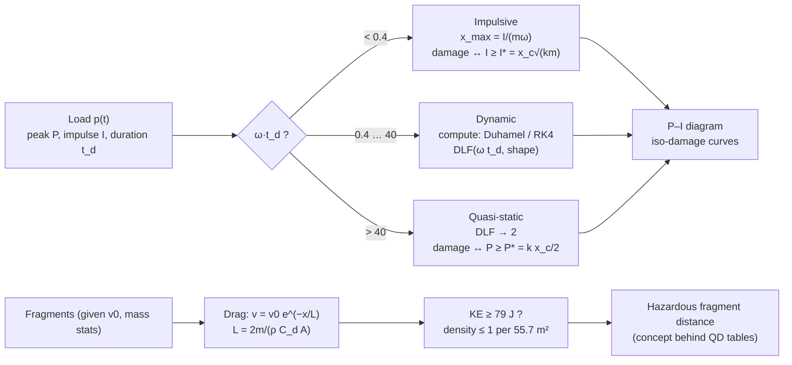

# 01.6 · Structural response & fragmentation physics (conceptual)

<div class="module-card">

**Prerequisites** [01.1 Mechanics](lessons/stage-01/lesson-01.md) (Newton's laws, energy, impulse) · [01.4 Reflection & dynamic pressure](lessons/stage-01/lesson-04.md) (loads, drag) · [01.5 Scaling laws](lessons/stage-01/lesson-05.md) · linear ODEs.

**Estimated time** 6 h (3 h theory · 1.5 h simulator · 1.5 h programming) · **Level** Intermediate

**Next** [01.7 Electricity & electromagnetism](lessons/stage-01/lesson-07.md); this lesson is the foundation for [04.3 Structural effects](lessons/stage-04/lesson-03.md) and [04.4 Injury, fragments & secondary hazards](lessons/stage-04/lesson-04.md).

<p class="tags"><span>physics</span><span>structural dynamics</span><span>SDOF</span><span>P–I diagrams</span><span>fragment statistics</span><span>Sim D</span></p>
</div>

## Why this matters

01.4 gave you the *load*: a pressure pulse lasting milliseconds. Whether that load breaks a window,
cracks a wall, topples a robot or injures a person depends on the *target* as much as on the load —
specifically on how the target's natural timescale compares with the pulse. A 10 ms pulse is
"instantaneous" to a heavy concrete wall with an 80 ms period and "static" to a light cladding panel
with a 1 ms period. The **single-degree-of-freedom (SDOF) oscillator** captures this with one
dimensionless number, $\omega t_d$, and leads directly to the **pressure–impulse (P–I) diagram**,
the tool protective engineers and safety assessors use to summarise a component's vulnerability.

The second half of the lesson treats the other major hazard of explosive events at the level of
physics and statistics: **fragments and debris**. Here the questions are *how fast do fragments slow
down*, *how far can they travel*, *how are their masses distributed*, and *how does one turn that into
a safety distance* — which is the logic behind the "hazardous fragment density" criterion in the
quantity-distance standards. How fragments are *produced* is deliberately outside this course; every
initial velocity here is a given, fictional input.

<div class="callout boundary">

**Scope.** Fragmentation is taught through drag, ballistics, statistics and hazard-distance
concepts only. Methods for predicting or designing fragment velocities or patterns from an energetic
source (e.g. Gurney-type energy balances) are deliberately excluded.

</div>

## Learning objectives

1. Derive the response of an undamped SDOF oscillator to rectangular and triangular pulses and the
   corresponding **dynamic load factors (DLF)**.
2. Classify loading as impulsive, dynamic or quasi-static from $\omega t_d$ (< 0.4, between, > 40)
   and explain which load parameter controls damage in each regime.
3. Derive the **P–I asymptotes** $I^*=x_c\sqrt{km}$ and $P^*=kx_c/2$ from energy balance, and
   extend them to an elastic–perfectly-plastic resistance function with ductility $\mu$.
4. Explain Biggs's equivalent-SDOF method (load, mass and load–mass factors) for a real member.
5. Model fragment deceleration by drag, show exponential velocity decay with distance, and estimate
   ballistic ranges with gravity and drag numerically.
6. Use the **Mott distribution** as a statistical model of fragment masses and explain how the
   **hazardous fragment density** criterion (1 per 55.7 m², DoD/IATG) turns fragment statistics
   into a hazard distance.

## Theory

### 1. The SDOF oscillator

Idealise a structural element (a wall panel spanning between floors, a window pane, a robot's mast)
as one mass on one spring:

$$ m\ddot x + c\dot x + kx = F(t),\qquad \omega = \sqrt{k/m},\qquad T = 2\pi/\omega,\qquad x_{\text{st}} = F_0/k . $$

| Symbol | Meaning | SI unit | Dimensions |
|---|---|---|---|
| $m$ | (equivalent) mass | kg (or kg m⁻² per unit area) | M |
| $k$ | stiffness | N m⁻¹ | M T⁻² |
| $c$ | viscous damping | N s m⁻¹ | M T⁻¹ |
| $F(t)$ | load, $=A\,p(t)$ for pressure $p$ on area $A$ | N | M L T⁻² |
| $\omega, T$ | natural circular frequency, period | rad s⁻¹, s | T⁻¹, T |
| $t_d$ | load duration | s | T |
| $\text{DLF}$ | dynamic load factor $x_{\max}/x_{\text{st}}$ | — | 1 |

For blast, damping is usually neglected for the *first* peak (it acts over several cycles; the peak
occurs within one). Sim D uses exactly this model: $m = 100$ kg/m², $k = m(2\pi/T)^2$, $A = 1$ m²,
integrated by RK4 (`sdofResponse` in `sims/common/blast.js`).

The general undamped solution for zero initial conditions is the **Duhamel integral**

$$ x(t) = \frac{1}{m\omega}\int_0^t F(\tau)\sin\omega(t-\tau)\,d\tau . $$

**Rectangular pulse** ($F=F_0$ for $0\le t\le t_d$). During the load, $x = x_{\text{st}}(1-\cos\omega t)$,
peaking at $2x_{\text{st}}$ at $t = \pi/\omega = T/2$. If the pulse ends earlier, the mass continues in
free vibration with amplitude $2x_{\text{st}}\sin(\omega t_d/2)$. Hence

<div class="callout eq">

$$ \text{DLF}_{\text{rect}} = \begin{cases} 2\sin(\omega t_d/2), & \omega t_d < \pi \;(t_d < T/2)\\ 2, & \omega t_d \ge \pi \end{cases} $$

**Triangular (instantly rising, linearly decaying) pulse** $F=F_0(1-t/t_d)$: during the load
$$ \frac{x}{x_{\text{st}}} = 1-\cos\omega t + \frac{\sin\omega t}{\omega t_d} - \frac{t}{t_d}, $$
and after it free vibration with amplitude
$\sqrt{(x_e/x_{\text{st}})^2 + (\dot x_e/(\omega x_{\text{st}}))^2}$ built from the end state. DLF is the
larger of the in-load maximum and that amplitude. Limits: $\text{DLF}\to\omega t_d/2$ (impulsive),
$\text{DLF}\to2$ (quasi-static).

</div>

**Numerical check** (computed with the formulas above; Sim D reproduces them):

| $\omega t_d$ | 0.1 | 0.4 | 1 | 2 | π | 10 | 40 | 100 |
|---|---|---|---|---|---|---|---|---|
| DLF rectangular | 0.0999 | 0.397 | 0.959 | 1.683 | 2.000 | 2 | 2 | 2 |
| DLF triangular | 0.0500 | 0.199 | 0.486 | 0.894 | 1.196 | 1.706 | 1.923 | 1.969 |
| impulsive limit $\omega t_d/2$ (triangle) | 0.050 | 0.200 | 0.50 | 1.0 | — | — | — | — |

<div class="callout physics">

**Intuition.** The "2" is the overshoot of a spring suddenly loaded: released from $x=0$ it
oscillates about $x_{\text{st}}$, reaching twice it. A short pulse gives the mass a kick — an impulse
$I = \int F\,dt$ — and the maximum displacement is then $I/(m\omega)$, whatever the pulse shape.
For a triangle, $I = F_0t_d/2$, so $\text{DLF} = kI/(m\omega F_0) = \omega t_d/2$. The only thing
the structure "measures" in that regime is impulse.

</div>

```python
import numpy as np

def dlf_rect(wtd):
    return np.where(wtd < np.pi, 2 * np.sin(wtd / 2), 2.0)

def dlf_triangular(wtd, n=20001):
    """Undamped SDOF, triangular pulse; returns x_max / x_static."""
    t = np.linspace(0, wtd, n)                 # time in units of 1/omega
    x_in = 1 - np.cos(t) + np.sin(t) / wtd - t / wtd
    xe = -np.cos(wtd) + np.sin(wtd) / wtd      # state at end of pulse
    ve = np.sin(wtd) + (np.cos(wtd) - 1) / wtd
    return max(x_in.max(), np.hypot(xe, ve))

print([round(dlf_triangular(w), 3) for w in (0.4, 2, 40)])   # [0.199, 0.894, 1.923]
```

<details class="answer"><summary>Exercise 1 — derive, then reveal</summary>

(a) Derive the in-load solution for the triangular pulse from the Duhamel integral. (b) For
$\omega t_d = 2$, does the maximum occur during or after the load?

*Answer.* (a) $\frac{1}{m\omega}\int_0^t F_0(1-\tau/t_d)\sin\omega(t-\tau)d\tau$. Integrate the two
terms: $\int_0^t\sin\omega(t-\tau)d\tau = (1-\cos\omega t)/\omega$ and
$\int_0^t\tau\sin\omega(t-\tau)d\tau = (\omega t-\sin\omega t)/\omega^2$. With $F_0/(m\omega^2)=x_{\text{st}}$:
$x/x_{\text{st}} = 1-\cos\omega t - (\omega t - \sin\omega t)/(\omega t_d)$. ✓ (b) At the end of the pulse
$x/x_{\text{st}} = -\cos2+\sin2/2 = 0.871$ and still rising ($\dot x>0$); the free-vibration
amplitude is 0.894, so the maximum occurs just *after* the load ends. For short pulses the maximum
is always in free vibration.

</details>

### 2. Response regimes

Because DLF depends only on $\omega t_d$ (for a given pulse shape), the response has three regimes
— the thresholds used in Sim D and in Baker et al. (1983):

| Regime | Criterion | Damage controlled by | Typical example |
|---|---|---|---|
| **Impulsive** | $\omega t_d < 0.4$ | impulse $I$ (pulse shape irrelevant) | heavy wall, long period, near a small source |
| **Dynamic** | $0.4 \le \omega t_d \le 40$ | both $P$ and $I$ | many real members; must be computed |
| **Quasi-static** | $\omega t_d > 40$ | peak $P$ (DLF ≈ 2) | light, stiff element under a long pulse (large yield, far away) |

<div class="callout key">

**Key idea.** Cube-root scaling (01.5) stretches $t_d$ with yield. The *same* component can be in
the impulsive regime for a small event and the quasi-static regime for a large one at the same
peak pressure. This is why "the overpressure that breaks a window" is not a single number.

</div>

<details class="answer"><summary>Exercise 2 — then reveal</summary>

A glazing panel has $T = 10$ ms. Loads: (a) $t_d = 0.5$ ms; (b) $t_d = 20$ ms; (c) $t_d = 100$ ms.
Classify each. For (b), with a triangular pulse, what DLF applies?

*Answer.* $\omega = 628$ rad/s. (a) $\omega t_d = 0.31$ → impulsive. (b) 12.6 → dynamic;
DLF (triangular) ≈ 1.76 (interpolating the table between 10 and 40, or computing: 1.76).
(c) 62.8 → quasi-static, DLF ≈ 1.95.

</details>

### 3. P–I diagrams from energy balance

Let a component fail (or reach a damage level) when its displacement reaches $x_c$. The set of
$(P,I)$ pairs that just produce $x_{\max} = x_c$ is an **iso-damage curve**. Its two asymptotes
follow from energy balance, without solving any ODE:

- **Impulsive asymptote.** The impulse gives momentum $I$ (per unit area, $A=1$) before the spring
  resists; kinetic energy $I^2/(2m)$ becomes strain energy $\tfrac12kx_c^2$:

  $$ I^* = x_c\sqrt{km}. $$

- **Quasi-static asymptote.** The load is constant during the whole motion; work $Px_c$ equals
  strain energy $\tfrac12kx_c^2$:

  $$ P^* = \frac{kx_c}{2}. $$

<div class="callout eq">

$$ I^* = x_c\sqrt{km},\qquad P^* = \frac{kx_c}{2}\qquad\text{(per unit loaded area; divide by } A \text{ otherwise)} $$

</div>

Between them the curve must be computed (Sim D bisects on $P$ for each $t_d$ with RK4; `piCurve`).
For a triangular pulse the points on the curve are $P = kx_c/\text{DLF}(\omega t_d)$,
$I = Pt_d/2$. A shifted hyperbola $(P/P^*-1)(I/I^*-1) = c$ is often used as a fit; computing it for
the triangular pulse shows $c$ is *not* constant — about 0.09 at $\omega t_d = 1$, 0.22 at 3, and
approaching 0.39 for long pulses — so use it only as a rough sketch of the knee.

**Numerical example** (Sim D's "masonry-like wall": $m = 100$ kg/m², $T = 20$ ms, lowest threshold
$x_c = 1$ cm). $k = 100(2\pi/0.02)^2 = 9.87\times10^6$ N m⁻¹ per m².
$I^* = 0.01\sqrt{9.87\times10^6\cdot100} = 314$ Pa·s $= 314$ kPa·ms. $P^* = 9.87\times10^6\cdot0.01/2
= 49.3$ kPa. Loads with impulse below 314 kPa·ms cannot reach 1 cm however high the pressure;
loads below 49.3 kPa cannot reach it however long they last.

```python
def pi_asymptotes(m, k, xc, area=1.0):
    return {"I_star": xc * np.sqrt(k * m) / area, "P_star": k * xc / (2 * area)}

def pi_curve_triangular(m, k, xc, wtd_grid=np.geomspace(0.01, 1000, 200)):
    omega = np.sqrt(k / m)
    P = np.array([k * xc / dlf_triangular(w) for w in wtd_grid])
    I = P * (wtd_grid / omega) / 2
    return I, P

m, T = 100.0, 0.020
k = m * (2 * np.pi / T) ** 2
print(pi_asymptotes(m, k, 0.01))    # I* ≈ 314 Pa·s, P* ≈ 49.3 kPa
```

<details class="answer"><summary>Exercise 3 — then reveal</summary>

(a) How do $I^*$ and $P^*$ change if the wall's mass doubles at constant stiffness? Interpret.
(b) Show that the "corner" of the P–I diagram, $I^*/P^*$, has units of time and equals $2/\omega$.
Why is that natural?

*Answer.* (a) $I^*\propto\sqrt m$ → ×1.41; $P^*$ unchanged. Mass buys resistance to short pulses
only — the logic of massive barriers against impulsive loads. (b) $I^*/P^* = 2\sqrt{m/k} = 2/\omega$:
the curve's knee sits where the pulse duration is comparable to the structure's own timescale.

</details>

### 4. Elastic–plastic resistance and ductility

Real members do not stay elastic. A standard idealisation is **elastic–perfectly-plastic**:
resistance $R(x) = kx$ up to $R_m$ at the elastic limit $x_e = R_m/k$, then constant $R_m$. Damage
is expressed by the **ductility ratio** $\mu = x_m/x_e$. Energy balance again gives the asymptotes
(Biggs 1964; Baker et al. 1983):

$$ \text{impulsive: } \frac{I^2}{2m} = R_m\Big(x_m-\frac{x_e}{2}\Big)\;\Rightarrow\; I^* = \sqrt{2mR_mx_e\,(\mu-\tfrac12)},\qquad
\text{quasi-static: } P^* = R_m\Big(1-\frac{1}{2\mu}\Big). $$

**Numerical example.** Same wall, $R_m = 60$ kPa → $x_e = 6.08$ mm. For $\mu = 3$ ($x_m = 18.2$ mm):
$I^* = \sqrt{2\cdot100\cdot6\times10^4\cdot0.00608\cdot2.5} = 427$ Pa·s and $P^* = 60(1-1/6) = 50$ kPa.
A purely elastic model asked to reach the same 18.2 mm would give $I^* = 573$ Pa·s and $P^* = 90$ kPa —
plasticity makes the member *less* resistant to reaching a given displacement, but able to reach it
without collapse. Design codes (UFC 3-340-02 Ch. 3) specify permissible $\mu$ and support rotations
per member type and protection level.

**Biggs's equivalent SDOF.** A real beam or slab is a continuum. Biggs (1964) maps it onto an SDOF
by assuming a deflected shape $\phi(z)$ and requiring the SDOF to have the same kinetic energy,
work and strain energy as the member at its reference point. This yields a **load factor** $K_L$,
**mass factor** $K_M$, and the equation $K_{LM}\,m_t\ddot x + kx = F(t)$ with $K_{LM}=K_M/K_L$. For a
simply supported beam under uniform load: elastic $K_L=0.64$, $K_M=0.50$ ($K_{LM}=0.78$);
plastic (mechanism) $K_L = 0.50$, $K_M = 0.33$ ($K_{LM}=0.66$). These tables are the backbone of
UFC 3-340-02's single-degree-of-freedom analysis and of many blast-assessment tools.

<details class="answer"><summary>Exercise 4 — then reveal</summary>

For the simply supported beam, why is $K_M < K_L$ in both regimes, and why do both drop from the
elastic to the plastic shape?

*Answer.* $K_L = \int p\phi\,dz/(pL)$ and $K_M = \int m\phi^2dz/(mL)$ with $\phi\le1$ normalised at
mid-span; $\phi^2<\phi$ wherever $0<\phi<1$, so $K_M<K_L$. In the plastic mechanism the shape is two
straight segments (hinge at mid-span), which is "less full" than the elastic sine-like shape, so
both integrals fall.

</details>

### 5. Fragment deceleration by drag

Treat a fragment (or piece of secondary debris) of mass $m$, presented area $A$ and drag coefficient
$C_d$, moving through still air of density $\rho$. Ignoring gravity over short flight times:

$$ m\frac{dv}{dt} = -\tfrac12\rho C_dAv^2 .$$

Using $dv/dt = v\,dv/dx$:

<div class="callout eq">

$$ \frac{dv}{dx} = -\frac{v}{L}\;\Rightarrow\; v(x) = v_0\,e^{-x/L},\qquad L = \frac{2m}{\rho C_dA},\qquad
t(x) = \frac{L}{v_0}\left(e^{x/L}-1\right),\qquad \text{KE}(x) = \text{KE}_0\,e^{-2x/L}. $$

</div>

| Symbol | Meaning | SI unit |
|---|---|---|
| $v_0$ | initial speed (here always a given, fictional input) | m s⁻¹ |
| $L$ | drag e-folding length | m |
| $A$ | presented (mean) area; for tumbling fragments an average over orientations | m² |
| $C_d$ | drag coefficient; for irregular fragments ≈ 1 at supersonic speed, Mach-dependent | — |

**Intuition.** Velocity decays **exponentially with distance**, not with time. $L$ is a
mass-to-area ratio: for geometrically similar fragments $m\propto s^3$ and $A\propto s^2$, so
$L\propto s\propto m^{1/3}$. Heavy fragments carry much further — which is why fragment hazards do
*not* follow blast cube-root scaling (01.5 §6), and why the largest pieces set the outer hazard
distance.

**Numerical example** (fictional fragment). A steel-density chunk, $m = 5$ g, compact shape
$A = (m/\rho_s)^{2/3} = 7.40\times10^{-5}$ m², $C_d = 1.0$, $v_0 = 1000$ m/s (given):
$L = 2\cdot0.005/(1.225\cdot1.0\cdot7.40\times10^{-5}) = 110$ m.

| $x$ [m] | 0 | 50 | 100 | 190 | 200 |
|---|---|---|---|---|---|
| $v$ [m/s] | 1000 | 635 | 404 | 178 | 163 |
| KE [J] | 2500 | 1009 | 408 | 79 | 66 |

At 190 m its kinetic energy has fallen to 79 J — the hazardous-fragment threshold used below.
It reaches 100 m after $t = (110/1000)(e^{100/110}-1) = 0.16$ s.

```python
RHO_AIR = 1.225

def drag_length(m, A, Cd=1.0, rho=RHO_AIR):
    return 2 * m / (rho * Cd * A)

def speed_at(x, v0, L):
    return v0 * np.exp(-x / L)

m = 0.005; A = (m / 7850) ** (2 / 3)
L = drag_length(m, A)
print(L, speed_at(100, 1000, L))     # ≈110 m, ≈404 m/s
```

<details class="answer"><summary>Exercise 5 — then reveal</summary>

Two geometrically similar fictional fragments, 5 g and 40 g, start at the same speed. How much
further does the heavier one travel before its speed halves? What changes if $C_d$ rises by 30 %
at supersonic speeds?

*Answer.* $L\propto m^{1/3}$: ratio $8^{1/3} = 2$. Speed halves at $x = L\ln2$: 76 m vs 153 m.
With $C_d$ 30 % higher, $L$ falls by 1/1.3 → 59 m and 118 m. A real $C_d(\mathrm{Ma})$ makes the decay
faster early (supersonic) and slower later.

</details>

### 6. Ballistic range with drag and gravity

Over longer flights gravity matters. The equations are

$$ \dot{\mathbf v} = -\frac{\rho C_dA}{2m}\,|\mathbf v|\,\mathbf v - g\,\hat{\mathbf z}, $$

with no closed form; integrate numerically. For the fictional 5 g fragment at 1000 m/s:

| Launch angle | 5° | 10° | 20° | 30° | 45° |
|---|---|---|---|---|---|
| Range with drag [m] | 387 | 426 | 447 | 435 | 378 |
| Flight time [s] | 3.6 | 5.5 | 8.4 | 10.8 | 14.1 |

The vacuum range would be $v_0^2/g\approx102$ km at 45°. With drag, the maximum range (≈ 450 m) is
roughly 200× smaller and occurs at a **lower angle** (≈ 20° here); impact speed is close to the
terminal velocity $v_t = \sqrt{2mg/(\rho C_dA)} = 32.9$ m/s. Drag, not gravity, dominates fragment
range — and so range scales with $L$ (mass-to-area), which is why published maximum fragment
distances are empirical and item-specific (determined by arena tests and recorded in the standards)
rather than computed from ballistics alone.

```python
from scipy.integrate import solve_ivp

def ballistic_range(v0, theta_deg, m, A, Cd=1.0, rho=RHO_AIR, g=9.81):
    kd = rho * Cd * A / (2 * m)
    def f(t, y):
        vx, vz = y[2], y[3]; v = np.hypot(vx, vz)
        return [vx, vz, -kd * v * vx, -g - kd * v * vz]
    hit = lambda t, y: y[1]; hit.terminal = True; hit.direction = -1
    th = np.radians(theta_deg)
    s = solve_ivp(f, [0, 500], [0, 0, v0 * np.cos(th), v0 * np.sin(th)],
                  events=hit, max_step=0.01, rtol=1e-8)
    return s.y_events[0][0][0], s.t_events[0][0]

print(ballistic_range(1000, 20, 0.005, (0.005 / 7850) ** (2 / 3)))   # ≈ (447 m, 8.4 s)
```

### 7. Fragment statistics: the Mott distribution

A fragmenting body produces a *population* of fragments with a wide distribution of masses. Mott
(1947) proposed, from a statistical model of random fracture, that the cumulative number of
fragments heavier than $m$ is

<div class="callout eq">

$$ N(>m) = N_0\,\exp\!\left[-\left(\frac{m}{\mu}\right)^{1/2}\right],\qquad N_0 = \frac{M_f}{2\mu},\qquad
\frac{M(>m)}{M_f} = \Big(1+\sqrt{m/\mu}\Big)e^{-\sqrt{m/\mu}} . $$

</div>

| Symbol | Meaning | Unit |
|---|---|---|
| $N(>m)$ | number of fragments with mass greater than $m$ | — |
| $N_0$ | total number of fragments | — |
| $\mu$ | Mott distribution parameter (half the mean fragment mass); empirical | kg |
| $M_f$ | total fragment mass | kg |
| $M(>m)$ | mass contained in fragments heavier than $m$ | kg |

$N_0 = M_f/(2\mu)$ because the mean mass of this distribution is $2\mu$ (integrate
$\int_0^\infty m\,|dN/dm|\,dm$ with $s=\sqrt{m/\mu}$). The distribution is heavy in *number* at small
masses but a large share of *mass* sits in few large pieces. It is a **statistical model** —
a Weibull-type law with shape ½ — fitted to data recovered from arena tests; in this course $\mu$ is
simply a given parameter.

**Numerical example** (fictional: $M_f = 1.0$ kg, $\mu = 0.5$ g). $N_0 = 1000$ fragments. Heavier
than 1 g: $1000e^{-\sqrt2} = 243$; heavier than 5 g: $1000e^{-\sqrt{10}} = 42$ fragments, carrying
$(1+3.162)e^{-3.162} = 17.6$ % of the mass. Median fragment mass $\mu(\ln2)^2 = 0.24$ g.

```python
def mott_number_above(m, Mf, mu):
    return Mf / (2 * mu) * np.exp(-np.sqrt(m / mu))

def mott_mass_fraction_above(m, mu):
    s = np.sqrt(m / mu); return (1 + s) * np.exp(-s)

print(mott_number_above(5e-3, 1.0, 0.5e-3), mott_mass_fraction_above(5e-3, 0.5e-3))  # 42.3 0.176
```

<details class="answer"><summary>Exercise 6 — then reveal</summary>

Sample 1000 fragment masses from the Mott distribution by inverse-transform sampling, fit $\mu$ by
maximum likelihood, and check the fit with a Q–Q plot of $\sqrt m$.

*Answer.* Normalised, $P(>m) = e^{-\sqrt{m/\mu}}$, so $\sqrt{m/\mu}$ is Exp(1): sample
$m = \mu\,(-\ln U)^2$. Then $\sqrt m$ is exponential with mean $\sqrt\mu$, and the MLE is
$\hat\mu = (\overline{\sqrt m})^2$. A Q–Q plot of $\sqrt m$ against exponential quantiles is a
straight line if the model holds; real data typically deviate at both tails (bimodal
distributions are common), which is why modern work uses mixtures.

</details>

### 8. Hazardous fragment density and hazard distance

Safety standards do not ask "can any fragment reach this point?" — some fragment almost always can
— but "is the **density** of *dangerous* fragments low enough?". The US DoD explosives-safety
standard (DESR 6055.09) and the international IATG QD framework use two definitions:

- a **hazardous fragment** is one with impact kinetic energy of at least **79 J** (58 ft·lbf);
- the **hazardous fragment distance** is the range at which the areal density of hazardous
  fragments falls to **1 per 55.7 m²** (600 ft²) — roughly a 1 % chance that a person-sized
  target (≈ 0.58 m²) is struck.

Conceptually, if $N_h(R)$ fragments are still hazardous at range $R$ and they are spread over a
hemisphere, the areal density is $\sigma(R) \approx N_h(R)/(2\pi R^2)$ and the criterion is
$\sigma(R) = 1/55.7$ m⁻². $N_h$ *falls* with $R$ because drag (§5) removes energy — small fragments
drop out first.

**Numerical example** (entirely fictional, continuing §5 and §7: 1000 Mott fragments, $\mu = 0.5$ g,
all launched at 1000 m/s, compact steel-density shapes, straight-line flight, uniform over a
hemisphere). Integrating the Mott population with each mass's $L(m)$:

| $R$ [m] | 10 | 50 | 100 | 200 |
|---|---|---|---|---|
| $N_h(R)$ | 488 | 277 | 141 | 37 |
| $\sigma\cdot55.7$ (≥ 1 means criterion exceeded) | 43 | 0.98 | 0.13 | 0.008 |

The toy model gives a hazardous-fragment distance of ≈ 50 m. Real hazard distances are larger and
are *not* computed this way: fragments are not emitted uniformly (there are strong directional
sprays), trajectories are lofted, a few very heavy pieces travel far, and debris from surroundings
adds. That is why standards determine them from arena tests and tabulate them by item type — the
*concept* above is what those tables encode.

```python
def hazardous_count(R, Mf, mu, v0, rho_s=7850, Cd=1.0, E_h=79.0):
    ms = np.geomspace(1e-6, 0.2, 20000)
    n = Mf / (2 * mu) / (2 * np.sqrt(ms * mu)) * np.exp(-np.sqrt(ms / mu))   # dN/dm
    L = drag_length(ms, (ms / rho_s) ** (2 / 3), Cd)
    ke = 0.5 * ms * (v0 * np.exp(-R / L)) ** 2
    return np.trapezoid(n * (ke >= E_h), ms)

from scipy.optimize import brentq
R_h = brentq(lambda R: hazardous_count(R, 1.0, 0.5e-3, 1000) / (2 * np.pi * R**2) - 1 / 55.7, 1, 2000)
print(R_h)    # ≈ 50 m in this toy model
```

<div class="callout safety">

**Why EOD cares.** Evacuation and cordon distances (07.2) for items that can fragment are
typically governed by fragments, not by blast overpressure — and the governing fragments are the
rare heavy ones in the tail of the distribution. Robust cordon reasoning therefore uses published
tables and conservative defaults, not bespoke calculations at the scene.

</div>

## Visual explanation



Sim D's two lower panels are the SDOF response and the P–I diagram for the load at your gauge.

<iframe class="sim-frame" src="sims/blast-physics/index.html?embed=1" height="760" loading="lazy"></iframe>

<a class="sim-link" href="sims/blast-physics/index.html" target="_blank">Open Sim D full-screen ↗</a>

## Worked example — one wall, three standoffs

*Fictional scenario.* Sim D's "masonry-like wall" ($m = 100$ kg/m², $T = 20$ ms, treated as
elastic) faces a 10 YU free-air release. Damage thresholds (Sim D's abstract levels): low
$x_c = 1$ cm, moderate 3 cm, severe 10 cm. The wall reflects the wave (01.4); clearing is slow, so
use the full reflected Friedlander pulse.

| Standoff | $Z$ | $p_r$ [kPa] | $t_d$ [ms] | $i_r$ [kPa·ms] | $\omega t_d$ | regime | $x_{\max}$ [mm] | DLF |
|---|---|---|---|---|---|---|---|---|
| 15 m | 6.96 | 35.8 | 8.48 | 129 | 2.67 | dynamic | 3.4 | 0.94 |
| 8 m | 3.71 | 126 | 5.00 | 268 | 1.57 | dynamic | 8.0 | 0.63 |
| 5 m | 2.32 | 446 | 2.89 | 506 | 0.91 | dynamic (near impulsive) | 15.8 | 0.35 |

Checks against the asymptotes for $x_c = 1$ cm ($I^* = 314$ kPa·ms, $P^* = 49.3$ kPa):
at 15 m, $i_r = 129 < I^*$ and $p_r = 35.8 < P^*$ — below both asymptotes, so this damage level
cannot be reached whatever the pulse details. At 8 m, $p_r > P^*$ but $i_r < I^*$ — the
load sits in the "safe" impulse-limited branch (8.0 mm < 10 mm). At 5 m, $i_r = 506 > I^*$ and
$p_r \gg P^*$: above the curve, $x_{\max} = 15.8$ mm → "low" damage exceeded, "moderate" (30 mm) not.
Note how the DLF falls as the source approaches: the pulse gets shorter relative to $T$ and the
wall responds increasingly to impulse only — the P–I diagram's impulsive branch.

## Simulation work

<div class="callout sim">

**Sim D, SDOF and P–I panels.**

1. With the wall box ticked, set 10 YU and move the standoff from 50 m to 3 m. Watch the regime
   tag ($\omega t_d$ and DLF). Record DLF at five standoffs for each of the three elements and plot
   DLF vs $\omega t_d$ on log axes. Overlay the §1 triangular formula. Why is Sim D's DLF (Friedlander
   pulse) *lower* than the triangular one at the same $\omega t_d$?
2. In the P–I panel, identify the two asymptotes for each threshold and check them against
   $I^*=x_c\sqrt{km}$ and $P^*=kx_c/2$ (with $m = 100$ kg/m²).
3. Find, for the *light cladding panel* ($T = 5$ ms), the standoff at which the load point crosses
   the "low" curve for 10 YU and for 1000 YU. Is the ratio $W^{1/3}$? Explain using the regime
   (01.5 §6: the structure's $T$ does not scale).
4. Challenge mode question 5 asks for $\omega t_d$ — do it without the calculator.

</div>

## Practical exercises

1. **DLF by hand.** A cladding panel ($T = 4$ ms) sees a rectangular pulse of 1.5 ms. Compute the
   DLF. The pulse is then replaced by a triangle with the same *impulse* and the same duration —
   what happens to the peak pressure and the DLF, and to $x_{\max}$?
2. **Two targets, one load.** A load of $P = 80$ kPa, $t_d = 4$ ms (triangular) acts on (a) a
   window with $T = 8$ ms, (b) a heavy wall with $T = 120$ ms. Use regimes and asymptotes to decide
   which is more at risk *relative to its own* $P^*$ and $I^*$, given $P^* = 20$ and 150 kPa and
   $I^* = 40$ and 900 kPa·ms respectively.
3. **Fragment data analysis.** You are given (fictional) recovered-fragment masses from an arena
   test in a CSV. Fit Mott and a two-component Mott mixture by maximum likelihood; compare with AIC;
   report the number of fragments above 10 g with a bootstrap interval.
4. **Sensitivity of hazard distance.** In the §8 toy model, which input changes the
   hazardous-fragment distance most: $C_d$ ±30 %, $\mu$ ±50 %, or the threshold 79 J ±20 %?
   Compute and explain.

<details class="answer"><summary>Answers to 1 and 2</summary>

1. $\omega t_d = 2\pi\cdot1.5/4 = 2.356 < \pi$ → DLF $= 2\sin(1.178) = 1.848$. Triangle with the same
   impulse and duration has twice the peak; its DLF at $\omega t_d = 2.356$ is ≈ 1.00 relative to
   its own (doubled) peak, so $x_{\max}$ changes from $1.848\,x_{\text{st}}$ to ≈ $2.01\,x_{\text{st}}$
   (in units of the rectangle's static deflection) — about 9 % more despite a doubled peak: towards
   the impulsive regime, impulse is what counts.
2. $I = 80\cdot4/2 = 160$ kPa·ms. (a) $\omega t_d = 3.14$ — dynamic; $P/P^* = 4$ and $I/I^* = 4$ —
   well above the curve: at risk. (b) $\omega t_d = 0.21$ — impulsive; only $I$ matters:
   $160 < 900$ → safe even though $P<P^*$ too. The window is far more at risk.

</details>

## Programming exercise — a P–I diagram generator with plasticity

**Goal.** Write `pi_diagram(m, resistance, xc, pulse="triangular")` producing an iso-damage curve for
an SDOF with an arbitrary resistance function, validated against the elastic closed forms.

- **Input:** mass per area [kg/m²]; a resistance callable `R(x, state)` supporting
  elastic–perfectly-plastic with unloading (state carries the plastic offset); threshold
  displacement $x_c$; pulse family (rectangular, triangular, Friedlander with fixed $b$).
- **Output:** arrays $(I, P)$ on a log-spaced grid of $t_d$ spanning $\omega t_d\in[10^{-2},10^3]$;
  the numerically detected asymptotes.
- **Constraints:** RK4 or `solve_ivp` with event on $\dot x = 0$; bisection on $P$; ≤ 2 s for 60
  points; NumPy/SciPy only.
- **Expected behaviour:** elastic case reproduces $I^* = x_c\sqrt{km}$, $P^* = kx_c/2$ within 1 %;
  elastic–plastic case reproduces $\sqrt{2mR_mx_e(\mu-\tfrac12)}$ and $R_m(1-1/(2\mu))$.
- **Test cases:** (i) $m = 100$, $T = 20$ ms, $x_c = 0.01$ m elastic → 314 kPa·ms, 49.3 kPa;
  (ii) $R_m = 60$ kPa, $\mu = 3$ → 427 kPa·ms, 50 kPa; (iii) rectangular-pulse curve lies below the
  triangular one in $P$ at equal $t_d$ (the rectangle carries more impulse).
- **Extensions:** add viscous damping and show its (small) effect on the first peak; implement
  Biggs's $K_{LM}$ switching between elastic and plastic ranges; add rebound (negative-phase)
  failure; export the curves for use in [Project P01](projects/p01-blast-wave/README.md).

## Reading

- Baker, W. E., Cox, P. A., Westine, P. S., Kulesz, J. J. & Strehlow, R. A., *Explosion Hazards
  and Evaluation*, Elsevier (1983) — ch. 4 (structural response, SDOF, P–I diagrams, energy
  solutions) and ch. 6 (fragments: drag, statistics, including Mott's distribution). The single
  best book for this lesson. https://shop.elsevier.com/books/explosion-hazards-and-evaluation/baker/978-0-444-42094-7
- Biggs, J. M., *Introduction to Structural Dynamics*, McGraw-Hill (1964) — ch. 2 (SDOF, DLF charts)
  and ch. 5 (equivalent systems, $K_L$, $K_M$ tables). https://archive.org/details/introductiontost0000bigg
- US DoD, *UFC 3-340-02* (2008, Change 2 2014), Ch. 3 (dynamic analysis, resistance functions,
  ductility): https://www.wbdg.org/dod/ufc/ufc-3-340-02 — read as physics, not as design procedure.
- Mott, N. F., "Fragmentation of shell cases", *Proc. R. Soc. A* 189 (1947), DOI
  10.1098/rspa.1947.0042 — the original statistical argument (read the statistics, §§1–3).
- USD(A&S)/DDESB, *DESR 6055.09 Defense Explosives Safety Regulation* (2025): https://www.denix.osd.mil/ddes/denix-files/sites/32/2022/08/DESR-6055.09-Edition1-Change-2-251208.pdf
  — definitions of hazardous fragment and hazardous fragment density in the QD volume.
- UNODA, *IATG 02.20 Quantity and separation distances* (2021): https://data.unsaferguard.org/iatg/en/V3_IATG-02.20_en.pdf
  and *IATG 01.80* debris/fragment models — the international counterpart.

## Assessment

1. *(Conceptual)* Why does the maximum response to a short pulse occur *after* the pulse ends,
   and why does pulse shape stop mattering in that limit?
2. *(Mathematical)* Derive $I^*$ and $P^*$ for the elastic–perfectly-plastic system and show they
   reduce to the elastic results when $\mu\to1$ appropriately (hint: compare at the same $x_m$).
3. *(Computation)* A fictional 20 g compact fragment ($A = (m/7850)^{2/3}$, $C_d = 1$) starts at
   600 m/s. At what distance does it fall below 79 J?
4. *(Interpretation)* A P–I diagram for a glazing type is published for "small charges at short
   range". A safety officer wants to use it for a much larger event at long range. What could go
   wrong?
5. *(Design)* An EOD robot's camera boom is a cantilever with $T \approx 30$ ms. Using §2–3, argue
   whether it is more vulnerable to a small nearby event or a large distant one at the *same* peak
   reflected pressure.

<details class="answer"><summary>Answers to 2 and 3</summary>

2. Impulsive: KE $I^2/(2m)$ = work absorbed $\int_0^{x_m}R\,dx = \tfrac12R_mx_e + R_m(x_m-x_e)$
   → $I^* = \sqrt{2mR_mx_e(\mu-\tfrac12)}$. Quasi-static: $Px_m = R_m(x_m-\tfrac12x_e)$ →
   $P^* = R_m(1-\tfrac{1}{2\mu})$. At $\mu = 1$ ($x_m = x_e$): $I^* = \sqrt{mR_mx_e} = x_e\sqrt{km}$ and
   $P^* = R_m/2 = kx_e/2$ — the elastic results. ✓
3. $A = (0.02/7850)^{2/3} = 1.866\times10^{-4}$ m², $L = 0.04/(1.225\cdot1.866\times10^{-4}) = 175$ m.
   $v_h = \sqrt{2\cdot79/0.02} = 88.9$ m/s; $x = 175\ln(600/88.9) = 334$ m.

</details>

## Expert extension

- **Multi-degree-of-freedom and modal SDOFs.** When is a single mode enough? Compare an SDOF
  with a two-mode Rayleigh–Ritz model of a plate; look at shear failure modes that an SDOF misses.
- **Probabilistic P–I.** Treat $m$, $k$, $R_m$ and the load as random; propagate with Monte Carlo
  and plot iso-probability-of-damage curves — the basis of modern risk-informed protective design
  (connects to 07.1).
- **Fragment statistics beyond Mott.** Grady's energy-based fragmentation theory and bimodal
  distributions; maximum-likelihood fitting with censoring (small fragments are under-recovered).
- **Supersonic drag.** Replace constant $C_d$ with $C_d(\mathrm{Ma})$ and quantify the effect on
  $L$ and on the §8 hazard distance.

## What comes next

[01.7](lessons/stage-01/lesson-07.md) moves from mechanics to electricity and electromagnetism — the
physics of sensors, robots and radios. In [04.3](lessons/stage-04/lesson-03.md) the SDOF and P–I
tools are applied to glazing, walls and frames, and in [04.4](lessons/stage-04/lesson-04.md) the
fragment concepts connect to injury mechanisms and published evacuation distances.
