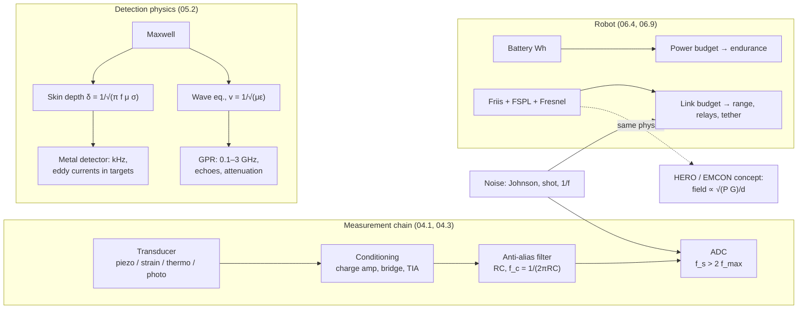

# 01.7 · Electricity, electromagnetism & electronics for EOD technology

<div class="module-card">

**Prerequisites** [01.1 Mechanics](lessons/stage-01/lesson-01.md) (energy, power) · vector calculus (div, curl, Stokes/Gauss) · complex exponentials and basic Fourier analysis.

**Estimated time** 7 h (4 h theory · 1 h simulator · 2 h programming) · **Level** Intermediate

**Next** Stage 2 [02.1 Chemical energy](lessons/stage-02/lesson-01.md); this lesson is a prerequisite for [05.2 EMI & GPR](lessons/stage-05/lesson-02.md), [06.1 EOD robot systems](lessons/stage-06/lesson-01.md) and [06.9 Communications & fail-safe design](lessons/stage-06/lesson-09.md).

<p class="tags"><span>physics</span><span>circuits</span><span>sensors</span><span>electromagnetism</span><span>RF</span><span>noise</span><span>Sim B</span><span>P02</span></p>
</div>

## Why this matters

Every public description of EOD training begins with electricity, and for good reason: almost all
of the technology an EOD team brings to an incident is electrical. Blast gauges are piezoelectric
transducers feeding charge amplifiers and fast digitisers; metal detectors and ground-penetrating
radar are applied electromagnetism whose performance is set by skin depth and soil conductivity;
robots are battery-powered electromechanical systems whose endurance is a power-budget problem and
whose control link is a radio whose range follows the Friis equation; every sensor's usefulness is
limited by noise. There is also a safety side: **electrostatic discharge (ESD)** and
**electromagnetic radiation** from the team's own equipment can be hazards to ordnance with
electrical components, which is why EOD teams control static and radio emissions near hazardous
items. This lesson gives you the working physics of all of these at the depth Stage 5 and Stage 6
will assume.

<div class="callout boundary">

**Scope.** Circuits, sensors and electromagnetism are taught as they apply to *measurement,
detection, robotics and communications*. Electrical hazards to ordnance (HERO, ESD) are covered only
as safety concepts — why teams control static and RF near hazardous items. No initiation, firing,
switching or device-circuit details are given, and none of this lesson's circuits relate to any
device.

</div>

## Learning objectives

1. Apply Ohm's and Kirchhoff's laws and solve RC transients; relate time constants to filter
   bandwidth.
2. Compute stored energy in capacitors and batteries, and build a robot **power budget** with
   derating.
3. Explain the transduction physics and signal chain of strain gauges, piezoelectric pressure
   gauges (blast measurement), thermocouples and photodiodes, and size a measurement chain.
4. State Maxwell's equations, derive the EM wave equation and the **skin depth**, and apply them to
   metal detection and GPR penetration.
5. Use antenna gain, **free-space path loss** and the **Friis equation** to build a radio link
   budget, including noise floor and Fresnel-zone clearance.
6. Quantify Johnson, shot and 1/f noise and SNR, and apply the **Nyquist** sampling theorem.
7. Explain, conceptually, why ESD and RF emissions are controlled near ordnance.

## Theory

### 1. Circuits: Ohm, Kirchhoff and RC transients

<div class="callout eq">

$$ V = IR,\qquad \sum_{\text{node}} I_k = 0\ \text{(KCL)},\qquad \sum_{\text{loop}} V_k = 0\ \text{(KVL)},\qquad P = VI = I^2R. $$

</div>

| Symbol | Meaning | SI unit |
|---|---|---|
| $V$ | potential difference | V = J C⁻¹ |
| $I$ | current | A = C s⁻¹ |
| $R$ | resistance | Ω = V A⁻¹ |
| $C$ | capacitance | F = C V⁻¹ |
| $\tau$ | time constant | s |

KCL is conservation of charge, KVL is the statement that the electric field of a static circuit is
conservative (energy per charge around a loop sums to zero). Together they turn any linear circuit
into a linear system — for an engineer, a graph with a Laplacian (nodal analysis).

**Numerical example.** A robot's 24 V pack has internal resistance 0.05 Ω and wiring of 0.03 Ω.
A 20 A drive surge drops $20\times0.08 = 1.6$ V (terminal 22.4 V) and dissipates $20^2\times0.08 = 32$ W
as heat. Voltage sag under load is why electronics on a robot are fed through regulators, and why
low-temperature operation (higher internal resistance) can cause brown-out resets.

**RC transient.** Charging a capacitor through a resistor from a step $V_0$:
$RC\,\dot v + v = V_0\Rightarrow v(t) = V_0(1-e^{-t/\tau})$, $\tau=RC$. In the frequency domain the
same circuit is a first-order low-pass filter with $-3$ dB cutoff $f_c = 1/(2\pi\tau)$. These are
two views of one object: a filter's step response and its bandwidth are locked together.

**Numerical example.** An anti-aliasing filter with $R = 1$ kΩ, $C = 10$ nF: $\tau = 10$ µs,
$f_c = 15.9$ kHz; it settles to 1 % in $\tau\ln100 = 46$ µs. Too slow to follow a blast front
(microseconds) — a design lesson you will use in §3.

```python
import numpy as np

def rc_step(t, V0, R, C):
    return V0 * (1 - np.exp(-t / (R * C)))

R, C = 1e3, 10e-9
print(1 / (2 * np.pi * R * C), R * C * np.log(100))   # 15915 Hz, 4.6e-5 s
```

<details class="answer"><summary>Exercise 1 — then reveal</summary>

(a) Show that the energy dissipated in $R$ while charging $C$ to $V_0$ from a source equals the
energy stored, independent of $R$. (b) A 1000 µF bus capacitor on a robot is at 50 V when power
is removed; a 10 kΩ bleed resistor is fitted. How long until it is below 5 V, and what energy did it
hold?

*Answer.* (a) $E_R = \int_0^\infty I^2R\,dt = \int (V_0/R)^2e^{-2t/\tau}R\,dt = \tfrac12CV_0^2$ — the same as
the stored energy. Half the source's energy is always lost. (b) $\tau = 10$ s,
$t = \tau\ln10 = 23$ s; $E = \tfrac12(10^{-3})(50^2) = 1.25$ J. Stored charge persisting after
"power off" is a routine hazard in any electronics maintenance.

</details>

### 2. Energy storage: capacitors, batteries and robot power budgets

$$ E_C = \tfrac12CV^2,\qquad E_{\text{batt}} = V_{\text{nom}}\,Q\quad(\text{Wh} = \text{V}\times\text{Ah}),\qquad
t_{\text{run}} = \frac{\eta_{\text{DoD}}\,\eta_T\,E_{\text{batt}}}{\bar P}. $$

| Symbol | Meaning | Unit |
|---|---|---|
| $Q$ | rated charge capacity | A h |
| $\eta_{\text{DoD}}$ | usable depth-of-discharge fraction | — |
| $\eta_T$ | temperature derating of capacity | — |
| $\bar P$ | mission-average power, $\sum_i d_iP_i$ with duty cycles $d_i$ | W |

Capacitors deliver high power but little energy (a 100 F, 2.7 V supercapacitor stores 365 J ≈ 0.1 Wh);
lithium-ion batteries store ~150–250 Wh/kg but with limited peak current and strong temperature
sensitivity. Robots combine them.

**Numerical example — power budget** (fictional mid-size EOD robot, 24 V, 20 Ah → 480 Wh):

| Load | Power [W] | Duty | Average [W] |
|---|---|---|---|
| drive (tracks) | 150 | 1.0 (mission-average incl. idle) | 150 |
| manipulator arm | 80 | 0.25 | 20 |
| compute + control | 40 | 1.0 | 40 |
| radio | 10 | 1.0 | 10 |
| cameras + lights | 20 | 1.0 | 20 |
| **total** | | | **240** |

Usable at 80 % DoD: 384 Wh → 1.6 h. At −10 °C with 70 % capacity: 1.12 h. A "two-hour" robot becomes
a one-hour robot on a winter night — endurance is an operational constraint (06.1, 06.4).

```python
def runtime_h(E_Wh, loads, dod=0.8, temp_derate=1.0):
    """loads: list of (power_W, duty)."""
    P = sum(p * d for p, d in loads)
    return dod * temp_derate * E_Wh / P, P

loads = [(150, 1.0), (80, 0.25), (40, 1.0), (10, 1.0), (20, 1.0)]
print(runtime_h(480, loads), runtime_h(480, loads, temp_derate=0.7))   # (1.6 h, 240 W), (1.12 h, 240 W)
```

<details class="answer"><summary>Exercise 2 — then reveal</summary>

The operator wants 2 h at −10 °C. Options: (a) bigger pack (mass penalty 1.5 kg per 100 Wh),
(b) cut drive power by 20 % with a slower gait, (c) duty-cycle lights and one camera to 50 %.
Which combination meets the target with least added mass?

*Answer.* Need $0.8\cdot0.7\cdot E/\bar P\ge2$ → $E\ge3.57\,\bar P$. (b)+(c): $\bar P = 120+20+40+10+10 = 200$ W → 714 Wh,
+234 Wh ≈ +3.5 kg. (b) alone: 210 W → 750 Wh, +4.1 kg. Nothing alone avoids a bigger pack; (b)+(c)
minimises it. (Real packs come in discrete sizes and must also meet peak-current limits.)

</details>

### 3. Sensors and transducers

A transducer converts a physical quantity into an electrical one; the chain is
transducer → conditioning (bridge, amplifier) → anti-alias filter → ADC. Four types recur in this
course.

**Strain gauge (structural response, 04.3).** A metal-foil resistor changes resistance with strain:
$\Delta R/R = \text{GF}\,\varepsilon$ with gauge factor GF ≈ 2. In a quarter Wheatstone bridge with
excitation $V_{\text{ex}}$, $V_{\text{out}}\approx V_{\text{ex}}\,\text{GF}\,\varepsilon/4$. Example: 500 µε,
GF = 2, 5 V → 1.25 mV. The bridge exists to subtract the huge common-mode resistance and to cancel
temperature drift with a dummy gauge.

**Piezoelectric pressure gauge (blast measurement, 04.1).** A piezoelectric crystal (quartz,
tourmaline, ceramic) produces charge proportional to force: $q = S_q\,p$ with charge sensitivity
$S_q$ [pC/kPa]. A **charge amplifier** converts it to voltage $V = -q/C_f$ via a feedback
capacitor $C_f$. A leakage resistor $R_f$ in parallel makes the system a high-pass filter with
$\tau = R_fC_f$: a constant pressure slowly "leaks away". Requirements for blast work:

| Requirement | Why | Rule of thumb |
|---|---|---|
| rise time ≲ 1–2 µs, resonance ≳ 200–500 kHz | a shock front is a step; the gauge must not ring or smear it | bandwidth $\approx0.35/t_r$ |
| $\tau = R_fC_f \gg t_d$ | droop during the pulse falsifies impulse | droop ≈ $t/\tau$; 1 % over 10 ms needs $\tau\ge1$ s |
| mounting | side-on gauges face parallel to flow; reflected gauges flush in the wall (01.4) | orientation error biases readings |

Example (fictional gauge): $S_q = 1.0$ pC/kPa, $p = 100$ kPa → 100 pC; $C_f = 1$ nF → 0.1 V.
Many modern gauges integrate the amplifier (IEPE/ICP) and are then specified directly in mV/kPa,
but the same time-constant limit applies.

**Thermocouple.** Two dissimilar metals produce a Seebeck voltage $V\approx S\,\Delta T$
(type K: $S\approx41$ µV/K near room temperature, so 300 K of difference ≈ 12 mV). It measures the
*difference* between hot and reference junction — cold-junction compensation is mandatory — and it
is slow (ms to s) because of its thermal mass.

**Photodiode (optical sensing, fireball timing, 05.5).** Photocurrent $I = \mathcal R\,P_{\text{opt}}$
with responsivity $\mathcal R = \eta q\lambda/(hc)$. Silicon at 850 nm, $\eta = 0.8$:
$\mathcal R = 0.548$ A/W. 1 µW → 0.55 µA; a 1 MΩ transimpedance amplifier gives 0.55 V.

```python
def quarter_bridge_vout(Vex, GF, strain):
    return Vex * GF * strain / 4

def charge_amp(p_kPa, Sq_pC_per_kPa, Cf):
    return p_kPa * Sq_pC_per_kPa * 1e-12 / Cf

def responsivity(lam, eta):
    q, h, c = 1.602e-19, 6.626e-34, 2.998e8
    return eta * q * lam / (h * c)

print(quarter_bridge_vout(5, 2, 500e-6), charge_amp(100, 1.0, 1e-9), responsivity(850e-9, 0.8))
# 0.00125 V, 0.1 V, 0.548 A/W
```

<details class="answer"><summary>Exercise 3 — then reveal</summary>

A blast gauge chain has $\tau = R_fC_f = 0.2$ s and records a Friedlander pulse with $t_d = 30$ ms.
Estimate the error in positive-phase impulse due to droop. Then: the gauge's resonant frequency is
100 kHz — what goes wrong at the shock front?

*Answer.* The high-pass response of a first-order system to a pulse lowers the signal by roughly
$\frac1\tau\int_0^t p\,dt'$; averaged over the pulse the impulse error is of order
$t_d/(2\tau)$–$t_d/\tau$ ≈ 7–15 %. Simulating the first-order high-pass (`scipy.signal.lsim`) on a
Friedlander pulse with $b = 0.5$ gives −9.8 % at $\tau = 0.2$ s, −2.1 % at 1 s and −0.4 % at 5 s —
use $\tau$ of several seconds. At 100 kHz resonance
the step excites ringing at 10 µs period, which rides on the peak and can be mistaken for real
overpressure; the rise is also limited to ~3–5 µs. Standard practice: high-resonance gauges and
low-pass filtering above the physics of interest, applied consistently.

</details>

### 4. Maxwell's equations at a working level

In a linear medium with permittivity $\varepsilon = \varepsilon_r\varepsilon_0$, permeability
$\mu = \mu_r\mu_0$ and conductivity $\sigma$:

<div class="callout eq">

$$ \nabla\cdot\mathbf D = \rho_f,\qquad \nabla\cdot\mathbf B = 0,\qquad
\nabla\times\mathbf E = -\frac{\partial\mathbf B}{\partial t},\qquad
\nabla\times\mathbf H = \mathbf J_f + \frac{\partial\mathbf D}{\partial t}, $$

$$ \mathbf D = \varepsilon\mathbf E,\qquad \mathbf B = \mu\mathbf H,\qquad \mathbf J_f = \sigma\mathbf E . $$

</div>

| Symbol | Meaning | SI unit |
|---|---|---|
| $\mathbf E, \mathbf H$ | electric and magnetic field | V m⁻¹, A m⁻¹ |
| $\mathbf D, \mathbf B$ | electric displacement, magnetic flux density | C m⁻², T |
| $\rho_f, \mathbf J_f$ | free charge density, free current density | C m⁻³, A m⁻² |
| $\varepsilon_0, \mu_0$ | vacuum permittivity $8.854\times10^{-12}$ F/m, permeability $4\pi\times10^{-7}$ H/m | |
| $\sigma$ | conductivity | S m⁻¹ |

Read them physically: charges source $\mathbf E$; there are no magnetic charges; a *changing*
magnetic field induces a circulating electric field (Faraday — the principle of every metal
detector's receive coil); currents *and changing electric fields* produce circulating magnetic
fields (Ampère–Maxwell — Maxwell's displacement term is what makes waves possible).

**Wave equation.** In a source-free, non-conducting region take the curl of Faraday's law and
substitute Ampère–Maxwell:
$\nabla\times\nabla\times\mathbf E = -\mu\varepsilon\,\partial_t^2\mathbf E$; with $\nabla\cdot\mathbf E = 0$,
$\nabla^2\mathbf E = \mu\varepsilon\,\partial_t^2\mathbf E$. Waves travel at $v = 1/\sqrt{\mu\varepsilon}$; in
vacuum $c = 1/\sqrt{\mu_0\varepsilon_0} = 2.998\times10^8$ m/s. $\mathbf E\perp\mathbf H\perp\mathbf k$, with
$|\mathbf E|/|\mathbf H| = \eta = \sqrt{\mu/\varepsilon}$ ($\eta_0 = 376.7$ Ω). In soil with $\varepsilon_r = 9$,
$v = c/3 = 0.1$ m/ns — the number GPR uses to convert echo time to depth (05.2).

Compare 01.3: the acoustic impedance $\rho c$ and the wave impedance $\eta$ play the same role, and
reflection at a boundary follows the same $(Z_2-Z_1)/(Z_2+Z_1)$ form. This is the physics behind
GPR echoes from buried objects with different $\varepsilon_r$.

### 5. Skin depth: why metal detectors work and radar does not see through metal

In a good conductor ($\sigma\gg\omega\varepsilon$) Ampère–Maxwell is dominated by $\sigma\mathbf E$ and the
wave equation becomes a diffusion equation, $\nabla^2\mathbf E = \mu\sigma\,\partial_t\mathbf E$. A harmonic
field decays as $e^{-z/\delta}$ with

<div class="callout eq">

$$ \delta = \sqrt{\frac{2}{\omega\mu\sigma}} = \frac{1}{\sqrt{\pi f\mu\sigma}}\qquad\text{(good conductor)},\qquad
\alpha = \omega\sqrt{\frac{\mu\varepsilon}{2}}\left[\sqrt{1+\left(\frac{\sigma}{\omega\varepsilon}\right)^2}-1\right]^{1/2}\qquad\text{(general lossy medium)}. $$

Low-loss limit ($\sigma\ll\omega\varepsilon$): $\alpha\approx\dfrac{\sigma}{2}\sqrt{\dfrac{\mu}{\varepsilon}}$ [Np/m]; ×8.686 for dB/m.

</div>

| Material, frequency | $\sigma$ [S/m] | $\mu_r$ | $\delta$ |
|---|---|---|---|
| aluminium, 10 kHz | $3.5\times10^7$ | 1 | 0.85 mm |
| copper, 1 kHz | $5.96\times10^7$ | 1 | 2.1 mm |
| mild steel, 10 kHz | $\sim5\times10^6$ | $\sim100$ | ≈ 0.23 mm |
| wet soil, 10 kHz | $10^{-2}$ | 1 | 50 m |
| sea water, 10 kHz | 4 | 1 | 2.5 m |

**Consequences.** A metal detector (05.2) works at kHz frequencies: the field penetrates tens of
metres of soil (δ ≫ burial depth), but induces **eddy currents** in the skin of any metal object,
whose secondary field the receiver detects. Pulse-induction detectors watch those eddy currents
decay; the decay time grows with $\mu\sigma\times$ size², which is how they discriminate objects.
GPR works at 100 MHz–few GHz, where soil is a lossy dielectric: with $\varepsilon_r = 9$,
$\sigma = 0.01$ S/m, attenuation is ≈ 5.4 dB/m one way at both 100 MHz and 1 GHz (low-loss
regime; frequency-independent to first order), while the wavelength in soil falls from 1 m to 0.1 m
— the resolution–penetration trade-off is really driven by frequency-dependent losses and
scattering in real soils (Daniels 2004). Metal, with δ of micrometres at GHz, is a perfect reflector.

```python
MU0, EPS0 = 4e-7 * np.pi, 8.854e-12

def skin_depth(f, sigma, mu_r=1.0):
    return 1 / np.sqrt(np.pi * f * MU0 * mu_r * sigma)

def attenuation_np_per_m(f, eps_r, sigma, mu_r=1.0):
    w, eps, mu = 2 * np.pi * f, eps_r * EPS0, mu_r * MU0
    return w * np.sqrt(mu * eps / 2) * np.sqrt(np.sqrt(1 + (sigma / (w * eps)) ** 2) - 1)

print(skin_depth(1e4, 3.5e7), skin_depth(1e4, 1e-2))          # 0.85 mm, 50 m
print(8.686 * attenuation_np_per_m(1e8, 9, 0.01))              # ≈ 5.4 dB/m
```

<details class="answer"><summary>Exercise 4 — then reveal</summary>

(a) Why does the mild-steel skin depth come out *smaller* than aluminium's despite steel's lower
conductivity? (b) A GPR at 400 MHz in the soil above must see a target at 0.8 m depth. What is the
two-way loss from attenuation alone? (c) Why do metal detectors struggle in highly mineralised
(magnetic) soil even though its conductivity is low?

*Answer.* (a) $\delta\propto1/\sqrt{\mu_r\sigma}$; steel's $\mu_r\sim100$ outweighs its ~7× lower σ.
(b) ≈ 5.4 dB/m × 1.6 m ≈ 8.7 dB (plus spreading loss and interface losses). (c) The soil's magnetic
susceptibility responds to the detector's field just like a target does (a large, distributed
"signal"); ground-balancing is a background-subtraction problem (CWA 14747-2 characterises soils for
exactly this reason).

</details>

### 6. Antennas, propagation and the Friis equation

An antenna converts guided waves into radiated ones. Its **gain** $G$ (relative to an isotropic
radiator, dBi) is directivity times efficiency; its **effective aperture** is $A_e = G\lambda^2/(4\pi)$.
A half-wave dipole ($\lambda/2$ long: 6.25 cm at 2.4 GHz) has $G = 1.64$ (2.15 dBi).

Power spreads over a sphere, $S = P_tG_t/(4\pi d^2)$; the receiver collects $S\,A_{e,r}$. Hence

<div class="callout eq">

$$ P_r = P_t\,G_t\,G_r\left(\frac{\lambda}{4\pi d}\right)^2,\qquad
\text{FSPL}_{\text{dB}} = 20\log_{10}\!\frac{4\pi d}{\lambda},\qquad
P_{r,\text{dBm}} = P_{t,\text{dBm}} + G_t + G_r - \text{FSPL} - L_{\text{misc}} . $$

Field strength at distance $d$ (far field): $E_{\text{rms}} = \sqrt{30P_tG_t}/d$ [V/m].

</div>

| Symbol | Meaning | Unit |
|---|---|---|
| $P_t, P_r$ | transmitted, received power | W (dBm = dB re 1 mW) |
| $G_t, G_r$ | antenna gains | — (dBi) |
| $\lambda$ | wavelength $c/f$ | m |
| $d$ | distance | m |
| $L_{\text{misc}}$ | cable, body, obstruction, fading margins | dB |

**Link budget example** (fictional robot link, 2.4 GHz, 500 m line of sight): $\lambda = 0.125$ m,
FSPL = 94.0 dB. $P_t$ = 20 dBm (100 mW), $G_t=G_r=5$ dBi → $P_r = -64$ dBm. Noise floor in a 20 MHz
channel: $-174 + 10\log_{10}(2\times10^7) = -101$ dBm, plus a 6 dB receiver noise figure → −95 dBm.
SNR ≈ 31 dB before any fade margin. Doubling distance costs 6 dB.

**Why real robot links are worse than Friis.** A ground robot's antenna is ~0.5–1 m above ground.
The first **Fresnel zone** radius midway along a 500 m, 2.4 GHz path is
$r_1 = \sqrt{\lambda d_1d_2/d} = 3.95$ m — the ellipsoid that must be clear of obstacles for
free-space behaviour. The ground itself intrudes deeply, and beyond a break-point distance the
two-ray (direct + ground-reflected) model gives received power falling as $d^{-4}$ rather than
$d^{-2}$. Walls, vehicles, and especially buildings, stairwells and tunnels add tens of dB. That is
why EOD robots use raised antenna masts, relay nodes and fibre-optic tethers, and why loss-of-link
behaviour is a design requirement (06.9).

```python
def fspl_db(d, f):
    lam = 2.998e8 / f
    return 20 * np.log10(4 * np.pi * d / lam)

def link_margin(Pt_dBm, Gt, Gr, d, f, B, NF_dB, required_snr_dB, L_misc=0.0):
    Pr = Pt_dBm + Gt + Gr - fspl_db(d, f) - L_misc
    noise = -174 + 10 * np.log10(B) + NF_dB
    return Pr, Pr - noise, Pr - noise - required_snr_dB

print(link_margin(20, 5, 5, 500, 2.4e9, 20e6, 6, 10))   # (-64 dBm, ~31 dB SNR, ~21 dB margin)
```

<details class="answer"><summary>Exercise 5 — then reveal</summary>

(a) Same link, but the robot drives into a building adding 25 dB of loss. Required SNR is 10 dB.
Does it still work? (b) Would moving from 2.4 GHz to 900 MHz help, with the same antenna *gains*?
(c) What if instead the antennas keep the same *physical aperture*?

*Answer.* (a) SNR = 31 − 25 = 6 dB < 10 → link fails. (b) FSPL falls by $20\log_{10}(2.4/0.9) = 8.5$
dB and penetration losses are usually lower at lower frequency → SNR ≈ 14.5 dB or better: works.
(c) With fixed aperture, $G\propto1/\lambda^2$ at *both* ends, and $P_r\propto A_tA_r/(\lambda^2d^2)$ —
higher frequency *wins* in free space. The "lower frequency propagates better" rule is about
obstruction and penetration, not free-space loss.

</details>

### 7. Noise, SNR and sampling

**Johnson (thermal) noise.** Any resistor at temperature $T$ produces open-circuit noise
$v_n = \sqrt{4k_BTRB}$ (flat spectrum). 1 kΩ, 300 K, 10 kHz → 0.41 µV rms. The −174 dBm/Hz in §6 is
the same physics: $k_BT$ at 290 K.

**Shot noise.** Current made of discrete charges fluctuates: $i_n = \sqrt{2qIB}$. 1 µA in 1 MHz →
0.57 nA rms. It dominates photodiode receivers at low light.

**1/f (flicker) noise.** Power spectral density $\propto1/f^\alpha$ ($\alpha\approx1$) below a corner
frequency; it makes slow drifts in sensors (thermocouple offsets, detector baselines) and is fought
with chopping, AC coupling and baseline subtraction rather than by averaging longer.

$$ v_n = \sqrt{4k_BTRB},\qquad i_n = \sqrt{2qIB},\qquad \text{SNR}_{\text{dB}} = 10\log_{10}\frac{P_s}{P_n} = 20\log_{10}\frac{V_s}{V_n}. $$

| Symbol | Meaning | Unit |
|---|---|---|
| $k_B$ | Boltzmann constant $1.381\times10^{-23}$ | J K⁻¹ |
| $B$ | noise bandwidth | Hz |
| $q$ | elementary charge $1.602\times10^{-19}$ | C |
| $f_s$ | sampling frequency | Hz |

**Sampling.** A band-limited signal with no content above $f_{\max}$ is exactly recoverable from
samples at $f_s > 2f_{\max}$ (Nyquist–Shannon). Content above $f_s/2$ **aliases**: a 60 kHz tone
sampled at 100 kS/s appears at 40 kHz and cannot be removed afterwards — hence the analogue
anti-alias filter *before* the ADC (§1). For blast gauges with ~2 µs rise time, bandwidth
$\approx0.35/t_r = 175$ kHz; practice is to sample at ≥ 1 MS/s, often much faster.

**Numerical example — photodiode SNR.** 0.55 µA signal (§3), 1 MHz bandwidth: shot noise 0.42 nA;
1 MΩ feedback resistor's Johnson current noise $\sqrt{4k_BTB/R}=0.13$ nA. Total ≈ 0.44 nA →
SNR ≈ $20\log_{10}(0.55/0.00044) = 62$ dB.

```python
KB, Q = 1.380649e-23, 1.602e-19

def johnson_v(R, B, T=300.0):  return np.sqrt(4 * KB * T * R * B)
def shot_i(I, B):              return np.sqrt(2 * Q * I * B)
def alias(f, fs):              return abs(f - fs * round(f / fs))

print(johnson_v(1e3, 1e4), shot_i(1e-6, 1e6), alias(60e3, 100e3))   # 4.1e-7 V, 5.7e-10 A, 40000 Hz
```

<details class="answer"><summary>Exercise 6 — then reveal</summary>

A strain-gauge bridge output is 1.25 mV (§3), the bridge resistance is 350 Ω, the amplifier's input
noise is 5 nV/√Hz, and the measurement bandwidth is 50 kHz. Compute the SNR. How would averaging
$N$ repeated tests change it, and why does that fail against 1/f drift?

*Answer.* Johnson of 350 Ω: $\sqrt{4k_B\cdot300\cdot350} = 2.4$ nV/√Hz; total
$\sqrt{2.4^2+5^2} = 5.5$ nV/√Hz × √50000 = 1.24 µV rms. SNR = $20\log_{10}(1.25\text{ mV}/1.24\text{ µV}) \approx 60$ dB.
Averaging $N$ independent records improves white-noise SNR by $10\log_{10}N$ dB; 1/f noise is
correlated over long times, so its contribution does not average down — slow drift must be removed
by design (bridge completion, AC excitation, baseline subtraction).

</details>

### 8. Electrical hazards to ordnance: ESD and the electromagnetic environment (concepts)

Two physical facts, both already derived in this lesson, explain why EOD teams manage static
electricity and radio emissions around explosive items.

- **Electrostatic discharge.** Walking on synthetic floors or wearing insulating clothing can charge
  a person to several kilovolts. The standard **human-body model** used in electronics testing
  represents a person as about 100 pF in series with 1.5 kΩ: at 10 kV that is 1 µC and 5 mJ,
  delivered in a ~150 ns pulse peaking at several amperes. That is enough to destroy unprotected
  semiconductors — and, more importantly here, items with electrically sensitive components are
  also rated for their susceptibility to static. Stage 2 (02.3) explains that "ESD sensitivity" is
  one of the standard *sensitivity* properties measured for energetic materials and items.
- **Electromagnetic fields induce currents in conductors.** By Faraday's law and the antenna
  physics of §6, any conductor in an RF field — including wiring inside an item — acts as an
  unintended receiving antenna and can pick up RF energy. The field from a transmitter falls as
  $1/d$ (power density as $1/d^2$), so distance and transmitted power are the controlling variables.

<div class="callout safety">

**What this means in practice (concept level).** Military and civil explosives-safety regimes
include programmes known as **HERO** (Hazards of Electromagnetic Radiation to Ordnance) and
related electromagnetic-environment controls. NATO's EOD doctrine (AJP-3.18) lists
electromagnetic-environment considerations among EOD's joint responsibilities. The resulting
*practices* are what an observer would see: emission control around hazardous items (radios,
phones and other transmitters switched off or kept beyond published separation distances),
earthing and static-dissipative measures, and deliberate choices about the team's own emitters —
including the robot's radio. That last point creates a real engineering tension you will meet in
06.9: the robot must communicate, yet every transmitter near a hazard is a variable to manage.
Tethered (fibre-optic) control, power management and frequency planning are ways designers
address it. Separation distances and susceptibility thresholds come from published standards and
item-specific data; they are not derived in this course.

</div>

<details class="answer"><summary>Exercise 7 — then reveal</summary>

Using only the physics of §6, explain (a) why halving transmit power is "worth" the same as
increasing separation by a factor $\sqrt2$, and (b) why a policy phrased as a minimum separation
distance must depend on transmitter power and antenna gain.

*Answer.* (a) Power density $S = P_tG_t/(4\pi d^2)$: halving $P_t$ and multiplying $d$ by $\sqrt2$ both
halve $S$ (field strength falls by $\sqrt2$). (b) The quantity that matters is the field at the
item, $E\propto\sqrt{P_tG_t}/d$; the same field is reached at a distance $\propto\sqrt{P_tG_t}$, so any
fixed distance is only meaningful together with a power/gain class — which is how such tables are
structured.

</details>

## Visual explanation



Sim B (teleoperated robot) models battery drain from drive, arm and lights, and a radio link whose
quality follows a free-space-like path-loss law with extra loss for obstruction.

<iframe class="sim-frame" src="sims/eod-robot/index.html?embed=1" height="720" loading="lazy"></iframe>

<a class="sim-link" href="sims/eod-robot/index.html" target="_blank">Open Sim B full-screen ↗</a>

## Worked example — can the robot reach the item and report back?

*Fictional scenario.* A suspicious item is 350 m down a road from the control point, 40 m inside a
single-storey warehouse. The team's robot: 480 Wh pack, the §2 load profile, 2.4 GHz link at
20 dBm, 5 dBi antennas, 20 MHz channel, 6 dB noise figure, needs 10 dB SNR for video. Night
temperature −5 °C (capacity 75 %). Drive speed averages 0.8 m/s.

1. **Energy.** Transit 390 m each way ≈ 16 min total driving; 40 min of inspection with arm duty
   0.25; total mission ≈ 1 h. Average power ≈ 240 W while driving, ≈ 90 W + 20 W (arm) while
   stationary with lights and cameras (drive idle) → energy ≈ 240·0.27 + 110·0.67 ≈ 138 Wh.
   Available: $0.8\cdot0.75\cdot480 = 288$ Wh → margin ≈ 2×. ✓
2. **Link at the door (350 m, line of sight).** FSPL = $20\log_{10}(4\pi\cdot350/0.125) = 90.9$ dB →
   $P_r = -60.9$ dBm; noise −95 dBm → SNR 34 dB. ✓
3. **Inside (390 m, one wall + interior clutter, assume 20 dB extra).** FSPL 91.8 dB →
   $P_r = -81.8$ dBm → SNR 13 dB — marginal, no fade margin. Ground-level antennas add a
   two-ray/Fresnel penalty that could easily be another 10 dB. ✗ (plan for it)
4. **Options.** Drop a relay node at the door (two short hops: each ~34 dB SNR), switch to a
   lower band with better penetration, or use the fibre tether. The relay also keeps the robot's
   own transmitted power low near the item — consistent with the emission-control concept of §8.
5. **Measurement.** If the team also deploys a blast-overpressure gauge for later forensic
   reconstruction (Stage 8), §3 and §7 say: piezo gauge with ≥ 200 kHz resonance, charge-amp
   $\tau$ of seconds, anti-alias filter below $f_s/2$, and $f_s\ge1$ MS/s.

## Simulation work

<div class="callout sim">

**Sim B (teleoperated robot).**

1. Drive the robot away from the operator along an open path and record link quality versus
   distance. Plot it against $\log d$: is the slope consistent with $-20$ dB/decade (free space)?
2. Drive behind an obstacle. Estimate the extra loss in dB from the link read-out and compare with
   the building-loss assumption in the worked example.
3. Run the same task at two difficulty levels with different starting battery. Log battery
   percentage against time, separate the drive, arm and lights contributions, and fit your §2
   power-budget model to the simulator's consumption.
4. Relate what happens at loss of link (latency, packet loss) to the link margin: at what margin do
   you first see degraded control?

</div>

## Practical exercises

1. **Gauge chain design.** Specify a complete measurement chain (gauge resonance, charge-amp
   $\tau$, filter order and cutoff, ADC rate and resolution) for a trial expecting peaks from 5 to
   500 kPa and durations 2–40 ms. Justify each number and compute the expected SNR at 5 kPa if the
   chain noise is 0.1 kPa rms.
2. **Detector frequency choice.** A metal-detector designer can operate at 3 kHz or 30 kHz. For a
   small aluminium part (1 mm thick) and a steel fragment, compare skin depths with thickness and
   discuss which frequency gives the stronger eddy-current response for each, and why soil response
   also changes.
3. **Relay placement.** Along a 1 km route with a building loss of 20 dB at 600 m, find the best
   single relay position that maximises the worse of the two hop SNRs (use the §6 budget). Then
   add a two-ray model with antenna heights 0.6 m and 1.5 m and redo it.
4. **Aliasing in the field.** A logging system samples at 50 kS/s with no anti-alias filter. A
   switching regulator on the robot emits at 180 kHz. At what apparent frequency will it show up,
   and how would you prove from the data that it is an alias?

<details class="answer"><summary>Answers to 2 and 4</summary>

2. Aluminium: δ = 1.55 mm at 3 kHz (thicker than the part — field partly passes through, weaker
   eddy response) and 0.49 mm at 30 kHz (skin effect established — stronger, faster response).
   Steel ($\mu_r\sim100$, σ ≈ 5 MS/m): δ ≈ 0.13 mm at 30 kHz, 0.41 mm at 3 kHz — ferromagnetic
   response dominates at low frequency. Soil (low σ) responds more at higher frequency via
   conductivity and at all frequencies via susceptibility.
4. 180 kHz is $3.6f_s$: nearest multiple of 50 kHz is 200 kHz → apparent $|180-200| = 20$ kHz. Proof:
   change $f_s$ slightly (e.g. 48 kS/s → apparent $|180-192| = 12$ kHz): a real 20 kHz signal would
   not move; an alias does.

</details>

## Programming exercise — a sensor-and-link simulator

**Goal.** Build `sensor_chain(signal, fs_true, chain)` that passes a "true" high-rate signal through
a model of a real measurement chain, and `link_budget_route(route, radio)` that predicts SNR along a
robot's path.

- **Input:** a Friedlander pulse sampled at 20 MS/s (use `predict()` from `sims/common/blast.js`,
  ported); a chain dict (gauge resonance and damping, charge-amp $\tau$, RC filter order/cutoff,
  ADC rate, bits, input noise); a route as polyline with per-segment extra loss; radio parameters.
- **Output:** the digitised trace, errors in peak and impulse versus truth; SNR along the route and
  the first point where it falls below requirement.
- **Constraints:** gauge as a second-order system (`scipy.signal.lsim`), high-pass droop from
  $\tau$, Butterworth anti-alias, quantisation, white + 1/f noise (generate 1/f by spectral
  shaping); NumPy/SciPy only.
- **Expected behaviour:** $\tau = 0.2$ s with $t_d = 30$ ms gives ≈ 10 % impulse error (Exercise 3);
  a 100 kHz gauge rings visibly at the front; sampling at 50 kS/s without filtering aliases the
  ringing; the link model reproduces §6 (−64 dBm at 500 m).
- **Test cases:** (i) ideal chain (infinite bandwidth, $\tau\to\infty$, no noise) returns peak and
  impulse within 0.5 %; (ii) the §6 link budget; (iii) `alias(60e3, 100e3) == 40e3`.
- **Extensions:** add a two-ray ground model and a log-normal shadowing term, and estimate
  probability of link outage along the route by Monte Carlo; use the chain model to generate
  realistic training data for [Project P02](projects/p02-sensor-noise/README.md).

## Reading

This lesson draws on standard electromagnetism and electronics texts that are not part of the
course's research files; the course sources below cover the application side.

- Daniels, D. J., *Ground Penetrating Radar*, 2nd ed., IET (2004): https://shop.theiet.org/ground-penetrating-radar-2-ed
  — ch. 2–3 (propagation in lossy soils, attenuation) and the antenna chapter; the bridge to 05.2.
- CEN, *CWA 14747-1:2003 Humanitarian Mine Action — Test and Evaluation — Metal Detectors*:
  https://www.mineactionstandards.org/standards/07-05-2003/ — read the definitions of detection
  sensitivity and the soil section to see §5's physics turned into a test standard.
- GICHD, *Guidebook on Detection Technologies and Systems for Humanitarian Demining* (2006):
  https://www.gichd.org/fileadmin/uploads/gichd/Publications/Guidebook_Detection_2006.pdf — the
  metal detector and GPR chapters as a survey of fielded systems.
- NIST, *Standard Test Methods for Response Robots* (ASTM E54.09):
  https://www.nist.gov/el/intelligent-systems-division-73500/standard-test-methods-response-robots —
  the radio-communication and energy/endurance test methods: how §2 and §6 are measured on real robots.
- NATO, *AJP-3.18 Allied Joint Doctrine for EOD Support to Operations*, Ed. B (2023):
  https://assets.publishing.service.gov.uk/media/65d48f3f38fef90011b5b03b/AJP_3_18_EOD_EdB_V1.pdf —
  where electromagnetic-environment considerations sit in EOD doctrine (context for §8).
- Standard texts for depth: Griffiths, *Introduction to Electrodynamics* (ch. 7–9, Maxwell's
  equations and waves in conductors); Horowitz & Hill, *The Art of Electronics* (noise, filters,
  transducer interfaces); Friis, "A note on a simple transmission formula", *Proc. IRE* 34 (1946).

## Assessment

1. *(Conceptual)* Explain why a metal detector uses kHz and GPR uses hundreds of MHz, in terms of
   skin depth and the diffusion-vs-wave character of the field in soil.
2. *(Mathematical)* Derive the skin depth from $\nabla^2\mathbf E = \mu\sigma\,\partial_t\mathbf E$ for a
   harmonic plane wave, and show that the phase velocity inside the conductor is $\omega\delta$.
3. *(Computation)* A robot link at 900 MHz, 14 dBm, 2 dBi antennas each, 1 MHz bandwidth, 5 dB NF.
   What is the maximum free-space range for 15 dB SNR?
4. *(Interpretation)* A blast gauge trace shows a clean step followed by a slow decay to *below*
   zero well before the expected negative phase. Name two measurement-chain causes and how to
   distinguish them from physics.
5. *(Design / safety concept)* List three design features of an EOD robot's communications system
   that reduce the need for high transmitted power near a hazardous item, and explain each with a
   term of the Friis equation.

<details class="answer"><summary>Answers to 2 and 3</summary>

2. Try $E = E_0e^{i(kz-\omega t)}$: $-k^2 = -i\omega\mu\sigma$ → $k = \sqrt{i\omega\mu\sigma} = (1+i)/\delta$
   with $\delta = \sqrt{2/(\omega\mu\sigma)}$. So $E\propto e^{-z/\delta}e^{i(z/\delta-\omega t)}$; phase
   velocity $\omega/\text{Re}\,k = \omega\delta$ (e.g. copper at 1 kHz: 13 m/s — fields crawl in metal).
3. Noise $= -174 + 60 + 5 = -109$ dBm; need $P_r\ge-94$ dBm; budget $14+2+2+94 = 112$ dB allowed FSPL.
   $\lambda = 0.333$ m: $d = \frac{\lambda}{4\pi}10^{112/20} = 0.02653\cdot3.98\times10^5 \approx 10.6$ km in
   free space — which real ground-level propagation will cut drastically (two-ray, obstruction).

</details>

## Expert extension

- **Pulse-induction physics.** Solve the diffusion equation for a conducting sphere in a stepped
  field and show the late-time eddy-current decay is exponential with time constant
  $\propto\mu\sigma a^2$ — the basis of target discrimination (05.2).
- **Near field vs far field.** The Friis equation assumes $d\gg2D^2/\lambda$ and $d\gg\lambda$. Work
  out the reactive near-field region for a 2.4 GHz dipole and for a kHz detector coil (where the
  whole problem is "near field" — quasi-static induction).
- **Information theory.** Convert link SNR into achievable data rate with Shannon's
  $C = B\log_2(1+\text{SNR})$ and ask what video quality the operator gets at each point of a route
  (connects to 06.5 teleoperation).
- **Optimal estimation of blast parameters.** Treat peak and impulse extraction from a noisy,
  band-limited gauge record as an estimation problem; derive Cramér–Rao bounds (connects to 05.1).

## What comes next

Stage 2 begins with [02.1 Chemical energy](lessons/stage-02/lesson-01.md). The electromagnetism of
§4–5 returns in [05.2 EMI & GPR](lessons/stage-05/lesson-02.md); the power and link budgets in
[06.4 Mobile bases](lessons/stage-06/lesson-04.md) and [06.9 Communications & fail-safe design](lessons/stage-06/lesson-09.md);
the measurement chain in [04.1](lessons/stage-04/lesson-01.md) and [08.2](lessons/stage-08/lesson-02.md).
