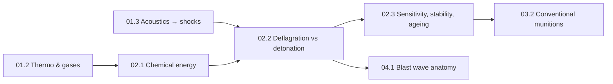

# Stage 2 · Chemistry & energetic materials (science only)

**Purpose.** Stage 1 gave you the physics of pressure waves; this stage explains where the energy
comes from and what controls how fast it is released. You will count chemical energy with
thermochemistry, compute flame temperatures and gas generation, use Arrhenius kinetics to see why
rate matters more than energy content, derive the Chapman–Jouguet detonation velocity from the
conservation laws, and then apply the same kinetics and statistics to the questions that dominate
explosive safety: sensitivity, thermal runaway, ageing and hazard classification.

Every worked number uses non-explosive textbook systems (methane, propane, hydrogen, glucose) or
explicitly **fictional** materials with invented properties. The mathematics is not simplified:
expect root finding, ODEs, a small PDE eigenvalue problem, maximum-likelihood estimation and Monte
Carlo simulation.

**Prerequisites.** [01.2 Gases & thermodynamics](lessons/stage-01/lesson-02.md) and
[01.3 Waves: from acoustics to shocks](lessons/stage-01/lesson-03.md).

## Lessons

| Lesson | Title | Time | Level | Core maths & tools |
|---|---|---|---|---|
| [02.1](lessons/stage-02/lesson-01.md) | Chemical energy: redox, thermochemistry, flame temperature, Arrhenius kinetics, energy vs power | 6 h | Intermediate | Hess's law, NASA polynomials, Brent root finding, Arrhenius |
| [02.2](lessons/stage-02/lesson-02.md) | Deflagration vs detonation: flames, DDT, Rayleigh line, Hugoniot, Chapman–Jouguet, ZND | 6 h | Intermediate | Rankine–Hugoniot with heat release, tangency condition, Sim I |
| [02.3](lessons/stage-02/lesson-03.md) | Sensitivity, stability, ageing & classification | 6 h | Intermediate | MLE & Bruceton statistics, Semenov / Frank-Kamenetskii, ageing kinetics |
| [Stage gate](assessments/stage-02.md) | Stage 2 assessment | 2–3 h | Intermediate | mixed problems + Sim I CJ mode |

Total ≈ 18 h plus the gate.

## Simulator

**Sim I — Shock-tube / Hugoniot & CJ explorer** (`sims/shock-tube/`), CJ mode, is used in 02.2 and in
the stage gate. The Python solvers you write in 02.1 (flame temperature), 02.2 (CJ and ZND) and
02.3 (Bruceton Monte Carlo, thermal runaway) are the other "simulators" of this stage.

**What this stage deliberately leaves out, and why.** This is chemistry *principles* only. There are
no explosive formulations, compositions, mixing ratios, precursors, synthesis or manufacture; no
named-explosive recipes; no discussion of how to make any material more powerful, more sensitive or
less sensitive; no oxygen-balance or performance optimisation of real materials; and no detonation
pressures or velocities for real explosives. Sensitivity tests are described by *what they measure*,
not how they are performed. Classification (UN Class 1 divisions, compatibility groups) and ageing
are taught as public safety science from the IATG and UN documents. The reason is simple: none of the
excluded information is needed to understand the physics, the hazards or the safety decisions, and
all of it could contribute to harm. Where a topic approaches this line, the lessons switch to
fictional materials or to the conceptual level.

## Stage gate

When you can do the lesson assessments without looking back, attempt the
[Stage 2 assessment](assessments/stage-02.md): six problems, a Sim I CJ-mode target and an
ageing-hazard explanation from first principles.
