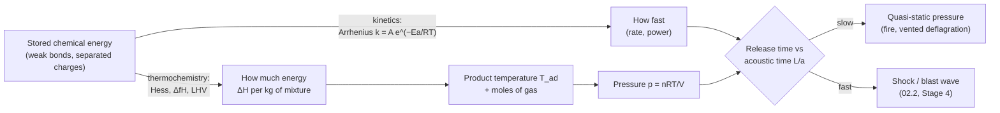

# 02.1 · Chemical energy: where the energy comes from, and how fast it comes out

<div class="module-card">

**Prerequisites** [01.1 Mechanics](lessons/stage-01/lesson-01.md) (energy, work, power) · [01.2 Gases & thermodynamics](lessons/stage-01/lesson-02.md) (first law, enthalpy, $c_p$, ideal gas) · school chemistry (moles, balancing equations).

**Estimated time** 6 h (3 h theory · 1 h worked examples · 2 h programming) · **Level** Intermediate

**Next** [02.2 Deflagration vs detonation](lessons/stage-02/lesson-02.md), then [02.3 Sensitivity, stability, ageing & classification](lessons/stage-02/lesson-03.md).

<p class="tags"><span>chemistry</span><span>thermochemistry</span><span>kinetics</span><span>root finding</span><span>Sim I (preview)</span></p>
</div>

## Why this matters

Every energetic event an EOD team deals with — a gas-main explosion, a burning ammunition
store, a legacy munition that functions decades late — is chemistry releasing stored energy.
Two questions decide how dangerous that release is: **how much** energy is stored (thermochemistry)
and **how fast** it comes out (kinetics). The surprising, safety-critical fact is that the second
matters far more than the first. A chocolate bar stores several times more energy per kilogram
than any military high explosive; the difference is that your body releases it over hours and a
detonation releases its energy in microseconds. The *rate* — power — is what makes pressure, and
pressure is what injures and destroys.

This lesson builds the quantitative tools: oxidation states to see where the energy lives, bond
and formation enthalpies with Hess's law to count it, gas-generation arithmetic to see why a
reaction produces pressure, an adiabatic-flame-temperature solver to see how hot the products get,
and the Arrhenius law to see why temperature controls rate so violently. Every worked number uses
ordinary fuels — methane, propane, hydrogen, glucose — or an explicitly fictional compound.

## Learning objectives

1. Assign oxidation states and identify the oxidiser, the fuel and the number of electrons
   transferred in a combustion reaction.
2. Compute reaction enthalpies from bond energies and from standard enthalpies of formation
   (Hess's law), and explain why the two differ.
3. Compute heats of combustion per mole, per kilogram of fuel and per kilogram of fuel–air mixture,
   and explain which one controls a hazard.
4. Compute gas generation (moles, volume at STP) and the pressure rise of a constant-volume reaction.
5. Write and run a root-finding solver for the adiabatic flame temperature of methane–air with
   temperature-dependent heat capacities.
6. Use the Arrhenius law to quantify how reaction rate depends on temperature and activation
   energy, and explain why a 10 K rise can double a rate.
7. Distinguish energy from power and use the distinction to rank hazards.

## Theory

### 1. Redox and oxidation states

A combustion reaction is an **oxidation–reduction (redox)** reaction: electrons move from a
*fuel* (reductant) to an *oxidiser*. Oxidation states are a bookkeeping device: assign each atom
the charge it would have if every bond were fully ionic (H is +1, O is −2 except in O₂ and
peroxides, elements are 0, and the states sum to the species' charge).

$$ \mathrm{CH_4 + 2\,O_2 \longrightarrow CO_2 + 2\,H_2O} $$

| Atom | Before | After | Change | Electrons per molecule of CH₄ |
|---|---|---|---|---|
| C | −4 (in CH₄) | +4 (in CO₂) | oxidised | 8 lost |
| H | +1 | +1 | — | 0 |
| O | 0 (in O₂) | −2 | reduced | 8 gained (4 O atoms × 2) |

<div class="callout chem">

**Intuition.** The energy is released because electrons end up in lower-energy orbitals — shared
unequally with oxygen, which holds them tightly. A useful empirical regularity: for most organic
fuels, burning releases roughly 100 kJ per mole of electrons transferred to oxygen (equivalently,
roughly 400–420 kJ per mole of O₂ consumed, *Thornton's rule*). Hydrogen is the outlier at about
120 kJ per mole of electrons. So the amount of oxygen a reaction can use is a good first
estimate of how much energy it can release.

</div>

**The oxidiser does not have to come from the air.** Ordinary fuels take oxygen from the
atmosphere, so a fire is limited by how fast air can be mixed in. The defining chemical feature of
the broad class of **energetic materials** (explosives, propellants, pyrotechnics) is that fuel and
oxidiser are either in the same molecule or in intimate contact, so the reaction needs nothing
from outside and is not limited by mixing. That single principle — not any particular molecule —
is what makes them capable of very fast reaction. How it is achieved in real materials is
deliberately outside this course.

<details class="answer"><summary>Exercise 1 — then reveal</summary>

Glucose burns (or is respired) as $\mathrm{C_6H_{12}O_6 + 6\,O_2 \to 6\,CO_2 + 6\,H_2O}$.
(a) What is the average oxidation state of carbon in glucose? (b) How many electrons move per
molecule? (c) Its enthalpy of combustion to gaseous water is −2539 kJ/mol. How many kJ per mole of
electrons is that, and per mole of O₂?

*Answer.* (a) 6C + 12(+1) + 6(−2) = 0 ⇒ C averages 0. (b) Each C goes 0 → +4: 24 electrons.
(c) 2539/24 ≈ 106 kJ per mol e⁻; 2539/6 ≈ 423 kJ per mol O₂ — consistent with the ~100 kJ/mol e⁻
rule. (Methane: 802.6/8 = 100.3; propane: 2043/20 = 102.2; hydrogen: 241.8/2 = 120.9.)

</details>

### 2. Bond energies: a first estimate

Breaking bonds costs energy; forming bonds releases it. With average bond enthalpies $D$:

$$ \Delta H_r \approx \sum_{\text{bonds broken}} D \;-\; \sum_{\text{bonds formed}} D . $$

| Symbol | Meaning | Unit |
|---|---|---|
| $\Delta H_r$ | reaction enthalpy (negative = exothermic) | kJ mol⁻¹ |
| $D$ | average bond enthalpy (gas phase) | kJ mol⁻¹ |

Typical averages: C–H 413, O=O 498, C=O (in CO₂) 799, O–H 463 kJ/mol.

**Numerical example (methane).** Broken: $4(413) + 2(498) = 2648$ kJ. Formed:
$2(799) + 4(463) = 3450$ kJ. $\Delta H_r \approx 2648 - 3450 = -802$ kJ/mol. The accurate value
(below) is −802.6 kJ/mol; the agreement here is partly luck — average bond energies are typically
good to ±5–10 %, because a bond's strength depends on its neighbours.

```python
BOND = {"C-H": 413, "O=O": 498, "C=O(CO2)": 799, "O-H": 463}   # kJ/mol, averages

def dH_bonds(broken: dict, formed: dict) -> float:
    """Reaction enthalpy estimate from average bond enthalpies [kJ/mol]."""
    return sum(n * BOND[b] for b, n in broken.items()) - sum(n * BOND[b] for b, n in formed.items())

print(dH_bonds({"C-H": 4, "O=O": 2}, {"C=O(CO2)": 2, "O-H": 4}))   # -802
```

<div class="callout key">

**Key idea.** Energy release comes from *weak bonds in, strong bonds out*. The O=O bond is
relatively weak and the C=O and O–H bonds are strong, which is why oxidation by O₂ is so
exothermic. Any fast energy release needs a similar mismatch.

</div>

### 3. Enthalpy of formation and Hess's law

The **standard enthalpy of formation** $\Delta_f H^\circ$ is the enthalpy change to make one mole
of a compound from its elements in their standard states (298.15 K, 1 bar); elements in their
standard states have $\Delta_f H^\circ = 0$. Because enthalpy is a state function (01.2), any
path between the same end states gives the same $\Delta H$ — **Hess's law** — so

$$ \Delta_r H^\circ = \sum_{\text{products}} \nu_i\,\Delta_f H_i^\circ \;-\; \sum_{\text{reactants}} \nu_j\,\Delta_f H_j^\circ . $$

| Symbol | Meaning | Unit |
|---|---|---|
| $\nu_i$ | stoichiometric coefficient | mol per mol reaction |
| $\Delta_f H^\circ_i$ | standard enthalpy of formation | kJ mol⁻¹ |

| Species (298.15 K) | $\Delta_f H^\circ$ [kJ/mol] | Molar mass [g/mol] |
|---|---|---|
| CH₄ (g) | −74.6 | 16.04 |
| C₃H₈ (g) | −104.7 | 44.10 |
| H₂ (g), O₂ (g), N₂ (g) | 0 | 2.016, 32.00, 28.01 |
| CO₂ (g) | −393.5 | 44.01 |
| H₂O (g) | −241.8 | 18.02 |
| H₂O (l) | −285.8 | 18.02 |

**Numerical example (methane).** $\Delta_c H^\circ = (-393.51) + 2(-241.82) - (-74.6) = -802.6$ kJ/mol
with gaseous water — the **lower heating value (LHV)**. With liquid water the condensation
enthalpy is recovered: $-802.6 + 2(-44.0) = -890.6$ kJ/mol, the **higher heating value (HHV)**.
In an explosion or fire the water leaves as vapour, so the LHV is the relevant number.

<div class="callout physics">

**Intuition.** Formation enthalpies place every compound on one energy "altitude map" with the
elements at sea level. CO₂ and H₂O sit in deep valleys; methane sits just below sea level.
Combustion rolls from a shallow valley to a deep one. Compounds with *positive* formation enthalpy
sit on hills — they release energy even when they merely fall apart into elements, which is one
reason (not the only one) why some compounds are unstable.

</div>

<details class="answer"><summary>Exercise 2 — Hess's law, then reveal</summary>

The formation enthalpy of CO cannot be measured directly (burning carbon always gives some CO₂).
Given $\mathrm{C + O_2 \to CO_2}$, $\Delta H = -393.5$ kJ/mol and
$\mathrm{CO + \tfrac12 O_2 \to CO_2}$, $\Delta H = -283.0$ kJ/mol, find $\Delta_f H^\circ(\mathrm{CO})$.

*Answer.* Subtract the second from the first: $\mathrm{C + \tfrac12 O_2 \to CO}$,
$\Delta H = -393.5 - (-283.0) = -110.5$ kJ/mol. Hess's law turns an impossible measurement into
two easy ones — the same idea as composing transforms in a graph where only some edges are
observable.

</details>

### 4. Heat of combustion: per mole, per kilogram, per kilogram of mixture

| Fuel | Reaction | LHV [kJ/mol] | LHV [MJ/kg fuel] | Stoich. fuel–air mixture [MJ/kg mixture] |
|---|---|---|---|---|
| Methane | CH₄ + 2 O₂ → CO₂ + 2 H₂O | 802.6 | 50.0 | 2.76 |
| Propane | C₃H₈ + 5 O₂ → 3 CO₂ + 4 H₂O | 2043 | 46.3 | 2.80 |
| Hydrogen | H₂ + ½ O₂ → H₂O | 241.8 | 120.0 | 3.42 |

"Air" is modelled as O₂ + 3.76 N₂ (by moles). The mixture column divides the LHV by the mass of
fuel *plus* the air needed to burn it: for methane, $16.04 + 2(32.00 + 3.76\times28.01) = 290.7$ g,
so $802.6/0.2907 = 2.76$ MJ/kg.

<div class="callout key">

**Key idea.** Per kilogram of *fuel*, hydrocarbons look enormous (≈ 50 MJ/kg). Per kilogram of
*reacting mixture* — which is what must be heated and pushed — every hydrocarbon–air mixture is
≈ 2.8 MJ/kg, because the energy is really a property of the oxygen consumed (Thornton's rule) and
air is only 23 % oxygen by mass. Nitrogen is dead weight that absorbs heat. This is why fuel–air
mixtures, although dilute, can still produce damaging pressures when a large volume of them
reacts.

</div>

```python
HF = {"CH4": -74.6, "C3H8": -104.7, "H2": 0.0, "CO2": -393.51, "H2O": -241.82}   # kJ/mol
MW = {"CH4": 16.043, "C3H8": 44.097, "H2": 2.016, "O2": 31.998, "N2": 28.014}

def lhv(fuel: str, nC: int, nH: int) -> dict:
    nO2 = nC + nH / 4
    dH = nC * HF["CO2"] + nH / 2 * HF["H2O"] - HF[fuel]          # kJ/mol fuel
    m_mix = MW[fuel] + nO2 * (MW["O2"] + 3.76 * MW["N2"])        # g per mol fuel
    return {"kJ/mol": -dH, "MJ/kg fuel": -dH / MW[fuel], "MJ/kg mix": -dH / m_mix}

print(lhv("CH4", 1, 4), lhv("C3H8", 3, 8), lhv("H2", 0, 2))
```

<details class="answer"><summary>Exercise 3 — then reveal</summary>

Compute the HHV of propane in MJ/kg, and the energy released per mole of O₂ consumed (LHV) for
all three fuels. Which fuel breaks Thornton's rule, and why might you expect it?

*Answer.* HHV = 2043.1 + 4(44.0) = 2219.2 kJ/mol ⇒ 50.3 MJ/kg. Per mol O₂: methane 401,
propane 409, hydrogen 484 kJ. Hydrogen breaks the rule: Thornton's rule reflects the roughly
constant energy of C–H and C–C bonds replaced by C=O and O–H bonds; H₂ has no carbon, and its
H–H bond (436 kJ/mol) plus the formation of two strong O–H bonds gives a different balance.

</details>

### 5. Gas generation

Pressure comes from gas. For an ideal gas $pV = nR_uT$, so the volume a reaction's products
occupy depends on (i) the number of moles of gas produced and (ii) their temperature.

$$ V_{\mathrm{STP}} = n\,V_m,\qquad V_m = \frac{R_u T_0}{p_0} = \frac{8.3145\times273.15}{101\,325} = 22.414\ \mathrm{L\,mol^{-1}}. $$

| Symbol | Meaning | SI unit |
|---|---|---|
| $n$ | moles of gas | mol |
| $R_u$ | universal gas constant, 8.3145 | J mol⁻¹ K⁻¹ |
| $T_0, p_0$ | STP: 273.15 K, 101 325 Pa | K, Pa |
| $V_m$ | molar volume at STP | m³ mol⁻¹ |

**Three cases, three lessons.**

1. **Methane–air**: $\mathrm{CH_4 + 2(O_2 + 3.76\,N_2) \to CO_2 + 2\,H_2O + 7.52\,N_2}$ —
   10.52 mol of gas in, 10.52 mol out. There is **no** net gas generation; all the pressure
   effect comes from *heating*. At constant pressure the products expand by the temperature
   ratio (≈ 2326/298 = 7.8, §6); in a closed volume the pressure rises by about the same factor.
2. **Glucose** (solid) burning in O₂: 6 mol of gas in, 12 mol out (water as vapour). Per kilogram of
   glucose (5.55 mol): 33.3 mol net new gas, i.e. 746 L at STP — before heating.
3. **Fictional compound X** (a solid; invented properties: molar mass 0.200 kg/mol, decomposes
   with no external oxygen into 5 mol of gas per mole, releasing 800 kJ/mol). Per kilogram: 25 mol
   of gas = 0.560 m³ at STP, and 4.0 MJ. If X had a density of 1500 kg/m³, one litre of solid
   would become ≈ 840 litres of gas at STP — and several thousand litres at the reaction
   temperature. A condensed material that turns into gas *without needing air* is the essence of
   the pressure hazard.

```python
R_U, T0, P0 = 8.314462618, 273.15, 101_325.0

def gas_volume_stp(n_mol: float) -> float:
    """Volume [m^3] of n moles of ideal gas at 0 degC, 1 atm."""
    return n_mol * R_U * T0 / P0

def const_volume_pressure_ratio(n_react: float, n_prod: float, T_react: float, T_prod: float) -> float:
    """p2/p1 for a closed rigid volume of ideal gas."""
    return (n_prod * T_prod) / (n_react * T_react)

print(gas_volume_stp(25.0))                                  # 0.560 m^3 (fictional X, per kg)
print(const_volume_pressure_ratio(10.52, 10.52, 298.15, 2818))   # ~9.45 (methane-air, see Sec. 6)
```

<details class="answer"><summary>Exercise 4 — then reveal</summary>

A sealed, rigid 1.0 m³ tank holds a stoichiometric hydrogen–air mixture at 1.0 bar, 298 K.
(a) How many moles of gas before and after complete reaction ($\mathrm{H_2 + \tfrac12 O_2 + 1.88\,N_2 \to H_2O + 1.88\,N_2}$)?
(b) If the products reached 3000 K (a rough constant-volume value), what is the final pressure?

*Answer.* (a) Before: $n = pV/(R_uT) = 10^5/(8.3145\times298) = 40.4$ mol, in the ratio
1 : 0.5 : 1.88 (3.38 parts). After: each 3.38 mol become 2.88 mol ⇒ 34.4 mol. Hydrogen combustion
*reduces* the mole count. (b) $p_2 = 1.0\times(34.4\times3000)/(40.4\times298) \approx 8.6$ bar.
The heating (×10) far outweighs the mole reduction (×0.85).

</details>

### 6. Adiabatic flame temperature

If a reaction happens with no heat loss at constant pressure, energy conservation (01.2) says
the products' enthalpy equals the reactants' enthalpy:

$$ \sum_{\text{prod}} n_i\,\bar h_i(T_{ad}) \;=\; \sum_{\text{react}} n_j\,\bar h_j(T_0),\qquad
\bar h_i(T) = \Delta_f H_i^\circ + \int_{298.15}^{T} \bar c_{p,i}(T')\,dT' . $$

At constant *volume* replace enthalpy by internal energy, $\bar u = \bar h - R_uT$.

| Symbol | Meaning | SI unit |
|---|---|---|
| $T_{ad}$ | adiabatic flame temperature | K |
| $\bar h_i(T)$ | absolute (formation + sensible) molar enthalpy | J mol⁻¹ |
| $\bar c_{p,i}(T)$ | molar heat capacity, temperature dependent | J mol⁻¹ K⁻¹ |
| $n_i$ | moles per mole of fuel | mol |

<div class="callout physics">

**Intuition.** The reaction's heat has to go somewhere; with no losses it all goes into warming
the products. Because $c_p$ rises with temperature (vibrational modes of CO₂ and H₂O switch on),
each extra kelvin costs more energy, and a constant-$c_p$ estimate using room-temperature values
badly *overestimates* $T_{ad}$. Real flames are cooler still because at > 2000 K some CO₂ and H₂O
dissociate, which absorbs energy.

</div>

**The heat-capacity model.** We use the standard NASA 7-coefficient polynomials, in which
$\bar c_p/R_u = a_1 + a_2T + a_3T^2 + a_4T^3 + a_5T^4$ and
$\bar h/(R_uT) = a_1 + a_2T/2 + a_3T^2/3 + a_4T^3/4 + a_5T^4/5 + a_6/T$, with separate coefficient
sets below and above 1000 K. (The coefficients below are the widely distributed GRI-Mech 3.0 / Cantera
set; the code checks itself: $\bar h(298.15)$ reproduces $\Delta_f H^\circ$ and both sets agree at
1000 K.)

**Solver.** Define $f(T) = H_{\text{prod}}(T) - H_{\text{react}}(T_0)$. It is monotonically
increasing (because $c_p>0$), so a bracketing root finder (Brent) is guaranteed to converge.

```python
import numpy as np
from scipy.optimize import brentq

R_U = 8.314462618
# NASA 7-coefficient polynomials: (low 300-1000 K, high 1000-5000 K)
NASA = {
 "N2": ([3.298677, 1.4082404e-3, -3.963222e-6, 5.641515e-9, -2.444854e-12, -1020.8999, 3.950372],
        [2.92664, 1.4879768e-3, -5.68476e-7, 1.0097038e-10, -6.753351e-15, -922.7977, 5.980528]),
 "O2": ([3.78245636, -2.99673416e-3, 9.84730201e-6, -9.68129509e-9, 3.24372837e-12, -1063.94356, 3.65767573],
        [3.28253784, 1.48308754e-3, -7.57966669e-7, 2.09470555e-10, -2.16717794e-14, -1088.45772, 5.45323129]),
 "CO2": ([2.35677352, 8.98459677e-3, -7.12356269e-6, 2.45919022e-9, -1.43699548e-13, -48371.9697, 9.90105222],
         [3.85746029, 4.41437026e-3, -2.21481404e-6, 5.23490188e-10, -4.72084164e-14, -48759.166, 2.27163806]),
 "H2O": ([4.19864056, -2.0364341e-3, 6.52040211e-6, -5.48797062e-9, 1.77197817e-12, -30293.7267, -0.849032208],
         [3.03399249, 2.17691804e-3, -1.64072518e-7, -9.7041987e-11, 1.68200992e-14, -30004.2971, 4.9667701]),
 "CH4": ([5.14987613, -1.36709788e-2, 4.91800599e-5, -4.84743026e-8, 1.66693956e-11, -10246.6476, -4.64130376],
         [7.4851495e-2, 1.33909467e-2, -5.73285809e-6, 1.22292535e-9, -1.0181523e-13, -9468.34459, 18.437318]),
}

def h_molar(sp: str, T: float) -> float:
    """Absolute molar enthalpy [J/mol] (formation + sensible)."""
    a = NASA[sp][0] if T < 1000 else NASA[sp][1]
    return R_U * T * (a[0] + a[1]*T/2 + a[2]*T**2/3 + a[3]*T**3/4 + a[4]*T**4/5 + a[5]/T)

def H_mix(mix: dict, T: float) -> float:
    return sum(n * h_molar(sp, T) for sp, n in mix.items())

def U_mix(mix: dict, T: float) -> float:
    return H_mix(mix, T) - sum(mix.values()) * R_U * T

def t_adiabatic(react: dict, prod: dict, T0: float = 298.15, const: str = "p") -> float:
    E = H_mix if const == "p" else U_mix
    target = E(react, T0)
    return brentq(lambda T: E(prod, T) - target, T0, 5000.0)

phi = 1.0                                         # equivalence ratio (fuel/air relative to stoichiometric)
react = {"CH4": 1, "O2": 2/phi, "N2": 7.52/phi}
prod  = {"CO2": 1, "H2O": 2, "N2": 7.52/phi, "O2": 2/phi - 2}
print(round(h_molar("H2O", 298.15)/1e3, 2))       # -241.82  (self-check)
print(t_adiabatic(react, prod, const="p"))        # ~2326 K
print(t_adiabatic(react, prod, const="v"))        # ~2818 K
```

**Results (checked).**

| Case | $T_{ad}$ | Comment |
|---|---|---|
| Constant-$c_p$ at 298 K values, $\phi=1$ | ≈ 2783 K | $802.6\,\text{kJ}/323\,\text{J K}^{-1}$ — too hot by ~450 K |
| NASA $c_p(T)$, constant $p$, $\phi=1$ | **2326 K** | "frozen" composition, no dissociation |
| Same, with chemical equilibrium (dissociation) | ≈ 2225 K | from an equilibrium code (e.g. Cantera, used by SDToolbox) |
| NASA $c_p(T)$, constant $p$, $\phi=0.8$ / 0.6 | 2015 / 1669 K | excess air is extra dead weight |
| NASA $c_p(T)$, constant $V$, $\phi=1$ | 2818 K, $p_2/p_1 = 9.45$ | no energy spent on expansion work |

The constant-volume case is hotter because at constant pressure part of the energy does $p\,dV$
work pushing the surroundings away. The ideal closed-vessel pressure ratio of ≈ 9.5 is an upper
bound; measured closed-vessel methane–air explosions peak lower (roughly 8 bar absolute) because of
dissociation and heat loss to the walls.

<details class="answer"><summary>Exercise 5 — then reveal</summary>

Modify the solver for stoichiometric hydrogen–air ($\mathrm{H_2 + 0.5\,O_2 + 1.88\,N_2}$). You need
$\bar h(\mathrm{H_2}) \approx 0$ at 298 K for the reactant side only. (a) What frozen $T_{ad}$ do you
get? (b) Why is it higher than methane's even though the energy per kg of mixture is only 24 %
higher?

*Answer.* (a) ≈ 2519 K (frozen; equilibrium codes give ≈ 2400 K). (b) Temperature depends on
energy per unit *heat capacity* of products, not per kg. Per mole of O₂ consumed hydrogen
releases 484 kJ vs 401 kJ for methane, and its products (H₂O + N₂) have a lower heat capacity per
unit energy released than CO₂ + 2H₂O + N₂.

</details>

### 7. Kinetics: the Arrhenius law

Thermodynamics tells you *how much*; kinetics tells you *how fast*. For an elementary or
effective one-step reaction, the rate constant follows the **Arrhenius law**

$$ k(T) = A\,\exp\!\left(-\frac{E_a}{R_uT}\right). $$

| Symbol | Meaning | SI unit |
|---|---|---|
| $k$ | rate constant (first order: fraction reacting per second) | s⁻¹ |
| $A$ | pre-exponential (frequency) factor | s⁻¹ |
| $E_a$ | activation energy | J mol⁻¹ |
| $R_u T$ | thermal energy scale per mole (2.48 kJ/mol at 298 K) | J mol⁻¹ |

<div class="callout chem">

**Intuition.** Molecules must pass over an energy barrier $E_a$ to react. The fraction of
collisions energetic enough to cross it is a Boltzmann factor $e^{-E_a/R_uT}$. When $E_a \gg R_uT$
(the usual case: 50–250 kJ/mol against 2.5 kJ/mol), this factor is tiny *and* extremely sensitive
to $T$. That is why a material can be stable for centuries at room temperature and react in
milliseconds when hot — both statements describe the same exponential.

</div>

**How strongly does rate depend on temperature?** Differentiate the logarithm:

$$ \frac{d\ln k}{dT} = \frac{E_a}{R_uT^2}\quad\Longrightarrow\quad
\frac{k(T_2)}{k(T_1)} = \exp\!\left[\frac{E_a}{R_u}\left(\frac1{T_1}-\frac1{T_2}\right)\right]. $$

**Why "10 K doubles the rate".** Setting the ratio to 2 for 298 → 308 K:
$E_a = R_u\ln 2 / (1/298.15 - 1/308.15) = 52.9$ kJ/mol. Many everyday reactions (food spoilage,
biological processes) have activation energies in this range, hence the chemist's rule of thumb.
It is only a rule of thumb:

| $E_a$ [kJ/mol] | ×rate for 298→308 K | ×rate for 1000→1010 K |
|---|---|---|
| 50 | 1.92 | 1.06 |
| 100 | 3.70 | 1.13 |
| 150 | 7.13 | 1.20 |

Higher activation energy ⇒ stronger temperature sensitivity; higher temperature ⇒ weaker
sensitivity per kelvin. (The linearised estimate $\exp(10E_a/R_uT^2)$ gives 7.6 for the 150 kJ/mol
case — close but not exact.)

**Numerical example (a fictional first-order decomposition, $A = 10^{13}$ s⁻¹,
$E_a = 150$ kJ/mol).** Half-life $t_{1/2} = \ln 2/k$:

| $T$ | $k$ [s⁻¹] | $t_{1/2}$ |
|---|---|---|
| 298 K | 5.3 × 10⁻¹⁴ | 1.3 × 10¹³ s ≈ 420 000 years |
| 400 K | 2.6 × 10⁻⁷ | 31 days |
| 500 K | 2.1 × 10⁻³ | 5.4 min |
| 600 K | 0.87 | 0.8 s |
| 1000 K | 1.5 × 10⁵ | 4.7 µs |

Seventeen orders of magnitude between room temperature and 1000 K. Stage 2 keeps coming back to
this table: in 02.2 a shock heats material into the bottom rows in nanoseconds (detonation), and in
02.3 slow self-heating walks a stored material down from the top rows (thermal runaway).

```python
def arrhenius(T, A=1e13, Ea=150e3):
    return A * np.exp(-Ea / (R_U * T))

def rate_ratio(Ea, T1, T2):
    return np.exp(Ea / R_U * (1/T1 - 1/T2))

print(R_U * np.log(2) / (1/298.15 - 1/308.15))   # 52.9e3 J/mol
for T in (298.15, 400, 500, 600, 1000):
    print(T, np.log(2) / arrhenius(T))            # half-lives in s
```

<details class="answer"><summary>Exercise 6 — then reveal</summary>

Two fictional materials both have a 10-year half-life at 25 °C. Material P has
$E_a = 60$ kJ/mol; material Q has $E_a = 160$ kJ/mol. Stored in a hot container at 55 °C, what is
each one's half-life? Which is the more dangerous to store in hot climates, and which gives more
warning in an accelerated-ageing test?

*Answer.* Ratio $=\exp[E_a/R_u(1/298.15-1/328.15)] = \exp(E_a\times3.686\times10^{-5})$:
P: $e^{2.21} = 9.1$ ⇒ 1.1 years; Q: $e^{5.90} = 364$ ⇒ 10 days. Q is far more temperature-sensitive:
harmless-looking at 25 °C, fast at 55 °C. Conversely, an accelerated test at elevated temperature
reveals Q's behaviour quickly, but extrapolating back to 25 °C requires knowing $E_a$ well — the
theme of 02.3.

</details>

### 8. Energy versus power

Power is energy per unit time, $P = E/\Delta t$, and **power per unit volume** is what creates
pressure faster than the surroundings can relieve it.

| System | Energy | Release time | Mean power |
|---|---|---|---|
| 50 g chocolate bar, metabolised (≈ 22 MJ/kg) | 1.1 MJ | ≈ 3 h | ≈ 100 W |
| Same bar burnt in a fire | 1.1 MJ | ≈ 60 s | ≈ 18 kW |
| 1 kg of fictional compound X (4 MJ/kg), reacting in 20 µs | 4.0 MJ | 2 × 10⁻⁵ s | 2 × 10¹¹ W |

Compound X carries about **one-sixth** of the chocolate's energy per kilogram — this is realistic:
the energy content of energetic materials is modest compared with fuels — but delivers it about
**two billion** times faster than your metabolism does. The difference is the *mechanism*
(02.2): metabolism is enzyme-limited, a fire is limited by oxygen mixing and heat transfer, a
deflagration by thermal conduction, and a detonation by nothing slower than a shock wave.

<div class="callout key">

**Key idea.** Hazard ∝ rate, not just energy. Time sets whether the surroundings can respond:
if energy is released faster than the gas can expand away (a time of order $L/a$, size over sound
speed — 01.3), pressure builds up locally and a shock is born. This is the thread that links
02.1 → 02.2 → Stage 4.

</div>

<details class="answer"><summary>Exercise 7 — then reveal</summary>

A 5 m × 4 m × 2.5 m room contains stoichiometric methane–air. (a) Using 2.76 MJ/kg of mixture and
air density 1.18 kg/m³, how much energy is available? (b) Compare the acoustic time of the room
($L/a_0$, with $L$ = 5 m) with a laminar-flame burn time (flame front ≈ 3 m/s in the laboratory
frame, 02.2). Is the room's pressure rise quasi-static or shock-like?

*Answer.* (a) 50 m³ × ≈ 1.18 kg/m³ ≈ 59 kg of mixture ⇒ ≈ 160 MJ. (b) $L/a_0 \approx 5/340 \approx 15$ ms;
flame time ≈ 5/3 ≈ 1.7 s. The pressure equalises across the room ≈ 100 times faster than the flame
crosses it, so the pressure rise is quasi-static (uniform, "pushing" loads that open windows and
move walls, 04.2). Only if the flame accelerates by orders of magnitude (turbulence, obstacles —
02.2) does the load become shock-like.

</details>

## Visual explanation



The energy diagram below is the Arrhenius picture in one image: the barrier $E_a$ controls the
rate; the drop $\Delta H$ controls the heat released. They are independent — a large $\Delta H$
says nothing about how fast the reaction goes.

<svg viewBox="0 0 560 250" xmlns="http://www.w3.org/2000/svg" role="img" aria-label="Reaction coordinate diagram">
  <line x1="50" y1="220" x2="530" y2="220" stroke="currentColor" stroke-width="1"/>
  <line x1="50" y1="220" x2="50" y2="20" stroke="currentColor" stroke-width="1"/>
  <text x="290" y="244" font-size="13" text-anchor="middle" fill="currentColor">reaction coordinate</text>
  <text x="20" y="120" font-size="13" fill="currentColor" transform="rotate(-90 20 120)">enthalpy</text>
  <path d="M60 110 L150 110 C 210 110, 220 40, 270 40 C 320 40, 330 190, 400 190 L520 190" fill="none" stroke="#c0392b" stroke-width="2.5"/>
  <text x="95" y="102" font-size="12" fill="currentColor">reactants</text>
  <text x="440" y="182" font-size="12" fill="currentColor">products</text>
  <line x1="160" y1="110" x2="160" y2="40" stroke="#2c7fb8" stroke-dasharray="4 3"/>
  <line x1="155" y1="40" x2="270" y2="40" stroke="#2c7fb8" stroke-dasharray="4 3"/>
  <text x="120" y="78" font-size="13" fill="#2c7fb8">Eₐ</text>
  <line x1="470" y1="110" x2="470" y2="190" stroke="#27ae60" stroke-dasharray="4 3"/>
  <line x1="150" y1="110" x2="470" y2="110" stroke="#27ae60" stroke-dasharray="2 4"/>
  <text x="478" y="155" font-size="13" fill="#27ae60">ΔH &lt; 0</text>
</svg>

## Worked example — a leaking propane cylinder in a garage (fictional)

A 3.0 kg propane leak disperses into a closed garage of 6 m × 4 m × 2.5 m (60 m³) at 20 °C,
1 atm. Is the atmosphere within the flammable range, how much energy is present, and what is the
worst-case pressure?

1. **Moles of propane.** $3.0/0.04410 = 68.0$ mol.
2. **Moles of gas in the room.** $n = pV/(R_uT) = 101\,325\times60/(8.3145\times293.15) = 2494$ mol.
   Mole fraction ≈ 68/2494 = 2.7 %. Propane's flammable range in air is roughly 2.1–9.5 % by
   volume, so a uniform mixture would be *inside* it (and real leaks are not uniform: propane is
   denser than air and pools near the floor, where the local concentration is higher).
3. **Energy.** $68.0 \times 2043$ kJ = 139 MJ, but only the propane that finds oxygen matters. The
   stoichiometric fraction for propane is $1/(1+5\times4.76) = 4.0$ %; at 2.7 % the mixture is
   lean ($\phi \approx 0.67$), so all the propane can burn.
4. **Worst case (ideal, closed, adiabatic).** Adapting the solver for propane at $\phi = 0.67$,
   $T_0 = 293$ K gives a frozen constant-volume temperature of 2234 K ⇒ $p_2/p_1 = 7.8$ (the
   reaction $\mathrm{C_3H_8 + 5\,O_2 \to 3\,CO_2 + 4\,H_2O}$ adds one mole of gas per mole of propane,
   so the mole count rises ≈ 3 %). A garage cannot hold 6.8 bar of overpressure; typical walls and doors fail at a few tenths of a bar,
   so the real event is a vented deflagration whose peak pressure is set by *when* the structure
   fails and *how fast* the flame burns (02.2, 04.2).
5. **What this tells a responder.** The dominant uncertainties are the concentration distribution
   and the ignition source, not the chemistry. That is why real procedures emphasise ventilation,
   isolation and eliminating ignition sources — the physics above explains why each of those
   removes one term from the chain energy → rate → pressure.

(Step 4 is a programming check. You do not need a heat-capacity polynomial for propane: it only
appears on the reactant side at $T_0$, where its enthalpy is its $\Delta_f H^\circ$ plus a negligible
sensible term. Expect 2234 K.)

## Simulation work

<div class="callout sim">

**Your own simulator.** The flame-temperature solver *is* the simulation for this lesson. (1) Sweep
$\phi$ from 0.5 to 1.0 for methane and plot $T_{ad}(\phi)$ at constant $p$ and constant $V$. (2) Plot
$\bar c_p$ of the product mixture against $T$ and explain the curvature of $T_{ad}(\phi)$. (3) Replace
the NASA $c_p(T)$ by a constant and quantify the error. Then open **Sim I** in CJ mode as a preview:
the "heat release $q$" slider is the per-kilogram LHV you computed here, which 02.2 turns into a
detonation velocity.

</div>

<a class="sim-link" href="sims/shock-tube/index.html" target="_blank">Open Sim I (shock tube / CJ explorer) full-screen ↗</a>

## Practical exercises

<details class="answer"><summary>Practical 1 — hazard ranking by the right metric</summary>

A site has three stores: (A) 500 kg of heating oil (43 MJ/kg) in a steel tank; (B) 50 kg of
propane cylinders; (C) a room that can accumulate hydrogen from battery charging. Rank them by
(i) total energy, (ii) potential for a *pressure* event, and justify the difference.

*Answer.* (i) A (21.5 GJ) ≫ B (2.3 GJ) ≫ C (small). (ii) The order roughly reverses. Oil has
very low vapour pressure: it can only burn as a pool fire, limited by evaporation and air
entrainment — large energy, low power density. Propane forms a premixed cloud in air, which can
deflagrate and, in congested spaces, accelerate. Hydrogen has a wide flammable range (≈ 4–75 %),
low ignition energy and fast flames (≈ 2 m/s laminar), making it the most prone to violent
pressure events per unit energy. Energy is the wrong metric on its own.

</details>

<details class="answer"><summary>Practical 2 — back out an activation energy from data</summary>

A (fictional) material loses mass by slow decomposition. Measured first-order rate constants:
$k = 1.2\times10^{-6}$ s⁻¹ at 380 K and $9.0\times10^{-6}$ s⁻¹ at 400 K. Find $E_a$ and $A$, then
predict $k$ at 300 K. How confident should you be in the 300 K prediction?

*Answer.* $E_a = R_u\ln(9.0/1.2)/(1/380-1/400) = 8.3145\times2.015/1.316\times10^{-4} = 127$ kJ/mol.
$A = k\,e^{E_a/R_uT} = 1.2\times10^{-6}\,e^{40.3} \approx 3.8\times10^{11}$ s⁻¹. At 300 K:
$k \approx 3.8\times10^{11}e^{-51.0} \approx 2.6\times10^{-11}$ s⁻¹ (half-life ≈ 850 years). Two points
fix a line exactly but give no uncertainty; extrapolating 80 K below the data amplifies any error
in $E_a$ (a 5 % error in $E_a$ changes the prediction by a factor ≈ $e^{2.55}$ ≈ 13), and the
mechanism may change at low temperature. Use more temperatures and a regression with confidence
intervals (02.3).

</details>

<details class="answer"><summary>Practical 3 — design a check</summary>

You are given a black-box function `heat_of_combustion(formula)` written by someone else. Design
three property-based tests that would catch common thermochemistry bugs.

*Answer (examples).* (1) Hess consistency: $\Delta_c H(\mathrm{C}) - \Delta_c H(\mathrm{CO}) =
\Delta_f H(\mathrm{CO})$ within tolerance. (2) HHV − LHV = (moles H₂O) × 44.0 kJ/mol exactly.
(3) Thornton band: for C/H/O organics, LHV per mol O₂ lies in 380–440 kJ; flag outliers.
(4) Element conservation of the balanced equation it uses. (5) Units: result per kg × molar mass
= result per mol.

</details>

## Programming exercise — a general frozen-flame-temperature calculator

- **Goal.** Generalise the §6 solver into a function that takes any C/H/O fuel with a given
  $\Delta_f H^\circ$, an equivalence ratio and a mode (constant $p$ or $V$), and returns $T_{ad}$,
  product composition and the pressure ratio.
- **Input.** `fuel = {"C": nC, "H": nH, "O": nO}`, `dHf_fuel` [J/mol], `phi` (0.3–1.0, lean only
  so products are CO₂, H₂O, N₂, O₂), `mode in {"p", "v"}`, `T0`.
- **Output.** `dict(T_ad, products, p_ratio, lhv_per_kg_fuel, lhv_per_kg_mix)`.
- **Constraints.** NumPy + SciPy only; the fuel's own heat capacity is only needed at $T_0$ (use
  $\Delta_f H^\circ$ on the reactant side); raise `ValueError` for $\phi > 1$ (rich combustion needs
  CO/H₂ in products — an extension); converge to 0.01 K.
- **Expected behaviour.** $T_{ad}$ increases monotonically with $\phi$ on the lean side; constant-$V$
  is always hotter than constant-$p$; the solver passes the self-checks in §6.
- **Test cases.** Methane $\phi=1$: 2326 ± 2 K (p), 2818 ± 2 K (v). Methane $\phi=0.8$: 2015 ± 2 K.
  Hydrogen $\phi=1$: 2519 ± 3 K. Glucose (solid, $\Delta_f H^\circ = -1273.3$ kJ/mol, needs
  6 O₂) in air at $\phi = 1$: 2191 ± 3 K — explain why it is close to methane's (Thornton again).
- **Extensions.** (1) Rich mixtures with the water–gas-shift equilibrium. (2) Full chemical
  equilibrium by Gibbs minimisation, and compare with Cantera; quantify the dissociation effect
  (≈ 100 K for methane). (3) Vectorise over $\phi$ and plot.

This code is reused in 02.2, where the energy release $q$ and product state feed the
Chapman–Jouguet calculation.

## Reading

- Akhavan, J., *The Chemistry of Explosives*, 4th ed., RSC (2022) — ch. on thermochemistry and
  kinetics for the energetic-materials view of what you learned here with methane (skip the
  manufacture chapter entirely; it is out of scope). https://books.rsc.org/books/monograph/944/The-Chemistry-of-Explosives
- Cooper, P. W., *Explosives Engineering*, Wiley-VCH (1996) — Part 2 (energetics/thermochemistry):
  heats of formation, Hess's law and product-gas estimation written for engineers.
  https://www.wiley-vch.de/en/areas-interest/engineering/explosives-engineering-978-0-471-18636-6
- Browne, Ziegler, Bitter, Schmidt, Lawson & Shepherd, *SDToolbox: Numerical Solution Methods for
  Shock and Detonation Jump Conditions*, Caltech GALCIT FM2018.001 (rev. 2023) — the thermodynamics
  sections show how Cantera evaluates the same NASA polynomials and equilibrium you coded; read it
  before 02.2. https://shepherd.caltech.edu/EDL/PublicResources/sdt/
- Zukas, J. A. & Walters, W. P. (eds.), *Explosive Effects and Applications*, Springer (1998) — the
  chemistry chapter for context on why energetic materials are *kinetically*, not energetically,
  special. https://link.springer.com/book/10.1007/978-1-4612-0589-0

Full bibliographic entries: [curriculum/sources.md](curriculum/sources.md).

## Assessment

1. *(Conceptual)* A student says "explosives are dangerous because they contain a lot of energy".
   Refute or refine this using two numbers from this lesson.
2. *(Mathematical)* Using formation enthalpies, compute the LHV of ethane
   ($\mathrm{C_2H_6}$, $\Delta_f H^\circ = -84.0$ kJ/mol) in MJ/kg and check it against Thornton's
   rule.
3. *(Interpretation)* Your flame-temperature code returns ≈ 2800 K for stoichiometric methane–air
   in constant-*pressure* mode. Name two bugs that would produce roughly this and a test that
   distinguishes them.
4. *(Mathematical)* For what activation energy does a rate *triple* between 20 °C and 30 °C?
5. *(Design)* You must decide whether a warehouse's summer temperature excursions (up to 45 °C)
   matter for a stored material whose decomposition you only know at 25 °C. What single parameter
   do you most need, and how would you measure it?

<details class="answer"><summary>Answers to 2, 3 and 4</summary>

2. $\mathrm{C_2H_6 + 3.5\,O_2 \to 2\,CO_2 + 3\,H_2O}$:
   $\Delta H = 2(-393.51) + 3(-241.82) + 84.0 = -1428.5$ kJ/mol ⇒ 1428.5/30.07 = 47.5 MJ/kg;
   per mol O₂: 1428.5/3.5 = 408 kJ — inside the Thornton band.
3. (i) Constant heat capacity frozen at 298 K values ⇒ 2783 K; (ii) the mode switch is inverted
   and the code balances internal energy (constant volume) ⇒ 2818 K. Distinguishing tests: assert
   that the product $\bar c_p$ at 2000 K matches a table (catches i); assert $T_{ad,V} > T_{ad,p}$ and
   that the two modes differ by ≈ 490 K (catches ii). Other bugs give different signatures:
   using HHV ⇒ 2523 K; forgetting the N₂ ⇒ ≈ 5150 K.
4. $E_a = R_u\ln3/(1/293.15-1/303.15) = 8.3145\times1.0986/1.1253\times10^{-4} = 81.2$ kJ/mol.

</details>

## Expert extension

- **Chemical equilibrium by Gibbs minimisation.** Minimise $G = \sum n_i(\mu_i^\circ + R_uT\ln(n_ip/n\,p^\circ))$
  subject to element conservation using Lagrange multipliers (the NASA CEA method). Include CO, H₂,
  OH, H, O, NO and reproduce the ≈ 2225 K equilibrium flame temperature.
- **Transition-state theory.** Derive the Eyring equation $k = \frac{k_BT}{h}e^{\Delta S^\ddagger/R}e^{-\Delta H^\ddagger/RT}$
  and show how it maps onto Arrhenius $A$ and $E_a$, including the weak $T$-dependence of $A$.
- **Multi-step kinetics.** Real combustion runs through hundreds of elementary radical reactions
  (GRI-Mech has 325 for methane). Chain branching makes the *overall* rate far steeper than any single
  Arrhenius step — the reason for explosion limits in H₂–O₂ (the "Z-shaped" $p$–$T$ explosion
  boundary). Read the explosion-limits discussion in any combustion text and connect it to
  02.3's thermal-runaway model.

## What comes next

[02.2](lessons/stage-02/lesson-02.md) turns the heat release $q$ you computed here into a moving
reaction front and asks how fast it can travel: a flame (deflagration) propagated by heat
conduction at < 1 m/s to tens of m/s, or a detonation propagated by a shock at km/s.
[02.3](lessons/stage-02/lesson-03.md) uses the Arrhenius law in slow motion — self-heating,
thermal runaway and ageing.
