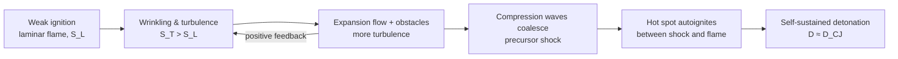
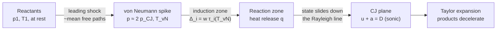

# 02.2 · Deflagration vs detonation: how a reaction front travels

<div class="module-card">

**Prerequisites** [02.1 Chemical energy](lessons/stage-02/lesson-01.md) (heat release, flame temperature, Arrhenius) · [01.3 Waves: from acoustics to shocks](lessons/stage-01/lesson-03.md) (Rankine–Hugoniot, shock Mach number) · [01.2 Gases & thermodynamics](lessons/stage-01/lesson-02.md).

**Estimated time** 6 h (3 h theory · 1 h simulator · 2 h programming) · **Level** Intermediate

**Next** [02.3 Sensitivity, stability, ageing & classification](lessons/stage-02/lesson-03.md), then [04.1 Anatomy of a blast wave](lessons/stage-04/lesson-01.md).

<p class="tags"><span>combustion</span><span>detonation physics</span><span>Rankine–Hugoniot</span><span>Chapman–Jouguet</span><span>ZND</span><span>Sim I</span></p>
</div>

## Why this matters

A reacting mixture can release its energy in two physically distinct ways. In a
**deflagration** the reaction front creeps forward because heat conducts (and radicals diffuse)
from the hot products into the cold reactants — the front moves at centimetres to tens of metres
per second, *subsonically*, and pressure has time to equalise. In a **detonation** the front is a
shock wave that heats the material so violently that it reacts within microseconds behind the
shock, and the energy released drives the shock onward — kilometres per second, *supersonic*,
with pressures tens of times ambient in gases.

For an EOD technician or post-blast investigator the distinction is practical: it separates a
gas-leak explosion that blew out windows from an event that shattered steel; it explains why
burning ammunition (a fire, HD 1.3-like behaviour) is a different hazard from a mass detonation
(HD 1.1, 02.3); and it is the physical origin of the blast wave in Stage 4. The mathematics is
the Rankine–Hugoniot analysis of 01.3 with one extra term — the chemical heat release $q$ from
02.1 — and it yields one of the most elegant results in continuum mechanics: the
**Chapman–Jouguet** velocity, computable on the back of an envelope for an ideal gas.

## Learning objectives

1. Contrast deflagration and detonation quantitatively (propagation mechanism, speed, pressure
   and density change across the front).
2. Derive the Mallard–Le Chatelier laminar flame speed scaling $S_L \sim \sqrt{\alpha/\tau_c}$ and
   use it with the Arrhenius law to predict how $S_L$ depends on flame temperature.
3. Explain turbulent flame acceleration and deflagration-to-detonation transition (DDT) as a
   positive-feedback loop, at the conceptual level.
4. Derive the Rayleigh line and the reactive Hugoniot, and show that the Chapman–Jouguet (CJ)
   state is their point of tangency.
5. Compute the CJ velocity, pressure and temperature for an ideal-gas mixture with heat release
   $q$, and critique the ideal model against equilibrium results for hydrogen–air.
6. Describe the ZND structure (von Neumann spike, induction zone, reaction zone) and explain why
   the Arrhenius sensitivity of the induction zone leads to cellular detonation fronts.
7. Explain from momentum conservation why detonation pressure scales as $\rho D^2$.

## Theory

### 1. Two propagation modes

| Property | Deflagration | Detonation |
|---|---|---|
| Mechanism | heat conduction + species diffusion (+ turbulence) | shock compression → autoignition |
| Front speed relative to reactants | subsonic: 0.1–100 m/s in gases | supersonic: ≈ 1.5–3 km/s in gases |
| Pressure across front | slight *drop* (≪ 1 %) | large *rise* (≈ 15–20× in gases) |
| Density across front | falls (products expand, ≈ 1/7) | rises (≈ 1.7–1.8×) |
| Controlled by | transport + kinetics | gas dynamics (thermodynamics fixes $D$) |
| Pressure loading of surroundings | quasi-static unless confined/accelerated | shock loading at the front |

<div class="callout key">

**Key idea.** In a deflagration the *chemistry and transport* set the speed and the gas
dynamics follows. In a detonation it is the other way round: the *conservation laws and the
heat release* set the speed (the CJ velocity), and the chemistry only sets the thickness of the
front. This is why detonation velocity can be predicted from thermodynamics alone.

</div>

### 2. Laminar flames: the Mallard–Le Chatelier thermal theory

Picture a steady, planar flame in its own frame. Unburnt gas flows in at the laminar burning
velocity $S_L$ at temperature $T_u$ and leaves as products at $T_b$ (≈ $T_{ad}$ from 02.1).
Mallard and Le Chatelier (1883) split the front into a **preheat zone**, where the gas is warmed
by conduction without reacting, and a **reaction zone** of thickness $\delta$, where it burns once
it reaches an ignition temperature $T_i$. Energy balance at the boundary between them: the heat
conducted back must raise the incoming mass flux from $T_u$ to $T_i$,

$$ \rho_u S_L c_p (T_i - T_u) \approx k\,\frac{T_b - T_i}{\delta}. $$

The reaction zone is as thick as the distance the gas travels during the chemical time,
$\delta \approx S_L\,\tau_c$. Eliminating $\delta$:

$$ S_L \approx \sqrt{\frac{\alpha}{\tau_c}\,\frac{T_b - T_i}{T_i - T_u}}\;\sim\;\sqrt{\frac{\alpha}{\tau_c}},\qquad
\delta \sim \frac{\alpha}{S_L},\qquad \alpha = \frac{k}{\rho_u c_p}. $$

| Symbol | Meaning | SI unit |
|---|---|---|
| $S_L$ | laminar burning velocity (front speed relative to unburnt gas) | m s⁻¹ |
| $\alpha$ | thermal diffusivity of the unburnt mixture | m² s⁻¹ |
| $k$, $c_p$, $\rho_u$ | conductivity, specific heat, unburnt density | W m⁻¹ K⁻¹, J kg⁻¹ K⁻¹, kg m⁻³ |
| $\tau_c$ | characteristic chemical (reaction) time | s |
| $\delta$ | flame thickness | m |
| $T_u, T_i, T_b$ | unburnt, "ignition", burnt temperatures | K |

<div class="callout physics">

**Intuition.** A flame is a diffusion–reaction wave, the same mathematics as a travelling front in
a Fisher–KPP equation: the speed is the geometric mean of a diffusivity and a rate,
$\sqrt{D\cdot r}$. Fast chemistry *or* fast heat conduction speeds the flame, but only as a
square root. The notion of a sharp "ignition temperature" is a simplification; the Zeldovich–
Frank-Kamenetskii theory replaces it with Arrhenius kinetics evaluated near $T_b$ and gives

$$ S_L \propto \sqrt{\alpha\,\omega(T_b)} \propto \exp\!\left(-\frac{E_a}{2R_uT_b}\right), $$

so the flame speed inherits *half* the activation energy in its exponent.

</div>

**Numerical example (methane–air, stoichiometric, 298 K, 1 atm).** Measured $S_L \approx 0.37$ m/s;
$\alpha \approx 2.2\times10^{-5}$ m²/s. Then $\delta \approx \alpha/S_L = 0.059$ mm and
$\tau_c \approx \alpha/S_L^2 = 0.16$ ms. (The "thermal" thickness defined from the maximum
temperature gradient is several times larger, ≈ 0.4–0.5 mm; the order of magnitude is what the
scaling gives.) Because the products expand by the density ratio $\sigma = \rho_u/\rho_b \approx
T_b/T_u \approx 7.8$ (02.1), a flame travelling from the closed end of a tube pushes the unburnt gas
ahead of it and is seen by a stationary observer to move at $\sigma S_L \approx 2.9$ m/s.
Hydrogen–air burns about five to six times faster ($S_L \approx 2$ m/s).

```python
import numpy as np
R_U = 8.314462618

def flame_scales(S_L: float, alpha: float) -> dict:
    """Mallard-Le Chatelier scalings: thickness and chemical time."""
    return {"delta_m": alpha / S_L, "tau_c_s": alpha / S_L**2}

def zeldovich_ratio(Ea: float, Tb1: float, Tb2: float) -> float:
    """S_L(Tb2)/S_L(Tb1) if S_L ~ exp(-Ea/(2 R Tb))."""
    return np.exp(-Ea / (2 * R_U) * (1 / Tb2 - 1 / Tb1))

print(flame_scales(0.37, 2.2e-5))            # ~5.9e-5 m, 1.6e-4 s
print(7.8 * 0.37)                            # lab-frame flame speed, closed tube end ~2.9 m/s
```

<details class="answer"><summary>Exercise 1 — infer an effective activation energy, then reveal</summary>

Measured laminar burning velocities for methane–air are ≈ 0.37 m/s at $\phi = 1$ and
≈ 0.26 m/s at $\phi = 0.8$. Using the frozen flame temperatures from 02.1 (2326 K and 2015 K) and
$S_L \propto e^{-E_a/2R_uT_b}$, estimate the effective activation energy. Why is this only an
"effective" number?

*Answer.* $E_a = 2R_u\ln(0.37/0.26)\,/\,(1/2015 - 1/2326) = 2(8.314)(0.353)/(6.64\times10^{-5})
\approx 88$ kJ/mol. It lumps hundreds of elementary steps, the change of $\alpha$ and of the
reactant concentrations with $\phi$, and uses frozen rather than equilibrium $T_b$ — it is a
fitted sensitivity, not a molecular barrier.

</details>

### 3. Turbulent flames and flame acceleration

Real flames are rarely laminar. Turbulent eddies wrinkle the front, increasing its area and hence
the burning rate per unit of projected area. For wrinkled flames Damköhler's classical argument
gives, for large-scale weak turbulence,

$$ \frac{S_T}{S_L} \approx 1 + \frac{u'}{S_L}\qquad\text{(and empirically }S_T/S_L \approx 1 + C\,(u'/S_L)^n,\ n\approx 0.5\text{–}1\text{)}, $$

where $u'$ is the RMS turbulent velocity fluctuation [m/s]. Example: $u' = 4$ m/s in methane–air
gives $S_T \approx 4.4$ m/s and, with expansion $\sigma \approx 7.8$, a visible front speed of ≈ 34 m/s.

This sets up a **positive feedback loop**: burning → expansion → flow ahead of the flame →
turbulence as the flow passes obstacles, pipework or congested equipment → faster burning →
faster flow. Each loop increases the flame speed and the strength of the pressure waves it emits.
This is why the same gas cloud produces a mild "whoosh" in open space and a damaging explosion in
a congested plant or a long pipe.

### 4. Deflagration-to-detonation transition (concept)

If flame acceleration continues, the compression waves sent ahead by the flame steepen (01.3) and
coalesce into a **precursor shock**. The gas between shock and flame is now preheated and
compressed. At some point a local pocket (often near a wall, an obstacle or the flame tip)
autoignites — an "explosion within the explosion" — and a detonation emerges that overtakes the
precursor shock. The **run-up distance** needed depends on the mixture's reactivity, the
confinement and the obstacles; it is highly variable and not predictable from first principles in
practice. Conceptually:



<div class="callout hazard">

**Hazard relevance.** A detonation can form without any "detonator" — through DDT — in
sufficiently reactive mixtures, confinement and length. Industrial safety uses the same
understanding in reverse: vent early, avoid congestion, break up long ducts, and use flame
arresters. For solid energetic materials a DDT-like process also exists in principle (burning in
a confined porous bed); that is part of why confinement and quantity matter in hazard
classification (02.3), and it is discussed there only as a concept.

</div>

### 5. The Rayleigh line and the Hugoniot curve

Treat any steady reacting front — flame or detonation — as a discontinuity moving at speed $D$
into still reactants (state 1), with products (state 2) behind. In the front's frame reactants
enter at $w_1 = D$, products leave at $w_2 = D - u_2$. Use specific volume $v = 1/\rho$. The
conservation laws of 01.3 still hold:

$$ \rho_1 w_1 = \rho_2 w_2 \equiv \dot m,\qquad p_1 + \dot m^2 v_1 = p_2 + \dot m^2 v_2,\qquad h_1 + \tfrac12 w_1^2 = h_2 + \tfrac12 w_2^2 . $$

**Rayleigh line** (mass + momentum):

$$ p_2 - p_1 = -\dot m^2\,(v_2 - v_1),\qquad \dot m = \rho_1 D . $$

**Reactive Hugoniot** (eliminate velocities with the Rayleigh line; the chemical energy $q$ is
released per unit mass, so $h_1$ includes it):

$$ h_2 - (h_1 + q) = \tfrac12\,(p_2 - p_1)(v_1 + v_2)
\quad\xrightarrow{\text{ideal gas, one }\gamma}\quad
\frac{\gamma}{\gamma-1}\,(p_2v_2 - p_1v_1) - \tfrac12(p_2 - p_1)(v_1 + v_2) = q . $$

| Symbol | Meaning | SI unit |
|---|---|---|
| $D$ | front (wave) speed relative to still reactants | m s⁻¹ |
| $\dot m$ | mass flux through the front | kg m⁻² s⁻¹ |
| $v = 1/\rho$ | specific volume | m³ kg⁻¹ |
| $q$ | chemical energy released per unit mass of mixture | J kg⁻¹ |
| $h = \frac{\gamma}{\gamma-1}pv$ | sensible specific enthalpy (ideal gas) | J kg⁻¹ |

<div class="callout physics">

**Intuition.** The Rayleigh line is a straight line through the initial state $(v_1, p_1)$ with
slope $-\dot m^2$: every product state reachable by a front of speed $D$ lies on it. The
Hugoniot is the set of states consistent with energy conservation *given* the heat release $q$.
The actual product state must satisfy both: it is an intersection. With $q = 0$ the Hugoniot
passes through the initial state and you recover 01.3's shock. With $q > 0$ the whole curve is
shifted up and to the right, away from the initial state.

</div>

The slope $-\dot m^2$ is always negative, so product states can only lie in two quadrants:
**compression** ($p_2 > p_1$, $v_2 < v_1$: detonation branch) or **expansion** ($p_2 < p_1$,
$v_2 > v_1$: deflagration branch). States with higher pressure *and* larger volume are
forbidden — they would need $\dot m^2 < 0$.

### 6. The Chapman–Jouguet condition

As $D$ increases from zero, the Rayleigh line on the detonation branch steepens. Below a certain
speed it misses the Hugoniot entirely — no steady solution. Above it, it cuts the Hugoniot twice
(the *strong* and *weak* detonation points). At exactly one speed it is **tangent**: this is the
**Chapman–Jouguet (CJ) point**, and a self-sustained, unsupported detonation runs at that speed.
The physical argument (Chapman 1899, Jouguet 1905; justified properly by ZND, §7) is that at the
CJ point the products move away from the front at exactly the local sound speed,
$w_2 = a_2$ ⇒ $D = u_2 + a_2$: no rarefaction from behind can overtake the front and weaken it,
and no extra support is needed.

**Derivation for an ideal gas with one $\gamma$.** Non-dimensionalise with $P = p_2/p_1$,
$x = v_2/v_1$, $y = 1 - x$ and $M = D/a_1$, $a_1^2 = \gamma p_1 v_1$. The Rayleigh line becomes
$P = 1 + \gamma M^2 y$. Substitute into the Hugoniot, using $Px - 1 = y(\gamma M^2 x - 1)$ and
collecting powers of $y$:

$$ (\gamma+1)M^2\,y^2 \;-\; 2\,(M^2 - 1)\,y \;+\; \frac{2(\gamma-1)\,q}{a_1^2} \;=\; 0 . $$

For $q = 0$ the roots are $y = 0$ (no wave) and $y = 2(M^2-1)/((\gamma+1)M^2)$ — exactly the
Rankine–Hugoniot density ratio of 01.3. For $q > 0$, the two intersections merge (tangency) when
the discriminant vanishes:

<div class="callout eq">

$$ (M^2 - 1)^2 = \frac{2(\gamma^2-1)\,q}{a_1^2}\,M^2
\quad\Longrightarrow\quad
M_{CJ} = \sqrt{\mathcal H + 1} + \sqrt{\mathcal H},\qquad \mathcal H \equiv \frac{(\gamma^2 - 1)\,q}{2\,a_1^2}. $$

$$ \frac{p_{CJ}}{p_1} = \frac{1 + \gamma M_{CJ}^2}{\gamma + 1},\qquad
\frac{\rho_{CJ}}{\rho_1} = \frac{(\gamma+1)M_{CJ}^2}{1 + \gamma M_{CJ}^2},\qquad
T_{CJ} = \frac{p_{CJ}}{\rho_{CJ}R},\qquad u_{CJ} = D\left(1 - \frac{\rho_1}{\rho_{CJ}}\right). $$

Strong-detonation limit ($\mathcal H \gg 1$): $D_{CJ} \approx \sqrt{2(\gamma^2-1)\,q}$ — independent
of the initial state.

</div>

| Symbol | Meaning | Unit |
|---|---|---|
| $M_{CJ}$ | CJ Mach number $D_{CJ}/a_1$ | — |
| $\mathcal H$ | dimensionless heat release | — |
| $a_1$ | sound speed of the reactants | m s⁻¹ |
| $R = R_u/W$ | specific gas constant of the mixture | J kg⁻¹ K⁻¹ |

**Numerical example — fictional ideal-gas mixture G.** Invented properties: $\gamma = 1.3$
(reactants and products), molar mass $W = 0.029$ kg/mol, $q = 2.0$ MJ/kg, initial state 300 K,
100 kPa.

| Step | Result |
|---|---|
| $R = 8.3145/0.029$; $a_1 = \sqrt{1.3\cdot286.7\cdot300}$; $\rho_1 = p_1/RT_1$ | 286.7 J/(kg K); 334.4 m/s; 1.163 kg/m³ |
| $\mathcal H = 0.69\times2.0\times10^6/(2\times334.4^2)$ | 6.171 |
| $M_{CJ} = \sqrt{7.171}+\sqrt{6.171}$ | 5.162 |
| $D_{CJ} = M_{CJ}a_1$ | **1726 m/s** |
| $p_{CJ}/p_1 = (1+1.3\cdot26.65)/2.3$ | 15.5 ⇒ 1.55 MPa |
| $\rho_{CJ}/\rho_1$ | 1.720 |
| $T_{CJ}$ | 2703 K |
| $u_{CJ}$, $a_{CJ}$; check $u_{CJ}+a_{CJ}$ | 722 m/s, 1004 m/s; sum = 1726 m/s ✓ (sonic) |
| Strong limit $\sqrt{2(\gamma^2-1)q}$ | 1661 m/s (4 % low) |

The sonic check is not built into the formulas — it *falls out* of the tangency condition, which
is the numerical proof that tangency and the sonic condition are the same statement.

```python
def cj_ideal(gamma: float, q: float, T1: float, p1: float, W: float) -> dict:
    """Chapman-Jouguet state for a one-gamma ideal gas with heat release q [J/kg]."""
    R = R_U / W
    a1 = np.sqrt(gamma * R * T1); rho1 = p1 / (R * T1)
    H = (gamma**2 - 1) * q / (2 * a1**2)
    M = np.sqrt(H + 1) + np.sqrt(H)
    D = M * a1
    p2 = p1 * (1 + gamma * M**2) / (gamma + 1)
    rho2 = rho1 * (gamma + 1) * M**2 / (1 + gamma * M**2)
    T2 = p2 / (rho2 * R); u2 = D * (1 - rho1 / rho2); a2 = np.sqrt(gamma * p2 / rho2)
    return dict(M=M, D=D, p=p2, rho=rho2, T=T2, u=u2, a=a2, sonic_residual=D - u2 - a2)

G = cj_ideal(1.3, 2.0e6, 300.0, 100e3, 0.029)
print({k: round(v, 3) for k, v in G.items()})   # D ~ 1726 m/s, p ~ 1.55e6 Pa, T ~ 2703 K

# Independent check: smallest D whose Rayleigh line touches the Hugoniot
from scipy.optimize import brentq
def touches(D, gamma=1.3, q=2.0e6, T1=300.0, p1=100e3, W=0.029):
    R = R_U / W; v1 = R * T1 / p1
    v = np.linspace((gamma - 1) / (gamma + 1) * v1 * 1.001, 0.999 * v1, 200_000)
    p_hug = (gamma/(gamma-1)*p1*v1 - 0.5*p1*(v1 + v) + q) / (gamma/(gamma-1)*v - 0.5*(v1 + v))
    p_ray = p1 - (D / v1)**2 * (v - v1)
    return np.max(p_ray - p_hug)          # >= 0 once the line reaches the curve
print(brentq(touches, 500, 5000))        # ~1726 m/s
```

<details class="answer"><summary>Exercise 2 — derive, then reveal</summary>

(a) Show that $p_{CJ} = (p_1 + \rho_1 D_{CJ}^2)/(\gamma+1)$ exactly. (b) Show that the von Neumann
spike pressure (the unreacted shock at $M_{CJ}$, §7) tends to twice $p_{CJ}$ in the strong limit.

*Answer.* (a) $p_{CJ} = p_1(1 + \gamma M^2)/(\gamma+1)$ and $\gamma p_1 M^2 = \rho_1 a_1^2 M^2 =
\rho_1 D^2$. (b) From 01.3, $p_{vN} = p_1[1 + \frac{2\gamma}{\gamma+1}(M^2-1)] \to \frac{2\gamma}{\gamma+1}p_1M^2$,
while $p_{CJ} \to \frac{\gamma}{\gamma+1}p_1M^2$; ratio → 2. For mixture G: $p_{vN} = 3.00$ MPa vs
$p_{CJ} = 1.55$ MPa, ratio 1.94.

</details>

**Honest comparison with a real gas: stoichiometric hydrogen–air** at 298 K, 1 atm (the kind of
check Shepherd's Caltech notes and the Shock & Detonation Toolbox are built for). Using the LHV
from 02.1 per kg of mixture ($q = 3.42$ MJ/kg), $W = 20.9$ g/mol and $\gamma = 1.4$:

| Quantity | One-$\gamma$ ideal model | Equilibrium calculation (SDToolbox-type, approx.) |
|---|---|---|
| $D_{CJ}$ | 2626 m/s | ≈ 1970 m/s |
| $p_{CJ}/p_1$ | 24.7 | ≈ 15.6 |
| $T_{CJ}$ | 4360 K | ≈ 2950 K |

The simple model is 33 % fast. The reasons are physical, not numerical: (i) at 3000+ K the
products **dissociate** (H₂O ⇌ OH + H, …), storing part of $q$ in chemical form, so the effective
heat release is smaller; (ii) hot H₂O has a much lower $\gamma$ (≈ 1.2) than cold reactants (1.4).
Shepherd's notes therefore use a *two-γ* model (separate $\gamma$, $W$ for reactants and products)
with an effective $q$ fitted to equilibrium results. The lesson for an engineer: the CJ *structure*
is exact, but the *inputs* need real thermochemistry.

<details class="answer"><summary>Exercise 3 — then reveal</summary>

Keep $\gamma = 1.4$ and find the effective fraction $f$ of the hydrogen–air LHV that reproduces
$D_{CJ} = 1968$ m/s. What CJ pressure ratio does the tuned model then predict, and what does
the discrepancy with ≈ 15.6 tell you?

*Answer.* $D \propto$ roughly $\sqrt q$ in the strong limit; solving numerically, $f \approx 0.54$,
giving $p_{CJ}/p_1 \approx 14.0$ and $T_{CJ} \approx 2515$ K. Matching $D$ with a single-γ model
does not match $p$ and $T$ simultaneously — one parameter cannot fix three observables. That is
exactly why the two-γ model, or full equilibrium, is used.

</details>

### 7. The ZND structure

Zeldovich, von Neumann and Döring (1940s, independently) resolved the front into a structure:

1. **Leading shock** — non-reactive, thickness of a few mean free paths. It compresses and heats
   the reactants to the **von Neumann (vN) spike** state, given by 01.3's Rankine–Hugoniot
   relations at $M = M_{CJ}$ with $q = 0$.
2. **Induction zone** — the shocked gas moves away from the shock at the post-shock velocity while
   radicals build up; little heat is released. Its length is $\Delta_i \approx w_{vN}\,\tau_i(T_{vN})$.
3. **Reaction zone** — heat release; the state slides down the Rayleigh line from the vN point to
   the CJ point, pressure falls, temperature rises, and the flow accelerates to sonic.
4. **Taylor expansion** — behind the CJ plane, an unsteady rarefaction that brings the products to
   rest (for a wave started at a closed end).

**Numerical example (mixture G).** At $M_{CJ} = 5.162$: $p_{vN} = 3.00$ MPa, $\rho_{vN}/\rho_1 = 6.13$,
$T_{vN} = 1467$ K; post-shock flow speed relative to the shock $w_{vN} = D\rho_1/\rho_{vN} = 281$ m/s.
Give G a fictional induction-time law $\tau_i = 5\times10^{-10}\,\text{s}\times e^{15\,000\,\text{K}/T}$:
$\tau_i(1467\,\text{K}) = 13.8$ µs ⇒ $\Delta_i \approx 281\times13.8\times10^{-6} = 3.9$ mm.

**Sensitivity.** If the local shock weakens so that $T_{vN}$ drops just 5 %, $\tau_i$ grows by
$e^{15000(1/1394 - 1/1467)} = 1.71$ — the induction zone becomes 71 % longer, heat is released
later, the shock weakens further… and conversely for a slightly stronger shock. This Arrhenius
amplification (02.1) makes the planar ZND front **unstable** in most gaseous mixtures.

```python
def vn_state(M, gamma=1.3):
    """Unreacted shock (von Neumann spike) ratios: reuse 01.3's Rankine-Hugoniot."""
    M2 = M * M
    pr = 1 + 2 * gamma / (gamma + 1) * (M2 - 1)
    rr = (gamma + 1) * M2 / ((gamma - 1) * M2 + 2)
    return pr, rr, pr / rr

pr, rr, Tr = vn_state(G["M"])
T_vN = 300.0 * Tr; w_vN = G["D"] / rr
tau_i = lambda T: 5e-10 * np.exp(15_000.0 / T)          # fictional induction law
print(pr * 100e3, T_vN, w_vN * tau_i(T_vN) * 1e3, "mm")  # ~3.0e6 Pa, ~1467 K, ~3.9 mm
```

### 8. Detonation cells (qualitative)

Real gaseous detonations are three-dimensional: the front is a mosaic of curved shock segments
(Mach stems and incident waves — 01.4's Mach reflection, again) joined at **triple points** that
sweep transversely. A thin soot-coated plate placed along a tube records the triple-point
trajectories as a fish-scale pattern of **cells** of width $\lambda$. Empirically $\lambda$ is
roughly 10–50 induction lengths, with large scatter. For stoichiometric mixtures at 1 atm, hydrogen–air
cells are about a centimetre wide and methane–air cells tens of centimetres — which is why methane
clouds are far harder to detonate: the geometric criteria for a detonation to survive (e.g. the
tube diameter below which it fails, of order ten cell widths) scale with $\lambda$. The cell width
is therefore the single most used *empirical* measure of a gas mixture's detonability in industrial
explosion safety.

### 9. Why detonation pressure scales with $\rho D^2$

The momentum equation across any steady front says the pressure jump equals the momentum flux
imparted: $p_2 - p_1 = \rho_1 D\,u_2$. The products are pushed forward at a velocity that is a fixed
fraction of $D$: for the ideal gas above, $u_{CJ} = D/(\gamma+1)$ in the strong limit. Hence

$$ p_{CJ} \approx \frac{\rho_1 D^2}{\gamma + 1}. $$

For mixture G: $\rho_1 D^2/(\gamma+1) = 1.163\times1726^2/2.3 = 1.51$ MPa vs the exact 1.55 MPa.

<div class="callout key">

**Conceptual only.** The same momentum argument applies to any detonating medium: the pressure
behind the front scales with the initial *density* times the *square* of the detonation speed,
divided by a factor that depends on how "stiff" the products are. Condensed-phase products are far
denser and far stiffer than an ideal gas and need empirical equations of state, so no ideal-gas
number carries over; the scaling is what matters here. It explains why a condensed detonation
produces pressures several orders of magnitude higher than a gaseous one (densities ~1000× higher,
speeds a few times higher), why detonation *shatters* adjacent materials while deflagration mostly
*pushes* them, and why the blast wave that detaches into the air (Stage 4) starts as a very strong shock.

</div>

<details class="answer"><summary>Exercise 4 — then reveal</summary>

Mixture G is pre-compressed to 5 atm at the same temperature. (a) What happens to $D_{CJ}$ in the
ideal model? (b) To $p_{CJ}$? (c) Why do real mixtures show a weak increase of $D$ with initial
pressure?

*Answer.* (a) Unchanged: $\mathcal H$ depends on $q$ and $a_1$ (i.e. $T_1$) only. (b) $p_{CJ}$
scales with $p_1$ (equivalently with $\rho_1$ at fixed $D$): ×5 ⇒ 7.75 MPa. (c) Higher pressure
suppresses dissociation (Le Chatelier's principle), so more of $q$ is released as heat by the CJ
plane — a real-gas effect the one-γ model does not contain.

</details>

## Visual explanation

<svg viewBox="0 0 600 340" xmlns="http://www.w3.org/2000/svg" role="img" aria-label="Hugoniot curves and CJ Rayleigh line for fictional mixture G in the p-v plane">
  <line x1="60" y1="300" x2="580" y2="300" stroke="currentColor"/>
  <line x1="60" y1="300" x2="60" y2="20" stroke="currentColor"/>
  <text x="500" y="325" font-size="13" fill="currentColor">v / v₁</text>
  <text x="20" y="30" font-size="13" fill="currentColor">p / p₁</text>
  <text x="222" y="316" font-size="11" fill="currentColor" text-anchor="middle">0.5</text>
  <text x="385" y="316" font-size="11" fill="currentColor" text-anchor="middle">1.0</text>
  <text x="547" y="316" font-size="11" fill="currentColor" text-anchor="middle">1.5</text>
  <text x="52" y="221" font-size="11" fill="currentColor" text-anchor="end">10</text>
  <text x="52" y="139" font-size="11" fill="currentColor" text-anchor="end">20</text>
  <text x="52" y="57" font-size="11" fill="currentColor" text-anchor="end">30</text>
  <path d="M 171 26 L 174 37 L 177 48 L 194 95 L 211 127 L 227 150 L 244 168 L 261 182 L 278 193 L 295 203 L 311 211 L 328 217 L 345 223 L 362 228 L 378 233 L 395 237 L 412 240 L 429 243 L 446 246 L 462 249 L 479 251 L 496 253 L 513 255 L 530 257 L 546 259 L 563 260 L 580 262" fill="none" stroke="#c0392b" stroke-width="2.5"/>
  <text x="420" y="232" font-size="12" fill="#c0392b">reactive Hugoniot (q = 2 MJ/kg)</text>
  <path d="M 114 80 L 117 121 L 120 149 L 122 170 L 125 185 L 128 198 L 131 208 L 133 216 L 136 223 L 139 228 L 141 233 L 144 238 L 147 242 L 149 245 L 152 248 L 155 251 L 158 253 L 160 256 L 163 258 L 166 259 L 168 261 L 171 263 L 174 264 L 177 266 L 194 272 L 211 277 L 227 280 L 244 283 L 261 284 L 278 286 L 295 287 L 311 288 L 328 289 L 345 290 L 362 291 L 378 292 L 395 292 L 412 293 L 429 293 L 446 293 L 462 294 L 479 294 L 496 294 L 513 295 L 530 295 L 546 295 L 563 295 L 580 296" fill="none" stroke="#7f8c8d" stroke-width="1.5" stroke-dasharray="5 4"/>
  <text x="420" y="285" font-size="11" fill="#7f8c8d">shock Hugoniot (q = 0)</text>
  <line x1="385" y1="292" x2="99" y2="41" stroke="#2c7fb8" stroke-width="2"/>
  <circle cx="385" cy="292" r="5" fill="currentColor"/>
  <text x="392" y="306" font-size="12" fill="currentColor">1</text>
  <circle cx="249" cy="172" r="6" fill="#2c7fb8"/>
  <text x="258" y="166" font-size="12" fill="#2c7fb8">CJ: p/p₁ = 15.5, v/v₁ = 0.58</text>
  <circle cx="113" cy="53" r="5" fill="#8e44ad"/>
  <text x="122" y="50" font-size="12" fill="#8e44ad">vN spike: p/p₁ = 30.0</text>
  <text x="300" y="250" font-size="11" fill="#2c7fb8" transform="rotate(-41 300 250)">Rayleigh line at D = 1726 m/s</text>
</svg>

Computed for mixture G (not a sketch). The ZND path runs: state 1 → (shock, along the Rayleigh
line) → vN spike on the *unreacted* Hugoniot → (reaction, down the same Rayleigh line) → CJ point,
where the line just touches the fully reacted Hugoniot. The deflagration branch ($p < p_1$) lies
off the right of the plot, at $v/v_1 \gg 1$.



Open **Sim I** in CJ mode: drag the wave Mach number $M = D/a_1$ and watch the Rayleigh line swing about state 1 until it
touches the reactive Hugoniot.

<iframe class="sim-frame" src="sims/shock-tube/index.html?embed=1" height="720" loading="lazy"></iframe>

<a class="sim-link" href="sims/shock-tube/index.html" target="_blank">Open Sim I full-screen ↗</a>

## Worked example — deflagration or detonation? (fictional investigation)

An empty, closed 3 m × 3 m × 2.5 m battery room (22.5 m³) is damaged. A hydrogen-concentration log
shows a well-mixed stoichiometric H₂–air atmosphere at the time of ignition. The door (failure at
≈ 20 kPa overpressure) was blown out, and the thin sheet-steel cabinets are bulged but not torn. Was
this a deflagration or a detonation?

1. **Ideal closed-volume deflagration ceiling.** From 02.1 (exercise 4), complete adiabatic
   combustion at constant volume would reach ≈ 8.6 bar. But the door fails at 0.2 bar overpressure,
   so the room vents long before that: the deflagration peak is governed by vent opening and flame
   speed, plausibly tens of kPa.
2. **Detonation expectations.** A CJ detonation in H₂–air gives $p_{CJ} \approx 15.6$ bar (≈ 1.5 MPa)
   with a vN spike ≈ 2× higher, and on reflection from a wall several times more still; the loading
   arrives as a shock with microsecond rise time, before any venting can act.
3. **Timescales.** Deflagration: expansion ratio $\sigma \approx (2.88/3.38)(2400/298) \approx 7$
   (mole decrease × temperature rise, 02.1), so the front moves at ≈ $\sigma S_L \approx 7\times2 \approx 14$ m/s ⇒ ≈ 0.2 s to cross
   3 m (faster with turbulence). Detonation: ≈ 2000 m/s ⇒ 1.5 ms, and the pressure rise at a point
   is essentially instantaneous.
4. **Discrimination.** Bulged-not-torn thin steel and an ejected door fit a vented, quasi-static
   deflagration load of order 10⁴–10⁵ Pa. A detonation at > 10⁶ Pa with shock loading would be
   expected to tear thin sheet metal and shatter brittle items near the walls. **Conclusion:**
   deflagration, possibly with some turbulent acceleration.
5. **Uncertainty.** Mixture non-uniformity, congestion inside the cabinets and partial DDT
   cannot be excluded from this evidence alone; the investigator would seek pressure-sensitive
   witness items at several locations and the pattern of damage direction (08.2).

## Simulation work

<div class="callout sim">

**Sim I, CJ mode** (fictional one-$\gamma$ gas with $\gamma$ fixed at 1.4; sliders are the
non-dimensional heat release $Q = q/(p_1v_1)$ and the wave Mach number $M = D/a_1$). (1) Compute $Q$
for mixture G from its $q$ and $p_1v_1 = RT_1$, predict $M_{CJ}$ with the closed form
$M_{CJ} = \sqrt{H+1}+\sqrt H$, $H = (\gamma^2-1)Q/(2\gamma)$, *before* reading the $M_{CJ}$ read-out,
then convert to $D_{CJ} = M_{CJ}a_1$. *Offline (Python):* repeat with $\gamma = 1.3$ and compare both
with 1726 m/s — how much of the gap is the sim's fixed $\gamma$? (2) Set $M$ above $M_{CJ}$: identify
the strong and weak intersection points and explain why the strong point needs a supporting piston
(overdriven detonation). (3) Set $Q \to 0$ and confirm the reactive Hugoniot collapses onto the
inert (01.3) shock Hugoniot. (4) Increase $Q$ tenfold: by what factor does $M_{CJ}$ grow, and how
does that compare with the $\sqrt q$ strong-limit prediction?

</div>

## Practical exercises

<details class="answer"><summary>Practical 1 — overdriven detonation</summary>

A piston drives into mixture G, supporting a detonation at $D = 2000$ m/s. Using the quadratic in
§6, find the two intersection states ($y$ values) and the corresponding pressures. Which one does a
piston-supported wave choose?

*Answer.* $M = 2000/334.4 = 5.981$; $(\gamma+1)M^2 = 82.28$; $2(M^2-1) = 69.54$;
$2(\gamma-1)q/a_1^2 = 10.73$. Roots $y = [69.55 \pm \sqrt{69.55^2 - 4(82.28)(10.73)}]/(2\cdot82.28)$
$= [69.55 \pm 36.1]/164.6$ ⇒ $y = 0.642$ (strong) or $0.203$ (weak). $P = 1 + 1.3\cdot35.77\,y$ ⇒
30.9 or 10.4 (×100 kPa). The piston-supported (overdriven) wave takes the **strong** point
(3.1 MPa); the weak branch is not reached by ordinary one-step chemistry because the ZND path
starts at the vN point ($y_{vN} = 69.55/82.28 = 0.845$) and descends the Rayleigh line, hitting the
strong intersection first.

</details>

<details class="answer"><summary>Practical 2 — reading a pressure record</summary>

Two fictional pressure gauges 1.00 m apart in a long pipe record fronts arriving 0.52 ms apart,
each with a sharp spike to ≈ 2× the following plateau. Ambient: 300 K, 100 kPa, mixture G.
Deflagration, CJ detonation or overdriven detonation? What would change your mind?

*Answer.* $D = 1.00/0.00052 = 1923$ m/s > 1726 m/s: ≈ 11 % above CJ. The spike-then-plateau
profile is the ZND signature of a detonation. Being above $D_{CJ}$ suggests an overdriven wave,
typical shortly after DDT, relaxing towards CJ with distance. Check with a third gauge: the speed
should decay to ≈ 1726 m/s. A timing error of ±0.05 ms (≈ ±10 %) would also explain the excess —
the time-of-arrival sensitivity lesson from 01.3.

</details>

<details class="answer"><summary>Practical 3 — design for safety</summary>

A (fictional) laboratory duct will occasionally carry a hydrogen-rich mixture. List three design
measures justified by this lesson's physics, and the physical mechanism each one attacks.

*Answer.* (1) Keep the duct diameter below the critical size for detonation propagation (scales
with cell width $\lambda$) or insert detonation arresters — attacks detonation survival. (2) Avoid
obstacles and sharp bends that generate turbulence — attacks the flame-acceleration feedback loop
and DDT run-up. (3) Dilute below the flammable limit or inert the gas (raise heat capacity, lower
$T_b$) — attacks $S_L \propto e^{-E_a/2RT_b}$ and the reaction itself. (4) Vent early — keeps the
deflagration quasi-static.

</details>

## Programming exercise — a Hugoniot, CJ and ZND explorer

- **Goal.** Build the numerical core of Sim I's CJ mode: compute and plot the shock Hugoniot, the
  reactive Hugoniot and Rayleigh lines for an ideal gas; find the CJ state two ways; integrate the
  steady ZND profile for a one-step Arrhenius reaction.
- **Input.** $\gamma$, $W$, $q$, $T_1$, $p_1$, and a one-step rate
  $\dot\lambda = k(1-\lambda)\,e^{-E_a/R_uT}$ with fictional $k$, $E_a$.
- **Output.** (i) $D_{CJ}$, $p_{CJ}$, $T_{CJ}$ closed-form and by tangency search; (ii) arrays
  $x, p(x), T(x), \lambda(x)$ through the ZND structure; (iii) a $p$–$v$ plot with the path.
- **Constraints.** NumPy/SciPy/matplotlib. For the ZND state at progress $\lambda$, use the
  quadratic of §6 with $q \to \lambda q$ and take the root that starts at the vN point:
  $y(\lambda) = \big[(M^2-1) + \sqrt{(M^2-1)^2 - 2(\gamma^2-1)M^2\lambda q/a_1^2}\big]/\big((\gamma+1)M^2\big)$,
  then $dx/d\lambda = w/\dot\lambda$. Stop at $\lambda = 1 - 10^{-6}$.
- **Expected behaviour.** Pressure starts at $p_{vN}$ and decays monotonically to $p_{CJ}$;
  temperature rises from $T_{vN}$ to $T_{CJ}$; the flow Mach number relative to the front reaches
  1 exactly at $\lambda = 1$ when $D = D_{CJ}$; for $D < D_{CJ}$ the square root becomes imaginary
  before $\lambda = 1$ (no steady solution).
- **Test cases.** Mixture G: $D_{CJ} = 1726.1 \pm 0.5$ m/s by both methods; $p_{vN} = 3.00$ MPa;
  $T_{vN} = 1467$ K; sonic residual < 10⁻⁶ m/s; $q = 0$ reproduces 01.3's `shock_jump`.
- **Extensions.** (1) Two-γ model (separate reactant/product $\gamma$ and $W$); fit $q_{\text{eff}}$
  to the hydrogen–air equilibrium $D_{CJ}$ and compare $p_{CJ}$. (2) Install the Shock & Detonation
  Toolbox (Cantera) and reproduce the H₂–air equilibrium CJ state with `demo_CJ.py`. (3) Make the
  induction length vs $D$ plot and discuss instability.

The CJ state is the physical initial condition of the blast source in
[Project P01](projects/p01-blast-wave/README.md).

## Reading

- Wintenberger, E. & Shepherd, J. E., *Detonation Waves and Pulse Detonation Engines*, Caltech Ae103
  slides (2004) — Hugoniot, Rayleigh line and CJ derived in a few pages; read first.
  https://shepherd.caltech.edu/EDL/projects/pde/Ae103-012704.pdf
- Browne, Ziegler, Bitter, Schmidt, Lawson & Shepherd, *SDToolbox* report GALCIT FM2018.001 (rev.
  2023) and software — sections on CJ and ZND; then run the CJ and ZND demos (gas phase only).
  https://shepherd.caltech.edu/EDL/PublicResources/sdt/
- Fickett, W. & Davis, W. C., *Detonation: Theory and Experiment*, Dover (2000) — ch. 2 (simple theory)
  and ch. 7 (structure and instability) for the rigorous version.
- Cooper, P. W., *Explosives Engineering*, Wiley-VCH (1996) — Part 4 (detonation) for how the same
  momentum argument is used for condensed media, at the conceptual level used here.
- Akhavan, J., *The Chemistry of Explosives*, 4th ed., RSC (2022) — chapter distinguishing
  combustion, deflagration and detonation (skip the manufacture chapter).

Full bibliographic entries: [curriculum/sources.md](curriculum/sources.md).

## Assessment

1. *(Conceptual)* Why is the detonation velocity determined by thermodynamics while the flame
   speed is determined by transport and kinetics?
2. *(Mathematical)* For mixture G, compute $D_{CJ}$ if $q$ is halved. Compare the ratio with the
   strong-limit prediction $\sqrt{1/2}$.
3. *(Interpretation)* A gauge trace shows a pressure rise over 40 ms to 0.3 bar. Another shows a
   rise within 5 µs to 30 bar followed by decay to 15 bar. Classify each and name the features.
4. *(Conceptual)* Why can no steady product state lie at higher pressure *and* higher specific
   volume than the reactants?
5. *(Design)* A process engineer proposes replacing a methane feed with hydrogen in the same
   congested plant. Using $S_L$, cell width and flammable range, argue the change in explosion
   hazard.

<details class="answer"><summary>Answers to 2 and 3</summary>

2. $q = 1.0$ MJ/kg: $\mathcal H = 3.086$, $M = \sqrt{4.086}+\sqrt{3.086} = 2.021 + 1.757 = 3.778$ ⇒
   $D = 1263$ m/s. Ratio 1263/1726 = 0.732 vs $\sqrt{0.5} = 0.707$ — close, but the weaker
   detonation is further from the strong limit.
3. First: vented or slow deflagration (ms rise, quasi-static, sub-bar). Second: detonation — a vN
   spike (≈ 2× plateau) at µs rise time, relaxing to the CJ/Taylor-wave pressure.

</details>

## Expert extension

- **Detonation stability.** Linear stability of the ZND wave depends on the effective activation
  energy $\theta = E_a/R_uT_{vN}$ and the heat release; for high $\theta$ the planar wave becomes
  galloping in 1D and cellular in 2D. Reproduce a 1D pulsating detonation with a reactive Euler
  solver (extend 01.3's finite-volume code with a source term; resolve ≥ 20 cells per induction
  length).
- **Curvature and failure.** Detonation velocity deficit with front curvature ($D$–$\kappa$
  relations) explains critical diameters; see Fickett & Davis ch. 5.
- **Explosion limits and chain branching.** The Z-shaped H₂–O₂ explosion limits show that "rate"
  in 02.1 is not a single Arrhenius law; connect branching ratios to induction time.

## What comes next

[02.3](lessons/stage-02/lesson-03.md) turns from *how* a reaction propagates to *whether* it
starts — sensitivity, thermal runaway and ageing — and to how these hazards are classified.
[04.1](lessons/stage-04/lesson-01.md) follows the shock after it leaves the reaction zone and
becomes a blast wave in air.
