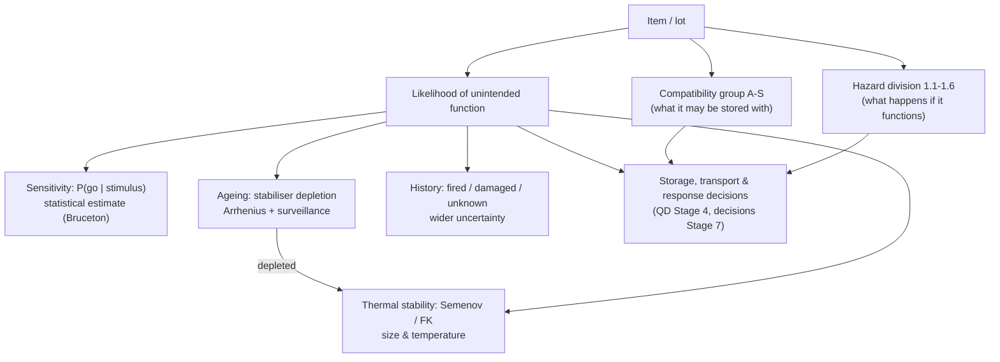

# 02.3 · Sensitivity, stability, ageing & classification

<div class="module-card">

**Prerequisites** [02.1 Chemical energy](lessons/stage-02/lesson-01.md) (Arrhenius kinetics) · [02.2 Deflagration vs detonation](lessons/stage-02/lesson-02.md) (propagation modes) · probability & statistics (likelihood, maximum-likelihood estimation) · ODEs.

**Estimated time** 6 h (2.5 h theory · 1.5 h worked examples · 2 h programming) · **Level** Intermediate

**Next** [03.1 Taxonomy of explosive hazards](lessons/stage-03/lesson-01.md), [03.2 Conventional munitions families](lessons/stage-03/lesson-02.md), then the [Stage 2 gate](assessments/stage-02.md).

<p class="tags"><span>hazard classification</span><span>IATG</span><span>statistics</span><span>thermal explosion</span><span>ageing kinetics</span><span>Monte Carlo</span></p>
</div>

## Why this matters

02.1 and 02.2 told you how much energy a reaction releases and how it propagates. This lesson
asks the questions that dominate day-to-day explosive safety: **how likely is it to start, what
happens if it does, and how do both change as a store sits for decades?** The answers are
organised by the international classification system (UN Class 1 hazard divisions and
compatibility groups, used verbatim in the IATG and national regulations), by *sensitivity*
testing, which is fundamentally a problem in statistical estimation, by *thermal explosion
theory*, which explains why a warm, large stack can ignite itself, and by *ageing kinetics*,
which explains why decades-old propellant and legacy ordnance are treated with such caution.

Every piece of this is quantitative and every piece is uncertain. The engineering skill you will
practise here is the one an ammunition technical officer or EOD team leader uses constantly:
reasoning with probabilities, extrapolations and worst cases, and knowing which of your numbers
you actually trust.

## Learning objectives

1. Explain the six UN Class 1 hazard divisions and the compatibility-group system, and reason
   about mixed storage as a constraint problem.
2. Explain what impact, friction, electrostatic-discharge and thermal sensitivity tests measure,
   and why their results are *probability distributions*, not thresholds.
3. Derive the Bruceton (up-and-down) estimators, simulate the method in Python on a fictional
   response curve, and quantify its bias, variance and — critically — its inability to say
   anything reliable about extreme tails.
4. Derive the Semenov critical condition for thermal explosion, compute a critical ambient
   temperature and simulate sub- and super-critical behaviour for a fictional material.
5. Explain the Frank-Kamenetskii parameter and compute how the critical temperature falls as a
   stored mass gets larger.
6. Model stabiliser depletion with Arrhenius kinetics, estimate a shelf life from accelerated
   ageing data, and explain the IATG surveillance concept.
7. Explain, from first principles, why old and fired-but-failed ordnance is more hazardous than
   new ordnance in storage.

## Theory

### 1. Decomposing "hazard"

Explosive-safety systems separate three questions that everyday language conflates:

| Question | Captured by | Physics behind it |
|---|---|---|
| *If* it functions, what happens to the surroundings? | **Hazard division** (1.1–1.6) | propagation mode (02.2), mass effects, fragments, fire |
| What may it be stored and transported *with*? | **Compatibility group** (A–L, N, S) | how one item's accident could initiate or aggravate another |
| How likely is it to function unintentionally, now and later? | sensitivity, stability, surveillance | hot spots, statistics, thermal runaway, ageing kinetics |

The combination is written as a **classification code**, division then group: e.g. "1.1D", "1.2E",
"1.4S". It is the risk engineer's factorisation $\text{risk} = P(\text{event}) \times
\text{consequence}$, with the compatibility group handling the interaction terms.

### 2. UN Class 1 hazard divisions

(Paraphrased from IATG 01.50 and the UN Model Regulations, Part 2, ch. 2.1.)

| Division | Hazard | Physical picture | Consequence for storage (conceptual) |
|---|---|---|---|
| **1.1** | Mass explosion hazard | essentially the whole load reacts virtually instantaneously (detonation-like, 02.2) | largest separation distances, blast-dominated (Stage 4) |
| **1.2** | Projection hazard, no mass explosion | items function individually or in small groups; fragments dominate | distances set by fragment range |
| **1.3** | Fire hazard, with minor blast and/or minor projection, no mass explosion | burning (deflagration), intense radiant heat, some thrown items | distances set by fire and radiant heat |
| **1.4** | No significant hazard | effects largely confined to the package; no appreciable fragments; external fire must not cause mass explosion | minimal special separation |
| **1.5** | Very insensitive substances *with* a mass explosion hazard | would behave like 1.1 if initiated, but very unlikely to be initiated or to transition from burning to detonation | treated like 1.1 for effects |
| **1.6** | Extremely insensitive articles, no mass explosion hazard | only extremely insensitive substances; negligible probability of accidental initiation or propagation | reduced hazard |

<div class="callout key">

**Key idea.** A division describes the *response of a quantity in its packaging*, not the
chemistry in the abstract. The same substance can be in different divisions depending on
quantity, packaging and configuration, because those control whether a local event propagates
(02.2: confinement, run-up, critical size). Divisions are assigned from standardised test series
in the UN *Manual of Tests and Criteria* — observing what a single package, a stack of packages and
a package in an external fire actually do.

</div>

**Mixed storage.** When items of different divisions are stored together, the combination is, as a
general principle, treated as the most hazardous division present (a small 1.1 quantity in a store
of 1.3 makes the store a 1.1 problem). The actual aggregation rules in IATG 02.20 and national
regulations contain exceptions; the principle is what matters here — **hazard does not average**.

<details class="answer"><summary>Exercise 1 — then reveal</summary>

A (fictional) store holds 10 t of 1.3 items, 5 t of 1.2 items and 200 kg of 1.1 items. The
separation distance for 1.1 scales as $d = Z\,W^{1/3}$ (01.5, Stage 4). Using the general principle,
what $W$ drives the 1.1 distance, and by what factor does moving the 200 kg out of the store change
that distance? Why might it still not be enough?

*Answer.* Treated as 1.1 for the whole net explosive quantity (in the conservative reading): 15.2 t.
Removing the 1.1 items leaves a 1.2/1.3 problem whose distances are governed by fragments and fire,
not by a 15.2 t blast. If the whole quantity were counted as 1.1, $d \propto (15\,200)^{1/3} = 24.8$
vs $(200)^{1/3} = 5.8$ for the 1.1 items alone — a factor 4.2. It may not be enough because 1.2
fragment distances can be large in their own right, and whether a fire in the 1.3 items could
involve the others (compatibility, §3) must also be considered.

</details>

### 3. Compatibility groups — a constraint-satisfaction problem

Compatibility groups describe *what kind of thing* an item is, so that items whose accidental
interaction would raise the probability or severity of an accident are kept apart.

| Group | Concept (paraphrased, IATG 01.50) |
|---|---|
| A | primary explosive substance |
| B | article containing a primary explosive, without two or more independent protective features |
| C | propellant or other deflagrating substance, or article containing it |
| D | secondary detonating substance, or article containing it, without means of initiation and without propelling charge (or with a primary explosive protected by ≥ 2 independent features) |
| E | article with secondary detonating substance, without means of initiation, *with* propelling charge |
| F | article with secondary detonating substance *with* its own means of initiation |
| G | pyrotechnic substance or article (illuminating, incendiary, smoke, etc.) |
| H | article containing both explosive and white phosphorus |
| J | article containing both explosive and flammable liquid or gel |
| K | article containing both explosive and a toxic chemical agent |
| L | article/substance presenting a special risk, requiring isolation of each type |
| N | article containing only extremely insensitive detonating substances |
| S | packaged or designed so that any accidental effects are confined within the package |

The "two or more independent protective features" in B and D is the same interlock idea you will
meet in 03.2 (safety-and-arming as a state machine): a design where two independent failures are
needed before a sensitive component can initiate the main charge is treated as a lower-probability
source than one that needs only one.

**The engineer's view.** A compatibility table is a symmetric Boolean relation on groups.
Allocating lots to the minimum number of separate stores so that no store contains an incompatible
pair is **graph colouring** on the incompatibility graph — NP-hard in general, trivial at the sizes
seen in practice. Real tables (IATG 01.50/02.20) also contain conditional entries ("compatible only
if …"), which become edge labels.

```python
import itertools, networkx as nx   # networkx for colouring; plain greedy is fine too

# ILLUSTRATIVE ONLY — fictional lots and a fictional incompatibility list, NOT the IATG table.
lots = ["L1", "L2", "L3", "L4", "L5", "L6"]
incompatible = {("L1", "L2"), ("L1", "L3"), ("L2", "L4"), ("L3", "L4"), ("L5", "L1"), ("L6", "L2")}

G = nx.Graph(); G.add_nodes_from(lots); G.add_edges_from(incompatible)
colouring = nx.coloring.greedy_color(G, strategy="largest_first")
stores = {}
for lot, c in colouring.items():
    stores.setdefault(c, []).append(lot)
print(stores)       # e.g. {0: ['L1', 'L4', 'L6'], 1: ['L2', 'L3', 'L5']} -> 2 stores
```

<details class="answer"><summary>Exercise 2 — then reveal</summary>

Add the constraint L4–L5 incompatible and L3–L6 incompatible. What is the minimum number of
stores now? Prove it is a minimum.

*Answer.* **Still two.** A graph needs only two colours if and only if it has no odd cycle
(it is bipartite). Attempt a 2-colouring by breadth-first search: L1 = A forces L2, L3, L5 = B;
L2 = B forces L4, L6 = A. Check every edge, including the new ones: L3–L4 (B–A), L4–L5 (A–B),
L3–L6 (B–A), L2–L4 (B–A), L2–L6 (B–A) — all proper. So {L1, L4, L6} and {L2, L3, L5} works, and two
is minimal because at least one incompatible pair exists. The added edges happened to close only
even cycles (e.g. L1–L3–L4–L5–L1). Lesson: test bipartiteness (`nx.is_bipartite`) before assuming
more stores are needed; a single new edge that closes an odd cycle (e.g. L1–L4) would force a third.

</details>

### 4. What sensitivity tests measure — and why the answer is a distribution

Sensitivity tests expose small samples to a controlled, graded stimulus and record *go* (any
reaction) or *no-go*. Conceptually:

| Test family | Stimulus graded by | Physical question |
|---|---|---|
| Impact | energy of a falling mass (drop height) | can mechanical compression and shear create hot spots fast enough? |
| Friction | normal load on a sliding contact | can frictional heating at asperities create hot spots? |
| Electrostatic discharge (ESD) | spark energy | can a spark deposit enough energy in a small volume? (links 01.7) |
| Thermal (slow/fast heating, cook-off) | temperature, heating rate, time | when does self-heating win over heat loss? (§6) |

The details of apparatus and procedure are standardised (UN Manual of Tests and Criteria) and are
not needed here. What matters is the physics: bulk heating by an impact is tiny; initiation happens
at **hot spots** — microscopic regions (collapsing voids, friction between grains, crystal defects)
where energy is concentrated enough for the local Arrhenius rate (02.1) to run away before heat
conducts away. Whether a hot spot of sufficient size and temperature forms in a given trial depends
on microstructure that varies from sample to sample. So the same stimulus sometimes gives *go* and
sometimes *no-go*: the response is a **probability curve** $P(\text{go}\mid x)$, and a "sensitivity"
number is a statistical estimate of one point on it (usually the median, $x_{50}$).

<div class="callout safety">

**Why this matters beyond the laboratory.** A reported $x_{50}$ says nothing by itself about the
stimulus at which the probability is one in a million — which is the number a safety case actually
needs. The rest of this section shows why that extrapolation is dominated by *modelling
assumptions*, not data.

</div>

### 5. The Bruceton (up-and-down) method as a statistics problem

**Model.** Let the stimulus be $x$ (here in fictional "stimulus units", SU). Assume a latent
threshold $X^* \sim F\big((x-\mu)/\sigma\big)$ for each specimen, so that
$P(\text{go}\mid x) = F\big((x-\mu)/\sigma\big)$ with $F$ a CDF — normal (probit) or logistic.

**Design (Dixon & Mood, 1948).** Choose equally spaced levels with step $d$. Test one specimen at
a time: after a *go*, step **down** one level; after a *no-go*, step **up** one level.

**Why this is clever.** The sequence of levels is a random walk that drifts towards the level
where $P(\text{go}) = 0.5$ and then oscillates around it. Almost all specimens are spent near the
median — exactly where the information about $\mu$ is concentrated. (It is a Markov chain on the
level grid; its stationary distribution is centred near $\mu$ with a width of a few $d$.)

**Maximum-likelihood estimator.** With observations $(x_k, y_k)$, $y_k\in\{0,1\}$:

$$ \ell(\mu,\sigma) = \sum_k \Big[\,y_k\ln F\!\big(\tfrac{x_k-\mu}{\sigma}\big) + (1-y_k)\ln\!\big(1-F\!\big(\tfrac{x_k-\mu}{\sigma}\big)\big)\Big],
\qquad (\hat\mu,\hat\sigma) = \arg\max \ell . $$

Note that the up-down *rule* does not enter the likelihood: because each next level depends only on
past observations, the design is ignorable and the ordinary binomial likelihood is correct.

**Dixon–Mood closed-form approximation.** Use only the *less frequent* outcome (say it occurs $N$
times). Number its levels $i = 0, 1, 2, \dots$ from the lowest level at which it occurred ($y_0$),
let $n_i$ be the count at level $i$, and

$$ N = \sum n_i,\quad A = \sum i\,n_i,\quad B = \sum i^2 n_i, $$

$$ \hat\mu = y_0 + d\left(\frac{A}{N} \pm \frac12\right)\quad(+\text{ if using no-go's, } -\text{ if using go's}),\qquad
\hat\sigma = 1.620\,d\left(\frac{NB - A^2}{N^2} + 0.029\right)\quad\text{valid if } \frac{NB-A^2}{N^2} > 0.3 . $$

| Symbol | Meaning | Unit |
|---|---|---|
| $\mu$, $\sigma$ | location (median threshold) and scale of the response curve | SU |
| $d$ | step between levels (best between ≈ 0.5σ and 2σ) | SU |
| $y_0$ | lowest level at which the analysed outcome occurred | SU |
| $n_i$ | count of the analysed outcome at level $y_0 + i\,d$ | — |

**Deriving the ±½.** Because the walk moves down after every go and up after every no-go, the
sequence pairs up: (almost) every no-go at level $L$ is followed by a trial at $L+d$, and every go at
level $L+d$ is followed by a trial at $L$. Over a long sequence the go's therefore sit on average
half a step *above* the centre of the oscillation, and the no-go's half a step *below*. The centre
of the oscillation estimates $\mu$, so $\hat\mu = \overline{x}_{\text{no-go}} + d/2 =
\overline{x}_{\text{go}} - d/2$. With $\overline{x} = y_0 + d\,A/N$ this is the formula. The
$\hat\sigma$ expression is not derived this way: its constants 1.620 and 0.029 are Dixon and Mood's
numerical approximation to the normal-model MLE, which is why it has a validity condition.

**Numerical example (fictional).** A 30-trial sequence, $d = 1$ SU, start at 12 SU, on a fictional
material whose true response is logistic with $\mu = 10$ SU, scale $s = 1$ SU (standard deviation
$s\pi/\sqrt3 = 1.81$ SU):

| Level [SU] | go | no-go |
|---|---|---|
| 12 | 4 | 0 |
| 11 | 6 | 3 |
| 10 | 6 | 5 |
| 9 | 0 | 6 |
| **total** | 16 | **14** |

No-go's are less frequent ⇒ analyse them. $y_0 = 9$; $n = (6, 5, 3)$ at $i = (0,1,2)$;
$N = 14$, $A = 0 + 5 + 6 = 11$, $B = 0 + 5 + 12 = 17$.
$\hat\mu = 9 + (11/14 + 0.5) = 10.29$ SU. $(NB-A^2)/N^2 = (238-121)/196 = 0.597 > 0.3$ ✓, so
$\hat\sigma = 1.620(0.597 + 0.029) = 1.01$ SU. The full logistic MLE on the same 30 points gives
$\hat\mu = 10.23$ SU, $\hat s = 0.59$ SU (s.d. 1.08 SU).

```python
import numpy as np
from scipy.optimize import minimize

MU, S = 10.0, 1.0                     # fictional truth: logistic, stimulus units (SU)

def p_go(x):
    return 1.0 / (1.0 + np.exp(-(x - MU) / S))

def up_down(n, x0, d, rng):
    x, xs, ys = x0, [], []
    for _ in range(n):
        y = rng.random() < p_go(x)
        xs.append(x); ys.append(y)
        x = x - d if y else x + d
    return np.array(xs), np.array(ys)

def dixon_mood(xs, ys, d):
    use_go = ys.sum() <= (~ys).sum()
    lv = xs[ys] if use_go else xs[~ys]
    i = np.round((lv - lv.min()) / d).astype(int)
    N, A, B = len(i), i.sum(), (i**2).sum()
    mu = lv.min() + d * (A / N + (-0.5 if use_go else 0.5))
    M = (N * B - A**2) / N**2
    return mu, 1.620 * d * (M + 0.029), M

def mle_logistic(xs, ys):
    def nll(th):
        m, log_s = th
        p = np.clip(1 / (1 + np.exp(-(xs - m) / np.exp(log_s))), 1e-12, 1 - 1e-12)
        return -np.sum(ys * np.log(p) + (1 - ys) * np.log(1 - p))
    r = minimize(nll, [xs.mean(), 0.0], method="Nelder-Mead")
    return r.x[0], np.exp(r.x[1])

xs, ys = up_down(30, 12.0, 1.0, np.random.default_rng(7))
print(dixon_mood(xs, ys, 1.0), mle_logistic(xs, ys.astype(float)))

# Monte Carlo: sampling distribution of the estimators
rng = np.random.default_rng(1)
est = np.array([dixon_mood(*up_down(30, 12.0, 1.0, rng), 1.0)[:2] for _ in range(4000)])
print(est.mean(axis=0), est.std(axis=0))     # mu ~ 10.09 +/- 0.42 ; sigma ~ 1.49 +/- 0.67
```

**What the Monte Carlo shows (4000 repetitions of 30 trials).**

| Estimator | Mean | Std. dev. | Truth |
|---|---|---|---|
| $\hat\mu$ | 10.09 SU | 0.42 SU | 10.00 SU |
| $\hat\sigma$ | 1.49 SU | 0.67 SU | 1.81 SU (s.d. of the logistic) |

The median is estimated well (bias ≈ 1 % of the level, ±0.4 SU). The spread is estimated badly:
biased low and with a coefficient of variation of ≈ 45 % from 30 trials. The up-down design
deliberately spends its budget near the median, so it knows little about the slope.

**The tail problem.** Suppose you need the stimulus for $P(\text{go}) = 10^{-6}$. Take a logistic and
a normal model with *identical* mean (10 SU) and standard deviation (1.81 SU) — models that no
30-trial data set could distinguish:

| Model | $x$ at $P = 10^{-6}$ |
|---|---|
| Logistic | $10 + 1\times\ln(10^{-6}/(1-10^{-6})) = -3.8$ SU |
| Normal | $10 + 1.81\,\Phi^{-1}(10^{-6}) = 1.4$ SU |

A 5.2 SU disagreement — almost three standard deviations — produced entirely by the assumed shape
of a tail that was never observed. Safety cases therefore rely on *margins*, *physical arguments*
and *separate tests at low stimulus*, not on extrapolating an $x_{50}$.

<details class="answer"><summary>Exercise 3 — then reveal</summary>

(a) Recompute $\hat\mu$ for the example using the *go's* instead of the no-go's. (b) The Monte Carlo
shows $\hat\mu$ unbiased to 1 % but $\hat\sigma$ badly biased. Explain in terms of where the trials are
placed, and propose a design change that improves $\hat\sigma$.

*Answer.* (a) Go levels: 10 (6), 11 (6), 12 (4): $y_0 = 10$, $N = 16$, $A = 0 + 6 + 8 = 14$,
$\hat\mu = 10 + (14/16 - 0.5) = 10.375$ SU — close to 10.29; the difference is sampling noise and
the discreteness of the start. (b) Information about $\sigma$ comes from trials where $P$ is
neither ≈ 0.5 nor ≈ 0 or 1 — roughly $P \in [0.1, 0.3] \cup [0.7, 0.9]$. The up-down walk rarely
visits those levels. Use a larger $d$, a two-stage design (up-down for $\mu$, then trials at
$\hat\mu \pm 1.5\hat\sigma$), or an adaptive optimal design that places each trial to maximise the
expected Fisher information on $\sigma$ (the idea behind Neyer-type designs).

</details>

### 6. Thermal explosion theory

**Semenov (well-stirred) model.** A mass of reactive material at uniform temperature $T$ in a
container at ambient $T_a$. Heat is generated by a zero-order Arrhenius reaction and lost through the
surface (Newton cooling):

$$ \underbrace{\rho V c\,\frac{dT}{dt}}_{\text{storage}} \;=\; \underbrace{\rho V Q A\,e^{-E/R_uT}}_{G(T)} \;-\; \underbrace{hS\,(T - T_a)}_{L(T)} . $$

| Symbol | Meaning | SI unit |
|---|---|---|
| $\rho, V, c$ | density, volume, specific heat | kg m⁻³, m³, J kg⁻¹ K⁻¹ |
| $Q$ | heat of reaction per unit mass | J kg⁻¹ |
| $A, E$ | Arrhenius pre-factor, activation energy | s⁻¹, J mol⁻¹ |
| $h, S$ | surface heat-transfer coefficient, surface area | W m⁻² K⁻¹, m² |
| $T_a$ | ambient temperature | K |

<div class="callout physics">

**Intuition.** $G(T)$ is an exponential; $L(T)$ is a straight line whose position slides with $T_a$.
If the line cuts the curve, the lower intersection is a stable steady state: the material sits a few
kelvin above ambient forever. As $T_a$ rises the line slides right until it only *touches* the curve.
One kelvin more and there is no intersection: generation exceeds loss at every temperature and $T$
runs away. The transition is abrupt — a *bifurcation* (saddle-node), not a gradual worsening.

</div>

**Critical condition.** Tangency means $G = L$ and $G' = L'$. Dividing: $\frac{R_uT^2}{E} = T - T_a$, so
the tangency temperature exceeds ambient by $\Delta T_c \approx R_uT_a^2/E$ (for $E \gg R_uT_a$).
Substituting $e^{-E/R_uT} \approx e^{-E/R_uT_a}\,e^{\,E\Delta T/R_uT_a^2} = e^{-E/R_uT_a}\cdot e$
into $G = L$ gives the **Semenov number** criterion

$$ \psi \equiv \frac{\rho V Q A E}{hS\,R_uT_a^2}\,e^{-E/R_uT_a} \;=\; \frac1e \quad\text{at criticality.} $$

**Numerical example — fictional material Y.** Invented properties: $\rho = 1200$ kg/m³,
$Q = 1.0$ MJ/kg, $A = 10^{12}$ s⁻¹, $E = 120$ kJ/mol, $c = 1500$ J/(kg K); 1-litre container
($V = 10^{-3}$ m³, $S = 0.06$ m², $h = 10$ W/(m² K)).

| Quantity | Value |
|---|---|
| $T_{a,c}$ from $\psi = 1/e$ | **352.1 K (79.0 °C)** (exact tangency: 352.3 K) |
| $\Delta T_c = R_uT_a^2/E$ | 8.6 K (exact ≈ 9 K) |
| $T_a = T_{a,c} - 3$ K | settles ≈ 3.3 K above ambient — stable |
| $T_a = T_{a,c} + 3$ K | reaches $T_a + 100$ K after ≈ 4.1 h — runaway |
| cooling time constant $\rho V c/(hS)$ | 0.83 h |

The runaway takes hours, not seconds: thermal explosion in storage is slow *until the last few
minutes*, which is why temperature monitoring and early action are effective.

```python
from scipy.integrate import solve_ivp
from scipy.optimize import brentq
R_U = 8.314462618
rho, Q, A, E, V, S_, h, c = 1200., 1.0e6, 1e12, 120e3, 1e-3, 0.06, 10., 1500.   # fictional Y

gen  = lambda T: rho * V * Q * A * np.exp(-E / (R_U * T))       # W
loss = lambda T, Ta: h * S_ * (T - Ta)                            # W
psi  = lambda Ta: rho * V * Q * A * E * np.exp(-E / (R_U * Ta)) / (h * S_ * R_U * Ta**2)

Ta_c = brentq(lambda Ta: psi(Ta) - np.exp(-1), 250, 600)
print(Ta_c, Ta_c - 273.15)                                        # 352.1 K, 79.0 C

for Ta in (Ta_c - 3, Ta_c + 3):
    rhs = lambda t, T: [(gen(T[0]) - loss(T[0], Ta)) / (rho * V * c)]
    runaway = lambda t, T: T[0] - (Ta + 100); runaway.terminal = True
    sol = solve_ivp(rhs, [0, 30 * 86400], [Ta], events=runaway, max_step=600, rtol=1e-8)
    print(f"Ta={Ta:.1f} K: final T-Ta={sol.y[0, -1] - Ta:.1f} K after {sol.t[-1] / 3600:.1f} h")
```

**Frank-Kamenetskii (conduction-limited) model.** In a large mass or a poor conductor, the
temperature is not uniform: the centre is hottest and heat must conduct out. Steady state:

$$ k\nabla^2T + \rho QA\,e^{-E/R_uT} = 0,\qquad T = T_a \text{ on the boundary}. $$

With $\theta = E(T-T_a)/(R_uT_a^2)$ and the same exponential approximation, this becomes
$\nabla_\xi^2\theta + \delta\,e^{\theta} = 0$ on a domain of unit size, with the **Frank-Kamenetskii
parameter**

$$ \delta = \frac{\rho QAE\,r^2}{k\,R_uT_a^2}\,e^{-E/R_uT_a} . $$

| Symbol | Meaning | SI unit |
|---|---|---|
| $k$ | thermal conductivity | W m⁻¹ K⁻¹ |
| $r$ | characteristic half-size (slab half-thickness, cylinder or sphere radius) | m |
| $\delta$ | ratio of heat-generation rate to conduction rate | — |

A steady solution exists only for $\delta < \delta_c$, which depends only on shape:
**0.878 (infinite slab), 2.00 (infinite cylinder), 3.32 (sphere)** — values the programming
snippet below reproduces by shooting. The key is the $r^2$: at fixed $T_a$, doubling the size
quadruples $\delta$. Every large mass has a lower critical ambient temperature than a small one.

**Numerical example (material Y, sphere, $k = 0.2$ W/(m K)).** Solving $\delta(T_a) = 3.32$:

| Radius | 0.05 m | 0.1 m | 0.5 m | 1 m | 2 m |
|---|---|---|---|---|---|
| Critical $T_a$ | 80.6 °C | 68.4 °C | 43.2 °C | 33.5 °C | 24.3 °C |

A litre-sized sample of Y is safe below ≈ 80 °C; a 2 m-radius heap self-heats at room
temperature. This is the physics behind the dangerous-goods concept of a
*self-accelerating decomposition temperature* for packages, behind composting heaps and coal
stockpiles igniting — and behind limits on the size and temperature of stacks of energetic material.

```python
from scipy.integrate import solve_ivp

def fk_critical(j: int) -> float:
    """delta_c for slab (j=0), cylinder (1), sphere (2) by the scaling/shooting trick:
    solve phi'' + (j/s) phi' + e^phi = 0, phi(0)=0; delta_c = max_s s^2 e^{phi(s)}."""
    def f(s, y):
        return [y[1], -np.exp(y[0]) - (j / s) * y[1]]
    s0 = 1e-6
    sol = solve_ivp(f, [s0, 50], [-s0**2 / (2 * (j + 1)), -s0 / (j + 1)],
                    rtol=1e-10, atol=1e-12, max_step=0.01)
    return np.max(sol.t**2 * np.exp(sol.y[0]))

print([round(fk_critical(j), 3) for j in (0, 1, 2)])   # [0.878, 2.0, 3.322]

kY = 0.2
delta = lambda Ta, r: rho * Q * A * E * r**2 * np.exp(-E / (R_U * Ta)) / (kY * R_U * Ta**2)
for r in (0.05, 0.1, 0.5, 1.0, 2.0):
    print(r, brentq(lambda Ta: delta(Ta, r) - 3.32, 250, 700) - 273.15)
```

<details class="answer"><summary>Exercise 4 — then reveal</summary>

(a) Show that for the Semenov model the critical ambient temperature satisfies approximately
$\frac{E}{R_uT_{a,c}} - 2\ln T_{a,c} = \ln\!\big(\frac{e\,\rho VQAE}{hSR_u}\big)$ and use it to explain
why improving cooling (doubling $hS$) raises $T_{a,c}$ only modestly. (b) For material Y, estimate the
change in $T_{a,c}$ when $h$ doubles.

*Answer.* (a) Take logs of $\psi = 1/e$. The left side is dominated by $E/R_uT$, so a change
$\Delta\ln(hS)$ shifts $T_{a,c}$ by only $\approx (R_uT_{a,c}^2/E)\,\Delta\ln(hS)$ — a few kelvin
per doubling: the exponential beats the linear loss. (b) $\Delta T \approx 8.6\times\ln2 \approx
6$ K; numerically 352.1 → 358.5 K. You cannot cool your way out of a size problem; you reduce
size or temperature.

</details>

### 7. Stabiliser depletion and propellant ageing

Many propellants are based on materials that decompose slowly even at room temperature, and the
decomposition products catalyse further decomposition (**autocatalysis**). A **stabiliser** is an
additive that scavenges those products. It is consumed in doing so. While stabiliser remains, the
decomposition stays slow and roughly first-order in the stabiliser; once it is depleted, the
autocatalytic pathway takes over, heat generation rises, and the Semenov/Frank-Kamenetskii
analysis above can tip from sub- to super-critical **in storage** — the classic mechanism of
spontaneous ignition of aged propellant. (The chemistry is reviewed in Rusly et al. 2024; this course
uses only the kinetics.)

**Model.** Remaining stabiliser fraction $s(t)$ with Arrhenius rate:

$$ \frac{ds}{dt} = -k(T)\,s,\qquad s(t) = e^{-k t},\qquad k(T) = k_{\text{ref}}\exp\!\left[-\frac{E_a}{R_u}\left(\frac1T - \frac1{T_{\text{ref}}}\right)\right], $$

and a policy threshold $s^*$ (fictional here: 0.5) defines the **safe life** $t^* = \ln(1/s^*)/k(T)$.

| Symbol | Meaning | Unit |
|---|---|---|
| $s$ | stabiliser remaining, fraction of initial | — |
| $k(T)$ | depletion rate constant | s⁻¹ or day⁻¹ |
| $E_a$ | activation energy of depletion | J mol⁻¹ |
| $s^*$ | action threshold set by the surveillance policy | — |

**Accelerated ageing (fictional propellant Z).** Samples aged in ovens: 60 days at 60 °C leaves
$s = 0.769$; 20 days at 75 °C leaves $s = 0.660$.

1. $k_{60} = -\ln(0.769)/60 = 4.38\times10^{-3}$ day⁻¹; $k_{75} = -\ln(0.660)/20 = 2.08\times10^{-2}$ day⁻¹.
2. $E_a = R_u\ln(k_{75}/k_{60})/(1/333.15 - 1/348.15) = 100$ kJ/mol.
3. $k_{25} = k_{60}\exp[-E_a/R_u(1/298.15 - 1/333.15)] = 6.29\times10^{-5}$ day⁻¹.
4. Time to $s^* = 0.5$ at 25 °C: $\ln 2/k_{25} = 11\,000$ days ≈ **30 years**.
5. **Sensitivity.** A ±0.005 measurement error in the 75 °C result moves $E_a$ by ≈ ±1.2 kJ/mol and
   the 25 °C life to **28.7–31.7 years**. A 35 K extrapolation amplifies a 0.8 % measurement error
   into a ±5 % life error — and this assumes the mechanism is the same at 25 °C as at 75 °C, which
   is itself an assumption that needs evidence.

**Rules of thumb can be badly wrong.** Extrapolating the 60 °C half-life (0.43 years) to 25 °C with
"rate doubles per 10 K" gives $0.43\times2^{3.5} = 4.9$ years instead of 30: the rule assumes
$E_a \approx 53$ kJ/mol (02.1) while Z's is 100 kJ/mol. Here the error is conservative; with an
activation energy *below* 53 kJ/mol it would not be.

**Temperature cycling and the kinetic mean temperature.** A container in a hot climate cycles
between 15 °C at night and 45 °C in the day (mean 30 °C). Because $k(T)$ is convex, the average
rate exceeds the rate at the average temperature (Jensen's inequality):
$\bar k = \tfrac12[k(45\,°\text{C}) + k(15\,°\text{C})] = 3.3\times k(30\,°\text{C})$. The
**kinetic mean temperature**, the constant temperature that gives the same ageing, is 39.4 °C, and
Z's safe life drops from 15.4 years (constant 30 °C) to 4.7 years. Peak temperatures, not averages,
drive ageing.

```python
Ea, k25 = 100e3, np.log(2) / (30 * 365.25)                  # fictional propellant Z, per day
k = lambda T: k25 * np.exp(-Ea / R_U * (1 / T - 1 / 298.15))

# accelerated-ageing inference
k60, k75 = -np.log(0.769) / 60, -np.log(0.660) / 20
Ea_hat = R_U * np.log(k75 / k60) / (1 / 333.15 - 1 / 348.15)
k25_hat = k60 * np.exp(-Ea_hat / R_U * (1 / 298.15 - 1 / 333.15))
print(Ea_hat, np.log(2) / k25_hat / 365.25)                 # ~100 kJ/mol, ~30 years

# temperature cycling
T_cycle = np.array([318.15, 288.15])
k_bar = k(T_cycle).mean()
T_mkt = 1 / (1 / 298.15 - R_U / Ea * np.log(k_bar / k25))
print(T_mkt - 273.15, k_bar / k(303.15))                    # ~39.4 C, ~3.3x
```

<details class="answer"><summary>Exercise 5 — autocatalysis, then reveal</summary>

A minimal (fictional) model of decomposition after stabiliser loss:
$\dot X = k_1(1-X) + k_2X(1-X)$, with $X$ the fraction decomposed, $k_1 = 10^{-4}$ day⁻¹,
$k_2 = 0.05$ day⁻¹, $X(0) = 0$. (a) Sketch $X(t)$. (b) Estimate the time until $\dot X$ is maximal.
(c) Why does this shape make "inspect at fixed intervals" risky if the interval is too long?

*Answer.* (a) A long, almost flat induction period, then a sigmoidal rise — the logistic
signature of autocatalysis. (b) With $k_1 \ll k_2$ the solution is close to a logistic seeded by
$X \approx k_1 t$; the peak rate occurs near $X \approx 0.5$, at $t \approx \ln(k_2/k_1)/(k_1 + k_2)
\approx \ln 500/0.0501 \approx 124$ days (integrating numerically gives ≈ 124 days). (c) Almost
nothing is visible during the induction period, then the change is fast. An inspection schedule
must be designed from the *precursor* (stabiliser remaining), not from the visible product, and
the interval must be short compared with the transition time.

</details>

**The IATG 07.10 surveillance concept.** Stocks are managed as a *surveillance system*: lots are
sampled periodically, the chemical stability of propellants is measured (notably remaining
stabiliser), results place each lot into a category that sets the next re-test interval or an
action (use first, restrict, dispose), and records follow each lot for its life. In control
language it is a sampled-data monitoring loop on a slowly drifting, temperature-driven state, whose
sampling interval shrinks as the state approaches its limit. IATG 07.10 §13 (chemical stability)
and §15 (stability surveillance system) describe the logic; the numbers and methods belong to
national authorities and are not needed here.

### 8. Why old and fired-but-failed ordnance is dangerous (conceptual)

Every mechanism below follows from principles in this stage. None requires knowing how any item
is built.

| Mechanism | Principle | Why it raises hazard |
|---|---|---|
| Stabiliser depletion | Arrhenius depletion + autocatalysis (§7) | self-heating can become super-critical (§6) in storage, especially hot storage |
| Exudation | components migrate and can seep out over decades | material can collect in gaps, joints or threads where friction and impact concentrate energy (hot spots, §4) |
| Corrosion | electrochemical degradation of casings and components | loss of containment and structural integrity; reaction products between some fillings and metals may be more sensitive than the original materials |
| Cracking, voids, crystal changes | thermal cycling, mechanical damage | more and larger hot-spot sites ⇒ the $P(\text{go}\mid x)$ curve shifts to lower stimulus (§5) |
| Unknown history | no records of temperature, handling, water immersion | wider prior uncertainty over *every* parameter above |
| **Fired but failed to function** | it has experienced launch, flight and impact environments | the safety-and-arming state (03.2) is unknown and may have progressed; impact damage; the item is often buried, corroded and disturbed — the probability of unintended function per unit stimulus is unknown and plausibly much higher than for stored items |

<div class="callout hazard">

**Hazard principle.** An old or fired-but-failed item is dangerous not because anyone knows it is
sensitive but because **nobody knows that it isn't**. Its response curve is uncertain and
potentially shifted towards lower stimulus, and the §5 lesson applies with extra force: you cannot
estimate a one-in-a-million probability for an individual item of unknown history. Professional
practice therefore replaces estimation with *exposure minimisation* — the decision framework of
Stage 7 — and with remote means (Stage 6).

</div>

## Visual explanation

<svg viewBox="0 0 600 340" xmlns="http://www.w3.org/2000/svg" role="img" aria-label="Semenov diagram for fictional material Y: heat generation curve and heat loss lines">
  <line x1="60" y1="300" x2="580" y2="300" stroke="currentColor"/>
  <line x1="60" y1="300" x2="60" y2="20" stroke="currentColor"/>
  <text x="540" y="325" font-size="13" fill="currentColor">T [K]</text>
  <text x="14" y="30" font-size="13" fill="currentColor">W</text>
  <text x="112" y="316" font-size="11" fill="currentColor" text-anchor="middle">340</text>
  <text x="216" y="316" font-size="11" fill="currentColor" text-anchor="middle">350</text>
  <text x="320" y="316" font-size="11" fill="currentColor" text-anchor="middle">360</text>
  <text x="424" y="316" font-size="11" fill="currentColor" text-anchor="middle">370</text>
  <text x="528" y="316" font-size="11" fill="currentColor" text-anchor="middle">380</text>
  <text x="52" y="248" font-size="11" fill="currentColor" text-anchor="end">5</text>
  <text x="52" y="192" font-size="11" fill="currentColor" text-anchor="end">10</text>
  <text x="52" y="136" font-size="11" fill="currentColor" text-anchor="end">15</text>
  <text x="52" y="80" font-size="11" fill="currentColor" text-anchor="end">20</text>
  <path d="M 60 297 L 69 297 L 78 297 L 86 296 L 95 296 L 104 296 L 113 295 L 122 294 L 131 294 L 139 293 L 148 292 L 157 292 L 166 291 L 175 290 L 183 289 L 192 287 L 201 286 L 210 285 L 219 283 L 227 281 L 236 279 L 245 277 L 254 275 L 263 272 L 272 269 L 280 266 L 289 263 L 298 259 L 307 255 L 316 250 L 324 245 L 333 240 L 342 234 L 351 228 L 360 221 L 368 213 L 377 205 L 386 195 L 395 186 L 404 175 L 413 163 L 421 150 L 430 136 L 439 121 L 448 104 L 457 86 L 465 67 L 474 45 L 483 22" fill="none" stroke="#c0392b" stroke-width="2.5"/>
  <text x="488" y="40" font-size="12" fill="#c0392b">G(T)</text>
  <line x1="164" y1="300" x2="580" y2="31" stroke="#27ae60" stroke-width="1.8"/>
  <text x="150" y="292" font-size="11" fill="#27ae60" text-anchor="end">Tₐ = 345 K</text>
  <line x1="238" y1="300" x2="580" y2="79" stroke="#2c7fb8" stroke-width="2"/>
  <text x="246" y="292" font-size="11" fill="#2c7fb8">critical 352 K</text>
  <line x1="310" y1="300" x2="580" y2="125" stroke="#8e44ad" stroke-width="1.8" stroke-dasharray="5 4"/>
  <text x="318" y="292" font-size="11" fill="#8e44ad">359 K</text>
  <circle cx="181" cy="289" r="5" fill="#27ae60"/>
  <circle cx="438" cy="123" r="5" fill="none" stroke="#27ae60" stroke-width="2"/>
  <circle cx="334" cy="239" r="5" fill="#2c7fb8"/>
  <text x="170" y="270" font-size="11" fill="currentColor">stable</text>
  <text x="446" y="140" font-size="11" fill="currentColor">unstable</text>
  <text x="338" y="258" font-size="11" fill="#2c7fb8">tangency</text>
</svg>

Computed for fictional material Y (1-litre container). Green: at $T_a = 345$ K the loss line cuts
$G(T)$ twice — a stable state at 346.7 K (filled) and an unstable one at 371 K (open). Blue: at the
critical $T_a$ the line is tangent (≈ 361 K). Purple: at 359 K there is no intersection — runaway.



## Worked example — a depot audit (fictional)

A fictional depot in a hot region holds (i) lots of fictional propellant Z, manufactured 6 years ago,
stored in un-shaded containers cycling 15–45 °C daily; and (ii) a bulk store of fictional material Y
in drums (treat each as a 0.3 m-radius sphere; $k = 0.2$ W/(m K)) in a building whose summer peak is
40 °C. Assess both.

1. **Propellant Z.** Kinetic mean temperature 39.4 °C ⇒ $k = 3.3\times k(30\,°\text{C})$ ⇒
   time to $s^* = 0.5$ is 4.7 years. After 6 years at these conditions:
   $s = \exp(-\ln2\times6/4.66) = 0.41$ — **below the threshold**. Without the cycling correction
   (constant 30 °C) you would have predicted $s = \exp(-\ln2\times6/15.4) = 0.76$ and missed it.
2. **Action logic.** The model is a prior, not a measurement: the correct response is priority
   sampling and chemical stability testing of these lots under the surveillance system, and
   reducing the temperature exposure (shade, ventilation) of the rest.
3. **Material Y drums.** Solve $\delta(T_a) = 3.32$ with $r = 0.3$ m: critical $T_a \approx 51$ °C
   (between the 0.1 m and 0.5 m rows of §6). Summer peak 40 °C gives an ≈ 11 K margin — but the
   FK result assumes steady state and an isolated drum. Stacked drums behave like a larger body:
   a tight block of drums 1 m in radius has a critical $T_a \approx 33$ °C, *below* the summer peak.
4. **Conclusion.** Individually acceptable, collectively not: limit stack size or provide spacing
   and ventilation. This is the Frank-Kamenetskii $r^2$ in operational form.
5. **Uncertainty.** $E$ and $A$ for Y came from a small data set (§5 lessons apply); a ±5 kJ/mol
   uncertainty in $E$ shifts the critical temperatures by several kelvin. Report the margin as a
   range, and decide on the conservative end.

## Simulation work

<div class="callout sim">

This lesson's simulators are the two you build in Python. (1) **Bruceton lab:** run the Monte Carlo
for $d \in \{0.25, 0.5, 1, 2, 4\}$ SU and $n \in \{20, 30, 50, 100\}$; plot bias and RMSE of
$\hat\mu$ and $\hat\sigma$; find the $d$ that minimises RMSE of $\hat\sigma$. (2) **Thermal runaway
lab:** plot $T(t)$ for $T_a$ from $T_{a,c} - 5$ K to $T_{a,c} + 5$ K in 1 K steps; plot time-to-runaway
against $T_a - T_{a,c}$ on log axes and explain the divergence at criticality (critical slowing
down). For the stage gate, return to **Sim I** in CJ mode (02.2).

</div>

<a class="sim-link" href="sims/shock-tube/index.html" target="_blank">Open Sim I full-screen ↗</a>

## Practical exercises

<details class="answer"><summary>Practical 1 — interpreting a sensitivity report</summary>

Two fictional materials are reported with Bruceton medians of 12.0 SU (P) and 9.5 SU (Q), each from
25 trials, $d = 1$ SU, with $\hat\sigma_P = 0.6$ SU and $\hat\sigma_Q = 2.4$ SU. A colleague concludes
P is "safer". Critique.

*Answer.* The medians differ by 2.5 SU, but with 25 trials each has a standard error of ≈ 0.4–0.5 SU,
so the ordering of the medians is probably real. However, $\hat\sigma$ is poorly determined (±45 %),
and if $\sigma_P$ really is small and $\sigma_Q$ large, then at low stimulus Q's curve is *above*
P's only near the median; at, say, 5 SU, $P_Q$ could exceed $P_P$ by orders of magnitude — or
not. Safety at low stimulus cannot be ranked from medians. Ask for low-stimulus test data and
physical reasoning about hot-spot mechanisms.

</details>

<details class="answer"><summary>Practical 2 — design of an ageing programme</summary>

You must estimate the 25 °C safe life of a new fictional propellant within ±10 % using oven ageing
at up to three temperatures between 50 °C and 80 °C and a budget of 12 samples. Propose the design
and justify it.

*Answer.* Use the widest temperature span compatible with an unchanged mechanism (e.g. 50, 65,
80 °C) because the extrapolation error in $\ln k_{25}$ scales with the lever arm
$(1/T_{25} - 1/\bar T)/(1/T_{\min} - 1/T_{\max})$; put more samples at the *lowest* temperature (closest
to use conditions, largest leverage in the extrapolation) and choose ageing times so that $s$
falls to ≈ 0.3–0.7 (most informative for $k$). Fit $\ln k$ vs $1/T$ by weighted regression and
report a prediction interval. Check for curvature (mechanism change) with the three temperatures; if
present, the extrapolation is invalid and lower-temperature, longer tests are needed.

</details>

<details class="answer"><summary>Practical 3 — decision framing</summary>

An item of legacy ordnance of unknown type is found on a construction site. List what this lesson
lets you say *quantitatively* about its hazard and what it does not.

*Answer.* Quantitatively: nothing about this individual item's probability of functioning. What the
lesson provides is (i) the direction of every ageing effect (towards greater sensitivity and less
predictability), (ii) the fact that tail probabilities are model-dominated, and (iii) that
temperature history and size matter through Arrhenius and FK. It does not provide a number, and a
decision process that requires one (e.g. "handle if $P < 10^{-4}$") cannot be fed honestly. That
is why the response is framed in terms of exposure minimisation, cordons and remote means
(Stages 4, 6, 7) and handled by specialists.

</details>

## Programming exercise — a sensitivity-test design lab

- **Goal.** Compare test designs for estimating a fictional response curve, including its tail.
- **Input.** True curve (logistic or probit, fictional $\mu$, $\sigma$ in SU); design
  (`"updown"`, `"fixed_levels"`, `"two_stage"`); budget $n$; step $d$; number of Monte Carlo
  repetitions.
- **Output.** For each design: bias, standard deviation and RMSE of $\hat\mu$, $\hat\sigma$ and of the
  estimated $x_{0.01}$ (the 1 % level), plus coverage of 90 % likelihood-ratio intervals.
- **Constraints.** NumPy/SciPy; the MLE must handle all-go / all-no-go data sets (return `nan`
  and count them); seedable RNG; ≤ 30 s for 2000 repetitions per design.
- **Expected behaviour.** Up-down gives the best $\hat\mu$; two-stage gives better $\hat\sigma$;
  none gives reliable $x_{0.01}$ at $n = 30$; fitting a probit to logistic data gives a *biased*
  $x_{0.01}$ even as $n \to \infty$ (model misspecification).
- **Test cases.** (i) Dixon–Mood on the 30-trial example in §5 returns (10.29, 1.01). (ii) For
  $n = 30$, $d = 1$, logistic(10, 1): mean $\hat\mu$ within 10.09 ± 0.05 over 4000 runs (seed 1).
  (iii) With $n = 10\,000$ fixed-level trials the MLE recovers $\mu$, $s$ to < 1 %.
- **Extensions.** (1) Bayesian adaptive design: choose each next level to maximise expected
  information about $x_{0.01}$. (2) Model averaging between logistic and probit and its effect on
  tail intervals. (3) Wrap the thermal-runaway ODE in the same Monte Carlo with uncertain $E$ and
  report a distribution of critical temperatures.

The same Monte Carlo machinery for estimator bias and interval coverage is used again in 05.1
(detection-theory trials) and [Project P02](projects/p02-sensor-noise/README.md).

## Reading

- UNODA, *IATG 01.50 UN explosive hazard classification system and codes*, 3rd ed. (2021) — divisions,
  compatibility groups and codes; the primary source for §2–3.
  https://data.unsaferguard.org/iatg/en/IATG-01.50-Explosive-hazard-classification-system-IATG-V.3.pdf
- UNODA, *IATG 07.10 Surveillance and in-service proof*, 3rd ed. (2021) — §13 (chemical stability of
  propellant) and §15 (stability surveillance system) for §7.
  https://data.unsaferguard.org/iatg/en/IATG-07.10-Surveillance-proof-IATG-V.3.pdf
- UNECE, *UN Manual of Tests and Criteria*, Rev. 8 (2023), Part I — read the overview of how test
  series feed division assignment; the procedures are not needed.
  https://unece.org/transport/publications/un-manual-tests-and-criteria-rev8-2023
- Rusly, Jamal, Samsuri, Mohd Noor & Abdul Rahim, "Stabilizer selection and formulation strategies for
  enhanced stability of single base nitrocellulose propellants: A review", *Energetic Materials
  Frontiers* 5(1) (2024) — read only the sections on decomposition and stabiliser depletion
  mechanisms; skip formulation. https://www.sciencedirect.com/science/article/pii/S2666647224000083
- Cooper, P. W., *Explosives Engineering*, Wiley-VCH (1996) — Part 5 (initiation theory) for hot spots
  and thermal explosion at the conceptual level.
- DDESB, *DESR 6055.09*, Ed. 1 Change 2 (2025) — Volume 1 for how a national regulator uses divisions
  and compatibility groups. https://www.denix.osd.mil/ddes/

The Bruceton method originates in Dixon, W. J. & Mood, A. M., "A method for obtaining and analyzing
sensitivity data", *J. Amer. Statist. Assoc.* 43 (1948). Full bibliographic entries:
[curriculum/sources.md](curriculum/sources.md).

## Assessment

1. *(Conceptual)* Why is the hazard division a property of a *packaged quantity* rather than of a
   chemical substance? Give two physical mechanisms from 02.2 that make it so.
2. *(Mathematical)* A Bruceton series gives, for the less frequent outcome (go's), counts 2, 5, 4, 1
   at levels 14, 15, 16, 17 SU, $d = 1$ SU. Compute $\hat\mu$ and $\hat\sigma$, and check the validity
   condition.
3. *(Mathematical)* For material Y, by how much does the critical ambient temperature change if the
   container is scaled up so that $V/S$ doubles (Semenov model)?
4. *(Interpretation)* A surveillance record shows stabiliser remaining of 0.92, 0.85, 0.79, 0.62 at
   years 2, 4, 6, 8 for a lot stored at a steady temperature. What does the last point suggest and
   what would you do?
5. *(Design)* Propose a monitoring scheme (sensors, sampling interval, alarm logic) for a store of
   material that could undergo thermal runaway, and justify the interval from the §6 simulation.

<details class="answer"><summary>Answers to 2, 3 and 4</summary>

2. $y_0 = 14$, $n = (2, 5, 4, 1)$, $N = 12$, $A = 0 + 5 + 8 + 3 = 16$, $B = 0 + 5 + 16 + 9 = 30$.
   $\hat\mu = 14 + (16/12 - 0.5) = 14.83$ SU. $(NB - A^2)/N^2 = (360 - 256)/144 = 0.722 > 0.3$ ✓;
   $\hat\sigma = 1.620(0.722 + 0.029) = 1.22$ SU.
3. $\psi \propto V/S$, so doubling $V/S$ is like halving $hS$: $T_{a,c}$ falls by ≈ $R_uT^2/E\cdot\ln2
   \approx 6$ K (numerically 352.1 → 346.0 K).
4. First-order depletion predicts a constant ratio per interval: 0.92→0.85→0.79 is ≈ ×0.925 per 2 years,
   predicting 0.73 at year 8. 0.62 is well below the trend — possible onset of accelerated
   (autocatalytic) decomposition, a temperature excursion, or a measurement error. Treat as
   real until disproved: re-sample immediately, shorten the re-test interval, check the storage
   temperature record, and follow the surveillance system's action category for the lot.

</details>

## Expert extension

- **Hot-spot theory.** Solve the Frank-Kamenetskii problem for a small hot sphere of radius $a$ at
  temperature $T_h$ embedded in cold material (the Merzhanov/Boddington transient hot-spot
  problem) and obtain the critical $(a, T_h)$ curve. Connect it to why sensitivity is statistical.
- **Beyond the exponential approximation.** Solve the FK problem with the full Arrhenius term and
  finite $E/R_uT_a$ numerically; quantify the correction to $\delta_c$.
- **Optimal sensitivity-test design.** Derive the Fisher information matrix for $(\mu,\sigma)$ of a
  probit model at a single level and show where the D-optimal design puts its points; compare with
  the up-down stationary distribution.
- **Arrhenius extrapolation with uncertainty.** Fit $\ln k$ vs $1/T$ with Bayesian regression, propagate
  to a posterior predictive distribution for the safe life, and compare with the point estimate in §7.

## What comes next

Stage 3 turns from the physics and chemistry of energetic materials to the *objects* that contain
them: [03.1](lessons/stage-03/lesson-01.md) organises the taxonomy of explosive hazards and
[03.2](lessons/stage-03/lesson-02.md) treats the explosive train and safety-and-arming as a
systems-engineering problem — which is where the "fired but failed" hazard of §8 gets its full
meaning. Before moving on, attempt the [Stage 2 gate](assessments/stage-02.md).
