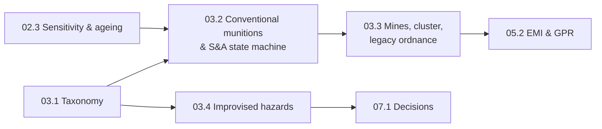

# Stage 3 · Explosive hazards and ordnance recognition

**Purpose.** Learn to reason about *what kind* of explosive hazard an object is, *what state* it is
likely to be in, and *therefore* which organisation responds and how cautious the response must
be — using precise vocabulary (IMAS 04.10), systems-safety models of how munitions stay safe,
the statistics of contamination at scale, and the base-rate mathematics of suspicious-item
reports. The engineering core is classification and decision-making under uncertainty with
asymmetric losses; the physical core (blast, fragments) follows in Stage 4.

Every stage lesson returns to the same public-safety rule: **do not touch, move away, report.**
Recognition in this course supports reasoning about categories and responses; it is never a
licence to approach an item.

| Lesson | Title | Time | Level |
|---|---|---|---|
| [03.1](lessons/stage-03/lesson-01.md) | Taxonomy of explosive hazards — EO/UXO/AXO/ERW/IED/mines/CBRN, markings, risk, Bayesian category reasoning | 4 h | Beginner |
| [03.2](lessons/stage-03/lesson-02.md) | Conventional munitions families; the explosive train and safety-and-arming as a state machine; why used items are in an unknown state | 5 h | Intermediate |
| [03.3](lessons/stage-03/lesson-03.md) | Landmines, cluster munitions, abandoned & historical ordnance — treaties, statistics, failure-rate models, degradation | 4 h | Intermediate |
| [03.4](lessons/stage-03/lesson-04.md) | Improvised and vehicle-related hazards at the recognition level — unattended vs suspicious, base rates, stand-off tables, C-IED framework | 4 h | Intermediate |

**Total** ≈ 17 h, plus the stage gate. **Simulator:** [Sim H · Recognition Trainer](sims/recognition-trainer/index.html)
(embedded in 03.1 and 03.2). **Case studies** that exercise this stage:
[cs05 Laos cluster munitions](case-studies/cs05-laos-cluster-munitions.md),
[cs08 WWII legacy ordnance](case-studies/cs08-wwii-legacy-ordnance.md),
[cs09 SS Richard Montgomery](case-studies/cs09-ss-richard-montgomery.md),
[cs06 Counter-IED robots](case-studies/cs06-counter-ied-robots.md).

**What is deliberately left out, and why.** Recognition is taught only at the **category level**
— families, generic external features, marking *conventions* and their unreliability — using
synthetic illustrations and fictional items; there are no identification details of specific real
munitions. Fuzing appears only as a **systems-engineering abstraction** (states, independent
interlocks, environmental guards, fault-tree probabilities) following public fuze-safety design
principles; nothing describes how any real fuze or safety mechanism works internally, or how to
arm, disarm, defeat, bypass or manipulate one. Improvised devices appear only as **threat
categories, public indicators and the C-IED framework** — never components, construction,
concealment, switches, timers, initiation or countermeasure procedures. Render-safe and disposal
methods are excluded entirely. These omissions are not gaps in the science: they are the
operational knowledge that professional institutions teach under supervision, and publishing it
would add risk without adding understanding of the principles this course is about.

**Stage gate:** [assessments/stage-03.md](assessments/stage-03.md) — six problems plus the Sim H
target (≥ 85 % at Advanced) and a mixed-scene response-category case.
