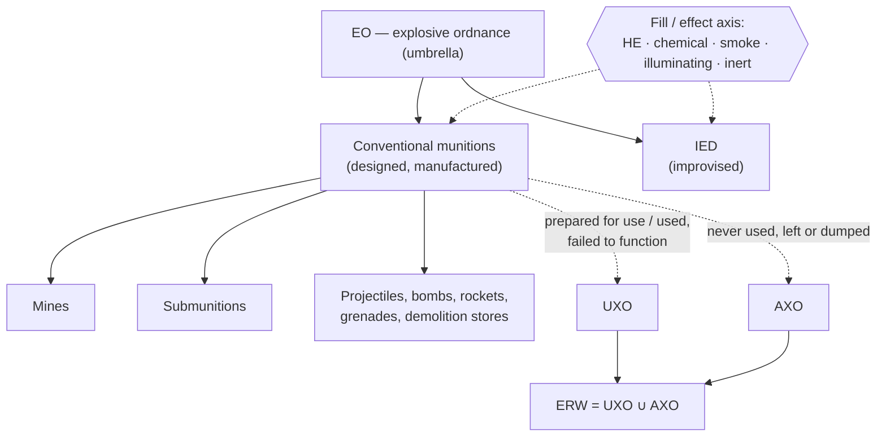
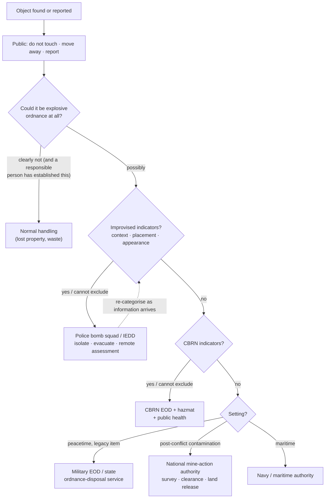

# 03.1 · Taxonomy of explosive hazards

<div class="module-card">

**Prerequisites** [00.1 What EOD is](lessons/stage-00/lesson-01.md) (vocabulary, organisations) · [00.2 How EOD organisations operate](lessons/stage-00/lesson-02.md) · elementary probability (conditional probability, Bayes' rule).

**Estimated time** 4 h (2 h theory · 1 h Sim H · 1 h programming) · **Level** Beginner

**Next** [03.2 Conventional munitions families](lessons/stage-03/lesson-02.md) and [03.4 Improvised explosive hazards](lessons/stage-03/lesson-04.md).

<p class="tags"><span>classification</span><span>IMAS 04.10</span><span>risk</span><span>Bayes</span><span>Sim H</span><span>P03</span></p>
</div>

## Why this matters

The first professional question about any found object is not "how does it work?" but "**what
kind of thing is it, and therefore who responds and how?**" A corroded shell turned up by a
plough, a bag left under a bench, a canister trawled from the seabed and a mine in a former
front line are all "explosive hazards", yet they are handled by different organisations, under
different legal regimes, with different risk tolerances. In most countries a legacy artillery
projectile goes to a military EOD unit or a state ordnance-disposal service; a suspected
improvised device goes to a police bomb squad; a contaminated area in a post-conflict country
goes into a national mine-action programme; a possible chemical munition pulls in CBRN
specialists. **The category drives the response**, and a wrong category can send the wrong
people, with the wrong protective assumptions, to the wrong problem.

Classification is also where an engineer's instincts help and hurt. It is a noisy,
imbalanced, cost-asymmetric classification problem under partial observability — exactly the
shape of problem you know from ML. But unlike most ML deployments, the observer must not
"collect more features" by handling the object. For the public, the only correct protocol is
the one this whole stage keeps returning to:

<div class="callout safety">

**Do not touch. Move away. Report.** Recognition in this course exists to support *reasoning
about categories and responses* — never to encourage anyone to approach, handle, move or
examine a suspected explosive item. Every classification below is made from a distance, from
reports or from synthetic illustrations.

</div>

## Learning objectives

1. Use the IMAS 04.10 terms (EO, UXO, AXO, ERW, IED, mine, submunition) precisely, and draw the
   set relations between them, including where CBRN munitions overlap.
2. Explain the purpose and the **limits** of ammunition colour-coding and marking conventions,
   and quantify with Bayes' rule why markings on old, foreign or improvised items cannot be
   relied upon.
3. Compute and interpret risk as likelihood × consequence, both as an ordinal matrix and as an
   expected-harm rate, and state what each representation hides.
4. Compute a posterior distribution over hazard categories from uncertain feature observations
   (naive Bayes, fictional likelihood tables), including missing and noisy features.
5. Choose a response category by minimising expected loss under an asymmetric loss matrix, and
   derive the decision threshold.
6. Map a category to the responsible organisation type and response family at the conceptual
   level.

## Theory

### 1. The vocabulary: IMAS 04.10 and the set relations

The International Mine Action Standards glossary, **IMAS 04.10**, is the reference vocabulary
used across humanitarian mine action and widely echoed in military doctrine (NATO AJP-3.18 uses
compatible terms). The key definitions, paraphrased:

| Term | IMAS 04.10 meaning (paraphrased) | Notes |
|---|---|---|
| **EO** — explosive ordnance | umbrella for mine action's response to mines, cluster munitions, unexploded ordnance, abandoned ordnance, booby traps, other devices and IEDs | the top-level set |
| **UXO** — unexploded ordnance | ordnance that has been primed, fuzed, armed or otherwise prepared for use *or used*, and remains unexploded through malfunction, design or other cause | "was in the system of use" — its **state is uncertain** (03.2) |
| **AXO** — abandoned explosive ordnance | ordnance *not used* during conflict, left behind or dumped, no longer under control of the party that left it | stored-state items, often degraded |
| **ERW** — explosive remnants of war | UXO ∪ AXO | the object of CCW Protocol V (03.3) |
| **Mine** | munition designed to be placed under, on or near a surface and to be exploded by the presence, proximity or contact of a person or vehicle | *victim-activated by design* |
| **Submunition** | munition that separates from a parent munition to perform its task | cluster munitions (03.3) |
| **IED** | device placed or fabricated in an improvised manner incorporating explosive material, designed to destroy, incapacitate, harass or distract | no manufacturer's design authority (03.4) |

Two structural facts follow.

- **The sets overlap, and membership changes over time.** A submunition dispensed but not
  functioned is simultaneously a submunition and UXO, and it becomes ERW after the conflict. A
  munition *repurposed* as the main charge of an improvised device is both conventional
  ordnance and part of an IED. A factory mine is not an IED — but an improvised victim-operated
  device performs a mine-like function and is often *treated* like one in humanitarian
  contexts.
- **CBRN is an orthogonal axis, not a sibling.** A projectile can be high-explosive-filled or
  filled with a chemical agent; the external family (projected, dropped …) is the same. CBRN is
  a *fill/effect* attribute that raises consequence and changes who must be involved (in NATO
  terms, "CBRN EOD" is its own capability subset in AJP-3.18).



<details class="answer"><summary>Exercise 1 — then reveal</summary>

Classify each (IMAS terms; more than one may apply): (a) a mortar bomb found in a trench line
decades after a battle, fired and failed; (b) a crate of unused grenades left in an abandoned
depot; (c) a submunition found in a rice field, from a strike during a war that ended 50 years
ago; (d) an artillery projectile found wired into a roadside device.

*Answer.* (a) conventional, UXO, ERW. (b) conventional, AXO, ERW. (c) conventional,
submunition, UXO, ERW (and in scope of the Convention on Cluster Munitions). (d) conventional
munition *used as a component of* an IED — treat under the **IED** category, because the
improvised element means no design authority, no known safety logic, and possible deliberate
targeting of responders (03.4). The category that governs the response is the one with the
highest *uncertainty and consequence*, not the one with the most matching features.

</details>

### 2. Ammunition categories and why they exist

Military ammunition is organised for logistics and safety by **role** (e.g. small-arms,
artillery, mortar, rocket/missile, aircraft bomb, grenade, mine, demolition store,
pyrotechnic), by **fill** (high explosive, smoke, illuminating, incendiary, chemical, practice,
inert/drill), and — for transport and storage — by the **UN hazard division** (HD 1.1–1.6) and
**compatibility group** you met in [02.3](lessons/stage-02/lesson-03.md) (IATG 01.50). These
three axes answer different questions:

| Axis | Question it answers | Who uses it |
|---|---|---|
| Role / family | how was it meant to be delivered and to function? | EOD, recognition, 03.2 |
| Fill | what is the effect if it functions? | EOD, CBRN, medical planning |
| Hazard division | what happens if a *stack* of it is involved in a fire or explosion? | storage, transport, quantity-distance (04.3) |

For recognition the first two matter most; the hazard division describes packaged stores and
is rarely observable in the field.

### 3. Colour-coding and markings — useful convention, unreliable evidence

Most national systems, and NATO standardisation among allies, use **body colours, bands and
stencilled markings** to encode fill and role, plus lot numbers, calibre/model designations and
dates. Examples of the *kind* of convention in use: a distinctive band colour indicating a
high-explosive fill; a different body colour reserved for practice or inert drill items; other
colours for smoke, illuminating or chemical fills. The details differ between nations and have
changed over the decades — which is precisely the problem.

Markings are designed for *supply-chain* users handling *known, serviceable* stock. In the EOD
context they fail in predictable ways:

| Failure mode | Mechanism |
|---|---|
| **Age** | paint fades, flakes, corrodes; bands disappear; stencils become illegible (03.3) |
| **Foreign origin** | a different national convention — the same colour can mean different things |
| **Historical change** | a nation's own scheme changed; an item predates the current code |
| **Repainting / reuse** | depot overhaul, camouflage, or deliberate repainting |
| **Improvisation** | improvised items have no convention; munitions reused in IEDs may carry misleading markings |
| **Partial view** | half-buried or fragmented items show only part of the scheme |

**Quantifying the problem.** Let an item's true category be $c$, and suppose the marking
observed, $m$, reports category $k$. Model the marking channel as: with probability $q$ the
marking is intact and correct; otherwise it is uninformative and reads as any of $K$ categories
uniformly. Then

$$
P(m=k \mid c=k) = q + \frac{1-q}{K},\qquad P(m=k \mid c\neq k) = \frac{1-q}{K},
$$

$$
P(c=k \mid m=k) = \frac{\big(q + \tfrac{1-q}{K}\big)\,\pi_k}{\big(q + \tfrac{1-q}{K}\big)\pi_k + \tfrac{1-q}{K}(1-\pi_k)} .
$$

| Symbol | Meaning | Unit |
|---|---|---|
| $q$ | probability the marking is intact and truthful (channel reliability) | — |
| $K$ | number of categories a degraded marking could be confused with | — |
| $\pi_k$ | prior (base-rate) probability of category $k$ in this context | — |
| $P(c=k\mid m=k)$ | probability the item really is what its marking says | — |

**Intuition.** A marking is a noisy sensor. For *rare* categories — and "inert practice item"
in a former battlefield is rare — even a fairly reliable sensor produces a posterior far below
certainty. And the error that matters is asymmetric: believing "inert" when it is live is
catastrophic.

**Numerical example.** Old item, marking reads "practice/inert"; $q=0.7$, $K=5$, prior of
genuinely inert items in this area $\pi=0.05$. Then $P(m\mid c)=0.7+0.06=0.76$,
$P(m\mid \neg c)=0.06$, and

$$ P(\text{inert}\mid m) = \frac{0.76\times0.05}{0.76\times0.05 + 0.06\times0.95} = \frac{0.038}{0.095} = 0.40 . $$

A 60 % chance that an item *marked* inert is not inert. With a pristine marking ($q=0.95$) it is
still only 0.83; with a badly degraded one ($q=0.4$), 0.19.

```python
import numpy as np

def p_true_given_marking(q: float, K: int, prior: float) -> float:
    """Posterior that an item is in the category its (possibly degraded) marking indicates."""
    hit = q + (1 - q) / K          # P(m = k | c = k)
    fa = (1 - q) / K               # P(m = k | c != k)
    return hit * prior / (hit * prior + fa * (1 - prior))

for q in (0.95, 0.7, 0.4):
    print(q, round(p_true_given_marking(q, K=5, prior=0.05), 3))   # 0.835, 0.4, 0.186
```

<div class="callout key">

**Key idea.** Markings may *raise* concern ("this looks like a chemical-fill marking") but must
never *lower* it. Professional practice treats every item as live and hazardous until a
qualified person has established otherwise — the Bayesian argument above is the quantitative
reason.

</div>

<details class="answer"><summary>Exercise 2 — then reveal</summary>

What marking reliability $q$ would be needed for $P(\text{inert}\mid m)\ge 0.99$ with
$\pi=0.05$, $K=5$? Is that achievable for items in the ground for decades?

*Answer.* Require $\frac{h\pi}{h\pi+f(1-\pi)}\ge0.99$ ⇔ $h/f \ge 99\cdot0.95/0.05 = 1881$ with
$h=q+f$, $f=(1-q)/5$. So $q/f \ge 1880$ ⇔ $5q/(1-q)\ge1880$ ⇔ $q\ge 0.99734$. A marking
channel that is correct 99.7 % of the time is implausible for corroded, foreign or
repainted items — so marking-based "clearance" of a live item is never acceptable.

</details>

### 4. Risk = likelihood × consequence

Risk management in ammunition safety (IATG 02.10) and mine action uses the classical product:

$$ R = L \times C . $$

In its **ordinal** form, $L$ and $C$ are scores (say 1–5) and $R$ indexes a colour-coded risk
matrix. In its **quantitative** form it is an expected-harm rate. For a contaminated area:

$$ \dot H = \lambda \; P_f \; N \; P_h , $$

| Symbol | Meaning | Unit |
|---|---|---|
| $\lambda$ | rate of human interactions with hazardous items (disturbances) | yr⁻¹ |
| $P_f$ | probability an interaction causes the item to function | — |
| $N$ | mean number of people exposed per event | persons |
| $P_h$ | probability an exposed person is a casualty given functioning | — |
| $\dot H$ | expected casualties per year | persons yr⁻¹ |

**Intuition.** Likelihood is itself a *chain* of probabilities — exposure, interaction,
functioning — and every link is a lever. Clearance lowers $\lambda$ (fewer items); fencing and
risk education lower $\lambda$ (fewer interactions); evacuation lowers $N$; protection lowers
$P_h$. Nothing a bystander does can lower $P_f$ except not interacting at all.

**Numerical example.** A fictional field: farmers disturb items $\lambda=12$ times per year,
$P_f=0.02$, $N=1.5$, $P_h=0.6$: $\dot H = 12\times0.02\times1.5\times0.6 = 0.216$ casualties
per year — roughly one casualty every 4.6 years from one field. Risk education that halves
$\lambda$ halves $\dot H$.

```python
def expected_harm_rate(lam: float, p_f: float, n_exposed: float, p_h: float) -> float:
    """Expected casualties per year for a hazardous area (all inputs fictional)."""
    return lam * p_f * n_exposed * p_h

print(expected_harm_rate(12, 0.02, 1.5, 0.6))   # 0.216
```

What the product hides: **(i)** ordinal matrices multiply ranks, which is mathematically
meaningless (a 2×5 and a 5×2 get the same cell with very different meanings); **(ii)** low
probability × catastrophic consequence gives the same number as frequent minor harm, but
societies are not risk-neutral about catastrophes; **(iii)** the inputs for EO are deeply
uncertain — a point estimate conceals a distribution. Stage 7 treats these properly.

<details class="answer"><summary>Exercise 3 — then reveal</summary>

Two interventions for the fictional field: (A) risk education, reducing $\lambda$ by 40 %,
cost 1 unit; (B) partial clearance removing 70 % of items (assume $\lambda$ scales with item
count), cost 6 units. Compute harm avoided per cost unit over 10 years.

*Answer.* Baseline 2.16 casualties/10 yr. (A) avoids 0.864 → 0.864 per unit. (B) avoids 1.512 →
0.252 per unit. A is 3.4× more cost-effective *per unit* but leaves 60 % of the hazard in place
permanently; B removes hazard for ever. Real programmes combine both — this is why mine action
treats risk education and clearance as complementary pillars, not alternatives.

</details>

### 5. Probabilistic classification from uncertain features

A report or an image yields a few **features** $x=(x_1,\dots,x_n)$: stabilisation visible
(fins, band, none), size class, manufactured vs irregular appearance, context. Under a
conditional-independence (naive Bayes) assumption,

$$ P(c \mid x) = \frac{\pi_c \prod_{j} P(x_j \mid c)}{\sum_{c'} \pi_{c'}\prod_j P(x_j\mid c')} . $$

| Symbol | Meaning |
|---|---|
| $c$ | hazard category (fictional set below) |
| $\pi_c$ | prior — depends on **context** (post-conflict field vs city station) |
| $P(x_j\mid c)$ | likelihood of observing feature value $x_j$ for category $c$ |
| missing $x_j$ | marginalised out: factor = 1 |

**Fictional likelihood table** (numbers invented for teaching; categories are generic):

| Category | Prior (rural post-conflict) | $P(\text{fins visible}\mid c)$ | $P(\text{small}\mid c)$ | $P(\text{factory-uniform}\mid c)$ |
|---|---|---|---|---|
| PR — projected | 0.40 | 0.35 | 0.30 | 0.90 |
| AD — air-dropped bomb | 0.05 | 0.80 | 0.02 | 0.90 |
| SM — submunition | 0.25 | 0.50 | 0.90 | 0.90 |
| MN — mine | 0.25 | 0.02 | 0.60 | 0.90 |
| IM — improvised | 0.05 | 0.05 | 0.40 | 0.15 |

**Numerical example.** Observed: fins visible, small, factory-uniform. Unnormalised products:
PR $0.40\cdot0.35\cdot0.30\cdot0.90=0.0378$; AD $0.00072$; SM $0.10125$; MN $0.0027$; IM
$0.00015$; sum $0.14252$. Posterior: **SM 0.710, PR 0.265, MN 0.019, AD 0.005, IM 0.001.**

If the fins are *not visible because the item is partly buried*, that feature is missing, not
"absent": posterior becomes SM 0.451, MN 0.300, PR 0.240. Treating "not seen" as "absent"
(likelihood $1-P(\text{fins})$) would wrongly inflate MN — a classic data-pipeline bug with
life-safety consequences.

```python
import numpy as np
cats  = ["PR", "AD", "SM", "MN", "IM"]
prior = np.array([0.40, 0.05, 0.25, 0.25, 0.05])
LIK = {"fins":    np.array([0.35, 0.80, 0.50, 0.02, 0.05]),
       "small":   np.array([0.30, 0.02, 0.90, 0.60, 0.40]),
       "uniform": np.array([0.90, 0.90, 0.90, 0.90, 0.15])}

def posterior(prior, observed: dict) -> np.ndarray:
    """observed: feature -> True / False / None (None = not observable, marginalised)."""
    u = prior.copy()
    for f, v in observed.items():
        if v is None:
            continue
        u *= LIK[f] if v else 1 - LIK[f]
    return u / u.sum()

print(np.round(posterior(prior, {"fins": True, "small": True, "uniform": True}), 3))
print(np.round(posterior(prior, {"fins": None, "small": True, "uniform": True}), 3))
```

**Noisy observers.** Reports come from people at a distance or from low-resolution images. If
an observer reports "fins" correctly with probability 0.9 and falsely with 0.1, the effective
likelihood is $P(\hat x = \text{fins}\mid c) = 0.9\,P(\text{fins}\mid c)+0.1\,(1-P(\text{fins}\mid c))$.
With the same three reports the posterior softens to SM 0.637, PR 0.258, MN 0.099 — the mine
hypothesis grows five-fold because a false "fins" report is now plausible.

<details class="answer"><summary>Exercise 4 — then reveal</summary>

Same observations (fins, small, uniform) but the item is reported in an **urban public space**,
prior $\pi = (0.10, 0.02, 0.03, 0.05, 0.80)$ for (PR, AD, SM, MN, IM). Compute the posterior.
What does this say about the relative weight of context versus appearance?

*Answer.* Unnormalised: PR 0.00945, AD 0.000288, SM 0.01215, MN 0.00054, IM 0.0024; sum
0.02483. Posterior ≈ **SM 0.489, PR 0.381, IM 0.097, MN 0.022, AD 0.012.** Appearance
dominates, but the improvised hypothesis keeps ~10 % despite three features pointing to a
factory item. Also question the prior itself: a factory-looking submunition in a city is so
unusual that its *placement* is an indicator (03.4) — naive Bayes assumes features and context
are independent, which is false here.

</details>

### 6. From posterior to response: asymmetric losses

Classification is not the goal; **choosing a response** is. Let actions $a$ be response
families and $\ell(a,c)$ the loss if the truth is $c$. The Bayes action minimises posterior
expected loss:

$$ a^* = \arg\min_a \sum_c P(c\mid x)\,\ell(a,c). $$

Take two conceptual response types: $a_1$ = conventional-ordnance response (military EOD or
mine-action team), $a_2$ = improvised-device-capable response (police bomb squad / IEDD).
Fictional losses: $\ell(a_1,\text{IM})=20$ (the wrong assumptions about an improvised item),
$\ell(a_2,\cdot\neq\text{IM})=1$ (inefficient, slower), correct = 0. Then
$E[\ell\mid a_1] = 20p$, $E[\ell\mid a_2] = 1-p$ where $p=P(\text{IM}\mid x)$, and the
threshold is

$$ p^* = \frac{\ell_{21}}{\ell_{12}+\ell_{21}} = \frac{1}{20+1} = 0.048 . $$

Rural example: $p=0.001 < 0.048$ → $a_1$. Urban example: $p=0.097 > 0.048$ → $a_2$ — even
though "submunition" is the single most probable category. **The most probable class is not
the right decision when losses are asymmetric**; this is the formal content of the phrase
"treat it as the worst credible case".

```python
L = np.array([[0, 0, 0, 0, 20],     # a1: conventional response
              [1, 1, 1, 1, 0]])     # a2: improvised-capable response
post_urban = posterior(np.array([0.10, 0.02, 0.03, 0.05, 0.80]),
                       {"fins": True, "small": True, "uniform": True})
print(L @ post_urban, ["a1", "a2"][int(np.argmin(L @ post_urban))])   # [1.93, 0.90] -> a2
```

<details class="answer"><summary>Exercise 5 — then reveal</summary>

Add a third action $a_3$ = "request CBRN-capable support as well", with loss 3 for every
non-CBRN category and 0 for a CBRN category you now add with posterior $r$ (and loss 100 for
$a_1,a_2$ if CBRN). Derive the condition under which $a_3$ is optimal versus the better of
$a_1,a_2$ when $p_{\text{IM}}\approx0$.

*Answer.* $E[\ell\mid a_3]=3(1-r)$; $E[\ell\mid a_1]\approx100r$. $a_3$ wins when
$3(1-r)<100r$ ⇔ $r>3/103\approx0.029$. A 3 % chance of a chemical fill is enough to change who
is called — consequence, not probability, dominates.

</details>

### 7. Category → organisation → response family

The mapping differs by country, but the logic is general:

| Category (as reported) | Typical lead organisation type | Response family (concept only) |
|---|---|---|
| Legacy conventional UXO/AXO in a peacetime country | military EOD or state ordnance-disposal service, police for cordon | isolate, specialist assessment, removal or destruction by specialists |
| ERW / mines in a post-conflict country | national mine-action authority; accredited operators under IMAS | survey, marking, clearance, land release, risk education (03.3, 05.7) |
| Suspected improvised device | police bomb squad / IEDD; military IEDD on operations | isolate, evacuate, remote assessment, evidence preservation (03.4, 08.1) |
| Possible CBRN fill | CBRN EOD + hazmat + public health | as above plus contamination control |
| Maritime / underwater | navy clearance divers, maritime authorities | exclusion zones, survey, specialist recovery (03.3) |
| Unattended, not suspicious (03.4) | venue staff / police | owner search, lost property |

The **public** response is identical in every row: do not touch, move away, report. Only the
professional response differs.

## Visual explanation



The tree is deliberately **conservative at every branch**: "cannot exclude" routes to the
higher-consequence response. Note the back-edge — categorisation is revised as information
arrives, which is the sequential-decision view developed in [07.1](lessons/stage-07/lesson-01.md).

**Sim H** presents synthetic, generic illustrations of hazard categories. Your task is to
classify the category *and* choose the category of professional response, with a stated
confidence; the debrief scores the reasoning, not just the label.

<iframe class="sim-frame" src="sims/recognition-trainer/index.html?embed=1" height="720" loading="lazy"></iframe>

<a class="sim-link" href="sims/recognition-trainer/index.html" target="_blank">Open Sim H full-screen ↗</a>

## Worked example — a report from a building site

A fictional call: a site foreman reports "a rusty metal cylinder, about forearm length, pointed
at one end, found by an excavator in a city-centre foundation pit; it looks like it has a band
near the base; no one has touched it since". The city was heavily bombed 80 years ago.

1. **Public action (already correct):** work stopped, people withdrawn, report made.
2. **Feature extraction from the report:** elongated, pointed nose, possible band (suggests a
   *spin-stabilised projected* item), no fins reported, factory-uniform shape, heavily
   corroded, found at depth in a known legacy-contamination area.
3. **Prior:** the context (depth, historic bombing, construction) makes legacy conventional
   ordnance dominant; improvised items are rarely *buried at foundation depth*. A plausible
   subjective prior: legacy conventional 0.9, improvised 0.01, not-EO (pipe, scrap) 0.09.
4. **Marking evidence:** none legible. The Bayes model of §3 says that even a legible marking
   would not have reduced the hazard assumption.
5. **CBRN:** legacy chemical munitions exist in some countries' records; the prior is small but
   §6 shows even a few percent would matter. The report gives no indicator (no leakage, odour
   or distinctive markings reported) — flag as "cannot exclude" for the specialist.
6. **Decision:** category = legacy conventional UXO/AXO; lead = military EOD / state
   ordnance-disposal service; police for the cordon. Evacuation extent is a professional
   decision informed by published distances (04.4) and the Frankfurt 2017 and London 2018
   precedents ([cs08](case-studies/cs08-wwii-legacy-ordnance.md)).
7. **Uncertainty statement:** the classification rests on a lay description; the posterior on
   "not EO" (~9 %) is not a reason to delay the specialist response, because the loss of a
   false "not EO" is catastrophic and the cost of a false alarm is hours of disruption.

## Simulation work

<div class="callout sim">

**Sim H, Beginner → Intermediate.** (1) Run 20 items at Beginner (two runs of 10) and write
down, before each commit, your category *and* a probability (enter it on the confidence slider).
Compute your Brier score afterwards and compare it with the debrief's calibration line. (2) At
Intermediate, some illustrations are partly buried, corroded or occluded: note how often you treated
"not visible" as "absent". (3) Record at least two items where the most probable category and
the correct *response* category differed, and explain why with the loss argument of §6.

</div>

## Practical exercises

<details class="answer"><summary>Practical 1 — calibration of your own judgement</summary>

You assigned probability 0.8 to your top category on 30 Sim H items and were right on 19.
(a) Are you over- or under-confident? (b) What is the 95 % interval on your true hit-rate?
(c) What should you change?

*Answer.* (a) 19/30 = 0.633 < 0.8: overconfident. (b) Wilson interval ≈ [0.455, 0.781] — 0.8
lies just outside it, so the overconfidence is statistically supported even with 30 items.
(c) Widen your probabilities and, more importantly, adopt conservative *responses* regardless
of your stated confidence — calibration errors are expected in humans.

</details>

<details class="answer"><summary>Practical 2 — which feature is worth asking about?</summary>

With the rural prior and "small, factory-uniform" known, you may ask the reporter one more
question: "are there fins?" How much does the answer reduce the entropy of the category
posterior on average (expected information gain)?

*Answer.* Current posterior (small, uniform): PR 0.240, AD 0.002, SM 0.451, MN 0.300, IM 0.007;
entropy ≈ 1.60 bits. $P(\text{fins})=\sum_c P(c)P(\text{fins}\mid c)\approx0.317$. Posterior if
yes: SM 0.710, PR 0.265, MN 0.019 … (H ≈ 1.02 bits); if no: PR 0.229, SM 0.330, MN 0.431 …
(H ≈ 1.61 bits). Expected H ≈ 0.317·1.02 + 0.683·1.61 ≈ 1.42 bits → gain ≈ 0.18 bits. A
modest gain — and it must be obtained from a distance. Information gain as a way to choose
questions reappears in [05.6](lessons/stage-05/lesson-06.md) and [09.5](lessons/stage-09/lesson-05.md).
(Run the numbers in Python to verify; small rounding differences are expected.)

</details>

<details class="answer"><summary>Practical 3 — critique a colour chart</summary>

A volunteer group proposes a laminated card for farmers: "Blue items are practice — safe to
move to the field edge." Using §3, write the three-sentence argument you would give them.

*Answer.* Colour conventions differ between nations and eras and degrade with age, so the
colour you see may not be the colour that was painted, or may mean something else. Even when a
colour is legible, practice items are rare in a former battlefield, so most "blue-looking"
items will not be practice items (our model: ≥ 60 % for a moderately degraded marking). The
only safe instruction is: do not touch, mark the location from a distance if trained to do so,
move away and report.

</details>

## Programming exercise — a category classifier that knows what it does not know

**Goal.** Implement a naive-Bayes category classifier with missing-feature handling, noisy
observers and an expected-loss decision layer, and test it against synthetic reports.

- **Input:** prior vector (context-dependent), likelihood tables (fictional, as §5, extended
  with at least two more features: "context: surface/buried", "multiple similar items nearby"),
  a report dict with values True/False/None and per-feature observer reliability.
- **Output:** posterior over categories, entropy, recommended response family, and the
  *margin* — how much the IM posterior would have to change to flip the decision.
- **Constraints:** NumPy only; log-space arithmetic to avoid underflow; likelihoods clipped to
  $[10^{-4}, 1-10^{-4}]$ (never 0 — a zero likelihood makes the model incapable of changing its
  mind).
- **Expected behaviour:** reproduces the posteriors in §5 to 3 d.p.; missing features leave the
  posterior unchanged; reliability 0.5 makes a feature uninformative.
- **Test cases:** (i) all-None report returns the prior; (ii) urban prior + (fins, small,
  uniform) → $a_2$; (iii) the decision is invariant to reordering features; (iv) a
  simulated population of 10 000 reports generated from the model yields a reliability diagram
  within ±0.03 of the diagonal.
- **Extensions:** replace naive Bayes with a small Bayesian network in which *context* and
  *placement* are dependent (the Exercise 4 issue); add a "none of the above" class and show how
  an open-set option changes decisions.

This is a warm-up for [Project P03 — Bayesian fusion](projects/p03-bayesian-fusion/README.md)
and the decision layer of [P12](projects/p12-hitl-decision/README.md).

## Reading

- UNMAS/GICHD, **IMAS 04.10 Glossary of mine action terms, definitions and abbreviations**
  (Ed. 2, Amdt 13, 2026) — https://www.mineactionstandards.org/standards/04-10/ — read the
  entries for EO, UXO, AXO, ERW, IED, mine, submunition; note the dates each definition was
  adopted.
- NATO Standardization Office, **AJP-3.18 Allied Joint Doctrine for EOD Support to
  Operations**, Ed. B v1 (2023) —
  https://assets.publishing.service.gov.uk/media/65d48f3f38fef90011b5b03b/AJP_3_18_EOD_EdB_V1.pdf
  — ch. 1: the five EOD capability subsets; see how category maps to capability.
- GICHD, **Explosive Ordnance Guide for Ukraine** (2022) —
  https://www.gichd.org/publications-resources/publications/explosive-ordnance-guide-for-ukraine/
  — skim the introduction and structure to see how a professional recognition reference is
  organised by family (it is written for qualified operators, not the public).
- UNODA, **IATG 01.50 UN explosive hazard classification system and codes** (3rd ed., 2021) —
  https://data.unsaferguard.org/iatg/en/IATG-01.50-Explosive-hazard-classification-system-IATG-V.3.pdf
  — the hazard-division axis of §2.
- UNODA, **IATG 02.10 Introduction to risk management principles and processes** (3rd ed.) —
  https://data.unsaferguard.org/iatg/en/V3_IATG-02.10_en.pdf — the risk framing of §4.

## Assessment

1. *(Conceptual)* Why is "UXO" a statement about *history and state* rather than about
   *design*? Give an example of the same design being UXO in one case and AXO in another.
2. *(Mathematical)* Derive the decision threshold $p^*$ in §6 for general losses
   $\ell_{12}=\ell(a_1,\text{IM})$ and $\ell_{21}=\ell(a_2,\neg\text{IM})$, and show it depends
   only on their ratio.
3. *(Interpretation)* A dataset of reported items shows markings were "legible and correct" in
   85 % of cases *that were later cleared*. Why is this a biased estimate of $q$ for the items
   that matter?
4. *(Design)* Propose a three-level public reporting form (fields and allowed values) that
   maximises useful features while *never* requiring the reporter to approach the item.
5. *(Computation)* With the rural prior, which single observation — fins absent (seen clearly)
   or item not factory-uniform — moves $P(\text{IM})$ more? Compute both.

<details class="answer"><summary>Answers to 2, 3 and 5</summary>

2. $E[\ell\mid a_1]=\ell_{12}p$, $E[\ell\mid a_2]=\ell_{21}(1-p)$; equal at
   $p^*=\ell_{21}/(\ell_{12}+\ell_{21}) = 1/(1+\ell_{12}/\ell_{21})$.
3. Survivorship/selection bias: items whose markings misled people may have caused incidents
   and never entered the "cleared" dataset; also clearance teams report on items they could
   examine, which excludes the most degraded ones.
5. Fins absent: IM ∝ 0.05·0.95 = 0.0475 vs others (0.26, 0.01, 0.125, 0.245) → P(IM) ≈ 0.069.
   Non-uniform: IM ∝ 0.05·0.85 = 0.0425 vs others (0.04, 0.005, 0.025, 0.025) → P(IM) ≈ 0.31.
   Irregular appearance is far more diagnostic of improvisation (likelihood ratio 0.85/0.1 = 8.5
   vs ≈ 1.2).

</details>

## Expert extension

- **Open-set recognition.** Real items include categories absent from any training set
  (foreign, prototype, improvised). Read about open-set classification and conformal
  prediction sets ([09.2](lessons/stage-09/lesson-02.md)); a prediction *set* such as
  {SM, MN, IM} is a more honest output than a single label.
- **Hierarchical priors.** Contamination priors vary by region and conflict. A hierarchical
  Bayesian model (country → district → site) with partial pooling lets sparse sites borrow
  strength — the same machinery that underlies evidence-based survey in mine action.
- **Ordinal risk matrices.** Look up Cox's critique of risk matrices ("What's wrong with risk
  matrices?", *Risk Analysis*, 2008) and reproduce his result that a matrix can rank risks
  worse than random.

## What comes next

[03.2](lessons/stage-03/lesson-02.md) opens up the conventional categories: the families,
their generic recognisable features, and the systems-engineering reason a fired-but-failed
item is more hazardous than one from a store. [03.4](lessons/stage-03/lesson-04.md) takes the
improvised branch of the decision tree and the base-rate problem of suspicious-item reports.
