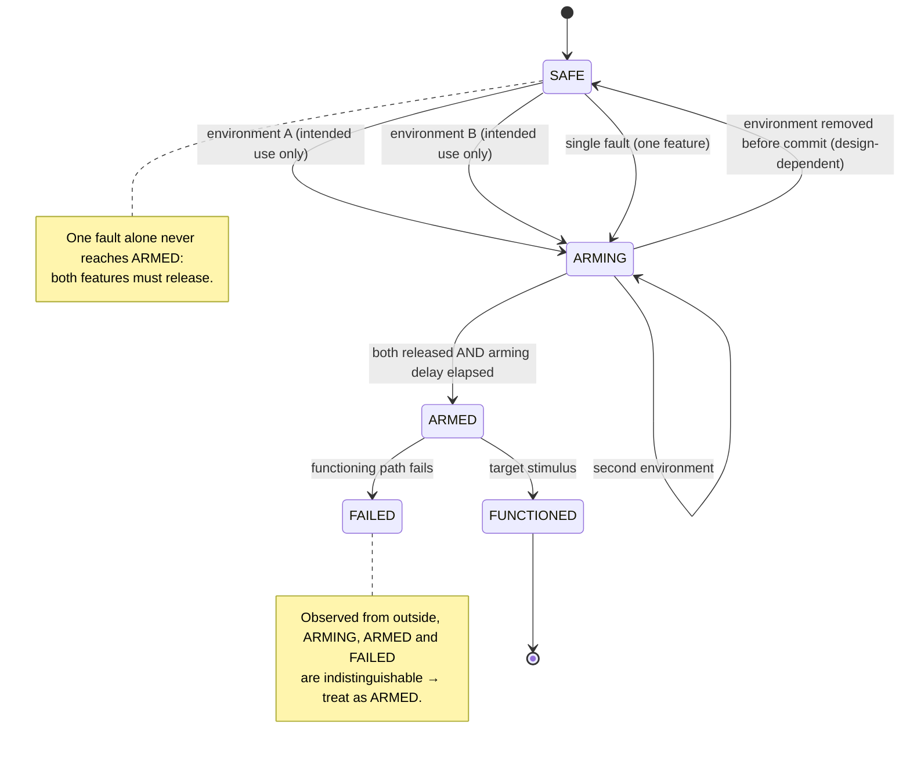
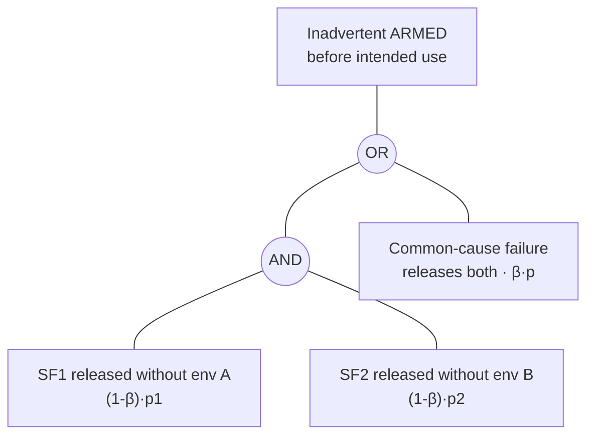

# 03.2 · Conventional munitions families and safety-and-arming as a system

<div class="module-card">

**Prerequisites** [03.1 Taxonomy of explosive hazards](lessons/stage-03/lesson-01.md) · [02.3 Sensitivity, stability, ageing](lessons/stage-02/lesson-03.md) (sensitivity concepts) · [01.7 Electricity & EM](lessons/stage-01/lesson-07.md) (HERO/ESD as safety concepts) · probability (independence, conditional probability) · finite-state machines.

**Estimated time** 5 h (2.5 h theory · 1 h Sim H · 1.5 h programming) · **Level** Intermediate

**Next** [03.3 Landmines, cluster munitions, abandoned & historical ordnance](lessons/stage-03/lesson-03.md).

<p class="tags"><span>ordnance families</span><span>systems safety</span><span>state machines</span><span>fault trees</span><span>MIL-STD-1316</span><span>Sim H</span></p>
</div>

## Why this matters

Every conventional munition is a small safety-critical system with a paradoxical requirement:
it must be **extremely unlikely to function** during decades of storage, transport, handling,
dropping and loading — and **very likely to function** at the end of its intended use. The
engineering discipline that reconciles the two is **fuze safety design**, and its public
design principles (codified for the US in MIL-STD-1316, and paralleled in NATO and other
national standards) are recognisably the same ideas a safety-critical software engineer uses:
defence in depth, independent interlocks, no single point of failure, environmental
preconditions, fail-safe defaults and formal state models.

That model explains the most important professional intuition about found ordnance: **an item
that was fired, dropped or placed and did not function is in an unknown state**, and its
safety features may have done exactly what they were designed to do — released. A crate of
the same items in a store is, by design, in a known safe state. Same object, very different
hazard.

<div class="callout boundary">

**Scope.** This lesson describes munition families by *generic external features* and treats
fuzing purely as a **systems-engineering abstraction** — states, interlocks, probabilities.
It does not describe how any real fuze or safety mechanism works internally, how items are
armed or made safe, or any initiation detail. All devices in the exercises are fictional and
abstract. Public message: **do not touch, move away, report.**

</div>

## Learning objectives

1. Distinguish the four delivery families (projected, thrown, dropped, placed) by generic
   recognisable features, and explain the physics behind spin versus fin stabilisation.
2. Explain the explosive train as a **sensitivity–quantity ladder** and why an *interrupted*
   train improves safety, using a probability argument.
3. Model safety-and-arming as a **finite-state machine** with independent environmental guards
   and state the public design principles (two independent safety features, different
   environments, arming delay, no single-point failure).
4. Compute the probability of inadvertent arming for a fictional two-interlock design with a
   fault tree, including **common-cause failure** (β-factor), and interpret the result at fleet
   scale.
5. Quantify why a fired-but-failed item's unknown state must be treated as armed, using Bayes'
   rule and an explicit-state model check.

## Theory

### 1. Four delivery families

A useful top-level split — used in the public descriptions of military EOD school divisions
(ground, air, underwater ordnance) and in humanitarian references — is by **how the item was
delivered**. Delivery shapes the external form, because the item had to survive and fly (or
sit) in a particular environment.

| Family | Examples of category | Generic recognisable features | Typical size class |
|---|---|---|---|
| **Projected** — gun | artillery / tank / naval projectiles | streamlined ogive nose, cylindrical body, a raised **band** near the base (engaged the barrel rifling); no fins | calibres of tens of mm to ~200 mm; lengths up to ~1 m |
| **Projected** — mortar | mortar bombs | teardrop or cylindrical body with a **fin assembly** on a tail boom | tens of mm to ~120 mm (larger exist) |
| **Projected** — rocket / missile | unguided rockets, guided missiles | long thin body; motor section; fins or wings; nozzle(s) at the rear | from ~0.5 m to many metres |
| **Thrown** | hand grenades, rifle grenades | hand-sized; may show a lever or ring-type feature; rifle grenades have a tail tube | ~0.1 m |
| **Dropped** — bombs | general-purpose bombs, older "blockbuster"-type bombs | large body, **tail fin assembly** (may have separated), suspension lugs | ~50 kg to > 1 t; 1–4 m |
| **Dropped** — submunitions | bomblets, grenades from dispensers or cargo shells | small; often many similar items in an area; may carry ribbons, vanes or small fins | fist-sized or smaller (03.3) |
| **Placed** — mines | anti-personnel, anti-vehicle | squat discs or cylinders, stake-mounted cylinders, bounding types; often painted to blend in | ~5 cm to ~35 cm diameter |
| **Placed** — demolition stores | charges, blocks | box- or block-like, sometimes in packaging | varies |

Two points matter more than the table. First, **features degrade and detach**: fins shear off,
bands corrode, a rocket motor separates from its warhead. Second, **family is evidence about
state**: a projected, dropped or thrown item found away from a store was almost certainly
*used* — so it is probably UXO in an unknown state (§6) — whereas items in packaging are
probably AXO.

#### Spin versus fin stabilisation

A projectile is aerodynamically unstable if its centre of pressure lies ahead of its centre of
mass — the air loads amplify any yaw. Two cures exist, and they produce the most recognisable
external difference between families.

- **Fin stabilisation** moves the centre of pressure *behind* the centre of mass (a weathervane).
  Hence mortar bombs, bombs and rockets carry fins.
- **Spin stabilisation** makes the projectile a gyroscope: angular momentum resists the
  overturning moment. The spin is imparted by rifling grooves in the barrel engaging a soft
  band on the projectile — the band is what you see.

The spin rate at the muzzle follows from the rifling twist, expressed as $n$ calibres per turn:

$$ \omega = \frac{2\pi v_0}{n\,d} . $$

| Symbol | Meaning | SI unit |
|---|---|---|
| $\omega$ | spin rate | rad s⁻¹ |
| $v_0$ | muzzle velocity | m s⁻¹ |
| $n$ | twist: calibres of travel per full turn | — |
| $d$ | calibre (diameter) | m |

**Intuition.** Each twist length $nd$ of travel adds one revolution, so revolutions per second
equal $v_0/(nd)$. Faster or smaller projectiles spin faster.

**Numerical example.** $v_0=800$ m/s, $d=0.155$ m, $n=20$: $\omega = 2\pi\cdot800/(20\cdot0.155)
= 1621$ rad/s = 258 rev/s ≈ **15 500 rpm**. The gyroscopic stiffness this implies (with a
moment of inertia of order 0.1–0.2 kg m²) is enormous — which is also why spin is an
*environment that nothing in ordinary handling produces*, a point §4 uses.

```python
import numpy as np

def spin_rate(v0: float, d: float, n_calibres_per_turn: float) -> float:
    """Muzzle spin rate [rad/s] for rifling with a twist of n calibres per turn."""
    return 2 * np.pi * v0 / (n_calibres_per_turn * d)

w = spin_rate(800, 0.155, 20)
print(w, w / (2 * np.pi) * 60)   # 1621 rad/s, 15484 rpm
```

<details class="answer"><summary>Exercise 1 — then reveal</summary>

A small-calibre projectile: $v_0=1000$ m/s, $d=0.02$ m, $n=25$. Compute the spin in rpm. Why
might a recogniser use "band present, no fins" as strong evidence of *gun-projected*, and in
what situation does that evidence fail?

*Answer.* $\omega = 2\pi\cdot1000/(25\cdot0.02) = 12\,566$ rad/s = 2000 rev/s = **120 000 rpm**.
A band is the physical signature of rifling engagement, and fins are unnecessary on a
spin-stabilised body. The evidence fails when the band has corroded or been hidden (burial),
when a fin assembly has detached from a fin-stabilised item (so "no fins" is *missing data*,
03.1 §5), and for fin-stabilised items fired from smooth-bore guns.

</details>

### 2. The explosive train as a systems concept

Energetic materials span a huge range of **sensitivity** (02.3): a small quantity of a very
sensitive material can be initiated by a modest stimulus, while bulk insensitive materials
require a strong shock from another explosive. A munition therefore uses a **train**: a very
small sensitive element initiates a slightly larger, less sensitive one, which initiates the
large, insensitive main charge. This lesson treats the train as an abstract chain; which
materials and stages exist in any real item is out of scope.

Why is this a *safety* design and not only a performance one? Consider the probability that an
accidental stimulus (a drop, a fire, an electrostatic discharge) produces a main-charge event:

$$ P_{\text{event}} = P_s \cdot P_{i\mid s} \cdot P_{t} , $$

| Symbol | Meaning |
|---|---|
| $P_s$ | probability of an accidental stimulus reaching the item during its life |
| $P_{i\mid s}$ | probability that the stimulus initiates the most sensitive exposed element |
| $P_t$ | probability that an initiation of that element propagates to the main charge |

**Intuition.** If the *main charge itself* had to be sensitive, $P_{i\mid s}$ would apply to a
kilogram-scale mass. With a train, only a tiny element is sensitive, and — the key design
principle in public fuze-safety standards — that element is kept **out of line** (the train is
*interrupted*) until the item is armed, so $P_t$ is driven towards zero in the safe state.
Energy density does not change; what changes is *which part of the system is exposed to
accidents and whether it is connected to the rest*. Software analogy: keep the privileged
component tiny, isolated, and connected to the dangerous capability only after an explicit,
validated state transition.

**Numerical example (fictional).** Lifetime accidental-stimulus probability $P_s=0.01$;
sensitive element initiation given stimulus $P_{i\mid s}=0.05$. With an uninterrupted train
($P_t\approx1$): $P_{\text{event}}=5\times10^{-4}$ — one in 2000 items. With an interrupted
train whose barrier fails to contain an initiation with $P_t=10^{-3}$: $5\times10^{-7}$ — one
in two million.

```python
def p_event(p_stimulus: float, p_init: float, p_transfer: float) -> float:
    return p_stimulus * p_init * p_transfer

print(p_event(0.01, 0.05, 1.0), p_event(0.01, 0.05, 1e-3))   # 5e-4, 5e-7
```

<details class="answer"><summary>Exercise 2 — then reveal</summary>

A stockpile holds $10^6$ items for 20 years. Using the two designs above, what is the expected
number of accidental main-charge events over the stockpile's life? What assumption about
$P_s$ is most suspect?

*Answer.* Uninterrupted: $10^6\times5\times10^{-4}=500$. Interrupted: $0.5$. The suspect
assumption is independence between items: a depot fire exposes thousands at once, so accidents
are *correlated* — which is why storage safety (hazard divisions, quantity-distance; 02.3,
04.3) is a separate layer of defence.

</details>

### 3. Safety and arming as a state machine

In systems terms the part of a fuze that governs safety is the **safety-and-arming (S&A)**
function. Its behaviour can be written as a finite-state machine:

| State | Meaning (abstract) |
|---|---|
| **SAFE** | all safety features engaged; train interrupted |
| **ARMING** | at least one safety feature released by its environment; not yet armed |
| **ARMED** | all safety features released and arming delay complete; train aligned |
| **FUNCTIONED** | the item has performed its function |
| **FAILED** | armed or partly armed, but the functioning path did not work (a "dud") |

The public design principles (MIL-STD-1316 and analogues) constrain the transitions:

1. **At least two independent safety features**, each of which alone prevents arming.
2. **Each is released by a different environment** that the item experiences only in its
   intended use (the standard's examples include launch acceleration and spin for gun-launched
   items), so no single credible accident or handling sequence supplies both.
3. **Arming delay / safe separation**: arming completes only after a delay, so the item is not
   armed while still near the people who launched it.
4. **No single-point failure** and minimised **common-cause** failures between the features.
5. **Fail-safe tendency**: faults should, as far as possible, lead to a dud rather than an
   armed state — but "dud" in the field is *not* "safe" (§6).

The software analogues are direct:

| Fuze-safety principle | Software / systems analogue |
|---|---|
| two independent safety features | dual-channel 1oo2 interlocks (IEC 61508), two-person rule, two-key launch |
| different enabling environments | independent authorisation factors (MFA with different factor types) |
| arming delay | cool-down timers, staged rollouts, "safe separation" of a deployment from production |
| no single-point failure | no single bit flip or single bad input enables a privileged action |
| common-cause analysis | shared-library / shared-power / same-developer failure modes |
| formal state model | TLA+ / model checking of the controller |

### 4. Why environments: signatures that handling cannot produce

A good enabling environment has a **signature** — magnitude *and* duration — that no credible
accident reproduces. Compare the launch environment of a gun projectile with a drop onto
concrete, using constant-acceleration estimates.

Mean launch acceleration over a barrel of length $L_b$:

$$ \bar a = \frac{v_0^2}{2L_b}, \qquad t_b = \frac{2L_b}{v_0}, \qquad \Delta v = \bar a\,t_b = v_0 . $$

Drop from height $h$, stopped over a crush distance $s$:

$$ v_i = \sqrt{2gh}, \qquad \bar a_d = \frac{v_i^2}{2s}, \qquad t_d = \frac{2s}{v_i}, \qquad \Delta v = v_i . $$

| Symbol | Meaning | SI unit |
|---|---|---|
| $v_0$ | muzzle velocity | m s⁻¹ |
| $L_b$ | barrel travel length | m |
| $h$ | drop height | m |
| $s$ | stopping distance on impact | m |
| $\Delta v$ | velocity change (integral of acceleration) | m s⁻¹ |

**Numerical example.** Launch: $v_0=800$ m/s, $L_b=6$ m ⇒ $\bar a = 53\,333$ m/s² ≈ 5 400 g
for $t_b = 15$ ms, $\Delta v = 800$ m/s. Drop: $h=1.5$ m, $s=1$ mm ⇒ $v_i = 5.42$ m/s,
$\bar a_d = 14\,700$ m/s² ≈ 1 500 g for 0.37 ms, $\Delta v = 5.4$ m/s.

**Intuition.** Peak acceleration alone does *not* separate the two cases well — hard impacts
produce thousands of g. The **integral** does: the launch delivers ~150× more velocity change,
sustained ~40× longer. A safety feature that responds to a *sustained* environment rather than
a peak is robust to drops. This is exactly the signal-processing insight you would use to make a
software trigger robust to glitches: integrate, don't threshold.

```python
g = 9.81
def launch(v0, Lb):  a = v0**2 / (2 * Lb); return a / g, 2 * Lb / v0, v0
def drop(h, s):      vi = (2 * g * h) ** 0.5; a = vi**2 / (2 * s); return a / g, 2 * s / vi, vi

print(launch(800, 6.0))   # (~5437 g, 0.015 s, 800 m/s)
print(drop(1.5, 1e-3))    # (~1500 g, 0.00037 s, 5.4 m/s)
```

<details class="answer"><summary>Exercise 3 — then reveal</summary>

A fictional device's safety feature A is released only by a sustained environment with
$\Delta v > 100$ m/s. What drop height would give $\Delta v = 100$ m/s in free fall (ignoring
drag), and what does that tell you about the credibility of handling accidents releasing it?
Which *other* accident class should the designer then worry about?

*Answer.* $h = \Delta v^2/(2g) = 10^4/19.62 \approx 510$ m. Not a handling accident. But an
aircraft crash, an explosion in a store (items thrown), or a fall from a great height are
credible *abnormal* environments — safety standards require analysis of these, and the second,
independent feature (released by a *different* environment) is what still stands.

</details>

### 5. Fault tree: probability of inadvertent arming

For a fictional S&A with two safety features that each fail (release when they should not)
with probability $p_1$, $p_2$ over the item's life, the top event "inadvertent arming" is an
**AND gate**:

$$ P_{\text{arm}} = p_1 p_2 \quad (\text{independent}). $$

Real features share causes — the same shock, corrosion, manufacturing defect or design error.
The **β-factor model** (standard in reliability engineering, IEC 61508) says a fraction $\beta$
of each feature's failures are common-cause and take both out at once:

$$ P_{\text{arm}} \approx (1-\beta)^2 p_1 p_2 + \beta\,\min(p_1,p_2) \;\;\xrightarrow{p_1=p_2=p}\;\; (1-\beta)^2p^2 + \beta p . $$

| Symbol | Meaning |
|---|---|
| $p_i$ | lifetime probability that safety feature $i$ fails to the released state |
| $\beta$ | fraction of failures that are common-cause (0–1) |
| $P_{\text{arm}}$ | probability of inadvertent arming per item |

**Numerical example.** $p=10^{-3}$:

| $\beta$ | $P_{\text{arm}}$ | per $10^6$ items |
|---|---|---|
| 0 | $1.0\times10^{-6}$ | 1 |
| 0.01 | $1.1\times10^{-5}$ | 11 |
| 0.1 | $1.0\times10^{-4}$ | 101 |

**Intuition.** Redundancy squares small probabilities *only if* the channels are independent.
A 1 % common-cause fraction makes the common-cause term ($10^{-5}$) ten times larger than the
independent term ($10^{-6}$). That is why fuze-safety standards stress *different
environments* and *diverse* features: diversity is how you drive $\beta$ down. The same lesson
governs redundant software built on the same library.

```python
def p_inadvertent_arm(p1: float, p2: float, beta: float = 0.0) -> float:
    """Two-feature AND gate with a beta-factor common-cause term."""
    return (1 - beta) ** 2 * p1 * p2 + beta * min(p1, p2)

for beta in (0, 0.01, 0.1):
    print(beta, p_inadvertent_arm(1e-3, 1e-3, beta))   # 1e-6, 1.098e-5, 1.008e-4
```

<details class="answer"><summary>Exercise 4 — then reveal</summary>

A fictional design requirement is $P_{\text{arm}}\le 10^{-6}$ per item. (a) With $\beta = 0$,
what per-feature $p$ is needed? (b) With $\beta=0.01$, can *any* $p$ meet it? Solve for $p$.
(c) What does (b) imply for design effort — improve each feature, or reduce $\beta$?

*Answer.* (a) $p\le10^{-3}$. (b) $(0.99)^2p^2 + 0.01p \le 10^{-6}$ ⇒ $p \lesssim 9.9\times10^{-5}$
(the linear term dominates: $0.01p\approx10^{-6}$). (c) With common cause present, each feature
must be ten times better than the naive AND-gate calculation suggests. Cutting $\beta$ from
0.01 to 0.001 buys almost the same as a ten-fold improvement in each feature — diversity is
usually the cheaper lever.

</details>

### 6. Unknown state: why a fired-but-failed item is more hazardous

A **stored** item has a known history: its safety features have never been exposed to their
enabling environments. Its probability of being armed is the tiny inadvertent-arming
probability of §5.

A **fired, dropped or thrown item that did not function** has experienced (some of) its
enabling environments. It may be:

- still SAFE (a feature did not release — perhaps the item never experienced the full
  environment);
- ARMING (partially released);
- ARMED, having failed to function at impact (or armed *after* impact);
- FAILED with damage — deformed, cracked, with parts displaced.

Observing it from outside cannot distinguish these. Bayes gives the posterior. Let
$a=P(\text{arming completes}\mid\text{fired})$ and $f=P(\text{functions}\mid\text{armed, impact})$;
assume an unarmed item never functions. Then

$$ P(\text{armed}\mid\text{fired, did not function}) = \frac{a(1-f)}{a(1-f) + (1-a)} . $$

| Symbol | Meaning |
|---|---|
| $a$ | probability the S&A reaches ARMED given a normal launch |
| $f$ | probability of functioning given ARMED and target stimulus |

**Numerical example (fictional).** $a=0.97$, $f=0.95$: numerator $0.97\times0.05=0.0485$,
denominator $0.0485+0.03=0.0785$ ⇒ **0.62**. Compare a stored item: $\sim10^{-6}$. The dud is
~$6\times10^5$ times more likely to be armed. And the better the S&A is at arming when it should
($a\to1$), the *more* likely a dud is armed: $a=0.999$ gives 0.98.

```python
def p_armed_given_dud(a: float, f: float) -> float:
    return a * (1 - f) / (a * (1 - f) + (1 - a))

for a in (0.9, 0.97, 0.99, 0.999):
    print(a, round(p_armed_given_dud(a, 0.95), 3))   # 0.31, 0.618, 0.832, 0.98
```

On top of the state uncertainty, a used item has been subjected to violent loads (launch,
impact, burial), and a failed functioning path may leave it in a condition no design analysis
covered. That is why professional doctrine treats UXO as **armed and sensitive until proven
otherwise**, and why disturbance of any kind — by the public, and needlessly by anyone — is
unacceptable.

<details class="answer"><summary>Exercise 5 — then reveal</summary>

A researcher argues: "Since $f$ is high for modern munitions, duds are rare, so the dud problem
is small." Separate the two quantities *(i) how many duds exist* and *(ii) how hazardous each
dud is*, and compute both for $N=10^5$ items fired with $a=0.99$, $f=0.98$.

*Answer.* Duds: $N[(1-a) + a(1-f)] = 10^5(0.01+0.0198) = 2980$. Fraction armed:
$0.0198/0.0298 = 0.66$ ⇒ ≈ 1980 armed duds. High reliability *reduces the count* but
*increases the per-item hazard* — both matter for clearance planning (03.3).

</details>

## Visual explanation



The fault tree for the top event "inadvertent arming in the logistic phase":



Use **Sim H** at Intermediate: every illustration comes with *context* text (where it was found
— a depot, near a former firing range, in a field — and by whom). Pay attention to how context changes the *state* you should assume, not just
the family.

<iframe class="sim-frame" src="sims/recognition-trainer/index.html?embed=1" height="720" loading="lazy"></iframe>

<a class="sim-link" href="sims/recognition-trainer/index.html" target="_blank">Open Sim H full-screen ↗</a>

## Worked example — two identical objects, two different hazards

Fictional scenario. On a former training area two items of the same fictional type "K-3"
(fin-stabilised, projected family) are reported: **item 1** is in an unopened, weathered
packing case in a collapsed hut; **item 2** lies alone in the impact area, nose-down, fins
bent.

1. **Family and category.** Both: projected, fin-stabilised (03.1 posterior dominated by PR).
   Item 1 → AXO (never used). Item 2 → UXO (used, failed).
2. **State prior.** Item 1: never experienced enabling environments ⇒ $P(\text{armed})$ of
   order the inadvertent-arming probability (§5), but **ageing** (02.3, 03.3) may have changed
   sensitivity; still hazardous, but the S&A logic is intact by design.
   Item 2: experienced launch; with fictional $a=0.97$, $f=0.95$, $P(\text{armed})\approx0.62$;
   bent fins show a violent impact outside design conditions.
3. **Consequence.** Same fill class ⇒ similar consequence if either functions.
4. **Risk comparison.** $R = L\times C$ with $C$ equal; $L_2/L_1$ is orders of magnitude.
5. **Response category.** Both: specialist (range clearance / EOD) response; public and
   non-specialists keep away. The *professional* planning for item 2 will assume it is armed
   and possibly damaged — the organisational consequence is more stringent isolation and
   remote means from the outset (07.2). How specialists proceed is out of scope.
6. **Lesson.** Recognition of the *family* is not enough; the item's *history* (used vs not)
   changes the state estimate more than any visible feature.

## Simulation work

<div class="callout sim">

**Sim H, Intermediate.** (1) For 15 items (one run of 12 plus three from a second seed),
record family, your category, and "used / unused / cannot tell" (the sim's fired / unfired /
unknown state) before committing. (2) Count how often the context text (location, finder,
scatter, deformation) changed your state estimate. (3) At Advanced, identify items where a
buried, corroded or occluded feature (fins, band) would have misled a feature-only classifier,
and explain how you avoided it.

</div>

## Practical exercises

<details class="answer"><summary>Practical 1 — fleet-scale reasoning</summary>

A fictional fleet of $2\times10^7$ items with $p=5\times10^{-4}$ per feature and $\beta=0.02$.
Expected number of inadvertently armed items over life? If a design change halves $p$, and a
separate change halves $\beta$, which is better?

*Answer.* $(0.98)^2(2.5\times10^{-7}) + 0.02\cdot5\times10^{-4} = 2.4\times10^{-7}+10^{-5}
= 1.024\times10^{-5}$ ⇒ ≈ 205 items. Halve $p$: $(0.98)^2(6.25\times10^{-8})+0.02\cdot2.5\times10^{-4}
= 5.06\times10^{-6}$ ⇒ ≈ 101. Halve $\beta$: $(0.99)^2(2.5\times10^{-7})+0.01\cdot5\times10^{-4}
=5.25\times10^{-6}$ ⇒ ≈ 105. Nearly equal — because the common-cause term dominates, and it
is linear in both $p$ and $\beta$.

</details>

<details class="answer"><summary>Practical 2 — interpret an incident report</summary>

A (fictional) report says: "Item found on range; markings indicate practice type; appears
undamaged; recovered by hand by a range worker without incident." List every reasoning error
the worker made, using 03.1 and this lesson.

*Answer.* (i) Trusted markings — 03.1 §3 shows markings cannot lower hazard. (ii) Ignored
state: a used item has unknown S&A state (§6). (iii) "Appears undamaged" is external-only
evidence; internal state is unobservable. (iv) "Without incident" is outcome bias — a
favourable outcome does not validate the decision. (v) Bypassed the organisational response
(the item belonged to the range-clearance / EOD category).

</details>

<details class="answer"><summary>Practical 3 — design review in your own domain</summary>

Map the five fuze-safety principles of §3 onto a system you know (e.g. a production deployment
pipeline, a robot's motor-enable chain). For each, name the "environment", the "arming delay"
and one plausible common-cause failure.

*Answer (example: robot arm enable).* Environment A: operator dead-man switch held; B:
controller self-test passed and workspace sensor clear. Arming delay: 2 s enable ramp with
audible warning. Common cause: both inputs routed through the same connector or the same
firmware task — a single loose connector or a task crash defeats both. Diversity: hardware
dead-man line independent of software. The mapping is exact enough that the same fault-tree
maths applies.

</details>

## Programming exercise — model-checking a fictional S&A

**Goal.** Build an explicit-state model of a *fictional, generic* two-feature S&A and prove two
properties by exhaustive search: (P1) no sequence of handling events plus any **single** fault
reaches ARMED; (P2) after "launched, stimulus applied, no function observed", the set of
consistent hidden states includes ARMED ⇒ the item must be treated as ARMED.

A TLA+-style sketch of the specification:

```
VARIABLES sf1, sf2, delay, dud, done
Init  == sf1 = TRUE /\ sf2 = TRUE /\ delay = 0 /\ dud = FALSE /\ done = FALSE
EnvA  == sf1' = FALSE /\ UNCHANGED <<sf2, delay, dud, done>>
EnvB  == sf2' = FALSE /\ UNCHANGED <<sf1, delay, dud, done>>
Tick  == ~sf1 /\ ~sf2 /\ delay' = delay + 1 /\ UNCHANGED <<sf1, sf2, dud, done>>
Armed == ~sf1 /\ ~sf2 /\ delay >= ARM_DELAY /\ ~dud
Stim  == Armed /\ done' = TRUE /\ UNCHANGED <<sf1, sf2, delay, dud>>
SingleFaultSafety == [](~(Handling \/ OneFault) => ~Armed)   \* checked below by BFS
```

A Python reference model (verified to run):

```python
from collections import deque
from dataclasses import dataclass, replace

ARM_DELAY = 2
HAZARD = {"SAFE": 0, "ARMING": 1, "FAILED": 2, "ARMED": 3, "FUNCTIONED": 4}

@dataclass(frozen=True)
class S:
    sf1: bool = True; sf2: bool = True; delay: int = 0; dud: bool = False; done: bool = False
    @property
    def phase(self):
        if self.done: return "FUNCTIONED"
        if not self.sf1 and not self.sf2 and self.delay >= ARM_DELAY:
            return "FAILED" if self.dud else "ARMED"
        return "ARMING" if (not self.sf1 or not self.sf2) else "SAFE"

def step(s, e):
    if s.done: return s
    return {"ENV_A": lambda: replace(s, sf1=False), "ENV_B": lambda: replace(s, sf2=False),
            "FAULT1": lambda: replace(s, sf1=False), "FAULT2": lambda: replace(s, sf2=False),
            "DEFECT": lambda: replace(s, dud=True),
            "TICK": lambda: replace(s, delay=s.delay + 1) if (not s.sf1 and not s.sf2) else s,
            "STIMULUS": lambda: replace(s, done=True) if s.phase == "ARMED" else s,
            }.get(e, lambda: s)()          # handling events (DROP, VIBRATION) change nothing

def reachable(alphabet, depth=8):
    seen, q = {S()}, deque([(S(), 0)])
    while q:
        s, d = q.popleft()
        for e in (alphabet if d < depth else []):
            t = step(s, e)
            if t not in seen: seen.add(t); q.append((t, d + 1))
    return seen

for fault in ("FAULT1", "FAULT2"):                                   # P1
    assert all(s.phase != "ARMED" for s in reachable(["DROP", "VIBRATION", "TICK", fault]))
R = reachable(["ENV_A", "ENV_B", "TICK", "DEFECT", "STIMULUS"])     # P2
consistent = {s.phase for s in R if not s.done and not s.sf1 and not s.sf2}
print(sorted(consistent, key=HAZARD.get), "-> treat as", max(consistent, key=HAZARD.get))
# ['ARMING', 'FAILED', 'ARMED'] -> treat as ARMED
```

- **Input:** event alphabet, depth bound, fictional per-event probabilities for the extension.
- **Output:** pass/fail for P1 and P2; the consistent-state set; for the extension, a
  probability distribution over that set.
- **Constraints:** pure Python; the model must remain fictional and abstract (named
  environments, no physical mechanism).
- **Expected behaviour:** P1 holds for each single fault; adding both faults makes ARMED
  reachable (the residual risk quantified in §5); P2 yields a consistent set containing ARMED.
- **Test cases:** (i) removing the `delay >= ARM_DELAY` guard must not break P1 but should be
  flagged by a new property "no ARMED within fewer than ARM_DELAY ticks of the second
  release"; (ii) introduce a deliberate design bug — ENV_A also releases SF2 — and confirm P1
  now *fails* (this is the common-mode failure in state-machine form); (iii) the consistent set
  after an observed function is exactly {FUNCTIONED}.
- **Extensions:** attach probabilities to events and compute the Bayes posterior of §6 by
  forward simulation (Monte Carlo) — compare with the closed form; write the spec in real TLA+
  and check it with TLC; add an ageing process that slowly raises FAULT probabilities and plot
  $P_{\text{arm}}(t)$.

## Reading

- US DoD, **MIL-STD-1316F Fuze Design, Safety Criteria for** (2017) — everyspec index:
  https://everyspec.com/MIL-STD/MIL-STD-1300-1399/MIL-STD-1316F_55755/ — read only the
  general design-safety requirements (independent safety features, different environments,
  arming delay, common-cause); these are the public principles §3 abstracts.
- UNMAS/GICHD, **T&EP 09.30/01/2022 Conventional EOD Competency Standards** —
  https://www.mineactionstandards.org/standards/09-30-01-2022/ — see how "Fuzes" and
  "Explosive Trains" are the largest knowledge clusters, and how knowledge deepens from
  awareness (L1) to explanation (L3).
- NATO, **AJP-3.18** Ed. B (2023) —
  https://assets.publishing.service.gov.uk/media/65d48f3f38fef90011b5b03b/AJP_3_18_EOD_EdB_V1.pdf
  — how conventional munitions disposal (CMD) fits among the EOD capability subsets.
- P. W. Cooper, **Explosives Engineering**, Wiley (1996) — Part 5 (initiation theory) for the
  *physics* of why sensitive and insensitive materials need a train; read the conceptual
  chapters only.
- Cranfield University, **Explosives Ordnance Engineering MSc** (module list) —
  https://www.cranfield.ac.uk/courses/taught/explosives-ordnance-engineering — note "Safety
  Assurance" and "Weapon Life Assessment" as academic disciplines in their own right.

## Assessment

1. *(Conceptual)* Explain why "two independent safety features released by *different*
   environments" is stronger than "two identical safety features released by the *same*
   environment", in fault-tree terms.
2. *(Mathematical)* Show that for $\beta p \gg p^2$ the β-factor result reduces to
   $P_{\text{arm}}\approx\beta p$, and state the condition on $\beta$ for the independent term
   to dominate.
3. *(Interpretation)* A found item shows a band and no fins and is lying in a ploughed field in
   a former battle zone. What family, what category (IMAS), and what state assumption? What
   feature observation would change the family hypothesis?
4. *(Design)* Propose a third, *diverse* enabling condition for the fictional S&A of the
   programming exercise and recompute $P_{\text{arm}}$ with three features, $p=10^{-3}$,
   $\beta_{\text{pair}}=0.01$ for the two original features and $\beta=0$ for the new one.
5. *(Computation)* With $a=0.95$ and $f=0.9$, compute $P(\text{armed}\mid\text{dud})$ and the
   number of armed duds from $5\times10^4$ items fired.

<details class="answer"><summary>Answers to 2, 4 and 5</summary>

2. $(1-\beta)^2p^2+\beta p\approx\beta p$ when $\beta p\gg p^2$ ⇔ $\beta\gg p$. The independent
   term dominates only if $\beta\ll p$ — for $p=10^{-3}$ that needs $\beta\ll10^{-3}$, which is
   rarely demonstrable. Common cause almost always dominates well-designed redundancy.
4. Pair-failure probability ≈ $1.1\times10^{-5}$ (from §5); AND with an independent third
   feature at $10^{-3}$: ≈ $1.1\times10^{-8}$ — a thousand-fold improvement *because* the new
   feature is diverse (β = 0 with respect to the pair).
5. $0.95\cdot0.1/(0.095+0.05) = 0.655$. Duds: $5\times10^4\times0.145=7250$; armed ≈ 4750.

</details>

## Expert extension

- **Markov models of S&A reliability.** Replace static probabilities with a continuous-time
  Markov chain whose fault rates increase with age (Weibull hazards), and compute the time
  evolution of $P_{\text{arm}}(t)$ for stored items — the reliability-engineering counterpart
  of 02.3's chemical ageing.
- **Common-cause beyond β.** Study the multiple Greek letter and α-factor models, and the
  "dependent failure" analysis in IEC 61508-6.
- **Formal methods.** Model the S&A in TLA+ or Promela (SPIN) and check liveness ("if both
  environments occur, the item eventually arms") as well as safety — then find a design where
  liveness and safety conflict, which is the essence of the dud problem.

## What comes next

[03.3](lessons/stage-03/lesson-03.md) scales the dud problem from one item to millions:
cluster munitions and mines, where failure rates and decades of degradation create
contamination that outlives the conflict by generations.
