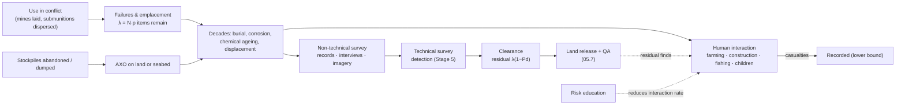

# 03.3 · Landmines, cluster munitions, abandoned & historical ordnance

<div class="module-card">

**Prerequisites** [03.1 Taxonomy](lessons/stage-03/lesson-01.md) · [03.2 Conventional munitions & S&A](lessons/stage-03/lesson-02.md) (unknown state of used items) · [02.3 Sensitivity, stability, ageing](lessons/stage-02/lesson-03.md) (Arrhenius kinetics, stabiliser depletion) · binomial and Poisson distributions.

**Estimated time** 4 h (2 h theory · 0.5 h Sim H · 1.5 h programming) · **Level** Intermediate

**Next** [03.4 Improvised explosive hazards](lessons/stage-03/lesson-04.md); later [05.2 EMI & GPR](lessons/stage-05/lesson-02.md) and [05.7 Search theory & land release](lessons/stage-05/lesson-07.md).

<p class="tags"><span>humanitarian mine action</span><span>treaties</span><span>binomial/Poisson</span><span>spatial statistics</span><span>ageing</span><span>CS05 · CS08 · CS09</span></p>
</div>

## Why this matters

Most explosive-hazard casualties in the world today are not caused by bombs aimed at anyone.
They are caused by **items that outlived their conflict**: mines that remain victim-activated for
decades, submunitions that failed to function when dispersed, and abandoned or dumped stocks
that corrode in fields, cellars and seabeds. The Landmine Monitor recorded **6,279** people
killed or injured by mines and explosive remnants of war in 2024 — the highest since 2020 —
across 52 countries and areas, with civilians about **90 %** of recorded casualties. Cluster
Munition Monitor 2026 recorded at least **1,063** cluster-munition casualties in 2025.

For an engineer this is a problem in **statistics at scale** (a failure rate of a few percent
applied to millions of items), **spatial search** (where are the remaining items?), **materials
ageing** (what state are they in after 50 years?) and **policy** (treaties that change what may
be used and who must clear it). This lesson connects all four and sets up the detection and
land-release mathematics of Stage 5.

<div class="callout safety">

**Public message.** In any area with a history of conflict, bombing, military training or
dumping: do not touch, move away the way you came, mark or remember the location only if you
can do so without approaching, and report. Items that look inert, rusted through, or "already
exploded" are not safe.

</div>

## Learning objectives

1. Summarise the purposes and key obligations of the **Ottawa Convention**, the **Convention on
   Cluster Munitions** and **CCW Protocol V**, and explain what each changed for clearance
   responsibility.
2. Read contamination and casualty statistics critically (what is recorded vs what exists).
3. Model submunition failures with binomial and Poisson distributions, including overdispersion,
   and derive why "low" failure rates still create long-lasting contamination.
4. Model spatial contamination density and residual hazard after imperfect clearance.
5. Explain, conceptually and with simple kinetic/corrosion models, how decades of burial or
   immersion change an item's condition and hazard.
6. Describe the particular problems of legacy WWI/WWII ordnance and underwater/dumped munitions.

## Theory

### 1. The humanitarian and legal context

| Instrument | Adopted / in force | Core content (summary) | Clearance relevance |
|---|---|---|---|
| **Anti-Personnel Mine Ban Convention** ("Ottawa Convention") | adopted 1997; in force 1999 | prohibits use, stockpiling, production and transfer of anti-personnel mines; requires stockpile destruction and clearance of mined areas within deadlines; victim assistance | turns clearance into a *treaty obligation* with deadlines — and extension requests |
| **Convention on Cluster Munitions** | adopted 30 May 2008; in force 1 Aug 2010 | prohibits use, production, transfer and stockpiling of cluster munitions; clearance of cluster munition remnants; victim assistance | defines cluster munition remnants as a clearance category |
| **CCW Protocol V on Explosive Remnants of War** | adopted 28 Nov 2003; in force Nov 2006 | generic post-conflict obligations on parties to a conflict: record use, mark and clear ERW, share information, take precautions | the first binding instrument making ERW clearance a post-conflict obligation of the users |

Membership is not static. The official convention site listed 162 States Parties to the Mine Ban
Convention in 2026; Landmine Monitor 2025 reports 166 after two accessions in 2025, while
Estonia, Finland, Latvia, Lithuania and Poland initiated withdrawal. The Convention on Cluster
Munitions lists 112 States Parties and 12 signatories. Major military powers remain outside one
or both. **Norms matter to engineering**: they determine which items are still being produced
and used — and therefore what will need to be detected and cleared in the future.

### 2. Reading contamination statistics

| Figure (source) | Value |
|---|---|
| Mine/ERW casualties recorded, 2024 (Landmine Monitor 2025) | 6,279; highest since 2020 |
| Share civilians (same) | ≈ 90 % |
| Countries/areas with casualties (same) | 52 |
| Land released by States Parties, 2024 (same) | 1,114 km² |
| Stockpiled AP mines destroyed, 2024 (same) | 105,640 |
| Cluster munition casualties, 2025 (Cluster Munition Monitor 2026) | ≥ 1,063, of which Ukraine 927 |
| Submunitions dropped on Lao PDR, 1964–73 (Monitor country profile) | > 270 million |
| Confirmed hazardous area, Lao PDR, end-2024 (same) | ≈ 1,500 km² |

<div class="callout key">

**How to read these.** Casualty counts are **recorded** casualties — a lower bound whose
completeness varies with each country's surveillance system and with access during active
conflict. A rise can reflect more contamination, more exposure (economic pressure pushing
people onto contaminated land), or better recording. Area figures depend on survey method:
"confirmed hazardous area" shrinks when *survey* improves, even with no clearance (land
release by evidence; 05.7). Always ask: what is the denominator, and what process generated the
count?

</div>

### 3. Why submunition failure creates lasting contamination

A cluster munition disperses many submunitions over an area. Each functions or fails,
approximately independently given conditions. With $N$ submunitions and per-item failure
probability $p$, the number of unexploded items is binomial:

$$ X \sim \mathrm{Bin}(N,p),\qquad E[X]=Np,\qquad \mathrm{Var}[X]=Np(1-p),\qquad P(X=0)=(1-p)^N . $$

For large $N$ and small $p$, $X\approx\mathrm{Poisson}(\lambda=Np)$.

| Symbol | Meaning | Unit |
|---|---|---|
| $N$ | number of submunitions dispersed | items |
| $p$ | per-item probability of failing to function | — |
| $X$ | number of unexploded submunitions left | items |
| $\lambda$ | expected number left, $Np$ | items |

**Intuition.** $P(X=0)$ decays *exponentially* in $N$. With thousands of items per strike,
"no duds" is effectively impossible for any realistic $p$ — contamination is a **certainty**, not
a risk. Treaty and design debates about acceptable failure rates are debates about $\lambda$,
not about whether contamination occurs.

**Numerical example (fictional strike).** $N=2000$, $p=0.05$: $E[X]=100$, SD $=9.75$,
$P(X=0)=0.95^{2000}=2.8\times10^{-45}$. $P(X\ge120) = 0.025$ (binomial; Poisson approx. 0.028).
Even at $p=0.01$, $E[X]=20$.

How large is $p$ in reality? Manufacturer and test-range figures are typically low, but field
conditions (soft or waterlogged ground, vegetation, low release heights, ageing stock) raise
failure rates substantially. For Lao PDR, a failure fraction of **around 30 %** is widely quoted
by mine-action organisations, implying on the order of 80 million unexploded submunitions from
270 million dropped; treat such figures as order-of-magnitude estimates.

```python
import numpy as np
from scipy import stats

N, p = 2000, 0.05
X = stats.binom(N, p)
print(X.mean(), X.std(), (1 - p) ** N)            # 100, 9.75, 2.8e-45
print(X.sf(119), stats.poisson(N * p).sf(119))   # 0.025, 0.028
```

<details class="answer"><summary>Exercise 1 — then reveal</summary>

A fictional policy caps the failure rate at 1 %. (a) For $N=2000$, what is the probability a
strike leaves **at most 10** duds? (b) How many strikes of 2000 until the expected cumulative
number of duds exceeds 1000? (c) What does this say about "low-failure" submunitions as a
humanitarian solution?

*Answer.* (a) $X\sim\mathrm{Bin}(2000,0.01)$, $E=20$: $P(X\le10)\approx0.011$. (b) 50 strikes.
(c) Reliability improvements reduce contamination linearly, but volume multiplies it; the
Convention on Cluster Munitions took the view that a prohibition, not a reliability standard,
was required (it excludes only a narrow class of weapons meeting cumulative criteria).

</details>

### 4. Overdispersion: why field failure rates vary so much

The binomial model assumes one $p$ for every item. In reality $p$ varies between strikes (lot,
age, terrain, release conditions). Let $p\sim\mathrm{Beta}(\alpha,\beta)$ across strikes; then $X$
is **beta-binomial**:

$$ E[X]=N\bar p,\qquad \mathrm{Var}[X] = N\bar p(1-\bar p)\,\frac{\alpha+\beta+N}{\alpha+\beta+1},\qquad \bar p=\frac{\alpha}{\alpha+\beta}. $$

**Numerical example.** $\alpha=2,\beta=38$ ($\bar p=0.05$), $N=2000$: SD rises from 9.7
(binomial) to **68.8**; $P(X\ge150)$ rises from $10^{-6}$ to **0.20**. One strike in five leaves
50 % more duds than the mean. Test-range averages therefore say little about the *worst* areas —
exactly the ones survey must find.

```python
a, b = 2, 38
print(stats.betabinom(N, a, b).std(), stats.betabinom(N, a, b).sf(149))   # 68.8, 0.20
```

<details class="answer"><summary>Exercise 2 — then reveal</summary>

Given dud counts from five fictional strike footprints of 2000 items each — 42, 160, 71, 95,
188 — test informally whether a single binomial $p$ is plausible.

*Answer.* Mean 111.2 ⇒ $\hat p=0.0556$; binomial SD $\approx\sqrt{2000\cdot0.0556\cdot0.944}=10.3$.
The sample SD is ≈ 60 — about six times larger. A common $p$ is implausible; use a
hierarchical/beta-binomial model, and plan survey on the assumption that some footprints are
much worse than average.

</details>

### 5. Spatial contamination and residual hazard

Spread $\lambda$ items over footprint area $A$ with density $\rho=\lambda/A$. If items are
(approximately) a homogeneous Poisson point process, the number in a sub-area $a$ is
$\mathrm{Poisson}(\rho a)$ and

$$ P(\text{at least one item in } a) = 1-e^{-\rho a}. $$

Clearance with per-item probability of detection $P_d$ leaves $\lambda_r=\lambda(1-P_d)$ items,
so

$$ P(\text{area not clean after clearance}) = 1-e^{-\lambda(1-P_d)} . $$

| Symbol | Meaning | Unit |
|---|---|---|
| $\rho$ | item density | m⁻² |
| $a$ | area of interest (a plot, a path) | m² |
| $P_d$ | per-item probability of detection and removal | — |
| $\lambda_r$ | expected residual items after clearance | items |

**Numerical example.** 100 duds over 2 ha ($A=20\,000$ m²): $\rho=0.005$ m⁻². A 400 m²
vegetable plot: $P(\ge1)=1-e^{-2}=0.865$. After clearance with $P_d=0.99$: $\lambda_r=1$,
$P(\text{not clean})=1-e^{-1}=0.632$. With $P_d=0.999$: 0.095.

**Intuition.** "99 % effective" clearance of a heavily contaminated area leaves it more likely
dirty than clean. That is why humanitarian standards pursue *all reasonable effort*, quality
assurance sampling and evidence-based land release rather than a single $P_d$ number — and why
detection engineering (Stage 5) fights for the last fraction of a percent.

```python
rho = 100 / 20_000
print(1 - np.exp(-rho * 400))                          # 0.865
for Pd in (0.99, 0.999):
    print(Pd, 1 - np.exp(-100 * (1 - Pd)))             # 0.632, 0.095
```

<details class="answer"><summary>Exercise 3 — then reveal</summary>

Farming disturbs each item in a field with probability 0.1 per year, and a disturbed item
functions with probability 0.005 (fictional). With 100 items in the field, what is the
probability of at least one functioning event in 10 years? In 50 years? After clearance leaving
1 expected item, in 50 years?

*Answer.* Rate $=100\cdot0.1\cdot0.005=0.05$ yr⁻¹. 10 yr: $1-e^{-0.5}=0.39$; 50 yr: $0.92$.
After clearance: rate $5\times10^{-4}$ yr⁻¹; 50 yr: $0.025$. The long tail is the point: a
field that seems "fine" for years is not safe, and legacy hazards generate casualties for
generations.

</details>

### 6. Landmines: persistence by design

A mine is designed to wait. It is victim-activated (03.1), is emplaced to be hard to see, and has
no concept of the war ending. Anti-personnel mines are small, often minimum-metal (which is why
detection is hard; 05.2), and were frequently laid without records — or with records later lost.
Soil movement, flooding and landslides relocate them, so even a recorded minefield's boundary
decays over time. Anti-vehicle mines pose a different risk profile: larger charge, higher
activation load, and a threat to vehicles, including the agricultural and humanitarian vehicles
of the post-conflict period. For recognition, the category-level message is simple: an item
that *looks like it belongs to the ground* — squat, disc- or cylinder-shaped, partly buried,
painted to blend — in an area with any conflict history is treated as a mine, and the correct
action is to stop, retrace the route already walked, and report.

### 7. Legacy WWI and WWII ordnance

In western Europe, a century of ploughing still turns up WWI munitions — the annual "iron
harvest" collected by state disposal services in France and Belgium. WWII aerial bombing left
large air-dropped bombs buried metres deep in cities; they surface during construction. Two
documented cases:

- **Frankfurt, 2017**: a 1.4-tonne British bomb found during construction led to the largest
  post-war evacuation in Germany (~60,000 people, 1.5 km radius); it was dealt with by the
  state ordnance-disposal service ([cs08](case-studies/cs08-wwii-legacy-ordnance.md)).
- **London, 2018**: a 500 kg bomb in dock silt closed London City Airport (214 m exclusion
  zone; ~16,000 passengers affected); the Royal Navy removed it and dealt with it at sea.

Engineering lessons: pre-construction **risk assessment from historical records and wartime
aerial photographs**, geophysical survey of building plots, and evacuation logistics (including
non-compliance) are large, routine, municipal-scale activities.

### 8. Underwater and dumped munitions

After both world wars, huge quantities of surplus conventional and chemical munitions were
dumped at sea. German federal authorities estimate about **1.6 million tonnes** of conventional
munitions in German North Sea and Baltic waters; HELCOM estimates around **40,000 t** of chemical
munitions dumped in the Baltic. Wrecks carrying cargoes of munitions — the SS *Richard
Montgomery* in the Thames Estuary, with ~1,400 t of explosives aboard since 1944 — are managed by
**monitoring** (repeated multibeam sonar surveys and change detection) rather than removal
([cs09](case-studies/cs09-ss-richard-montgomery.md)).

The hazards are distinctive: items are displaced by currents and trawling, caught in fishing
nets, disturbed by offshore wind-farm and cable construction, and corroding casings can leak
contents into the marine environment. Detection underwater uses sonar, magnetometry and
remotely operated vehicles — robotics problems with degraded communication and visibility
(Stage 6).

### 9. Degradation over decades

What does 50–100 years do to a munition? At the *conceptual* level:

| Process | Consequence (qualitative) |
|---|---|
| **Corrosion** of casing and components | thinning, perforation, exposure of fillings; jammed or weakened parts; loss of markings (03.1) |
| **Chemical ageing** of energetic materials (02.3) | stabiliser depletion in propellants, decomposition products, exudation, crystal changes — sensitivity can *increase* |
| **Seal failure and water ingress** | chemical reactions with corrosion products; formation of more sensitive compounds in some cases |
| **Mechanical damage** | impact, burial loads, freeze–thaw, ploughing |

Direction of change is **unpredictable**: ageing can make an item less likely to function as
designed and *more* likely to function unexpectedly when disturbed. The safe assumption is that
age increases uncertainty, and uncertainty increases hazard.

**Two simple models.** Many corrosion damage functions follow an empirical power law in time,
and chemical ageing rates follow Arrhenius kinetics (02.3):

$$ d(t) = r\,t^{\,b}, \qquad \frac{k(T_2)}{k(T_1)} = \exp\!\left[\frac{E_a}{R}\left(\frac{1}{T_1}-\frac{1}{T_2}\right)\right]. $$

| Symbol | Meaning | Unit |
|---|---|---|
| $d$ | corrosion depth | mm |
| $r$ | first-year corrosion depth (environment-dependent) | mm |
| $b$ | time exponent ($b<1$: protective corrosion layers slow the rate) | — |
| $k$ | reaction rate constant | s⁻¹ (first order) |
| $E_a$ | activation energy | J mol⁻¹ |
| $R$ | gas constant, 8.314 | J mol⁻¹ K⁻¹ |
| $T$ | absolute temperature | K |

**Numerical example (fictional parameters).** $r=0.08$ mm, $b=0.7$: $d(10)=0.40$ mm,
$d(80)=1.72$ mm, and a 3 mm wall is penetrated after $t=(3/0.08)^{1/0.7}\approx177$ years —
but pitting is local, so perforation happens much earlier at some points. For ageing with
$E_a=100$ kJ/mol, storage at 25 °C versus burial at a constant 10 °C: rate ratio
$\exp[\tfrac{10^5}{8.314}(\tfrac{1}{283.15}-\tfrac{1}{298.15})]\approx8.5$. The same chemistry
proceeds almost an order of magnitude faster in a hot store than in cool ground, which is one
reason deep-buried legacy items can be in surprisingly "fresh" condition — and surface items in
hot climates surprisingly degraded.

```python
def corrosion_depth(t_years, r=0.08, b=0.7):
    return r * t_years ** b

def arrhenius_ratio(Ea, T1, T2, R=8.314):
    return np.exp(Ea / R * (1 / T1 - 1 / T2))

print(corrosion_depth(80), (3 / 0.08) ** (1 / 0.7))       # 1.72 mm, 177 yr
print(arrhenius_ratio(100e3, 283.15, 298.15))             # 8.5
```

<details class="answer"><summary>Exercise 4 — then reveal</summary>

(a) With $b=0.7$, by what factor does corrosion depth grow between 40 and 80 years? (b) A
fictional item stored for 30 years in a desert store at a mean 35 °C is compared with an
identical one buried at 10 °C for the same time. With $E_a=100$ kJ/mol, how many "10 °C
years" of ageing has the stored item experienced? What caution applies?

*Answer.* (a) $2^{0.7}=1.62$. (b) Ratio $\exp[12\,028(1/283.15-1/308.15)]\approx31.4$ ⇒
≈ 940 equivalent years. Caution: a single $E_a$ and first-order kinetics are gross
simplifications; real ageing involves multiple coupled processes, temperature *cycling*,
humidity, and thresholds (e.g. stabiliser exhaustion) — the model shows direction and scale
only.

</details>

## Visual explanation



## Worked example — planning numbers for a fictional footprint

A fictional survey identifies a cluster-strike footprint of 3 ha in farmland, from a strike of
an estimated 1,500 submunitions, 45 years ago. Local reports mention "several" items found.

1. **Expected contamination.** Field failure rate uncertain: model $p\sim\mathrm{Beta}(3,27)$
   ($\bar p=0.10$). $E[X]=150$; the beta-binomial SD is large (≈ 82), so a 90 % interval runs
   from a few tens to about 300 items. Plan for the upper range.
2. **Density.** $\rho\approx150/30\,000=0.005$ m⁻²; any 200 m² patch contains an item with
   probability $1-e^{-1}=0.63$.
3. **Ageing.** 45 years buried: markings gone, casings corroded, state unknown (03.2 §6) — all
   items treated as armed and possibly more sensitive.
4. **Residual target.** Suppose the land-release goal is an expected residual of ≤ 0.05 items;
   $150(1-P_d)\le0.05$ ⇒ $P_d\ge0.99967$ — beyond any single detector pass, which is why
   clearance combines methods, repeated passes and QA sampling (05.7).
5. **Interim risk reduction.** Until clearance, risk education and marking reduce the
   interaction rate (03.1 §4) — cheap, immediate, and multiplicative with clearance.

## Simulation work

<div class="callout sim">

**Python Monte Carlo + Sim H.** (1) Simulate 1,000 fictional strike footprints with beta-binomial
failures and Poisson placement; plot the distribution of residual items after clearance at
$P_d\in\{0.95,0.99,0.999\}$. (2) In [Sim H](sims/recognition-trainer/index.html) at Advanced,
note how often submunition-type and mine-type illustrations appear *degraded* (missing features,
partial burial) and how that changes your confidence. Stage 5's
[Sim J](sims/detection-theory/index.html) will extend step (1) with ROC trade-offs.

</div>

## Practical exercises

<details class="answer"><summary>Practical 1 — interpret a statistic</summary>

A news headline says: "Landmine casualties rose 20 % this year." List four distinct mechanisms
that could produce this rise and what additional data would discriminate them.

*Answer.* (i) New use/contamination — look for new-use reports and item types. (ii) Increased
exposure (displacement, returnees, economic pressure) — population movement and livelihood
data. (iii) Better surveillance/recording — changes in reporting system coverage, share of
"unknown device type". (iv) Reduced clearance/risk-education funding — programme budgets and
land released. The per-country breakdown and the recording methodology notes in the Monitor
report are the first place to look.

</details>

<details class="answer"><summary>Practical 2 — seabed monitoring as change detection</summary>

A fictional wreck is surveyed annually by multibeam sonar. You have two co-registered depth
grids with per-cell noise SD 0.05 m. What threshold on depth change flags a cell with a 1 %
false-alarm rate per cell, and how many false alarms for 10⁶ cells? Suggest one improvement.

*Answer.* Difference noise SD $=0.05\sqrt2=0.0707$ m; two-sided 1 %: $2.576\times0.0707=0.182$ m.
Expected false alarms $10^4$ per survey — too many. Improvements: spatial clustering (require
connected regions), multi-survey temporal models, or a lower per-cell FAR with a matched filter
for expected change shapes. Change detection is the same ROC problem as 05.1.

</details>

<details class="answer"><summary>Practical 3 — construction-site risk screening</summary>

Design a three-stage pre-construction screening workflow for a city with WWII bombing history,
naming the data source used at each stage and what triggers escalation.

*Answer (one good design).* (1) Desk study: bomb-damage maps, wartime aerial photographs,
post-war records → risk zoning; escalate if the plot falls in a high-density zone or shows
possible unexploded-bomb entry holes. (2) Non-intrusive geophysical survey (magnetometry, GPR) on
escalated plots → anomaly list; escalate anomalies matching large-ferrous signatures. (3)
Specialist investigation of anomalies by the state ordnance-disposal service before excavation.
At every stage, workers are briefed: stop, withdraw, report.

</details>

## Programming exercise — contamination and residual-risk simulator

**Goal.** Build a Monte Carlo simulator of fictional cluster-strike contamination and clearance,
and use it to answer "how much clearance effort is enough?"

- **Input:** number of strikes; per strike: $N$, Beta($\alpha,\beta$) for $p$, footprint as an
  ellipse (centre, axes, orientation); clearance $P_d$ (possibly spatially varying); annual
  interaction probability map.
- **Output:** residual-item maps, distribution of residual counts, expected functioning events
  per year before/after clearance, and $P(\text{area not clean})$.
- **Constraints:** NumPy/SciPy; reproducible via seed; vectorised (10⁴ footprints < 5 s).
- **Expected behaviour:** matches closed forms of §3–§5 in the homogeneous case (mean within
  1 %, $P(\text{not clean})$ within 0.01).
- **Test cases:** (i) $\beta\to\infty$ with fixed mean recovers binomial variance; (ii)
  $P_d=1$ gives zero residuals; (iii) doubling footprint area at fixed $N$ halves density but
  leaves total residual unchanged.
- **Extensions:** make items cluster (Neyman–Scott process) and show how clustering changes the
  value of sampling-based QA; add item displacement by ploughing as a random walk per year.

The spatial and detection parts feed directly into [Project P02 — sensor noise](projects/p02-sensor-noise/README.md)
and the land-release mathematics of [05.7](lessons/stage-05/lesson-07.md).

## Reading

- ICBL-CMC, **Landmine Monitor 2025** and **Cluster Munition Monitor 2026** — https://the-monitor.org/
  (reports at icblcmc.org) — read the Major Findings and the casualty methodology notes.
- Landmine & Cluster Munition Monitor, **Lao PDR country profile: impact** —
  https://the-monitor.org/country-profile/lao-pdr/impact — the scale of cluster-munition
  contamination; pair with [cs05](case-studies/cs05-laos-cluster-munitions.md).
- GICHD, **A Guide to Mine Action**, 5th ed. (2014) —
  https://www.gichd.org/fileadmin/uploads/gichd/Media/GICHD-resources/rec-documents/Guide-to-mine-action-2014.pdf
  — chapters on the legal framework, survey and land release.
- Treaty texts and status: **Anti-Personnel Mine Ban Convention** https://www.apminebanconvention.org/ ·
  **Convention on Cluster Munitions** https://www.clusterconvention.org/ · **CCW Protocol V**
  (UNODA) https://disarmament.unoda.org/en/our-work/conventional-arms/convention-certain-conventional-weapons/ccw-protocol-v-explosive-remnants-war
  — read the articles on clearance obligations.
- UK MCA, **SS Richard Montgomery Survey Report 2016** (pub. 2019) —
  https://assets.publishing.service.gov.uk/media/5cf5309ae5274a79460b5407/SSRM_Survey_Report_2016.pdf
  — a model of monitoring-based risk management for dumped/wrecked munitions.
- HELCOM, **Report on chemical munitions dumped in the Baltic Sea** —
  https://helcom.fi/publications/report-on-chemical-munitions-dumped-in-the-baltic-sea/ — scale
  and locations of sea-dumped chemical munitions.
- UNODA, **IATG 07.10 Surveillance and in-service proof** —
  https://data.unsaferguard.org/iatg/en/IATG-07.10-Surveillance-proof-IATG-V.3.pdf — §13 on
  propellant stability, the science behind §9.

## Assessment

1. *(Conceptual)* Explain why a mine's hazard is *persistent by design* while a submunition's
   residual hazard is *persistent by failure*. How does this difference show up in the treaties?
2. *(Mathematical)* Show that $P(X=0)=(1-p)^N\approx e^{-Np}$ and compute the $N$ at which
   $P(X=0)$ drops below 1 % for $p=0.02$.
3. *(Interpretation)* A national authority reports confirmed hazardous area fell by 30 % in one
   year while items destroyed were few. Is this suspicious? Explain.
4. *(Design)* Specify the data fields a clearance database should store per item so that a
   future analyst could estimate field failure rates by lot and terrain.
5. *(Computation)* With $\rho=0.002$ m⁻² and a path 1 m wide and 500 m long, compute the
   probability of the path intersecting at least one item, before and after clearance with
   $P_d=0.995$.

<details class="answer"><summary>Answers to 2, 3 and 5</summary>

2. $\ln(1-p)\approx-p$ for small $p$. $e^{-0.02N}<0.01$ ⇒ $N>230.3$ ⇒ $N=231$ (exact:
   $\ln0.01/\ln0.98=227.9$ ⇒ 228).
3. Not necessarily: evidence-based **cancellation and reduction through survey** legitimately
   releases land shown to be uncontaminated. The questions are whether survey met the standard
   (IMAS land release, QA) and whether residual-risk monitoring exists.
5. $\rho a=0.002\cdot500=1$ ⇒ $1-e^{-1}=0.632$; after: $1-e^{-0.005}=0.0050$.

</details>

## Expert extension

- **Hierarchical Bayesian failure-rate estimation** from clearance records (lot → munition type →
  theatre), with detection-probability correction (items not found are not counted) — a
  missing-data problem akin to capture–recapture.
- **Spatial point processes**: fit inhomogeneous Poisson or log-Gaussian Cox models to recorded
  finds to predict hotspots; compare with remote-sensing covariates (05.5, 09.3).
- **Corrosion science**: study pitting statistics (extreme-value distributions of pit depth) — the
  right model for "time to first perforation" is extreme-value, not mean-depth.

## What comes next

[03.4](lessons/stage-03/lesson-04.md) turns from designed items to improvised ones, where there is
no design authority, no failure rate to look up, and the base-rate problem dominates
suspicious-item reporting. Stage 5 then supplies the detection physics for everything in this
lesson.
