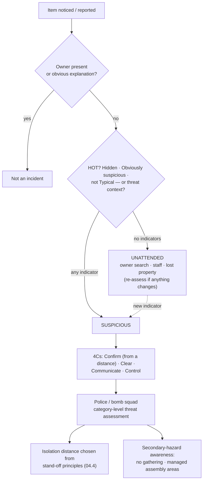
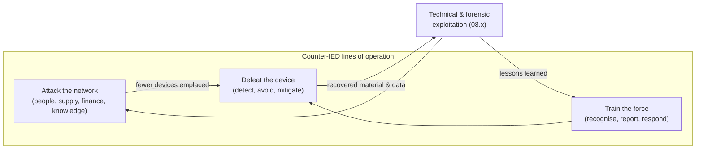

# 03.4 · Improvised explosive hazards and vehicle-related hazards (recognition level)

<div class="module-card">

**Prerequisites** [03.1 Taxonomy](lessons/stage-03/lesson-01.md) (Bayes over categories, expected-loss decisions) · [00.2 How EOD organisations operate](lessons/stage-00/lesson-02.md) · [01.5 Scaling laws](lessons/stage-01/lesson-05.md) (cube-root scaling — helpful, not essential).

**Estimated time** 4 h (2 h theory · 0.5 h simulator · 1.5 h programming) · **Level** Intermediate

**Next** Stage 4 — [04.1 Anatomy of a blast wave](lessons/stage-04/lesson-01.md) and [04.4 Injury, fragments & secondary hazards](lessons/stage-04/lesson-04.md); later [07.1 Decisions under uncertainty](lessons/stage-07/lesson-01.md).

<p class="tags"><span>improvised hazards</span><span>base rates</span><span>Bayes</span><span>decision analysis</span><span>stand-off</span><span>C-IED</span><span>P12</span></p>
</div>

## Why this matters

Police bomb squads spend most of their working lives responding to items that turn out to be
harmless. Israel's police bomb-disposal service, for example, handles tens of thousands of
suspicious-object calls a year; transport operators close stations and airports over forgotten
bags every day. Yet the rare real device can kill many people, and it may be designed to kill
the responders. This is the purest example in the course of a **low-base-rate, high-consequence
decision problem**: most alarms are false, and the system must still respond as if each might be
true — while not training the public to ignore alarms.

An improvised device also breaks every assumption of the previous two lessons. There is no
manufacturer, no design authority, no fuze-safety standard, no failure-rate table, no marking
convention. **Every improvised item is unique**, and the professional community treats it that
way. What *can* be taught openly — and what is taught to the public — is recognition at the
level of indicators and categories, the statistics of reporting, the physics behind public
stand-off tables, and the counter-IED framework that organisations use.

<div class="callout boundary">

**Scope.** Improvised devices appear here only as **threat categories, public indicators and
organisational frameworks**. There is nothing — and there must be nothing — about components,
construction, concealment, switches, timers, initiation, or how any countermeasure or response
technique works. All scenarios and numbers are fictional; yields are abstract YU.

</div>

<div class="callout safety">

**The public protocol.** If an item is suspicious: **do not touch it, move away, and report**
(to venue staff or the police). Keep others away. Do not use it as a photo opportunity, do not
gather to watch, and follow instructions from responders about where to go.

</div>

## Learning objectives

1. Distinguish an **unattended** item from a **suspicious** item using public indicator
   frameworks (HOT, CISA guidance) and explain why the distinction exists.
2. Name the three **threat categories** used in public counter-IED language (victim-operated,
   command, time) and explain, at category level only, why each implies a different posture.
3. Compute the posterior probability of a real device from a report using realistic base rates,
   combine indicators in log-odds form, and estimate false-alarm volumes.
4. Choose among response options by expected loss, compute decision thresholds, and compute the
   value of information of an assessment step.
5. Explain how public stand-off tables (e.g. the DHS-DOJ Bomb Threat Stand-Off Card) derive from
   cube-root scaling, and why they are conservative.
6. Describe the counter-IED lines of operation (attack the network, defeat the device, train the
   force) and the institutional history (JIEDDO → JIDA → JIDO), and explain secondary-hazard
   awareness.

## Theory

### 1. What makes a hazard "improvised"

The IMAS 04.10 definition (03.1): a device *placed or fabricated in an improvised manner*
incorporating explosive material, designed to destroy, incapacitate, harass or distract.
Consequences for anyone reasoning about one:

| Property of designed munitions (03.2) | Improvised hazard |
|---|---|
| design authority, test and qualification | none; built by an adversary, often adapted from previous encounters |
| independent safety features, arming delay | no guarantee of *any* safety feature — for anyone, including the maker |
| known family, known features | unique; may be deliberately disguised as an ordinary object |
| markings | absent or misleading (03.1 §3) |
| failure-rate data | none that applies to *this* item |
| neutral to who approaches | may be designed to target responders or crowds (§6) |

Hence the professional axiom: **treat each improvised item as unique** and assume nothing that
has not been established by qualified people using remote means.

### 2. Unattended versus suspicious

Almost every public-space alarm starts with an **unattended** item: a bag, a box, a parcel with
no one nearby. Most are simply lost. Public awareness guidance distinguishes:

- **Unattended**: an item whose owner is not present, with no indicators of threat. Response:
  normal procedures — ask around, look for the owner, staff involvement, lost property.
- **Suspicious**: an item that shows indicators, *or* whose circumstances (a threat call, a
  location that matters, behaviour observed) raise concern. Response: do not touch, clear the
  area, report, control access.

The UK **HOT** principles (National Counter Terrorism Security Office / ProtectUK), also used in
US CISA public material, give three questions:

| Letter | Question | What it is really testing |
|---|---|---|
| **H — Hidden** | has it been deliberately concealed or placed out of sight? | *intent*: lost items are dropped; concealed items are placed |
| **O — Obviously suspicious** | does it have features that are plainly out of the ordinary for such an object (as described in public guidance)? | *anomaly* in the object itself |
| **T — not Typical** | is it out of place for this location and context? | *anomaly* relative to the environment's base rate |

If HOT raises concern, the UK "**4Cs**" (Confirm, Clear, Communicate, Control) frame what staff do
next: confirm from a distance whether it is suspicious, clear people away, communicate to police,
control the area so no one re-enters. Each is a *public-safety* action; none involves approaching
or examining the item.

<div class="callout key">

**Why the distinction exists.** If every unattended bag triggered full evacuation, a city would
spend its life evacuated, and the public would learn to ignore alarms — a *cry-wolf* failure that
degrades response to the real event. Indicator frameworks are a **pre-filter** that raises the
base rate of what reaches the expensive response. §4 quantifies how much.

</div>

### 3. Threat categories — categories only

Public counter-IED literature groups improvised devices by **how functioning is caused**, as
categories:

| Category | Meaning at category level | Posture implication (conceptual) |
|---|---|---|
| **Victim-operated** | the hazard is caused by the actions of a person who encounters it | approach, contact and handling *are* the hazard — the reason the public rule is "do not touch" |
| **Command** | a person elsewhere can decide when it functions | the situation can change at any time; distance and hard cover matter, and no one should linger or gather |
| **Time** | it may function after an unknown interval, independently of anyone's actions | every minute near it is exposure; evacuation should be prompt and orderly |

These categories are not mutually exclusive, and **a responder never knows which applies** at the
start of an incident. The decision-relevant consequence is the same as in 03.2: the unknown state
must be treated as the most dangerous consistent state.

### 4. Base rates and false alarms

Let $D$ = "a real device", $H$ = "the report is HOT-positive". Bayes:

$$ P(D\mid H) = \frac{P(H\mid D)\,\pi}{P(H\mid D)\,\pi + P(H\mid\neg D)\,(1-\pi)} . $$

In **log-odds** form, independent indicators add:

$$ \log O(D\mid e_1,\dots,e_k) = \log O(D) + \sum_{i}\log \Lambda_i,\qquad \Lambda_i=\frac{P(e_i\mid D)}{P(e_i\mid\neg D)}. $$

| Symbol | Meaning |
|---|---|
| $\pi$ | base rate: fraction of reported unattended items that are real devices |
| $P(H\mid D)$ | sensitivity of the indicator screen |
| $P(H\mid\neg D)$ | false-positive rate of the screen on benign items |
| $O(\cdot)$ | odds, $p/(1-p)$ |
| $\Lambda_i$ | likelihood ratio of indicator $i$ |

**Numerical example (fictional but realistic order of magnitude).** $\pi = 10^{-4}$ (one in ten
thousand reports), sensitivity 0.9, false-positive rate 0.02:

$$ P(D\mid H) = \frac{0.9\times10^{-4}}{0.9\times10^{-4}+0.02\times0.9999} = 0.0045 . $$

HOT-positive items are **45 times** more likely to be devices than the average report — and still
**222 false alarms for every real device**. For a service receiving 20,000 reports a year: ≈ 402
HOT-positive responses, containing on average 1.8 of the 2 real devices; 0.2 real devices per year
are *missed* by the screen, which is why context (threat calls, intelligence, the location's
significance) can override a negative screen.

A second, independent indicator with $\Lambda_2 = 0.7/0.05 = 14$ (e.g. a credible threat call for
that location): log-odds $-4.0 + 1.65 + 1.15 = -1.2$ ⇒ $P \approx 0.059$.

```python
import numpy as np

def posterior(prior: float, sens: float, fpr: float) -> float:
    return sens * prior / (sens * prior + fpr * (1 - prior))

def combine_lr(prior: float, lrs) -> float:
    lo = np.log(prior / (1 - prior)) + np.sum(np.log(lrs))
    return 1 / (1 + np.exp(-lo))

p1 = posterior(1e-4, 0.9, 0.02)
print(p1, (0.02 * (1 - 1e-4)) / (0.9 * 1e-4))       # 0.00448, 222 false per true
print(combine_lr(1e-4, [0.9 / 0.02, 0.7 / 0.05]))    # 0.0593
```

<details class="answer"><summary>Exercise 1 — then reveal</summary>

During a period of elevated threat, the base rate rises tenfold to $10^{-3}$. (a) Recompute
$P(D\mid H)$. (b) The same period brings a surge in reports from nervous members of the public,
tripling the benign report volume. What happens to the base rate among reports, and to the
workload?

*Answer.* (a) $0.9\cdot10^{-3}/(0.9\cdot10^{-3}+0.02\cdot0.999)=0.043$. (b) If real devices per
year are unchanged but benign reports triple, the base rate *among reports* falls by ~3×,
offsetting part of the rise; the number of HOT-positive responses roughly triples. Heightened
vigilance *raises workload faster than it raises detection* — this is the operational reason
threat-level changes come with guidance on what to report, not only encouragement to report more.

</details>

### 5. Decision analysis: response options, thresholds and the value of information

Let the response options be (conceptual, fictional costs in abstract "loss units"):

| Option | Cost if benign $c_a$ | Expected harm if device $h_a$ |
|---|---|---|
| $a_0$: no special action | 0 | 10 000 |
| $a_1$: local cordon, await specialist | 1 | 1 500 |
| $a_2$: wide evacuation + specialist | 5 | 200 |

Expected loss $E[\ell\mid a] = c_a + p\,h_a$ (cost incurred in both cases; harm only if $D$). With
$p=0.00448$: $a_0$: 44.8; $a_1$: 7.72; $a_2$: **5.90** ⇒ wide evacuation. Thresholds between
adjacent options solve $c_i + p h_i = c_j + p h_j$:

$$ p^*_{ij} = \frac{c_j - c_i}{h_i - h_j} ,\qquad p^*_{01} = \frac{1}{8500} = 1.2\times10^{-4},\qquad p^*_{12} = \frac{4}{1300}=3.1\times10^{-3}. $$

**Intuition.** Because harm dwarfs disruption cost, the thresholds are tiny: a 0.3 % probability
already justifies evacuation. This is why "it's probably nothing" is true and irrelevant at the
same time.

**Value of information.** Suppose specialists can perform a remote assessment (for this model,
an abstract test with sensitivity 0.95 and specificity 0.90) *before* choosing between $a_0$–$a_2$.
Then $P(T^+) = 0.104$; $P(D\mid T^+) = 0.041$ ⇒ choose $a_2$ (loss 13.2); $P(D\mid T^-) =
2.5\times10^{-4}$ ⇒ choose $a_1$ (loss 1.37). Expected loss with information $=0.104\cdot13.2 +
0.896\cdot1.37 = 2.60$, versus 5.90 without: **EVSI ≈ 3.3 units**. Perfect information would be
worth $\text{EVPI} = 5.90 - 0.00448\cdot205 = 4.98$.

```python
acts = {"none": (0, 10_000), "cordon": (1, 1_500), "evacuate": (5, 200)}

def best(p):
    return min((c + p * h, a) for a, (c, h) in acts.items())

p = 0.00448
se, sp = 0.95, 0.90
pt = se * p + (1 - sp) * (1 - p)
qp, qm = se * p / pt, (1 - se) * p / (1 - pt)
with_info = pt * best(qp)[0] + (1 - pt) * best(qm)[0]
print(best(p), best(qp), best(qm), best(p)[0] - with_info)   # EVSI ~ 3.3
```

The model is deliberately a toy: it ignores the time and exposure the assessment itself takes, it
treats harm as a single number, and in reality assessment happens *under* a cordon. Stage 7
formalises this properly as a sequential decision problem (POMDP).

<details class="answer"><summary>Exercise 2 — then reveal</summary>

(a) Show that the optimal option switches from $a_1$ to $a_2$ at $p^*_{12}$. (b) If evacuation
cost rises from 5 to 20 (a major transport hub at rush hour), what is the new threshold, and what
does the model now recommend for $p=0.00448$? (c) What important cost does the model omit when
evacuations are frequent?

*Answer.* (a) $1+1500p = 5+200p$ ⇔ $p=4/1300$. (b) $1+1500p=20+200p$ ⇒ $p^*=19/1300=0.0146$;
at $p=0.00448$, $a_1$ (loss 7.72) beats $a_2$ (20.9): a tight cordon plus rapid specialist
assessment. (c) Erosion of public compliance and trust from repeated evacuations (cry-wolf), and
secondary risks of evacuation itself (crowding, §6) — both are real losses a single-incident model
cannot see.

</details>

### 6. Secondary hazards and secondary devices — awareness

A documented pattern in the use of improvised devices is the **secondary device**: a further
hazard intended to affect people who respond to, gather at, or flee from the first. Awareness,
not technique, is what this course teaches:

- **One item found is not a scene cleared.** The existence of a first item raises, rather than
  lowers, the probability of others nearby (a strong dependence that naive per-item models miss).
- **Crowds are exposure.** People gathering to watch, or evacuees massed at an obvious assembly
  point, increase $N$ in the risk product of 03.1 §4. Public guidance therefore says: move well
  away, do not gather, follow directions.
- **Responders are part of the exposed population.** Incident planning (07.2) accounts for this in
  where people are staged and how routes are chosen; the *how* is professional practice and out
  of scope here.
- Secondary hazards also include non-explosive ones: fire, structural collapse, utilities, CBRN
  (04.4).

<details class="answer"><summary>Exercise 3 — then reveal</summary>

Model the number of devices at a scene, given at least one, as $1+K$ with $K\sim\mathrm{Poisson}(\mu)$.
If fictional historical data suggest $\mu=0.15$, what is the probability of at least one
additional device? Compare with the *unconditional* probability that a location hosting a benign
report also hosts a device.

*Answer.* $1-e^{-0.15}=0.139$ — about 14 %, versus the ~$10^{-4}$ base rate. Conditioning on a real
first device raises the probability of another by three orders of magnitude, which is the
quantitative content of "secondary-device awareness".

</details>

### 7. Vehicle-borne hazards and public stand-off tables

Vehicles can carry far larger quantities than a person, so the potential consequence — and hence
the distance to which people must be moved — is much greater. Public guidance addresses this with
**stand-off tables**. The DHS-DOJ Bomb Threat Stand-Off Card (DHS/CISA, DOJ, FBI; current edition
August 2025; earlier NCTC chart) lists, for threat descriptions ranging from a small container to
large vehicles, the **explosives capacity**, a **mandatory evacuation distance**, a
**shelter-in-place zone**, and a **preferred evacuation distance**.

How such tables are derived, conceptually: cube-root (Hopkinson–Cranz) scaling (01.5, 04.2) says
blast effects at distance $R$ from a charge of energy-equivalent $W$ depend on the scaled distance

$$ Z = \frac{R}{W^{1/3}} \quad\Longrightarrow\quad R_{\text{safe}} = Z^*\,W^{1/3}, $$

where $Z^*$ is the scaled distance at which a chosen protection criterion is met (an overpressure
or impulse level associated with a given injury or glazing-damage probability — 04.3, 04.4).

| Symbol | Meaning | Unit (this course) |
|---|---|---|
| $W$ | charge size, energy-equivalent | YU (abstract yield unit) |
| $R$ | distance from the charge | m |
| $Z$ | scaled distance | m · YU⁻¹ᐟ³ |
| $Z^*$ | scaled distance meeting the protection criterion | m · YU⁻¹ᐟ³ |

**Numerical example (fictional).** Take $Z^*=40$ m·YU⁻¹ᐟ³ for an "evacuation" criterion. Then
$W = 1, 8, 125, 1000$ YU give $R = 40, 80, 200, 400$ m. **A thousand-fold increase in size needs
only a ten-fold increase in distance** — the cube root — which is why tables span sizes over
several orders of magnitude with distances spanning about one.

**Why the tables are conservative.**

1. **$W$ is unknown.** The table is indexed by *container*, not by content. If $W$ is lognormal
   with a 95th percentile 8× its median, $\sigma_{\ln W}=\ln8/1.645=1.26$, and since
   $\ln R=\ln Z^*+\tfrac13\ln W$, the 95th-percentile distance is $e^{1.645\cdot1.26/3}=2.0$× the
   median distance. Tables are built on high-end capacity.
2. **Fragments and glass outrange blast.** Primary blast injury thresholds are reached closer in
   than the range of fragments and flying glass; the *preferred* distance reflects these.
3. **Buildings change the geometry.** Reflection and channelling (04.2) raise loads; shielding
   lowers them. The shelter-in-place zone reflects the idea that for people who cannot move far
   enough, being inside a structure away from windows may be safer than being in the open.

```python
def safe_distance(W_yu, Z_star=40.0):
    return Z_star * np.cbrt(W_yu)

print([round(safe_distance(W)) for W in (1, 8, 125, 1000)])    # [40, 80, 200, 400]
sigma = np.log(8) / 1.645
print(np.exp(1.645 * sigma / 3))                               # 2.0
```

<details class="answer"><summary>Exercise 4 — then reveal</summary>

(a) A fictional table entry is revised because the *capacity* estimate for a vehicle class doubles.
By what factor does the distance change? (b) What $\sigma_{\ln W}$ would make the 95th-percentile
distance 3× the median? (c) Why is it defensible to publish distances without any explosive
quantities that a reader could "work backwards" from?

*Answer.* (a) $2^{1/3}=1.26$. (b) $1.645\sigma/3=\ln3$ ⇒ $\sigma=2.00$ (a 95th-percentile/median
ratio in $W$ of $e^{3.29}\approx27$). (c) The public needs *distances and actions*; quantities add
nothing to the protective decision. Our course follows the same principle by working in abstract
YU.

</details>

### 8. The counter-IED framework

The organisational response to improvised devices in Iraq and Afghanistan, where IEDs became the
leading cause of coalition casualties, produced a durable framework of three **lines of
operation**:

| Line of operation | Aim | Examples of *what*, not *how* |
|---|---|---|
| **Attack the network** | act against the people, finance, supply and knowledge behind devices before devices are emplaced | intelligence, forensic and technical exploitation (08.3), law enforcement |
| **Defeat the device** | detect, avoid, neutralise or mitigate devices that are emplaced | detection technology (Stage 5), robots and remote means (Stage 6), protection |
| **Train the force** | prepare people to recognise, report and respond | awareness training, rehearsal, lessons learned |

**Institutional history.** The US Army IED Task Force (2003) became the **Joint IED Defeat
Organization (JIEDDO)**, established by DoD Directive 2000.19E in 2006; it became the Joint
Improvised-Threat Defeat *Agency* (JIDA) in 2015 and, on 30 September 2016, the Joint
Improvised-Threat Defeat *Organization* (JIDO) under the Defense Threat Reduction Agency. RAND's
2014 assessment of JIEDDO training and the Army's account of fielding EOD robots (more than 7,000
robots of many types by 2017, consolidated into three interoperable classes from 2018) are
instructive for engineers: rapid fielding saved lives but created fragmentation and sustainment
costs ([cs06](case-studies/cs06-counter-ied-robots.md)). NATO's EOD doctrine (AJP-3.18) places
EOD's C-IED contribution chiefly in *defeat the device* and in technical exploitation supporting
*attack the network*.

For an engineer, the framework is a reminder that **the device is the smallest part of the
problem**: the adversary is adaptive, so any detection or defeat technology triggers
counter-adaptation — a game, not a static classification task (09.6, adversarial robustness).

## Visual explanation





## Worked example — a bag at a station

Fictional scenario. 07:40, a busy suburban rail station. A staff member reports a rucksack
pushed behind a bench at the end of a platform; no one has claimed it in 10 minutes. No threat
call has been received. The national threat level is "substantial".

1. **Unattended or suspicious?** H: it was pushed *behind* a bench — plausibly concealed
   (Hidden = weak yes). O: nothing reported as obviously unusual about the object itself. T: a
   rucksack at a station is typical in general, but its placement is not. Screen: **positive
   on H, weak on T** ⇒ treat as suspicious.
2. **Probability.** Take $\pi=10^{-4}$, HOT likelihood ratio ≈ 45 ⇒ $P\approx0.0045$. The threat
   level might raise $\pi$ modestly; no threat call ⇒ no further likelihood ratio.
3. **Decision.** From §5, $p\approx0.0045 > p^*_{12}=0.0031$ ⇒ clear a wide area and summon the
   specialist response; at rush hour with a high evacuation cost (Exercise 2), a tight cordon
   with rapid specialist assessment might be optimal — this is a judgement the model *informs*
   but does not make.
4. **Actions (public/staff level).** Nobody touches or moves the bag; people are moved away from
   the platform and not allowed to gather in view; trains are held; police informed; an assembly
   point is chosen away from the obvious exits (secondary-hazard awareness).
5. **Outcome (fictional).** The police response establishes it is a forgotten gym bag. The
   *decision was still correct*: judging the decision by the benign outcome is outcome bias
   (07.1). The report and the decision log feed the base-rate data for next time.

## Simulation work

<div class="callout sim">

**Sim F (incident command) and Sim J (detection theory)** — preview. In
[Sim J](sims/detection-theory/index.html) set the base rate to $10^{-4}$ and move the operating
point along the ROC: record the number of false alarms per true detection at sensitivities 0.8,
0.9, 0.99. In [Sim F](sims/incident-command/index.html) run a Beginner scenario involving an
unattended item and note which information requests changed your posterior most. In
[Sim H](sims/recognition-trainer/index.html) the "suspicious-item" category tests the *unattended
vs suspicious* distinction from context illustrations.

</div>

## Practical exercises

<details class="answer"><summary>Practical 1 — design a reporting prompt</summary>

A venue app lets staff report unattended items. Design three yes/no questions (not requiring
anyone to approach) that operationalise HOT, and state for each a plausible likelihood ratio
range and why.

*Answer (example).* (1) "Does it look deliberately placed out of sight?" — LR maybe 5–50;
concealment is rare for lost items. (2) "Is it the kind of item normally found here?" — LR maybe
2–10; atypicality is common for benign reasons too. (3) "Has anyone received a threat or seen
unusual behaviour linked to it?" — LR potentially very high but rare. Report posterior as a
*priority band*, not a number, to avoid false precision; always keep the default action "do not
touch, move away, report".

</details>

<details class="answer"><summary>Practical 2 — correlated indicators</summary>

Two indicators each have LR = 10 but are strongly correlated (e.g. "hidden" and "not typical"
often co-occur for benign items left under seats). Explain why multiplying LRs overstates the
posterior, and propose a fix.

*Answer.* Naive Bayes multiplies information that is partly redundant, double-counting evidence.
Fixes: estimate the joint likelihood $P(e_1,e_2\mid\cdot)$ directly from data; use a joint LR
(say 15 instead of 100); or model dependence explicitly (Bayesian network / logistic regression
with interaction). The same issue arises in sensor fusion with correlated errors (05.6).

</details>

<details class="answer"><summary>Practical 3 — the cost of alarms at city scale</summary>

A city has 50,000 reports/year, base rate $5\times10^{-5}$, screen sensitivity 0.9, FPR 0.03;
each HOT-positive response costs 1 unit. How many responses per year, how many real devices
detected, and what is the cost per detected device? What single change reduces cost per detection
most: halving FPR or raising sensitivity to 0.95?

*Answer.* Real: 2.5; detected 2.25; false positives $0.03\cdot49\,997.5=1500$; responses ≈ 1502 ⇒
≈ 668 units per detected device. Halving FPR: ≈ 752 responses ⇒ 334 per detection. Raising
sensitivity: 2.375 detected, ≈ 1502 responses ⇒ 632 per detection. At low base rates, **false
positives dominate cost**; specificity is the lever — but never at the price of missing the rare
real device (the loss asymmetry of §5).

</details>

## Programming exercise — suspicious-item triage and decision support

**Goal.** Build a small decision-support model for suspicious-item reports that turns indicators
into a posterior, recommends a response option by expected loss, and reports the value of an
assessment step — with honest uncertainty.

- **Input:** base rate (with uncertainty: a Beta prior), indicator reports with likelihood-ratio
  ranges (and optional pairwise dependence), the option table of §5, and an assessment test
  (sensitivity, specificity).
- **Output:** posterior (median and 90 % interval via Monte Carlo over uncertain inputs),
  recommended option and how often it is optimal across the uncertainty, EVSI, and a
  plain-language rationale.
- **Constraints:** NumPy only; no real-world device data of any kind; all quantities fictional
  and abstract.
- **Expected behaviour:** reproduces §4–§5 numbers for point inputs; recommendation flips at
  the analytic thresholds; the "no indicators" case returns the base rate.
- **Test cases:** (i) LR = 1 for all indicators leaves the prior unchanged; (ii) threshold
  $p^*_{12}$ reproduced to 4 significant figures; (iii) EVSI ≥ 0 always and EVSI ≤ EVPI;
  (iv) doubling all losses leaves recommendations unchanged.
- **Extensions:** make it sequential — allow two assessment steps with time costs and solve by
  backward induction; add a "cry-wolf" state variable (public compliance) that degrades with
  each false evacuation and see how the optimal policy changes.

This is the seed of [Project P12 — HITL decision system](projects/p12-hitl-decision/README.md).

## Reading

- DHS/CISA, DOJ, FBI, **DHS-DOJ Bomb Threat Stand-Off Card** (Aug 2025) —
  https://www.cisa.gov/resources-tools/resources/dhs-doj-bomb-threat-stand-card — read the
  column definitions and notes; relate each column to §7.
- CISA, **Suspicious or Unattended? poster** and **Suspicious Activity and Items** page —
  https://www.cisa.gov/topics/physical-security/bombing-prevention/suspicious-activity-and-items —
  the public-facing version of §2.
- NaCTSO / ProtectUK, **HOT principles** and **Incident procedures** —
  https://www.protectuk.police.uk/incident-procedures — HOT and the 4Cs as taught to UK staff.
- RAND, **Assessment of JIEDDO Training Activity** (RR-421, 2014) —
  https://www.rand.org/content/dam/rand/pubs/research_reports/RR400/RR421/RAND_RR421.pdf —
  the "train the force" line of operation and how it was evaluated.
- US Army ASC, **"How many robots does it take?"** (Army AL&T, 2018) —
  https://asc.army.mil/web/news-alt-jfm18-how-many-robots-does-it-take/ — fielding and
  consolidation of C-IED robots.
- UNMAS, **United Nations IEDD Standards** (2018) — https://unmas.org/sites/default/files/un_iedd_standards.pdf
  — read the IEDD principles and threat-assessment levels (national, area, scene).

## Assessment

1. *(Conceptual)* Why must a framework like HOT be tuned for *specificity* as well as
   sensitivity? What failure appears if it is not?
2. *(Mathematical)* Derive the threshold $p^*_{ij}$ between any two options and show that the
   optimal-option regions are intervals of $p$ ordered by $h_a$.
3. *(Interpretation)* A dashboard shows "98 % of suspicious-item responses were false alarms".
   A manager proposes cutting responses. What analysis must precede that decision?
4. *(Design)* Sketch a public-awareness message (≤ 40 words) that conveys the three
   threat-category postures without describing any device.
5. *(Computation)* With $\pi=2\times10^{-4}$, sensitivity 0.85 and FPR 0.01, compute $P(D\mid H)$
   and the number of false alarms per true detection.

<details class="answer"><summary>Answers to 2, 3 and 5</summary>

2. $c_i+ph_i=c_j+ph_j$ ⇒ $p^*=(c_j-c_i)/(h_i-h_j)$. Each $E[\ell\mid a]$ is linear in $p$; the
   minimum of lines is concave piecewise-linear, so each option is optimal on an interval, with
   higher-cost/lower-harm options optimal at higher $p$.
3. The false-alarm fraction is *expected* at low base rates (§4); what matters is the loss
   trade-off. Needed: the miss rate the cut would introduce, the consequence of a miss, the
   costs saved, and effects on public reporting behaviour.
5. $0.85\cdot2\times10^{-4}/(1.7\times10^{-4}+0.01\cdot0.9998)=0.0167$; false per true
   $=0.009998/0.00017\approx58.8$.

</details>

## Expert extension

- **Adversarial base rates.** The base rate is not exogenous: adversaries respond to screening.
  Model the defender–adversary interaction as a Stackelberg game (as in security-resource
  allocation research) and compare with the static Bayesian screen.
- **Hoaxes and deliberate false alarms** are a separate category that exploits the loss asymmetry;
  model the cost to a city of a hoax campaign and the value of source attribution.
- **Calibrated human judgement.** Research on forecaster calibration suggests structured
  elicitation (probability bins, feedback) improves human probability estimates; design a
  training loop for report takers analogous to Sim H's Brier-score debrief.

## What comes next

Stage 4 supplies the physics that the stand-off tables abstract:
[04.1](lessons/stage-04/lesson-01.md) and [04.2](lessons/stage-04/lesson-02.md) for blast waves
and scaled distance, [04.4](lessons/stage-04/lesson-04.md) for injury criteria and fragments.
The decision models here are formalised in [07.1](lessons/stage-07/lesson-01.md), and the
incident-level concepts (cordons, secondary hazards, evidence) in [07.2](lessons/stage-07/lesson-02.md)
and [08.1](lessons/stage-08/lesson-01.md).
