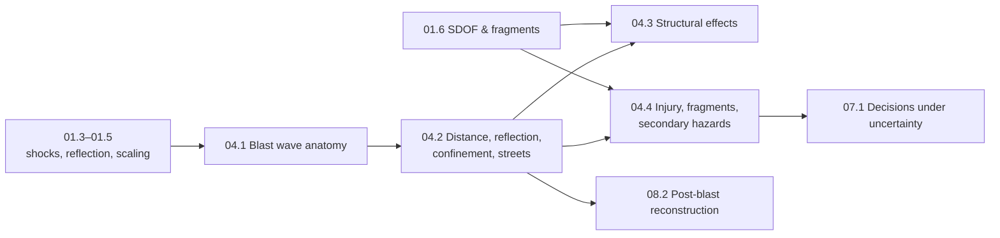

# Stage 4 · Blast effects

**Purpose** Turn the shock physics of Stage 1 into the quantities that protective decisions are
actually made with: how a blast wave is described and measured, how distance, surfaces,
confinement and streets change it, what it does to glazing, walls and frames, and how it injures
people. Everything is framed from the protective side — standoff, shielding, structural
hardening, injury prevention and evacuation under uncertainty.

**Prerequisites** [01.3 Waves → shocks](lessons/stage-01/lesson-03.md) · [01.4 Reflection & dynamic pressure](lessons/stage-01/lesson-04.md) · [01.5 Scaling laws](lessons/stage-01/lesson-05.md) · [01.6 Structural response & fragments](lessons/stage-01/lesson-06.md) · [02.2 Deflagration vs detonation](lessons/stage-02/lesson-02.md)

**Estimated time** 24 h · **Level** Intermediate · **Simulator** [Sim D · Blast Physics](sims/blast-physics/index.html) · **Project** [P01 Blast-wave visualisation](projects/p01-blast-wave/README.md)

blast physicsscalingSDOFP–I diagramsinjury criteriariskSim D

## Lessons

| Id | Lesson | Time | Level | Core tools |
|---|---|---|---|---|
| [04.1](lessons/stage-04/lesson-01.md) | Anatomy of a blast wave | 6 h (3 theory · 1.5 sim · 1.5 code) | Intermediate | Friedlander waveform, impulse integral, arrival-time integral, Kinney–Graham fits, measurement & fit uncertainty |
| [04.2](lessons/stage-04/lesson-02.md) | Distance, reflection, confinement & urban environments | 6 h (3 · 2 · 1) | Intermediate | scaled distance in practice, surface-burst factor, Mach reflection, quasi-static gas pressure & venting, street channelling |
| [04.3](lessons/stage-04/lesson-03.md) | Structural effects | 6 h (3 · 1 · 2) | Intermediate → Advanced | glazing hazard, resistance functions, SDOF equivalent systems, P–I diagrams, progressive collapse, quantity-distance |
| [04.4](lessons/stage-04/lesson-04.md) | Injury mechanisms, fragmentation & secondary hazards | 6 h (3 · 1 · 2) | Intermediate → Advanced | blast-injury classes, P–I-style injury criteria, hazardous fragment density, stand-off derivation, Monte Carlo evacuation radius |

**What this stage deliberately leaves out, and why.** Stage 4 is about *effects and protection*.
It never asks "how much of X is needed to achieve damage Y", and it never relates any quantity to
a real explosive, charge or device. All sources are expressed in abstract **yield units (YU)** and
every scenario is fictional; empirical curves are used exactly as they are used in public
protective-design and explosives-safety documents (UFC 3-340-02, IATG 01.80/02.20, DESR 6055.09):
to size standoff, hardening, venting and evacuation. Placement, configuration or optimisation of
any source for effect, device design and any render-safe or disposal technique are out of scope
for the whole course. Injury material is at the level of published biomechanics reviews and is
used only to explain why distance, shielding and protection work.

## How to work through this stage

1. Read 04.1 with Sim D open; reproduce every number in the gauge panel by hand once.
2. In 04.2 use the wave-field scenes (wall, corner, street, room) as a laboratory — predict first,
   then run.
3. 04.3 and 04.4 are the "so what": structural response and injury, closing with a probabilistic
   evacuation-radius model that feeds directly into [07.1](lessons/stage-07/lesson-01.md).
4. Case studies that exercise this stage: [Oklahoma City 1995](case-studies/cs03-oklahoma-city.md)
   (progressive collapse) and [Boston 2013](case-studies/cs07-boston-2013.md) (urban injury
   patterns, response).

## Stage gate

[Stage 4 assessment](assessments/stage-04.md) — 8 problems (mathematical, interpretation,
programming, design), the Sim D challenge set at Advanced, and a protective-design critique of a
fictional building.
