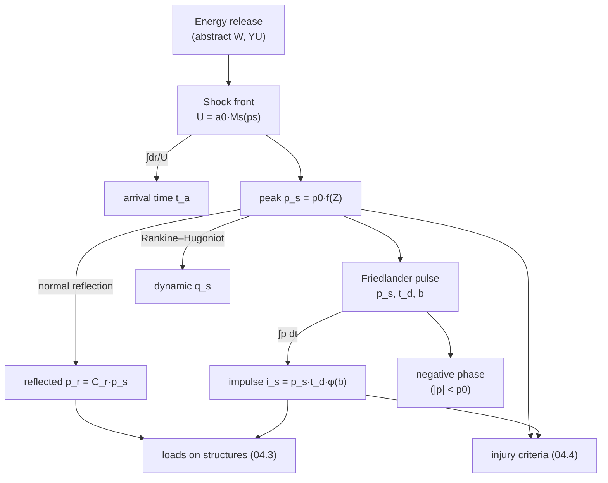

# 04.1 · Anatomy of a blast wave

<div class="module-card">

**Prerequisites** [01.3 Waves: acoustics → shocks](lessons/stage-01/lesson-03.md) (Rankine–Hugoniot, $M_s$ ↔ overpressure) · [01.4 Reflection & dynamic pressure](lessons/stage-01/lesson-04.md) · [01.5 Scaling laws](lessons/stage-01/lesson-05.md) (Hopkinson–Cranz, Sachs) · [02.2 Deflagration vs detonation](lessons/stage-02/lesson-02.md).

**Estimated time** 6 h (3 h theory · 1.5 h simulator · 1.5 h programming) · **Level** Intermediate

**Next** [04.2 Distance, reflection, confinement & urban environments](lessons/stage-04/lesson-02.md).

<p class="tags"><span>physics</span><span>empirical fits</span><span>measurement</span><span>uncertainty</span><span>Sim D</span><span>P01</span></p>
</div>

## Why this matters

Every protective number in EOD work — a cordon radius, a shelter-in-place boundary, the standoff
at which a window or wall is expected to survive, the separation between two ammunition stores —
is ultimately read off a small family of curves: peak overpressure, positive-phase duration,
impulse and arrival time as functions of **scaled distance**. Those curves are empirical fits to
decades of trials, compressed into a handful of formulas. To use them professionally you need to
know three things: what physical waveform they summarise, where they are valid, and how wrong
they can be. This lesson builds that waveform (the Friedlander pulse), derives its impulse,
computes arrival time from the Rankine–Hugoniot shock speed of 01.3, introduces the two fit
families you will meet in public standards (Kinney–Graham and Kingery–Bulmash), and ends with how
the pulse is measured and what error bars the fits carry. Sim D's gauge panel is exactly this
lesson in executable form.

## Learning objectives

1. Describe a free-field blast pressure history in terms of arrival time $t_a$, peak incident
   overpressure $p_s$, positive-phase duration $t_d$, decay coefficient $b$, positive impulse
   $i_s$ and the negative phase — and sketch it to scale.
2. Derive the positive-phase impulse of the Friedlander waveform,
   $i = p_s t_d\,[1/b - (1-e^{-b})/b^2]$, and recover $b$ from measured $(p_s, t_d, i_s)$.
3. Compute shock arrival time as $t_a = \int dr/U(r)$ using the Rankine–Hugoniot shock speed and
   an overpressure–distance fit.
4. Evaluate the Kinney–Graham fits at a given scaled distance, state their validity range and
   contrast them with Kingery–Bulmash (UFC 3-340-02), including the distribution limits on the
   original report.
5. Explain the difference between side-on, face-on (reflected) and stagnation measurements and
   choose the right one for a given question.
6. Quantify how a ±20 % scatter in an empirical fit propagates into distance and equivalent-yield
   uncertainty.

## Theory

### 1. The free-field pressure history

A pressure gauge at distance $R$ from a compact, rapid energy release in open air records a
characteristic history (Sim D, top-left panel):

1. **Quiescence** until the shock arrives at $t_a$ — nothing propagates faster than the shock.
2. An effectively **instantaneous rise** (microseconds; 01.3 showed the shock is a few mean free
   paths thick) to the peak overpressure $p_s$.
3. A roughly exponential **decay** through ambient at $t_a + t_d$. The area under this
   *positive phase* is the positive impulse $i_s$.
4. A longer, shallower **negative phase** below ambient: the outward-moving gas overshoots,
   leaving a rarefied region behind the front. Its magnitude can never exceed $p_0$ (absolute
   pressure cannot go negative) and is typically a modest fraction of $p_s$ except far away.
5. Return to ambient, sometimes with a small second shock.

The standard description of the positive phase is the **modified Friedlander equation**
(Friedlander 1946; stated in this form by Rigby et al. 2014), with $t$ measured from arrival:

<div class="callout eq">

$$ p(t) = p_s\left(1 - \frac{t}{t_d}\right)\exp\!\left(-\frac{b\,t}{t_d}\right), \qquad 0 \le t \le t_d. $$

</div>

| Symbol | Meaning | SI unit | Dimensions |
|---|---|---|---|
| $p(t)$ | overpressure above ambient at the gauge | Pa (kPa in practice) | M L⁻¹ T⁻² |
| $p_s$ | peak incident (side-on) overpressure | Pa | M L⁻¹ T⁻² |
| $t$ | time since shock arrival | s (ms in practice) | T |
| $t_d$ | positive-phase duration | s | T |
| $b$ | waveform (decay) coefficient | — | 1 |
| $t_a$ | arrival time (time from release to shock arrival) | s | T |

<div class="callout physics">

**Intuition.** Three numbers shape the pulse: how high ($p_s$), how long ($t_d$), and how
"front-loaded" ($b$). Small $b$ gives an almost linear (triangular) decay; large $b$ gives a sharp
spike with a long low tail. Near the source the pulse is spiky (large $b$); far away it relaxes
toward a triangle. The $(1-t/t_d)$ factor guarantees the zero crossing at exactly $t_d$; the
exponential shapes the decay. It is a *fit form*, not a solution of the Euler equations — chosen
because it is simple, has the right qualitative shape and integrates in closed form.

</div>

### 2. Positive-phase impulse — derivation

Impulse per unit area is the time integral of overpressure over the positive phase:

$$ i_s = \int_0^{t_d} p(t)\,dt = p_s \int_0^{t_d}\left(1-\frac{t}{t_d}\right)e^{-bt/t_d}\,dt. $$

Substitute $\tau = t/t_d$, $dt = t_d\,d\tau$:

$$ i_s = p_s t_d \int_0^1 (1-\tau)e^{-b\tau}\,d\tau = p_s t_d\left[\int_0^1 e^{-b\tau}d\tau - \int_0^1 \tau e^{-b\tau}d\tau\right]. $$

The first integral is $(1-e^{-b})/b$. For the second, integrate by parts ($u=\tau$, $dv=e^{-b\tau}d\tau$):

$$ \int_0^1 \tau e^{-b\tau}\,d\tau = \left[-\frac{\tau e^{-b\tau}}{b}\right]_0^1 + \frac1b\int_0^1 e^{-b\tau}d\tau = -\frac{e^{-b}}{b} + \frac{1-e^{-b}}{b^2}. $$

Subtracting,

$$ \frac{1-e^{-b}}{b} + \frac{e^{-b}}{b} - \frac{1-e^{-b}}{b^2} = \frac1b - \frac{1-e^{-b}}{b^2}, $$

<div class="callout eq">

$$ \boxed{\,i_s = p_s\,t_d\left[\frac1b - \frac{1-e^{-b}}{b^2}\right] \equiv p_s\,t_d\,\phi(b)\,} $$

</div>

| Symbol | Meaning | SI unit |
|---|---|---|
| $i_s$ | positive-phase specific impulse (per unit area) | Pa·s (kPa·ms in practice; 1 kPa·ms = 1 Pa·s) |
| $\phi(b)$ | shape factor: impulse as a fraction of the rectangle $p_s t_d$ | — |

**Checks.** As $b\to0$: $e^{-b} = 1 - b + b^2/2 - b^3/6 + \dots$ gives
$\phi = \tfrac12 - \tfrac{b}{6} + O(b^2) \to \tfrac12$ — the triangle, as it must be. $\phi$ decreases
monotonically: $\phi(0.5)=0.426$, $\phi(1) = e^{-1} = 0.368$ (a pleasant closed form),
$\phi(2)=0.284$, $\phi(5)=0.160$.

**Numerical example** (the Sim D default family). A fictional free-air release of $W = 8$ YU
observed at $R=4$ m, i.e. $Z = 4/8^{1/3} = 2.0$ m·YU⁻¹ᐟ³. The Kinney–Graham fits (§4) give
$p_s = 207.9$ kPa, $t_d = 2.34$ ms, $i_s = 172.8$ kPa·ms. Then
$\phi = 172.8/(207.9 \times 2.34) = 0.355$, which inverts to $b = 1.125$. A triangle with the same
peak and duration would carry $0.5 \times 207.9 \times 2.34 = 243.3$ kPa·ms — 41 % more. The
shape factor matters.

```python
import numpy as np
from scipy.optimize import brentq
from scipy.integrate import trapezoid

def phi(b):
    """Friedlander shape factor: i_s / (p_s t_d)."""
    b = np.asarray(b, dtype=float)
    return 1.0 / b - (1.0 - np.exp(-b)) / b**2

def friedlander(t, ps, td, b):
    t = np.asarray(t, dtype=float)
    return np.where((t >= 0) & (t <= td), ps * (1 - t / td) * np.exp(-b * t / td), 0.0)

def decay_from_impulse(ps, td, i):
    """Invert phi(b) = i/(ps td); requires 0 < i/(ps td) < 0.5."""
    return brentq(lambda b: phi(b) - i / (ps * td), 1e-6, 100.0)

b = decay_from_impulse(207.9, 2.34, 172.8)
t = np.linspace(0, 2.34, 20001)
print(b, trapezoid(friedlander(t, 207.9, 2.34, b), t))   # ≈ 1.125, ≈ 172.8 kPa·ms
```

<details class="answer"><summary>Exercise 1 — then reveal</summary>

A gauge records $p_s = 50$ kPa, $t_d = 10$ ms, $i_s = 150$ kPa·ms. (a) Find $b$. (b) What
impulse would you have assumed with a triangular idealisation? (c) Why can a measured ratio
$i_s/(p_s t_d) > 0.5$ not be represented by this equation, and what might it mean physically?

*Answer.* (a) $\phi = 150/500 = 0.30$ ⇒ $b \approx 1.77$. (b) $0.5 \times 50 \times 10 = 250$
kPa·ms, a 67 % overestimate. (c) $\phi(b)<0.5$ for all $b>0$; a "fuller-than-triangle" pulse
indicates a non-ideal source (slow energy release, e.g. a deflagration), a reflection arriving
before $t_d$, or gauge problems (thermal drift, ringing). You would reach for a different fit form
or examine the record before trusting it.

</details>

### 3. The negative phase

Extending the Friedlander form beyond $t_d$ gives a negative lobe. Setting $dp/dt=0$ with
$\tau=t/t_d$ gives the minimum at $\tau = 1 + 1/b$ with

$$ p_{\min} = -\frac{p_s}{b}\,e^{-(1+b)} . $$

For $b = 1.125$ and $p_s = 207.9$ kPa this is $-22.1$ kPa at $\tau = 1.89$. Rigby et al. (2014)
show that simply extending the positive-phase fit is a poor model of the negative phase and
compare alternative formulations; the negative phase matters for **flexible, lightweight
targets** (glazing, cladding) that can rebound outward, and it is the reason window fragments are
sometimes found *outside* a building. For heavy elements, the positive phase dominates.

<details class="answer"><summary>Exercise 2 — then reveal</summary>

Show that the extended Friedlander negative impulse $\int_{t_d}^{\infty} p\,dt$ equals
$-p_s t_d\,e^{-b}/b^2$. Evaluate it for $b=1.125$, $p_s = 207.9$ kPa, $t_d=2.34$ ms and compare to
the positive impulse.

*Answer.* With $\tau=1+s$: $\int_0^\infty (-s)e^{-b(1+s)}ds = -e^{-b}/b^2$. Numerically
$-207.9\times2.34\times e^{-1.125}/1.266 = -125$ kPa·ms, 72 % of the positive impulse — which
overstates what experiments show at this range. That is the point of Rigby et al.: the naive
extension is not a physical model.

</details>

### 4. Empirical fits: Kinney–Graham and Kingery–Bulmash

Hopkinson–Cranz scaling (01.5) says that for geometrically similar sources in the same
atmosphere, $p_s$ and $b$ are functions of $Z = R/W^{1/3}$ only, while $t_a$, $t_d$ and $i_s$
scale as $W^{1/3}\times f(Z)$. So one curve per quantity describes every yield. In this course $W$
is in abstract YU and $Z$ in m·YU⁻¹ᐟ³; the published fits are in m·kg⁻¹ᐟ³ of TNT-equivalent mass.

**Kinney–Graham (1985)** give analytic fits for a spherical free-air burst. The overpressure fit:

<div class="callout eq">

$$ \frac{p_s}{p_0} = \frac{808\left[1+\left(\dfrac{Z}{4.5}\right)^2\right]}{\sqrt{1+\left(\dfrac{Z}{0.048}\right)^2}\sqrt{1+\left(\dfrac{Z}{0.32}\right)^2}\sqrt{1+\left(\dfrac{Z}{1.35}\right)^2}} $$

$$ \frac{t_d}{W^{1/3}} = \frac{980\left[1+\left(\frac{Z}{0.54}\right)^{10}\right]}{\left[1+\left(\frac{Z}{0.02}\right)^{3}\right]\left[1+\left(\frac{Z}{0.74}\right)^{6}\right]\sqrt{1+\left(\frac{Z}{6.9}\right)^{2}}}\ \text{ms},\qquad
\frac{i_s}{W^{1/3}} = \frac{0.067\sqrt{1+\left(\frac{Z}{0.23}\right)^4}}{Z^2\sqrt[3]{1+\left(\frac{Z}{1.55}\right)^3}}\ \text{bar·ms} $$

</div>

| Symbol | Meaning | Unit |
|---|---|---|
| $Z$ | scaled distance $R/W^{1/3}$ | m·YU⁻¹ᐟ³ (literature: m·kg⁻¹ᐟ³) |
| $p_0$ | ambient pressure (101.325 kPa at sea level) | kPa |
| $t_d/W^{1/3}$ | scaled duration | ms·YU⁻¹ᐟ³ |
| $i_s/W^{1/3}$ | scaled impulse (1 bar·ms = 100 kPa·ms) | bar·ms·YU⁻¹ᐟ³ |

These are the exact functions in `sims/common/blast.js` (`kgOverpressureRatio`,
`kgDurationScaled`, `kgImpulseScaled`).

**Physical intuition for the shape.** Read the overpressure fit as a product of power laws with
"corner" distances. At large $Z$ it behaves like $808\cdot(Z/4.5)^2 / (Z^3/(0.048\cdot0.32\cdot1.35)) \propto 1/Z$
— acoustic spherical spreading, the far-field limit from 01.3. Between the corners it falls
faster (local log–log slope about −2.2 for $1 \lesssim Z \lesssim 3$) because strong shocks
dissipate energy irreversibly (the entropy argument of 01.3). Near $Z \to 0$ it saturates at a
large but finite value — where, physically, the fit has no business being used.

| $Z$ [m·YU⁻¹ᐟ³] | 1 | 2 | 3 | 5 | 10 | 20 | 40 |
|---|---|---|---|---|---|---|---|
| $p_s$ [kPa] | 1009 | 208 | 82.3 | 29.2 | 10.0 | 4.39 | 2.12 |
| $t_d/W^{1/3}$ [ms] | 0.52 | 1.17 | 1.68 | 2.47 | 3.47 | 3.98 | 4.15 |
| $i_s/W^{1/3}$ [kPa·ms] | 117 | 86.4 | 62.7 | 38.9 | 19.6 | 9.81 | 4.91 |
| local slope $d\ln p_s/d\ln Z$ | −2.16 | — | −2.20 | — | −1.32 | — | −1.02 |

**Validity ranges (IATG 01.80).** IATG 01.80 §5.1.1 notes that the Kinney–Graham fit derives
from spherical free-air bursts and is validated up to $Z = 500$, whereas **Kingery–Bulmash** is
for hemispherical surface bursts and is limited to $Z \le 40$. In both families the near field
(roughly $Z \lesssim 1$) is the least reliable: the fireball and detonation products are still
interacting with the shock, and gauges struggle to survive.

**Kingery–Bulmash (1984)** is the reference compilation behind US protective design: high-order
polynomial fits in $\log Z$ to many trials, for both spherical free-air and hemispherical surface
bursts, for $p_s$, reflected pressure, impulses, $t_a$, $t_d$ and shock-front velocity. The
original BRL report (ARBRL-TR-02555, DTIC AD-B082713) is **distribution-limited**; the public
route to the same curves is **UFC 3-340-02** *Structures to Resist the Effects of Accidental
Explosions*, Chapter 2 (approved for public release), together with the reflection-coefficient
chart (Fig. 2-193), and the UN SaferGuard online calculator. Because UFC 3-340-02 is the governing
US standard for protective structures, "the K-B curves" is what an engineer means by "the
standard curves". Kinney–Graham is preferred in teaching because it is closed-form and differentiable.

**Numerical example.** For $Z=2$: $1+(2/4.5)^2 = 1.1975$; the three root terms are
$\sqrt{1+1736.1}=41.68$, $\sqrt{1+39.06}=6.329$, $\sqrt{1+2.195}=1.787$; product $471.5$. So
$p_s/p_0 = 808\times1.1975/471.5 = 2.052$ ⇒ $p_s = 207.9$ kPa. ✔ (matches the table and Sim D.)

```python
P0 = 101.325  # kPa

def kg_ps(Z, p0=P0):
    Z = np.asarray(Z, dtype=float)
    num = 808 * (1 + (Z / 4.5) ** 2)
    den = np.sqrt(1 + (Z / 0.048) ** 2) * np.sqrt(1 + (Z / 0.32) ** 2) * np.sqrt(1 + (Z / 1.35) ** 2)
    return p0 * num / den                                    # kPa

def kg_td(Z, W):   # ms
    Z = np.asarray(Z, dtype=float)
    return np.cbrt(W) * 980 * (1 + (Z / 0.54) ** 10) / (
        (1 + (Z / 0.02) ** 3) * (1 + (Z / 0.74) ** 6) * np.sqrt(1 + (Z / 6.9) ** 2))

def kg_is(Z, W):   # kPa·ms
    Z = np.asarray(Z, dtype=float)
    return np.cbrt(W) * 100 * 0.067 * np.sqrt(1 + (Z / 0.23) ** 4) / (Z**2 * np.cbrt(1 + (Z / 1.55) ** 3))

W, R = 8.0, 4.0
Z = R / np.cbrt(W)
print(Z, kg_ps(Z), kg_td(Z, W), kg_is(Z, W))   # 2.0, 207.9, 2.34, 172.8
```

<div class="callout hazard">

**Two independently fitted curves are not automatically consistent.** Beyond $Z\approx2$ the
Kinney–Graham duration and impulse fits together imply a pulse with $\phi$ close to or above 0.5
— nearly triangular or "fuller than a triangle". Sim D handles this explicitly (see the comment in
`predict()`): it floors $b$ at 0.5 and stretches $t_d$ so that the *impulse* fit is honoured,
because impulse is what governs most structural and injury responses in that regime. Every tool
you use makes a choice like this; find it before trusting the tool.

</div>

<details class="answer"><summary>Exercise 3 — then reveal</summary>

(a) At what scaled distance does the Kinney–Graham fit give $p_s = 35$ kPa? (b) What are the
corresponding ranges for 1 YU and for 1000 YU? (c) Show from the fit that at very large $Z$,
$p_s \approx C p_0/Z$, and find $C$.

*Answer.* (a) Solve numerically: $Z = 4.54$. (b) $4.54$ m and $45.4$ m — a thousand-fold yield
increase multiplies range by only 10. (c) At large $Z$ the numerator $\to 808 Z^2/4.5^2$ and the
denominator $\to Z^3/(0.048\cdot0.32\cdot1.35)$, so $C = 808 \times 0.020736/20.25 = 0.827$
m·YU⁻¹ᐟ³. Check: $0.827\,p_0/40 = 2.10$ kPa vs the full fit's 2.12 kPa at $Z=40$.

</details>

### 5. Arrival time as an integral

A shock of overpressure $p_s$ travels at $U = a_0 M_s$ with, from 01.3 (γ = 1.4),

$$ M_s(p_s) = \sqrt{1 + \frac{\gamma+1}{2\gamma}\frac{p_s}{p_0}} = \sqrt{1 + \frac{6}{7}\frac{p_s}{p_0}} . $$

Because $p_s$ decays with distance, the front decelerates. The time to reach $R$ is

<div class="callout eq">

$$ t_a(R) = \int_{r_0}^{R} \frac{dr}{U(r)} = \int_{r_0}^{R}\frac{dr}{a_0\,\sqrt{1+\frac{6}{7}\,p_s\!\big(r/W^{1/3}\big)/p_0}} . $$

</div>

| Symbol | Meaning | Unit |
|---|---|---|
| $U(r)$ | shock-front speed at radius $r$ | m/s |
| $a_0$ | ambient sound speed (340.3 m/s at 15 °C) | m/s |
| $r_0$ | starting radius of the integration (Sim D: $0.05\,W^{1/3}$) | m |

**Intuition.** Near the source the shock is several times supersonic, so it "gains" time on a
sound wave; far away $U\to a_0$ and $t_a \approx \text{const} + R/a_0$. Arrival time is the most
robust quantity a sparse sensor network measures — which is why it is the backbone of source
localisation in forensics (the inverse problem is in [08.2](lessons/stage-08/lesson-02.md)). Hopkinson scaling implies
$t_a/W^{1/3} = g(Z)$.

**Numerical example.** For $W=8$ YU, $R=4$ m, the integral (400-point midpoint rule) gives
$t_a = 3.77$ ms. A sound wave would take $4/340.3 = 11.75$ ms. At the gauge the front is still
travelling at $M_s = \sqrt{1 + (6/7)(207.9/101.3)} = 1.661$, i.e. 565 m/s.

```python
def arrival_time(R, W, a0=340.3, p0=P0, n=400):
    """t_a [ms] by midpoint integration of dr / U(r)."""
    r0 = 0.05 * np.cbrt(W)
    r = r0 + (np.arange(n) + 0.5) * (R - r0) / n
    M = np.sqrt(1 + 6 / 7 * kg_ps(r / np.cbrt(W), p0) / p0)
    return 1e3 * np.sum((R - r0) / n / (a0 * M))

print(arrival_time(4.0, 8.0))   # ≈ 3.77 ms
```

<details class="answer"><summary>Exercise 4 — then reveal</summary>

(a) Using the scaling law, predict $t_a$ at $R=8$ m for $W = 64$ YU without integrating. (b) Why
is the choice of $r_0$ nearly irrelevant for $R \gg r_0$ but important for small $R$? (c) Two
gauges on the same radial line at 10 m and 12 m from a 8 YU release record arrivals 5.34 ms
apart (fictional). What does that imply about the mean front speed and $p_s$ between them?

*Answer.* (a) $Z = 8/4 = 2$, the same as the example, so $t_a = 3.77 \times (64/8)^{1/3} = 7.54$ ms.
(b) The integrand $1/U$ is small near the source (very fast shock), so the region $r<r_0$ adds
only a tiny time; the fit also breaks down there, which is why we cut it off. For $R$ close to
$r_0$ the neglected segment is a large fraction of the total. (c) $\bar U = 2/0.00534 = 374$ m/s,
$\bar M = 1.100$ ⇒ $p_s \approx 101.3\times\tfrac76(1.100^2-1) = 24.8$ kPa — between the fit values at
10 m (29.2) and 12 m (21.3), as it should be. Recall the 01.3 warning: here
$2M^2/(M^2-1)\approx 11.5$, so a 1 % timing error becomes an ~11 % pressure error.

</details>

### 6. Dynamic and reflected pressure at the gauge

The quantities from 01.4 complete the description. For γ = 1.4 (Glasstone & Dolan §3.55–3.56;
IATG 01.80):

$$ q_s = \frac52\,\frac{p_s^2}{7p_0 + p_s}, \qquad p_r = 2p_s\,\frac{7p_0 + 4p_s}{7p_0 + p_s}, \qquad C_r = p_r/p_s \in [2, 8]. $$

At $Z=2$ ($p_s=207.9$ kPa): $q_s = 117.8$ kPa, $p_r = 698.7$ kPa, $C_r = 3.36$. The ideal-gas
upper limit $C_r=8$ is exceeded in real near-field blasts (real-gas effects; UFC 3-340-02 charts
show values of about 13 or more), so the closed form is non-conservative very close in. Oblique
reflection is treated in 04.2.

### 7. Measurement: what a gauge actually sees

| Configuration | What it measures | Typical use | Pitfalls |
|---|---|---|---|
| **Side-on (incident)** — pencil probe with its axis along the flow, or a gauge flush in the ground surface facing up | static overpressure $p_s(t)$, undisturbed by the probe | free-field characterisation, fit validation | misalignment turns part of $q$ into a pressure error; ground gauges see a surface-burst field |
| **Face-on (reflected)** — gauge flush in a rigid wall facing the source | reflected pressure $p_r(t)$ | loads on structures; P–I assessments | wall must be large enough that *clearing* (rarefaction from the edges, 04.2) does not arrive before $t_d$ |
| **Stagnation (total head)** — probe facing the flow | ≈ $p_s + q_s$ for the subsonic flow behind a moderate shock | inferring dynamic pressure $q = p_{\text{stag}} - p_s$ | compressibility corrections for strong shocks; debris impact |

**Instrumentation physics.** Piezoelectric and piezoresistive transducers with natural
frequencies of hundreds of kHz; sampling at ≥ 1 MHz to resolve a rise of microseconds and a
duration of milliseconds. Error sources: thermal transients from the fireball (drift), mount
ringing, cable noise, acceleration sensitivity, and the finite sensing face (a gauge of diameter
$d$ smears a front moving at $U$ over $d/U$ — 10 µs for 5 mm at 500 m/s). Peak values are
commonly obtained by fitting a Friedlander curve to the post-ring-down record and extrapolating
back to $t_a$, which is itself a modelling choice.

**Numerical example.** Side-on reading 50 kPa ⇒ face-on $p_r = 2\cdot50(708.3+200)/(708.3+50) = 119.8$
kPa ($C_r=2.40$); dynamic pressure $q = 2.5\cdot2500/758.3 = 8.23$ kPa; a stagnation probe would
read ≈ 58.2 kPa. Confusing configurations is a factor-of-2.4 error at this level.

```python
def dynamic_pressure(ps, p0=P0):  return 2.5 * ps**2 / (7 * p0 + ps)
def reflected(ps, p0=P0):         return 2 * ps * (7 * p0 + 4 * ps) / (7 * p0 + ps)
ps = 50.0
print(reflected(ps), dynamic_pressure(ps), ps + dynamic_pressure(ps))   # 119.8, 8.23, 58.2
```

<details class="answer"><summary>Exercise 5 — then reveal</summary>

A test report lists a "peak pressure of 240 kPa" at a scaled distance where the fit predicts
$p_s \approx 100$ kPa, with no gauge orientation given. What single hypothesis explains the
discrepancy, and how would you check it from the trace alone?

*Answer.* A face-on gauge: at $p_s = 100$ kPa, $p_r = 2\cdot100(709.3+400)/(709.3+100) = 274$ kPa,
i.e. within ~15 % of 240 — inside the scatter band. Check: a reflected record near a finite wall
shows an early drop when clearing waves arrive (duration shorter than the free-field $t_d$), and
the impulse will be well above the side-on fit. A true side-on 2.4× excess is implausible.

</details>

### 8. How wrong are the fits? Propagating uncertainty

Empirical blast curves scatter against trials by roughly ±10–30 % in peak pressure, more in the
near field and for non-ideal sources; Farrimond et al. (2024) test Kingery–Bulmash against
historic and new arena data and ask whether far-field loading is even deterministic. For a
decision what matters is how that scatter maps into *distance* and *equivalent yield*.

Let $n = -\,d\ln p_s/d\ln Z$ be the local log–log slope. A relative pressure error $\epsilon_p$
maps to

$$ \frac{\delta Z}{Z} \approx \frac{\epsilon_p}{n}, \qquad \frac{\delta W}{W} \approx \frac{3\,\epsilon_p}{n}. $$

| Symbol | Meaning | Unit |
|---|---|---|
| $n$ | local decay exponent of $p_s(Z)$ (≈ 2.2 near $Z = 3$, → 1 far away) | — |
| $\epsilon_p$ | relative uncertainty in $p_s$ | — |

**Intuition.** Where pressure decays steeply, a pressure error is a small distance error. In the
far field ($n\to1$) the same pressure error becomes a proportional distance error and a *tripled*
yield error. Far-field predictions are the most uncertain in the terms that matter for cordons.

**Numerical example.** At $Z=3$, ±20 % in $p_s$ (82.3 → 65.9 / 98.8 kPa): inverting the fit gives
$Z = 3.32$ / $2.76$, i.e. −8 %/+11 %, and yield-equivalent factors $1.36$ / $0.78$ — linearised
estimate $3\times0.2/2.2 = 27$ %. The same ±20 % at $Z = 40$ ($n=1.02$) is ≈ ±20 % in distance.

```python
def local_slope(Z, h=1e-5):
    return -(np.log(kg_ps(Z * (1 + h))) - np.log(kg_ps(Z))) / np.log(1 + h)

def Z_of_ps(ps):
    return brentq(lambda z: kg_ps(z) - ps, 0.05, 500)

for f in (0.8, 1.2):
    print(f, Z_of_ps(kg_ps(3.0) * f))        # 3.32, 2.76
print(local_slope(3.0), local_slope(40.0))  # 2.20, 1.02
```

<details class="answer"><summary>Exercise 6 — then reveal</summary>

Your cordon criterion is $p_s \le 5$ kPa. The fit gives $Z = 17.8$ for that. If the fit might
underpredict by 25 %, by how much must the scaled radius grow to preserve the criterion? Use both
the linearisation and an exact inversion.

*Answer.* The worst case is "true $p_s$ = 1.25 × fit", so we need the fit to give 4.0 kPa:
exact inversion $Z(4.0) = 21.8$ (+22 %). Linearised with $n(17.8)\approx1.11$:
$\ln1.25/1.11 = 0.20$ ⇒ +22 %. Both say: ~20 % more radius, or equivalently designing for
~1.8× the nominal yield. Uncertainty is not a footnote — it is a design input (04.4).

</details>

## Visual explanation



<iframe class="sim-frame" src="sims/blast-physics/index.html?embed=1" height="760" loading="lazy"></iframe>

<a class="sim-link" href="sims/blast-physics/index.html" target="_blank">Open Sim D full-screen ↗</a>

## Worked example — characterising a fictional trial record

A fictional research range records a free-air release of **27 YU** (sea level) with three side-on
gauges. You are asked to predict the records, then to check one of them.

1. **Scaled distances.** $W^{1/3}=3$. Gauges at 6, 15 and 60 m ⇒ $Z = 2, 5, 20$.
2. **Peaks** from the fit: 207.9, 29.2 and 4.39 kPa.
3. **Durations** $t_d = W^{1/3}\cdot(t_d/W^{1/3})$: $3\times1.17=3.51$, $3\times2.47=7.42$,
   $3\times3.98=11.9$ ms.
4. **Impulses**: $3\times86.4 = 259$, $3\times38.9=117$, $3\times9.81 = 29.4$ kPa·ms.
5. **Shape.** Gauge 1: $\phi = 259/(207.9\times3.51) = 0.355$ ⇒ $b = 1.125$ (same as the $Z=2$
   example — similarity!). Gauges 2 and 3 fall in the regime where the independent fits imply
   $\phi \gtrsim 0.5$; Sim D would report $b=0.5$ with a stretched $t_d$.
6. **Arrival times.** By scaling from the $Z=2$ result: $t_a = 3.77\times(27/8)^{1/3} = 5.66$ ms at
   gauge 1.
7. **Check against the record.** Gauge 2 shows a 34 kPa peak. The ratio 34/29.2 = 1.16 is inside
   the ±20–30 % scatter; nothing anomalous. The implied "effective" yield from this gauge alone is
   $27\times(Z_{29.2}/Z_{34})^3$ with $Z(34)=4.61$: $27\times(5/4.61)^3 = 34.4$ YU — a single gauge
   can suggest a 28 % yield error. Use all gauges and arrival times together (a least-squares
   fit of $W$ in log space) before concluding anything.

## Simulation work

<div class="callout sim">

**Sim D, gauge & p(Z) panels.** (1) Set $W=8$ YU, $R=4$ m, free air, sea level, wall off. Verify
$p_s$, $t_d$, $i_s$, $b$ and $t_a$ against this lesson. (2) Change $W$ to 64 YU and $R$ to 8 m:
which numbers stay the same, which double? (3) Sweep $R$ from 3 to 60 m at $W=8$ and watch $b$:
at what $Z$ does the floor $b=0.5$ engage? (4) Switch altitude to 3000 m: predict the change in
$p_s$ at fixed $R$ from Sachs scaling before looking. (5) Wave-field panel, *Open field*: place P1
close and P2 far; compare the *shape* of the two probe traces (front steepness, negative phase
depth relative to peak).

</div>

## Practical exercises

1. **Data analysis.** A fictional gauge record is sampled every 2 µs; after ring-down, the points
   $(t, p)$ = (0.1 ms, 150 kPa), (0.5, 96), (1.0, 52), (1.5, 22) are available, $t$ from arrival.
   Fit $p_s$, $t_d$, $b$ by nonlinear least squares, then state the impulse with an uncertainty
   estimated from the fit covariance.
2. **Interpretation.** Explain why the far-field positive-phase duration *increases* with $Z$
   while the peak decreases, using the fact that the front travels at ≈ $a_0$ while the tail is
   slowed by the outward flow's deceleration.
3. **Decision.** You must predict impulse at $Z = 0.6$ for a protective-design check. State which
   fit you would use, what validity caveats you would record, and what factor of safety you would
   argue for.
4. **Comparison.** Evaluate $p_s$ from Kinney–Graham at $Z=10$ for a free-air and for a
   hemispherical surface burst (×1.8 on $W$). By how much does the surface condition change the
   range at which 10 kPa occurs?

<details class="answer"><summary>Answers to 2 and 4</summary>

2. The front is nearly acoustic, but the pressure-release (rarefaction) at the tail travels into
   gas that is itself moving outward more slowly as the wave weakens; the positive phase stretches
   like a travelling N-wave. Energy spread over a longer pulse with lower amplitude — consistent
   with $i_s \propto 1/Z$ and $p_s \propto 1/Z$ giving $t_d \to$ const·$W^{1/3}$ in the far field.
4. Free air $Z=10$ ⇒ 9.99 kPa. Surface burst: $Z_{\text{eff}}=10/1.8^{1/3}=8.22$ ⇒ ≈ 13.1 kPa. The
   10 kPa range grows by $1.8^{1/3}=1.216$, i.e. +22 %.

</details>

## Programming exercise — a blast-parameter library with honest uncertainty

**Goal.** Build `blast_params.py`, a tested NumPy library that reproduces Sim D's gauge panel and
adds uncertainty bands.

- **Input:** $W$ [YU], $R$ [m], burst factor (1 or 1.8), ambient $(p_0, a_0)$, fit uncertainty
  $\sigma_{\ln p}$ (default 0.2).
- **Output:** dict of $Z, p_s, t_d, b, i_s, t_a, M_s, q_s, p_r$; and for $p_s$ and $i_s$ the
  5th/50th/95th percentiles under lognormal fit error.
- **Constraints:** vectorised over $R$; Sachs scaling for non-standard ambient (01.5); no loops
  over grid points for the fits (the arrival integral may loop over quadrature nodes).
- **Expected behaviour:** matches Sim D to 0.5 % for $W\in[0.1,1000]$, $R\in[1,300]$; $b$ never
  below 0.5 (document the stretch of $t_d$); raises a warning outside $0.5 \le Z \le 500$.
- **Test cases:** (i) $W=8$, $R=4$ ⇒ $p_s=207.9$, $t_d=2.34$, $i_s=172.8$, $b=1.125$,
  $t_a = 3.77$ ms; (ii) scaling: $p_s(8,4) = p_s(64,8)$ and $t_a(64,8) = 2\,t_a(8,4)$;
  (iii) $\phi(b)\to 1/2$ as $b\to0$ to $10^{-6}$; (iv) numerical `trapezoid` impulse equals closed form
  to $10^{-4}$ relative.
- **Extensions:** replace the Friedlander negative-phase extension with an alternative form
  discussed by Rigby et al. (2014) and compare negative impulses; add a least-squares inversion
  that estimates $W$ (and its uncertainty) from several gauges' $(p_s, t_a)$.

This is the core of [Project P01](projects/p01-blast-wave/README.md).

## Reading

- Rigby, S. E. et al., *The Negative Phase of the Blast Load*, IJPS 5(1):1–20 (2014) —
  https://eprints.whiterose.ac.uk/id/eprint/78295/ — read §2–3: modified Friedlander form,
  scaling, and why the negative phase needs its own model.
- Kinney, G. F. & Graham, K. J., *Explosive Shocks in Air*, 2nd ed., Springer (1985) —
  https://link.springer.com/book/10.1007/978-3-642-86682-1 — the chapters on free-air blast
  parameters; source of the fits used here.
- UNODA, *IATG 01.80 Formulae for ammunition management*, 3rd ed. (2021) —
  https://data.unsaferguard.org/iatg/en/IATG-01.80-Formulae-ammunition-management-IATG-V.3.pdf —
  §5.1: Hopkinson–Cranz, Sachs, K-G vs K-B validity, dynamic pressure.
- US DoD, *UFC 3-340-02 Structures to Resist the Effects of Accidental Explosions* (2008, Change 2
  2014) — https://www.wbdg.org/dod/ufc/ufc-3-340-02 — Chapter 2 curves; read them as a
  textbook of blast parameters.
- Farrimond, D. G. et al., *Far-field positive phase blast parameter characterisation of RDX and
  PETN based explosives*, IJPS 15(1):141–165 (2024) — https://eprints.whiterose.ac.uk/id/eprint/195373/
  — read the discussion of K-B accuracy and variability (skip material specifics).
- Glasstone, S. & Dolan, P. J., *The Effects of Nuclear Weapons*, 3rd ed. (1977), ch. III —
  https://atomicarchive.com/resources/documents/effects/glasstone-dolan/chapter3.html — §3.53–3.56
  for dynamic and reflected pressure.

## Assessment

1. *(Conceptual)* Why does the Friedlander equation have a $(1 - t/t_d)$ factor *and* an
   exponential? What would go wrong with a pure exponential?
2. *(Mathematical)* Show that $d\phi/db < 0$ for all $b > 0$, and hence that $b$ is uniquely
   determined by $(p_s, t_d, i_s)$ when $0<i_s/(p_s t_d)<1/2$.
3. *(Interpretation)* Two gauges at the same $R$ on opposite sides of a free-air release report
   peaks of 60 and 85 kPa. List three physical or instrumentation explanations and one test that
   distinguishes them.
4. *(Computation)* For $W = 125$ YU, compute $Z$, $p_s$, $i_s$, $t_a$ at $R=25$ m (use scaling from
   the worked examples where possible).
5. *(Design)* A colleague proposes using Kingery–Bulmash surface-burst curves at $Z = 80$ for a
   public cordon. Critique.

<details class="answer"><summary>Answers to 2, 4 and 5</summary>

2. $\phi(b)=\int_0^1(1-\tau)e^{-b\tau}d\tau$, so $\phi'(b) = -\int_0^1\tau(1-\tau)e^{-b\tau}d\tau<0$
   because the integrand is positive on (0,1). With $\phi(0^+)=1/2$ and $\phi\to0$ as $b\to\infty$, the
   inverse exists and is unique on $(0, 1/2)$.
4. $W^{1/3}=5$, $Z=5$: $p_s=29.2$ kPa, $i_s = 5\times38.9 = 194$ kPa·ms, $t_a = 5\times$(scaled $t_a$
   at $Z=5$). The integral gives $t_a \approx 17.8$ ms for 8 YU at 10 m ($Z=5$), so
   $t_a = 17.8\times5/2 = 44.5$ ms.
5. $Z=80$ is outside the K-B validity range ($Z\le40$ per IATG 01.80); either use a fit validated
   there (K-G to $Z=500$, with surface-burst factor) or justify extrapolation, and in the far field
   non-ideal atmospheric effects (wind, temperature gradients, focusing) can dominate; cordons at
   that range are usually driven by fragments and glazing, not free-field overpressure anyway (04.4).

</details>

## Expert extension

- **Where the fits come from.** Fit the Kinney–Graham functional form to a synthetic data set
  generated from the 1D spherical Euler solver of 01.3 (with a high-pressure balloon source).
  Examine which corner distances are identifiable and the posterior correlation between them.
- **Similarity of the waveform.** Show that Hopkinson scaling implies $b = b(Z)$ only, then test
  it against the Sim D outputs across yields.
- **Atmospheric propagation.** At large range, temperature and wind gradients refract the wave
  (sound-speed profiles): the same physics that makes distant thunder audible in some directions
  only. Read about far-field overpressure focusing and why regulatory far-field distances carry
  wide margins.

## What comes next

[04.2](lessons/stage-04/lesson-02.md) takes this free-field pulse into the real world: ground,
walls, corners, rooms and streets — where reflection and confinement can multiply loads, and
shielding can divide them.
