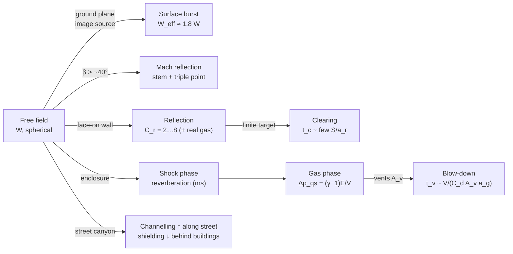

# 04.2 · Distance, reflection, confinement & urban environments

<div class="module-card">

**Prerequisites** [04.1 Anatomy of a blast wave](lessons/stage-04/lesson-01.md) · [01.4 Reflection, transmission & dynamic pressure](lessons/stage-01/lesson-04.md) (normal/oblique reflection, Mach stem) · [01.5 Scaling laws](lessons/stage-01/lesson-05.md) · [01.2 Gases & thermodynamics](lessons/stage-01/lesson-02.md) (first law, $c_v$, $\gamma$).

**Estimated time** 6 h (3 h theory · 2 h simulator · 1 h programming) · **Level** Intermediate

**Next** [04.3 Structural effects](lessons/stage-04/lesson-03.md) and [04.4 Injury, fragmentation & secondary hazards](lessons/stage-04/lesson-04.md); later [08.2 Reconstruction](lessons/stage-08/lesson-02.md).

<p class="tags"><span>physics</span><span>scaling</span><span>reflection</span><span>confinement</span><span>urban blast</span><span>Sim D</span><span>P01</span></p>
</div>

## Why this matters

The free-field curves of 04.1 describe an idealisation that almost never occurs where EOD teams
work. Real incidents happen on the ground, next to walls, inside rooms and vehicles, and in
streets lined with buildings. Each of these changes the load by factors, not percentages: the
ground roughly doubles the effective source; a wall facing the wave sees two to eight times the
incident pressure; a room traps gas and converts a millisecond pulse into a quasi-static pressure
lasting tens to hundreds of milliseconds; a street canyon channels energy along its length while
shadowing side streets. Understanding these effects is what separates a cordon drawn with a
compass from one drawn with the street map in mind — and it is why protective design specifies
vent areas, blast walls and standoff rather than "a stronger wall".

## Learning objectives

1. Use scaled distance to convert a pressure criterion into a range for any yield, and state how
   range scales with yield ($R \propto W^{1/3}$) and with a criterion change.
2. Justify the ground-reflection (surface-burst) factor with an image-source argument and explain
   why real ground gives ≈ 1.8 rather than 2.
3. Describe regular vs Mach reflection, the triple point and why oblique loads can exceed
   normal-incidence loads; locate qualitatively where a Mach stem forms.
4. Derive the quasi-static pressure of energy released in a closed volume,
   $\Delta p_{qs} = (\gamma-1)E/V$, and estimate venting time scales and gas-phase impulse.
5. Explain channelling and shielding in street canyons, bound them with a simple geometric
   model, and state why CFD is needed for real layouts.
6. Design and interpret probe experiments in Sim D's wall, corner, street and room scenes.

## Theory

### 1. Scaled distance in practice

The central practical operation is the **inverse** of 04.1: given a criterion $p^\*$ (a glazing
threshold, an injury threshold, a regulatory level), find the range.

<div class="callout eq">

$$ R^\*(W) = Z^\*\,W^{1/3}, \qquad Z^\* = f^{-1}(p^\*/p_0), $$

</div>

| Symbol | Meaning | Unit |
|---|---|---|
| $p^\*$ | criterion overpressure | kPa |
| $Z^\*$ | scaled distance at which the fit gives $p^\*$ | m·YU⁻¹ᐟ³ |
| $W$ | yield (effective, after any surface factor) | YU |
| $R^\*$ | range at which the criterion is just met | m |

**Intuition.** One inversion per *criterion*, then a cube root per *yield*. Consequences worth
memorising: doubling the yield moves every contour out by $2^{1/3} = 1.26$ (+26 %); ten times the
yield, ×2.15; a thousand times, ×10. Conversely, halving the criterion pressure in the far field
(where $p_s \propto Z^{-1}$ to $Z^{-1.3}$) roughly doubles the range — criteria matter more than
yield.

| Criterion $p^\*$ (kPa) | 35 | 10 | 5 |
|---|---|---|---|
| $Z^\*$ (K-G free air) | 4.54 | 9.99 | 17.8 |
| $R^\*$ for 1 YU (m) | 4.5 | 10.0 | 17.8 |
| $R^\*$ for 10 YU | 9.8 | 21.5 | 38.3 |
| $R^\*$ for 100 YU | 21.1 | 46.4 | 82.6 |
| $R^\*$ for 1000 YU | 45.4 | 99.9 | 177.9 |

```python
import numpy as np
from scipy.optimize import brentq
P0 = 101.325
def kg_ps(Z, p0=P0):
    return p0 * 808 * (1 + (Z / 4.5) ** 2) / (
        np.sqrt(1 + (Z / 0.048) ** 2) * np.sqrt(1 + (Z / 0.32) ** 2) * np.sqrt(1 + (Z / 1.35) ** 2))
def Z_of_ps(p):
    return brentq(lambda z: kg_ps(z) - p, 0.05, 500)
def range_for(p_crit, W, surface_factor=1.0):
    return Z_of_ps(p_crit) * np.cbrt(W * surface_factor)

print([round(range_for(p, 100), 1) for p in (35, 10, 5)])   # [21.1, 46.4, 82.6]
```

<details class="answer"><summary>Exercise 1 — then reveal</summary>

A fictional planning note states: "if the estimated yield doubles, double the cordon." (a) What
does scaling actually require? (b) Under what *non-blast* consideration might the note still be
reasonable?

*Answer.* (a) ×1.26 for any overpressure-based contour. (b) If the cordon is driven by fragment
or debris throw rather than overpressure (04.4), maximum throw ranges do not follow cube-root
scaling and conservative rules may be set independently; the note conflates two different
hazard mechanisms and should say which one it addresses.

</details>

### 2. Ground reflection and the surface-burst factor

A release on a perfectly rigid ground plane sends all its energy into a half-space. By the method
of images — reflect the source in the plane; the rigid-wall boundary condition $u_n = 0$ is
satisfied automatically by symmetry — the half-space field is identical to that of a free-air
source of energy $2W$. So for a hemispherical surface burst

<div class="callout eq">

$$ W_{\text{eff}} = \alpha\,W, \qquad \alpha = 2 \text{ (ideal rigid surface)}, \quad \alpha\approx1.8 \text{ (typical real ground)}. $$

</div>

| Symbol | Meaning | Unit |
|---|---|---|
| $\alpha$ | surface-burst (ground-reflection) factor | — |
| $W_{\text{eff}}$ | free-air-equivalent yield to use with spherical fits | YU |

**Why less than 2.** Real ground is not rigid: some energy goes into cratering, ground shock and
ejecta. The commonly used engineering value of about 1.8 (Baker et al. 1983, ch. 2; Sim D's
"surface burst" option) reflects that; values of 1.6–2.0 appear depending on soil. Kingery–Bulmash
publishes *separate* hemispherical-surface-burst fits precisely to avoid this approximation.

**Numerical example.** Criterion 20 kPa, $W = 50$ YU. Free air: $Z^\*=6.23$,
$R^\* = 6.23\times50^{1/3}= 22.9$ m. Surface burst: $R^\* = 6.23\times90^{1/3} = 27.9$ m — the
factor $1.8^{1/3}=1.216$ (+22 %).

<details class="answer"><summary>Exercise 2 — then reveal</summary>

Prove the image-source claim for the *linear* acoustic problem: show that the field of a source at
height $h$ plus an image at $-h$ satisfies $\partial p/\partial z = 0$ on $z=0$. Why does the
argument survive (exactly) for the nonlinear Euler equations only when $h=0$?

*Answer.* $p(x,y,z,t) = g(r_1,t) + g(r_2,t)$ with $r_{1,2}^2 = x^2+y^2+(z\mp h)^2$;
$\partial_z r_1 = (z-h)/r_1$, $\partial_z r_2 = (z+h)/r_2$; at $z=0$, $r_1=r_2$ and the two terms
cancel. For nonlinear flow, superposition fails, so two overlapping shocks do not simply add —
that is what produces Mach reflection (§3). With $h=0$ the image *coincides* with the source,
the combined source is just a symmetric free-air source of twice the energy, and the symmetry
plane is exactly a rigid wall: no superposition needed.

</details>

### 3. Oblique and Mach reflection

When a shock meets a surface at angle of incidence $\beta$ (measured from the surface normal):

- **Regular reflection** (small $\beta$): a reflected shock leaves the surface point; the
  reflection coefficient $C_{r\beta} = p_{r\beta}/p_s$ depends on $\beta$ and on shock strength
  (UFC 3-340-02 Fig. 2-193 charts it).
- Above a **critical angle** — roughly 40° for strong shocks, varying with strength (Schwer 2017
  discusses the UFC chart and checks it against Rankine–Hugoniot) — regular reflection is
  impossible. The incident and reflected shocks merge near the surface into a single, nearly
  normal front, the **Mach stem**, which travels along the surface. Incident, reflected and stem
  meet at the **triple point**, whose height grows with distance travelled.
- In the Mach region the loading near the surface is *higher* than free-field incident pressure
  and the reflection coefficient can exceed its normal-incidence value around the transition
  (IATG 01.80 notes increases up to about 50 %).

**Intuition.** At grazing incidence the gas behind the incident shock is deflected toward the
wall; a regular reflected shock cannot turn it back parallel to the wall, so the flow
reorganises into a stem. The ground-level blast wave from any elevated source therefore
"straightens up" beyond a certain ground range and arrives as a near-vertical wall of pressure
of height equal to the triple-point height. Anyone or anything inside the stem sees the stem
pressure, not the (lower) free-air pressure predicted at the same slant range.

**Geometry of onset** (qualitative): for a source at height $H$, the incidence angle at ground
range $x$ is $\beta = \arctan(x/H)$; with a critical angle of about 40°, the Mach region begins
near $x \approx H\tan40° = 0.84H$ — for $H = 2$ m, about 1.7 m. The triple-point path then climbs
with range; its exact trajectory is an empirical chart in UFC 3-340-02, not a closed form.

<div class="callout key">

**Protective reading.** Mach reflection explains why a pressure measured on the ground, or felt
by a person standing on it, can exceed the free-air prediction for the same slant distance, why
the load on a building façade depends on angle, and why a low wall or berm between a hazard and
people must be judged against the *stem* height and the diffraction over its top.

</div>

<details class="answer"><summary>Exercise 3 — then reveal</summary>

A fictional source is at height 3 m above flat ground. A person stands at ground range 10 m.
(a) Is the person likely in a regular- or Mach-reflection region? (b) Which pressure governs their
exposure, and is the free-air $p_s$ at slant range conservative?

*Answer.* (a) $\beta = \arctan(10/3) = 73°$ ≫ 40°: Mach region. (b) The stem pressure, which is a
reflected-type pressure exceeding free-air incident pressure at the slant range 10.4 m. Free-air
$p_s$ is **not** conservative; a surface-burst-type estimate or the UFC charts are needed.

</details>

### 4. Reflection from finite targets: clearing

A face-on wall reflects to $p_r = C_r p_s$ (04.1). If the wall is finite (a building of height
$H_b$ and width $B$), rarefaction waves from its edges travel inward at the sound speed $a_r$ of
the reflected-region gas and relieve the reflected pressure toward the stagnation pressure
$\approx p_s + q_s$. The characteristic **clearing time** is a few times $S/a_r$, where $S$ is the
smaller of $H_b$ and $B/2$. If the clearing time is short compared with $t_d$, the effective
impulse on the face is much smaller than $C_r i_s$; if long, the full reflected impulse acts.
Clearing is one of the main topics of the Isaac et al. (2023) review and is why small targets
(a person, a signpost) are loaded mostly by incident pressure plus drag, whereas a large façade
feels the full reflected pulse.

### 5. Confined (internal) blast: two phases

Inside an enclosure, the load has two physically distinct parts.

**(a) Shock phase.** The initial shock reflects from the nearest surface ($C_r$ from 04.1), then
from the others, and reverberates with decreasing amplitude. Re-reflected shocks can arrive at a
corner almost simultaneously and superpose; corners and re-entrant geometry see the highest
shock impulses. Time scale: the room's acoustic transit times, milliseconds.

**(b) Gas (quasi-static) phase.** Once the reverberations have damped out, the enclosure is filled
with gas at elevated, nearly uniform pressure. Treat the enclosure as a closed, rigid control
volume of ideal gas and apply the first law with no work and no heat loss: the released energy
$E$ raises the internal energy, $\Delta U = E$. For an ideal gas $U = pV/(\gamma-1)$, so

<div class="callout eq">

$$ \Delta p_{qs} = \frac{(\gamma - 1)\,E}{V}, \qquad \frac{\Delta p_{qs}}{p_0} = (\gamma-1)\,\varepsilon, \quad \varepsilon \equiv \frac{E}{p_0 V}. $$

</div>

| Symbol | Meaning | Unit |
|---|---|---|
| $\Delta p_{qs}$ | quasi-static overpressure (upper bound: no losses, no venting) | Pa |
| $E$ | energy released into the gas | J |
| $V$ | free volume of the enclosure | m³ |
| $\varepsilon$ | dimensionless energy loading | — |
| $\gamma$ | effective ratio of specific heats of the mixture (1.4 for air; lower for hot gas mixtures) | — |

**Numerical example.** A fictional energy release of $E = 5$ MJ into a closed $250$ m³ room:
$\varepsilon = 5\times10^6/(101\,325\times250) = 0.197$ and $\Delta p_{qs} = 0.4\times5\times10^6/250 = 8.0$
kPa. The same physics governs accidental gas explosions in buildings — the textbook non-explosive
case — and is the basis of vent sizing.

**The QS curve in abstract units.** In yield units write $E = e_Y W$ with $e_Y$ the (fictional)
energy per YU. Then

$$ \frac{\Delta p_{qs}}{p_0} = (\gamma-1)\,\kappa_Y\,\frac{W}{V}, \qquad \kappa_Y = \frac{e_Y}{p_0} \ [\text{m}^3/\text{YU}]. $$

With the course's fictional $\kappa_Y = 25$ m³/YU: loadings $W/V = 0.01, 0.05, 0.1$ YU/m³ give
$\Delta p_{qs} = 10.1, 50.7, 101$ kPa on the ideal line. Published empirical QS curves (UFC 3-340-02,
Ch. 2, which plots peak gas pressure against charge-to-free-volume ratio) are **sub-linear** at
high loading: the gas is no longer air at $\gamma = 1.4$, dissociation and heat transfer to walls
remove energy, and the ideal line becomes an upper bound. At low loading, additional energy
release from the hot products mixing with room air can push the real curve *above* the
naive estimate for a given source; which effect dominates is an empirical question — hence the
use of measured curves, and the pedagogical value of the ideal line as a first estimate.

```python
GAMMA = 1.4
def dp_quasi_static(E_J, V_m3, gamma=GAMMA):
    """Upper-bound quasi-static overpressure [Pa] for energy E released into closed volume V."""
    return (gamma - 1) * E_J / V_m3

def dp_qs_yu(W_over_V, kappa_Y=25.0, p0=P0, gamma=GAMMA):
    """Ideal QS curve in abstract units: kPa, for loading W/V in YU/m^3 (fictional kappa_Y)."""
    return (gamma - 1) * kappa_Y * np.asarray(W_over_V) * p0

print(dp_quasi_static(5e6, 250) / 1e3, dp_qs_yu([0.01, 0.05, 0.1]))   # 8.0, [10.1 50.7 101.3]
```

<details class="answer"><summary>Exercise 4 — then reveal</summary>

Show that if the enclosure gas has $\gamma = 1.25$ instead of 1.4, the ideal $\Delta p_{qs}$ for the
same $E$ and $V$ falls by 37.5 %. Why does this push the true curve below the air-only line?

*Answer.* $(1.25-1)/(1.4-1) = 0.625$. A gas with more internal degrees of freedom (hot,
polyatomic, partly dissociated) stores more energy per unit pressure; the same $E$ produces less
pressure.

</details>

### 6. Venting: how the gas pressure decays

If the enclosure has openings (windows, frangible panels, doors) of total area $A_v$, gas flows out
and the pressure decays. A first-order model treats the outflow as proportional to the
overpressure (linearised orifice flow):

<div class="callout eq">

$$ \frac{d\,\Delta p}{dt} \approx -\frac{\Delta p}{\tau_v}, \qquad \tau_v \approx \frac{V}{C_d\,A_v\,a_g}, \qquad i_{qs} \approx \Delta p_{qs}\,\tau_v . $$

</div>

| Symbol | Meaning | Unit |
|---|---|---|
| $A_v$ | vent area | m² |
| $C_d$ | discharge coefficient (≈ 0.6 sharp-edged) | — |
| $a_g$ | characteristic sound speed of the vented gas (hot gas: several hundred m/s) | m/s |
| $\tau_v$ | blow-down time constant | s |
| $i_{qs}$ | gas-phase impulse on the enclosure walls | Pa·s |

This is an order-of-magnitude model: real blow-down is choked while the pressure ratio is high and
the vent may open only after a panel fails. Its value is structural: **$\tau_v$ is proportional to
volume and inversely proportional to vent area**, and gas-phase impulse scales with $\tau_v$.

**Numerical example.** $V=100$ m³, $A_v = 4$ m², $C_d=0.6$, $a_g = 500$ m/s: $\tau_v = 100/(0.6\cdot4\cdot500) = 83$ ms.
A fictional loading $W/V = 0.05$ YU/m³ (5 YU) gives $\Delta p_{qs} = 50.7$ kPa and
$i_{qs} \approx 50.7\times83.3 = 4220$ kPa·ms. Compare the *shock* phase on the nearest wall
3 m away: $Z = 3/5^{1/3} = 1.75$, $p_s = 282$ kPa, $p_r = 1047$ kPa, reflected impulse
≈ $C_r i_s = 3.71\times161 = 596$ kPa·ms. The gas phase carries ~7× the impulse of the first
reflected shock, spread over ~50 times longer. For a wall with natural period 20 ms,
$\omega\tau_v = 2\pi/0.02\times0.083 = 26$: the gas load is effectively **quasi-static**, and a
suddenly applied constant load produces a dynamic load factor approaching 2 (01.6). With
$A_v = 1$ m², $\tau_v$ becomes 333 ms — four times the impulse.

<div class="callout safety">

**Protective consequences.** Confinement is the single largest amplifier of blast load on
surroundings and occupants: an energy release that would be survivable at a few metres in the
open can be severe in a small room. Design responses in public protective-design practice include
venting to a safe direction, frangible panels and containment cubicles (UFC 3-340-02); in
incident terms, it is one reason why interior rooms and vehicles change the hazard assessment,
and why "open the windows" appears in some shelter guidance (fewer glass fragments, faster
venting) while other guidance says stay away from windows entirely — the two address different
mechanisms.

</div>

<details class="answer"><summary>Exercise 5 — then reveal</summary>

A fictional storage room ($V = 60$ m³) must keep the gas-phase impulse on its walls below
2000 kPa·ms for a design loading giving $\Delta p_{qs} = 30$ kPa. With $C_d = 0.6$ and
$a_g = 500$ m/s, what vent area is required? Why is this only a first estimate?

*Answer.* Need $\tau_v \le 2000/30 = 66.7$ ms ⇒ $A_v \ge V/(C_d a_g \tau_v) = 60/(0.6\cdot500\cdot0.0667) = 3.0$ m².
First estimate because: the blow-down is choked early (non-linear), vent panels have mass and
opening time, the shock phase also loads the walls, and $a_g$ depends on the gas temperature.

</details>

### 7. Urban environments: channelling and shielding

Streets lined with buildings are neither free field nor enclosure. The Isaac et al. (2023)
review summarises experimental and CFD studies of blast interaction with obstacles and urban
geometries; the recurring findings are:

- **Channelling.** Along a street canyon, walls reflect energy back into the street; the wave
  cannot spread sideways, so overpressure and especially **impulse** decay more slowly with
  distance than in the open. Multiple reflections arrive after the leading shock, lengthening the
  loading.
- **Shielding.** Behind a building or wall, the wave diffracts around edges and over the top; the
  shadow region sees reduced and delayed loading — but the wave re-forms downstream, so the
  protection is local (of the order of a few obstacle heights).
- **Focusing at junctions and re-entrant corners**, where waves from several directions
  superpose.
- Simple free-field + reflection-factor methods cannot capture these effects reliably in real
  layouts; CFD with validated solvers (or scale-model experiments, legitimate by 01.5 scaling)
  is required.

**A bounding toy model.** Consider a street of width $w$ with high walls and an open top, the
source at street level. Close to the source ($R \lesssim w/2$) the front is a hemisphere of area
$2\pi R^2$. Farther along, the walls confine it to a half-cylinder (along the street and upward)
of area $\approx \pi R\,w$. If no energy were lost, the energy per unit front area would be larger
by the area ratio, which we can express as an effective yield multiplier

$$ f(R) \approx \max\!\left(1,\ \frac{2\pi R^2}{\pi R w}\right) = \max\!\left(1,\ \frac{2R}{w}\right), \qquad W_{\text{eff}} = f\,W . $$

| Symbol | Meaning | Unit |
|---|---|---|
| $w$ | street width | m |
| $f(R)$ | toy channelling multiplier on effective yield | — |

This is an **upper bound with no losses** and ignores the finite wall height; its value is to show
the *trend*: channelling grows with distance along the street, so contours stretch along streets
and shrink into side streets.

**Numerical example.** $w = 10$ m, surface burst of $W=10$ YU ($\alpha=1.8$, so 18 YU effective),
$R = 30$ m. Open ground: $Z = 30/18^{1/3} = 11.4$ ⇒ $p_s = 8.4$ kPa. Toy canyon: $f = 6$,
$W_{\text{eff}} = 108$ YU, $Z = 6.30$ ⇒ $p_s = 19.6$ kPa — an upper-bound 2.3× increase. Real
CFD results in the literature show amplification, but typically smaller than such a lossless
bound; use the toy only to decide *where* to look harder.

```python
def canyon_factor(R, w):
    return np.maximum(1.0, 2.0 * R / w)

W, alpha, R, w = 10.0, 1.8, 30.0, 10.0
for f in (1.0, canyon_factor(R, w)):
    Z = R / np.cbrt(alpha * W * f)
    print(f, round(Z, 2), round(kg_ps(Z), 1))    # 1 → 11.45, 8.4 ; 6 → 6.3, 19.6
```

<details class="answer"><summary>Exercise 6 — then reveal</summary>

Using the toy model, at what distance along a 12 m street does the channelled 10 kPa contour for
an 18 YU (effective) source lie, compared with open ground? Then list two physical effects the toy
ignores that would reduce the difference.

*Answer.* Open ground: $R = 9.99\times18^{1/3} = 26.2$ m. Canyon: solve $R = 9.99\,(18\cdot R/6)^{1/3}$
(since $f = 2R/12 = R/6 > 1$): $R^{2/3} = 9.99\cdot3^{1/3}$ ⇒ $R = (14.41)^{1.5} = 54.7$ m. Ignored:
energy escaping over finite-height walls and through gaps (side streets), dissipation at
repeated reflections, non-rigid façades (glass failing absorbs energy and vents the street into
buildings), and the fact that superposed weak shocks do not simply add energy at the front.

</details>

## Visual explanation



<iframe class="sim-frame" src="sims/blast-physics/index.html?embed=1" height="760" loading="lazy"></iframe>

<a class="sim-link" href="sims/blast-physics/index.html" target="_blank">Open Sim D full-screen ↗</a>

## Worked example — a fictional cordon on a city block

A fictional suspicious item is reported at street level, mid-block, in a street 12 m wide
between continuous four-storey façades; the cross street 60 m away is 20 m wide and open. The
planning yield is uncertain; the planning value is 20 YU (surface burst, $\alpha=1.8$ ⇒ 36 YU
effective). The criterion for the outer cordon in this exercise is 5 kPa (a fictional
glazing-hazard level).

1. **Open-ground radius.** $Z^\* = 17.8$ ⇒ $R^\* = 17.8\times36^{1/3} = 58.7$ m.
2. **Along the street.** The toy canyon bound ($f=2R/12$) gives
   $R^{2/3} = 17.8\,(36/6)^{1/3}$ ⇒ $R = (32.3)^{1.5} = 184$ m — beyond the junction at 60 m, where the
   wave expands into the wider cross street and the bound no longer applies. Conclusion: the
   cordon must extend at least to and beyond the junction along the street axis, and the cross
   street facing the block is exposed to a channelled, not free-field, wave.
3. **Side directions.** Behind the façades (in the buildings' rear courtyards) the wave is
   shielded; but occupants *inside* front rooms face glazing failure at far lower loads than
   people outside (04.3), so "behind the façade" is not automatically safe.
4. **Confinement check.** If the item were inside a ground-floor shop of 200 m³ with a glazed
   front, the gas phase would load the shop front heavily; the glass would fail early and vent
   into the street — adding glass fragments to the street hazard.
5. **Decision framing.** The cordon becomes a street-shaped polygon, not a circle: longer along
   the street axis, with an explicit uncertainty note that CFD or specialist advice would refine
   the along-street extent. (Decision-making under this kind of uncertainty is formalised in 04.4
   and 07.1.)

## Simulation work

<div class="callout sim">

**Sim D, wave-field panel — probe experiments** (non-dimensional units; always *predict before
running*, then press ▶).

1. **Wall (reflection).** P1 sits just in front of the wall, P2 behind it. Predict the ratio of
   P1's peak to the open-field peak at the same distance (run *Open field* with P1 at the same
   cell). Compare with $C_r$ from the Rankine–Hugoniot formula at that strength. Then look at P2:
   how much is the shielded peak reduced, and how late does it arrive?
2. **Building corner (shadow).** P1 in the shadow of the corner, P2 in line of sight. Toggle the
   *peak map*: sketch the shadow boundary. Move P1 progressively deeper into the shadow and record
   peak and positive impulse; where does the wave "recover"?
3. **Street canyon (channelling).** P1 at mid-street, P2 farther along. Run the same probe
   positions in *Open field* and tabulate the ratio canyon/open for peak and impulse. Which ratio
   is larger, and why (think multiple reflections arriving after the front)?
4. **Room with vent (confinement).** P1 inside, P2 outside in front of the vent. Watch P1's trace:
   identify the shock reverberations and the elevated plateau (gas phase). Does P1 return to
   ambient before P2's pulse has passed? Estimate the plateau decay time from the trace and
   compare qualitatively with $\tau_v \propto V/A_v$.
5. **Gauge panel.** Switch *surface burst* on/off at fixed $R$ and confirm the ratio of ranges
   for equal $p_s$ is $1.8^{1/3}$.

</div>

## Practical exercises

1. **Contour design.** Produce, for $W = 1$–1000 YU (log-spaced), the ranges for 35, 10 and
   5 kPa criteria in free air and surface-burst conditions. Plot $R^\*$ vs $W$ on log–log axes;
   state the slope and explain it.
2. **Mach-stem reasoning.** For a fictional elevated source at 1.5 m, sketch (qualitatively) the
   ground-level pressure vs ground range, marking the regular region, the transition, and the Mach
   region, and explain why the curve is not monotone in slant-range terms.
3. **Venting trade-off.** A fictional protective cubicle design offers two options: (A) larger
   volume $2V$, same vent; (B) same volume, vent area $2A_v$. Compare $\Delta p_{qs}$, $\tau_v$ and
   $i_{qs}$ for each.
4. **Literature interpretation.** From the Isaac et al. (2023) review, summarise in 150 words how
   the presence of a blast wall changes loading behind it as a function of distance behind the
   wall, and what that implies for using walls as protection.

<details class="answer"><summary>Answers to 1 and 3</summary>

1. Straight lines of slope 1/3: $\log R^\* = \log Z^\* + \tfrac13\log W$. Surface-burst lines are
   shifted up by $\log 1.8^{1/3}$ (×1.216); the criterion only shifts the intercept.
3. (A) $\Delta p_{qs}$ halves, $\tau_v$ doubles ⇒ $i_{qs}$ unchanged; the peak falls. (B)
   $\Delta p_{qs}$ unchanged, $\tau_v$ halves ⇒ $i_{qs}$ halves. Which is better depends on the
   element's regime: elements whose natural period is short compared with $\tau_v$ respond
   quasi-statically and are governed by the peak, so (A) helps them; elements whose period is long
   compared with $\tau_v$ respond to impulse, so (B) helps them. Gas loads are usually
   quasi-static for walls, which favours (A) — but (B) also shortens the exposure of everything
   downstream of the vent.

</details>

## Programming exercise — confined-gas load model

**Goal.** Write `enclosure.py`: a zero-dimensional model of gas-phase pressure in a vented
enclosure, coupled to the free-field shock of 04.1 for the first reflection.

- **Input:** $V$, $A_v$, $C_d$, $\gamma$, abstract loading $W$ with fictional $\kappa_Y$; wall distance
  $R_w$; optional vent-opening delay $t_o$.
- **Output:** $\Delta p(t)$ on a wall = first reflected Friedlander pulse (from 04.1 fits) + gas
  phase (ideal QS rise over a short time, then blow-down); total and phase-separated impulses.
- **Constraints:** blow-down by integrating $\dot m = -C_d A_v\,\rho\,a\,\Psi(p/p_0)$ with the
  standard isentropic orifice function $\Psi$ (choked/unchoked), not only the linear model;
  NumPy + `scipy.integrate.solve_ivp`.
- **Expected behaviour:** for small $\Delta p_{qs}/p_0$ the decay matches the linear
  $\tau_v$ model to ~20 %; doubling $A_v$ roughly halves $i_{qs}$; $t_o>0$ increases the impulse.
- **Test cases:** (i) $A_v\to0$ ⇒ pressure stays at $\Delta p_{qs}$; (ii) mass conservation
  (outflow integral equals initial excess mass); (iii) $\Delta p_{qs}$ scales linearly with
  $W/V$ in the ideal model.
- **Extensions:** add heat loss to walls with a Newton-cooling term and show how it bends the QS
  curve sub-linear; couple to the SDOF model of 04.3 and find the vent area at which the wall
  response changes regime.

Relates to [Project P01](projects/p01-blast-wave/README.md) (blast library) and feeds 04.3.

## Reading

- Isaac, O. S. et al., *Blast wave interaction with structures – an overview*, IJPS 14(4):584–630
  (2023), CC-BY — https://eprints.whiterose.ac.uk/192170/ — read the sections on reflection,
  clearing, diffraction and obstacles/urban geometries; the single best review for this lesson.
- Schwer, L., *Air Blast Reflection Ratios and Angle of Incidence*, 11th European LS-DYNA Conf.
  (2017) — https://lsdyna.ansys.com/wp-content/uploads/attachments/air-blast-reflections-and-angle-of-incidence.pdf
  — short; regular vs Mach reflection and the UFC Fig. 2-193 coefficients.
- US DoD, *UFC 3-340-02* (2008, Change 2 2014), Ch. 2 — https://www.wbdg.org/dod/ufc/ufc-3-340-02
  — surface-burst curves, oblique reflection, internal (confined) blast and gas-pressure curves.
- UNODA, *IATG 01.80* (2021) — https://data.unsaferguard.org/iatg/en/IATG-01.80-Formulae-ammunition-management-IATG-V.3.pdf
  — reflected pressure vs angle; surface-burst vs air-burst fits.
- Needham, C. E., *Blast Waves*, 2nd ed., Springer (2018) —
  https://link.springer.com/book/10.1007/978-3-319-65382-2 — chapters on reflection, Mach stems
  and height of burst (physics only).
- Baker, W. E. et al., *Explosion Hazards and Evaluation*, Elsevier (1983) —
  https://shop.elsevier.com/books/explosion-hazards-and-evaluation/baker/978-0-444-42094-7 — ch. 2
  (surface bursts, confined explosions).

## Assessment

1. *(Conceptual)* Why is the surface-burst factor applied to $W$ rather than to $p_s$? What would
   go wrong if you doubled $p_s$ instead?
2. *(Mathematical)* Derive $\Delta p_{qs} = (\gamma-1)E/V$ from the first law, stating every
   assumption. Then show that if a fraction $\eta$ of $E$ is lost to walls,
   $\Delta p_{qs} = (\gamma-1)(1-\eta)E/V$.
3. *(Interpretation)* A Sim D room-scene probe trace shows three sharp spikes followed by a
   plateau at $\Delta p/p_0 \approx 0.2$ that decays over ~40 time units. Label each feature and
   state which one governs a heavy wall and which a light panel.
4. *(Computation)* For $W=30$ YU (surface burst) find the 10 kPa range in open ground and the
   toy-canyon upper bound in a 15 m street.
5. *(Design)* Critique: "the building across the street is shielded by the parked trucks, so its
   windows are safe."

<details class="answer"><summary>Answers to 1, 4 and 5</summary>

1. The ground changes the *energy* per unit solid angle; the whole waveform (peak, duration,
   impulse, arrival) changes consistently with an equivalent yield. Doubling $p_s$ would ignore
   the scaling of $t_d$ and $i_s$ and would badly overestimate far-field pressure (where
   $p_s\propto W^{1/3}$, not $W$).
4. $W_\text{eff}=54$: open $R = 9.99\times54^{1/3} = 37.8$ m. Canyon: $f = 2R/15$ ⇒
   $R^{2/3} = 9.99\,(54\cdot2/15)^{1/3} = 9.99\times1.931 = 19.29$ ⇒ $R = 84.7$ m (upper bound).
5. Obstacles shield only locally (a few obstacle heights) and the wave diffracts over and around
   them; the building's upper-floor windows are above the vehicles' shadow; and the façade sees
   reflected pressure. The claim confuses a line-of-sight fragment shield with a blast shield.

</details>

## Expert extension

- **Oblique shock polars.** Derive the regular-reflection detachment condition from the
  oblique-shock relations (shock polars) and compare with the ~40° rule of thumb as a function of
  $M_s$ (von Neumann's analysis).
- **CFD reproduction.** Implement a 2D street-canyon case with the solver from 01.3 extended to 2D
  (or Sim D's `sims/common/euler2d.js` ported to Python), and compare the along-street decay
  exponent to the open-field one. Discuss grid convergence and the first-order scheme's numerical
  diffusion.
- **Choked blow-down.** Solve the isentropic enclosure blow-down analytically in the choked regime
  and show that absolute pressure decays exponentially with time constant
  $V/(C_d A_v a\,\Gamma)$ with $\Gamma = (2/(\gamma+1))^{(\gamma+1)/(2(\gamma-1))}$.

## What comes next

[04.3](lessons/stage-04/lesson-03.md) turns these loads into structural response — glazing,
walls, frames, P–I diagrams and progressive collapse; [04.4](lessons/stage-04/lesson-04.md)
turns them into injury criteria and evacuation decisions under uncertainty.
