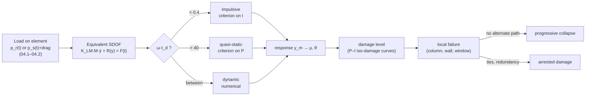

# 04.3 · Structural effects

<div class="module-card">

**Prerequisites** [04.2 Distance, reflection, confinement & urban environments](lessons/stage-04/lesson-02.md) · [01.6 Structural response & fragmentation](lessons/stage-01/lesson-06.md) (SDOF oscillator, impulsive vs quasi-static regimes, P–I asymptotes) · ODEs, energy methods.

**Estimated time** 6 h (3 h theory · 1 h simulator · 2 h programming) · **Level** Intermediate → Advanced

**Next** [04.4 Injury mechanisms, fragmentation & secondary hazards](lessons/stage-04/lesson-04.md); case study [Oklahoma City 1995](case-studies/cs03-oklahoma-city.md).

<p class="tags"><span>structural dynamics</span><span>SDOF</span><span>P–I diagrams</span><span>glazing</span><span>progressive collapse</span><span>quantity-distance</span><span>Sim D</span></p>
</div>

## Why this matters

Buildings are both the thing that fails and the thing that protects. In urban blast incidents,
most injuries away from the immediate vicinity are caused not by the pressure wave itself but by
what it does to the built environment: windows turned into high-velocity fragments, cladding and
masonry thrown inward, and — in the worst cases — floors collapsing because a few columns were
lost. For an EOD team this shapes where people can safely shelter, which buildings inside a
cordon must be emptied, which façades are dangerous to stand in front of, and why the separation
distances for explosives storage look the way they do. For an engineer it is a clean application
of structural dynamics: an equivalent single-degree-of-freedom system, a resistance function and
two energy balances explain most of what protective design codes do.

## Learning objectives

1. Explain why glazing is the dominant urban blast-injury source and compute the range at which a
   fictional pane fails, including why that range does **not** follow simple cube-root scaling.
2. Build an equivalent SDOF model of a wall or panel using load and mass transformation factors
   and an elastic–perfectly-plastic resistance function; define ductility ratio and support rotation.
3. Derive the impulsive and quasi-static asymptotes of a P–I diagram by energy balance for elastic
   and elastic–plastic systems and compute a full iso-damage curve numerically.
4. Explain progressive collapse and the structural principles that resist it (redundancy,
   continuity, ductility, alternate load paths), using the Oklahoma City NIST/FEMA findings.
5. Summarise the protective-design philosophy of UFC 3-340-02 (and ASCE practice): standoff first,
   then controlled ductile response.
6. Interpret quantity-distance rules $D = K\,Q^{1/3}$ as Hopkinson scaling applied to regulation, and
   relate a $K$-factor to an overpressure level.

## Theory

### 1. The glazing hazard

Glass has three properties that make it the worst actor in an urban blast: very **low capacity**
(an ordinary annealed pane fails at a few kPa of uniform pressure), **large area** in every
building, and **brittle failure** into sharp fragments that are accelerated by the remaining
pressure and blast wind. Because failure pressures are low, windows fail at ranges where the
overpressure itself is harmless to a person in the open; the injury mechanism is then secondary
(fragments, 04.4). Protective measures follow directly: laminated glass (the interlayer holds
fragments), anti-shatter film, catch bars and curtains, and — critically — frames and anchorages
at least as strong as the glazing so that the whole window does not become one large projectile
("balanced design").

We model a pane as an elastic SDOF system per unit area that fails when its deflection reaches
$x_c$. For a brittle element there is no plastic reserve: $x_c = R_u/k$.

**Numerical example — fictional pane G.** Areal mass $m = 15$ kg/m², natural period $T = 10$ ms,
static capacity $R_u = 5$ kPa (all fictional but physically plausible orders of magnitude).
$k = m(2\pi/T)^2 = 5.92\times10^6$ Pa/m, $x_c = 5000/5.92\times10^6 = 0.84$ mm. Using the P–I
asymptotes derived in §3: $P^* = k x_c/2 = 2.5$ kPa and $I^* = x_c\sqrt{km} = 7.96$ kPa·ms.
Loaded face-on by a surface burst (reflected Friedlander pulse from 04.1), the pane fails out to
**50 m for 1 YU** ($Z = 41$) and **340 m for 100 YU** ($Z = 60$).

<div class="callout key">

**Damage does not obey cube-root scaling when the target is fixed.** The load parameters scale
with $Z$, but the pane's natural period does not. For 1 YU at 50 m the pulse ($t_d \approx 6.6$ ms)
is comparable to $T$; for 100 YU at 340 m it is ~5× longer and the pane responds
quasi-statically, so pressure (which decays only like $1/Z$ there) governs, and the scaled safe
distance grows from 41 to 60. This is why glazing-damage radii for large events are so large, and
why a P–I diagram — not a single threshold — is the right description of a target.

</div>

<details class="answer"><summary>Exercise 1 — then reveal</summary>

Using only the quasi-static asymptote (the load is "long"), estimate the face-on failure range of
pane G for 100 YU (surface burst). Hint: face-on at weak shocks, $p_r\approx 2p_s$. Compare with
the full SDOF result of 340 m and explain the difference.

*Answer.* Need $p_r = 2.5$ kPa ⇒ $p_s \approx 1.24$ kPa ⇒ from the far-field form $p_s\approx0.827p_0/Z$
(04.1), $Z\approx 67.6$ (the full fit gives 67.9) ⇒ $R = 67.6\times180^{1/3} = 382$ m. Slightly
larger than 340 m because the pulse is long but not infinitely long — the finite-duration response
is a bit less than the quasi-static bound. The asymptote is conservative, as it should be.

</details>

### 2. Walls and frames: failure modes and the equivalent SDOF system

**Failure modes.** A panel or wall under blast can fail in *flexure* (bending, with a ductile
plastic-hinge mechanism in reinforced concrete or steel), in *direct shear* at the supports (for
very short, intense loads, before the element has time to bend), by *breaching and spall* (close
in; local, wave-dominated), or at its *connections*. Frames fail when columns are loaded directly
(reflected pressure on the column face plus drag) or when floors are lifted or pushed. Flexure is
what SDOF models describe; direct shear and breaching are close-in phenomena outside this lesson's
scope.

**Equivalent SDOF (Biggs 1964).** Represent a distributed element (beam, one-way slab) by one
coordinate: the midspan deflection $y$. Assume a deflected shape (elastic or plastic mechanism),
equate the kinetic energy, the strain energy and the work done by the load with those of a
lumped system. This yields load and mass factors $K_L$, $K_M$ and the equation

<div class="callout eq">

$$ K_{LM}\,M\,\ddot y + R(y) = F(t), \qquad K_{LM} = \frac{K_M}{K_L}, $$

</div>

| Symbol | Meaning | SI unit |
|---|---|---|
| $M$ | total mass of the element | kg |
| $F(t)$ | total load $= p(t)\times$ loaded area | N |
| $y$ | midspan (characteristic) deflection | m |
| $R(y)$ | resistance function (restoring force) | N |
| $K_L, K_M$ | load and mass transformation factors | — |
| $K_{LM}$ | load–mass factor | — |

For a simply supported beam under uniform load Biggs gives $K_L = 0.64$, $K_M = 0.50$,
$K_{LM} = 0.78$ in the elastic range and $K_L = 0.50$, $K_M = 0.33$, $K_{LM} = 0.66$ in the
plastic range. UFC 3-340-02 Ch. 3 tabulates these for many support conditions.

**Resistance function.** The simplest useful model is **elastic–perfectly-plastic (EPP)**:
$R = k y$ up to the ultimate resistance $R_u$ at $y_e = R_u/k$, then constant $R_u$. Two response
measures are used as damage criteria:

$$ \mu = \frac{y_m}{y_e}\ \ (\text{ductility ratio}),\qquad \theta = \arctan\frac{y_m}{L/2}\ \ (\text{support rotation}). $$

Codes set allowable $\mu$ or $\theta$ per material and protection level (a few degrees of support
rotation for heavily reinforced concrete elements designed to survive; far less for brittle
masonry). The damage criterion is always on *response*, never on load.

<div class="callout physics">

**Intuition.** An SDOF model throws away everything except "how heavy, how stiff, how strong,
how ductile". For blast that is remarkably effective, because the load is short compared with the
time it takes higher modes to matter and damage is dominated by the first mode's peak deflection.
Its failures are equally clear: close-in loads (spatially non-uniform, wave-dominated), shear
failures, and anything whose deflected shape changes during response.

</div>

```python
import numpy as np

BIGGS_SS_UNIFORM = {"elastic": dict(KL=0.64, KM=0.50), "plastic": dict(KL=0.50, KM=0.33)}

def sdof_epp(m, k, Ru, load, t_end, dt=None):
    """Per-unit-area EPP SDOF, m x'' + R(x) = p(t). Returns t, x, x_max. Semi-implicit Euler."""
    T = 2 * np.pi * np.sqrt(m / k)
    dt = dt or T / 2000
    n = int(t_end / dt) + 1
    t = np.arange(n) * dt
    x = np.zeros(n); v = 0.0; xp = 0.0        # xp = plastic offset
    for j in range(1, n):
        r = k * (x[j-1] - xp)
        if r > Ru:  xp, r = x[j-1] - Ru / k, Ru
        if r < -Ru: xp, r = x[j-1] + Ru / k, -Ru
        v += (load(t[j-1]) - r) / m * dt
        x[j] = x[j-1] + v * dt
    return t, x, x.max()
```

<details class="answer"><summary>Exercise 2 — then reveal</summary>

A fictional simply supported one-way panel has total mass 2000 kg and elastic stiffness (midspan
load–deflection, uniform load) $k = 8\times10^6$ N/m. (a) Compute its natural period with and
without the load–mass factor. (b) Why does ignoring $K_{LM}$ make the model unconservative for
short pulses?

*Answer.* (a) Lumped: $T = 2\pi\sqrt{2000/8\times10^6} = 99.3$ ms. With $K_{LM}=0.78$:
$T = 2\pi\sqrt{0.78\cdot2000/8\times10^6} = 87.7$ ms. (b) In the impulsive regime the peak
deflection is $I_{\text{tot}}/\sqrt{k\,M_e}$ (next section); using the full mass instead of the
effective mass $K_{LM}M$ overestimates inertia, so the model predicts a *smaller* deflection
(by $\sqrt{0.78}$, i.e. 12 %) than the equivalent system.

</details>

### 3. P–I diagrams from energy balance

For a given damage criterion (a limiting deflection $x_c$), the set of $(P, I)$ load pairs that
just reach it is an **iso-damage curve**. Two asymptotes follow from energy balance (01.6),
here written per unit area with effective mass $m$ and EPP resistance ($R_u$, $x_e = R_u/k$,
limiting ductility $\mu = x_c/x_e$).

**Impulsive asymptote** (pulse ≪ $T$): the impulse is delivered before the element moves; it
leaves with velocity $v_0 = I/m$ and kinetic energy $I^2/(2m)$, which the resistance must absorb:

$$ \frac{I^2}{2m} = \int_0^{x_c} R\,dx = R_u x_e\left(\mu - \tfrac12\right) \quad\Rightarrow\quad I^* = \sqrt{2 m R_u x_e\left(\mu - \tfrac12\right)} . $$

**Quasi-static asymptote** (pulse ≫ $T$): the load is effectively constant $P$ while the element
deflects, so the work done is $P x_c$:

$$ P\,x_c = R_u x_e\left(\mu-\tfrac12\right) \quad\Rightarrow\quad P^* = R_u\left(1-\frac{1}{2\mu}\right). $$

For an **elastic** element ($\mu = 1$, $R_u = k x_c$) these reduce to $I^* = x_c\sqrt{km}$ and
$P^* = k x_c/2$ — exactly the asymptotes plotted in Sim D.

<div class="callout eq">

| Regime | Elastic ($\mu=1$) | EPP (ductility $\mu$) |
|---|---|---|
| Impulsive, $\omega t_d \lesssim 0.4$ | $I^*=x_c\sqrt{km}$ | $I^*=\sqrt{2mR_ux_e(\mu-\frac12)}$ |
| Quasi-static, $\omega t_d \gtrsim 40$ | $P^*=kx_c/2$ | $P^*=R_u(1-\frac1{2\mu})$ |
| Dynamic (between) | numerical | numerical |

</div>

| Symbol | Meaning | Unit (per unit area) |
|---|---|---|
| $m$ | effective areal mass | kg/m² |
| $k$ | stiffness | Pa/m |
| $R_u$ | ultimate resistance | Pa |
| $x_e, x_c$ | elastic limit and limiting deflection | m |
| $P^*, I^*$ | pressure and impulse asymptotes | Pa, Pa·s |

**Intuition.** Short loads are "a kick": only momentum matters, so the criterion is on impulse.
Long loads are "a push": only force matters, and a suddenly applied constant force deflects an
elastic system *twice* its static deflection (hence $k x_c/2$). Ductility helps enormously in the
impulsive regime (energy absorption grows linearly with $\mu$) but only modestly in the
quasi-static regime ($P^*$ saturates at $R_u$).

**Numerical example.** Fictional wall: $m = 100$ kg/m², $k = 4\times10^6$ Pa/m ($T = 31.4$ ms),
$R_u = 20$ kPa ⇒ $x_e = 5$ mm; limit $\mu = 3$. Then
$P^* = 20(1-1/6) = 16.7$ kPa and $I^* = \sqrt{2\cdot100\cdot20\,000\cdot0.005\cdot2.5} = 224$ Pa·s
$= 224$ kPa·ms. Direct numerical SDOF with triangular pulses: $t_d = 0.2$ ms needs $I = 222.5$
kPa·ms; $t_d = 2$ s needs $P = 16.8$ kPa. ✔

**The curve between the asymptotes.** A common engineering approximation is a rectangular
hyperbola $(P-P^*)(I-I^*) = c\,P^* I^*$. Computing the exact elastic curve for triangular pulses
(the Sim D procedure) and backing out $c$ shows it is *not* constant: $c\approx0.03$ at
$\omega t_d\approx0.6$, $0.14$ at $\omega t_d = 2$, $0.29$ at $\omega t_d \approx 6$, approaching ≈ 0.38 for
long pulses. The hyperbola is a convenient summary, not physics — and near the "knee", where most
real loads fall, it can be off by tens of percent.

```python
from scipy.optimize import brentq

def pi_curve_elastic(m, k, xc, tds):
    """Exact iso-damage points (P, I) for triangular pulses of duration td (elastic SDOF)."""
    out = []
    for td in tds:
        load_peak = lambda P: sdof_epp(m, k, 1e30, lambda t: P * (1 - t / td) if t < td else 0.0,
                                       t_end=td + 1.5 * 2 * np.pi * np.sqrt(m / k))[2] - xc
        P = brentq(load_peak, 0.9 * k * xc / 2, 1e4 * k * xc)
        out.append((P, 0.5 * P * td))
    return np.array(out)

m, k, xc = 100.0, 4e6, 0.005
Ps, Is = k * xc / 2, xc * np.sqrt(k * m)            # 10 kPa, 100 Pa·s
curve = pi_curve_elastic(m, k, xc, [1e-3, 1e-2, 1e-1])
print(Ps, Is, curve)                                # P, I approach the asymptotes at the ends
```

<details class="answer"><summary>Exercise 3 — then reveal</summary>

Sim D's "masonry-like wall" is $m = 100$ kg/m², $T = 20$ ms, with damage thresholds $x_c$ = 1, 3,
10 cm. (a) Compute $P^*$ and $I^*$ for $x_c = 1$ cm and 3 cm. (b) A face-on load from 8 YU at 4 m
(04.1: $p_r = 699$ kPa, $t_d = 2.34$ ms, $b = 1.125$, reflected impulse ≈ 581 kPa·ms) — which
damage band is it in? (c) Check with the impulsive approximation $x \approx I/\sqrt{km}$.

*Answer.* (a) $k = 100(2\pi/0.02)^2 = 9.87\times10^6$ Pa/m. $x_c=1$ cm: $P^*=49.3$ kPa,
$I^* = 0.01\sqrt{9.87\times10^8} = 314$ kPa·ms; 3 cm: 148 kPa, 942 kPa·ms. (b) $\omega t_d = 0.74$ —
nearly impulsive; $I = 581$ lies between 314 and 942 ⇒ between "low" and "moderate". (c)
$581/31\,416\,\text{Pa}\cdot\text{s/m} = 1.85$ cm; the full numerical Friedlander response gives 1.83 cm. ✔

</details>

### 4. Using P–I diagrams in practice

A P–I diagram is a **vulnerability function** for one element and one damage level, valid for
all pulse shapes to the accuracy of the SDOF idealisation. Applying it:

1. For each candidate position of the threat (range $R$, yield band $W$), compute the load pair
   on the element — reflected or incident as appropriate (04.1–04.2) — and plot it.
2. As $R$ increases for fixed $W$, the load point moves down and to the left along a
   "trajectory"; the intersection with an iso-damage curve is the **standoff** for that damage
   level.
3. Families of trajectories for different $W$ are *not* scaled copies of one another relative to
   a fixed target (the glazing box in §1) — which is why protective standoffs are computed
   per element type rather than read off a single $Z$.
4. Uncertainty: the SDOF parameters are uncertain too (material strengths, support conditions,
   ageing). Probabilistic P–I analysis treats $R_u$, $k$, $m$ as random and reports a probability
   of exceeding each damage level (the approach 04.4 applies to people).

### 5. Progressive collapse — the Oklahoma City case

**Progressive collapse** is the spread of an initial local failure from element to element,
resulting in collapse disproportionate to the initiating damage. The 1995 bombing of the
Alfred P. Murrah Federal Building in Oklahoma City (a nine-storey reinforced-concrete frame)
is the reference case (Lew, NIST; Corley et al. 1998; FEMA 277):

- A vehicle bomb detonated beside the building. The blast destroyed **three columns** directly.
- The **third-floor transfer girders**, which carried upper columns over a wider ground-floor
  bay, then failed, and the floors above them collapsed progressively.
- Only about **4 %** of the floor area was destroyed by the blast directly; about **42 %** was
  destroyed once progressive collapse is included — a tenfold amplification by the structural
  system.
- Re-analyses cited by NIST found that **seismic-style detailing** (continuity of reinforcement,
  special moment frames) would have reduced the damage by **more than 80 %**.

The protective lessons are structural, not blast-specific: provide **alternate load paths** (if a
column is lost, can the floors above span over it?), **continuity and ties** (so beams and slabs
can hang in catenary action rather than fall), **ductility** (so members deform instead of
fracturing), and avoid **transfer structures** that make a few elements critical. Post-1995 US
guidance on progressive collapse grew out of this case. See the
[case study](case-studies/cs03-oklahoma-city.md) for the investigation and response.

<details class="answer"><summary>Exercise 4 — then reveal</summary>

Model a building as a graph: nodes = columns, edges = floor spans. Removing a column is safe if
every span it supported can be carried by a neighbouring alternate path. Explain, in
software-reliability terms, what the OKC transfer girder was, and what "tying" adds.

*Answer.* A transfer girder is a **single point of failure** feeding many dependants — losing it
fails every upstream column it carried (a fan-out dependency). Ties and continuity are
**redundancy with graceful degradation**: they convert a hard failure (collapse) into a degraded
mode (large sag, catenary action) that holds long enough for evacuation — like a service falling
back to a slower replica rather than returning errors. The 4 % → 42 % amplification is a cascade
failure ratio.

</details>

### 6. Protective-design philosophy

Public protective-design practice (UFC 3-340-02 for accidental explosions; ASCE practice for
blast-resistant buildings) rests on a few principles:

1. **Standoff first.** Load falls steeply with distance in the near field ($p_s\propto Z^{-2}$ or
   faster), so each metre of standoff is worth more than any practical strengthening. Perimeters,
   bollards and setbacks are the cheapest protection.
2. **Design for ductile response, not elastic.** Accept permanent deformation within a specified
   ductility or support-rotation limit; that is what makes protection affordable ($I^*$ grows
   with $\mu$).
3. **Protect against the governing mechanism.** Glazing and fragments (retention systems),
   primary structure (ductility, continuity), and progressive collapse (alternate paths) are
   separate checks.
4. **Balanced design.** Connections and supports stronger than the members they hold, so the
   intended ductile mechanism forms.
5. **Explicit protection categories.** UFC 3-340-02 defines levels of protection for personnel,
   equipment and contents, and designs to the category rather than to "no damage".

<div class="callout safety">

These are the same principles behind operational protective choices: distance first, then
shielding, then personal protection (04.4). They are consistently ordered by effectiveness per
unit cost.

</div>

### 7. Quantity-distance: scaling applied to regulation

Explosives storage and handling regulations (DESR 6055.09 in the US; IATG 02.20 internationally)
specify minimum separations between a potential explosion site (a store) and exposed sites (other
stores, roads, inhabited buildings) as a function of the net explosive quantity $Q$:

<div class="callout eq">

$$ D = K\,Q^{1/3} $$

</div>

| Symbol | Meaning | Unit |
|---|---|---|
| $D$ | required separation distance | m (US tables: ft) |
| $Q$ | net explosive quantity (in this course: abstract YU) | kg (lb) |
| $K$ | **scaled distance** chosen for the protection level | m·kg⁻¹ᐟ³ (ft·lb⁻¹ᐟ³) |

This is Hopkinson–Cranz scaling written as law. Each **$K$-factor is a scaled distance $Z$**
at which the expected blast effect (predominantly overpressure; for surface storage, a
surface-burst field) is judged acceptable for that type of exposure: small $K$ for
inter-magazine distances (prevent propagation between stores), intermediate $K$ for public
traffic routes, larger $K$ for inhabited buildings. US practice quotes $K$ in ft·lb⁻¹ᐟ³ — e.g. the
familiar "K40" inhabited-building factor; conversion: $1\ \text{ft}\cdot\text{lb}^{-1/3} = 0.3048/0.4536^{1/3} = 0.397$
m·kg⁻¹ᐟ³, so K40 ≈ 15.9 m·kg⁻¹ᐟ³. Evaluated with Kinney–Graham and a 1.8 surface factor,
$Z = 15.9/1.216 = 13.0$ gives $p_s \approx 7$ kPa — the level where glazing damage becomes likely but
building structure is not threatened. Regulations then add **minimum distances** for fragments and
debris that do *not* scale as $Q^{1/3}$ (fragment throw is set by the hardware, not the quantity),
plus reductions for barricades and hazard-division-specific rules (see DESR 6055.09 Vol. 3 and
IATG 02.20 for the actual tables; IATG 02.10 for the risk-management framing).

**Numerical example — fictional "Regulation F"** (abstract units): inter-store $K = 3$, public
route $K = 12$, inhabited building $K = 18$ m·YU⁻¹ᐟ³. For $Q = 1000$ YU ($Q^{1/3} = 10$):
30, 120, 180 m. Implied surface-burst overpressures: $Z_{\text{eff}} = K/1.216$ ⇒ 128, 10.2, 6.2
kPa. Doubling $Q$ multiplies every distance by $2^{1/3} = 1.26$.

```python
def qd_distance(Q, K):
    return K * np.cbrt(Q)

def kg_ps(Z, p0=101.325):
    return p0 * 808 * (1 + (Z / 4.5) ** 2) / (
        np.sqrt(1 + (Z / 0.048) ** 2) * np.sqrt(1 + (Z / 0.32) ** 2) * np.sqrt(1 + (Z / 1.35) ** 2))

K = np.array([3.0, 12.0, 18.0])
print(qd_distance(1000, K), kg_ps(K / 1.8 ** (1 / 3)))   # [30 120 180], [128 10.2 6.2]
ft_lb = 0.3048 / 0.45359237 ** (1 / 3)
print(40 * ft_lb, kg_ps(40 * ft_lb / 1.8 ** (1 / 3)))     # 15.87 m/kg^1/3, ≈ 7.15 kPa
```

<details class="answer"><summary>Exercise 5 — then reveal</summary>

Under Regulation F, a store holding 250 YU sits 100 m from a school. (a) Is it compliant? (b) What
is the maximum quantity allowed? (c) Why might a regulator still require a larger distance for a
small quantity?

*Answer.* (a) $D = 18\times250^{1/3} = 18\times6.30 = 113$ m > 100 m ⇒ not compliant. (b)
$Q_{\max} = (100/18)^3 = 171$ YU. (c) Minimum fragment/debris distances: a small quantity can still
throw fragments far, and fragment range does not shrink with $Q^{1/3}$.

</details>

## Visual explanation



<iframe class="sim-frame" src="sims/blast-physics/index.html?embed=1" height="760" loading="lazy"></iframe>

<a class="sim-link" href="sims/blast-physics/index.html" target="_blank">Open Sim D full-screen ↗</a>

## Worked example — assessing a fictional office façade

A fictional two-storey office faces a street. An exercise scenario places a 30 YU (surface
burst, so $W_{\text{eff}}=54$ YU) hazard 25 m from the façade. Elements: (a) annealed panes like
pane G; (b) a masonry-like infill wall, Sim D's $T = 20$ ms element with $x_c = 3$ cm; (c) a
reinforced column.

1. **Load.** $Z = 25/54^{1/3} = 6.61$ ⇒ $p_s = 18.1$ kPa; face-on $p_r = 2.15\,p_s = 39.0$ kPa;
   the impulse fit gives $i_s = 112$ kPa·ms, and with Sim D's convention ($b = 0.5$, stretched
   $t_d = 14.4$ ms) the reflected impulse is ≈ 240 kPa·ms.
2. **Glazing.** $P^*=2.5$ kPa, $I^* = 8$ kPa·ms: the load is an order of magnitude beyond both
   asymptotes (the SDOF peak deflection is ≈ 12 $x_c$) ⇒ the panes fail; fragments are propelled
   into occupied rooms. Glazing is the governing hazard for occupants.
3. **Infill wall.** $x_c=3$ cm: $P^*=148$ kPa, $I^*=942$ kPa·ms. The load is well inside the
   safe region (SDOF peak ≈ 0.17 $x_c$) ⇒ no significant wall damage expected at this criterion.
4. **Column.** Reflected pressure on a narrow column clears quickly (04.2), and its capacity is far
   higher; not governing at this range — but at close range (single-digit metres) direct column
   loss becomes credible, which is the progressive-collapse trigger of §5.
5. **Protective conclusion.** Occupants should be moved away from the façade rooms (or out of the
   building) rather than sheltered behind the glazing; interior corridors behind masonry walls are
   the better shelter. Longer-term mitigation: film or laminated glazing with anchored frames,
   and vehicle standoff.

## Simulation work

<div class="callout sim">

**Sim D, structure & P–I panels.** (1) Select each element type (T = 5, 20, 80 ms) with the
default load; record the regime tag ($\omega t_d$) and DLF. Explain why the same blast is
"impulsive" for one element and "dynamic" or "quasi-static" for another. (2) With the 20 ms wall,
move $R$ from 3 m to 60 m at $W = 8$ YU and watch the load dot's trajectory on the P–I plot; find
the ranges where it crosses the low/moderate/severe curves. (3) Repeat at $W = 512$ YU: are the
crossing ranges 4× larger ($512/8 = 64$, $64^{1/3}=4$)? Explain any deviation with the argument of §1.
(4) Toggle the rigid wall off: which curve crossings move, and by how much?

</div>

## Practical exercises

1. **Compute the worked example exactly.** Use your 04.1 library to compute $p_s$, $p_r$, $t_d$,
   $b$ and reflected impulse at $Z = 6.61$ for $W_{\text{eff}}=54$; then run the SDOF for pane G and
   the infill wall and report peak deflection ratios $x_m/x_c$.
2. **Ductility trade.** For the fictional wall of §3 ($R_u=20$ kPa, $x_e=5$ mm, $m=100$), tabulate
   $P^*$ and $I^*$ for $\mu = 1, 2, 5, 10$. Which asymptote benefits more? What does that say
   about retrofitting walls in the near field vs far field?
3. **Redundancy analysis.** Build a toy 2D frame graph (5 bays × 4 storeys) where each column
   carries the spans above it; implement a "column-loss" test that checks whether an alternate path
   exists within a load-capacity margin. Find the critical columns with and without a transfer
   girder at level 1.
4. **Regulatory reasoning.** Explain to a non-specialist why a regulator can express the same
   protection level for 10 YU and 10 000 YU stores with one number, and why that number alone is
   not enough.

<details class="answer"><summary>Answer to 2</summary>

$P^* = 20(1-1/(2\mu))$: 10, 15, 18, 19 kPa. $I^*=\sqrt{2\cdot100\cdot20000\cdot0.005(\mu-0.5)}=\sqrt{20000(\mu-0.5)}$:
100, 173, 300, 436 kPa·ms. Impulse capacity grows ~4.4× from μ=1 to 10; pressure capacity only
1.9×. Near-field loads are short (impulsive), so ductile retrofits help most there; far-field
long-duration loads need strength (or the far-field element, glass, needs retention).

</details>

## Programming exercise — probabilistic P–I analysis

**Goal.** Produce P–I iso-damage curves with uncertainty for an EPP element and use them to
compute a probability-of-damage vs standoff curve.

- **Input:** distributions for $m$ (normal, CV 5 %), $R_u$ (lognormal, CV 15 %), $k$ (lognormal,
  CV 10 %); limiting ductility $\mu$; threat $W$ (fixed) and a list of standoffs; load model from
  your 04.1 library (reflected Friedlander).
- **Output:** (i) median and 5–95 % band of the iso-damage curve; (ii) $P(\text{damage}\mid R)$
  for each standoff; (iii) the standoff at which $P(\text{damage}) = 10\,\%$.
- **Constraints:** vectorise over Monte Carlo samples where possible; reuse a single SDOF solver;
  ≤ 30 s for 2000 samples × 30 standoffs.
- **Expected behaviour:** asymptotes of each sample match the closed forms; the probability curve
  is monotone decreasing in $R$; wider $R_u$ spread widens the transition band.
- **Test cases:** (i) zero variance ⇒ step function at the deterministic standoff; (ii) the elastic
  case reproduces the Sim D asymptotes $kx_c/2$ and $x_c\sqrt{km}$; (iii) the §3 numerical example
  ($P^*=16.7$ kPa, $I^*=224$ kPa·ms).
- **Extensions:** replace EPP with a bilinear hardening resistance; add a direct-shear check for
  short pulses; compare the hyperbolic P–I approximation's error distribution with the exact curve.

Builds on [Project P01](projects/p01-blast-wave/README.md).

## Reading

- Biggs, J. M., *Introduction to Structural Dynamics*, McGraw-Hill (1964) —
  https://archive.org/details/introductiontost0000bigg — ch. 5 (equivalent SDOF systems, load and
  mass factors) and ch. 2 (dynamic load factors).
- US DoD, *UFC 3-340-02* (2008, Change 2 2014) — https://www.wbdg.org/dod/ufc/ufc-3-340-02 —
  Ch. 3 (dynamic analysis of structural elements, resistance functions, transformation factors);
  read Ch. 1 for protection categories.
- Baker, W. E. et al., *Explosion Hazards and Evaluation*, Elsevier (1983) —
  https://shop.elsevier.com/books/explosion-hazards-and-evaluation/baker/978-0-444-42094-7 — the
  chapters on structural response and P–I diagrams.
- Lew, H. S., *Case Study: Alfred P. Murrah Federal Building*, NIST —
  https://www.nist.gov/system/files/documents/2017/05/09/OklahomaCityLew2002.pdf — the whole deck;
  the 4 % vs 42 % figures and the re-analysis. Companion: Corley, W. G. et al., ASCE J. Perf.
  Constr. Facilities 12(3) (1998) — https://ascelibrary.org/doi/10.1061/(ASCE)0887-3828(1998)12:3(113).
- UNODA, *IATG 02.20 Quantity and separation distances*, 3rd ed. (2021) —
  https://data.unsaferguard.org/iatg/en/V3_IATG-02.20_en.pdf — the QD concept sections; and
  *IATG 02.10* (https://data.unsaferguard.org/iatg/en/V3_IATG-02.10_en.pdf) for risk framing.
- DDESB, *DESR 6055.09* Ed. 1 Change 2 (2025) —
  https://www.denix.osd.mil/ddes/denix-files/sites/32/2022/08/DESR-6055.09-Edition1-Change-2-251208.pdf
  — Vol. 3 QD concepts (read for understanding, not for tables).

## Assessment

1. *(Conceptual)* Explain why ductility increases the impulsive capacity of a wall much more than
   its quasi-static capacity, using the energy-balance derivation.
2. *(Mathematical)* Derive the impulsive asymptote for a bilinear resistance function that
   hardens with stiffness $\alpha k$ after yield.
3. *(Interpretation)* A post-incident survey finds windows broken to 400 m on one side of an event
   but only to 200 m on the other. Give three explanations drawn from 04.2–04.3.
4. *(Computation)* Pane G, face-on, 10 YU surface burst: bracket the failure range using the
   quasi-static asymptote and the impulsive asymptote, then say which regime applies.
5. *(Design)* Critique: "We strengthened every ground-floor column to twice its original capacity,
   so progressive collapse is no longer a concern."

<details class="answer"><summary>Answers to 4 and 5</summary>

4. $W_\text{eff} = 18$, $W_\text{eff}^{1/3} = 2.62$. Pressure asymptote: $p_r = 2.5$ kPa ⇒
   $p_s\approx1.24$ kPa ⇒ $Z = 67.9$ ⇒ $R_P = 178$ m. Impulse asymptote: reflected $i \approx 2i_s = 7.96$
   ⇒ $i_s \approx 4.0$ kPa·ms ⇒ $i_s/W^{1/3} = 1.52$ ⇒ (impulse fit) $Z = 128.6$ ⇒ $R_I = 337$ m.
   Failure requires the load to exceed *both* asymptotes, so the failure range is at most
   $\min(R_P, R_I) = 178$ m. The full SDOF (reflected Friedlander, Sim D conventions) gives 139 m;
   there $t_d\approx14$ ms against $T=10$ ms — the dynamic regime, closer to quasi-static.
5. Strength helps against direct column loss at a given range but does nothing for
   *disproportionate* collapse after a loss at closer range; the defence is alternate paths,
   ties/continuity and ductility (OKC re-analysis). Doubling capacity also shifts failure-mode
   risk (shear, connections) if not balanced.

</details>

## Expert extension

- **Multi-degree-of-freedom and FE.** Compare an SDOF prediction with a modal (first three modes)
  model of a clamped plate under a uniform Friedlander load; identify when higher modes matter.
- **Fluid–structure interaction.** For light, flexible panels the motion of the panel reduces
  the reflected pressure it experiences (Taylor's plate problem). Derive the impulse transmitted to
  a free plate by an acoustic pulse and discuss its relevance for lightweight protective panels.
- **Probabilistic collapse.** Formulate progressive collapse as a percolation / cascade problem on
  a load-redistribution graph and estimate the distribution of collapse extent under random
  initial column losses.

## What comes next

[04.4](lessons/stage-04/lesson-04.md) applies the same vulnerability logic to people — primary,
secondary, tertiary and quaternary injury — and closes the stage with a probabilistic
evacuation-radius model under yield uncertainty.
