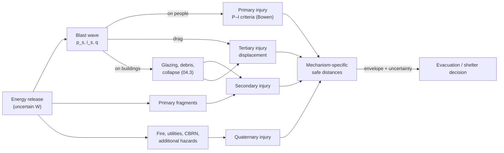

# 04.4 · Injury mechanisms, fragmentation & secondary hazards

<div class="module-card">

**Prerequisites** [04.2 Distance, reflection, confinement & urban environments](lessons/stage-04/lesson-02.md) · [04.3 Structural effects](lessons/stage-04/lesson-03.md) (P–I diagrams) · [01.6 Structural response & fragmentation](lessons/stage-01/lesson-06.md) (fragment drag, statistics) · basic probability (lognormal, Monte Carlo).

**Estimated time** 6 h (3 h theory · 1 h simulator · 2 h programming) · **Level** Intermediate → Advanced

**Next** [07.1 Decisions under uncertainty](lessons/stage-07/lesson-01.md) · [07.2 Incident management](lessons/stage-07/lesson-02.md) · case study [Boston 2013](case-studies/cs07-boston-2013.md).

<p class="tags"><span>injury biomechanics</span><span>fragments</span><span>stand-off</span><span>PPE</span><span>secondary hazards</span><span>Monte Carlo</span><span>risk</span></p>
</div>

## Why this matters

Everything in Stage 4 exists to answer one question: *where is it safe for people to be?*
Injury is the end of the causal chain — pressure, impulse, fragments, debris, collapse, fire —
and each link has its own distance law. Evacuation and shelter distances published for the
public, the layout of a cordon, the decision to send a robot rather than a person, and the
limits of protective equipment all follow from understanding which mechanism dominates at which
range and how uncertain our estimates are. This lesson classifies blast injury, turns the
primary-injury literature into P–I-style criteria, quantifies fragment hazard with the
hazardous-fragment-density concept, explains how public stand-off tables are built, and ends
with a Monte Carlo model that picks an evacuation radius with a stated exceedance probability
under yield uncertainty — the bridge to decision theory in Stage 7.

## Learning objectives

1. Classify blast injuries as primary, secondary, tertiary or quaternary, and map each to the
   physical quantity that drives it and the protective measure that addresses it.
2. Explain lung and ear injury criteria (including the Bowen curves) as P–I-style criteria, state
   their scaling with body mass, and list the limitations identified in the literature.
3. Compute a hazardous-fragment distance from a fragment count, a density criterion and a drag
   law, and explain why fragment hazards usually set the outer cordon.
4. Explain conceptually how a public stand-off chart is derived from scaled distance and
   fragment/glazing criteria, and why its distances are larger than overpressure alone implies.
5. Apply time–distance–shielding reasoning and state what personal protective equipment can and
   cannot do, conceptually.
6. Identify secondary hazards (fire, collapse, utilities, additional devices, CBRN) and their
   implications for scene management.
7. Build and verify a Monte Carlo model that selects an evacuation radius achieving < 1 %
   exceedance of a (fictional) threshold under uncertainty in yield and in the blast fit.

## Theory

### 1. The four classes of blast injury

Champion, Holcomb and Young (2009) review the physics and pathology of explosion injuries and
the standard classification:

| Class | Mechanism | Driving physical quantity | Typical range dependence | Primary protective measure |
|---|---|---|---|---|
| **Primary** | the pressure wave itself acting on gas-containing organs (ear, lung, bowel); brain effects are an active research area | overpressure and impulse; reflected pressure if near a surface | steep; near field | distance; avoid standing near reflecting surfaces or in confined spaces |
| **Secondary** | penetrating and blunt injury from fragments and debris (casing fragments, glass, building materials) | fragment mass, velocity, density | long range; often the outer limit | distance; shielding (line of sight); fragment-resistant PPE; glazing retention |
| **Tertiary** | body displaced by the blast wind and thrown against objects, or struck by collapsing structure | dynamic pressure impulse; structural collapse | intermediate | distance; not standing near hard obstacles; structural protection |
| **Quaternary** | everything else: burns, crush, inhalation of smoke/dust/toxics, exacerbation of illness, psychological injury | heat, toxic products, collapse, entrapment | varies | fire/utility control, respiratory protection, rescue |

**Key epidemiological point (Champion et al. 2009).** In open-air events secondary injuries are
the most common; primary injuries become much more prominent in **enclosed spaces** (buses,
rooms) because of reflection and the quasi-static gas phase (04.2). Casualty patterns are
therefore a direct fingerprint of the environment — used in forensics (Stage 8).

### 2. Primary injury as a P–I criterion

The body is a set of oscillators. Gas-filled organs (the middle ear, the lung) couple the external
pressure pulse to tissue motion; injury occurs when that motion (or the resulting stress) exceeds
tissue tolerance. That is exactly the structure of 04.3: a **pressure asymptote** for long pulses,
an **impulse asymptote** for short pulses, and a transition around the organ's natural period.

- **Ear.** The tympanic membrane is the most pressure-sensitive structure. Commonly cited
  rupture thresholds are of order tens of kPa, with 50 % rupture at roughly a few times that for
  long-duration pulses; the ear is a sensitive *indicator* of exposure but a poor *predictor* of
  more severe injury (Champion et al. 2009).
- **Lung.** The critical organ for survivability. Thresholds for long-duration pulses are of the
  order of one to a few atmospheres of overpressure, and lethality thresholds higher still; for
  short pulses the thresholds rise sharply (impulse governs).
- **Bowen curves** (Bowen, Fletcher & Richmond 1968) compile animal data from 13 species into
  survival-probability contours in the plane of peak pressure versus positive-phase duration for
  a 70 kg human, for different body positions (free field vs near a reflecting surface). Their
  structure is P–I: at short duration the curves bend so that required pressure rises steeply
  as duration falls.
- **Scaling.** Duration is normalised by a cube-root body-mass law,

$$ t^* = t_d\left(\frac{70\ \text{kg}}{m_b}\right)^{1/3}, $$

  the same geometric-similarity argument as Hopkinson scaling: a smaller body has a shorter natural
  period, so a given pulse is effectively "longer" for it. Bowen et al. also scale for ambient
  pressure.

| Symbol | Meaning | Unit |
|---|---|---|
| $t_d$ | positive-phase duration of the pulse | ms |
| $m_b$ | body mass | kg |
| $t^*$ | duration scaled to a 70 kg reference | ms |

**Limitations** (Boutillier et al. 2015, IRCOBI critical review). The curves come from animal
experiments with idealised (Friedlander-like) waves; they do not directly apply to complex
waveforms with multiple reflections (rooms, vehicles), to protected individuals, or to
repeated low-level exposure. Alternative models — Axelsson's chest-wall-velocity model and
Stuhmiller's lung model — address complex waves by modelling the thoracic response explicitly,
i.e. by replacing a P–I lookup with an SDOF-like dynamic model of the chest. The analogy to 04.3
is exact.

**Numerical example.** A pulse of $t_d = 5$ ms applied to a 35 kg body corresponds to
$t^* = 5\times(70/35)^{1/3} = 6.3$ ms on the 70 kg curves: for a smaller person the same pulse
sits further toward the quasi-static (pressure-governed, more damaging per unit impulse) side.

<div class="callout exercise">

**A fictional criterion for exercises (not a medical threshold).** "Criterion L":
$(P - 150)(I - 200) = 0.3\times150\times200$ with $P$ in kPa and $I$ in kPa·ms, exceedance when
$P>150$, $I>200$ and the product exceeds the right-hand side. It has the P–I shape of 04.3 and
is used only to show the geometry of exposure.

</div>

```python
import numpy as np

def exceeds_pi(P, I, Ps=150.0, Is=200.0, c=0.3):
    """Hyperbolic P–I exceedance test (fictional Criterion L)."""
    P, I = np.asarray(P), np.asarray(I)
    return (P > Ps) & (I > Is) & ((P - Ps) * (I - Is) > c * Ps * Is)

def bowen_scaled_duration(td_ms, body_mass_kg):
    return td_ms * np.cbrt(70.0 / body_mass_kg)

print(bowen_scaled_duration(5.0, 35.0))            # 6.30 ms
print(exceeds_pi(207.9, 172.8), exceeds_pi(698.7, 581.0))   # False, True
```

<details class="answer"><summary>Exercise 1 — then reveal</summary>

Using your 04.1 library and Criterion L, find the largest range at which a person is in
exceedance for a free-air release of 8 YU (a) standing in the open (incident load) and (b)
standing with their back against a large rigid wall facing the source (use reflected $p_r$ and
reflected impulse). Repeat for 64 YU. Explain why (b)/(a) is so large and why the 64 YU ranges
are not simply twice the 8 YU ones.

*Answer.* (a) ≈ 2.5 m; (b) ≈ 6.0 m (2.4× — reflection multiplies both $P$ and $I$). For 64 YU:
≈ 7.9 m and ≈ 13.0 m — ratios 3.2 and 2.2, not $8^{1/3}=2$, because the *target* (the criterion)
does not scale: larger yields give longer pulses, which are more damaging per unit pressure at a
fixed biological "period". This is the glazing lesson of 04.3 again. The protective message is
concrete: in the open, move away from walls; inside, move away from the side facing the hazard.

</details>

### 3. Tertiary injury: displacement by the blast wind

A body in the flow behind the shock experiences drag. Ignoring the short diffraction phase, the
velocity acquired is

<div class="callout eq">

$$ v \approx \frac{C_D\,A}{m_b}\int q(t)\,dt \equiv \frac{C_D A\, i_q}{m_b} $$

</div>

| Symbol | Meaning | Unit |
|---|---|---|
| $C_D$ | drag coefficient of the body (~1–1.3 for a standing person) | — |
| $A$ | projected area | m² |
| $i_q$ | dynamic-pressure impulse | Pa·s |
| $m_b$ | body mass | kg |

**Numerical example.** Fictional $i_q = 100$ kPa·ms (= 100 Pa·s), $C_D=1.2$, $A=0.6$ m²,
$m_b=70$ kg ⇒ $v = 1.2\times0.6\times100/70 = 1.03$ m/s. Dynamic pressure grows as $p_s^2$
(04.1), so $i_q$ falls off faster with distance than $i_s$; tertiary injury is an intermediate-range
mechanism whose severity depends mostly on what the person is thrown against — again,
**stand away from hard obstacles and edges**.

<details class="answer"><summary>Exercise 2 — then reveal</summary>

Show that at weak shocks $q_s/p_s \approx (5/14)(p_s/p_0)$. What is $q_s/p_s$ at 10 kPa and at
100 kPa, and what does that imply for the relative importance of tertiary injury near and far?

*Answer.* $q = \tfrac52 p_s^2/(7p_0+p_s) \approx \tfrac{5}{14}p_s^2/p_0$. At 10 kPa: 0.035 (exact
0.035); at 100 kPa: 0.35 approx vs exact 0.31. Drag is negligible far away and comparable to
overpressure close in.

</details>

### 4. Fragment hazard

Fragments — primary fragments from a casing and secondary fragments from anything nearby (glass,
masonry, vehicle parts) — travel far beyond the range of significant overpressure (01.6 treats
their initial velocity and statistics conceptually). Two ideas turn this into a distance:

**Hazardous fragment.** A fragment is considered hazardous if its impact kinetic energy exceeds a
threshold; US explosives-safety practice uses **79 J** (58 ft·lbf) (DESR 6055.09).

**Hazardous fragment density.** An exposed location is considered acceptable when the areal
density of hazardous fragments falls below **one per 55.7 m²** (600 ft²) (DESR 6055.09). The
**hazardous fragment distance** is where that density is reached.

For $N_h$ hazardous fragments projected uniformly into solid angle $\Omega$ (4π for isotropic),
ignoring trajectory curvature, the areal density at range $R$ and the distance at which the
criterion is met are

<div class="callout eq">

$$ n(R) = \frac{N_h}{\Omega R^2},\qquad R_{\text{HFD}} = \sqrt{\frac{N_h\,A_c}{\Omega}}\ \ (A_c = 55.7\ \text{m}^2), $$

$$ v(R) = v_0\,e^{-R/\lambda},\quad \lambda = \frac{2m_f}{\rho_a C_D A_f},\qquad R_E = \lambda\ln\frac{v_0}{v_E},\ \ v_E=\sqrt{2E_h/m_f}. $$

</div>

| Symbol | Meaning | Unit |
|---|---|---|
| $N_h$ | number of fragments that remain hazardous | — |
| $\Omega$ | solid angle of projection | sr |
| $A_c$ | area per hazardous fragment at the criterion (55.7 m²) | m² |
| $m_f, A_f$ | fragment mass and presented area | kg, m² |
| $\rho_a$ | air density (1.225 kg/m³) | kg/m³ |
| $\lambda$ | drag decay length | m |
| $E_h$ | hazardous-energy threshold (79 J) | J |
| $R_E$ | range at which a fragment's energy falls to $E_h$ (straight-line drag model) | m |

**Intuition.** Density falls as $1/R^2$ — geometric dilution. Energy falls exponentially with a
decay length set by the fragment's mass-to-area ratio: heavy, compact fragments carry far.
The hazardous distance is whichever criterion is met *first*: beyond $R_E$ no fragment is
hazardous any more; before it, the density criterion decides — so $R = \min(R_{\text{HFD}}, R_E)$.
Unlike overpressure, neither law is a cube-root scaling of the source energy — fragment hazard is
governed by the *hardware and surroundings*, which is why public evacuation distances are much
larger than blast criteria alone suggest.

**Numerical example (fictional).** $N_h = 2000$ fragments, isotropic: $R_{\text{HFD}} = \sqrt{2000\times55.7/4\pi} = 94.2$ m.
A 10 g fragment with $A_f = 1$ cm², $C_D = 1$, $v_0 = 1200$ m/s: $\lambda = 0.02/(1.225\times10^{-4}) = 163$ m;
at 94 m, $v = 1200e^{-94.2/163} = 674$ m/s, $E = 2270$ J ≫ 79 J — still hazardous, so the density
criterion governs; $R_E = 163\ln(1200/125.7) = 368$ m. (A real trajectory with gravity and tumbling
changes these; the model is for reasoning, not prediction.)

```python
RHO_AIR, A_CRIT, E_HAZ = 1.225, 55.7, 79.0

def hfd_density(N_h, omega=4 * np.pi):
    return np.sqrt(N_h * A_CRIT / omega)

def drag_length(m, area, cd=1.0, rho=RHO_AIR):
    return 2 * m / (rho * cd * area)

def energy_range(m, area, v0, cd=1.0):
    lam = drag_length(m, area, cd)
    vE = np.sqrt(2 * E_HAZ / m)
    return lam * np.log(v0 / vE)

print(hfd_density(2000), drag_length(0.01, 1e-4), energy_range(0.01, 1e-4, 1200))  # 94.2, 163, 368
```

<details class="answer"><summary>Exercise 3 — then reveal</summary>

(a) If fragments are concentrated into a 30° wide belt around the equator instead of isotropic,
how does $R_{\text{HFD}}$ change? (b) How does halving $N_h$ change $R_{\text{HFD}}$? (c) What does
(b) say about the value of shielding that stops *some* fragments?

*Answer.* (a) A belt from −15° to +15° latitude has $\Omega = 4\pi\sin15° = 3.25$ sr (vs 12.57):
$R$ grows by $\sqrt{12.57/3.25} = 1.97$ ⇒ ≈ 185 m within the belt. (b) $1/\sqrt2$: ×0.71 ⇒ 66.6 m.
(c) Partial shielding gives only square-root benefit in distance, but *complete* line-of-sight
shielding for a specific exposed position reduces its local density to near zero — shielding is
most valuable applied locally (to people), not globally.

</details>

### 5. Public stand-off tables — how they are derived

The DHS–DOJ Bomb Threat Stand-Off Card (CISA; earlier NCTC chart) gives, for a range of threat
sizes, a **mandatory evacuation distance** (everyone out, including from buildings), a
**shelter-in-place zone** (people may stay inside buildings, away from windows) and a
**preferred evacuation distance** beyond which the open is considered acceptable. The published
card is the authoritative source; the *concepts* behind such a table are:

1. **An equivalent-yield band per threat category** (in this course, abstract YU), with
   conservative (upper) values.
2. **A blast criterion** turned into a range by scaled distance, $R_b = Z^*W^{1/3}$ (04.2),
   typically using surface-burst conditions.
3. **Structure and glazing criteria** (04.3): the building-evacuation distance reflects where
   building damage and occupant injury from glazing become likely — generally more restrictive
   than open-air criteria for people.
4. **Fragment and debris criteria** (§4), which usually dominate the outermost distance and do not
   follow cube-root scaling.
5. **Rounding up and operational simplicity** — a card that must be used under stress has few
   rows and round numbers.

The resulting table is therefore **the envelope of several mechanism-specific distances**, each
itself an upper estimate. A learner who reverse-engineers such a card with a single blast fit will
find that it looks "too conservative" — which is the point: it covers the worst governing
mechanism under uncertainty.

<details class="answer"><summary>Exercise 4 — then reveal</summary>

Build a fictional three-row card for threat categories with planning yields 5, 50 and 500 YU
(surface burst): "building evacuation" at the 7 kPa contour, "open-air preferred" at the larger of
the 3 kPa contour and a fixed fragment distance of 150 m. Which mechanism governs each row?

*Answer.* $Z(7) = 13.28$, $Z(3) = 28.6$; $W_{\text{eff}}^{1/3}$ = 2.08, 4.48, 9.65. Building
evacuation: 27.6, 59.5, 128 m. Open-air: blast 59.6, 128, 276 m vs fragments 150 m ⇒ 150, 150,
276 m. Fragments govern the two smaller rows; blast governs the largest. Real cards also include
glazing and debris considerations that push the smaller rows outward further.

</details>

### 6. Time, distance, shielding — and what PPE can do

The classic exposure principle (familiar from radiation protection) applies directly:

- **Time.** Minimise the time any person spends inside hazard zones; this is the rationale for
  remote means (robots, Stage 6), for planning before approach, and for the decision frameworks
  of Stage 7. Risk accrues per exposure-minute when the hazard's timing is unknown.
- **Distance.** The dominant control. Blast load falls as $Z^{-1}$ to $Z^{-2.2}$; fragment density
  as $R^{-2}$ with an exponential energy cut-off. Doubling distance divides peak overpressure by
  2.2–4.6 and fragment density by 4.
- **Shielding.** Anything that breaks line of sight stops fragments very effectively; against
  blast, shielding helps only locally (diffraction, 04.2), and a shield that itself fails becomes
  debris. Hard cover is chosen for fragment protection first.

**Personal protective equipment (conceptual).** EOD bomb suits and helmets are designed as the
last layer after distance and remote means:

| They can | They cannot |
|---|---|
| stop or slow many fragments below a rated threshold (ballistic panels rated against standard fragment simulants) | make close proximity to a detonation survivable in general — primary blast loading of the thorax and head is only partly attenuated, and very close-in fragments exceed any wearable rating |
| reduce some thermal exposure and tertiary impact injury (padding, rigid plates, helmet) | eliminate tertiary injury from being thrown against obstacles |
| protect the face and eyes (visor), provide hearing protection and communications | come without cost: mass of tens of kilograms, heat stress, reduced dexterity, vision and mobility — all of which increase time-at-risk |

The engineering trade-off is a Pareto front between protection and exposure time: more
protection → slower work → longer exposure. That is a quantitative argument for remote means.

### 7. Secondary hazards

After (or in the absence of) a detonation, the hazard picture is broader than blast:

| Hazard | Why it arises | Scene implication |
|---|---|---|
| **Fire** | ignition of fuels, furnishings, vehicles; burning debris | smoke inhalation (quaternary), structural weakening, possible cook-off of other energetic material |
| **Structural collapse** | damaged frames, progressive collapse (04.3), loss of walls/facades | exclusion zones around damaged buildings; engineering assessment before entry |
| **Gas and utilities** | ruptured gas lines (risk of a second, deflagration-type explosion — 04.2 confined gas physics), live electrical cables, water flooding basements | utility isolation early; gas monitoring |
| **Additional devices** | a recognised threat category (03.4): more than one hazard may be present | scene control points and assembly areas chosen with care, avoid predictable congregation, apply the same assessment to every unattended item — treated as a planning assumption at the framework level (07.2) |
| **CBRN** | a device or site may involve chemical, biological or radiological material; industrial sites contain toxic stores | detection and upwind positioning; specialist resources; decontamination planning |
| **Dust, asbestos, sharp debris** | pulverised building materials | respiratory protection; long-term health monitoring |

The Boston 2013 response ([case study](case-studies/cs07-boston-2013.md)) illustrates the
management of casualties, scene safety and secondary-threat assumptions in an urban open-air
event.

## Visual explanation



<iframe class="sim-frame" src="sims/blast-physics/index.html?embed=1" height="760" loading="lazy"></iframe>

<a class="sim-link" href="sims/blast-physics/index.html" target="_blank">Open Sim D full-screen ↗</a>

## Worked example — a fictional evacuation-radius decision under uncertainty

**Scenario (fictional).** A suspicious object is reported in an open plaza. Planning intelligence
gives an uncertain yield: median 30 YU, lognormal with $\sigma_{\ln W} = 0.6$ (a factor of ~1.8 at
one standard deviation). Assume a surface burst ($\alpha = 1.8$). The Kinney–Graham fit has
lognormal model error $\sigma_{\ln p} = 0.2$ (04.1). Fictional protective threshold: people in the
open should not experience $p_s > 7$ kPa. Requirement: **choose the radius $R_{99}$ such that
$P(p_s(R_{99}) > 7\ \text{kPa}) < 1\,\%$.**

**Step 1 — deterministic median.** $Z^*(7) = 13.28$; $R_{50} = 13.28\times(1.8\times30)^{1/3} = 50.2$ m.
A radius based on the median yield has a 50 % chance of being inadequate.

**Step 2 — yield uncertainty only (analytic).** $p_s$ is monotone in $W$ at fixed $R$, so
exceedance ⇔ $W > (R/Z^*)^3/\alpha$. The 99th percentile yield is
$W_{99} = 30\,e^{2.326\times0.6} = 121$ YU, so $R_{99} = 13.28\times(1.8\times121)^{1/3} = 79.9$ m.

**Step 3 — add fit uncertainty (approximate analytic).** Locally $\ln p_s \approx -n\ln Z$ with
$n\approx1.14$ near $Z\approx 16$. Then $\ln p_s$ has spread
$\sigma = \sqrt{(n\sigma_{\ln W}/3)^2 + \sigma_{\ln p}^2} = \sqrt{0.228^2+0.2^2} = 0.303$; requiring the median
pressure times $e^{2.326\sigma}$ to equal 7 kPa gives $R_{99}\approx 94.5$ m.

**Step 4 — Monte Carlo (exact under the model).** Sample $W$ and the fit error, compute $p_s$, and
find $R$ with 1 % exceedance by root-finding: 80.2 m without fit error (matches Step 2 to 0.4 %),
**92.8 m** with it (Step 3's linearisation is within 2 %).

**Step 5 — interpretation.** The answer ~93 m is almost twice the median-based radius. Most of the
increase comes from yield uncertainty; model uncertainty adds a further ~16 %. Before acting, one
would take the envelope with the fragment distance (§4) and glazing considerations (04.3), and
record the assumptions. Stage 7 turns this into a decision: what is the value of information that
narrows $\sigma_{\ln W}$?

## Simulation work

<div class="callout sim">

**Sim D.** (1) With the gauge panel, find the ranges at which $p_s$ = 35, 7 and 3 kPa for 30 YU
surface burst; compare with $Z^*W_\text{eff}^{1/3}$. (2) Turn the rigid wall on: how much further out
is the 7 kPa *reflected* contour — what does this mean for a person standing against a wall?
(3) In the wave-field panel, *Building corner* scene: put P1 in the shadow and P2 in line of sight at
equal distance; compare peaks. Then argue why the shadow reduces blast only modestly but would stop
fragments entirely. (4) Run the challenge set at Intermediate and Advanced; for each missed item,
write which injury mechanism the quantity would feed.

</div>

## Practical exercises

1. **Mechanism envelope.** For 5–500 YU (log-spaced), plot on one chart the ranges for (a) Criterion
   L in the open, (b) the 7 kPa contour, (c) a fictional fragment distance $R_{\text{HFD}}$ with
   $N_h = 400\,W^{0.5}$ (fictional law), and (d) the envelope. Identify crossover yields.
2. **Critique.** A colleague argues that because a child's mass is lower, primary-blast criteria
   are *less* restrictive for children. Evaluate using the Bowen scaling.
3. **PPE trade-off.** A fictional model has exposure risk per minute $h(d)$ decreasing with
   protection level $d$ and task time $T(d) = T_0(1 + 0.5d)$. With $h = h_0e^{-d}$, find the $d$ that
   minimises total risk $h(d)T(d)$ and interpret.
4. **Secondary-hazard planning.** For a fictional scene (a street with a gas main, a school 150 m
   away upwind, a damaged three-storey building), list the secondary hazards in priority order
   with the physical reason for each and the information you would request.

<details class="answer"><summary>Answers to 2 and 3</summary>

2. Smaller mass ⇒ $t^* = t_d(70/m_b)^{1/3}$ is *larger*: the same pulse is effectively longer
   relative to the smaller body's response time, pushing it toward the pressure-governed regime,
   where criteria are lower in P–I terms per unit impulse. Also children are closer to the ground
   (Mach stem region, 04.2) and have different tolerance. The argument is wrong in sign.
3. $\frac{d}{dd}[e^{-d}(1+0.5d)] = e^{-d}(0.5 - 1 - 0.5d) < 0$ for all $d\ge0$: more protection
   always reduces risk *in this model* — because protection's benefit is exponential while its
   time cost is linear. Change $T(d)$ to $T_0e^{0.5d^2}$ (mobility collapses at high mass) and an
   interior optimum appears at $d=1$. The model family, not a number, is the lesson.

</details>

## Programming exercise — Monte Carlo evacuation radius

**Goal.** Implement the worked example as a tested, reusable function and extend it.

- **Input:** yield distribution (lognormal median, $\sigma_{\ln W}$), surface factor $\alpha$ (possibly
  uncertain), fit error $\sigma_{\ln p}$, threshold $p^*$, target exceedance $\epsilon$ (default
  0.01), number of samples, seed.
- **Output:** $R_\epsilon$; the exceedance curve $P(p_s>p^*\mid R)$ on a grid; a bootstrap
  confidence interval for $R_\epsilon$.
- **Constraints:** vectorised NumPy; common random numbers across $R$ (so the exceedance curve is
  monotone); ≤ 2 s for $2\times10^5$ samples.
- **Expected behaviour:** with $\sigma_{\ln p}=0$ it matches the analytic $R_{99}$ to < 1 %; increasing
  either σ increases $R_\epsilon$; halving $\epsilon$ increases $R_\epsilon$.
- **Test cases:** (i) $\sigma_{\ln W} = \sigma_{\ln p} = 0$ ⇒ $R_\epsilon = Z^*(\alpha W)^{1/3}$ exactly;
  (ii) the worked example: 80.2 m (±0.5 m) and 92.8 m (±1 m) with seed 42;
  (iii) MC standard error of the exceedance estimate ≈ $\sqrt{\epsilon(1-\epsilon)/N}$.

```python
import numpy as np
from scipy.optimize import brentq

P0 = 101.325
def kg_ps(Z, p0=P0):
    return p0 * 808 * (1 + (Z / 4.5) ** 2) / (
        np.sqrt(1 + (Z / 0.048) ** 2) * np.sqrt(1 + (Z / 0.32) ** 2) * np.sqrt(1 + (Z / 1.35) ** 2))

def evacuation_radius(W_med=30.0, s_lnW=0.6, alpha=1.8, s_fit=0.2, p_crit=7.0,
                      eps=0.01, n=200_000, seed=42):
    rng = np.random.default_rng(seed)
    W = W_med * np.exp(s_lnW * rng.standard_normal(n))       # uncertain yield [YU]
    fit = np.exp(s_fit * rng.standard_normal(n))              # multiplicative model error
    def exceed(R):
        return np.mean(kg_ps(R / np.cbrt(alpha * W)) * fit > p_crit)
    return brentq(lambda R: exceed(R) - eps, 1.0, 5000.0)

print(evacuation_radius(s_fit=0.0), evacuation_radius())     # ≈ 80.2, ≈ 92.8 m
```

- **Extensions:** (a) make $\alpha$ uniform on [1.6, 2.0]; (b) add a fragment mechanism with its
  own uncertainty and compute the radius for the *union* of exceedance events; (c) compute the
  expected value of perfect information about $W$ for a fictional cost model (evacuation cost ∝
  $R^2$, harm cost for exceedance) — the entry point to [07.1](lessons/stage-07/lesson-01.md);
  (d) wrap it as a service with a calibrated uncertainty report for
  [Project P12](projects/p12-hitl-decision/README.md).

## Reading

- Champion, H. R., Holcomb, J. B. & Young, L. A., *Injuries from explosions: physics, biophysics,
  pathology, and required research focus*, J. Trauma 66(5):1468–1477 (2009) —
  https://pubmed.ncbi.nlm.nih.gov/19430256/ (free DTIC copy: https://apps.dtic.mil/sti/tr/pdf/ADA627553.pdf)
  — the whole review; focus on the injury classification and the physics section.
- Boutillier, J. et al., *Primary blast injury on thorax: a critical review of the studies and
  their outcomes*, IRCOBI (2015) — https://www.ircobi.org/wordpress/downloads/irc15/pdf_files/77.pdf
  — Bowen curves, Axelsson and Stuhmiller models and their limitations.
- Bowen, I. G., Fletcher, E. R. & Richmond, D. R., *Estimate of Man's Tolerance to the Direct
  Effects of Air Blast* (DASA-2113), 1968 — https://www.semanticscholar.org/paper/846a261b91b315c329c2ab507572b40bbfee4de6
  — for the origin and scaling of the curves.
- DHS/CISA–DOJ, *Bomb Threat Stand-Off Card* (2025) —
  https://www.cisa.gov/resources-tools/resources/dhs-doj-bomb-threat-stand-card — read it as the
  output of the derivation in §5.
- DDESB, *DESR 6055.09* (2025) —
  https://www.denix.osd.mil/ddes/denix-files/sites/32/2022/08/DESR-6055.09-Edition1-Change-2-251208.pdf
  — hazardous fragment and hazardous fragment density definitions (QD volume).
- Baker, W. E. et al., *Explosion Hazards and Evaluation*, Elsevier (1983) —
  https://shop.elsevier.com/books/explosion-hazards-and-evaluation/baker/978-0-444-42094-7 —
  chapters on fragments and damage/injury criteria.

## Assessment

1. *(Conceptual)* Why are primary blast injuries relatively more frequent in enclosed spaces, in
   terms of 04.2's physics?
2. *(Mathematical)* Show that for isotropic projection the hazardous-fragment distance scales as
   $\sqrt{N_h}$, and combine it with the drag law to give the governing distance as
   $\min\big(\sqrt{N_hA_c/\Omega},\ \lambda\ln(v_0/v_E)\big)$ — explaining why it is the *minimum*.
3. *(Interpretation)* An exceedance curve from your Monte Carlo is not monotone in $R$. What
   implementation mistake is most likely?
4. *(Computation)* In the worked example, which single change reduces $R_{99}$ most: halving
   $\sigma_{\ln W}$, setting $\sigma_{\ln p}=0$, or raising the threshold to 10 kPa? Estimate each with
   the Step 3 formula.
5. *(Design)* Write a one-paragraph justification, for a non-technical incident commander, of an
   evacuation radius that is twice the "median" estimate.

<details class="answer"><summary>Answers to 2, 3 and 4</summary>

2. $n(R_{\text{HFD}}) = 1/A_c$ ⇒ $R = \sqrt{N_hA_c/\Omega}$. Beyond $R_E$ fragments are no longer
   hazardous, so the hazardous density is zero; the criterion is therefore met at the *first* of the
   two distances — the minimum.
3. Independent random samples for each $R$ (no common random numbers), so Monte Carlo noise
   produces non-monotone estimates; also a bracket in the root-finder crossing a noisy region.
4. Step 3 formula with $n=1.14$: halving $\sigma_{\ln W}$: $\sigma=\sqrt{0.114^2+0.2^2}=0.230$ ⇒ radius
   factor $e^{2.326(0.230-0.303)/1.14}$ ≈ 0.86 ⇒ ≈ 81 m. $\sigma_{\ln p}=0$: $\sigma = 0.228$ ⇒ ≈ 81 m
   (similar). Threshold 10 kPa: $Z^*$ from 13.28 → 9.99; redoing Step 3 with the local
   $n \approx 1.23$ ($\sigma = 0.318$) gives ≈ 70 m. The criterion choice matters most — which
   is why criteria must be justified, not tuned.

</details>

## Expert extension

- **Probabilistic injury models.** Replace Criterion L with a probit model
  $P(\text{injury}) = \Phi(a + b_1\ln P + b_2\ln I)$ and propagate yield uncertainty into an
  expected-casualty map over a synthetic population density. Compare "1 % exceedance radius" with
  "expected casualties < 0.01" as decision criteria.
- **Fragment fields.** Implement a Mott-type fragment-mass distribution (01.6) with trajectory
  integration (drag + gravity + random launch angles) and compute a hazardous-density map; compare
  with the $1/R^2$ model.
- **Complex waves.** Implement a simple chest-wall SDOF (in the spirit of Axelsson) and apply it to
  Sim D's *Room* probe traces; compare with a Bowen-style lookup on the first peak only.

## What comes next

Stage 4 ends here. [07.1 Decisions under uncertainty](lessons/stage-07/lesson-01.md) uses the
exceedance model you built as a component of a sequential decision problem (value of information,
exposure minimisation), and [08.2](lessons/stage-08/lesson-02.md) runs the physics backwards:
inferring a source from damage and injury patterns. Then take the
[Stage 4 gate](assessments/stage-04.md).
