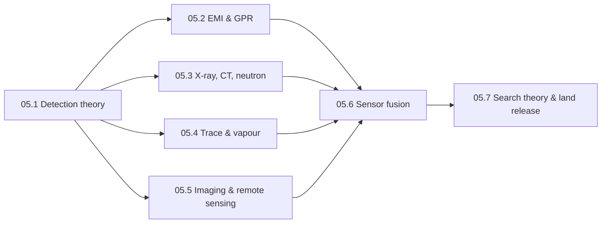

# Stage 5 · Detection

**Level** Intermediate → Advanced · **Estimated time** ≈ 42 h · **Core maths** detection theory, Bayes, statistics of rare events, electromagnetism, wave propagation, radiation attenuation, tomography, physical chemistry

**Prerequisites** [00.2 How EOD organisations operate](lessons/stage-00/lesson-02.md) · [01.3 Waves](lessons/stage-01/lesson-03.md) · [01.7 Electricity & EM](lessons/stage-01/lesson-07.md) · [03.3 Mines, cluster munitions & legacy ordnance](lessons/stage-03/lesson-03.md)

**Simulators & projects** [Sim J · Detection theory](sims/detection-theory/index.html) · [Sim C · Sensor fusion](sims/sensor-fusion/index.html) · [P02 Sensor-noise simulator](projects/p02-sensor-noise/README.md) · [P03 Bayesian fusion](projects/p03-bayesian-fusion/README.md)

ROCEMIGPRX-ray &amp; CTneutron &amp; NQRIMS / MScaninesfusionsearch theory

## Purpose

Almost every EOD and mine-action task begins with a detection problem: is there anything here, and
if so, where and what? This stage treats detection as an engineering discipline with two halves.
The first is **decision-theoretic**: every sensor produces scores, every threshold trades misses
against false alarms, rare targets make most alarms false, and credible performance claims require
blind trials with honest confidence intervals (05.1). The second is **physical**: each sensing
modality — induction, radar, penetrating radiation, trace chemistry, imaging at a distance —
has a principle that decides what it can see, what fools it and what environment defeats it
(05.2–05.5). The stage closes by combining sensors (05.6) and by scaling single-location detection
up to area search and land release (05.7).

For every sensor, the lessons answer the same eight questions: physical principle; what it detects;
strengths; limitations; false positives; false negatives; environmental limitations; realistic
examples from the literature.

## Lessons

| Id | Lesson | Level | Time | Simulator / project |
|---|---|---|---|---|
| 05.1 | [Detection theory: ROC, base rates, costs and test & evaluation](lessons/stage-05/lesson-01.md) | Intermediate | 6 h | Sim J · P02 |
| 05.2 | [Electromagnetic induction & ground-penetrating radar](lessons/stage-05/lesson-02.md) | Intermediate | 7 h | Sim C · P02 |
| 05.3 | [Penetrating radiation: X-ray, dual-energy, backscatter, CT and neutron methods](lessons/stage-05/lesson-03.md) | Intermediate | 7 h | Sim C · P02 |
| 05.4 | [Trace & vapour detection: vapour pressure, IMS, MS, colorimetry and canines](lessons/stage-05/lesson-04.md) | Intermediate | 6 h | Sim C · P02 |
| 05.5 | [Imaging & remote sensing](lessons/stage-05/lesson-05.md) — mmW, thermal IR, acoustic/seismic, hyperspectral, drones | Intermediate | 5 h | Sim C · P02 |
| 05.6 | [Sensor fusion](lessons/stage-05/lesson-06.md) — Bayesian, Dempster–Shafer, correlated errors, sensor selection | Advanced | 6 h | Sim C · P03 |
| 05.7 | [Search theory & area clearance](lessons/stage-05/lesson-07.md) — Koopman, sweep width, land release, QA sampling | Advanced | 5 h | Sim J · P03 |

Dependencies: 05.1 first; 05.2–05.5 in any order; 05.6 needs all four; 05.7 needs 05.6.

**What this stage deliberately leaves out, and why.** Detection is taught as physics, statistics and
system performance: how each sensor works, what it measures, its limits and false alarms, and how
performance is tested. The stage does **not** cover how to evade, defeat, spoof or mask any detector,
how to conceal devices or materials, or the composition, vapour signatures or construction of any
real device. Where real material classes are mentioned (for example in vapour-pressure discussions),
only general literature ranges are given; all numerical examples use fictional compounds and
fictional geometric phantoms. Radiography is taught as imaging physics and radiation safety. It does
not cover interpreting real device internals. These omissions follow the course safety boundary:
the material that helps a detector designer or evaluator is kept, and anything that would mainly
help someone defeat detection is left out.

## Stage gate

When you have finished the lessons, attempt the [Stage 5 assessment](assessments/stage-05.md):
8 problems mixing computation, interpretation and design, a Sim C target (≥ proficient at
Advanced) and a Sim J cost-minimum target, and a sensor-suite design question for a fictional
clearance task.

## Core reading for the stage

- MacDonald, J., Lockwood, J. R. et al., *Alternatives for Landmine Detection*, RAND (2003),
  https://www.rand.org/pubs/monograph_reports/MR1608.html — the spine reference for every sensor
  lesson.
- GICHD, *Guidebook on Detection Technologies and Systems for Humanitarian Demining* (2006),
  https://www.gichd.org/fileadmin/uploads/gichd/Publications/Guidebook_Detection_2006.pdf.
- CEN, CWA 14747-1:2003, *Humanitarian Mine Action — Test and Evaluation — Metal Detectors*,
  https://www.mineactionstandards.org/standards/07-05-2003/.
- National Research Council, *Existing and Potential Standoff Explosives Detection Techniques* (2004),
  https://www.nationalacademies.org/read/10998/chapter/1.

Full bibliographic entries: [curriculum/sources.md](curriculum/sources.md).
