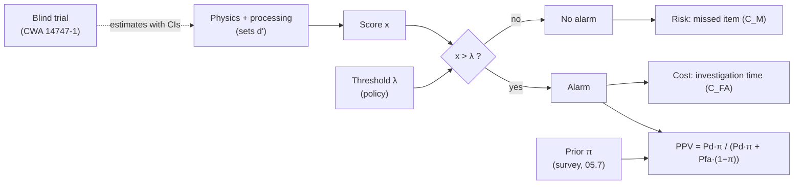

# 05.1 · Detection theory: ROC, base rates, costs and test & evaluation

<div class="module-card">

**Prerequisites** [00.2 How EOD organisations operate](lessons/stage-00/lesson-02.md) (land release, roles) · probability (Bayes' rule, Gaussian and binomial distributions, Poisson processes) · basic hypothesis testing.

**Estimated time** 6 h (3 h theory · 1 h simulator · 2 h programming) · **Level** Intermediate

**Next** Any of the sensor lessons — [05.2 EMI & GPR](lessons/stage-05/lesson-02.md), [05.3 Penetrating radiation](lessons/stage-05/lesson-03.md), [05.4 Trace & vapour](lessons/stage-05/lesson-04.md), [05.5 Imaging & remote sensing](lessons/stage-05/lesson-05.md) — then [05.6 Sensor fusion](lessons/stage-05/lesson-06.md).

<p class="tags"><span>detection theory</span><span>ROC</span><span>Bayes</span><span>statistics</span><span>test &amp; evaluation</span><span>Sim J</span><span>P02</span></p>
</div>

## Why this matters

Every detector in this stage — a metal detector, a radar, an X-ray system, an ion-mobility
spectrometer, a dog — does the same abstract thing: it turns physics into a *score* and compares the
score with a *threshold*. Where you put the threshold decides how many real hazards you miss and how
many harmless objects you dig up, X-ray, swab or evacuate for. In humanitarian clearance the
arithmetic is brutal: real items are rare, so even an excellent detector produces alarms that are
overwhelmingly false, and each false alarm costs minutes of slow, careful investigation. RAND's
landmine-detection study for the White House (MacDonald et al., 2003) makes this its central point:
the obvious fix — tune the detector to alarm less — also lowers the probability of detection, and
humanitarian demining cannot accept that trade. This lesson gives you the mathematics to reason
about that trade precisely, and the statistics to tell whether a vendor's "99 % detection" claim is
supported by the trial that produced it.

For an ML engineer this is familiar territory (precision/recall, calibration, class imbalance) with
two twists: the costs are extremely asymmetric (a miss can kill; a false alarm costs time), and the
test data are expensive, small and full of environmental confounders.

## Learning objectives

1. Model a detector as a binary hypothesis test; compute $P_d$, $P_{fa}$ and the ROC for Gaussian
   score models with equal and unequal variance, and express separability as $d'$ and AUC.
2. Derive the likelihood-ratio test and state the Neyman–Pearson lemma; compute the NP threshold
   for a required false-alarm probability.
3. Compute the positive predictive value of an alarm from base rate, $P_d$ and $P_{fa}$, and explain
   why low prevalence dominates field experience.
4. Derive the Bayes-optimal threshold from misclassification costs and priors and apply it to a
   clearance-economics scenario.
5. Design a blind detector trial in the spirit of CWA 14747-1: compute exact confidence intervals for
   $P_d$ (Clopper–Pearson, Wilson) and false-alarm rate (Poisson), and the sample size needed to
   demonstrate a requirement.

## Theory

### 1. The detector as a hypothesis test

At each location (or time window, or swab) there are two hypotheses: $H_0$ — no target present;
$H_1$ — target present. The sensor and its signal processing produce a scalar score $x$. The
decision rule is "alarm if $x > \lambda$".

$$ P_{fa}(\lambda) = \Pr(x>\lambda \mid H_0), \qquad P_d(\lambda) = \Pr(x>\lambda\mid H_1),\qquad P_{m} = 1-P_d . $$

The simplest useful model is the **equal-variance Gaussian**: $x\mid H_0 \sim \mathcal N(\mu_0,\sigma^2)$,
$x \mid H_1 \sim \mathcal N(\mu_1,\sigma^2)$. Then

<div class="callout eq">

$$ P_{fa} = Q\!\left(\frac{\lambda-\mu_0}{\sigma}\right),\qquad P_d = Q\!\left(\frac{\lambda-\mu_1}{\sigma}\right) = Q\!\left(Q^{-1}(P_{fa}) - d'\right),\qquad d' = \frac{\mu_1-\mu_0}{\sigma}, $$

where $Q(z) = 1-\Phi(z)$ is the standard normal tail.

</div>

| Symbol | Meaning | Unit |
|---|---|---|
| $x$ | detector score (e.g. matched-filter output, induced voltage, peak height) | sensor units (V, counts, …) |
| $\lambda$ | decision threshold | same as $x$ |
| $\mu_0,\mu_1$ | mean score without / with target | same as $x$ |
| $\sigma$ | score standard deviation (noise + clutter + target variability) | same as $x$ |
| $d'$ | sensitivity index (separation in noise standard deviations) | — |
| $P_d,P_{fa}$ | probability of detection / of false alarm per opportunity | — |

**Intuition.** $d'$ is the only thing the *sensor* controls; $\lambda$ is the only thing the
*operator or policy* controls. Changing $\lambda$ slides you along one curve; improving physics,
signal processing or fusion moves you to a better curve. Note that $\sigma$ is not just electronic
noise — in the field it is dominated by **clutter** (metal fragments, soil inhomogeneity, roots,
stones) and by **target variability** (depth, orientation, metal content), which is why
laboratory $d'$ values are optimistic.

**Numerical example.** $\mu_0=0$, $\mu_1=2$, $\sigma=1$ ($d'=2$), threshold at the midpoint
$\lambda=1$: $P_{fa}=Q(1)=0.1587$, $P_d=Q(-1)=0.8413$. Moving the threshold down to $\lambda=0$
gives $P_{fa}=0.5$, $P_d=Q(-2)=0.977$.

```python
import numpy as np
from scipy.stats import norm

def pd_pfa(lam, mu0=0.0, mu1=2.0, s0=1.0, s1=1.0):
    """Gaussian score model: returns (Pd, Pfa) for threshold lam (vectorised)."""
    return norm.sf((lam - mu1) / s1), norm.sf((lam - mu0) / s0)

print(pd_pfa(1.0))   # (0.8413, 0.1587)
```

<details class="answer"><summary>Exercise 1 — then reveal</summary>

A detector has $d'=3$. The team lead wants $P_d \ge 0.99$. What $P_{fa}$ per opportunity must they
accept? If opportunities are 1 m² cells, how many false alarms per 100 m²?

*Answer.* $P_d = Q(z-3)=0.99 \Rightarrow z-3 = -2.326 \Rightarrow z = 0.674$, so
$P_{fa}=Q(0.674)=0.250$: about 25 false alarms per 100 m². Requiring very high $P_d$ with a
moderate $d'$ forces you deep into the high-false-alarm corner of the ROC.

</details>

### 2. The likelihood-ratio test and Neyman–Pearson

Why threshold the score at all, and why this score? Given the densities $p(x\mid H_1)$ and
$p(x\mid H_0)$, define the **likelihood ratio**

$$ \Lambda(x) = \frac{p(x\mid H_1)}{p(x\mid H_0)} . $$

**Neyman–Pearson lemma.** Among all decision rules with $P_{fa}\le\alpha$, the one that maximises
$P_d$ is "alarm if $\Lambda(x) > \eta$", with $\eta$ chosen so that $P_{fa}=\alpha$ (randomising at
equality if $x$ is discrete). *Sketch:* for any other rule $\phi$ with the same $P_{fa}$,
$\int(\phi_{NP}-\phi)(p_1-\eta p_0)\,dx \ge 0$ because the integrand is non-negative pointwise;
rearranging gives $P_d^{NP}\ge P_d^{\phi}$.

For the equal-variance Gaussian model,

$$ \ln\Lambda(x) = \frac{\mu_1-\mu_0}{\sigma^2}\,x - \frac{\mu_1^2-\mu_0^2}{2\sigma^2}, $$

which is monotone in $x$ — so thresholding $x$ *is* the optimal test. For **unequal variances**
($\sigma_1 \neq \sigma_0$, common when target signatures vary with depth and orientation),
$\ln\Lambda$ is quadratic in $x$ and the optimal rule can alarm on *both* tails. The ROC for
unequal variance is no longer symmetric; with $b=\sigma_0/\sigma_1$,

$$ P_d = Q\!\left(\frac{\sigma_0 Q^{-1}(P_{fa}) - (\mu_1-\mu_0)}{\sigma_1}\right), \qquad \mathrm{AUC} = \Phi\!\left(\frac{\mu_1-\mu_0}{\sqrt{\sigma_0^2+\sigma_1^2}}\right). $$

On normal-deviate axes ($z_{fa}, z_d$) the ROC is a straight line of slope $b$ — the classic
empirical check of the Gaussian model in psychophysics and radar alike.

**Numerical example.** $d'=2$ equal-variance, NP constraint $P_{fa}=0.01$:
$\lambda = Q^{-1}(0.01)=2.326$, $P_d = Q(0.326)=0.372$. Relax to $P_{fa}=0.1$:
$\lambda = 1.282$, $P_d=0.764$. With unequal variance $\sigma_1=1.5$ at $P_{fa}=0.01$:
$P_d=Q((2.326-2)/1.5)=0.414$ — the wider target distribution helps at strict thresholds.

```python
def np_threshold(pfa, mu0=0.0, s0=1.0):
    return mu0 + s0 * norm.isf(pfa)

for a in (0.01, 0.1):
    lam = np_threshold(a)
    print(a, lam, pd_pfa(lam)[0])          # 0.372, 0.764
```

<details class="answer"><summary>Exercise 2 — then reveal</summary>

Show that the AUC of the equal-variance model is $\Phi(d'/\sqrt2)$ and evaluate it for $d'=2$.
Then explain why AUC is a poor single-number summary for humanitarian clearance.

*Answer.* AUC $=\Pr(x_1 > x_0)$ for independent draws; $x_1-x_0\sim\mathcal N(d'\sigma, 2\sigma^2)$,
so AUC $=\Phi(d'/\sqrt2)=\Phi(1.414)=0.921$. AUC averages over all operating points, but clearance
operates only in the $P_d \ge 0.99$ corner; two detectors with equal AUC can differ greatly there.
Report $P_{fa}$ (or FAR) *at the required* $P_d$, or a partial AUC over that region.

</details>

### 3. ROC, AUC and what the curve does not tell you

The **ROC** is the parametric curve $(P_{fa}(\lambda), P_d(\lambda))$. Properties worth knowing:

- It is monotone and, for an LRT, concave; its slope at any point equals the likelihood ratio at the
  corresponding threshold, $dP_d/dP_{fa} = \Lambda(\lambda)$.
- The chance line $P_d=P_{fa}$ is a coin flip; any point below it can be flipped above it by
  inverting the decision.
- The **empirical** ROC from a finite trial is a staircase with sampling uncertainty in both axes;
  the AUC equals the Mann–Whitney $U$ statistic divided by $n_0n_1$.
- In area search the x-axis is usually not a probability but a **false-alarm rate** (FAR, alarms per
  m² or per metre of lane), because there is no natural count of "non-target opportunities". The
  resulting curve ($P_d$ vs FAR) is called an FROC-like or "PoD–FAR" curve; CWA 14747-1 reports
  results this way.

### 4. Base rates and the predictive value of an alarm

The operator does not experience $P_d$ and $P_{fa}$ — they experience alarms, and the question is
"given this alarm, how likely is it real?". With prior (prevalence) $\pi = \Pr(H_1)$,

<div class="callout eq">

$$ \mathrm{PPV} = \Pr(H_1\mid \text{alarm}) = \frac{P_d\,\pi}{P_d\,\pi + P_{fa}(1-\pi)}, \qquad \text{posterior odds} = \frac{P_d}{P_{fa}}\cdot\frac{\pi}{1-\pi}. $$

</div>

| Symbol | Meaning | Unit |
|---|---|---|
| $\pi$ | prevalence: fraction of opportunities containing a target | — |
| PPV | fraction of alarms that are real | — |
| $P_d/P_{fa}$ | positive likelihood ratio of an alarm | — |

**Intuition.** An alarm multiplies the prior odds by $P_d/P_{fa}$. If the prior odds are
$10^{-3}$, a likelihood ratio of 20 still leaves you at odds of 1:50.

**Numerical example.** Cells of 1 m², 1 hazardous item per 1000 cells ($\pi=10^{-3}$), a good
detector with $P_d=0.99$, $P_{fa}=0.05$:
$\mathrm{PPV} = \dfrac{0.99\times10^{-3}}{0.99\times10^{-3}+0.05\times0.999} = 0.0194$. About
**98 % of alarms are false.** The same detector in a confirmed hazardous area with $\pi=0.2$ gives
PPV $=0.832$. Nothing about the sensor changed — only the base rate. This is why non-technical
survey (05.7), which raises $\pi$ in the areas actually searched, is so valuable, and why operators
who "know" most alarms are scrap are at risk of complacency.

```python
def ppv(pd, pfa, prior):
    return pd * prior / (pd * prior + pfa * (1 - prior))

print(ppv(0.99, 0.05, 1e-3), ppv(0.99, 0.05, 0.2))   # 0.0194, 0.832
```

<details class="answer"><summary>Exercise 3 — then reveal</summary>

At $\pi = 10^{-3}$ and $P_d=0.99$, what $P_{fa}$ would be needed for half of all alarms to be real?
What $d'$ does that imply in the equal-variance model?

*Answer.* PPV $=0.5 \Rightarrow P_{fa}(1-\pi) = P_d\pi \Rightarrow P_{fa} = 0.99\times10^{-3}/0.999
= 9.9\times10^{-4}$. Then $d' = Q^{-1}(P_{fa}) - Q^{-1}(P_d) = 3.09 + 2.33 = 5.42$. No single
fielded sensor reaches that against real clutter; this is the quantitative argument for fusion (05.6).

</details>

### 5. Costs and the Bayes-optimal threshold

If a miss costs $C_M$ and a false alarm costs $C_{FA}$ (correct decisions cost nothing extra), the
expected cost per opportunity is

$$ \mathbb E[C] = C_M\,\pi\,(1-P_d) + C_{FA}\,(1-\pi)\,P_{fa}. $$

Minimising pointwise in $x$ gives the **Bayes rule**: alarm iff

<div class="callout eq">

$$ \Lambda(x) > \eta^* = \frac{C_{FA}\,(1-\pi)}{C_M\,\pi}, \qquad\text{equal-variance Gaussian: } x^* = \frac{\mu_0+\mu_1}{2} + \frac{\sigma^2}{\mu_1-\mu_0}\ln\eta^* . $$

</div>

Geometrically, the optimal operating point is where the ROC's slope equals $\eta^*$: iso-cost lines
in ROC space have slope $\eta^*$, and you slide the steepest one that still touches the curve.

**Numerical example.** $d'=2$ ($\mu_0=0,\mu_1=2,\sigma=1$), $\pi=0.01$, $C_M/C_{FA}=1000$:
$\eta^*=0.99/10=0.099$, $x^*=1+\tfrac12\ln0.099=-0.156$; $P_d=Q(-2.156)=0.984$,
$P_{fa}=Q(-0.156)=0.562$. When a miss is 1000× worse than a false alarm, the optimal detector alarms
on more than half of empty cells.

```python
def bayes_threshold(prior, c_miss, c_fa, mu0=0.0, mu1=2.0, s=1.0):
    eta = c_fa * (1 - prior) / (c_miss * prior)
    return (mu0 + mu1) / 2 + s**2 / (mu1 - mu0) * np.log(eta)

x_star = bayes_threshold(0.01, 1000, 1)
print(x_star, pd_pfa(x_star))                   # -0.156, (0.984, 0.562)
```

<div class="callout key">

**Key idea.** Humanitarian standards effectively refuse to put a finite price on a miss; they
specify a required $P_d$ and let the false-alarm rate fall where it may. That is a
**Neyman–Pearson problem with the roles swapped** (fix $P_d$, minimise $P_{fa}$). The Bayes
formulation is still useful for everything *around* the decision: how much to spend on survey
(raising $\pi$), on better sensors (raising $d'$), and on faster alarm investigation (lowering
$C_{FA}$).

</div>

<details class="answer"><summary>Exercise 4 — then reveal</summary>

Show that doubling $C_M$ shifts the equal-variance Bayes threshold by $-\sigma^2\ln2/(\mu_1-\mu_0)$,
regardless of $\pi$. For $d'=2$, $\sigma=1$, how far is that?

*Answer.* $x^*$ depends on $\ln\eta^*$, and $\eta^*\propto 1/C_M$, so doubling $C_M$ subtracts
$\ln 2$ from $\ln\eta^*$ and $\sigma^2\ln2/(\mu_1-\mu_0) = 0.693/2 = 0.347$ from $x^*$ — a
third of a noise standard deviation.

</details>

### 6. False-alarm economics in humanitarian clearance

Consider a fictional 10 000 m² suspected area searched in 1 m² cells, containing 10 items
($\pi=10^{-3}$). The detector has $d'=3.6$ against local clutter, and each alarm requires about 5
minutes of careful investigation before it can be dismissed.

| Operating point $P_{fa}$ | $P_d = Q(Q^{-1}(P_{fa})-3.6)$ | False alarms | Investigation time | Expected missed items |
|---|---|---|---|---|
| 0.10 | 0.990 | ≈ 999 | ≈ 83 h | 0.10 |
| 0.05 | 0.975 | ≈ 500 | ≈ 42 h | 0.25 |
| 0.02 | 0.939 | ≈ 200 | ≈ 17 h | 0.61 |

Raising the threshold to save two-thirds of the investigation time multiplies the expected number
of items left in the ground by six. This is RAND's point in numbers: *false alarms dominate cost,
but the cure of simply alarming less is worse than the disease* (MacDonald et al., 2003, summary).
The only levers that improve both columns are: raise $d'$ (better physics, signal processing,
fusion — Bruschini & Gros (1998) argue that no single sensor can meet the humanitarian clearance
requirement of 99.6 % or better), raise $\pi$ in the searched area (survey and land release, 05.7),
and reduce the cost per false alarm (faster, safer confirmation methods).

<details class="answer"><summary>Exercise 5 — then reveal</summary>

A new signal-processing algorithm raises $d'$ from 3.6 to 4.2 at no cost. At fixed $P_d=0.99$, how
many false alarms does it remove from the 10 000 m² task, and how many investigation hours?

*Answer.* $Q^{-1}(P_{fa}) = d' + Q^{-1}(0.99) = d' - 2.326$. For $d'=3.6$: $Q(1.274)=0.101$
(≈ 1013 FA on 9 990 clean cells); for $d'=4.2$: $Q(1.874)=0.0305$ (≈ 305 FA). Saving ≈ 708 false alarms ≈ 59 h, with no
change in $P_d$. A 0.6 improvement in $d'$ is worth more than any threshold tweak.

</details>

### 7. Test & evaluation: blind trials in the spirit of CWA 14747-1

CEN Workshop Agreement **CWA 14747-1:2003** (metal detectors for humanitarian mine action) separates
what can be measured in the laboratory — the *intrinsic* capability of the sensor (e.g. detection
height for standard test pieces, sensitivity to soil) — from *field* performance, which also depends
on soil, clutter and the human operator. For the latter it specifies **blind trials**: test lanes
seeded with targets at positions unknown to the operator, from which PoD and FAR are estimated
statistically. CWA 14747-2:2008 adds soil characterisation (magnetic susceptibility, conductivity),
because the same detector behaves differently in different soils — the physical cause of the
*domain shift* you will meet again in 09.3.

Design principles that follow directly from the mathematics:

- **Blindness.** If operators know where targets are, $P_d$ is inflated and FAR is meaningless.
- **Stratification.** $P_d$ depends on target type, depth and soil. A single pooled number hides a
  population of curves; report per stratum and state the mix.
- **Independence.** Repeated passes over the same target by the same operator are correlated; treat
  the target (or target–operator pair) as the unit, or model the correlation.
- **Exposure for FAR.** False alarms are counted per unit area (or lane length) of *target-free*
  ground; you need enough clean area to see many false alarms.

**Confidence interval for $P_d$.** With $k$ detections out of $n$ independent target encounters,
$k\sim\mathrm{Bin}(n,P_d)$. The **Clopper–Pearson** (exact) interval inverts the binomial tail:

$$ \big[\,B^{-1}(\tfrac{\alpha}{2};\,k,\,n-k+1),\; B^{-1}(1-\tfrac{\alpha}{2};\,k+1,\,n-k)\,\big], $$

with $B^{-1}$ the beta quantile. It is conservative (coverage $\ge 1-\alpha$). The **Wilson** score
interval,

$$ \frac{\hat p + \frac{z^2}{2n} \pm z\sqrt{\frac{\hat p(1-\hat p)}{n}+\frac{z^2}{4n^2}}}{1+\frac{z^2}{n}}, $$

has close-to-nominal coverage and behaves well near 1. The textbook Wald interval
$\hat p\pm z\sqrt{\hat p(1-\hat p)/n}$ is **wrong** near $P_d\approx1$: it can exceed 1 and collapses
to zero width when $k=n$.

**Confidence interval for FAR.** With $k$ false alarms over clean area $A$, $k\sim\mathrm{Poisson}(\lambda A)$:

$$ \lambda \in \left[\frac{\chi^2_{\alpha/2}(2k)}{2A},\; \frac{\chi^2_{1-\alpha/2}(2k+2)}{2A}\right]. $$

| Symbol | Meaning | Unit |
|---|---|---|
| $k,n$ | detections, target encounters (or false alarms) | — |
| $\hat p = k/n$ | point estimate of $P_d$ | — |
| $\alpha$ | $1-$confidence level | — |
| $z$ | normal quantile, 1.960 for 95 % | — |
| $A$ | target-free area searched | m² |
| $\lambda$ | false-alarm rate | m⁻² |

**Numerical example.** 98 detections in 100 encounters: Clopper–Pearson 95 % CI
$[0.930, 0.998]$; Wilson $[0.930, 0.994]$; Wald $[0.953, 1.007]$ (nonsense upper bound). 12 false
alarms on 200 m² of clean lane: $\hat\lambda = 0.060$ m⁻², 95 % CI $[0.031, 0.105]$ m⁻² — almost a
factor 3.4 wide.

**Sample-size planning.** To *demonstrate* $P_d \ge p^*$ at confidence $1-\alpha$ with zero misses,
you need $(p^*)^n \le \alpha$, i.e.

$$ n \ge \frac{\ln\alpha}{\ln p^*} \approx \frac{3}{1-p^*}\ \ (\alpha=0.05,\ \text{"rule of three"}). $$

For $p^*=0.99$: $n \ge \ln 0.05/\ln0.99 = 298.1 \Rightarrow 299$ targets, all detected. Allowing one
miss raises this to 473. For the 99.6 % requirement: 748 targets with zero misses — per stratum.
This is why credible field trials are expensive, and why "we detected all 50 targets" supports only
$P_d \ge 0.94$ at 95 % confidence.

```python
from scipy.stats import beta, chi2, binom

def clopper_pearson(k, n, conf=0.95):
    a = 1 - conf
    lo = 0.0 if k == 0 else beta.ppf(a / 2, k, n - k + 1)
    hi = 1.0 if k == n else beta.ppf(1 - a / 2, k + 1, n - k)
    return lo, hi

def poisson_rate_ci(k, exposure, conf=0.95):
    a = 1 - conf
    lo = 0.0 if k == 0 else chi2.ppf(a / 2, 2 * k) / 2
    return lo / exposure, chi2.ppf(1 - a / 2, 2 * k + 2) / 2 / exposure

def n_for_demo(pd_req, conf=0.95, misses_allowed=0):
    n = misses_allowed + 1
    while binom.cdf(misses_allowed, n, 1 - pd_req) > 1 - conf:
        n += 1
    return n

print(clopper_pearson(98, 100))      # (0.930, 0.998)
print(poisson_rate_ci(12, 200))      # (0.031, 0.105)
print(n_for_demo(0.99), n_for_demo(0.99, misses_allowed=1), n_for_demo(0.996))  # 299 473 748
```

<details class="answer"><summary>Exercise 6 — then reveal</summary>

Two detectors are trialled on the same 120 targets. A detects 117, B detects 114. (a) Give 95 %
Clopper–Pearson intervals. (b) Can you conclude A is better? (c) What test would you use, given
both saw the *same* targets?

*Answer.* (a) A: $[0.929, 0.995]$; B: $[0.894, 0.981]$. (b) The intervals overlap heavily; the
data do not support a claim. (c) Because the trials are paired, use McNemar's test on the
discordant pairs (targets found by one detector but not the other); pairing removes target-difficulty
variance and is far more powerful than comparing marginal rates.

</details>

## Visual explanation



The simulator below lets you move the threshold on a Gaussian ROC, change $d'$, prevalence and the
cost ratio, and watch PPV, expected cost per m² and the Bayes-optimal operating point respond.

<iframe class="sim-frame" src="sims/detection-theory/index.html?embed=1" height="720" loading="lazy"></iframe>

<a class="sim-link" href="sims/detection-theory/index.html" target="_blank">Open Sim J full-screen ↗</a>

## Worked example — choosing an operating point for a fictional clearance contract

A fictional operator must clear a 2 ha (20 000 m²) area. Survey data suggest 30 items; the
detector's blind-trial estimate (in similar soil) is $d'=3.4$; alarm investigation takes 6 min;
the contract requires "demonstrated $P_d\ge0.99$".

1. **Operating point.** $Q^{-1}(P_{fa}) = 3.4 - 2.326 = 1.074 \Rightarrow P_{fa}=Q(1.074)=0.141$
   per m². Expected false alarms $\approx 0.141\times 19\,970 \approx 2\,820$, i.e. ≈ 282 h of
   investigation — the dominant line item.
2. **Alarm meaning.** $\pi = 30/20\,000 = 1.5\times10^{-3}$; PPV $=
   0.99\cdot0.0015/(0.99\cdot0.0015+0.141\cdot0.9985)=0.0104$. Roughly 1 in 96 alarms is real;
   the procedures must keep operators treating every alarm as real.
3. **Is the $d'$ credible?** The trial found 150/150 targets. Clopper–Pearson lower bound:
   $0.05^{1/150} = 0.980$. The trial supports $P_d\ge0.98$, not $0.99$ — the contract requirement
   is *not* demonstrated. A further 150 targets with no misses would bring $n=300 \ge 299$.
4. **What would change the picture?** Better survey that shrinks the area by half with the same
   items doubles $\pi$ and halves false alarms; a fused detector with $d'=4.4$ cuts $P_{fa}$ to
   $Q(2.074)=0.019$ — about 380 false alarms, 38 h.

## Simulation work

<div class="callout sim">

**Sim J.** (1) Set $d'=2$ and prevalence 0.5; find the threshold that maximises accuracy and
verify it is the midpoint. (2) Drop prevalence to 0.001 without moving the threshold — watch PPV
collapse. (3) Set the miss/false-alarm cost ratio to 1000 and find the minimum-cost point; compare
its slope on the ROC with $\eta^*$. (4) In clearance mode, find the operating point that meets
$P_d\ge0.99$ and read off the expected investigation hours per hectare; then raise $d'$ by 0.5 and
record the saving. Debrief target: reach the cost minimum within 2 %.

</div>

## Practical exercises

<details class="answer"><summary>Exercise A — the "zero false alarm" vendor claim</summary>

A vendor reports: "Zero false alarms in 500 m² of trial lane; $P_d$ = 45/48." Compute the 95 %
upper bound on FAR and the Clopper–Pearson interval on $P_d$, and write one sentence you would put
in a procurement memo.

*Answer.* FAR upper bound $=\chi^2_{0.975}(2)/2/500 = 3.689/500 = 0.0074$ m⁻² (≈ 0.74 per 100 m²).
$P_d$: $[0.828, 0.987]$. Memo: "The trial is consistent with a $P_d$ as low as 83 % and cannot
distinguish this detector from ones that meet the 99 % requirement; FAR is low but was measured on
a single lane type."

</details>

<details class="answer"><summary>Exercise B — correlated opportunities</summary>

In a trial, each of 60 targets was passed by 5 operators (300 passes, 291 detections). A colleague
reports the CI using $n=300$. Why is that too narrow, and what is a defensible alternative?

*Answer.* Passes over the same target share its difficulty (depth, metal content, soil), so they
are positively correlated; the effective sample size lies between 60 and 300. Alternatives: a
cluster (target-level) bootstrap, a beta-binomial or mixed-effects logistic model with target and
operator random effects, or report per-operator and per-target results separately.

</details>

<details class="answer"><summary>Exercise C — stratification trap (Simpson)</summary>

Detector A: shallow targets 190/200, deep 20/50. Detector B: shallow 48/50, deep 90/200. Which has
higher pooled $P_d$, and which is better in each stratum?

*Answer.* Pooled: A $210/250=0.84$, B $138/250=0.552$. Per stratum: shallow A 0.95 vs B 0.96;
deep A 0.40 vs B 0.45 — B is better in *both* strata. A's pooled advantage comes only from being
tested mostly on shallow targets. Always report the stratum mix.

</details>

## Programming exercise — Monte-Carlo ROC and a trial-planning calculator

**Goal.** Build a small library that (a) generates scores from configurable noise/clutter models,
(b) estimates ROC curves and their uncertainty by Monte Carlo, and (c) plans and analyses blind
trials.

- **Input:** score models (Gaussian, Gaussian mixture for clutter, lognormal target amplitudes);
  sample sizes $n_0,n_1$; required $P_d$, confidence; observed trial counts.
- **Output:** empirical ROC with pointwise bootstrap bands; AUC and partial AUC over
  $P_d\in[0.95,1]$; Clopper–Pearson / Wilson / Poisson intervals; required $n$ for a demonstration;
  simulated *coverage* of each interval.
- **Constraints:** NumPy/SciPy only; vectorised ROC (no Python loop over thresholds for
  $n\le 10^5$); reproducible seeds.
- **Expected behaviour:** equal-variance Gaussian with $d'=2$ gives AUC within 0.01 of 0.921 for
  $n_0=2000$, $n_1=500$; Wald coverage at $P_d=0.99$, $n=50$ falls far below 95 % while
  Clopper–Pearson stays above.
- **Test cases:** (i) `n_for_demo(0.99) == 299`, `n_for_demo(0.99, misses_allowed=1) == 473`;
  (ii) `clopper_pearson(98,100)` ≈ (0.9296, 0.9976); (iii) AUC equals the Mann–Whitney statistic
  to machine precision; (iv) Poisson CI for $k=0$, $A=1$ has upper bound 3.689.
- **Extensions:** fit a binormal ROC by maximum likelihood to rating data; add clutter as a
  spatial Poisson process and report FAR per m²; compute the power of McNemar's test for a paired
  detector comparison.

```python
def empirical_roc(s0, s1):
    """ROC from scores without (s0) and with (s1) target. Returns Pfa, Pd, AUC."""
    thr = np.sort(np.concatenate([s0, s1]))[::-1]
    pfa = np.concatenate([[0], (s0[None, :] >= thr[:, None]).mean(1), [1]])
    pd  = np.concatenate([[0], (s1[None, :] >= thr[:, None]).mean(1), [1]])
    return pfa, pd, np.trapezoid(pd, pfa)

rng = np.random.default_rng(42)
pfa, pd, auc = empirical_roc(rng.normal(0, 1, 2000), rng.normal(2, 1, 500))
print(round(auc, 3))   # 0.924 (theory 0.921)
```

This is the statistics core of [Project P02](projects/p02-sensor-noise/README.md), where each
sensor of 05.2–05.5 becomes a `Sensor` class with its own noise and clutter process.

## Reading

- MacDonald, J., Lockwood, J. R. et al., *Alternatives for Landmine Detection* (MR-1608-OSTP), RAND
  (2003), https://www.rand.org/pubs/monograph_reports/MR1608.html — read the Summary and the
  false-alarm discussion: the clearest statement of why the ROC trade-off, not raw $P_d$, is the
  problem.
- CEN, CWA 14747-1:2003, *Humanitarian Mine Action — Test and Evaluation — Metal Detectors*,
  https://www.mineactionstandards.org/standards/07-05-2003/ — read the sections on trial design and
  the statistical treatment of PoD/FAR; compare with §7 above.
- Bruschini, C. & Gros, B., "A Survey of Research on Sensor Technology for Landmine Detection",
  *J. Humanitarian Demining* 2(1) (1998), https://commons.lib.jmu.edu/cisr-journal/vol2/iss1/3/ —
  the 99.6 % requirement and the case for fusion.
- ITEP programme description, JMU CISR (2000),
  https://www.jmu.edu/cisr/research/gmar/search/international-test-evaluation-program-for-humanitarian-demining-itep.shtml
  — who ran the trials behind CWA 14747 and why.
- GICHD, *A Guide to Mine Action*, 5th ed. (2014),
  https://www.gichd.org/fileadmin/uploads/gichd/Media/GICHD-resources/rec-documents/Guide-to-mine-action-2014.pdf
  — the land-release chapter: where detection sits and why a false alarm costs time.

Full bibliographic entries: [curriculum/sources.md](curriculum/sources.md).

## Assessment

1. *(Conceptual)* A detector's ROC is identical in two countries, yet operators in one report that
   "nearly every alarm is real" and in the other "almost none are". Explain with one equation.
2. *(Mathematical)* Derive the Bayes-optimal threshold for the equal-variance Gaussian model from
   $\ln\Lambda(x) > \ln\eta^*$.
3. *(Interpretation)* On normal-deviate axes an empirical ROC is a straight line of slope 0.6.
   What does this say about the score distributions, and which way does the optimal decision region
   deviate from a single threshold?
4. *(Computation)* How many independent targets, all detected, are needed to demonstrate
   $P_d\ge0.95$ at 90 % confidence?
5. *(Design)* Sketch a blind-trial plan for comparing two detectors across two soil types and three
   target classes with a budget of 600 target emplacements. Justify allocation and analysis.

<details class="answer"><summary>Answers to 1, 3 and 4</summary>

1. PPV $= P_d\pi/(P_d\pi+P_{fa}(1-\pi))$: prevalence differs (e.g. searching confirmed hazardous
   areas vs blanket clearance); the sensor is the same.
3. Slope $b=\sigma_0/\sigma_1=0.6$: target scores are more spread than background
   ($\sigma_1\approx1.67\sigma_0$). The log-LR is quadratic with positive curvature, so at strict
   thresholds the optimal rule also alarms on very *low* scores (both tails) — in practice rarely
   relevant, but it shows that a single threshold is not always LRT-optimal.
4. $n\ge\ln0.10/\ln0.95 = 44.9 \Rightarrow 45$.

</details>

## Expert extension

- **Sequential testing.** Wald's SPRT decides between $H_0$/$H_1$ with the minimum expected number
  of observations — the right model for "scan again" decisions and for trial designs that stop
  early. Derive the SPRT thresholds $A\approx(1-\beta)/\alpha$, $B\approx\beta/(1-\alpha)$.
- **Detection in clutter as a point process.** Model clutter as an inhomogeneous Poisson process
  with marks (signature features); FAR then becomes an intensity integrated over feature space, and
  the ROC becomes a functional of the mark distribution — the bridge to FROC analysis in medical
  imaging.
- **Tolerance vs confidence.** Distinguish "95 % confident that $P_d\ge0.99$" from Bayesian
  statements with a beta prior; compute the posterior $\Pr(P_d\ge0.99\mid 299/299)$ under a
  uniform prior and compare.

## What comes next

Each sensor lesson — [05.2](lessons/stage-05/lesson-02.md) (EMI & GPR),
[05.3](lessons/stage-05/lesson-03.md) (penetrating radiation), [05.4](lessons/stage-05/lesson-04.md)
(trace & vapour) and [05.5](lessons/stage-05/lesson-05.md) (imaging) — ends with the question *what
sets $d'$ for this physics, and what produces its false alarms?*
[05.6](lessons/stage-05/lesson-06.md) combines sensors to raise $d'$, and
[05.7](lessons/stage-05/lesson-07.md) turns $P_d$ per pass into probability of detection over an
area and a search effort.
