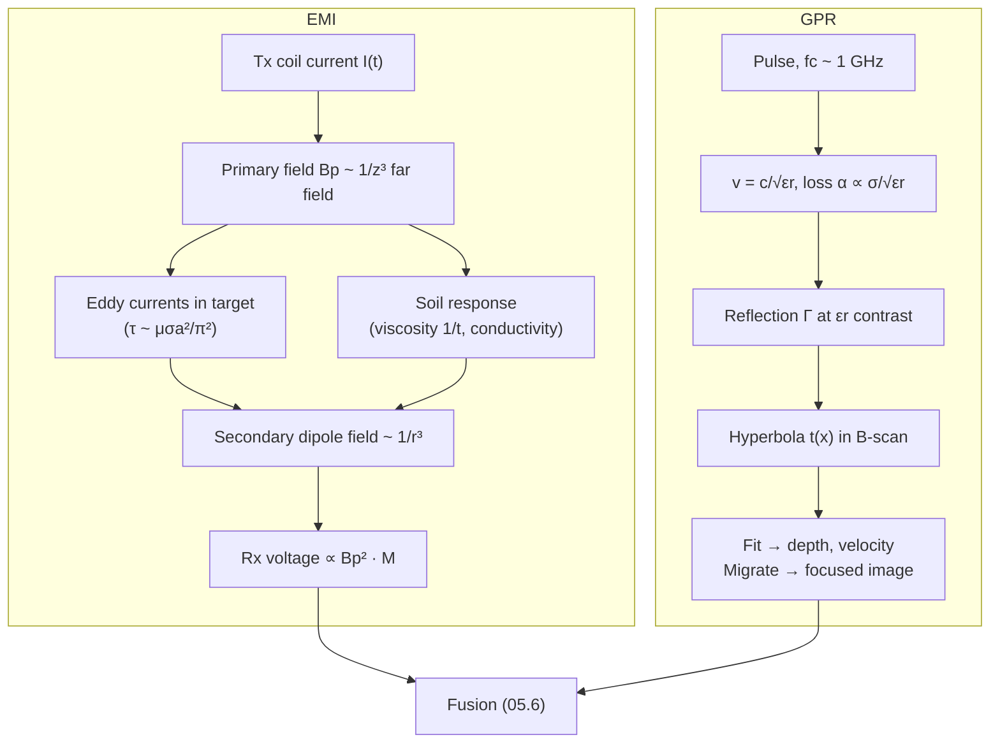

# 05.2 · Electromagnetic induction & ground-penetrating radar

<div class="module-card">

**Prerequisites** [05.1 Detection theory](lessons/stage-05/lesson-01.md) · [01.7 Electricity & EM](lessons/stage-01/lesson-07.md) (Faraday's law, Maxwell's equations, EM waves) · [01.3 Waves](lessons/stage-01/lesson-03.md) (wave equation, impedance) · [03.3 Mines, cluster munitions & legacy ordnance](lessons/stage-03/lesson-03.md) (why buried hazards matter).

**Estimated time** 7 h (3.5 h theory · 1 h simulator · 2.5 h programming) · **Level** Intermediate

**Next** [05.3 Penetrating radiation](lessons/stage-05/lesson-03.md) or [05.6 Sensor fusion](lessons/stage-05/lesson-06.md) (EMI + GPR is the canonical fusion pair).

<p class="tags"><span>electromagnetism</span><span>eddy currents</span><span>radar</span><span>inverse problems</span><span>Sim C</span><span>P02</span></p>
</div>

## Why this matters

The metal detector is still the backbone of humanitarian clearance, and the reason clearance is slow
is almost entirely a metal-detector problem: it finds *metal*, not hazards, so every bottle cap,
fragment and nail in a former battlefield is an alarm that must be investigated (05.1 §6). Worse,
some hazards contain very little metal, which forces the threshold down and the false-alarm rate up.
Ground-penetrating radar sees something different — contrasts in *dielectric permittivity* — so it
can respond to non-metallic objects and, combined with a metal detector, can help discriminate a
signature worth investigating from scattered scrap. The GICHD guidebook (2006) catalogues handheld
dual-sensor (EMI + GPR) systems and vehicle-mounted arrays precisely because neither sensor alone
meets the requirement. To reason about any of this — why a detector struggles in red lateritic soil,
why depth kills sensitivity so fast, why a GPR "sees" a hyperbola rather than an object — you need
the physics below.

## Learning objectives

1. Explain induction sensing from Faraday's law: primary field, eddy currents, secondary field; compute
   skin depth and the magnetic dipole response scaling with depth.
2. Relate a target's time-domain decay constant to its conductivity, permeability and size; compare
   pulse-induction and frequency-domain detectors and the kinds of soil response each must reject.
3. Explain magnetic viscosity and conductive-soil effects and why "minimum-metal" targets are the
   hardest case for EMI.
4. Compute GPR propagation velocity, two-way time, attenuation, reflection coefficient and
   range/lateral resolution in soils of given permittivity and conductivity.
5. Derive the diffraction hyperbola $t(x)$ for a point scatterer, fit it to data to recover depth and
   velocity, and explain what migration does.
6. For both sensors, list what they detect, their false-positive and false-negative mechanisms, and
   their environmental limits.

## Theory

### 1. Induction: primary field, eddy currents, secondary field

A transmit coil carrying current $I(t)$ produces a **primary** magnetic field $\mathbf B_p$. By
Faraday's law, a changing flux through any conducting loop induces an EMF,

$$ \mathcal E = -\frac{d\Phi_B}{dt}, \qquad \oint \mathbf E\cdot d\mathbf l = -\frac{d}{dt}\int \mathbf B\cdot d\mathbf A , $$

and in a conductor that EMF drives **eddy currents** $\mathbf J=\sigma\mathbf E$. The eddy currents
produce a **secondary** field $\mathbf B_s$, which the receive coil (often the same coil) senses. On
the axis of a circular loop of radius $a$,

$$ B_p(z) = \frac{\mu_0 I a^2}{2\,(a^2+z^2)^{3/2}} . $$

| Symbol | Meaning | SI unit |
|---|---|---|
| $\Phi_B$ | magnetic flux | Wb = T m² |
| $\mathcal E$ | induced EMF | V |
| $\sigma$ | electrical conductivity | S m⁻¹ |
| $\mu_0$ | vacuum permeability, $4\pi\times10^{-7}$ | H m⁻¹ |
| $I$ | coil current | A |
| $a$ | coil radius | m |
| $z$ | axial distance to target | m |

**Intuition.** The detector does not "see" metal; it sees a conductor (or a magnetic material)
disturbing a field it created. Anything conductive or magnetically permeable — including soil —
answers back.

**Numerical example.** $a=0.10$ m, $I=1$ A: $B_p(0.10\ \text{m}) = 2.22$ µT, $B_p(0.20\ \text{m})=0.562$ µT
— a factor 3.95 drop for doubling the depth. By reciprocity, the received signal from a small target
scales as $B_p(z)^2$ (the target is excited by the transmit field *and* coupled back through the same
geometry), so the signal drops by $3.95^2 = 15.6$. In the far field ($z\gg a$), $B_p\propto z^{-3}$
and the received signal falls as $z^{-6}$: doubling depth costs a factor 64.

```python
import numpy as np
MU0 = 4e-7 * np.pi

def loop_axial_B(z, a=0.10, I=1.0):
    """On-axis field of a circular loop [T]."""
    return MU0 * I * a**2 / (2 * (a**2 + z**2) ** 1.5)

print(loop_axial_B(0.1), loop_axial_B(0.2), (loop_axial_B(0.1) / loop_axial_B(0.2)) ** 2)
# 2.22e-06 5.62e-07 15.6
```

<details class="answer"><summary>Exercise 1 — then reveal</summary>

A detector is set so that a test object at 10 cm gives a signal 20× the noise floor. Using the
$B_p^2$ scaling for a 0.10 m coil, estimate the maximum depth at which it still gives 1× the noise
floor. Then repeat with a pure $z^{-6}$ law. Which is more realistic here and why?

*Answer.* Need $B_p(z)^2/B_p(0.1)^2 = 1/20$, i.e. $B_p(z)=0.2236\,B_p(0.1)$:
$(0.02/(0.01+z^2))^{1.5}=0.2236 \Rightarrow 0.01+z^2 = 0.02/0.2236^{2/3}=0.0543 \Rightarrow z\approx0.21$ m.
A pure $z^{-6}$ law gives $0.1\times20^{1/6}=0.165$ m. The loop formula is more realistic because
$z\sim a$ (near field); the $z^{-6}$ law underestimates range there. Either way, a 20× margin buys
only about a doubling of depth — sensitivity collapses with depth.

</details>

### 2. Skin depth

A time-harmonic field at angular frequency $\omega$ decays inside a conductor over the **skin depth**

<div class="callout eq">

$$ \delta = \sqrt{\frac{2}{\omega\mu\sigma}} = \frac{1}{\sqrt{\pi f \mu_0\mu_r \sigma}} . $$

</div>

| Symbol | Meaning | SI unit |
|---|---|---|
| $\delta$ | skin depth (field falls by $1/e$) | m |
| $f=\omega/2\pi$ | frequency | Hz |
| $\mu_r$ | relative permeability | — |

**Intuition.** Eddy currents oppose the field that creates them, so a good conductor shields its own
interior. When $\delta \ll$ target size the target behaves as a perfect conductor (response saturates);
when $\delta\gg$ target size the field penetrates and the response is weak and proportional to
$\omega\sigma$. The ratio $a/\delta$ (the *induction number*) sets which regime a target is in.

**Numerical example.** Aluminium ($\sigma=3.5\times10^7$ S/m) at 10 kHz: $\delta=0.85$ mm; at 1 kHz,
2.7 mm. Steel ($\sigma\approx6\times10^6$, $\mu_r\approx100$) at 10 kHz: 0.21 mm. Moist soil
($\sigma = 0.01$ S/m) at 10 kHz: 50 m — soil is transparent to the *field* but still contributes a
response because it is a huge volume. Sea water (4 S/m): 2.5 m — why underwater EMI is harder.

```python
def skin_depth(f, sigma, mu_r=1.0):
    return 1.0 / np.sqrt(np.pi * f * MU0 * mu_r * sigma)

print(skin_depth(1e4, 3.5e7), skin_depth(1e4, 0.01), skin_depth(1e4, 4.0))  # 8.5e-4, 50.3, 2.52
```

<details class="answer"><summary>Exercise 2 — then reveal</summary>

A 1 cm radius aluminium sphere at 10 kHz: compute $a/\delta$. Is it in the resistive-limit or
inductive-limit regime? What happens to its response if frequency is lowered to 100 Hz?

*Answer.* $a/\delta = 0.01/8.5\times10^{-4} \approx 11.8$ — inductive limit (currents confined to
the surface, response nearly frequency-independent and in-phase). At 100 Hz, $\delta = 8.5$ mm,
$a/\delta\approx1.2$: transition region, with a strong quadrature (out-of-phase) component. The
frequency at which quadrature peaks is a *fingerprint* of $\sigma a^2$ — the basis of
frequency-domain discrimination.

</details>

### 3. Target response: dipole model and decay constants

At distances large compared with its size, a target's secondary field is that of an induced
**magnetic dipole** $\mathbf m = \mathbf{M}(\omega)\,\mathbf B_p/\mu_0$, where $\mathbf M$ is the
target's magnetic polarisability tensor (3×3, symmetric). Its eigenvalues describe responses along
the object's principal axes, and the dipole field is

$$ \mathbf B_s(\mathbf r) = \frac{\mu_0}{4\pi r^3}\left[3(\mathbf m\cdot\hat{\mathbf r})\hat{\mathbf r} - \mathbf m\right] . $$

In the **time domain** (after the transmit current is switched off), the eddy currents decay as a
sum of exponentials, one per eddy-current mode. For a non-magnetic sphere of radius $a$, the slowest
mode has

<div class="callout eq">

$$ \tau_1 = \frac{\mu\sigma a^2}{\pi^2}, \qquad v(t)\propto \sum_k A_k\, e^{-t/\tau_k}\quad (t \gtrsim \tau_1:\ v\propto e^{-t/\tau_1}). $$

</div>

| Symbol | Meaning | SI unit |
|---|---|---|
| $\mathbf M$ | polarisability tensor | m³ |
| $\mathbf m$ | induced dipole moment | A m² |
| $\tau_k$ | eddy-current decay constants | s |
| $v(t)$ | receiver voltage after switch-off | V |

**Intuition.** Decay time is "inductance over resistance": bigger and more conductive objects hold
their currents longer ($\tau\propto\sigma a^2$). Small or poorly conducting pieces decay in
microseconds.

**Numerical example.** Aluminium sphere, $a=1$ cm: $\tau_1 = 4\pi\times10^{-7}\cdot3.5\times10^7\cdot10^{-4}/\pi^2 = 0.446$ ms.
The same metal, $a=2$ mm: $17.8$ µs. A stainless-steel sphere ($\sigma=1.4\times10^6$), $a=1$ cm: also
17.8 µs. So "small good conductor" and "large poor conductor" can look alike in $\tau$ — one source of
ambiguity. Sampled at 10, 20 and 100 µs, the fast target retains 57 %, 33 % and 0.4 % of its
signal; the slow target 98 %, 96 % and 80 %.

```python
def tau_sphere(sigma, a, mu_r=1.0):
    return MU0 * mu_r * sigma * a**2 / np.pi**2

for tau in (tau_sphere(3.5e7, 0.002), tau_sphere(3.5e7, 0.01)):
    print(tau, np.exp(-np.array([10e-6, 20e-6, 100e-6]) / tau))
```

<details class="answer"><summary>Exercise 3 — then reveal</summary>

Why do EMI discrimination algorithms estimate the *eigenvalues* of $\mathbf M$ (or their decay
curves) rather than just the amplitude? Give two reasons, one physical and one statistical.

*Answer.* Physical: amplitude depends on depth and orientation (through $B_p^2$ and the
$\hat{\mathbf r}$ geometry), while the eigenvalue decay curves are *intrinsic* to the object (size,
shape, material), so they transfer across depths. Statistical: intrinsic features give class
distributions that overlap less and vary less across sites — larger, more stable $d'$ — whereas
amplitude-only thresholds conflate "small and shallow" with "large and deep".

</details>

### 4. Pulse induction vs frequency-domain (continuous-wave) detectors

| | Pulse induction (PI, time domain) | Frequency domain / continuous wave (FD/CW) |
|---|---|---|
| Transmit | current ramp then fast switch-off, repeated at ~kHz | continuous sinusoid(s), often several frequencies |
| Measure | decay $v(t)$ at delays after switch-off | in-phase and quadrature components at each frequency |
| Soil rejection | wait until soil (fast) response has decayed; subtract viscous $1/t$ component | ground balance: rotate phase to null the soil vector |
| Weakness | early samples needed for small, fast-decaying targets — exactly where soil and switching transients are largest | ground balance is a single phase; strongly varying soils defeat it |
| Discrimination | decay-curve shape ($\tau$ spectrum) | response vs frequency (quadrature peak) |

The two are Fourier duals: a step-off response in time corresponds to the frequency response
$\propto i\omega\tau/(1+i\omega\tau)$ for a single mode. A PI detector's delay before its first
sample is a *high-pass* choice; a small, low-conductivity target whose $\tau$ is shorter than that
delay is effectively invisible.

### 5. Soil effects: magnetic viscosity and conductive ground

Many soils — especially tropical lateritic, volcanic and iron-oxide-rich ones — contain fine
ferrimagnetic grains whose magnetisation relaxes over a broad distribution of time constants
(**magnetic viscosity**). A broad log-uniform distribution of relaxation times produces a decay

$$ v_{soil}(t) \propto \frac{1}{t} $$

in PI, and in FD a quadrature susceptibility that is nearly constant across frequency with an
in-phase part that falls slowly (∝ $\ln f$). Because the soil fills the whole sensing volume,
its response can exceed that of a small target by orders of magnitude, and it changes as the head
height changes. Conductive (saline, wet) soils add a further eddy-current response. CWA 14747-2:2008
exists to characterise these soil properties (magnetic susceptibility, frequency dependence,
conductivity) so detector trials in one soil can be interpreted in another.

**Numerical example.** Between 20 µs and 100 µs a viscous soil response falls by $100/20=5$;
a 17.8 µs target falls by $e^{-80/17.8} = 90$ over the same interval. The soil *dominates* late
samples relative to fast targets, and "waiting for the soil to go away" does not work for $1/t$
decay the way it does for exponentials — PI designs instead fit and subtract the $1/t$ term.

### 6. The minimum-metal problem

Combine §§1–5: a target with a few grams of small metal parts has a small polarisability *and* a short
$\tau$, so its signal is weak, falls as $B_p^2$ with depth, and lives in the early-time window where
soil and switching transients are largest. To reach it, the operator must raise sensitivity, which
admits every fragment larger than the target — false alarms that 05.1 showed dominate cost. This
is the single strongest argument for adding a sensor that does not rely on metal.

<div class="callout key">

**Key idea.** EMI performance is not a property of the detector alone; it is a property of the
(detector, target, soil, clutter, operator) system. CWA 14747-1 therefore separates intrinsic
laboratory tests from blind field trials.

</div>

### 7. GPR: EM propagation in soil

A GPR antenna radiates short pulses (centre frequencies ~0.5–3 GHz for shallow targets) and records
echoes from boundaries where the **relative permittivity** $\varepsilon_r$ changes. In a low-loss
medium,

<div class="callout eq">

$$ v = \frac{c}{\sqrt{\varepsilon_r}}, \qquad t_{2w} = \frac{2d}{v}, \qquad \alpha \approx \frac{\sigma}{2}\sqrt{\frac{\mu_0}{\varepsilon_0\varepsilon_r}} = \frac{\sigma Z_0}{2\sqrt{\varepsilon_r}}\ \ [\text{Np/m}], \qquad \Gamma = \frac{\sqrt{\varepsilon_{r1}}-\sqrt{\varepsilon_{r2}}}{\sqrt{\varepsilon_{r1}}+\sqrt{\varepsilon_{r2}}} . $$

</div>

| Symbol | Meaning | SI unit |
|---|---|---|
| $c$ | speed of light, 0.2998 m/ns | m s⁻¹ |
| $\varepsilon_r$ | relative permittivity (air 1, dry sand 3–5, wet soil 15–30, water ≈ 81) | — |
| $v$ | propagation velocity | m s⁻¹ (m/ns) |
| $t_{2w}$ | two-way travel time | s (ns) |
| $d$ | depth | m |
| $\alpha$ | amplitude attenuation constant (valid for loss tangent $\sigma/\omega\varepsilon \ll 1$) | Np m⁻¹ (×8.686 = dB/m) |
| $Z_0$ | impedance of free space, 376.7 | Ω |
| $\Gamma$ | normal-incidence amplitude reflection coefficient | — |

**Intuition.** Water dominates. Its permittivity (~81) dwarfs that of dry minerals (~4–6), so soil
moisture sets velocity and contrast, and dissolved salts set conductivity and therefore loss. A GPR
image is a map of *where the dielectric properties change*, blurred by the antenna pattern.

**Numerical examples.**

- $\varepsilon_r = 4$: $v=0.150$ m/ns; $\varepsilon_r=9$: 0.100 m/ns; $\varepsilon_r=25$: 0.060 m/ns.
- Target 0.10 m deep in $\varepsilon_r=9$: $t_{2w}=2(0.10)/0.0999 = 2.0$ ns.
- Loss: $\sigma = 0.01$ S/m, $\varepsilon_r=9$: $\alpha = 0.01\cdot376.7/6 = 0.628$ Np/m $=5.5$ dB/m;
  two-way over 0.3 m: 3.3 dB (tolerable). Saline wet clay, $\sigma=0.1$, $\varepsilon_r=25$:
  $\alpha=3.77$ Np/m $=33$ dB/m — 20 dB two-way at 0.3 m, before spreading loss. (At 1 GHz the loss
  tangent for $\sigma=0.1$, $\varepsilon_r=25$ is 0.07, so the low-loss formula still roughly holds.)
- Contrast: a plastic-like object ($\varepsilon_r\approx3$) in soil with $\varepsilon_r=9$:
  $\Gamma = (3-1.732)/(3+1.732)=0.27$; the same object in dry sand ($\varepsilon_r=4$): $\Gamma=0.07$ —
  nearly invisible. A metal object gives $|\Gamma|\approx1$ in any soil.

```python
C = 0.299792458   # m/ns
Z0 = 376.73

def gpr_velocity(eps_r):            return C / np.sqrt(eps_r)
def two_way_time(d, eps_r):         return 2 * d / gpr_velocity(eps_r)
def alpha_np(sigma, eps_r):         return sigma * Z0 / (2 * np.sqrt(eps_r))
def gamma(eps1, eps2):              return (np.sqrt(eps1) - np.sqrt(eps2)) / (np.sqrt(eps1) + np.sqrt(eps2))

print(two_way_time(0.10, 9), alpha_np(0.01, 9) * 8.686, gamma(9, 3), gamma(4, 3))
# 2.0 ns, 5.45 dB/m, 0.268, 0.072
```

<details class="answer"><summary>Exercise 4 — then reveal</summary>

After rain, a sandy site's permittivity rises from 4 to 16. For a non-metallic object with
$\varepsilon_r=3$ at 0.15 m: compute the two-way time and $\Gamma$ before and after. Which
effect helps and which hurts detection?

*Answer.* Before: $v=0.150$, $t=2.0$ ns, $\Gamma=0.072$. After: $v=0.075$, $t=4.0$ ns,
$\Gamma=(4-1.732)/(4+1.732)=0.396$. Contrast improves 5.5× (helps); but wetter soil is usually more
conductive (more loss), the ground-surface reflection is stronger ($\Gamma_{air/soil}$ from 0.33 to
0.6, more clutter near the surface), and the target echo moves in time — any processing that
assumed a fixed velocity is now wrong. Net effect is site-dependent.

</details>

### 8. Resolution

Two reflectors separated in depth are resolved if their echoes do not overlap. With bandwidth $B$
(for impulse GPR, $B\approx f_c$),

$$ \Delta R \approx \frac{v}{2B}\quad\text{(conservative)}, \qquad \Delta R \approx \frac{\lambda}{4} = \frac{v}{4f_c}\quad\text{(Rayleigh-type, commonly quoted)} . $$

Lateral resolution at depth $d$ is set by the first Fresnel zone,
$r_F \approx \sqrt{\lambda d/2 + \lambda^2/16}$, or, after migration with synthetic aperture, by
roughly $\lambda/4$ to $\lambda/2$.

**Numerical example.** 1 GHz in $\varepsilon_r=9$: $\lambda = v/f=0.100$ m, $\Delta R\approx\lambda/4=2.5$ cm
(or $v/2B = 5$ cm conservatively); at $d=0.2$ m, $r_F=\sqrt{0.01+0.000625}=0.103$ m. Higher frequency
buys resolution and costs penetration (loss grows with frequency in real soils) — the fundamental GPR
trade-off.

### 9. Hyperbolic signatures — derivation and fitting

A GPR antenna has a wide beam, so it "sees" a small buried object before it is overhead. For a point
scatterer at horizontal position $x_0$, depth $d$, and a monostatic antenna at surface position $x$,
the one-way slant range is $r = \sqrt{d^2+(x-x_0)^2}$, so

<div class="callout eq">

$$ t(x) = \frac{2}{v}\sqrt{d^2+(x-x_0)^2} \quad\Longleftrightarrow\quad t^2 = t_0^2 + \frac{4}{v^2}(x-x_0)^2,\qquad t_0=\frac{2d}{v}. $$

</div>

This is a hyperbola in the $(x,t)$ plane with apex $(x_0,t_0)$ and asymptotic slope
$dt/dx \to 2/v$. **Key consequence:** $t^2$ is *quadratic* in $x$ — linear in the unknowns
$(a,b,c)$ of $t^2 = a+bx+cx^2$. Least squares on picked $(x_i,t_i)$ gives

$$ c = \frac{4}{v^2},\quad x_0 = -\frac{b}{2c},\quad t_0^2 = a - c\,x_0^2,\quad v = \frac{2}{\sqrt c},\quad d = \frac{v\,t_0}{2}. $$

So a single hyperbola yields **both depth and soil velocity** (hence $\varepsilon_r$), with no ground
truth — the standard field calibration trick.

**Numerical example.** $d=0.20$ m, $v=0.10$ m/ns: $t_0=4.0$ ns; at $x-x_0=0.20$ m,
$t=20\sqrt{0.08}=5.657$ ns. Inverting from those two points: $v = \sqrt{4(0.2)^2/(5.657^2-4^2)} = 0.100$ m/ns,
$d = 0.100\times4/2=0.200$ m. ✓

**Migration.** Each point scatterer smears into a hyperbola; *migration* undoes this by summing
energy along the hyperbola (diffraction-stack / Kirchhoff migration) or by wave-field extrapolation
in the $f$–$k$ domain, collapsing each hyperbola back to a point. It requires a velocity model —
wrong $v$ leaves "smiles" (over-migrated) or residual hyperbolas (under-migrated). It is the same
mathematics as synthetic-aperture radar and seismic imaging, and it is a linear inverse problem you
can write as $\mathbf y = \mathbf A\mathbf x$ with $\mathbf A$ a (huge, sparse) hyperbolic
summation operator.

```python
def ricker(t, f0):
    a = (np.pi * f0 * t) ** 2
    return (1 - 2 * a) * np.exp(-a)

def synth_bscan(x, t, targets, v, f0=1.0, noise=0.05, alpha=0.0, rng=None):
    """Point-scatterer B-scan. x [m], t [ns], targets=[(x0, d, amp)], v [m/ns], alpha [1/m]."""
    rng = np.random.default_rng(rng)
    B = np.zeros((t.size, x.size))
    for x0, d, amp in targets:
        r = np.sqrt(d**2 + (x - x0) ** 2)                  # one-way slant range
        g = amp * np.exp(-2 * alpha * r) / r               # spreading + two-way loss
        B += g[None, :] * ricker(t[:, None] - 2 * r[None, :] / v, f0)
    B += 3.0 * ricker(t[:, None] - 1.0, f0)                # flat direct/ground-bounce band
    return B + noise * rng.standard_normal(B.shape)

def fit_hyperbola(xp, tp):
    A = np.column_stack([np.ones_like(xp), xp, xp**2])
    a, b, c = np.linalg.lstsq(A, tp**2, rcond=None)[0]
    x0 = -b / (2 * c); v = 2 / np.sqrt(c)
    return x0, v * np.sqrt(a - c * x0**2) / 2, v          # x0, depth, velocity

x = np.linspace(0, 1.0, 101); t = np.linspace(0, 12, 600)
B = synth_bscan(x, t, [(0.45, 0.20, 1.0)], v=0.10, rng=1)
Bb = B - B.mean(axis=1, keepdims=True)                   # background removal kills the flat band
late = t > 2.0
tp = t[late][np.argmax(np.abs(Bb[late]), axis=0)]         # naive peak pick per trace
win = np.abs(x - 0.45) < 0.3
x0, d, v = fit_hyperbola(x[win], tp[win])
print(f"x0={x0:.3f} m depth={d:.3f} m v={v:.4f} m/ns eps_r={(C/v)**2:.2f}")
# x0=0.450 m depth=0.200 m v=0.1001 m/ns eps_r=8.97
```

<details class="answer"><summary>Exercise 5 — then reveal</summary>

Mean-trace background removal (used above) is a common first step. What does it do to a long,
flat, horizontal reflector such as a buried pipe running along the scan line, and why? What would
you use instead if you needed to keep it?

*Answer.* Subtracting the mean trace removes any feature identical across all traces — a flat
reflector parallel to the scan line vanishes along with the ground bounce. Alternatives: subtract a
*moving-window* mean (removes only features flatter than the window), estimate the ground bounce
explicitly by tracking the surface, or use SVD/PCA and discard only the first component while
checking what it contains.

</details>

### 10. Clutter and dual-sensor systems

GPR false alarms come from anything with dielectric contrast: stones, roots, voids, animal burrows,
soil layering, water pockets, and the rough ground surface itself (the strongest reflector, right
where shallow targets are). EMI false alarms come from metal clutter and magnetic soil. Because the
two sensors' clutter mechanisms are largely **different physics**, their errors are only partly
correlated — the condition under which fusion helps (05.6). Handheld dual-sensor detectors (for
example the US HSTAMIDS and Japan's ALIS, among the systems reviewed in the GICHD 2006 guidebook)
use the metal detector to cue and the GPR to characterise; vehicle-mounted arrays do the same at
scale, and recent work applies CNN/RNN models to GPR B-scans and 3-D volumes (Moalla et al., 2020)
and R-CNN hyperbola detection in a real-time vehicle system (Srimuk et al., 2022).

## Sensor summary

| | EMI (metal detector) | GPR |
|---|---|---|
| **Physical principle** | Faraday induction: eddy currents / magnetisation in the target create a secondary field | Reflection and diffraction of EM pulses at permittivity contrasts |
| **What it detects** | Conductive and/or magnetic material | Dielectric discontinuities (objects, voids, layers), including non-metallic |
| **Strengths** | Mature, cheap, robust, high $P_d$ for metal-rich targets at shallow depth; intrinsic features ($\tau$, polarisability) enable some discrimination | Sees non-metallic objects; gives depth and shape cues; images (B-/C-scans) suit ML |
| **Limitations** | Signal ∝ $B_p^2$ (up to $z^{-6}$); sees *all* metal; weak for small low-conductivity parts | Loss in wet/saline/clay soils; low contrast in dry sand; surface clutter; needs velocity model |
| **False positives** | Metal fragments, scrap, cartridge cases, magnetic stones, "hot" soil patches, head-height changes | Stones, roots, voids, burrows, layering, water pockets, surface roughness |
| **False negatives** | Deep targets; minimum-metal targets with short $\tau$; masking by nearby large metal; poor ground balance | Low $\varepsilon_r$ contrast; high attenuation; target in the ground-bounce window; oblique/flat shapes that reflect away |
| **Environmental limits** | Magnetically viscous (lateritic, volcanic) soil; conductive (saline) soil; temperature drift; EMI from power lines | Soil moisture and salinity; vegetation and uneven ground; frozen/thawed transitions |
| **Realistic examples** | Detector trials under CWA 14747-1 (ITEP); GICHD guidebook catalogue | Dual-sensor handhelds (GICHD 2006); vehicle GPR with R-CNN (Srimuk et al., 2022); CNN/RNN on 120 000 m² of data (Moalla et al., 2020) |

## Visual explanation



## Worked example — velocity calibration and depth estimate at a fictional site

A GPR survey at a fictional test lane produces a clear hyperbola from a seeded calibration object.
Picked points (x in m, t in ns): (0.30, 6.45), (0.40, 5.52), (0.50, 5.00), (0.60, 5.52), (0.70, 6.45).

1. **Fit.** By symmetry $x_0 = 0.50$, $t_0=5.00$ ns. From the 0.20 m offset:
   $c = (6.45^2 - 5.00^2)/0.20^2 = (41.60-25.00)/0.04 = 415.1$ ns²/m², so $v = 2/\sqrt{415.1}=0.0982$ m/ns.
2. **Soil.** $\varepsilon_r = (0.2998/0.0982)^2 = 9.3$ — moist sandy loam.
3. **Depth.** $d = v t_0/2 = 0.0982\times5.00/2 = 0.245$ m.
4. **Check** with the 0.10 m offset: $t = (2/0.0982)\sqrt{0.245^2+0.1^2} = 20.37\times0.2651 = 5.40$ ns
   vs picked 5.52 — a 0.12 ns residual, about one sample at 8 GS/s. Picking error of this size is why
   you fit many points, not two.
5. **Resolution.** With $f_c = 1$ GHz, $\lambda = 9.8$ cm, $\Delta R\approx2.5$ cm: two objects 3 cm
   apart vertically would be marginally resolved.

## Simulation work

<div class="callout sim">

**Sim C (sensor fusion), EMI metal detector and GPR.** (1) *Offline Python exercise* (Sim C has
no depth axis): plot the dipole-model EMI response $\propto d^{-6}$ for a high- and a low-metal
fictional object over 0.05–0.5 m on log–log axes, confirm the slope $-6$, add a noise floor and read
off each object's maximum detection depth. (2) In Sim C (Intermediate), fix the field in the URL,
e.g. `?level=Intermediate&seed=11&mineral=low`, and take EMI readings on about 20 cells. Using the
spec sheet, choose the EMI threshold that keeps $P_d\ge0.95$ for hazard-M. Reload with
`&mineral=high` (same seed, same ground truth) and repeat: how does the false-alarm density at
that threshold change, and which class causes it? (3) Take GPR readings on the same cells and note
which EMI false alarms are *not* shared by GPR — the raw material for fusion in 05.6.

</div>

<iframe class="sim-frame" src="sims/sensor-fusion/index.html?embed=1" height="720" loading="lazy"></iframe>

<a class="sim-link" href="sims/sensor-fusion/index.html" target="_blank">Open Sim C full-screen ↗</a>

## Practical exercises

<details class="answer"><summary>Exercise A — choosing a GPR frequency</summary>

You need to see objects down to 0.3 m in soil with $\varepsilon_r=16$, $\sigma=0.03$ S/m, and your
receiver dynamic range leaves 30 dB for soil loss (two-way, excluding spreading). Is attenuation the
limit? Then compute the depth resolution at 0.5, 1 and 2 GHz using $\lambda/4$.

*Answer.* $\alpha = 0.03\cdot376.7/(2\cdot4) = 1.41$ Np/m $=12.3$ dB/m; two-way at 0.3 m: 7.4 dB —
within budget in the low-loss model (real soils add frequency-dependent dielectric loss, so higher
frequencies lose more). $v=0.075$ m/ns: $\lambda/4 =3.75$, 1.9, 0.94 cm. Choose ~1–2 GHz,
then verify loss on site.

</details>

<details class="answer"><summary>Exercise B — PI sample timing</summary>

A PI detector's first sample is at 15 µs. Which of these (fictional) targets retains at least 10 %
of its initial signal at that time: (i) aluminium sphere, $a=1.5$ mm; (ii) aluminium, $a=4$ mm;
(iii) stainless steel, $a=4$ mm?

*Answer.* $\tau = \mu_0\sigma a^2/\pi^2$ gives (i) 10.0 µs → $e^{-1.5}=0.22$ ✓; (ii) 71.3 µs →
0.81 ✓; (iii) 2.85 µs → $e^{-5.26}=0.005$ ✗. The small, poorly conducting part is lost to an early-time
design decision.

</details>

<details class="answer"><summary>Exercise C — reading a B-scan</summary>

A B-scan shows (a) a strong flat band at 1 ns across all traces, (b) a hyperbola whose arms are
steeper than a calibration hyperbola at the same apex time, and (c) a flat reflector at 8 ns
across half the section. Interpret each and state what you cannot conclude.

*Answer.* (a) Direct coupling and ground-surface reflection. (b) Steeper arms mean smaller $v$
along its path — wetter material above it, or it is not a point scatterer (an extended object's
signature is flatter at the apex; a *steeper* hyperbola often indicates a velocity change). (c) A
layer boundary (soil horizon, water table, bedrock) ending mid-section. You cannot conclude
material identity, metal content or hazard from GPR geometry alone.

</details>

## Programming exercise — B-scan synthesis and hyperbola inversion

**Goal.** Build a B-scan simulator and an automatic hyperbola detector that recovers $(x_0,d,v)$
with uncertainties.

- **Input:** scan positions, time axis, list of point scatterers $(x_0,d,\text{amp})$, soil
  $\varepsilon_r$ and $\sigma$, noise level, wavelet centre frequency; optional layered clutter and
  random "stone" scatterers.
- **Output:** B-scan array; detected hyperbolas with $(\hat x_0,\hat d,\hat v)$ and 1σ uncertainties
  from the least-squares covariance; a migrated image using diffraction stacking with $\hat v$.
- **Constraints:** NumPy only; vectorised synthesis; peak picking robust to polarity (use the
  envelope via Hilbert transform implemented with FFT); ≤ 2 s for 200 traces × 1000 samples.
- **Expected behaviour:** single target, noise 0.05: depth within 1 cm and $v$ within 2 %;
  migration collapses each hyperbola to a spot whose width is ≈ $\lambda/2$.
- **Test cases:** (i) noiseless synthetic with $d=0.2$, $v=0.1$ returns exact values to 1 mm;
  (ii) two targets 0.3 m apart are both found; (iii) migrating with $v$ 20 % too high produces a
  "smile" — assert that the focused peak amplitude drops by > 30 %.
- **Extensions:** RANSAC hyperbola fitting in clutter; a Hough transform over $(x_0,t_0,v)$; train a
  small CNN on synthetic B-scans and test on a different soil velocity (domain shift, 09.3).

Link: [Project P02](projects/p02-sensor-noise/README.md) — add `EMISensor` and `GPRSensor` classes
built from these models.

## Reading

- GICHD, *Guidebook on Detection Technologies and Systems for Humanitarian Demining* (2006),
  https://www.gichd.org/fileadmin/uploads/gichd/Publications/Guidebook_Detection_2006.pdf — the
  chapters on metal detectors and dual-sensor systems; note which trial conditions each quoted
  result came from.
- MacDonald, J., Lockwood, J. R. et al., *Alternatives for Landmine Detection*, RAND (2003),
  https://www.rand.org/pubs/monograph_reports/MR1608.html — EMI and GPR chapters, including the
  false-alarm source table.
- Daniels, D. J., *Ground Penetrating Radar*, 2nd ed., IET (2004),
  https://shop.theiet.org/ground-penetrating-radar-2-ed — chapters on propagation in lossy media and
  the mine-detection chapter.
- CEN, CWA 14747-2:2008, *Soil characterization for metal detector and GPR performance*,
  https://knowledge.bsigroup.com/products/humanitarian-mine-action-test-and-evaluation-soil-characterization-for-metal-detector-and-ground-penetrating-radar-performance
  — which soil parameters matter and how they are measured.
- Srimuk, P. et al., "Implementation of and Experimentation with GPR for Real-Time Automatic
  Detection of Buried IEDs", *Sensors* 22 (2022), https://pmc.ncbi.nlm.nih.gov/articles/PMC9693345/ —
  an open-access end-to-end system: preprocessing, hyperbola detection, evaluation.
- "A Comprehensive Review of Conventional and Deep Learning Approaches for Ground-Penetrating Radar
  Detection of Raw Data", *Applied Sciences* 13(13):7992 (2023), https://doi.org/10.3390/app13137992
  — classical vs DL pipelines on A/B/C-scans.

Full bibliographic entries: [curriculum/sources.md](curriculum/sources.md).

## Assessment

1. *(Conceptual)* Why does raising a metal detector's sensitivity increase false alarms faster than
   it increases detections of minimum-metal targets at depth?
2. *(Mathematical)* Starting from $t(x)=\frac2v\sqrt{d^2+(x-x_0)^2}$, show that the asymptotic slope
   of the hyperbola is $2/v$ and explain how a user could estimate $v$ from a single arm without
   knowing the apex.
3. *(Computation)* Compute $\delta$ for copper ($5.8\times10^7$ S/m) at 3 kHz and the slowest decay
   constant of a copper sphere of radius 5 mm.
4. *(Interpretation)* A PI detector's signal at late times decays as $1/t$ over a whole lane,
   everywhere. What is the cause and what does it imply for the operating threshold?
5. *(Design)* Propose a two-sensor handheld concept for a lateritic, seasonally wet site. Justify
   the choice of EMI type and GPR band, and state the failure mode you expect to dominate each season.

<details class="answer"><summary>Answers to 3 and 4</summary>

3. $\delta = 1/\sqrt{\pi\cdot3000\cdot4\pi\times10^{-7}\cdot5.8\times10^7} = 1.21$ mm;
   $\tau_1 = 4\pi\times10^{-7}\cdot5.8\times10^7\cdot(0.005)^2/\pi^2 = 0.185$ ms.
4. Magnetic viscosity of the soil (a broad distribution of relaxation times). It is a background
   that varies with head height and soil patchiness; the threshold must sit above its fluctuation,
   so low-signal targets are lost unless the $1/t$ component is modelled and subtracted.

</details>

## Expert extension

- **EMI inversion.** Fit a multi-dipole or spheroid model (location, orientation, principal-axis
  decay curves) to a spatial grid of multi-channel PI data; examine the Fisher information for
  depth vs polarisability — they are strongly correlated.
- **Full-waveform GPR inversion.** Replace hyperbola fitting with FDTD forward modelling (e.g. an
  open-source FDTD code) and gradient-based inversion for $\varepsilon_r(x,z)$ and $\sigma(x,z)$.
- **Dispersive soils.** Model permittivity with a Cole–Cole relaxation; show how frequency-dependent
  loss distorts the wavelet and biases time picks.

## What comes next

[05.3](lessons/stage-05/lesson-03.md) swaps fields for photons: X-rays penetrate what radar cannot
and show internal structure; [05.6](lessons/stage-05/lesson-06.md) fuses EMI and GPR scores and
shows when correlated clutter makes fusion disappoint.
