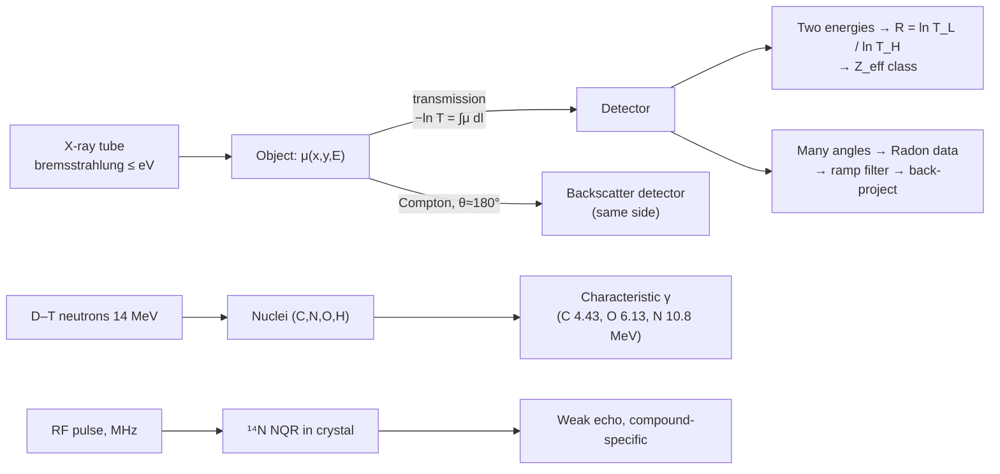

# 05.3 · Penetrating radiation: X-ray, dual-energy, backscatter, CT and neutron methods

<div class="module-card">

**Prerequisites** [05.1 Detection theory](lessons/stage-05/lesson-01.md) · [01.7 Electricity & EM](lessons/stage-01/lesson-07.md) (photons, energy units) · linear algebra and Fourier transforms · Poisson statistics.

**Estimated time** 7 h (3.5 h theory · 0.5 h simulator · 3 h programming) · **Level** Intermediate

**Next** [05.4 Trace & vapour detection](lessons/stage-05/lesson-04.md), then [05.6 Sensor fusion](lessons/stage-05/lesson-06.md). The imaging side continues in [09.1 Perception tasks](lessons/stage-09/lesson-01.md).

<p class="tags"><span>radiation physics</span><span>imaging</span><span>tomography</span><span>Fourier</span><span>radiation safety</span><span>Sim C</span><span>P02</span></p>
</div>

## Why this matters

When a suspicious item cannot be touched or opened, the most informative non-contact measurement is
usually to look *through* it. Public accounts of bomb-technician work — for example the FBI's
history of the 1980 Harvey's Resort Hotel case, where the item was photographed and X-rayed and
studied for more than 30 hours — show radiography as a routine step in turning an unknown object
into information for a decision. Airport and border security are built on the same physics at
industrial scale: dual-energy transmission imaging, backscatter and CT (Wells & Bradley, 2012), now
increasingly read by deep-learning models (Akcay & Breckon, 2020). Neutron and nuclear-quadrupole
methods go further and try to measure *elemental* or *molecular* composition rather than shape.

This lesson is about the physics and mathematics that make those images and signatures possible,
their failure modes, and the dose they cost. It deliberately contains no interpretation of real
device internals — all images and phantoms are fictional geometric test objects.

## Learning objectives

1. Explain X-ray production (bremsstrahlung, characteristic lines) and compute transmission through
   layered materials with the Beer–Lambert law and mass attenuation coefficients.
2. Explain the Z- and energy-dependence of photoelectric absorption and Compton scattering, and use
   it to derive dual-energy material discrimination (R-value, effective Z) and its ambiguities.
3. Quantify image noise from photon statistics and relate it to detectability (contrast-to-noise).
4. Explain backscatter imaging from Compton kinematics and state when single-sided access matters.
5. Derive the Radon transform and the Fourier-slice theorem; implement filtered back-projection in
   NumPy and analyse angular-sampling artefacts.
6. Apply time–distance–shielding and ALARA quantitatively (inverse square, half-value layers).
7. Describe thermal/fast-neutron analysis and NQR: principle, what they measure, strengths and limits.

## Theory

### 1. X-ray generation

An X-ray tube accelerates electrons through a potential $V$ into a high-$Z$ anode (typically
tungsten). Two processes emit photons:

- **Bremsstrahlung** ("braking radiation"): a continuous spectrum from 0 up to $E_{max}=eV$
  (the Duane–Hunt limit). A 150 kV tube emits photons up to 150 keV, with a mean energy roughly a
  third to a half of that after filtration.
- **Characteristic lines**: when an incident electron ejects an inner-shell electron, the refilling
  emits a line at an energy fixed by the anode element (tungsten K-lines ≈ 58–69 keV).

The fraction of beam power converted to X-rays is approximately

$$ \eta \approx k\,Z\,V,\qquad k\approx 1.1\times10^{-9}\ \text{V}^{-1}. $$

| Symbol | Meaning | Unit |
|---|---|---|
| $V$ | accelerating voltage | V |
| $E_{max}$ | maximum photon energy $= eV$ | eV (keV) |
| $Z$ | anode atomic number | — |
| $\eta$ | X-ray production efficiency | — |

**Numerical example.** Tungsten ($Z=74$) at 150 kV: $\eta \approx 1.1\times10^{-9}\cdot74\cdot1.5\times10^5 = 1.2\,\%$.
Ninety-nine per cent of the electron beam power becomes heat — why tubes need cooling and why many
portable field systems use short, pulsed exposures instead of continuous beams.

### 2. Beer–Lambert attenuation

A narrow beam of mono-energetic photons crossing material loses photons at a rate proportional to
the number present:

<div class="callout eq">

$$ I = I_0\exp\!\Big(-\int_{\text{ray}}\mu(\mathbf r)\,dl\Big),\qquad \mu = \Big(\frac{\mu}{\rho}\Big)\rho,\qquad T = \frac{I}{I_0} = \exp\!\Big(-\sum_i (\mu/\rho)_i\,\rho_i\,x_i\Big),\qquad \mathrm{HVL} = \frac{\ln2}{\mu}. $$

</div>

| Symbol | Meaning | SI unit (common) |
|---|---|---|
| $I_0, I$ | incident / transmitted photon fluence | m⁻² |
| $\mu$ | linear attenuation coefficient | m⁻¹ (cm⁻¹) |
| $\mu/\rho$ | mass attenuation coefficient | m² kg⁻¹ (cm² g⁻¹) |
| $\rho$ | density | kg m⁻³ (g cm⁻³) |
| $x$ | thickness | m (cm) |
| $T$ | transmission | — |
| HVL | half-value layer | m (cm, mm) |

**Intuition.** Each thin slab removes the same *fraction* of the photons reaching it, so transmission
is exponential and the log-transmission $-\ln T = \int \mu\,dl$ is a **line integral** — additive
along the ray. That linearity is what makes dual-energy and CT tractable.

**Approximate mass attenuation coefficients** (narrow-beam, total with coherent scattering, as
tabulated in standard photon cross-section databases such as NIST XCOM; rounded):

| Material | $\rho$ (g/cm³) | $\mu/\rho$ at 60 keV (cm²/g) | $\mu/\rho$ at 100 keV (cm²/g) |
|---|---|---|---|
| Water (organic-like, $Z_{eff}\approx7.4$) | 1.00 | 0.206 | 0.171 |
| Aluminium ($Z=13$) | 2.70 | 0.278 | 0.170 |
| Iron ($Z=26$) | 7.87 | 1.205 | 0.372 |
| Lead ($Z=82$) | 11.35 | — | 5.55 |

**Numerical examples.** 5 cm of water at 60 keV: $T=\exp(-0.206\times5)=0.357$. 1 cm of iron at
100 keV: $T=\exp(-0.372\times7.87)=0.054$. HVL of water at 60 keV: $0.693/0.206=3.4$ cm; of lead at
100 keV: $0.693/(5.55\times11.35) = 0.011$ cm $=0.11$ mm.

```python
import numpy as np

MU_RHO = {  # cm^2/g at (60 keV, 100 keV), rounded
    "water": (0.2059, 0.1707), "Al": (0.2778, 0.1704), "Fe": (1.205, 0.3717)}
RHO = {"water": 1.0, "Al": 2.699, "Fe": 7.874}

def transmission(layers, e_idx):
    """layers = [(material, thickness_cm)], e_idx 0 -> 60 keV, 1 -> 100 keV."""
    return np.exp(-sum(MU_RHO[m][e_idx] * RHO[m] * x for m, x in layers))

print(transmission([("water", 5)], 0), transmission([("Fe", 1)], 1))   # 0.357 0.054
```

<details class="answer"><summary>Exercise 1 — then reveal</summary>

Real tubes emit a *spectrum*. Explain qualitatively why the effective attenuation coefficient
measured through increasing thicknesses of aluminium *decreases* with thickness (beam hardening),
and name one CT artefact it causes.

*Answer.* Low-energy photons have higher $\mu$ and are removed first, so the surviving beam's mean
energy rises with depth and the effective $\mu$ falls; $-\ln T$ grows sub-linearly with thickness.
In CT, the centre of a uniform object appears less attenuating than its edges (**cupping**), and
dark streaks appear between dense objects.

</details>

### 3. Why attenuation depends on Z and E

In the diagnostic/security range (≈ 20–450 keV) two interactions dominate:

- **Photoelectric absorption** — the photon is absorbed by an inner-shell electron. Per atom,
  $\sigma_{pe}\propto Z^{n}/E^{3}$ with $n\approx 4$ (3–4 per unit mass, depending on convention and
  energy); strongest at low $E$ and high $Z$, with jumps at absorption edges.
- **Compton scattering** — the photon scatters from a (quasi-)free electron. The cross-section per
  electron (Klein–Nishina) depends only weakly on $E$ here, so per unit mass it scales with electron
  density $\propto Z/A\approx\tfrac12$ for most light elements: nearly **Z-independent**.
- Pair production requires $E>1.022$ MeV and matters only for high-energy cargo systems.

For a compound, the photoelectric-equivalent **effective atomic number** is often defined as

$$ Z_{eff} = \Big(\sum_i f_i Z_i^{\,2.94}\Big)^{1/2.94}, $$

with $f_i$ the fraction of electrons contributed by element $i$.

**Numerical example.** Water: H contributes 2 of 10 electrons, O 8 of 10.
$Z_{eff}=(0.2\cdot1 + 0.8\cdot8^{2.94})^{1/2.94} = (0.2+361.3)^{0.340}=7.42$. The photoelectric
contrast between iron and water per atom scales as $(26/7.42)^4\approx150$ — why metals stand out
at low energy and organics do not.

<details class="answer"><summary>Exercise 2 — then reveal</summary>

Using the table, compute the ratio $\mu/\rho(60)/\mu/\rho(100)$ for water, aluminium and iron.
Explain the ordering physically.

*Answer.* Water 1.21, Al 1.63, Fe 3.24. The low-to-high-energy ratio grows with $Z$ because the
photoelectric share (∝ $Z^n/E^3$, strongly energy-dependent) grows with $Z$, while the Compton
share (weakly energy-dependent) dominates light elements.

</details>

### 4. Dual-energy material discrimination

Measure the same ray at two effective energies (two tube voltages, or a stacked low/high-energy
detector). For a single material of unknown thickness $x$,

<div class="callout eq">

$$ R \equiv \frac{\ln T_L}{\ln T_H} = \frac{\mu(E_L)\,x}{\mu(E_H)\,x} = \frac{(\mu/\rho)_L}{(\mu/\rho)_H} , $$

</div>

which is **independent of thickness and density** and increases monotonically with $Z_{eff}$.
Scanners map $R$ (or a calibrated $Z_{eff}$) to colour classes — conventionally organic / light
inorganic / metal — and $\ln T_H$ to brightness.

| Symbol | Meaning | Unit |
|---|---|---|
| $T_L, T_H$ | transmission in low / high energy channel | — |
| $R$ | dual-energy ratio ("R-value") | — |

**Numerical example (idealised monoenergetic 60/100 keV).** Water $R=1.21$, aluminium $1.63$,
iron $3.24$ — and the same for 2 cm or 8 cm of water, as the formula promises.

**The ambiguity.** Now superpose 2 mm of iron and 10 cm of water on the same ray:
$T_L = 0.0191$, $T_H=0.101$, $R=1.73$ — *looks like aluminium*. Because $-\ln T$ is a sum of two
materials' contributions, one ratio cannot separate two unknown thicknesses; overlapping objects
produce intermediate $R$ values. This is fundamental, not a calibration issue: two energies give
two equations, enough for two *basis materials* (basis-material decomposition) but not for an
arbitrary stack. Remedies are more views (CT), more energy bins (photon-counting detectors) or
other physics.

```python
def r_value(layers):
    return np.log(transmission(layers, 0)) / np.log(transmission(layers, 1))

print(r_value([("water", 2)]), r_value([("water", 8)]))          # 1.206 1.206
print(r_value([("Al", 2)]), r_value([("Fe", 0.2), ("water", 10)]))  # 1.630 1.726
```

<details class="answer"><summary>Exercise 3 — basis decomposition, then reveal</summary>

Treat water and iron as basis materials. Given measured $-\ln T_L = 3.957$ and $-\ln T_H = 2.293$,
solve for the two thicknesses using the table's coefficients.

*Answer.* Solve $\begin{bmatrix}0.2059 & 1.205\cdot7.874\\ 0.1707 & 0.3717\cdot7.874\end{bmatrix}\begin{bmatrix}x_w\\x_{Fe}\end{bmatrix}=\begin{bmatrix}3.957\\2.293\end{bmatrix}$:
$x_w\approx10.0$ cm, $x_{Fe}\approx0.20$ cm — exactly the superposition above. Two energies, two
unknowns: solvable only because we *assumed* the basis. Noise in $T$ is amplified by the
conditioning of this 2×2 matrix (2-norm condition number ≈ 97 here).

</details>

### 5. Photon statistics and detectability

Photon counts are Poisson: a pixel expecting $N$ photons has standard deviation $\sqrt N$. For a
feature that changes the expected count from $N_1$ to $N_2$,

$$ \mathrm{CNR} \approx \frac{|N_1-N_2|}{\sqrt{N_1}}, \qquad \text{Rose criterion: } \mathrm{CNR}\gtrsim 5 \text{ for reliable visual detection}. $$

**Numerical example.** 5 cm water vs 4 cm water + 1 cm aluminium at 60 keV: $T_1=0.357$,
$T_2=0.207$, contrast 42 %. With $N_0=100$ photons/pixel: $N_1=35.7$, $N_2=20.7$, CNR $=2.5$ — not
reliably visible. With $N_0=1000$: CNR $=7.9$. Required $N_0$ for CNR $=5$: $25/(C^2T_1)\approx 400$.
**Dose is proportional to $N_0$**, so detectability of a given contrast has a hard dose price — the
same $d'$-vs-cost trade-off as 05.1, now set by quantum noise.

### 6. Backscatter imaging

A collimated "pencil" beam is rastered across the object; detectors on the *same side* as the source
collect Compton-scattered photons. The scattered energy follows

$$ E' = \frac{E}{1 + \frac{E}{m_ec^2}(1-\cos\theta)} , $$

with $m_ec^2=511$ keV. At $E=100$ keV, $\theta=180°$: $E'=71.9$ keV; at 90°: 83.6 keV.

**Intuition.** Backscatter is strongest from low-$Z$, moderately dense material near the surface
(where Compton dominates and the scattered photons can still escape), so organic materials appear
bright — the opposite contrast from transmission. It needs access to only one side, which matters for
walls, vehicles and large objects. Depth information is limited: the scattered signal comes from a
few centimetres, and it is attenuated on the way in and on the way out.

### 7. Portable radiography in EOD — why, conceptually

In EOD the purpose of radiography is to convert an unknown into *information for a decision*
without touching or opening the item: whether it contains anything at all, the presence of
structure, dense components or liquids, and whether something changed between two images. The
decision framework that uses that information is the subject of 07.1–07.2. This course does **not**
teach interpretation of device internals; the relevant engineering questions here are generic:
spatial resolution vs source spot size and geometry, contrast vs dose (§5), single-view
superposition (a radiograph is a projection — depth is lost), and the operator's exposure (§9).

### 8. CT: the Radon transform and filtered back-projection

A radiograph collapses depth. Many projections from different angles recover it. For a 2-D slice
$f(x,y)$ (the attenuation map), the **Radon transform** gives the log-transmission along every line:

<div class="callout eq">

$$ p_\theta(s) = \mathcal R f = \iint f(x,y)\,\delta(x\cos\theta + y\sin\theta - s)\,dx\,dy . $$

**Fourier-slice theorem:** $\hat p_\theta(\omega) = \hat f(\omega\cos\theta,\ \omega\sin\theta)$ — the
1-D Fourier transform of a projection is a radial slice of the 2-D Fourier transform of the image.

**Filtered back-projection:** $f(x,y) = \displaystyle\int_0^{\pi}\big(p_\theta * h\big)(x\cos\theta + y\sin\theta)\,d\theta$, with $\hat h(\omega)=|\omega|$ (the ramp filter).

</div>

| Symbol | Meaning | Unit |
|---|---|---|
| $f(x,y)$ | linear attenuation map | m⁻¹ |
| $\theta$ | projection angle | rad |
| $s$ | detector coordinate (signed distance of the ray from the origin) | m |
| $p_\theta(s)$ | projection ($-\ln T$) | — |
| $h$ | ramp filter kernel | m⁻² |

**Derivation sketch.** Write $f$ as an inverse 2-D Fourier transform in polar coordinates:
$f(\mathbf x)=\int_0^{\pi}\!\int_{-\infty}^{\infty}\hat f(\omega\mathbf n_\theta)e^{2\pi i\omega\,\mathbf n_\theta\cdot\mathbf x}|\omega|\,d\omega\,d\theta$.
The Jacobian of polar coordinates contributes $|\omega|$; by the Fourier-slice theorem
$\hat f(\omega\mathbf n_\theta)=\hat p_\theta(\omega)$, so the inner integral is the inverse 1-D transform of
$|\omega|\hat p_\theta$ — a ramp-filtered projection — evaluated at $s=\mathbf n_\theta\cdot\mathbf x$. ∎

**Intuition.** Plain back-projection (smearing each projection back along its rays) over-weights low
spatial frequencies because the radial slices are dense near the origin of Fourier space — the
result is blurred as $1/r$. The ramp filter re-weights each frequency by the density of samples.

**Sampling.** For an $N$-pixel detector row, roughly $\frac{\pi}{2}N$ angles over 180° are needed
to avoid angular aliasing: $N=128 \Rightarrow \approx 201$ views. Fewer views produce streaks.

**Numerical check (code below).** On a 128×128 fictional phantom, the relative RMS reconstruction
error is 1.13 with 18 views, 0.51 with 45 and 0.27 with 180 (the remainder is edge ringing and the
crude pixel-driven projector); the water-filled region reconstructs at 0.337 vs 0.350 true.

```python
def phantom(n=128):
    """Fictional inspection phantom; values are linear attenuation in arbitrary units."""
    y, x = np.mgrid[-1:1:n*1j, -1:1:n*1j]
    img = np.zeros((n, n))
    img[(np.abs(x) < 0.80) & (np.abs(y) < 0.55)] = 0.20                 # plastic housing wall
    img[(np.abs(x) < 0.74) & (np.abs(y) < 0.49)] = 0.02                 # air inside
    img[(x + 0.35)**2 + (y - 0.10)**2 < 0.18**2] = 0.35                  # water-filled cylinder
    img[(np.abs(x - 0.35) < 0.25) & (np.abs(y + 0.15) < 0.08)] = 0.60    # aluminium block
    img[(x - 0.45)**2 + (y - 0.30)**2 < 0.05**2] = 1.50                  # steel pin, end-on
    return img

def radon(img, thetas):
    """Pixel-driven projector: p(theta, s) ~ line integral along x cos + y sin = s."""
    n = img.shape[0]
    c = np.linspace(-1, 1, n); X, Y = np.meshgrid(c, c); ds = c[1] - c[0]
    sino = np.zeros((len(thetas), n))
    for k, th in enumerate(thetas):
        j = np.clip(np.round((X * np.cos(th) + Y * np.sin(th) + 1) / ds).astype(int), 0, n - 1)
        sino[k] = np.bincount(j.ravel(), weights=img.ravel(), minlength=n)[:n]
    return sino * ds

def fbp(sino, thetas):
    """Filtered back-projection with a Ram-Lak (ramp) filter."""
    n_ang, n = sino.shape
    pad = 2 ** int(np.ceil(np.log2(2 * n)))
    ramp = np.abs(np.fft.fftfreq(pad))                                   # |f|, cycles/sample
    q = np.real(np.fft.ifft(np.fft.fft(sino, n=pad, axis=1) * ramp, axis=1))[:, :n]
    c = np.linspace(-1, 1, n); X, Y = np.meshgrid(c, c); ds = c[1] - c[0]
    rec = np.zeros((n, n))
    for k, th in enumerate(thetas):
        rec += np.interp(X * np.cos(th) + Y * np.sin(th), c, q[k])       # back-project
    return rec * np.pi / n_ang / ds                                      # dθ = π/n_ang; |f|/ds per length

img = phantom()
for n_ang in (18, 45, 180):
    th = np.linspace(0, np.pi, n_ang, endpoint=False)
    rec = fbp(radon(img, th), th)
    print(n_ang, np.sqrt(np.mean((rec - img)**2) / np.mean(img**2)))     # 1.13, 0.51, 0.27
```

<details class="answer"><summary>Exercise 4 — then reveal</summary>

(a) Replace the ramp by a Hann-windowed ramp, $|f|\cdot\frac12(1+\cos(\pi f/f_{max}))$. Predict
the effect on noise and edge sharpness. (b) The steel pin creates streaks in a real scanner but not
in this simulation. Which physics did the simulation leave out?

*Answer.* (a) Lower high-frequency gain: less noise and ringing, softer edges — a bias–variance
trade-off. (b) The simulation is monoenergetic and noise-free with exact line integrals. Real
metal causes beam hardening (spectrum shifts), photon starvation (very few counts ⇒ huge relative
noise in $-\ln T$), and scatter; FBP spreads those inconsistent projections into streaks. Remedies:
iterative/model-based reconstruction and metal-artefact reduction.

</details>

### 9. Dose and radiation safety

Radiation protection rests on **justification, optimisation (ALARA — as low as reasonably
achievable) and limitation**, applied through **time, distance and shielding**:

<div class="callout eq">

$$ \dot D(r) = \dot D(r_0)\left(\frac{r_0}{r}\right)^2 \ \ \text{(point source, no attenuation)},\qquad D = \dot D\,t,\qquad \dot D_{\text{shielded}} = \dot D\cdot 2^{-x/\mathrm{HVL}} . $$

</div>

| Symbol | Meaning | Unit |
|---|---|---|
| $\dot D$ | dose (equivalent) rate | Sv s⁻¹ (µSv/h) |
| $D$ | accumulated dose | Sv |
| $r$ | distance from source | m |
| $t$ | exposure time | s |
| $x$ | shield thickness | m |

**Numerical example (fictional source).** A generator delivers 10 µSv per exposure at 1 m on the
beam axis. At 5 m: $10/25=0.4$ µSv; at 10 m: 0.1 µSv. To reduce a narrow-beam 100 keV rate by 1000×
with lead needs $\log_2 1000 = 10$ HVLs $\approx 1.1$ mm (real, broad-beam shielding needs more
because scattered photons build up). Distance is usually the cheapest protection — and it is
also why remote operation (robots, Stage 6) combines naturally with radiography.

```python
def dose_at(d_ref, r_ref, r):             return d_ref * (r_ref / r) ** 2
def shielded(dose, x, hvl):               return dose * 2 ** (-x / hvl)
print(dose_at(10, 1, 5), shielded(10, 1.1, 0.11))   # 0.4, 0.0098
```

<details class="answer"><summary>Exercise 5 — then reveal</summary>

An operator must take 12 exposures. Option A: stand at 4 m behind 0.5 mm of lead-equivalent
shielding (HVL 0.11 mm at the relevant energy). Option B: stand at 15 m unshielded. With the
fictional 10 µSv at 1 m per exposure, which is lower dose?

*Answer.* A: $12\times10/16\times2^{-4.55} = 7.5\times0.0428 = 0.32$ µSv. B: $12\times10/225 = 0.53$ µSv.
A is lower here, but only if the shield actually covers the line of sight and scatter is small;
in practice, combine both.

</details>

### 10. Neutron-based interrogation and NQR (concepts)

X-rays measure density and $Z_{eff}$ — not chemistry. Neutron methods measure **elemental**
composition by exciting nuclei and counting the characteristic gamma rays they emit (IAEA, 2012):

- **Thermal neutron analysis (TNA).** Slow neutrons are captured; capture on ¹⁴N emits a 10.8 MeV
  gamma, which is high enough to stand out from most backgrounds. Many energetic materials are
  nitrogen-rich, so an elevated N signal is an indicator — but nitrogen is also abundant in
  fertilisers, foods, plastics (nylon), wool and soil organic matter.
- **Fast neutron analysis (FNA / PFNA / PFTNA).** 14 MeV neutrons (from a D–T generator) excite
  inelastic-scatter gammas (e.g. C at 4.43 MeV, O at 6.13 MeV). Ratios such as C/O and N/O
  distinguish broad material classes. Pulsing lets the system separate fast (inelastic) and slow
  (capture) gamma windows.
- **Associated-particle imaging (API).** In D–T fusion each neutron is born with an alpha particle
  in the opposite direction; detecting the alpha gives the neutron's direction and time, so the
  gamma's time of flight locates its origin in 3-D. A 14.1 MeV neutron travels ≈ 5.1 cm/ns, so
  1 ns timing corresponds to ≈ 5 cm along the ray.
- **Moderation.** Neutrons slow by elastic collisions; hydrogen is by far the best moderator. The
  number of collisions to thermalise from 14.1 MeV to 0.025 eV is $n=\ln(E_0/E)/\xi$, with mean
  logarithmic energy decrement $\xi=1$ for H (≈ 20 collisions) and 0.158 for C (≈ 128). Soil
  moisture therefore changes the neutron field, and the background, from site to site.

**Nuclear quadrupole resonance (NQR).** Nuclei with spin ≥ 1 (¹⁴N has spin 1) have an electric
quadrupole moment that interacts with the local electric-field gradient in a *crystal*, giving
resonance frequencies (typically below about 5 MHz for ¹⁴N) that are specific to the compound and
its crystal form. An RF coil excites and listens — no magnet is needed, unlike NMR. It is
chemically specific, but the signal is extremely weak, frequencies drift with temperature,
radio-frequency interference and acoustic ringing compete, measurement times are long, liquids and
amorphous materials give no NQR signal, and RF does not penetrate conductive enclosures. RAND (2003)
assesses both neutron and NQR methods for landmine detection and highlights these limits.

<details class="answer"><summary>Exercise 6 — then reveal</summary>

A TNA system produces a count $k$ in the 10.8 MeV window during a fixed interrogation. With an
empty-ground background of 400 counts (Poisson), what count gives $P_{fa}=10^{-3}$ (Gaussian
approximation)? If a target adds 60 counts on average, what is $P_d$?

*Answer.* $\sigma=\sqrt{400}=20$; threshold $400+3.09\times20=461.8$. With target: mean 460,
$\sigma\approx\sqrt{460}=21.4$; $P_d = Q((461.8-460)/21.4)=Q(0.084)=0.47$. Doubling the
interrogation time doubles signal and background: threshold $800+3.09\sqrt{800}=887.4$, mean 920,
$P_d=Q(-32.6/30.3)=Q(-1.07)\approx0.86$ — time buys $d'$ as $\sqrt t$.

</details>

## Sensor summary

| | X-ray transmission (+ dual-energy) | Backscatter | CT | Neutron (TNA/FNA/API) | NQR |
|---|---|---|---|---|---|
| **Physical principle** | Beer–Lambert attenuation; photoelectric vs Compton Z-dependence | Compton scattering to same side | Radon inversion of many projections | Nuclear reactions → characteristic gammas | ¹⁴N quadrupole resonance in crystals |
| **What it detects** | Projected density × thickness; $Z_{eff}$ class | Low-Z, near-surface material | 3-D attenuation (and $Z_{eff}$ with dual energy) | Elemental ratios (C, H, N, O) | Specific crystalline compounds |
| **Strengths** | Fast, mature, high resolution, see-through | One-sided access; organics bright | Removes superposition; volumetric features for ML | Chemical-element specificity; penetrates bulk | Compound-specific, low false alarm in principle |
| **Limitations** | Superposition, depth lost; dose | Shallow depth; low resolution; slow raster | Heavy, slow, costly; needs full angular access | Large, heavy sources & shielding; dose; slow | Weak signal, long time, RFI, temperature drift |
| **False positives** | Benign dense or organic objects with similar $Z_{eff}$; overlap-induced intermediate R | Benign organic surfaces | Benign materials with similar density/$Z_{eff}$; artefact streaks | N-rich benign materials (fertiliser, food, nylon); soil N | Benign compounds with nearby lines; RFI spikes |
| **False negatives** | Low-contrast items under clutter; thin sheets; overlap masking | Deep or shielded items | Metal artefacts obscuring nearby regions; too few views | Small masses; high background (moist soil); geometry | Liquids/amorphous materials; conductive enclosure; off-frequency (temperature) |
| **Environmental limits** | Operator dose, power, access to both sides | Stand-off and scatter geometry | Needs rotation (lab/checkpoint) | Soil moisture, radiation-safety zone | RF noise, temperature |
| **Realistic examples** | Harvey's 1980 case radiography (FBI); dual-energy baggage (Wells & Bradley 2012) | Security backscatter (Wells & Bradley 2012) | Checked-baggage CT + DL (Akcay & Breckon 2020) | IAEA neutron-generator methods (2012) | RAND 2003 NQR assessment; Yinon (2007) chapter |

## Visual explanation



## Worked example — designing a fictional inspection exposure

A fictional inspection phantom is about 30 cm thick, mostly water-equivalent (organic-like), and may
contain a 5 mm aluminium feature that must be visible. The detector pixel receives $N_0$ photons
through air.

1. **Transmission at 100 keV (idealised).** Background path 30 cm water: $T_1=e^{-0.1707\cdot30}=e^{-5.12}=0.0060$.
   Feature path: 29.5 cm water + 0.5 cm Al: $T_2=e^{-0.1707\cdot29.5-0.1704\cdot2.699\cdot0.5}=0.0060\times e^{-0.2300+0.0854}=0.0060\times0.865=0.00517$.
   Contrast ≈ 13.5 %.
2. **Required photons.** CNR $=5$ requires $N_0T_1\,C^2\ge25$, i.e.
   $N_0\ge25/(0.0060\cdot0.135^2)\approx2.3\times10^5$ photons per pixel — a significant exposure.
3. **Could 60 keV do better?** $T_1=e^{-6.18}=0.0021$; $T_2/T_1 = e^{-(0.2778\cdot2.699-0.2059)\cdot0.5}=e^{-0.272}=0.762$,
   contrast 24 %. Then $N_0\ge25/(0.0021\cdot0.24^2)\approx2.1\times10^5$ — similar: better contrast
   is paid for by fewer transmitted photons. The optimum energy balances the two; for thick objects
   it moves higher.
4. **Operator dose.** Whatever $N_0$ is chosen, stand-off distance and remote triggering reduce
   operator dose by $1/r^2$; the object dose is irrelevant to the phantom but not to people or to
   photographic film nearby.

## Simulation work

<div class="callout sim">

**Sim C (sensor fusion), X-ray-like channel.** (1) Note the X-ray-like sensor's cost (7 units) and its σ
in the spec sheet, then take two readings on the same cell and watch the auto-fusion posterior.
Sim C has no exposure control, so do the photon side on paper: if fresh noise falls as
$1/\sqrt{N}$ with photon count, how much would a 4× longer exposure help, and why does the
persistent per-cell error in the *correlated* field setting not shrink with repeats (the debrief
reports the resulting overconfidence)? (2) Find a cell where the X-ray-like channel and the metal
channel disagree; explain the disagreement in terms of what each physically measures. (3) After
the debrief reveals the ground truth, record the X-ray channel's high readings on non-hazard cells:
do they fall on the same cells as the metal detector's false alarms? Keep the notes for 05.6.

</div>

## Practical exercises

<details class="answer"><summary>Exercise A — thickness-independent discrimination, in practice</summary>

A dual-energy system measures, for three pixels, $(-\ln T_L, -\ln T_H)$ = (1.03, 0.854),
(4.12, 3.41), (1.50, 0.920). Classify each as water-like, aluminium-like or iron-like using the
idealised R-values, and comment on the third.

*Answer.* R = 1.206 (water-like), 1.208 (water-like, four times thicker — same class), 1.630
(aluminium-like). The third could also be a *stack* of iron and water (§4); R alone cannot tell.

</details>

<details class="answer"><summary>Exercise B — how many views?</summary>

A CT system reconstructs 512×512 slices. How many projections over 180° are needed by the
$\frac\pi2N$ rule? If the gantry takes 1 ms per view, what is the minimum time per slice, and how
could helical or multi-row detectors change the picture?

*Answer.* $\approx 804$ views, ≥ 0.80 s per slice. Multi-row detectors acquire many slices per
rotation, and helical scanning moves the object continuously, so throughput is set by rotation
speed and rows rather than views per slice.

</details>

<details class="answer"><summary>Exercise C — dose budget</summary>

A team's local rule allocates 5 µSv per task to the radiography operator. With the fictional
10 µSv/exposure at 1 m and 8 exposures, what minimum distance meets the budget unshielded?

*Answer.* $8\times10/r^2\le5 \Rightarrow r\ge4.0$ m.

</details>

## Programming exercise — a CT and dual-energy toolkit

**Goal.** Build a small reconstruction and material-decomposition toolkit on fictional phantoms.

- **Input:** 2-D phantom with per-pixel basis-material thicknesses (water, aluminium, iron);
  energies (two bins); photons per ray $N_0$; number of views.
- **Output:** noisy sinograms (Poisson counts → $-\ln T$); FBP reconstructions per energy; a
  per-pixel $R$ map and basis-material decomposition; CNR of a chosen feature vs $N_0$.
- **Constraints:** NumPy only; FBP as above (vectorise back-projection over angles if you can);
  guard against $\log 0$ for photon-starved rays.
- **Expected behaviour:** RMS error decreases with views and saturates; CNR grows as $\sqrt{N_0}$;
  decomposition noise is amplified by the 2×2 system's condition number.
- **Test cases:** (i) projection of a uniform disc of radius $r$ and attenuation $\mu$ equals
  $2\mu\sqrt{r^2-s^2}$ within 2 %; (ii) reconstruction of that disc has mean within 3 % of $\mu$;
  (iii) $R$ for a single material is independent of thickness to 1e-12 in noise-free data.
- **Extensions:** implement SART or ART and compare with FBP at 18 views; add a polychromatic
  spectrum and observe cupping; add Poisson noise and try a learned denoiser — then test it on a
  phantom geometry it never saw (09.3).

Link: [Project P02](projects/p02-sensor-noise/README.md) — the `XRaySensor` class uses the
Poisson noise model from §5.

## Reading

- Wells, K. & Bradley, D. A., "A review of X-ray explosives detection techniques for checked
  baggage", *Applied Radiation and Isotopes* 70(8) (2012),
  https://openresearch.surrey.ac.uk/view/pdfCoverPage?instCode=44SUR_INST&filePid=13140530670002346&download=true —
  sections on dual-energy, CT and backscatter physics.
- Akcay, S. & Breckon, T., "Towards Automatic Threat Detection: A Survey of Advances of Deep
  Learning within X-ray Security Imaging" (2020), https://arxiv.org/abs/2001.01293 — datasets and
  evaluation pitfalls; read before 09.1.
- IAEA, *Neutron Generators for Analytical Purposes* (2012),
  https://www-pub.iaea.org/MTCD/Publications/PDF/P1535_web.pdf — chapters on TNA, FNA, PFTNA and
  associated-particle imaging.
- MacDonald, J. et al., *Alternatives for Landmine Detection*, RAND (2003),
  https://www.rand.org/pubs/monograph_reports/MR1608.html — the chapters on neutron methods, NQR
  and X-ray backscatter, with readiness assessments.
- FBI, "Harvey's Casino Bomb" (history page), https://www.fbi.gov/history/cases-and-criminals/harveys-casino-bomb —
  the role of radiography and time in a historical case; read with 07.1 in mind.
- Yinon, J. (ed.), *Counterterrorist Detection Techniques of Explosives*, Elsevier (2007),
  https://www.sciencedirect.com/book/9780444522047/counterterrorist-detection-techniques-of-explosives —
  the neutron, NQR and X-ray diffraction chapters for depth.

Full bibliographic entries: [curriculum/sources.md](curriculum/sources.md).

## Assessment

1. *(Conceptual)* Why is the dual-energy R-value independent of thickness for one material but not
   for two overlapping materials? What additional measurement resolves the ambiguity?
2. *(Mathematical)* Prove the Fourier-slice theorem for $\theta=0$ directly from the definitions.
3. *(Computation)* How many half-value layers reduce a dose rate by a factor of 50? What distance
   increase gives the same reduction for a point source?
4. *(Interpretation)* A CT reconstruction shows dark streaks joining two dense objects and a
   uniformly attenuating region that is darker in its centre. Name the two effects and their causes.
5. *(Design)* A humanitarian programme asks whether a vehicle-mounted TNA system could replace
   metal detectors for area clearance. Give a quantitative argument (time per point, background,
   $P_d$/FAR) and a recommendation.

<details class="answer"><summary>Answers to 2 and 3</summary>

2. $p_0(s)=\int f(s,y)\,dy$. Then $\hat p_0(\omega)=\int\!\!\int f(s,y)e^{-2\pi i\omega s}dy\,ds = \hat f(\omega,0)$. ∎
   Rotation invariance of the 2-D Fourier transform extends it to any $\theta$.
3. $\log_2 50 = 5.64$ HVLs; distance factor $\sqrt{50}=7.07$.

</details>

## Expert extension

- **Iterative and learned reconstruction.** Formulate CT as $\min_f \|W^{1/2}(\mathbf A f - p)\|^2 + \beta\,\mathrm{TV}(f)$
  with Poisson-derived weights $W$; compare with FBP at low dose and few views. Then look at
  unrolled networks (learned primal–dual) and ask how you would validate them for a
  safety-critical use.
- **Photon-counting spectral CT.** With $K$ energy bins, basis-material decomposition becomes a
  $K\times M$ nonlinear estimation problem; derive the Cramér–Rao bound on basis thicknesses.
- **X-ray diffraction.** Coherent scatter gives crystal-lattice fingerprints (Bragg's law) — see
  the Yinon volume — bridging imaging and chemical identification.

## What comes next

[05.4](lessons/stage-05/lesson-04.md) leaves bulk physics for trace chemistry: detecting the
molecules that escape from or contaminate a surface. [05.6](lessons/stage-05/lesson-06.md) fuses
an X-ray-like channel with EMI and GPR in Sim C.
