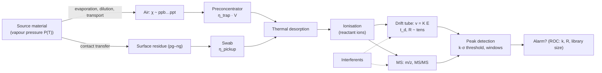

# 05.4 · Trace & vapour detection: vapour pressure, IMS, MS, colorimetry and canines

<div class="module-card">

**Prerequisites** [05.1 Detection theory](lessons/stage-05/lesson-01.md) · [01.2 Gases & thermodynamics](lessons/stage-01/lesson-02.md) (ideal gas, phase equilibrium) · [02.1 Chemical energy](lessons/stage-02/lesson-01.md) (enthalpy) · basic signal processing.

**Estimated time** 6 h (3 h theory · 0.5 h simulator · 2.5 h programming) · **Level** Intermediate

**Next** [05.5 Imaging & remote sensing](lessons/stage-05/lesson-05.md), then [05.6 Sensor fusion](lessons/stage-05/lesson-06.md).

<p class="tags"><span>physical chemistry</span><span>spectrometry</span><span>signal processing</span><span>canines</span><span>metrology</span><span>Sim C</span><span>P02</span></p>
</div>

## Why this matters

Bulk methods (05.2, 05.3) find *objects*; trace methods find *molecules*. They answer a different
question — has this surface, bag, vehicle or air volume been in contact with an energetic
material? — and they are used everywhere from airport checkpoints (swab-and-analyse ion-mobility
spectrometers) to robots carrying vapour sensors (JIEDDO procured PackBot variants with an
explosive-vapour sensor, per the US Army's 2018 account) to detection dogs. They are also where
false alarms from everyday chemicals are hardest to engineer away. The central physical fact is
unforgiving: many energetic materials have **extremely low vapour pressures**, so the air above them
carries parts-per-billion to parts-per-trillion (or less) of the compound, and the whole system —
sampling, preconcentration, ionisation, separation, detection, decision — is built around
collecting and recognising a few picograms against a chemically noisy background. This lesson treats
those steps quantitatively and connects them back to ROC trade-offs.

All compounds in calculations are fictional ("compound X", "interferent Y"); where real classes are
mentioned, only literature *ranges* are cited.

## Learning objectives

1. Use the Clausius–Clapeyron relation to predict how vapour pressure scales with temperature, and
   convert vapour pressure to mixing ratio, number density and mass per sampled volume.
2. Explain particle vs vapour sampling and compute collected mass through a sampling/preconcentration
   chain with efficiencies.
3. Explain ion-mobility spectrometry: ionisation, drift velocity $v=KE$, reduced mobility $K_0$,
   drift time, and diffusion-limited resolution; decide whether two species are resolved.
4. Explain mass spectrometry at the level of $m/z$, resolving power and tandem selectivity, and why
   it reduces false alarms relative to IMS.
5. Describe colorimetric tests and canine detection (Furton & Myers, 2001): principle, strengths,
   failure modes.
6. Define limit of detection and relate peak-detection thresholds, the number of search windows,
   and interferents to $P_d$ and $P_{fa}$; implement and evaluate a peak detector on simulated
   spectra.

## Theory

### 1. Vapour pressure and the Clausius–Clapeyron relation

At equilibrium, a condensed phase maintains a vapour pressure $P_{vap}(T)$ above it. Integrating the
Clapeyron equation with an ideal vapour and a temperature-independent enthalpy of sublimation (or
vaporisation) gives

<div class="callout eq">

$$ \ln\frac{P_2}{P_1} = -\frac{\Delta H_{sub}}{R}\left(\frac{1}{T_2}-\frac{1}{T_1}\right), \qquad \chi = \frac{P_{vap}}{P_{atm}}, \qquad n = \frac{P_{vap}}{k_BT}. $$

</div>

| Symbol | Meaning | SI unit |
|---|---|---|
| $P_{vap}$ | saturation vapour pressure | Pa |
| $\Delta H_{sub}$ | molar enthalpy of sublimation | J mol⁻¹ |
| $R$ | gas constant, 8.314 | J mol⁻¹ K⁻¹ |
| $T$ | absolute temperature | K |
| $\chi$ | mixing ratio (volume fraction; ×10⁹ = ppb) | — |
| $n$ | number density of analyte molecules | m⁻³ |
| $k_B$ | Boltzmann constant, $1.381\times10^{-23}$ | J K⁻¹ |

**Intuition.** Escaping the solid costs $\Delta H_{sub}$ per mole; the fraction of molecules with
enough energy follows a Boltzmann factor, so vapour pressure is exponentially sensitive to
temperature. Large, polar molecules with strong intermolecular forces (large $\Delta H_{sub}$) have
tiny vapour pressures *and* steep temperature dependence.

**Literature ranges, stated generally.** Reviews of vapour-based detection (Furton & Myers, 2001;
National Research Council, 2004) report room-temperature equilibrium vapour concentrations for
common military explosives spanning roughly parts-per-billion for the more volatile ones down to
parts-per-trillion and below for the least volatile — many orders of magnitude below common
solvents (which sit at parts-per-hundred to parts-per-thousand). And equilibrium is an *upper
bound*: in open air, dilution and slow evaporation keep real concentrations far below it.

**Numerical example (fictional compound X).** $\Delta H_{sub}=120$ kJ/mol. From 20 °C to 30 °C:
$P_2/P_1 = \exp\!\big(\tfrac{120\,000}{8.314}(\tfrac{1}{293.15}-\tfrac{1}{303.15})\big) = e^{1.624} = 5.07$.
To 40 °C: 23×; to 0 °C: ×0.027. A sun-warmed surface can offer an order of magnitude more vapour than
the same surface on a cold morning — a real environmental variable in dog and instrument performance.

**From mixing ratio to molecules.** Air at 20 °C, 1 atm has $n_{air}=P/k_BT=2.50\times10^{25}$ m⁻³.
At 1 ppt ($\chi=10^{-12}$), one litre contains $2.50\times10^{10}$ analyte molecules; for a fictional
molar mass of 250 g/mol that is $2.5\times10^{10}/6.022\times10^{23}\times250 = 1.04\times10^{-11}$ g
$\approx 10$ pg. And a vapour pressure of $10^{-4}$ Pa corresponds to $10^{-4}/101\,325 \approx 1$ ppb.

```python
import numpy as np
R, KB, NA = 8.314, 1.380649e-23, 6.02214e23

def vp_ratio(dH, T1, T2):
    """Clausius–Clapeyron ratio P(T2)/P(T1)."""
    return np.exp(-dH / R * (1 / T2 - 1 / T1))

def mass_per_litre(chi, M_g_mol, T=293.15, P=101_325.0):
    n_air = P / (KB * T)                 # m^-3
    return chi * n_air * 1e-3 / NA * M_g_mol   # grams per litre

print(vp_ratio(120e3, 293.15, 303.15))           # 5.07
print(mass_per_litre(1e-12, 250) * 1e12, "pg/L") # 10.4
```

<details class="answer"><summary>Exercise 1 — then reveal</summary>

Two fictional compounds have the same vapour pressure at 25 °C but $\Delta H_{sub}$ of 80 and
150 kJ/mol. Which has more vapour at 45 °C, by what factor, and what does that imply for testing a
detector only at laboratory temperature?

*Answer.* Ratios: $\exp(80\,000/8.314\cdot(1/298.15-1/318.15)) = e^{2.029}=7.6$; with 150 kJ/mol,
$e^{3.804}=44.9$. The high-$\Delta H$ compound has ≈ 5.9× more vapour at 45 °C. Performance
measured at one temperature does not transfer: the $d'$ of a vapour detector is temperature-dependent,
and differently for different target compounds — a stratification variable for trials (05.1 §7).

</details>

### 2. Sampling: particles and vapour

Because vapour is scarce, most checkpoint trace detection samples **particles**: a swab (textured
cloth or coated trap) is wiped over a surface, then thermally desorbed into the analyser. Vapour
sampling draws air through a **preconcentrator** (a sorbent or cold trap) and then desorbs it in a
short pulse. Either way, the mass delivered to the analyser is a product of efficiencies:

$$ m_{\text{analyser}} = m_{\text{available}}\;\eta_{\text{pickup}}\;\eta_{\text{transfer}}\;\eta_{\text{desorb}}, \qquad m_{\text{vapour}} = \chi\,\frac{P M}{R T}\,V_{\text{sampled}}\;\eta_{\text{trap}} . $$

**Numerical example.** Sampling 10 L of air at 1 ppt of the fictional compound (10.4 pg/L) with a
50 % trapping efficiency delivers 52 pg — within reach of a good IMS; at 0.01 ppt it is 0.5 pg,
which is not. Each efficiency is itself variable (surface type, wipe pressure, humidity), which adds
variance to the score distribution under $H_1$ and lowers $d'$. NIST's IMS programme develops
inkjet-printed trace standards precisely so that swab-to-alarm performance can be measured with known
deposited masses (NIST, ongoing).

### 3. Ion-mobility spectrometry (IMS)

**Ionisation.** Desorbed vapour enters a reaction region where a source (radioactive, e.g. ⁶³Ni,
or corona discharge) creates **reactant ions** from air constituents. Analyte molecules gain or
lose charge by reacting with them; many nitro-containing compounds are detected in negative-ion
mode. The reactant-ion peak (RIP) is always present and its depletion is itself informative.

**Drift.** A gate injects an ion packet into a drift tube with uniform field $E$ and a counter-flow
of clean drift gas at atmospheric pressure. Ions reach a terminal velocity proportional to the
field:

<div class="callout eq">

$$ v_d = K E,\qquad t_d = \frac{L}{KE},\qquad K_0 = K\,\frac{273.15}{T}\,\frac{P}{101.325\ \text{kPa}},\qquad R_{diff} = \frac{t_d}{\Delta t_{1/2}} \approx \sqrt{\frac{qV}{16\,k_BT\ln2}} . $$

</div>

| Symbol | Meaning | SI unit (common) |
|---|---|---|
| $v_d$ | drift velocity | m s⁻¹ |
| $K$ | ion mobility at operating conditions | m² V⁻¹ s⁻¹ (cm² V⁻¹ s⁻¹) |
| $K_0$ | reduced mobility (normalised to 273.15 K, 101.325 kPa) | m² V⁻¹ s⁻¹ |
| $E$ | drift field | V m⁻¹ |
| $L$ | drift length | m |
| $t_d$ | drift time | s (ms) |
| $V=EL$ | drift voltage | V |
| $\Delta t_{1/2}$ | peak full width at half maximum | s |
| $R$ | resolving power | — |

**Intuition.** At atmospheric pressure an ion collides with gas molecules ~10⁹–10¹⁰ times per second,
so it moves at a steady velocity like a sphere sinking in syrup; $K$ encodes the ion's
**collision cross-section** per charge. Different compounds with similar size and charge have similar
$K$ — this is the root of IMS's limited selectivity. $K_0$ removes the trivial dependence on gas
density so libraries can be shared between instruments. Diffusion broadens the packet as
$\sqrt{t}$ while the drift time grows as $t$, so resolving power grows as $\sqrt V$ and is independent
of $L$ at fixed voltage; in practice the gate width and field inhomogeneities limit $R$ to tens.

**Numerical example.** $K_0=1.50$ cm²/(V s), drift tube at 110 °C (383.15 K), 101.3 kPa, $E=250$ V/cm,
$L=7.0$ cm: $K = 1.50\times383.15/273.15 = 2.104$ cm²/(V s); $v_d = 526$ cm/s; $t_d=13.3$ ms. Drift
voltage 1750 V, $k_BT/q = 0.0330$ V: $R_{diff}=\sqrt{1750/(16\cdot0.0330\cdot0.693)} = 69$. A
fictional interferent Y with $K_0=1.45$ has $t_d = 13.77$ ms — separated by 0.46 ms. At $R=40$ the
FWHM is ≈ 0.33 ms (resolved); at $R=20$ it is ≈ 0.67 ms (unresolved — Y will be read as X).

```python
KB, QE = 1.380649e-23, 1.602177e-19

def drift_time(K0, L=0.07, E=25_000.0, T=383.15, P=101_325.0):
    """K0 in m^2/(V s) (1 cm^2/Vs = 1e-4 m^2/Vs); L [m]; E [V/m]; returns t_d [s]."""
    K = K0 * (T / 273.15) * (101_325.0 / P)
    return L / (K * E)

def diffusion_resolution(V, T=383.15):
    return np.sqrt(QE * V / (16 * KB * T * np.log(2)))

print(drift_time(1.50e-4) * 1e3, drift_time(1.45e-4) * 1e3, diffusion_resolution(1750))
# 13.31 ms, 13.77 ms, 69.1
```

<details class="answer"><summary>Exercise 2 — then reveal</summary>

An instrument is moved from sea level (101.3 kPa) to a site at 75 kPa with the same drift-tube
temperature and field. (a) What happens to drift times? (b) If the alarm windows are defined in
drift time rather than $K_0$, what failure results?

*Answer.* (a) $K\propto1/P$, so $K$ rises by $101.3/75 = 1.35$ and drift times fall by the same
factor: 13.31 ms → 9.85 ms. (b) Every peak moves out of its window — misses for real targets and
possible false alarms when other species land in the window. That is why instruments convert to
$K_0$ using measured $T$ and $P$ and track a calibrant peak.

</details>

### 4. Mass spectrometry (basics)

A mass spectrometer ionises molecules and separates ions by **mass-to-charge ratio** $m/z$ (in
vacuum, using electric/magnetic fields, time of flight, or ion traps). Its selectivity is
characterised by the **resolving power** $m/\Delta m$. Two ions at $m/z$ 227.0 and 227.1 need
$m/\Delta m \approx 2270$; a unit-resolution instrument at $m/z$ 227 with $\Delta m=0.5$ has
$m/\Delta m=454$ and cannot separate them. **Tandem MS (MS/MS)** selects a precursor ion, fragments it,
and checks for expected fragment ions — two independent identity checks, which multiplies likelihood
ratios and drives false alarms down. The NRC's 2004 study for TSA makes the case that MS offers
this selectivity advantage over IMS at checkpoints, at the cost of size, complexity and vacuum
systems. In IMS terms, MS adds an orthogonal dimension: an interferent must match in *both* mobility
and mass (and fragments) to cause an alarm.

**Numerical example (selectivity multiplies).** If a benign interferent class matches an IMS window
with probability $10^{-2}$ per sample and, independently, a mass window with probability $10^{-3}$,
the combined chance-match probability is $10^{-5}$ — *if* independence holds. Chemically similar
molecules violate independence (similar size ⇒ similar mass *and* mobility), so the real gain is
smaller: the correlated-errors theme of 05.6.

### 5. Colorimetric tests

A reagent reacts with a functional group of the target class to produce a coloured product. The
colour intensity follows Beer–Lambert absorbance $A=\varepsilon\,\ell\,c$; the minimum detectable
concentration is set by the smallest absorbance a reader (human or camera) can reliably see,
$c_{min}=A_{min}/(\varepsilon\ell)$. With a fictional $\varepsilon=10^4$ L mol⁻¹ cm⁻¹, spot thickness
$\ell=0.1$ cm and $A_{min}=0.02$: $c_{min}=2\times10^{-5}$ mol/L.

Strengths: cheap, fast, no power, field-deployable. Weaknesses: they detect a *chemical class*, not
a compound, so other members of the class give the same colour (false positives); subjective reading
under variable light; interference from coloured or reactive matrices; typically higher detection
limits than IMS. A smartphone camera with a colour-calibration card turns reading into a measurable
score — and immediately into an ROC problem.

### 6. Canines

Furton & Myers (2001) review the scientific basis of canine detection: dogs' olfactory systems detect
some odorants at extremely low concentrations, they sample actively (sniffing creates a sampling
flow), and they integrate search behaviour with detection — they are a *mobile, self-steering
sampler* rather than just a sensor. Key points from that review for an engineer:

- **What the dog detects may not be the parent compound.** For low-volatility materials, dogs can key
  on more volatile *odour-signature* compounds associated with the material (impurities, additives,
  degradation products). Training aids must therefore present the right odour, not merely the right
  label.
- **Reliability is a system property** of dog, handler and training regime: handler cues (the
  "Clever Hans" effect), fatigue, motivation, and generalisation across formulations all move the
  operating point. Blind, double-blind testing is essential — the same lesson as CWA 14747 blind
  trials.
- **Environmental dependence**: temperature (vapour pressure, §1), wind, humidity and odour
  transport determine where the vapour actually is, which may not be where the source is.

In ROC terms, a dog is an uncalibrated detector with a variable threshold: its output is a binary
behaviour, and its $P_d$/$P_{fa}$ must be estimated from blind trials with confidence intervals
exactly as in 05.1.

### 7. Interferents, detection limits and ROC trade-offs

**Limit of detection.** For a calibration line of slope $S$ (signal per unit mass) and blank standard
deviation $\sigma_b$,

<div class="callout eq">

$$ \mathrm{LOD} = \frac{3\,\sigma_b}{S}, \qquad \mathrm{LOQ} = \frac{10\,\sigma_b}{S}, \qquad P(\ge1\ \text{false peak}) = 1-\big(1-Q(k)\big)^{N}. $$

</div>

| Symbol | Meaning | Unit |
|---|---|---|
| $\sigma_b$ | standard deviation of blank measurements | signal units |
| $S$ | calibration sensitivity | signal units per pg |
| LOD / LOQ | limit of detection / quantification | pg |
| $k$ | detection threshold in noise standard deviations | — |
| $N$ | number of independent resolution elements (windows) searched | — |

**Intuition.** "3σ" is a convention, not a law: it fixes a per-window $P_{fa}$ of ≈ 0.13 % under
Gaussian noise, and says nothing about $P_d$ at the LOD (which is only ≈ 50 % at a signal exactly equal
to the threshold). And if you search many windows — many drift-time channels, many library compounds —
the chance of *some* false peak grows with $N$ (the "look-elsewhere" effect).

**Numerical examples.** $\sigma_b=0.01$, $S=0.004$ per pg: LOD $=7.5$ pg, LOQ $=25$ pg. With $N=200$
independent windows: $k=3$ gives $P(\ge1\text{ FA})=1-(1-0.00135)^{200}=0.24$; $k=4$: 0.0063;
$k=5$: $5.7\times10^{-5}$. Raising $k$ from 3 to 5 buys a 4000× lower chance false-peak rate — at
the cost of $P_d$ for weak signals.

**Interferents** are the dominant field false-alarm source and are *not* reduced by raising $k$: a
real peak from a benign compound whose mobility falls inside the target's window is a strong signal.
Commonly cited sources in the trace-detection literature include personal-care products, some
fertilisers and industrial chemicals. Remedies are **selectivity** (higher resolving power, dopants
that shift ion chemistry, a second dimension such as MS or a second IMS polarity) and **fusion**
with other evidence — never threshold alone.

```python
from scipy.stats import norm
for k in (3, 4, 5):
    q = norm.sf(k)
    print(k, q, 1 - (1 - q) ** 200)        # 0.24, 0.0063, 5.7e-5
```

<details class="answer"><summary>Exercise 3 — then reveal</summary>

A library contains 12 target compounds, each checked in a window 3 channels wide, in both polarities.
Channels are independent, noise is Gaussian, and the threshold is $k=4$. Estimate the per-sample
probability of a noise-only alarm. What threshold keeps it below $10^{-4}$?

*Answer.* $N = 12\times3\times2=72$; $1-(1-3.17\times10^{-5})^{72}=2.3\times10^{-3}$. Need
$Q(k)\le 10^{-4}/72=1.39\times10^{-6}$ ⇒ $k\ge4.69$.

</details>

### 8. Simulating an IMS spectrum and detecting peaks

The code below builds fictional IMS spectra — a reactant-ion peak, optional target X and interferent Y,
Gaussian peaks of FWHM $t_d/R$, white noise — and applies a threshold-plus-local-maximum peak detector
with a robust (median absolute deviation) noise estimate. An alarm is declared if any detected peak
lies within ± half a FWHM of X's expected drift time.

```python
def ims_spectrum(t, analytes, R=40.0, noise=0.01, rng=None):
    """analytes = [(K0 [m^2/Vs], amplitude)]; Gaussian peaks with FWHM = t_d / R."""
    rng = np.random.default_rng(rng)
    y = np.zeros_like(t)
    for K0, amp in analytes:
        td = drift_time(K0); sigma = td / R / 2.3548
        y += amp * np.exp(-0.5 * ((t - td) / sigma) ** 2)
    return y + noise * rng.standard_normal(t.size)

def detect_peaks(t, y, k=5.0):
    """Local maxima above median + k * robust sigma (MAD)."""
    s = 1.4826 * np.median(np.abs(y - np.median(y)))
    thr = np.median(y) + k * s
    m = (y[1:-1] > y[:-2]) & (y[1:-1] >= y[2:]) & (y[1:-1] > thr)
    return t[1:-1][m]

def alarm(peaks, td_target, window):
    return bool(np.any(np.abs(peaks - td_target) < window))

t = np.linspace(5e-3, 25e-3, 2000)
K_RIP, K_X, K_Y = 2.10e-4, 1.50e-4, 1.45e-4          # fictional reactant ions, X, interferent Y
td_X = drift_time(K_X)
rng = np.random.default_rng(0)

def rate(analytes, R=40.0, k=5.0, n=2000):
    win = 0.5 * td_X / R
    return np.mean([alarm(detect_peaks(t, ims_spectrum(t, analytes, R=R, rng=rng), k), td_X, win)
                    for _ in range(n)])

print(rate([(K_RIP, 1), (K_X, 0.04)], k=5), rate([(K_RIP, 1), (K_X, 0.04)], k=4))  # Pd ~0.64, ~0.995
print(rate([(K_RIP, 1)], k=4))                                                     # Pfa ~5e-4
print(rate([(K_RIP, 1), (K_Y, 0.3)], R=40), rate([(K_RIP, 1), (K_Y, 0.3)], R=20))   # ~0.03, 1.0
```

**What the simulation shows** (2000 trials each, seed 0): with a weak target (amplitude 4× noise
σ), $k=5$ gives $P_d\approx0.64$ and $k=4$ gives $P_d\approx0.995$ at a noise-only $P_{fa}$ of about
$5\times10^{-4}$. But an interferent Y at 0.3 amplitude causes alarms in ≈ 3 % of samples at $R=40$
(noise maxima on Y's shoulder inside X's window) and in **100 %** at $R=20$, whatever $k$ is — the
resolution, not the threshold, is the lever against interferents.

<details class="answer"><summary>Exercise 4 — then reveal</summary>

Why is the Monte-Carlo estimate "$P_{fa}\approx5\times10^{-4}$ from 2000 trials" weak evidence, and
how many noise-only trials would you need to bound $P_{fa}\le10^{-4}$ at 95 % confidence if you saw
none?

*Answer.* It is 1 event in 2000; the 95 % Clopper–Pearson interval is roughly
$[1.3\times10^{-5}, 2.8\times10^{-3}]$. To bound $P_{fa}\le10^{-4}$ with zero events requires
$n\ge\ln0.05/\ln(1-10^{-4}) \approx 29\,956$ trials (rule of three). For rare events use
importance sampling or the analytic tail.

</details>

## Sensor summary

| | Particle swab + IMS | Vapour sampling + IMS/MS | Mass spectrometry | Colorimetric | Canine |
|---|---|---|---|---|---|
| **Physical principle** | Thermal desorption, gas-phase ionisation, mobility separation at atmospheric pressure | Preconcentration of air, then as left | Ionisation, separation by $m/z$ in vacuum, optional MS/MS | Class-specific chemical reaction → absorbance | Biological olfaction with active sniffing and search |
| **What it detects** | Residues on surfaces (pg–ng) | Vapour/odour in air | Molecular ions and fragments | Functional-group class | Odour signatures (possibly not the parent compound) |
| **Strengths** | Fast (seconds), sensitive, mature, portable | Non-contact; can be robot-mounted | High selectivity, low false alarm | Cheap, no power, simple | Mobile self-steering sampler; finds sources by gradient |
| **Limitations** | Limited resolving power ($R$ ~ tens); needs contact | Very low vapour pressures; dilution; transport | Size, cost, vacuum, maintenance | Class-level only; subjective; higher LOD | Handler cueing, fatigue, training-aid fidelity, availability |
| **False positives** | Interferents in the mobility window; carry-over | Same, plus ambient background | Isobaric/co-eluting species (fewer) | Other class members; coloured matrices | Cueing; odours resembling training aids |
| **False negatives** | Poor pickup; clean surfaces; peak shifts from T/P; saturation | Vapour below LOD; cold; wind | Ion suppression; wrong library | Low concentration, poor lighting | Unfamiliar formulation; fatigue; odour not reaching dog |
| **Environmental limits** | Humidity (ion chemistry), temperature, pressure | Temperature (Clausius–Clapeyron), wind, air exchange | Power and vibration | Light, temperature for reaction rates | Heat, wind, humidity, work–rest cycles |
| **Realistic examples** | Checkpoint trace screening; NIST inkjet trace standards | Robot vapour sensor on PackBot variants (US Army, 2018) | NRC (2004) TSA study | Field spot tests (class level) | Furton & Myers (2001) review |

## Visual explanation



## Worked example — specifying a fictional vapour-sampling payload for a robot

A robot (Stage 6) will carry a vapour sampler and IMS. Requirements (fictional): detect compound X
at an equilibrium-limited concentration of 0.5 ppt in the sampled air with $P_d\ge0.9$, and at most
one noise-only false alarm per 1000 samples, with a library of 10 compounds × 3 channels × 1 polarity.

1. **Mass per sample.** 0.5 ppt at M = 250 g/mol → 5.2 pg/L. With 60 % trapping over $V$ litres:
   $m = 3.1V$ pg.
2. **Threshold.** $N=30$ windows; need $1-(1-Q(k))^{30}\le10^{-3}$ ⇒ $Q(k)\le3.3\times10^{-5}$ ⇒
   $k\ge3.99$. Use $k=4$.
3. **Signal needed.** For $P_d=0.9$ with Gaussian noise, the mean peak must exceed the threshold by
   $1.28\sigma$: signal $\ge (4+1.28)\sigma_b = 5.28\sigma_b$. With $S=0.004$/pg and $\sigma_b=0.01$:
   $\ge 13.2$ pg.
4. **Sample volume.** $3.1V\ge13.2$ ⇒ $V\ge4.2$ L. At 2 L/min that is ≈ 2.1 min per sample — a
   dwell time the robot's mission planner must budget (06.8). If the air and source are 10 °C colder
   and the concentration is equilibrium-limited, Clausius–Clapeyron with the fictional
   $\Delta H_{sub}=120$ kJ/mol from §1 gives ×0.18 the vapour, so the dwell time grows ≈ 5.7× to
   about 12 min.
5. **Interferents.** None of the above protects against a benign compound in X's window; the
   specification must add a resolving-power requirement (e.g. $R\ge40$ at X's drift time) or an
   orthogonal confirmation.

## Simulation work

<div class="callout sim">

**Sim C (sensor fusion), trace channel.** (1) Query the trace/vapour channel over the grid and note
its cost (time) and its detection pattern: does it respond at the object location or downwind of it?
(2) Toggle wind or temperature (if available) and record how the channel's hit rate changes. (3)
Identify at least one cell where the trace channel alarms but no other channel does — decide whether
it is an interferent or contamination, and what additional evidence would resolve it. Keep your notes
for 05.6.

</div>

## Practical exercises

<details class="answer"><summary>Exercise A — temperature and dogs</summary>

A detection-dog team is tested on a fictional aid (ΔH_sub = 120 kJ/mol) at 5 °C in the morning and
25 °C in the afternoon. By what factor does the equilibrium vapour differ? Give two reasons why the
observed $P_d$ difference might be smaller or larger than this factor suggests.

*Answer.* $\exp(120\,000/8.314\,(1/278.15-1/298.15)) = e^{3.481} = 32.5$. Smaller: dogs may saturate
(already above their threshold), or detect a more volatile odour-signature compound with lower
$\Delta H$. Larger: afternoon heat reduces dog performance through fatigue, and convection disperses
the plume.

</details>

<details class="answer"><summary>Exercise B — mobility calibration</summary>

A calibrant with known $K_0=1.80$ cm²/(V s) appears at 11.52 ms. An unknown peak appears at 13.82 ms
in the same spectrum. Estimate the unknown's $K_0$ without knowing $T$, $P$, $E$ or $L$.

*Answer.* $t_d\propto1/K_0$ at fixed conditions: $K_0 = 1.80\times11.52/13.82 = 1.50$ cm²/(V s).
Single-point calibration cancels all instrument constants — the standard IMS practice.

</details>

<details class="answer"><summary>Exercise C — choosing k with base rates</summary>

At a checkpoint the prevalence of true positives is $10^{-5}$ per sample. With $P_d=0.95$ at your
chosen $k$, what $P_{fa}$ is needed for 10 % of alarms to be real? Is that achievable by thresholding
alone if interferent-driven alarms occur in 0.3 % of samples?

*Answer.* PPV $=0.1$: $P_{fa}=P_d\pi(1-0.1)/(0.1(1-\pi))\approx 0.95\times10^{-5}\times9 = 8.6\times10^{-5}$.
Interferents alone give $3\times10^{-3}$, 35× too high, and thresholding does not remove them —
selectivity or a secondary screen is required.

</details>

## Programming exercise — IMS simulator with peak detection and false-alarm analysis

**Goal.** Build a fictional IMS simulator and a detector, then characterise it statistically.

- **Input:** drift-tube parameters ($L$, $E$, $T$, $P$), resolving power, a library of fictional
  compounds with $K_0$, a scenario generator (target amount, interferents with random amounts,
  reactant-ion depletion, baseline drift), noise model.
- **Output:** spectra; detected peaks with estimated $K_0$ (calibrated on an internal standard);
  alarms per library compound; ROC curves ($P_d$ vs $P_{fa}$) as functions of $k$, $R$ and window
  width; Clopper–Pearson intervals on each estimate.
- **Constraints:** NumPy/SciPy only; vectorise over trials where possible; the detector must not
  know the true $T$, $P$ — it must calibrate from the internal standard.
- **Expected behaviour:** ROC improves with target amount and $R$; interferent-driven false alarms
  are insensitive to $k$ and sensitive to $R$; noise-only $P_{fa}$ matches
  $1-(1-Q(k))^N$ within its confidence interval.
- **Test cases:** (i) `drift_time(1.50e-4)` ≈ 13.31 ms at the default conditions; (ii) a noiseless
  single peak is found within one sample of $t_d$; (iii) with $R=20$ and Y at 0.3 amplitude,
  interferent alarm rate > 0.9; (iv) with RIP only and $k=5$, zero alarms in 2000 trials.
- **Extensions:** replace the fixed threshold by a matched filter (Gaussian kernel) and compare ROC;
  add a second dimension (fictional $m/z$) and measure the false-alarm reduction when interferent
  properties are correlated vs independent; train a small classifier on whole spectra and compare
  with the peak-window detector at fixed $P_{fa}$.

Link: [Project P02](projects/p02-sensor-noise/README.md) — the `TraceSensor` class wraps this
simulator.

## Reading

- Furton, K. G. & Myers, L. J., "The scientific foundation and efficacy of the use of canines as
  chemical detectors for explosives", *Talanta* 54(3):487–500 (2001),
  https://www.sciencedirect.com/science/article/abs/pii/S0039914000005464 — the vapour-pressure and
  odour-signature sections and the comparison with instruments.
- National Research Council, *Opportunities to Improve Airport Passenger Screening with Mass
  Spectrometry* (2004), https://www.nationalacademies.org/read/10996/chapter/1 — IMS selectivity,
  sampling limits and false alarms; the system-requirements argument for MS.
- National Research Council, *Existing and Potential Standoff Explosives Detection Techniques*
  (2004), https://www.nationalacademies.org/read/10998/chapter/1 — the chapters on vapour pressure
  limits and trace/vapour detection at stand-off.
- NIST, Ion Mobility Spectrometry programme, https://www.nist.gov/programs-projects/ion-mobility-spectrometry
  — how trace detectors are calibrated and tested with printed reference materials.
- Yinon, J. (ed.), *Counterterrorist Detection Techniques of Explosives*, Elsevier (2007),
  https://www.sciencedirect.com/book/9780444522047/counterterrorist-detection-techniques-of-explosives —
  IMS and MS chapters for depth.
- US Army ASC, "How many robots does it take?" (2018),
  https://asc.army.mil/web/news-alt-jfm18-how-many-robots-does-it-take/ — context for robot-mounted
  vapour sensing and fleet lessons.

Full bibliographic entries: [curriculum/sources.md](curriculum/sources.md).

## Assessment

1. *(Conceptual)* Why does raising the peak-detection threshold reduce noise-driven false alarms but
   barely change interferent-driven ones? What does change them?
2. *(Mathematical)* Derive the Clausius–Clapeyron relation from $dP/dT = \Delta H/(T\Delta V)$ with
   stated assumptions, and state when it fails.
3. *(Computation)* An IMS at 100 °C and 90 kPa has $L=6$ cm, $E=300$ V/cm. Compute the drift time of
   an ion with $K_0=1.60$ cm²/(V s) and the diffusion-limited resolving power.
4. *(Interpretation)* A trace detector's alarm rate at one checkpoint doubles on hot summer days and
   the alarms cluster on one compound's channel. List three hypotheses and the data you would collect
   to discriminate among them.
5. *(Design)* Propose a two-stage screening architecture (fast, cheap stage then selective stage) and
   compute the end-to-end $P_d$, $P_{fa}$ and mean time per sample from stage-wise values you assume.

<details class="answer"><summary>Answers to 3 and 4</summary>

3. $K = 1.60\times(373.15/273.15)\times(101.325/90) = 2.461$ cm²/(V s); $v_d = 738$ cm/s;
   $t_d = 6/738 = 8.13$ ms. $V=1800$ V, $k_BT/q = 0.03216$ V:
   $R=\sqrt{1800/(16\cdot0.03216\cdot0.693)}=71$.
4. (a) Temperature raises vapour/desorption of a benign interferent common in summer (e.g. a
   personal-care product) — check alarm rate vs temperature and confirmatory results; (b) drift-tube
   temperature control failing, shifting peaks into the window — check the calibrant peak position
   vs time; (c) genuine increase in contamination from a specific traffic stream — check alarm
   clustering by lane/time and secondary-screen outcomes.

</details>

## Expert extension

- **Field-asymmetric IMS (FAIMS/DMS).** Separation by the field dependence of mobility $K(E/N)$
  gives an orthogonal dimension to drift-tube IMS; model an ion's alpha function and compute how
  compensation-voltage resolution combines with drift-time resolution.
- **Plume physics.** Model vapour transport from a source as advection–diffusion with a turbulent
  eddy diffusivity; compute the concentration field downwind and design a gradient-following search
  (the dog's strategy) as an information-gathering controller (09.5).
- **Bayesian library matching.** Replace window alarms with a likelihood over $K_0$ (with calibration
  uncertainty) and prior prevalence per compound; report posterior probabilities and calibrate them.

## What comes next

[05.5](lessons/stage-05/lesson-05.md) turns to imaging at a distance — millimetre-wave, thermal IR,
acoustic/seismic and hyperspectral — and [05.6](lessons/stage-05/lesson-06.md) combines trace
evidence with bulk sensors, where the correlation between their errors decides whether fusion helps.
