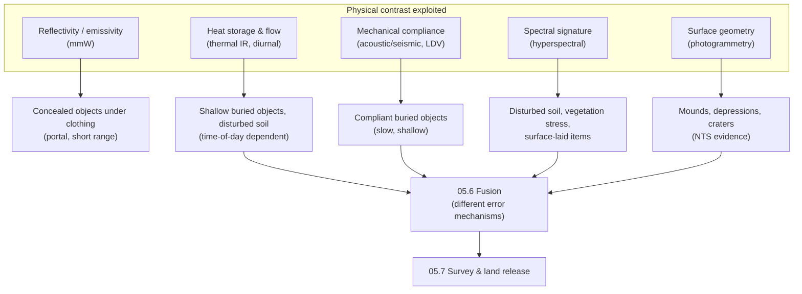

# 05.5 · Imaging & remote sensing

<div class="module-card">

**Prerequisites** [05.1 Detection theory](lessons/stage-05/lesson-01.md) (ROC, base rates) · [01.2 Gases & thermodynamics](lessons/stage-01/lesson-02.md) (heat-transfer modes) · [01.6 Structural response](lessons/stage-01/lesson-06.md) (SDOF oscillators, resonance) · [01.7 Electricity & EM](lessons/stage-01/lesson-07.md) (EM waves, antennas) · Fourier series, the heat equation.

**Estimated time** 7 h (3.5 h theory · 1 h simulator · 2.5 h programming) · **Level** Intermediate → Advanced

**Next** [05.6 Sensor fusion](lessons/stage-05/lesson-06.md), then [05.7 Search theory & area clearance](lessons/stage-05/lesson-07.md).

<p class="tags"><span>EM radiation</span><span>heat equation</span><span>resonance</span><span>remote sensing</span><span>UAV survey</span><span>Sim C</span><span>P02</span></p>
</div>

## Why this matters

Metal detectors and GPR (05.2) must be almost on top of an object, one square metre at a time.
The sensors in this lesson work at a **stand-off distance**: from a portal, a mast, a vehicle or a
drone. Each exploits a different physical contrast between an object and what surrounds it:

- **millimetre-wave** imaging sees differences in reflectivity and emissivity through clothing;
- **thermal infrared** sees the fact that a buried object changes how the ground stores and
  releases the Sun's heat;
- **acoustic/seismic** methods excite the ground mechanically and look for a compliant object
  that resonates;
- **hyperspectral** and **photogrammetric** imaging see disturbed soil, stressed vegetation and
  small changes in surface shape.

None of them is a stand-alone "mine detector". The RAND survey (MacDonald et al., 2003) is blunt
about this: each technology has a false-alarm mechanism of its own. That is exactly why these
sensors are useful. Their errors are *different* from the errors of EMI and GPR, and that is
what makes them worth fusing (05.6). At area scale, remote sensing is now a routine input to
**non-technical survey**, the step that decides which land needs technical attention at all
(05.7).

## Learning objectives

1. Explain the atmospheric windows in the millimetre-wave band. Compute the diffraction-limited
   resolution $\theta \approx 1.22\lambda/D$ of an aperture and turn it into a spot size at a
   given range.
2. Compare active and passive mmW imaging using brightness temperature and the radiometer
   equation, and predict when passive contrast disappears.
3. Use Planck's law, Wien's law and emissivity to compute thermal-IR radiance, sensitivity and
   the apparent-temperature errors that emissivity causes. Interpret NETD.
4. Model the **diurnal thermal contrast** of a buried inclusion with the 1D heat equation under
   periodic surface forcing, and identify the times of maximum contrast and the crossover times.
5. Model the mine–soil system as a driven resonator. Compute its resonance and the Doppler
   shift a laser vibrometer measures.
6. Apply the linear mixing model and the spectral angle to hyperspectral pixels. Size a drone
   survey (ground sample distance, photogrammetric height precision) against the target it must
   resolve.

## Theory

### 1. Millimetre-wave imaging

Millimetre waves span 30–300 GHz ($\lambda$ = 10–1 mm). Imaging systems work in the
**atmospheric windows**, which lie between molecular absorption lines. The main lines are water
vapour at 22 and 183 GHz and oxygen at 60 and 119 GHz. That leaves windows near **35, 94, 140
and 220 GHz**, which is why so many systems run at 94 GHz. Two material facts make the band
useful for security screening (NRC, 2007):

- **Clothing is nearly transparent.** Textile fibres and the gaps between them are much smaller
  than $\lambda$, so there is little scattering, and dry fabric has low loss.
- **Skin and metal are not.** Skin is a lossy dielectric because of its water content. It reflects
  some mmW energy and emits the rest. Metal is an almost perfect reflector and emits almost
  nothing.

**Resolution is set by diffraction.** A circular aperture of diameter $D$ cannot resolve two
points closer than the Rayleigh angle

$$ \theta \approx 1.22\,\frac{\lambda}{D}, \qquad \delta x \approx R\,\theta = 1.22\,\frac{\lambda R}{D}. $$

| Symbol | Meaning | SI unit |
|---|---|---|
| $\lambda = c/f$ | wavelength | m |
| $D$ | aperture (antenna or lens) diameter | m |
| $\theta$ | angular resolution (first zero of the Airy pattern) | rad |
| $R$ | range to the scene | m |
| $\delta x$ | cross-range spot size | m |

**Intuition.** An aperture measures only spatial frequencies up to about $D/\lambda$ cycles per
radian. Finer detail is simply not in the field it collects. Optical cameras resolve
micro-radians because $\lambda$ is about 0.5 µm. A mmW imager has a wavelength roughly 6,000
times longer, so it needs a large aperture *and* a short range.

**Numerical example.** $D = 0.5$ m at 94 GHz: $\lambda = 2.998\times10^8/94\times10^9 = 3.19$ mm.
Then $\theta = 1.22 \times 3.19\times10^{-3}/0.5 = 7.78$ mrad, giving a spot of **2.3 cm at 3 m**
and 7.8 cm at 10 m. At 35 GHz with the same aperture the spot is 6.3 cm at 3 m. At 220 GHz it is
1.0 cm, but atmospheric loss and component cost rise. This is why portal scanners are short-range
devices, and why stand-off mmW at tens of metres needs apertures of a metre or more.

```python
import numpy as np
C = 2.998e8

def diffraction_spot(f_hz: float, D_m: float, R_m: float) -> float:
    """Rayleigh-limited cross-range resolution [m] of a circular aperture."""
    lam = C / f_hz
    return 1.22 * lam / D_m * R_m

print(diffraction_spot(94e9, 0.5, 3.0))    # 0.0233 m
```

**Active and passive.** A *passive* imager is a radiometer. At mmW frequencies
$h\nu/k_BT = 0.015$ at 94 GHz and 300 K, so the Rayleigh–Jeans limit holds. Received power is
then linear in **brightness temperature**,
$T_B = \varepsilon T_{\text{phys}} + (1-\varepsilon)T_{\text{refl}}$, and the smallest
temperature difference the radiometer can detect is set by the **radiometer equation**:

$$ \Delta T_{\min} = \frac{T_{\text{sys}}}{\sqrt{B\,\tau}}. $$

| Symbol | Meaning | Unit |
|---|---|---|
| $T_B$ | brightness temperature | K |
| $\varepsilon$ | emissivity (1 − reflectivity, for an opaque surface) | — |
| $T_{\text{refl}}$ | brightness of whatever the surface reflects (sky, room) | K |
| $T_{\text{sys}}$ | system noise temperature (receiver plus scene) | K |
| $B$ | pre-detection bandwidth | Hz |
| $\tau$ | integration time per pixel | s |

With $T_{\text{sys}} = 1000$ K, $B = 10$ GHz and $\tau = 10$ ms:
$\Delta T_{\min} = 1000/\sqrt{10^{8}} = 0.1$ K.

Contrast depends on the **environment**. Outdoors, a metal object reflects the cold sky, whose
brightness at 94 GHz is of order 100 K. It therefore appears near $T_B \approx 100$ K, while
skin ($\varepsilon\approx0.9$, 307 K) sits near 286 K. That is a contrast of roughly 190 K.
Indoors, the metal reflects walls at 293 K and skin reads about 306 K. The contrast collapses to
roughly 10 K, and the result depends on the scene. This is the physical reason indoor systems are
**active**: they illuminate the subject, usually with a swept-frequency source and holographic or
synthetic-aperture reconstruction, and form an image from reflection. Active imaging gives high
contrast and range resolution. Its cost is specular "glints" and dark regions wherever a surface
reflects the illumination away from the receiver.

<div class="callout key">

**Strengths / limitations of mmW.** *Detects:* objects under clothing that differ in reflectivity
from skin: metals, and dielectrics with a different permittivity or thickness. *Strengths:*
non-ionising, penetrates clothing, images shape. *Limitations:* centimetre resolution, very short
penetration into water-bearing media (skin, wet soil), so it is **not a buried-object sensor**.
*False positives:* folds, seams, sweat, buttons, body-contour artefacts, specular glints.
*False negatives:* objects whose reflectivity is close to skin, items in body regions viewed at
grazing angle, wet or heavy clothing. *Environment:* rain and humidity attenuate, especially near
the absorption lines; outdoor passive contrast depends on sky brightness. Privacy concerns drove
the shift to automated threat recognition with generic avatars.

</div>

<details class="answer"><summary>Exercise 1 — then reveal</summary>

A stand-off passive imager must resolve 5 cm at 20 m. (a) What aperture is needed at 94 GHz?
(b) At 220 GHz? (c) Give one physical reason not simply to go to 220 GHz.

*Answer.* (a) $D = 1.22\lambda R/\delta x = 1.22\times3.19\times10^{-3}\times20/0.05 = 1.56$ m.
(b) $\lambda = 1.36$ mm, so $D = 0.66$ m. (c) Atmospheric (water-vapour) attenuation and
receiver noise temperature both rise with frequency, and clothing becomes less transparent. The
smaller aperture buys resolution at the cost of $\Delta T_{\min}$ and range.

</details>

### 2. Thermal infrared

**Planck's law** gives the spectral radiance of a black body:

$$ L_\lambda(T) = \frac{2hc^2}{\lambda^5}\,\frac{1}{\exp\!\big(hc/\lambda k_B T\big) - 1}, \qquad \lambda_{\max} T = b = 2898\ \mu\text{m·K (Wien)}, \qquad M = \sigma T^4 . $$

| Symbol | Meaning | SI unit |
|---|---|---|
| $L_\lambda$ | spectral radiance | W m⁻² sr⁻¹ m⁻¹ |
| $h$, $k_B$, $c$ | Planck, Boltzmann constants; speed of light | J s, J K⁻¹, m s⁻¹ |
| $T$ | absolute temperature | K |
| $b$ | Wien displacement constant | m K |
| $M$ | total exitance (Stefan–Boltzmann, $\sigma = 5.67\times10^{-8}$) | W m⁻² |
| $\varepsilon(\lambda)$ | emissivity; real surface radiance is $\varepsilon L_\lambda$ | — |

**Intuition.** At 300 K the peak is at $2898/300 = 9.66$ µm. That is why terrestrial thermal
imaging uses the **8–14 µm (LWIR) window**, which is also a window in atmospheric absorption. An
uncooled microbolometer measures the band radiance, and a scene temperature is *inferred* by
assuming an emissivity.

**Numerical example (checked).** Integrating Planck over 8–14 µm at 300 K gives
$L = 55.0$ W m⁻² sr⁻¹. That is 38 % of the total $\sigma T^4/\pi = 146.2$ W m⁻² sr⁻¹. The
sensitivity is $\partial L/\partial T = 0.84$ W m⁻² sr⁻¹ K⁻¹, or **1.5 % per kelvin**. A camera
with **NETD** (noise-equivalent temperature difference) of 50 mK resolves radiance changes of
about 0.08 %.

**Emissivity is a confounder.** Two surfaces at the *same* 300 K, one with $\varepsilon = 0.98$
and one with $\varepsilon = 0.95$, both reflecting a cold sky of band brightness about 260 K,
differ in apparent temperature by **about 1 K**. That is as large as many buried-object signals.
Disturbed soil, with a different particle size, moisture and surface roughness, can change
$\varepsilon$ as well as the heat flow. Some of the "thermal" signature of a recently disturbed
patch is actually an emissivity signature.

```python
H, KB = 6.626e-34, 1.381e-23

def planck(lam, T):
    """Spectral radiance [W m^-2 sr^-1 m^-1]."""
    return 2 * H * C**2 / lam**5 / np.expm1(H * C / (lam * KB * T))

lam = np.linspace(8e-6, 14e-6, 20001)
band = lambda T: np.trapezoid(planck(lam, T), lam)
print(band(300), band(300.5) - band(299.5))   # 55.0, 0.84
```

<details class="answer"><summary>Exercise 2 — then reveal</summary>

A camera has NETD = 40 mK. A patch of ground has true surface contrast of +0.3 K against its
surroundings, but its emissivity is 0.01 lower. With a reflected sky of band brightness 260 K and
a scene at 300 K, is the patch warmer or colder *in the image*?

*Answer.* A 0.03 emissivity difference produced about 1 K of apparent contrast above, so 0.01
gives about −0.33 K (lower emissivity means more cold sky reflected). The net apparent contrast
is about −0.03 K, below NETD, so the patch is **invisible**. The physical contrast is there, but
an emissivity difference cancels it. This is a false-negative mechanism no amount of camera
sensitivity fixes.

</details>

### 3. Diurnal thermal contrast of buried objects

The ground is a slab heated at the top by the Sun during the day and cooled at night. Heat flows
by conduction:

$$ \rho c\,\frac{\partial T}{\partial t} = \frac{\partial}{\partial z}\!\left(k\,\frac{\partial T}{\partial z}\right),\qquad
-k\,\frac{\partial T}{\partial z}\Big|_{z=0} = q_{\text{sun}}(t) + h\,\big(T_a(t) - T_s(t)\big). $$

| Symbol | Meaning | SI unit |
|---|---|---|
| $k$ | thermal conductivity | W m⁻¹ K⁻¹ |
| $\rho c$ | volumetric heat capacity | J m⁻³ K⁻¹ |
| $\alpha = k/\rho c$ | thermal diffusivity | m² s⁻¹ |
| $q_{\text{sun}}$ | absorbed solar flux | W m⁻² |
| $h$ | linearised convective + radiative exchange coefficient | W m⁻² K⁻¹ |
| $T_a$, $T_s$ | air and surface temperature | K (or °C) |
| $z$ | depth, positive downward | m |

**Analytic core.** For homogeneous soil with sinusoidal surface temperature of angular frequency
$\omega$, the solution is a damped, lagging wave:

$$ T(z,t) = \bar T + A_0\,e^{-z/d}\cos(\omega t - z/d), \qquad d = \sqrt{2\alpha/\omega}. $$

With $\alpha = 1.0/2.0\times10^{6} = 5\times10^{-7}$ m² s⁻¹ and $\omega = 2\pi/86400$ s⁻¹, the
**damping depth** is $d = 0.117$ m. At 5 cm the daily swing is reduced to 65 % and lags by 1.6 h.
At 10 cm it is 43 % and lags 3.3 h.

**Why an object shows up.** An inclusion with different $k$ and $\rho c$ changes how the layer
above it stores and conducts heat. A low-conductivity, low-capacity object near the surface
**insulates** the top few centimetres from the deep soil's thermal mass. That layer then warms
faster by day and cools faster by night. The surface above the object is warmer than the
background in the afternoon and colder at night, and there are two **crossover** times when the
contrast passes through zero. A high-diffusivity object, such as metal, reverses the sign.

**The 1D model (fictional inclusion, safe parameters).** Soil $k = 1.0$, $\rho c = 2.0\times10^6$.
A 6 cm inclusion whose top is at 3 cm has $k = 0.25$, $\rho c = 1.5\times10^6$. The forcing is
600 W m⁻² peak absorbed solar from 06 to 18 h, air at 20 ± 6 °C peaking at 15 h, and
$h = 15$ W m⁻² K⁻¹. A backward-Euler finite-volume solution, run for six days to reach periodic
steady state, gives:

| Local time (h) | 00 | 04 | 08 | 10 | 12 | 14 | 16 | 18 | 20 | 22 |
|---|---|---|---|---|---|---|---|---|---|---|
| $\Delta T_s$ (K), object − background | −2.69 | −2.54 | −0.40 | +2.42 | +4.32 | +4.53 | +3.01 | +0.19 | −1.84 | −2.45 |

**Maximum contrast +4.7 K at about 13:15**, a night-time plateau of about −2.7 K, and
**crossovers near 08:20 and 18:05**. The background surface itself runs from 19.4 to 50.4 °C,
peaking at 13:30. These numbers come from an idealised 1D model with no lateral heat flow, no
moisture, no evaporation and no vegetation. Real contrasts for buried objects are usually a
fraction of a kelvin to a few kelvin, and 3D lateral diffusion reduces them for small objects.
The *structure* is robust: two contrast extrema, two crossovers, and a sign set by the diffusivity
mismatch.

```python
DAY = 86400.0

def forcing(t, S0=600.0, Ta0=20.0, dTa=6.0):
    hr = (t / 3600.0) % 24
    solar = S0 * np.maximum(0.0, np.sin(np.pi * (hr - 6) / 12))   # sun up 06-18 h
    Ta = Ta0 + dTa * np.sin(2 * np.pi * (hr - 9) / 24)             # air peaks at 15 h
    return solar, Ta

def surface_temperature(k, C, dz=0.005, dt=60.0, days=6, h=15.0):
    """Backward-Euler finite volumes. k[i], C[i]=rho*c per node. Robin top, insulated bottom.
    Returns array of (hour, Ts) for the last simulated day."""
    n = len(k)
    kf = 2 * k[:-1] * k[1:] / (k[:-1] + k[1:])        # harmonic-mean face conductivity
    vol = np.full(n, dz); vol[[0, -1]] = dz / 2
    A = np.diag(C * vol / dt)
    for i in range(n - 1):
        g = kf[i] / dz
        A[i, i] += g; A[i+1, i+1] += g; A[i, i+1] -= g; A[i+1, i] -= g
    A[0, 0] += h
    Ainv = np.linalg.inv(A)                             # constant system matrix
    T, out = np.full(n, 20.0), []
    for s in range(1, int(days * DAY / dt) + 1):
        t = s * dt
        solar, Ta = forcing(t)
        b = C * vol / dt * T
        b[0] += solar + h * Ta
        T = Ainv @ b
        if t > (days - 1) * DAY:
            out.append((t % DAY / 3600.0, T[0]))
    return np.array(out)

z = np.arange(0, 0.6 + 0.0025, 0.005)
k0, C0 = np.full_like(z, 1.0), np.full_like(z, 2.0e6)
inc = (z >= 0.03) & (z <= 0.09)
k1, C1 = k0.copy(), C0.copy(); k1[inc], C1[inc] = 0.25, 1.5e6
bg, ob = surface_temperature(k0, C0), surface_temperature(k1, C1)
dT = ob[:, 1] - bg[:, 1]
print(dT.max(), ob[dT.argmax(), 0], dT.min())          # ≈ +4.67 K at ≈ 13.2 h, ≈ −2.69 K
```

<div class="callout key">

**Strengths / limitations of thermal IR.** *Detects:* shallow objects or disturbed soil through
changes in heat storage and flow, and surface-laid objects through emissivity and solar-absorption
contrast. *Strengths:* passive, fast, area coverage from a drone, cheap uncooled sensors.
*Limitations:* works only at certain times of day, only in favourable weather, and only for
shallow depth (a few multiples of the object size, within the ~10 cm damping depth). *False
positives:* stones, roots, moisture patches, shadows, animal burrows, emissivity variation.
*False negatives:* crossover times, deep or old burial (once the disturbed soil has re-settled,
the soil signature fades), overcast days, rain, dense vegetation. *Environment:* driven by solar
loading, wind (which raises $h$), and soil moisture (which raises $k$ and $\rho c$ and adds
evaporative cooling). The IEEE TGRS inverse-problem paper in Reading frames the task as ill-posed
for exactly these reasons.

</div>

<details class="answer"><summary>Exercise 3 — then reveal</summary>

(a) Using $d=\sqrt{2\alpha/\omega}$, what is the damping depth of the **annual** cycle for the
same soil? (b) Why does this make the annual cycle useless for detecting objects 5–10 cm deep?
(c) In the programming model, raise $h$ from 15 to 40 W m⁻² K⁻¹ (strong wind). Predict whether
peak contrast rises or falls, then run it.

*Answer.* (a) $d$ scales with $\sqrt{T_{\text{period}}}$: $0.117\sqrt{365} = 2.24$ m. (b) Over
10 cm the annual wave is attenuated by only $e^{-0.1/2.24} \approx 0.96$, so the object sits in
an almost uniform temperature field and there is no gradient to perturb. (c) The contrast
**falls**, from +4.7 K to about +1.4 K (and the night minimum from −2.7 to −0.9 K). Stronger coupling to the air clamps the surface towards $T_a$, and
less of the solar flux is forced into the ground where the inclusion can modulate it.

</details>

### 4. Acoustic / seismic detection

Sabatier's programme at the University of Mississippi (NCPA) used a loudspeaker to drive an
acoustic wave into the ground at, say, 50–500 Hz. The wave couples into the soil and makes it
vibrate, and a **laser Doppler vibrometer (LDV)** measures the surface velocity without contact.
Over most soil the response is small and smooth. Over a buried mine, the soil above the mine and
the mine's compliant top form a **mass–spring system** whose resonance produces a much larger
surface velocity. The on-target/off-target velocity ratio can be well above 1 (Sabatier, NATO
RTO-MP-SET-107). The contrast is **mechanical compliance**, not metal or dielectric properties,
so it is complementary to EMI and GPR.

$$ f_0 = \frac{1}{2\pi}\sqrt{\frac{k_{\text{eff}}}{m_{\text{eff}}}}, \qquad m_{\text{eff}} \approx \rho_s A\,t_s, \qquad f_D = \frac{2v}{\lambda_{\text{laser}}}. $$

| Symbol | Meaning | SI unit |
|---|---|---|
| $k_{\text{eff}}$ | effective stiffness of the compliant top plus soil | N m⁻¹ |
| $m_{\text{eff}}$ | effective mass of the soil column above the object | kg |
| $\rho_s$, $A$, $t_s$ | soil density, area, cover thickness | kg m⁻³, m², m |
| $f_0$ | resonance frequency | Hz |
| $v$ | surface particle velocity | m s⁻¹ |
| $f_D$ | Doppler shift of the back-scattered laser | Hz |

**Intuition.** This is the SDOF oscillator of 01.6 turned into a sensor. Thicker cover adds
mass, which lowers $f_0$ and damps the response, so the signal fades with depth. A rigid rock
has no compliant top and no low resonance, which is why the method separates mine-like
compliant objects from rocks, something EMI cannot do. Nonlinear effects are real: the soil
contact is soft and the response changes with drive level. Sabatier's group used this as a second
discriminant.

**Numerical example (fictional object).** A cover of 2.5 cm of soil
($\rho_s = 1600$ kg m⁻³) over an effective area of 0.05 m² gives $m_{\text{eff}} = 2.0$ kg. With
$k_{\text{eff}} = 1.8\times10^6$ N m⁻¹, $f_0 = \frac{1}{2\pi}\sqrt{9\times10^5} = 151$ Hz, which
is inside the band the method sweeps. For a He–Ne LDV ($\lambda = 632.8$ nm), a surface velocity
of 1 µm s⁻¹ produces $f_D = 3.2$ Hz, and 100 µm s⁻¹ gives 316 Hz. These tiny shifts are measured
by heterodyne interferometry, which is why LDV systems are sensitive to platform vibration.

```python
def resonance_hz(k_eff, rho_s, area, cover):
    return np.sqrt(k_eff / (rho_s * area * cover)) / (2 * np.pi)

def doppler_hz(v, lam=632.8e-9):
    return 2 * v / lam

print(resonance_hz(1.8e6, 1600, 0.05, 0.025), doppler_hz(1e-6))   # 151 Hz, 3.16 Hz
```

<div class="callout key">

**Strengths / limitations of acoustic/seismic.** *Detects:* mechanically compliant buried objects,
metallic or not. *Strengths:* very low false-alarm rate against rocks and metal clutter, and it
works for plastic-cased objects. *Limitations:* slow, because a scanning LDV dwells point by point
(multi-beam and scanning systems were developed to address this). It is also depth-limited,
because mass loading lowers and damps the resonance. *False positives:* compliant clutter (roots,
voids, hollow debris), soil layering resonances. *False negatives:* deep burial, frozen or very
stiff soil, vegetation that blocks the laser, wind noise. *Environment:* wind and ambient
vibration, and surface vegetation that scatters the beam.

</div>

<details class="answer"><summary>Exercise 4 — then reveal</summary>

The cover over the fictional object in the example doubles to 5 cm. (a) New $f_0$? (b) If the
resonance quality factor also falls from 5 to 3, by what factor does the peak response ratio
(approximately $Q$ for a lightly damped driven SDOF) drop? (c) What does this imply for the
depth range of the method?

*Answer.* (a) $f_0 \propto m^{-1/2}$, so $151/\sqrt2 = 107$ Hz. (b) $3/5 = 0.6$. (c) Depth both
shifts the resonance downward, towards the region where wind noise and soil layering dominate,
and weakens it. The method is inherently a shallow-burial technique.

</details>

### 5. Hyperspectral imaging (basics)

A hyperspectral imager records $B$ contiguous bands, typically 100–300, per pixel. Each pixel is
a vector $\mathbf{x}\in\mathbb{R}^B$. In EOD and mine action it is used mainly to find
**indirect** evidence: disturbed soil, where fine particles brought to the surface change the
spectrum, including the quartz reststrahlen feature near 8–9.5 µm in LWIR; vegetation stress; and
surface-laid objects whose spectra differ from the background (the RIT VNIR dataset in Reading).
Two tools cover most basic work.

**Linear mixing model.** $\mathbf{x} = \mathbf{M}\mathbf{a} + \mathbf{n}$, where the columns of
$\mathbf{M}$ are endmember spectra and $\mathbf{a}\ge 0$, $\sum a_i = 1$ are abundances.
**Spectral angle:**
$\theta(\mathbf{x},\mathbf{r}) = \arccos\dfrac{\mathbf{x}\cdot\mathbf{r}}{\lVert\mathbf{x}\rVert\,\lVert\mathbf{r}\rVert}$.
The angle does not change if $\mathbf{x}$ is multiplied by a scalar, so it is robust to
illumination and shading.

| Symbol | Meaning | Unit |
|---|---|---|
| $\mathbf{x}$ | pixel reflectance spectrum ($B$ bands) | — |
| $\mathbf{M}$ | $B\times p$ matrix of endmember spectra | — |
| $\mathbf{a}$ | abundance vector | — |
| $\theta$ | spectral angle | rad |

**Numerical example (4-band toy).** Endmembers $\mathbf{r}_1 = (0.10, 0.15, 0.20, 0.18)$ and
$\mathbf{r}_2 = (0.30, 0.32, 0.25, 0.15)$. The pixel is $\mathbf{x} = 0.7\mathbf{r}_1 + 0.3\mathbf{r}_2
= (0.160, 0.201, 0.215, 0.171)$. Least squares recovers $\mathbf{a} = (0.70, 0.30)$ exactly.
A spectral-angle *classifier* against pure endmembers would call the pixel "$\mathbf{r}_1$",
because the angle to $\mathbf{r}_1$ is smaller (10.1° against 14.6° to $\mathbf{r}_2$). Sub-pixel targets need unmixing or a matched
filter, not nearest-angle classification.

```python
r1 = np.array([0.10, 0.15, 0.20, 0.18]); r2 = np.array([0.30, 0.32, 0.25, 0.15])
x = 0.7 * r1 + 0.3 * r2
a, *_ = np.linalg.lstsq(np.stack([r1, r2], 1), x, rcond=None)
sam = lambda x, r: np.degrees(np.arccos(x @ r / np.linalg.norm(x) / np.linalg.norm(r)))
print(a, sam(x, r1), sam(x, r2))
```

<div class="callout key">

**Strengths / limitations of hyperspectral.** *Detects:* material and surface-state differences:
disturbed soil, vegetation stress, surface-laid objects. *Strengths:* rich features for ML, area
coverage. *Limitations:* surface only, with no penetration. It needs atmospheric correction and
illumination normalisation, produces heavy data volumes, and is sensitive to the time since
disturbance. *False positives:* any recent digging, tracks, erosion, and natural spectral
variability. *False negatives:* old, weathered or vegetated disturbance, and targets smaller than
a pixel with low abundance. *Environment:* sun angle, cloud shadow, soil moisture (which darkens
and flattens spectra). Classical HSI is **VNIR/SWIR**, which is reflective and needs sunlight.
**LWIR** HSI is emissive, and its disturbed-soil contrast comes from emissivity features.

</div>

<details class="answer"><summary>Exercise 5 — then reveal</summary>

Show that the spectral angle is invariant to $\mathbf{x}\to s\mathbf{x}$ ($s>0$) but the
Euclidean distance $\lVert\mathbf{x}-\mathbf{r}\rVert$ is not. Why does this matter for a drone
image taken with patchy cloud?

*Answer.* $\cos\theta = s\,\mathbf{x}\cdot\mathbf{r}/(s\lVert\mathbf{x}\rVert\lVert\mathbf{r}\rVert)$,
so $s$ cancels. The distance becomes $\lVert s\mathbf{x}-\mathbf{r}\rVert$, which grows with
$|s-1|$. Cloud shadow scales radiance roughly uniformly across bands (to first order), so
angle-based detectors are much less affected. The residual is spectrally non-uniform diffuse
skylight, which is a known source of error.

</details>

### 6. Drones for non-technical survey and photogrammetry

The GICHD/ICRC webinar report (2021) summarises current practice. Drones with RGB, multispectral
and thermal cameras are used in **non-technical survey (NTS)** to map *indicators*: craters,
trenches, fighting positions, destroyed vehicles, visible surface items, and land that has been
abandoned or is being used. The report includes the Skallingen (Denmark) and FindMine examples. The
output is evidence that shapes a polygon, such as a confirmed hazardous area, or supports
cancelling land (05.7). It is **not** evidence that land is clear: a buried item is usually
invisible from the air. Detection of *surface-laid* scatterable items with RGB/thermal and CNNs
is well established in research (Baur et al., 2020).

**Ground sample distance** for a nadir camera:

$$ \text{GSD} = \frac{H\,p}{f}, \qquad \sigma_Z \approx \frac{H}{B}\,\sigma_{\text{px}}\,\text{GSD}. $$

| Symbol | Meaning | Unit |
|---|---|---|
| $H$ | height above ground | m |
| $p$ | pixel pitch on the sensor | m |
| $f$ | focal length | m |
| $B$ | stereo baseline between overlapping images | m |
| $\sigma_{\text{px}}$ | image-matching precision | pixels |
| $\sigma_Z$ | height precision of the reconstructed surface | m |

**Numerical example.** An RGB camera ($p = 2.4$ µm, $f = 8.8$ mm) at $H = 30$ m gives
GSD = 8.2 mm. A 12 µm-pitch LWIR core with a 13 mm lens at 20 m gives GSD = 18.5 mm, so a
10 cm surface object spans about 5 thermal pixels, which is marginal for a CNN. Photogrammetry
from 30 m with base-to-height ratio 0.3 and 0.5-pixel matching gives
$\sigma_Z \approx (1/0.3)(0.5)(8.2) = 13.7$ mm. A 3σ threshold means height anomalies of about
**4 cm** (mounds, depressions, subsidence over old disturbed ground) are detectable in a
digital-surface-model difference or a detrended DEM. Vegetation, which the camera sees as
"surface", is the dominant false-positive source.

```python
def gsd(H, pitch, focal):
    return H * pitch / focal

def height_sigma(H, base_to_height, sigma_px, gsd_m):
    return sigma_px * gsd_m / base_to_height

g = gsd(30, 2.4e-6, 8.8e-3)
print(g, height_sigma(30, 0.3, 0.5, g))    # 0.0082 m, 0.0137 m
```

<details class="answer"><summary>Exercise 6 — then reveal</summary>

A survey requires ≥ 10 pixels across a 6 cm surface object for a detector, with 70 % forward
overlap. (a) What is the maximum height for the RGB camera above? (b) At 8 m/s ground speed, what
frame interval is required if the image footprint along track is 4000 px? (c) Name one reason a
lower flight is *not* free.

*Answer.* (a) GSD ≤ 6 mm, so $H \le 0.006\times8.8\times10^{-3}/2.4\times10^{-6} = 22$ m.
(b) Footprint $= 4000\times6$ mm = 24 m. Advance per frame = 30 % of 24 m = 7.2 m, so the
interval is 0.9 s. (c) Coverage rate falls roughly as $H$ (swath width), battery-limited area
per flight drops, and motion blur increases at fixed shutter speed.

</details>

## Visual explanation



The diurnal contrast curve from the model, as an SVG sketch of the table in §3:

<svg viewBox="0 0 640 220" xmlns="http://www.w3.org/2000/svg" role="img" aria-label="Diurnal thermal contrast of a buried insulating inclusion">
  <line x1="40" y1="110" x2="620" y2="110" stroke="currentColor" stroke-width="1"/>
  <line x1="40" y1="20" x2="40" y2="200" stroke="currentColor" stroke-width="1"/>
  <text x="44" y="30" font-size="12" fill="currentColor">ΔT (K)</text>
  <text x="560" y="128" font-size="12" fill="currentColor">hour</text>
  <text x="14" y="50" font-size="11" fill="currentColor">+5</text>
  <text x="14" y="174" font-size="11" fill="currentColor">−5</text>
  <polyline fill="none" stroke="currentColor" stroke-width="2"
    points="40,142 88,142 136,140 184,136 232,115 280,81 328,58 376,56 424,74 472,108 520,132 568,139 616,142"/>
  <circle cx="359" cy="54" r="4" fill="currentColor"/><text x="360" y="52" font-size="11" fill="currentColor">max ≈ +4.7 K, 13 h</text>
  <text x="222" y="104" font-size="11" fill="currentColor">crossover ≈ 08 h</text>
  <text x="462" y="104" font-size="11" fill="currentColor">≈ 18 h</text>
  <text x="60" y="160" font-size="11" fill="currentColor">night plateau ≈ −2.7 K</text>
</svg>

## Worked example — planning a thermal drone pass over a fictional field

A mine-action NGO (fictional) must decide *when* to fly an LWIR drone over a 4 ha former
defensive position to produce NTS evidence. The soil is dry sandy loam
($\alpha\approx5\times10^{-7}$ m² s⁻¹), the forecast is clear with light wind, and the objects
of interest are fictional low-conductivity items at shallow depth.

1. **Physics prior.** The 1D model predicts contrast extrema around 13 h (+) and during the night
   (−), with crossovers near 08 and 18 h. Flying at 08:30 would waste the sortie.
2. **Sensor budget.** Required GSD ≤ 2 cm, so the 12 µm/13 mm core needs $H\le 21.7$ m. Take
   20 m, GSD 18.5 mm, swath $640\times18.5$ mm = 11.8 m. With 30 % side-lap the line spacing is
   8.3 m, and 4 ha needs about 4.8 km of track: roughly 12 min at 7 m s⁻¹, plus turns.
3. **Noise vs signal.** NETD 50 mK is far below the model's ±3–5 K, but the real limit is
   *clutter*: emissivity patches (about 1 K per 0.03 of $\Delta\varepsilon$), moisture and
   vegetation. The effective detection limit is set by background variability, not NETD. You
   estimate it from the image itself (05.1's clutter-limited ROC).
4. **Two passes.** A midday pass and a pre-dawn pass. Anomalies that **flip sign** between them
   are physically consistent with a buried inclusion. Anomalies that stay warm are more likely
   sun-facing surfaces or dark materials. The sign flip is a physics-based feature that sharply
   reduces false alarms, and it is a decision-level fusion of two looks (05.6).
5. **Output.** The anomaly map becomes *evidence* that shapes an NTS polygon. It never cancels
   land on its own, because a missing thermal anomaly is weak evidence of absence (05.7).

## Simulation work

<div class="callout sim">

**Sim C, thermal and camera sensors.** (1) Query the thermal sensor on the same cells at two
simulated times of day and note how its likelihood ratio changes. Which cells flip? (2) Find a
cell where the camera says "disturbed" but the thermal reading is neutral. Does fusing them raise
or lower the posterior, and why? (3) Using the sensor costs in the panel, when is a second
thermal look worth more than one metal-detector reading? Keep your answers; 05.6 formalises them.

</div>

<iframe class="sim-frame" src="sims/sensor-fusion/index.html?embed=1" height="720" loading="lazy"></iframe>

<a class="sim-link" href="sims/sensor-fusion/index.html" target="_blank">Open Sim C full-screen ↗</a>

## Practical exercises

<details class="answer"><summary>P1 · Portal design trade-off — then reveal</summary>

A walk-through portal must image a person at 0.8 m with 1 cm resolution. Compare a 94 GHz and a
220 GHz aperture and discuss which active-imaging artefact matters more for a curved torso.

*Answer.* $D = 1.22\lambda R/\delta x$: 94 GHz gives 0.31 m, 220 GHz gives 0.13 m. That is a
*synthetic* aperture in practice, formed by a scanned array. Curved surfaces reflect specularly
away from a monostatic receiver, so regions that face away go dark. Wide-angle or multistatic
illumination mitigates this. The artefact is geometric and appears at both frequencies.

</details>

<details class="answer"><summary>P2 · Soil moisture — then reveal</summary>

After rain, soil has $k=1.8$ W m⁻¹ K⁻¹ and $\rho c = 2.8\times10^6$ J m⁻³ K⁻¹. Compute the new
damping depth and predict qualitatively the effect on contrast for the same inclusion.

*Answer.* $\alpha = 6.4\times10^{-7}$, $d = \sqrt{2\alpha/\omega} = 0.133$ m. The mismatch between
the inclusion and the soil is *larger* in $k$ (0.25 vs 1.8), which tends to increase contrast.
However, evaporative cooling (not in the model) and the larger heat capacity reduce the surface
swing. The observed result is often *lower* contrast for a day or two after rain. This is a good
example of a 1D conduction model missing a first-order process.

</details>

<details class="answer"><summary>P3 · Acoustic false alarm — then reveal</summary>

An LDV scan shows a strong 60 Hz response over a 2 m × 2 m patch. Is this a candidate object?

*Answer.* Unlikely. The spatial extent is much larger than an object-scale footprint, and the low
frequency suggests a soil-layer resonance (a compliant layer over stiffer ground) or mains-
frequency interference. Object resonances are *localised*. Check spatial size, whether the
frequency is stable across the patch, and linearity with drive level.

</details>

<details class="answer"><summary>P4 · Remote-sensing evidence weight — then reveal</summary>

A drone finds no surface indicators in a 1 ha polygon where local informants reported historic
fighting. Estimate the likelihood ratio of "no indicators" and discuss what this can justify.

*Answer.* Suppose indicators would be visible with probability 0.4 if the area is contaminated
(craters and trenches weather and vegetate) and 0.1 if not (other disturbance). Then
$P(\text{none}\mid C)=0.6$ and $P(\text{none}\mid\bar C)=0.9$, so LR = 0.67. That is a weak
downward update. It can justify re-scoping NTS effort, but not cancellation without further
evidence (IMAS land-release logic, 05.7).

</details>

## Programming exercise — diurnal contrast explorer

**Goal.** Build a small library that predicts when a thermal survey should fly.

- **Input:** a layered soil column (`k`, `rho_c` per node), inclusion depth, thickness and
  properties; forcing parameters (peak solar, air mean and amplitude, $h$).
- **Output:** the periodic surface contrast $\Delta T_s(t)$ over one day; times and values of the
  maximum and minimum; crossover times; a recommended flight window where
  $|\Delta T_s| \ge \kappa\,\sigma_{\text{clutter}}$.
- **Constraints:** NumPy only; implicit (backward-Euler or Crank–Nicolson) time stepping; ≤ 1 s
  per scenario on a laptop; energy balance to within 0.5 % per day at periodic steady state.
- **Expected behaviour:** reproduces the table in §3 within 0.1 K for the reference parameters.
  A homogeneous column gives $\Delta T_s \equiv 0$. A high-diffusivity inclusion reverses the
  sign.
- **Test cases:** (i) with no inclusion and sinusoidal Dirichlet forcing, the amplitude at 10 cm
  matches $e^{-z/d}$ within 2 %; (ii) the reference case: maximum +4.7 K near 13 h, crossovers
  08:20 ± 20 min and 18:05 ± 20 min; (iii) doubling the depth of the inclusion top reduces the
  peak contrast and delays the maximum.
- **Extensions:** add a latent-heat (evaporation) term; add 2D axisymmetric conduction to see
  lateral smoothing for a 10 cm-wide inclusion; sweep depth and plot "peak contrast vs depth"
  against the damping depth; feed the curve into the detection-probability model of
  [P02](projects/p02-sensor-noise/README.md).

## Reading

- MacDonald, J., Lockwood, J. R. et al., *Alternatives for Landmine Detection*, RAND MR-1608 (2003),
  https://www.rand.org/pubs/monograph_reports/MR1608.html. Read the chapters on EM/IR, acoustic
  and multi-sensor systems, and the false-alarm table. They are the honest summary of what each
  method can and cannot do.
- National Research Council, *Assessment of Millimeter-Wave and Terahertz Technology for
  Detection and Identification of Concealed Explosives and Weapons* (2007),
  https://www.nationalacademies.org/read/11826/chapter/1. Read the phenomenology chapters for the
  mmW physics and the active/passive trade-offs.
- Sabatier, J. M., "Advances in Acoustic Landmine Detection", NATO RTO-MP-SET-107 (c. 2006),
  https://publications.sto.nato.int/publications/STO%20Meeting%20Proceedings/RTO-MP-SET-107/MP-SET-107-05.pdf.
  Read all of it (short) for acoustic-to-seismic coupling, LDV and fused results.
- "Infrared Thermography for Buried Landmine Detection: Inverse Problem Setting", *IEEE TGRS*
  (c. 2008), https://ieeexplore.ieee.org/document/4683351/. Read it for how the forward model of
  §3 becomes an ill-posed inverse problem.
- GICHD & ICRC, *Webinar Report: The Use of Remote Sensing and Artificial Intelligence in the
  Mine Action Sector* (2021),
  https://www.gichd.org/fileadmin/uploads/gichd/Publications/ICRC_GICHD_Webinar_Report_-_The_Use_of_Remote_Sensing_and_Artificial_Intelligence_in_the_Mine_Action_Sector.pdf.
  Read the drone/NTS case examples.
- Baur, J. et al., "Applying Deep Learning to Automate UAV-Based Detection of Scatterable
  Landmines", *Remote Sensing* 12(5):859 (2020), https://www.mdpi.com/2072-4292/12/5/859, and
  Lekhak et al., UAV VNIR hyperspectral benchmark (2025), https://arxiv.org/abs/2510.02700. Read
  the methods sections of both, for surface-laid detection and hyperspectral data.

## Assessment

1. *(Conceptual)* Why is passive mmW contrast large outdoors and small indoors, and how does an
   active system remove that dependence? What new artefact does it introduce?
2. *(Mathematical)* Derive $d=\sqrt{2\alpha/\omega}$ by substituting
   $T = \operatorname{Re}\{A e^{i\omega t}e^{-\kappa z}\}$ into the heat equation.
3. *(Interpretation)* A thermal anomaly is +1.5 K at 13 h and +1.2 K at 04 h. Is it more
   consistent with a shallow low-diffusivity inclusion or with a dark, low-emissivity surface
   object? Explain.
4. *(Computation)* An LDV with λ = 1550 nm measures a Doppler shift of 25 Hz. What is the surface
   velocity?
5. *(Design)* Propose a two-sensor stand-off combination for surface-laid scatterable objects on
   a grassy slope and justify it by the *difference* in their false-alarm mechanisms.

<details class="answer"><summary>Answers to 2, 3 and 4</summary>

2. $i\omega = \alpha\kappa^2 \Rightarrow \kappa = \sqrt{i\omega/\alpha} = (1+i)\sqrt{\omega/2\alpha}$.
   The real part gives decay $e^{-z/d}$ and the imaginary part gives the phase lag $z/d$, with
   $d = \sqrt{2\alpha/\omega}$.
3. An insulating inclusion reverses sign at night (the model gives −2.7 K), so a persistent warm
   anomaly is inconsistent with it. A surface object or material with different solar absorptance
   and emissivity, or a real heat source, fits better.
4. $v = f_D\lambda/2 = 25\times1.55\times10^{-6}/2 = 19.4$ µm s⁻¹.

</details>

## Expert extension

- **Inverse thermal modelling.** Treat depth, thickness and $(k,\rho c)$ of the inclusion as
  unknowns. Fit them to a time series of surface images by adjoint-based optimisation, and
  quantify non-identifiability, for example depth versus diffusivity degeneracy, with a Laplace
  approximation or MCMC.
- **Radar vibrometry.** Replace the LDV by a mmW radar measuring phase, where
  $\Delta\phi = 4\pi\Delta r/\lambda$. What displacement resolution does 94 GHz give at a phase
  noise of 1°? Compare with optical LDV.
- **Physics-informed ML.** Use the 1D model as a simulator for synthetic training data with
  domain randomisation (09.3), then measure the sim-to-real gap on the AMLID LWIR dataset.

## What comes next

Every sensor in this lesson produces evidence with its own likelihoods and its own failure modes.
[05.6 Sensor fusion](lessons/stage-05/lesson-06.md) combines them properly, including the case
where two sensors fail *together*. [05.7](lessons/stage-05/lesson-07.md) then turns detection
probabilities into search plans and land-release decisions.
