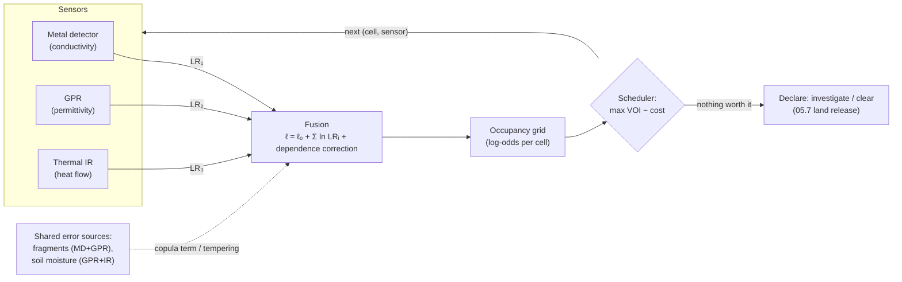

# 05.6 · Sensor fusion

<div class="module-card">

**Prerequisites** [05.1 Detection theory](lessons/stage-05/lesson-01.md) (likelihood ratios, ROC, base rates) · at least two of [05.2](lessons/stage-05/lesson-02.md), [05.3](lessons/stage-05/lesson-03.md), [05.4](lessons/stage-05/lesson-04.md), [05.5](lessons/stage-05/lesson-05.md) · multivariate Gaussians, entropy.

**Estimated time** 7 h (3 h theory · 1.5 h simulator · 2.5 h programming) · **Level** Advanced

**Next** [05.7 Search theory & area clearance](lessons/stage-05/lesson-07.md); later [06.6 State estimation](lessons/stage-06/lesson-06.md), [07.1 Decisions under uncertainty](lessons/stage-07/lesson-01.md) and [09.4 Multimodal sensing](lessons/stage-09/lesson-04.md).

<p class="tags"><span>Bayes</span><span>log-odds</span><span>copulas</span><span>Dempster–Shafer</span><span>occupancy grids</span><span>information gain</span><span>Sim C</span><span>P03</span></p>
</div>

## Why this matters

Bruschini and Gros (1998) made the case early: no single sensor meets the humanitarian
requirement of finding essentially every item (the often-quoted benchmark is ≥ 99.6 %) at a
false-alarm rate that allows affordable clearance. The metal detector finds almost every
metal-bearing object and alarms on every fragment and nail. GPR sees dielectric contrast and
alarms on roots and stones. Thermal IR sees shallow objects at certain hours. Acoustic methods
see compliant objects slowly. Fusion exists because **these sensors fail for different reasons**.

The way fusion goes wrong is also specific. The textbook rule multiplies likelihoods, which
assumes the sensors' errors are independent given the truth. When they are not (the same metal
fragment fools the metal detector and the GPR; the same wet patch fools GPR and thermal), naive
fusion becomes **overconfident**. In clearance, an overconfident "clear" is the worst possible
output. This lesson builds the correct machinery, shows the failure quantitatively, and ends with
the question that matters operationally: *which sensor should I use next, and is it worth it?*

## Learning objectives

1. Derive Bayesian fusion under conditional independence and implement it in log-odds form.
2. Derive, for a Gaussian copula, the exact overconfidence factor of naive Bayes with correlated
   errors, and compute the effective number of independent sensors.
3. Compare feature-level and decision-level fusion, and derive the optimal decision-level rule
   (Chair–Varshney weights) for binary sensor outputs.
4. Combine evidence with Dempster's rule, compute belief and plausibility, and explain Zadeh's
   paradox and what it does, and does not, show.
5. Build a log-odds occupancy grid with sensor footprints and explain why clamping is needed.
6. Rank sensing actions by expected information gain (mutual information) and by value of
   information with costs, and explain when the two disagree.

## Theory

### 1. Bayesian fusion with conditionally independent likelihoods

Let $X\in\{0,1\}$ be "hazardous object present in this cell" and $z_1,\dots,z_N$ the sensor
readings. Bayes' rule is exact:
$p(X\mid z_{1:N}) \propto p(X)\,p(z_{1:N}\mid X)$. The modelling assumption is **conditional
independence** (CI): $p(z_{1:N}\mid X) = \prod_i p(z_i\mid X)$. Dividing the $X=1$ and $X=0$
posteriors gives the **log-odds accumulation** form:

$$ \ell_N = \ell_0 + \sum_{i=1}^{N} \lambda_i, \qquad \ell = \ln\frac{p(X=1\mid\cdot)}{p(X=0\mid\cdot)}, \qquad \lambda_i = \ln\frac{p(z_i\mid X=1)}{p(z_i\mid X=0)} = \ln \mathrm{LR}_i . $$

| Symbol | Meaning | Unit |
|---|---|---|
| $\ell_0 = \ln\frac{p_0}{1-p_0}$ | prior log-odds | nats |
| $\lambda_i$ | log-likelihood ratio (evidence weight) of reading $i$ | nats |
| $\ell_N$ | posterior log-odds; $p = 1/(1+e^{-\ell_N})$ | nats |

**Intuition.** Each independent sensor adds its own weight of evidence to a running total.
Order does not matter, and a reading with LR = 1 changes nothing. A small prior needs a lot of
evidence to overturn. This is the base-rate lesson of 05.1 in additive form. The sum is only
valid if the sensors do not share error sources. Section 2 deals with the case where they do.

**Numerical example.** Prior $p_0 = 0.01$ ($\ell_0 = -4.595$). Readings with LR 5, 8 and 3 (for
example, metal-detector alarm, GPR hyperbola, thermal anomaly):

| After | $\ell$ | $p$ |
|---|---|---|
| prior | −4.595 | 0.010 |
| MD, LR 5 | −2.986 | 0.048 |
| GPR, LR 8 | −0.906 | 0.288 |
| thermal, LR 3 | +0.192 | 0.548 |

Three fairly strong, *independent* pieces of evidence bring a 1 % prior to only 55 %.

```python
import numpy as np

def logit(p): return np.log(p / (1 - p))
def sigmoid(l): return 1 / (1 + np.exp(-l))

def fuse_ci(p0, lrs):
    """Posterior under conditional independence."""
    return sigmoid(logit(p0) + np.sum(np.log(lrs)))

print(fuse_ci(0.01, [5, 8, 3]))    # 0.548
```

<details class="answer"><summary>Exercise 1 — then reveal</summary>

How many independent LR = 3 readings are needed to take a 1 % prior to 99 %? What does that imply
for a detector whose LR per alarm is 3 but whose repeated readings of the same spot are *not*
independent?

*Answer.* Required $\Delta\ell = \ln 99 - \ln(1/99) = \ln 9801 = 9.19$ nats. Since
$\ln 3 = 1.099$, you need $9.19/1.099 = 8.4$, so **9 readings**. Repeated readings of the same
spot by the same sensor share the same clutter object, soil and geometry, so they are highly
correlated and add far less than 1.1 nats each. Sweeping a detector nine times over a nail does
not make it a mine.

</details>

### 2. Correlated errors: what naive Bayes does wrong

**Set-up (Gaussian copula).** Any continuous joint distribution can be written as marginals glued
together by a copula (Sklar's theorem). With the **Gaussian copula** and correlation matrix $R$:

$$ f(\mathbf{s}\mid H) = \underbrace{\prod_i f_i(s_i\mid H)}_{\text{what naive Bayes uses}} \cdot \underbrace{|R|^{-1/2}\exp\!\left(-\tfrac12\,\mathbf{z}^\top (R^{-1}-I)\,\mathbf{z}\right)}_{c_R(\mathbf{u}),\ \text{what it drops}}, \qquad z_i = \Phi^{-1}\!\big(F_i(s_i\mid H)\big). $$

The exact log-likelihood ratio is therefore
$\Lambda_{\text{true}} = \sum_i \lambda_i + \ln c_R(\mathbf{u}^{(1)}) - \ln c_R(\mathbf{u}^{(0)})$.
Naive Bayes keeps only the first term. Marginals can be anything, such as a gamma-distributed
thermal score or a Poisson count. You estimate $R$ on normal scores $z_i$ from trial data.

**Closed form for the canonical case.** Take $N$ sensors with unit-variance Gaussian scores, mean
0 under $H_0$ and $\mu$ under $H_1$, and equicorrelation $R = (1-\rho)I + \rho\mathbf{1}\mathbf{1}^\top$
under both hypotheses. Each sensor's own LLR is $\lambda_i = \mu s_i - \mu^2/2$. The exact LLR is
$\Lambda = \mu\mathbf{1}^\top R^{-1}\mathbf{s} - \tfrac12\mu^2\mathbf{1}^\top R^{-1}\mathbf{1}$.
Because $R\mathbf{1} = (1+(N-1)\rho)\mathbf{1}$, we get $R^{-1}\mathbf{1} = \mathbf{1}/(1+(N-1)\rho)$,
and so:

<div class="callout eq">

$$ \Lambda_{\text{true}} = \frac{\Lambda_{\text{naive}}}{1+(N-1)\rho}, \qquad
N_{\text{eff}} = \frac{N}{1+(N-1)\rho} \xrightarrow{N\to\infty} \frac1\rho, \qquad
d'_{\text{joint}} = \mu\sqrt{N_{\text{eff}}} . $$

</div>

| Symbol | Meaning | Unit |
|---|---|---|
| $\mathbf{s}$ | vector of sensor scores | — |
| $\rho$ | pairwise error correlation (on normal scores) | — |
| $\mu$ | per-sensor separation ($d'$) | — |
| $\Lambda$ | log-likelihood ratio of all readings | nats |
| $N_{\text{eff}}$ | effective number of independent sensors | — |

**Intuition.** Correlated sensors partly repeat each other. Naive Bayes counts that repeated
evidence $1+(N-1)\rho$ times. The effective sensor count **saturates at $1/\rho$**: with
$\rho = 0.5$ you can never have more than two sensors' worth of evidence, however many you add.
Negative correlation ($\rho<0$, errors that tend to cancel) makes naive Bayes *under*-confident,
which is the real argument for choosing physically orthogonal sensors.

**Numerical example (checked, including Monte Carlo).** $N = 3$, $\mu = 1.5$, $\rho = 0.6$,
prior 0.05, all three scores $s_i = 1.5$:

| Quantity | Naive | True |
|---|---|---|
| LLR | $3(1.5\cdot1.5 - 1.125) = 3.375$ | $3.375/2.2 = 1.534$ |
| posterior | **0.606** | **0.196** |
| $d'$ of the ensemble | $1.5\sqrt3 = 2.60$ | $1.5\sqrt{3/2.2} = 1.75$ |

Simulating 400,000 cells from the true model: cells where naive Bayes reported a posterior
between 0.6 and 0.8 (mean 0.70) were actually hazardous **23 %** of the time. Cells it reported
above 0.95 (mean 0.98) were hazardous only 62 % of the time. The calibration failure runs in both
directions. The same factor that inflates alarms also inflates "all clear" readings: naive
posteriors that are too low for absence are equally wrong.

```python
def llr_true_equicorr(s, mu, rho):
    N = len(s)
    naive = np.sum(mu * s - mu**2 / 2)
    return naive, naive / (1 + (N - 1) * rho)

def llr_true_general(s, mu_vec, R):
    """Exact Gaussian LLR with shared covariance R (the copula-corrected answer)."""
    Ri = np.linalg.inv(R)
    return mu_vec @ Ri @ s - 0.5 * mu_vec @ Ri @ mu_vec

s = np.full(3, 1.5); R = 0.4 * np.eye(3) + 0.6
print(llr_true_equicorr(s, 1.5, 0.6), llr_true_general(s, np.full(3, 1.5), R))  # (3.375, 1.534) 1.534
```

**Where the correlation comes from in EOD sensing.** A metal fragment is both conductive (MD
alarm) and a dielectric contrast (GPR alarm). Soil moisture shifts GPR, thermal and
EMI-ground-response together. The same operator, the same time of day, and ML models trained on
overlapping data all share errors. **Remedies**, in order of preference: (i) model the dependence,
by estimating $R$ from blind-trial data (CWA 14747-style) and using the copula-corrected LLR;
(ii) learn the fusion function directly, for example logistic regression on the stacked scores,
which learns $R^{-1}$-like weights; (iii) conservatively temper, by dividing the summed LLR by an
assumed $1+(N-1)\rho$; (iv) choose sensors with physically orthogonal contrasts (05.5).

<details class="answer"><summary>Exercise 2 — derive, then reveal</summary>

(a) For $N=2$ show that as $\rho\to1$ the exact LLR equals a single sensor's LLR evaluated at the
average score. (b) Five sensors with $\rho = 0.3$: what is $N_{\text{eff}}$, and by what factor
is naive Bayes overconfident in nats? (c) If you could buy one more sensor with $\rho = 0.3$ or
one with $\rho = 0$ to the existing five, but the uncorrelated one has $\mu = 1.0$ instead of 1.5,
which adds more $d'^2$?

*Answer.* (a) $\Lambda = \mu(s_1+s_2)/(1+\rho) - \mu^2/(1+\rho) \to \mu\bar s - \mu^2/2$ with
$\bar s = (s_1+s_2)/2$. (b) $1+4(0.3) = 2.2$, so $N_{\text{eff}} = 2.27$ and naive LLRs are 2.2×
too large. (c) A sixth correlated sensor raises $N_{\text{eff}}$ from $5/2.2 = 2.27$ to
$6/2.5 = 2.40$, adding $\Delta d'^2 = 2.25\times0.127 = 0.29$. An independent sensor adds
$\mu^2 = 1.0$ directly (independent evidence adds in $d'^2$). **The weaker but independent sensor
is worth about 3.5 times more.**

</details>

### 3. Feature-level vs decision-level fusion

| | Feature-level (early) | Decision-level (late) |
|---|---|---|
| Input to fuser | raw or engineered features from each sensor (spectra, B-scan patches, thermal time series) | each sensor's declaration or score |
| Needs | co-registration in space and time; joint training data | per-sensor ROC (Pd, Pf) or calibrated scores |
| Captures correlations | yes, if the model is flexible | only if modelled explicitly (§2) |
| Data hunger | high (joint labelled data are scarce in demining) | low |
| Robust to one sensor failing | poor (input distribution shift) | good (drop a term) |
| Typical example | CNN on stacked RGB + LWIR image | MD alarm AND/OR GPR alarm; weighted vote |

**Optimal decision-level rule (Chair–Varshney).** For binary outputs $u_i\in\{0,1\}$ with known
$(P_{d,i}, P_{f,i})$ and CI, the posterior log-odds is

$$ \ell = \ell_0 + \sum_i \left[u_i \ln\frac{P_{d,i}}{P_{f,i}} + (1-u_i)\ln\frac{1-P_{d,i}}{1-P_{f,i}}\right]. $$

A silent sensor ($u_i = 0$) contributes *negative* evidence, weighted by how rarely it misses.

**Numerical example.** MD: $P_d = 0.95$, $P_f = 0.30$ (lots of metal clutter). GPR: $P_d = 0.85$,
$P_f = 0.20$. Fixed rules under CI: **AND** gives $P_d = 0.8075$, $P_f = 0.06$. **OR** gives
$P_d = 0.9925$, $P_f = 0.44$. The Chair–Varshney weights are MD (+1.153, −2.639) and GPR
(+1.447, −1.674). With prior 0.05:

| MD, GPR | posterior |
|---|---|
| 1, 1 | 0.415 |
| 1, 0 | 0.030 |
| 0, 1 | 0.016 |
| 0, 0 | 0.0007 |

A metal-detector *silence* is stronger evidence than a GPR silence, because the MD misses less
often. For clearance, that asymmetry is what matters most.

```python
def chair_varshney(u, pd, pf, p0):
    u, pd, pf = map(np.asarray, (u, pd, pf))
    l = logit(p0) + np.sum(np.where(u == 1, np.log(pd / pf), np.log((1 - pd) / (1 - pf))))
    return sigmoid(l)

print(chair_varshney([1, 0], [0.95, 0.85], [0.30, 0.20], 0.05))   # 0.030
```

<details class="answer"><summary>Exercise 3 — then reveal</summary>

A humanitarian requirement is $P_d \ge 0.99$ for the fused system. Which fixed rule (AND/OR) can
meet it with the two sensors above, what false-alarm rate does it cost, and what does the
Chair–Varshney table tell you about a threshold at posterior 0.01?

*Answer.* Only OR (0.9925), at $P_f = 0.44$. A posterior threshold of 0.01 declares (1,1), (1,0)
and (0,1), which is exactly the OR rule, so the Bayes rule with a low threshold *recovers* OR here.
Fusion does not create detection probability beyond the OR bound. What it can do is sort the
alarms: (1,1) cells are 14× more likely than (1,0) cells, so they get excavated first.

</details>

### 4. Dempster–Shafer theory and Zadeh's paradox

Dempster–Shafer (DS) assigns **mass** $m(A)$ to *subsets* $A$ of the frame $\Theta$, so it can
leave mass on $\Theta$ itself to mean "I don't know". It defines belief
$\mathrm{Bel}(A)=\sum_{B\subseteq A} m(B)$ and plausibility
$\mathrm{Pl}(A)=\sum_{B\cap A\neq\emptyset} m(B)$. Two independent bodies of evidence combine by
**Dempster's rule**:

$$ m_{12}(A) = \frac{1}{1-K}\sum_{B\cap C = A} m_1(B)\,m_2(C),\qquad K = \sum_{B\cap C=\emptyset} m_1(B)\,m_2(C). $$

| Symbol | Meaning |
|---|---|
| $\Theta$ | frame of discernment (exhaustive, exclusive hypotheses) |
| $m(A)$ | basic mass on subset $A$; $\sum_A m(A) = 1$, $m(\emptyset)=0$ |
| $\mathrm{Bel}(A)$, $\mathrm{Pl}(A)$ | lower and upper bounds on support for $A$ |
| $K$ | conflict, the mass that fell on the empty set |

**Numerical example.** $\Theta = \{T, C\}$ (target, clutter). MD: $m_1(T) = 0.6$,
$m_1(\Theta) = 0.4$. GPR: $m_2(T) = 0.3$, $m_2(C) = 0.5$, $m_2(\Theta) = 0.2$. Conflict
$K = m_1(T)m_2(C) = 0.30$. Unnormalised: $T$: $0.18 + 0.12 + 0.12 = 0.42$; $C$: $0.20$;
$\Theta$: $0.08$. Dividing by 0.7 gives $m(T) = 0.600$, $m(C) = 0.286$, $m(\Theta) = 0.114$.
So $\mathrm{Bel}(T) = 0.600$ and $\mathrm{Pl}(T) = 0.714$. For a decision, the pignistic
probability is $\mathrm{BetP}(T) = 0.6 + 0.114/2 = 0.657$.

**Zadeh's paradox (1984).** Frame {plastic-cased object, rock, root}. Sensor 1: object 0.99, rock
0.01. Sensor 2: root 0.99, rock 0.01. Then $K = 0.9999$, and after normalisation
$m(\text{rock}) = 1$. Two sensors that each thought "rock" almost impossible jointly declare it
**certain**.

**What the paradox really shows.** A Bayesian using the same numbers as likelihoods gets the same
answer. The underlying defect is **dogmatic zeros** (Cromwell's rule: never assign zero to
something that is merely unlikely) together with **renormalisation that discards the conflict**.
DS makes the second problem worse, because $K$ is thrown away silently. Practical rules: report
$K$ as a first-class output (high conflict means a sensor is faulty or the frame is wrong);
*discount* each source ($m \to \alpha m$, moving mass $1-\alpha$ to $\Theta$); or use Yager's rule,
which puts $K$ on $\Theta$. DS also assumes independent sources, so it inherits §2's problem.

```python
from itertools import product

def dempster(m1: dict, m2: dict):
    """Masses keyed by frozenset. Returns (combined masses, conflict K)."""
    out, K = {}, 0.0
    for (a, x), (b, y) in product(m1.items(), m2.items()):
        c = a & b
        if c: out[c] = out.get(c, 0) + x * y
        else: K += x * y
    return {k: v / (1 - K) for k, v in out.items()}, K

T, C = frozenset("T"), frozenset("C"); TH = T | C
print(dempster({T: .6, TH: .4}, {T: .3, C: .5, TH: .2}))   # T .600, C .286, Θ .114; K .30
```

<details class="answer"><summary>Exercise 4 — then reveal</summary>

Redo Zadeh's example with each source discounted by $\alpha = 0.9$, so 10 % of each mass moves to
$\Theta$. What is $m(\text{rock})$ now, and what is $K$?

*Answer.* $m_1$: object 0.891, rock 0.009, Θ 0.1. $m_2$: root 0.891, rock 0.009, Θ 0.1. Conflict:
object∩root $0.891^2 = 0.7939$, object∩rock $0.891\times0.009 = 0.0080$, rock∩root 0.0080, so
$K = 0.8099$. Non-empty products: object $0.891\times0.1 = 0.0891$, root 0.0891, rock
$0.009\times0.009 + 2(0.009\times0.1) = 0.00188$, Θ 0.01. Normalising by 0.1901 gives object 0.469,
root 0.469, rock 0.0099, Θ 0.053. The rock is implausible again, and $K = 0.81$ flags a severe
disagreement between the sources, which is the honest output.

</details>

### 5. Occupancy-grid fusion

A search area is a grid of cells $c$. Each carries log-odds $\ell(c)$, and a reading $z$ at
position $x$ updates every cell in the sensor's **footprint**:

$$ \ell_t(c) = \operatorname{clip}\!\big(\ell_{t-1}(c) + \ln \mathrm{LR}(z; c, x),\ \ell_{\min},\ \ell_{\max}\big). $$

| Symbol | Meaning | Unit |
|---|---|---|
| $\ell_t(c)$ | log-odds that cell $c$ holds a hazardous object | nats |
| $\mathrm{LR}(z;c,x)$ | inverse sensor model: evidence of reading $z$ at $x$ about cell $c$ | — |
| $\ell_{\min},\ell_{\max}$ | clamps that keep the grid responsive | nats |

**Two further independence assumptions** hide here. Cells are treated as independent, whereas one
object may straddle cells. Repeated readings are treated as independent, whereas they share
clutter. Clamping is the pragmatic defence against the second: it caps how certain the grid can
become from repeated looks at one spot. It is the robotics equivalent of tempering (§2). This is
the same data structure as the SLAM occupancy grid in [06.7](lessons/stage-06/lesson-07.md).

**Numerical example (1D strip of 5 cells).** Prior 0.02 ($\ell_0 = -3.892$). An MD alarm centred
on cell 3 has footprint LRs (1, 1.5, 6, 1.5, 1). A GPR alarm centred on cell 4 has footprint LRs
(1, 1, 1.5, 5, 1.5).

| cell | 1 | 2 | 3 | 4 | 5 |
|---|---|---|---|---|---|
| after MD | 0.020 | 0.030 | 0.109 | 0.030 | 0.020 |
| after MD + GPR | 0.020 | 0.030 | **0.155** | **0.133** | 0.030 |

Two alarms one cell apart give a *spread* posterior. The fused map says "something near cells
3–4", which is exactly what a person marking a spot for investigation needs. Cell-level certainty
is not the goal.

```python
def grid_update(l, lr_footprint, lmin=-8.0, lmax=8.0):
    return np.clip(l + np.log(lr_footprint), lmin, lmax)

l = np.full(5, logit(0.02))
l = grid_update(l, np.array([1, 1.5, 6, 1.5, 1]))
l = grid_update(l, np.array([1, 1, 1.5, 5, 1.5]))
print(sigmoid(l).round(3))   # [0.02 0.03 0.155 0.133 0.03]
```

<details class="answer"><summary>Exercise 5 — then reveal</summary>

The metal detector is swept over cell 3 ten times and alarms each time (LR 6 per alarm under CI).
With $\ell_{\max} = 3$, what posterior does the grid report, and what would it have reported
without clamping? Which is closer to the truth if all ten alarms come from the same nail?

*Answer.* Unclamped: $-3.892 + 10\ln 6 = 14.03$, so $p \approx 1 - 8\times10^{-7}$. Clamped at 3:
$p = 0.953$. With one nail the ten readings are one piece of evidence ($\rho\approx1$), and the
correct posterior is about 0.109 (one alarm). Both values are wrong, but the clamp limits the
damage. The real fix is a sensor model with a per-location dependence term.

</details>

### 6. Sensor selection: information gain and value of information

**Expected information gain.** For a binary cell with belief $p$ and a sensor $(P_d, P_f)$, the
mutual information between the cell and the next reading is

$$ I(X;Z) = H_b\!\big(pP_d + (1-p)P_f\big) - \big[p\,H_b(P_d) + (1-p)\,H_b(P_f)\big],\qquad H_b(q) = -q\log_2 q - (1-q)\log_2(1-q). $$

**Value of information.** Let there be actions $a$ (declare clear or investigate) with losses
$L(a, X)$, for example missed hazard $L_m = 100$ and investigation cost $L_e = 5$ (abstract cost
units). Then

$$ \mathrm{VOI} = \min_a \mathbb{E}[L(a,X)] - \mathbb{E}_Z\!\left[\min_a \mathbb{E}[L(a,X)\mid Z]\right] \;\ge 0, \qquad \text{sense iff } \mathrm{VOI} > c_{\text{sensor}} . $$

| Symbol | Meaning | Unit |
|---|---|---|
| $I(X;Z)$ | expected reduction in entropy of $X$ from reading $Z$ | bit |
| $H_b$ | binary entropy | bit |
| $L_m$, $L_e$ | loss of a missed hazard; cost of investigating | cost units |
| $c_{\text{sensor}}$ | cost of taking the reading (time, exposure, battery) | cost units |

**Numerical example.** Sensor A: $P_d = 0.90$, $P_f = 0.10$. Sensor B: $P_d = 0.95$, $P_f = 0.30$.

| $p$ | $I_A$ (bit) | $I_B$ (bit) | VOI$_A$ | VOI$_B$ |
|---|---|---|---|---|
| 0.02 | 0.049 | 0.027 | 1.22 | 0.34 |
| 0.04 | — | — | 2.94 | 2.17 |
| 0.20 | 0.358 | 0.224 | **1.70** | **1.85** |
| 0.50 | 0.531 | 0.371 | — | — |

At $p = 0.2$, sensor **A is more informative but B is more valuable**. The decision is "investigate
unless the posterior falls below $L_e/L_m = 0.05$". What matters is how often a reading can push the
belief below 0.05. B's higher $P_d$ makes its silence more convincing
($p\to0.018$, against A's 0.027). Information gain is decision-agnostic; VOI is tied to the
decision. Use VOI when losses are known, and information gain when they are not, or for mapping
before any decision is framed.

```python
def Hb(q):
    q = np.clip(q, 1e-12, 1 - 1e-12)
    return -(q * np.log2(q) + (1 - q) * np.log2(1 - q))

def info_gain(p, pd, pf):
    return Hb(p * pd + (1 - p) * pf) - (p * Hb(pd) + (1 - p) * Hb(pf))

def voi(p, pd, pf, Lm=100.0, Le=5.0):
    best = lambda q: min(Lm * q, Le)
    pz = p * pd + (1 - p) * pf
    return best(p) - (pz * best(p * pd / pz) + (1 - pz) * best(p * (1 - pd) / (1 - pz)))

print(info_gain(0.2, .9, .1), info_gain(0.2, .95, .3), voi(0.2, .9, .1), voi(0.2, .95, .3))
```

**Greedy scheduling.** Repeatedly choose the (cell, sensor) pair with the highest
$\text{gain}/\text{cost}$, or the highest $\mathrm{VOI} - c$. Stop when nothing has positive net
value. Under CI, information gain is **submodular**, and greedy selection is within a factor
$(1-1/e)$ of optimal for a fixed budget (Krause & Guestrin). VOI is *not* submodular in general.
Two readings can be worthless alone and valuable together, so myopic VOI can stop too early. Use a
two-step lookahead when that matters.

<details class="answer"><summary>Exercise 6 — then reveal</summary>

With $p = 0.02$, $c_A = 1.0$ and $c_B = 0.5$: which sensor, if any, should be used? At $p = 0.04$?

*Answer.* $p = 0.02$: net A $= 1.22 - 1.0 = 0.22$, net B $= 0.34 - 0.5 < 0$, so use **A**.
$p = 0.04$: net A $= 1.94$, net B $= 1.67$, so **A** again. B becomes preferable near
$p \approx 0.2$, where its reliable silence can clear the cell. The best sensor depends on the
current belief, which is the whole point of adaptive scheduling.

</details>

## Visual explanation



Sim C closes this loop interactively.

<iframe class="sim-frame" src="sims/sensor-fusion/index.html?embed=1" height="720" loading="lazy"></iframe>

<a class="sim-link" href="sims/sensor-fusion/index.html" target="_blank">Open Sim C full-screen ↗</a>

## Worked example — two sensors that share a weakness

A fictional clearance team works a 10 m × 10 m box (100 cells of 1 m²) with prior 0.02 per cell.
Blind-trial data for their MD and GPR give single-sensor $d' = 1.5$ each. On normal scores
**over metal-fragment clutter**, the two sensors are correlated at $\rho = 0.6$; elsewhere
$\rho\approx0.1$.

1. **Naive fusion.** A cell where both scores are 1.5 gets LLR $2\times1.125 = 2.25$, so
   $p = \sigma(-3.892 + 2.25) = 0.162$.
2. **Copula-corrected.** Over fragment clutter the LLR is $2.25/1.6 = 1.406$, so $p = 0.077$.
   Elsewhere it is $2.25/1.1 = 2.045$, so $p = 0.136$.
3. **Consequence for a threshold at 0.1.** The naive grid flags *every* double-alarm cell in the
   fragment field. The corrected grid does not flag them, and correctly asks for a third,
   **orthogonal** sensor there.
4. **Scheduler.** For a fragment-field cell at $p = 0.077$ the options are a thermal look (cost
   0.3, weakly correlated with MD) or a repeat GPR pass (cost 0.2, but $\rho\approx0.9$ with the
   first pass). With the VOI formula and the effective-evidence discount, the cheap repeat is
   nearly worthless, and thermal wins.
5. **Audit.** The team records the fused posterior, the conflict/dependence assumptions, and the
   sensor sequence per cell. That record is the evidence trail land release requires (05.7).

<div class="callout safety">

**Safety principle.** Fusion error is asymmetric in consequence. Overconfident "hazard" wastes
effort; overconfident "clear" can kill. When dependence is uncertain, bias the model toward
*under*-confidence for clearance decisions, and treat unexplained sensor conflict as a reason to
investigate, not to average.

</div>

## Simulation work

<div class="callout sim">

**Sim C.** (1) Choose *Intermediate* and fuse MD + GPR on a grid with the *independent* model.
Note the posteriors in the fragment-strewn region. (2) Switch on *correlated errors* and repeat.
How many "confident" cells lose their confidence? (3) Enable the VOI panel and follow its
recommended next sensor for ten steps. Then do ten steps of your own choosing, and compare total
cost and debrief score. (4) *Expert:* the sim hides the correlation level; estimate it from the
debrief of three seeded runs.

</div>

## Practical exercises

<details class="answer"><summary>P1 · Estimating ρ from trial data — then reveal</summary>

In a blind trial on 400 clutter-only cells, MD and GPR normal scores have sample correlation
0.45. Give a 95 % confidence interval for $\rho$ (Fisher z) and the resulting range of the
naive-Bayes overconfidence factor for $N=2$.

*Answer.* $z = \operatorname{atanh}(0.45) = 0.485$, SE $= 1/\sqrt{397} = 0.050$, so the interval
is $0.485\pm0.098 \Rightarrow \rho\in[0.37, 0.53]$. The overconfidence factor $1+\rho$ lies in
[1.37, 1.53]. Use the upper end for clearance decisions.

</details>

<details class="answer"><summary>P2 · Feature vs decision level — then reveal</summary>

You have 50 labelled co-registered MD+GPR+IR samples of real targets and 20,000 of clutter. Which
fusion level, and why?

*Answer.* Decision-level (or a low-capacity score-level logistic regression on 3 scores). 50
positives cannot train a feature-level model without severe overfitting. Per-sensor ROCs can come
from larger single-sensor trials, and $R$ can be estimated from the plentiful clutter data (the
dependence that causes false confidence). Revisit feature-level fusion with synthetic data (09.3).

</details>

<details class="answer"><summary>P3 · Conflict as a diagnostic — then reveal</summary>

Over 200 cells, DS conflict $K$ averages 0.1, but in one row of 10 cells it is 0.7. Give two
hypotheses and a test for each.

*Answer.* (1) A sensor fault or mis-registration in that row: re-run with the sensor's georeference
shifted and see if $K$ drops. (2) A frame error, meaning an object class outside $\Theta$ (for
example buried pipe: MD strong, GPR a linear, not hyperbolic, return). Inspect the raw GPR B-scan
for linear continuity. Either way, the row must not be released on the fused output.

</details>

## Programming exercise — grid fusion with a greedy scheduler

**Goal.** Implement the loop in the diagram: a multi-sensor log-odds grid with an explicit
dependence model and a cost-aware greedy scheduler.

- **Input:** grid size, prior map; a list of sensors, each with (score distributions under
  $H_0/H_1$ or $P_d, P_f$), footprint kernel, cost, and a pairwise normal-score correlation matrix
  (optionally different over "clutter" cells); a hidden ground truth (for simulation only); a
  budget.
- **Output:** posterior map after each action; the action log (cell, sensor, reading, VOI, cost);
  final declarations with a threshold $L_e/L_m$; calibration curve against ground truth.
- **Constraints:** NumPy/SciPy only; per-cell update in $O(\text{footprint})$; fused LLR per
  cell must use the Gaussian-copula correction for readings from correlated sensors; clamp at
  $\pm 8$ nats.
- **Expected behaviour:** with $\rho = 0$ the corrected and naive grids agree; with $\rho > 0$ the
  naive grid's reliability diagram lies below the diagonal at high posteriors, and the corrected
  grid lies on it (within Monte Carlo error); the scheduler stops when no VOI exceeds cost.
- **Test cases:** (i) `fuse_ci(0.01,[5,8,3]) == 0.548 ± 1e-3`; (ii) equicorrelated $N=3$,
  $\rho=0.6$, $s=1.5$: corrected LLR 1.534; (iii) Chair–Varshney table above; (iv) `voi(0.2,.95,.3)
  > voi(0.2,.9,.1)` while `info_gain` ranks them the other way; (v) at budget 0 no actions are
  taken.
- **Extensions:** two-step lookahead VOI; learn the fusion function by logistic regression on
  stacked scores and compare calibration; replace the fixed $R$ with a hierarchical model
  estimated online.

This is [Project P03](projects/p03-bayesian-fusion/README.md). Its sensor models come from
[P02](projects/p02-sensor-noise/README.md).

## Reading

- Bruschini, C. & Gros, B., "A Survey of Research on Sensor Technology for Landmine Detection",
  *J. Humanitarian Demining* 2(1) (1998), https://commons.lib.jmu.edu/cisr-journal/vol2/iss1/3/.
  Read the fusion argument and the per-sensor limitations.
- "A comparison of decision-level sensor-fusion methods for anti-personnel landmine detection",
  *Information Fusion* 2(3) (2001),
  https://www.sciencedirect.com/science/article/abs/pii/S1566253501000343. Read it as a
  ready-made data set for §3: reproduce its rule comparison.
- MacDonald, J., Lockwood, J. R. et al., *Alternatives for Landmine Detection*, RAND MR-1608 (2003),
  https://www.rand.org/pubs/monograph_reports/MR1608.html. Read the multi-sensor chapter and the
  false-alarm-source table (the table is where the correlations come from).
- CEN CWA 14747-1:2003, *Humanitarian Mine Action — Test and Evaluation — Metal Detectors*,
  https://www.mineactionstandards.org/standards/07-05-2003/. Read the trial-design sections: the
  data from which $P_d$, $P_f$ and $\rho$ must be estimated.
- Thrun, S., Burgard, W. & Fox, D., *Probabilistic Robotics*, MIT Press (2005),
  https://mitpress.mit.edu/9780262201629/probabilistic-robotics/. Read ch. 4 (binary Bayes
  filter) and ch. 9 (occupancy grids), which give the log-odds machinery in robotics notation.

## Assessment

1. *(Conceptual)* Explain in two sentences why adding sensors of the same physical type yields
   diminishing returns, using $N_{\text{eff}}$.
2. *(Mathematical)* Prove $R\mathbf{1} = (1+(N-1)\rho)\mathbf{1}$ for the equicorrelation matrix
   and use it to derive $\Lambda_{\text{true}}$.
3. *(Computation)* Prior 0.1, MD ($P_d$ 0.95, $P_f$ 0.30) silent, GPR ($P_d$ 0.85, $P_f$ 0.20)
   alarms. Posterior?
4. *(Interpretation)* A DS fusion output reports $\mathrm{Bel}(T)=0.2$, $\mathrm{Pl}(T)=0.9$.
   What does the gap mean operationally, and what action does it suggest?
5. *(Design)* Propose a sensor-scheduling objective for a robot that must *also* limit its own
   exposure time in a cell. How would you add exposure to the VOI formulation?

<details class="answer"><summary>Answers to 2 and 3</summary>

2. Row $i$ of $R\mathbf{1}$ is $1 + \rho(N-1)$. Then $R^{-1}\mathbf{1} = \mathbf{1}/(1+(N-1)\rho)$,
   so $\mu\mathbf{1}^\top R^{-1}\mathbf{s} - \tfrac12\mu^2\mathbf{1}^\top R^{-1}\mathbf{1} =
   (\mu\sum s_i - N\mu^2/2)/(1+(N-1)\rho)$.
3. $\ell = \ln(1/9) + \ln(0.05/0.70) + \ln(0.85/0.20) = -2.197 - 2.639 + 1.447 = -3.389$, so
   $p = 0.033$.

</details>

## Expert extension

- **Covariance intersection.** When the cross-correlation between two estimates is *unknown*, CI
  fusion $P^{-1} = \omega P_1^{-1} + (1-\omega)P_2^{-1}$ is consistent for every correlation.
  Derive it and compare it with the copula correction when $\rho$ is known.
- **Vine copulas** for non-equicorrelated, tail-dependent sensor errors: sensors that fail
  together mostly in extreme conditions (saturated soil).
- **Adaptive submodularity** (Golovin & Krause) gives greedy guarantees for *adaptive* sensor
  selection policies. Check whether your scheduler's objective qualifies.
- Link to active perception ([09.5](lessons/stage-09/lesson-05.md)): the same VOI loop, with robot
  motion as the action.

## What comes next

[05.7 Search theory & area clearance](lessons/stage-05/lesson-07.md) scales this cell-level
reasoning up to whole areas: how to spread limited search effort, how land is released on
evidence, and how quality assurance sampling checks the result.
[06.6](lessons/stage-06/lesson-06.md) turns the same Bayes filter to estimating a robot's own
state.
