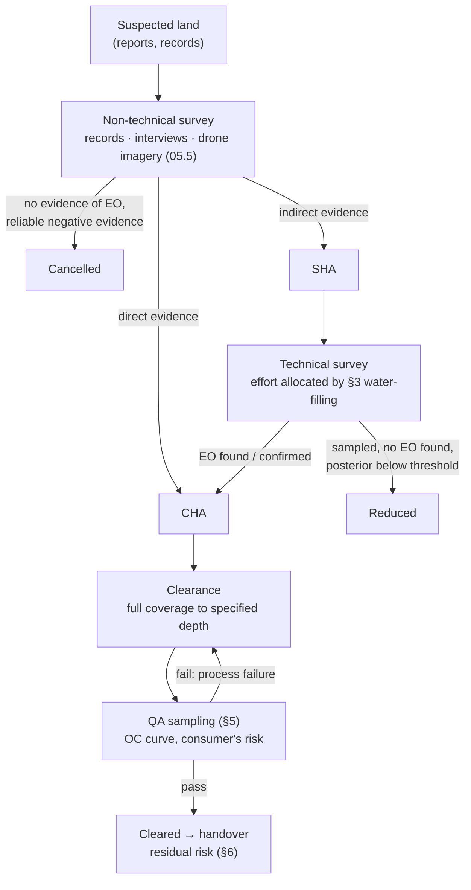

# 05.7 · Search theory & area clearance

<div class="module-card">

**Prerequisites** [05.1 Detection theory](lessons/stage-05/lesson-01.md) · [05.6 Sensor fusion](lessons/stage-05/lesson-06.md) (posteriors, VOI) · Lagrange multipliers / KKT conditions, Poisson and binomial distributions.

**Estimated time** 6 h (3 h theory · 0.5 h simulator · 2.5 h programming) · **Level** Advanced

**Next** [06.6 State estimation](lessons/stage-06/lesson-06.md) and [07.1 Decisions under uncertainty](lessons/stage-07/lesson-01.md). Case studies: [Laos cluster munitions](case-studies/cs05-laos-cluster-munitions.md), [Kuwait clearance](case-studies/cs04-kuwait-clearance.md).

<p class="tags"><span>search theory</span><span>optimisation</span><span>KKT</span><span>land release</span><span>acceptance sampling</span><span>residual risk</span><span>Sim C</span><span>P03</span></p>
</div>

## Why this matters

Lessons 05.1–05.6 ask whether there is a hazard *here*. Mine action asks a larger question: **in
this whole area, where should the next hour of effort go, and when can the land be handed back?**
Two bodies of theory answer it. The first is **search theory**, created by B. O. Koopman for the
US Navy's anti-submarine operations in the Second World War and later developed by L. D. Stone
into the mathematics of optimal search. It turns a detector's behaviour into a probability of
detection as a function of effort, and tells you how to spread effort across an area of uneven
suspicion. The second is the **land-release framework** of the International Mine Action
Standards (IMAS 07.11). It releases land on *evidence*: much of it through survey rather than
full clearance. It is checked by **quality-assurance sampling**, a close relative of industrial
acceptance sampling (ISO 2859-style).

Most suspected land is not contaminated. Laos, the most heavily cluster-munition-contaminated
country, still had about 1,500 km² of *confirmed* hazardous area at the end of 2024 (Landmine &
Cluster Munition Monitor). Clearing all suspected land at detector speed is impossible. The
engineering problem is allocation under uncertainty with an asymmetric cost of error, and that is
what this lesson formalises.

## Learning objectives

1. Derive the random-search law $\text{POD} = 1-e^{-WL/A}$ and explain its assumptions.
2. Define the lateral range curve and sweep width. Derive the inverse-cube lateral range curve,
   and compare definite-range, inverse-cube and random search for parallel sweeps.
3. Derive the optimal allocation of search effort for exponential detection functions via
   Lagrange multipliers (KKT), and implement the water-filling solution.
4. Describe land release (NTS → TS → clearance; cancelled / reduced / cleared land) as sequential
   Bayesian evidence accumulation.
5. Compute the probability that a QA sampling plan accepts a field with a given residual
   contamination, and design a plan to meet a stated consumer's risk.
6. Quantify residual risk after clearance and QA with Poisson thinning, and explain what QA can and
   cannot tell you.

## Theory

### 1. Random search and the exponential detection law

A searcher sweeps a strip of effective width $W$ along a path of length $L$ inside an area $A$
that contains one target, uniformly distributed. Split the path into $n$ short pieces. Each covers
area $W L/n$, and if the pieces are placed *randomly* (independently), each detects with
probability $WL/(nA)$. The probability of missing on all of them is $(1 - WL/nA)^n$, and in the
limit:

$$ \text{POD} = 1 - \exp\!\left(-\frac{W L}{A}\right) = 1 - e^{-C}, \qquad C \equiv \frac{WL}{A}\ \text{(coverage)} . $$

| Symbol | Meaning | SI unit |
|---|---|---|
| $W$ | sweep width (effective detection width, §2) | m |
| $L$ | track length searched | m |
| $A$ | area searched | m² |
| $C$ | coverage: swept area / area | — |
| POD | probability of detection (for one target, conditional on it being in $A$) | — |

**Intuition.** Random search wastes effort by re-sweeping ground already covered. Coverage 1 gives
only 63 %, and each further unit of coverage removes the same *fraction* of the remaining miss
probability. The law is pessimistic for disciplined parallel sweeps and realistic for poorly
controlled search: hand-held detector drift, lane overlaps, drone lines disturbed by wind, and
tired searchers. It is also the natural *detection function* for the allocation theory of §3.

**Numerical example.** $A = 100$ m², $W = 0.5$ m, $L = 400$ m: $C = 2$ and
$\text{POD} = 1 - e^{-2} = 0.865$. For POD 0.95 you need $C = \ln 20 = 3.0$, so
$L = 3.0\times100/0.5 = 599$ m. The last 10 percentage points cost 50 % more track.

```python
import numpy as np

def pod_random(W, L, A):
    return 1 - np.exp(-W * L / A)

def track_for_pod(pod, W, A):
    return -np.log(1 - pod) * A / W

print(pod_random(0.5, 400, 100), track_for_pod(0.95, 0.5, 100))   # 0.865, 599 m
```

<details class="answer"><summary>Exercise 1 — then reveal</summary>

(a) Show that for small coverage, $\text{POD}\approx C$, and explain why. (b) Two independent
random searches of coverage $C_1$ and $C_2$ are made. Show the combined POD equals that of a single
search of coverage $C_1+C_2$. (c) Why is (b) *false* for two passes of the same operator with the
same detector over the same lanes?

*Answer.* (a) $1-e^{-C} = C - C^2/2 + \dots$: with little effort there is almost no overlap, so
every square metre swept is new. (b) $1-e^{-C_1}e^{-C_2} = 1 - e^{-(C_1+C_2)}$, so effort is
additive in the exponent. (c) The misses are *correlated*. An item missed because it is deep, or
low in metal content, or lying in a magnetic soil patch, will tend to be missed again. That is the
05.6 dependence problem in search form. Independent re-search needs a *different* sensor, operator
or geometry.

</details>

### 2. Lateral range curves, sweep width and detection laws

A sensor moving along a straight track passes a target at lateral offset $x$. The **lateral range
curve** $p(x)$ is the probability of detecting it on that pass. The **sweep width** is the area
under it:

$$ W = \int_{-\infty}^{\infty} p(x)\,dx . $$

$W$ is the width of an ideal "cookie-cutter" sensor that detects the same expected number of
targets per unit track length. It is *not* the physical width of the detector head.

**Definite-range law.** $p(x) = 1$ for $|x| \le R$, 0 otherwise, so $W = 2R$. Parallel sweeps at
spacing $S$ give $\text{POD} = \min(1, W/S)$: perfect coverage with no waste, if navigation is
perfect.

**Inverse-cube law (Koopman).** Suppose the instantaneous detection rate falls off as
$\gamma(r) = \kappa/r^3$. This was Koopman's model for a visual searcher looking at a wake, where
the solid angle falls as $r^{-3}$. A searcher at speed $v$ passing at offset $x$ accumulates
$\int \kappa/(x^2+y^2)^{3/2}\,dy/v = 2\kappa/(v x^2)$, so

$$ p(x) = 1 - \exp\!\left(-\frac{W^2}{4\pi x^2}\right), \qquad \text{POD}_{\text{parallel}} = \operatorname{erf}\!\left(\frac{\sqrt\pi}{2}\,\frac{W}{S}\right). $$

The constant was fixed by requiring $\int p\,dx = W$, using
$\int_{-\infty}^{\infty}(1-e^{-a/x^2})\,dx = 2\sqrt{\pi a}$.

| Symbol | Meaning | Unit |
|---|---|---|
| $p(x)$ | lateral range curve | — |
| $x$ | closest-approach lateral distance | m |
| $R$ | definite detection range | m |
| $\gamma(r)$ | instantaneous detection rate at range $r$ | s⁻¹ |
| $S$ | track spacing in a parallel sweep | m |
| $W/S$ | coverage factor of a parallel search | — |

**Numerical comparison** (inverse-cube values checked by summing the hazard over 40,001 parallel
tracks numerically):

| $W/S$ | definite range | inverse cube | random |
|---|---|---|---|
| 0.5 | 0.500 | 0.469 | 0.393 |
| 1.0 | 1.000 | 0.790 | 0.632 |
| 2.0 | 1.000 | 0.988 | 0.865 |

**Intuition.** Real sensors lie between the two extremes. A demining detector's lateral range
curve across its head is closer to definite-range, which is why lane-overlap discipline
(effectively $S < W$) gives very high POD for detectable items. A drone thermal survey, where
detection depends on contrast, look angle and range, looks more like inverse-cube. The table also
shows the cost of ignorance: if you assume definite-range and set $S = W$, you claim POD 1.0 when
the reality may be 0.79.

```python
from math import erf, sqrt, pi, exp

def pod_parallel(W_over_S, law="inverse_cube"):
    if law == "definite": return min(1.0, W_over_S)
    if law == "random": return 1 - exp(-W_over_S)
    return erf(sqrt(pi) / 2 * W_over_S)

def pod_parallel_numeric(W, S, ntracks=20000, nx=2001):
    """Check: sum inverse-cube hazard over all tracks, average over target offset."""
    a = W**2 / (4 * pi)
    xs = np.linspace(0, S, nx)[1:-1]; n = np.arange(-ntracks, ntracks + 1)
    haz = np.array([np.sum(a / (x - n * S)**2) for x in xs])
    return np.mean(1 - np.exp(-haz))

print(pod_parallel(1.0), pod_parallel_numeric(1.0, 1.0))   # 0.790, 0.790
```

<details class="answer"><summary>Exercise 2 — then reveal</summary>

Under each law, what coverage factor $W/S$ is needed for POD = 0.99? Comment on the spread.

*Answer.* Definite: 0.99 (any $W/S \ge 0.99$). Inverse cube: $\operatorname{erf}(y) = 0.99$ gives
$y = 1.821$, so $W/S = 2y/\sqrt\pi = 2.06$. Random: $\ln 100 = 4.61$. For the same POD claim, the
required effort varies by a factor of 4.7 depending on a *modelling assumption*. This is why
IMAS-compliant organisations measure detection performance in field trials (CWA 14747) instead of
assuming it.

</details>

### 3. Optimal allocation of search effort (Koopman / Stone)

The area is divided into cells $i = 1..n$ with prior probabilities $p_i$ that the target is in
cell $i$ ($\sum p_i \le 1$). Effort $z_i \ge 0$ placed in cell $i$ detects a target there with the
exponential detection function $b_i(z_i) = 1 - e^{-\alpha_i z_i}$. If effort is track length,
then $\alpha_i = W/A_i$; if it is time at speed $v$, then $\alpha_i = Wv/A_i$. Given total effort
$Z$, the problem is:

$$ \max_{z\ge 0}\ \sum_i p_i\big(1 - e^{-\alpha_i z_i}\big) \quad \text{s.t.} \quad \sum_i z_i = Z . $$

**Derivation.** The objective is concave (a sum of concave functions) and the constraints are
linear, so the KKT conditions are necessary and sufficient. The Lagrangian is
$\mathcal{L} = \sum_i p_i(1-e^{-\alpha_i z_i}) - \lambda(\sum z_i - Z) + \sum_i \mu_i z_i$.
Stationarity gives $p_i\alpha_i e^{-\alpha_i z_i} = \lambda - \mu_i$. Complementary slackness
gives $\mu_i z_i = 0$. So:

<div class="callout eq">

$$ z_i^* = \frac{1}{\alpha_i}\,\Big[\ln\frac{p_i\,\alpha_i}{\lambda}\Big]^+ , \qquad \lambda \text{ chosen so that } \sum_i z_i^* = Z . $$

A cell receives effort only if its *marginal detection rate at zero effort*, $p_i\alpha_i$, exceeds
the "water level" $\lambda$. Every searched cell ends with the same marginal rate
$p_i\alpha_i e^{-\alpha_i z_i} = \lambda$.

</div>

| Symbol | Meaning | Unit |
|---|---|---|
| $p_i$ | prior probability that the target is in cell $i$ | — |
| $\alpha_i$ | search efficiency in cell $i$ | per unit effort |
| $z_i$ | effort allocated to cell $i$ | e.g. m of track, h |
| $Z$ | total effort budget | same |
| $\lambda$ | Lagrange multiplier: marginal POD per unit effort at the optimum | per unit effort |

**Intuition (water-filling).** Picture each cell's $\ln(p_i\alpha_i)$ as the height of a column.
Pour effort, the "water", in from the top. It fills the highest cells first, bringing their
*posterior* marginal value down, until all wet cells are level at $\ln\lambda$. When all
$\alpha_i$ are equal, the unnormalised posteriors $p_i e^{-\alpha z_i}$ of every searched cell are
**equal**. Optimal search keeps searching wherever the target is now most likely. Stone showed
more: for exponential detection functions, the optimal plan for budget $Z$ is *contained in* the
optimal plan for any larger budget. The plan is **uniformly optimal**, so you can search
incrementally and stop at any time without regret.

**Numerical example.** $p = (0.4, 0.3, 0.2, 0.1)$, $\alpha_i = 1$, $Z = 2$. Bisection on
$\lambda$ gives $\lambda = 0.1481$ and $z^* = (0.994, 0.706, 0.300, 0)$. Check: $0.4e^{-0.994} =
0.3e^{-0.706} = 0.2e^{-0.300} = 0.148$, and cell 4 ($p = 0.1 < \lambda$) gets nothing.

| Plan | POD |
|---|---|
| optimal (water-filling) | **0.456** |
| uniform, $z_i = 0.5$ | 0.393 |
| all effort in cell 1 | 0.346 |

With unequal efficiencies $\alpha = (0.5, 1, 2, 1)$, for example cell 1 being dense scrub where
the detector is slow: $z^* = (0.713, 0.762, 0.525, 0)$ and POD 0.410. The most likely cell no
longer gets the most effort, because effort there buys less.

```python
def optimal_allocation(p, alpha, Z, iters=200):
    """Koopman/Stone allocation for b_i(z) = 1 - exp(-alpha_i z). Returns (z, lambda, POD)."""
    p, alpha = np.asarray(p, float), np.asarray(alpha, float)
    lo, hi = 1e-15, float(np.max(p * alpha))
    for _ in range(iters):                          # geometric bisection on the water level
        lam = np.sqrt(lo * hi)
        z = np.maximum(0.0, np.log(p * alpha / lam) / alpha)
        lo, hi = (lam, hi) if z.sum() > Z else (lo, lam)
    return z, lam, float(np.sum(p * (1 - np.exp(-alpha * z))))

print(optimal_allocation([.4, .3, .2, .1], [1, 1, 1, 1], 2.0))
# z ≈ [0.994 0.706 0.300 0.], λ ≈ 0.148, POD ≈ 0.456
```

<details class="answer"><summary>Exercise 3 — derive, then reveal</summary>

(a) With equal $\alpha$ and all $n$ cells searched, derive the closed form for $\lambda$ and $z_i$.
(b) Apply it to the example to confirm $\lambda$. (c) After the optimal search fails to find the
target, what is the posterior in cell 4?

*Answer.* (a) $\sum_i \frac1\alpha\ln(p_i\alpha/\lambda) = Z$ gives
$\ln\lambda = \frac1k\sum_{i\in S}\ln(p_i\alpha) - \alpha Z/k$ for the $k$ searched cells $S$, and
then $z_i = \frac1\alpha[\ln p_i - \overline{\ln p}_S] + Z/k$. (b) $S = \{1,2,3\}$:
$\overline{\ln p} = (\ln0.4 + \ln0.3 + \ln0.2)/3 = -1.2432$, so
$\ln\lambda = -1.2432 - 2/3 = -1.9099$ and $\lambda = 0.1481$. ✓ (Check that cell 4 is excluded:
$0.1 < 0.148$.) (c) Unnormalised posteriors are (0.148, 0.148, 0.148, 0.1), total 0.544, so cell
4 now holds $0.1/0.544 = 0.184$. Cell 4 enters the next increment of effort almost immediately.

</details>

### 4. Humanitarian land release (IMAS 07.11)

Land release is the process of **releasing land suspected of explosive-ordnance contamination by
applying all reasonable effort** to identify, define and remove the hazard. It uses the least
expensive means that produce sufficient evidence. There are three routes:

| Route | Activity | Released land is called | Evidence type |
|---|---|---|---|
| **Non-technical survey (NTS)** | records, interviews, site visits, remote sensing (05.5), without entering suspected areas with detectors | **cancelled** | absence of indicators; reliable local testimony of use; historical records |
| **Technical survey (TS)** | targeted physical intervention (detector, mechanical, animal) inside the suspected area | **reduced** | negative physical evidence from sampled locations |
| **Clearance** | removal/destruction of all EO to a specified depth across the area | **cleared** | full-coverage search to the specified standard |

Survey outputs are polygons: a **suspected hazardous area (SHA)**, where there is an indication of
contamination, and a **confirmed hazardous area (CHA)**, where there is direct evidence.

**Bayesian reading.** Each step adds evidence with a likelihood ratio. NTS evidence typically has
modest LRs; for example, "no indicators seen by drone" had an LR of about 0.67 in 05.5 P4.
Farmers who have cultivated a plot for ten years without incident provide much stronger negative
evidence. TS supplies strong negative evidence *where it searches*. The land-release decision is
"posterior probability of contamination × consequence < acceptable residual risk", and
IMAS-compliant national standards set what "all reasonable effort" means for that trade-off. The
optimal-allocation machinery of §3 is exactly how TS effort should be spread across an SHA: cells
with more indicators, easier access (higher $\alpha$) and more likely contamination get searched
first, and the posterior tells you when the remainder can be cancelled or reduced.

<div class="callout key">

**Why this matters quantitatively.** Survey-driven release is the main productivity lever in mine
action. The Laos programme's shift to evidence-based cluster-munition-remnant survey is the case
study ([cs05](case-studies/cs05-laos-cluster-munitions.md)). A false "cancel" moves risk onto the
community. A false "keep" locks up agricultural land for years. Both are costs, and the framework
exists to make the trade-off explicit and auditable.

</div>

<details class="answer"><summary>Exercise 4 — then reveal</summary>

An SHA of 20 cells has prior contamination 0.15 per cell (independent). NTS interviews give LR 0.3
for 12 cells (reliable reports of long, incident-free use) and LR 2 for 8 (reports of fighting
positions). The national threshold for cancellation is a posterior below 0.05. Which cells can be
cancelled?

*Answer.* Prior odds are 0.176. With LR 0.3: odds 0.053, so $p = 0.050$, which is *exactly* at
the threshold. It cannot be cancelled on these numbers; an additional piece of negative evidence
is needed (for example a drone pass or a TS sample). With LR 2: odds 0.353, so $p = 0.26$, and
those cells go to TS. Borderline results should be reported as borderline. The rules exist to
stop rounding in the convenient direction.

</details>

### 5. Quality-assurance sampling (IMAS 09.20, ISO 2859-style)

After clearance, an independent QA/QC body inspects a **sample** of the released land and applies
an acceptance rule. Typically this is "accept if no item is found (c = 0)" for hazardous items,
because a found item signals a process failure. IMAS 09.20 covers this sampling-based inspection.
The logic is the same as ISO 2859 acceptance sampling by attributes: an **operating
characteristic (OC) curve** $P_{\text{acc}}$ as a function of lot quality, with a producer's risk
(rejecting good work) and a consumer's risk (accepting bad work).

**Area-sampling model.** $K$ residual items are independently and uniformly located in the field.
QA searches a random fraction $f$ of the area with its own detection probability $q$, and accepts
on zero finds:

$$ P_{\text{acc}}(K) = (1 - f q)^K, \qquad \text{or, with } K \sim \text{Poisson}(\rho A):\quad P_{\text{acc}} = e^{-\rho A f q}. $$

With a lot-based plan ($N$ equal sub-plots, $D$ of them containing an item, $n$ sampled, accept if
none is found, perfect inspection), the hypergeometric form
$P_{\text{acc}} = \binom{N-D}{n}\big/\binom{N}{n}$ applies. For $n \ll N$ it tends to the
binomial $(1-D/N)^n$.

| Symbol | Meaning | Unit |
|---|---|---|
| $K$ | number of residual items in the field | — |
| $f$ | sampled fraction of area | — |
| $q$ | QA team's detection probability per item in the sample | — |
| $\rho$ | residual contamination density | items m⁻² |
| $N, D, n, c$ | lot size, defective sub-plots, sample size, acceptance number | — |

**Numerical example.** A 1 ha field, $f = 0.10$, $q = 0.9$:

| Residual items $K$ | 1 | 3 | 5 | 10 |
|---|---|---|---|---|
| $P_{\text{acc}}$ | 0.910 | 0.754 | **0.624** | 0.389 |

**A field with five items left in it passes QA 62 % of the time.** To bring the consumer's risk at
$K = 5$ down to 10 %, you need $f q \ge 1 - 0.1^{1/5} = 0.369$, so $f = 0.41$: inspect 41 % of
the field. The hypergeometric plan with $N = 400$ sub-plots of 25 m² and $n = 40$ gives
$P_{\text{acc}}$ = 0.900, 0.728, 0.589 and 0.344 for $D$ = 1, 3, 5, 10, close to the binomial
approximation.

A binomial OC for $n = 50$ sampled units, where $p$ is the fraction of defective units:

| $p$ | 0.005 | 0.01 | 0.02 | 0.05 |
|---|---|---|---|---|
| $c=0$ | 0.778 | 0.605 | 0.364 | 0.077 |
| $c=1$ | 0.974 | 0.911 | 0.736 | 0.279 |

```python
from math import comb

def p_accept_area(K, f, q):
    return (1 - f * q) ** K

def p_accept_hypergeom(N, D, n, c=0):
    return sum(comb(D, d) * comb(N - D, n - d) for d in range(c + 1)) / comb(N, n)

def p_accept_binom(n, p, c=0):
    return sum(comb(n, d) * p**d * (1 - p)**(n - d) for d in range(c + 1))

def fraction_needed(K, q, consumer_risk):
    return (1 - consumer_risk ** (1 / K)) / q

print(p_accept_area(5, 0.1, 0.9), fraction_needed(5, 0.9, 0.10), p_accept_hypergeom(400, 5, 40))
# 0.624, 0.410, 0.589
```

<details class="answer"><summary>Exercise 5 — then reveal</summary>

A regulator wants QA to reject, with probability ≥ 0.8, any 1 ha field containing ≥ 3 residual
items, using $q = 0.9$. (a) What sampled fraction is needed? (b) Why is QA sampling nonetheless a
poor tool for estimating *whether one item* remains?

*Answer.* (a) $(1-0.9f)^3 \le 0.2$ gives $0.9f \ge 1 - 0.2^{1/3} = 0.415$, so $f \ge 0.46$.
(b) With $K = 1$ and $f = 0.46$, $P_{\text{acc}} = 0.59$. Detecting a single item needs near-100 %
re-search, which *is* clearance. QA sampling is designed to detect **systematic process failure**,
which produces many residual items, not to certify the absence of every item.

</details>

### 6. Residual risk

If a field initially holds $K_0\sim\text{Poisson}(\Lambda_0)$ items and clearance finds each
independently with probability $q_c$, the undetected items are a thinned Poisson process:
$K_{\text{res}}\sim\text{Poisson}(\Lambda_0(1-q_c))$. A QA pass with zero finds thins them again:

$$ \Lambda_{\text{res}} = \Lambda_0\,(1-q_c)\,(1-f q), \qquad P(\text{at least one item remains}) = 1 - e^{-\Lambda_{\text{res}}} . $$

**Numerical example.** $\Lambda_0 = 20$, $q_c = 0.99$: $\Lambda_{\text{res}} = 0.20$, so
$P(\ge 1) = 0.181$. After passing QA ($f = 0.1$, $q = 0.9$): 0.182 and 0.166. **QA barely changes
residual risk when the process is good.**

Its value appears when the *process itself* is uncertain. Suppose a mixture: with probability
0.9 the team performed to standard ($q_c = 0.99$), with probability 0.1 it did not
($q_c = 0.80$, $\Lambda_{\text{res}} = 4$). Then $P(\text{pass}\mid\text{good}) = 0.982$ and
$P(\text{pass}\mid\text{bad}) = 0.698$. Passing lowers the probability of a bad process from 0.10
to **0.073**, and $P(\ge1 \text{ item})$ from 0.261 to 0.225. With $f = 0.4$ the bad-process
probability after a pass falls to 0.028. QA is **process monitoring**. Its evidence is about the
team's POD, which is exactly the kind of correlated error (05.6) that per-item arithmetic hides.

```python
def residual(lam0, qc, f=0.0, q=0.0):
    lam = lam0 * (1 - qc) * (1 - f * q)
    return lam, 1 - np.exp(-lam)

def posterior_bad_process(prior_bad, lam0, qc_good, qc_bad, f, q):
    pass_g = np.exp(-lam0 * (1 - qc_good) * f * q)
    pass_b = np.exp(-lam0 * (1 - qc_bad) * f * q)
    return prior_bad * pass_b / (prior_bad * pass_b + (1 - prior_bad) * pass_g)

print(residual(20, 0.99), residual(20, 0.99, 0.1, 0.9), posterior_bad_process(0.1, 20, .99, .8, .1, .9))
# (0.2, 0.181) (0.182, 0.166) 0.073
```

<details class="answer"><summary>Exercise 6 — then reveal</summary>

Explain why $\Lambda_0 (1-q_c)$ overstates confidence if $q_c$ comes from a trial on items that
are easier to detect than the field population (shallower, more metal). Suggest how to fix the
estimate.

*Answer.* $q_c$ is then biased upward, and items in the field form a *heterogeneous* population.
Hard items are both more likely to be missed and more likely to be missed *again* (Exercise 1c).
The fix is to stratify $q_c$ by item class and depth using trial data that match the field
population (CWA 14747 soil and target categories), and to propagate the uncertainty in $q_c$, for
example with a Beta posterior, into $\Lambda_{\text{res}}$.

</details>

## Visual explanation



## Worked example — a fictional district survey plan

A fictional operator has an SHA of 6 ha divided into four blocks after NTS, with 120 team-hours of
TS effort available:

| Block | Area (ha) | NTS-based probability of contamination | Detector efficiency $\alpha_i$ (per team-hour) |
|---|---|---|---|
| A (old trench line) | 1.0 | 0.40 | 0.020 |
| B (orchard edge) | 1.5 | 0.30 | 0.013 |
| C (open field) | 2.0 | 0.20 | 0.015 |
| D (scrubland) | 1.5 | 0.10 | 0.008 |

Here $\alpha_i$ comes from $W v / A_i$, with the scrub (D) and orchard (B) slower to work.

1. **Marginal rates at zero effort** $p_i\alpha_i$: A 0.0080, B 0.0039, C 0.0030, D 0.0008. The
   order of search is A → B → C → D.
2. **Allocation.** `optimal_allocation([.4,.3,.2,.1], [.02,.013,.015,.008], 120)` gives
   $z^* = (62.2, 40.4, 17.5, 0)$ team-hours with water level $\lambda = 0.0023$. D stays
   unsearched because $0.0008 < \lambda$. The expected number of contaminated blocks confirmed is
   0.453. Blocks are contaminated independently, so the objective is the expected number found;
   the mathematics is the same.
3. **Posterior map.** Suppose TS finds nothing. Each block's posterior contamination probability is
   $p_i e^{-\alpha_i z_i}/\big(1-p_i+p_i e^{-\alpha_i z_i}\big)$, giving A 0.161, B 0.202,
   C 0.161, D 0.100. None is below a 0.05 reduction threshold. **120 team-hours is not enough to
   release anything**, and that is itself a planning result: the budget request should be sized
   from the effort needed to bring each block below threshold, $z_i = \frac{1}{\alpha_i}\ln\frac{p_i(1-p_{\text{thr}})}{p_{\text{thr}}(1-p_i)}$.
   Blocks whose posterior does fall below the national threshold are **reduced**. The others go
   to clearance or further TS.
4. **QA design.** For cleared blocks, the regulator's consumer-risk requirement (Exercise 5) sets
   the sampled fraction.
5. **Residual risk statement.** For each released block, report $\Lambda_{\text{res}}$ and the
   process-failure posterior, not a bare "cleared". That is the honest output, and it is what the
   land's future users are entitled to.

<div class="callout boundary">

**Scope.** This lesson treats clearance as a *search and evidence* process. It says nothing about
how found items are handled, moved or destroyed. Those are operational EOD procedures, taught
only in accredited training, and this course deliberately leaves them out.

</div>

## Simulation work

<div class="callout sim">

**Sim C, fixed budget.** Every Sim C run has a fixed sensing budget and a uniform prior. (1) With
a fixed seed (e.g. `?level=Intermediate&seed=33`), spend the budget uniformly (one cheap reading per
cell, as far as it goes), then replay the same seed following the posterior (always query the cell
with the currently highest P(hazard)). Compare the debrief's safety score and the hazards left
undetected. (2) Relate what you did to the water-filling solution: were the probabilities of your
searched cells roughly equal at the end? (3) After declaring, note how many cells you "released"
(declared clear) whose ground truth was hazardous. That is your empirical residual risk.
(4) *Offline Python:* Sim C cannot set a non-uniform prior, so repeat (1) in Python with a
hot-spot prior map and your water-filling allocation from this lesson.

</div>

<iframe class="sim-frame" src="sims/sensor-fusion/index.html?embed=1" height="720" loading="lazy"></iframe>

<a class="sim-link" href="sims/sensor-fusion/index.html" target="_blank">Open Sim C full-screen ↗</a>

## Practical exercises

<details class="answer"><summary>P1 · Lane overlap — then reveal</summary>

A detector's lateral range curve for a fictional reference target is 1.0 within ±0.20 m of the
head centre and falls linearly to 0 at ±0.30 m. (a) Compute $W$. (b) What lane spacing gives
definite coverage of the reference target? (c) What POD does a lane spacing of 0.50 m give for a
target at a uniformly random lateral position?

*Answer.* (a) $W = 0.40 + 2\times\tfrac12\times0.10 = 0.50$ m. (b) Every point must lie within
±0.20 m of some lane centre, so $S \le 0.40$ m. (c) By symmetry, take the target at distance
$u\in[0,0.25]$ from the nearer lane, and so at $0.5-u$ from the other. Assuming independent
passes, $\text{POD}(u) = 1-(1-p(u))(1-p(0.5-u))$. For $u\le0.2$ this is 1. For
$u\in(0.2,0.25]$ both passes are on their sloping parts, with miss probabilities $(u-0.2)/0.1$
and $(0.3-u)/0.1$, giving $\text{POD}(0.25) = 1-0.5\times0.5 = 0.75$. The average over
$u\in[0,0.25]$: with $t = (u-0.2)/0.1\in[0,0.5]$ the miss probability is $t(1-t)$, whose mean on
$[0,0.5]$ is $2\,[t^2/2 - t^3/3]_0^{0.5} = 1/6$. So $\text{POD} = 0.8\times1 + 0.2\times(1-1/6) =$
**0.967**. Even a nearly
cookie-cutter sensor loses about 3 % if lanes are laid at $S = W$. That loss is the reason
operational lane overlap exists.

</details>

<details class="answer"><summary>P2 · Priors from NTS — then reveal</summary>

Two NTS teams give very different priors for the same block (0.05 and 0.40). How should the
allocation algorithm treat this?

*Answer.* It should not average them silently. Treat the prior as uncertain (for example a Beta
distribution, or a mixture over the two teams' reliability) and allocate to maximise *expected*
POD. For exponential detection this is equivalent to using the mean prior. More importantly, the
disagreement has high VOI: a small amount of TS in that block resolves which team was right,
which also informs how much to trust each team elsewhere.

</details>

<details class="answer"><summary>P3 · QA plan audit — then reveal</summary>

A contractor proposes QA on 5 % of each cleared field with $q = 0.9$ and $c = 0$. What is the
probability that a field with 10 residual items is accepted? Is the plan fit for purpose?

*Answer.* $(1-0.045)^{10} = 0.631$. A field with ten missed items passes 63 % of the time, so the
plan is **not fit** for detecting process failure. It needs a larger $f$, or a stratified design
that concentrates QA where process failure is most likely: edges, difficult ground, and the end of
long shifts.

</details>

## Programming exercise — search planner & QA calculator

**Goal.** A small library that a survey planner could use to allocate TS effort and to design and
evaluate QA plans.

- **Input:** block table (area, prior, $W$, speed or $\alpha_i$), effort budget; QA parameters
  ($f$, $q$, $c$, lot structure) and consumer-/producer-risk targets; clearance POD with
  uncertainty (Beta parameters).
- **Output:** optimal allocation $z^*$ with $\lambda$; POD and the posterior per block;
  incremental (uniformly optimal) schedule in chunks of $\Delta Z$; OC curves (area, binomial,
  hypergeometric); minimum $f$ meeting a consumer's risk; residual-risk distribution including the
  process-failure mixture.
- **Constraints:** NumPy/SciPy only; allocation via KKT water-filling (no general-purpose
  optimiser), accurate to $10^{-9}$ in $\sum z_i$; hypergeometric computed in log space for
  $N \le 10^5$.
- **Expected behaviour:** allocations are nested as $Z$ grows (Stone); the equal-$\alpha$ posterior
  equalisation holds; OC curves are monotone in $K$ and $f$.
- **Test cases:** (i) `optimal_allocation([.4,.3,.2,.1],[1]*4,2)` → $z\approx(0.994, 0.706,
  0.300, 0)$, POD 0.456; (ii) `pod_parallel(1.0)` = 0.790 and the numeric check agrees to 1e-3;
  (iii) `p_accept_area(5,.1,.9)` = 0.624; `fraction_needed(5,.9,.1)` = 0.410; (iv)
  `p_accept_hypergeom(400,5,40)` = 0.589; (v) the residual mixture example returns 0.073.
- **Extensions:** non-exponential detection functions (for example definite-range, where the
  problem becomes a knapsack); moving targets are *not* relevant here, but multiple independent
  targets per block are, so maximise expected number found; couple with [P03](projects/p03-bayesian-fusion/README.md)
  so the TS sensor readings update the block priors cell by cell; feed this into Capstone C2
  ([capstones](capstones/index.md)).

## Reading

- GICHD, *A Guide to Mine Action*, 5th ed. (2014),
  https://www.gichd.org/fileadmin/uploads/gichd/Media/GICHD-resources/rec-documents/Guide-to-mine-action-2014.pdf.
  Read the chapters on land release and on quality management. This is the system-level context
  for §4–§6.
- International Mine Action Standards, IMAS 07.11 *Land Release* and IMAS 09.20 (inspection of
  cleared land by sampling), via the IMAS site https://www.mineactionstandards.org/. Read the
  definitions of cancelled, reduced and cleared, and the sampling logic. Check the current
  edition: several IMAS have been revised and renumbered.
- Koopman, B. O., *Search and Screening: General Principles with Historical Applications*,
  Pergamon (1980; original OEG Report 56, 1946). Read the chapters on lateral range, sweep width
  and the distribution of effort: §1–§3 in the original.
- Stone, L. D., *Theory of Optimal Search*, Academic Press (1975). Read chapter 2 (optimal plans
  for exponential detection functions and uniform optimality).
- Landmine & Cluster Munition Monitor, *Lao PDR: Impact*,
  https://the-monitor.org/country-profile/lao-pdr/impact. Read it as current data on survey-driven
  release at national scale.
- CEN CWA 14747-1:2003, https://www.mineactionstandards.org/standards/07-05-2003/. This is where
  $W$ and $q_c$ come from in practice.

## Assessment

1. *(Conceptual)* Why is the random-search law "pessimistic but safe" as a planning assumption,
   and when is it *not* safe?
2. *(Mathematical)* Derive $\int_{-\infty}^{\infty}(1-e^{-a/x^2})\,dx = 2\sqrt{\pi a}$.
   Hint: integrate by parts, then use the Gaussian integral.
3. *(Computation)* Three blocks, $p = (0.5, 0.3, 0.2)$, $\alpha = (1, 1, 1)$, $Z = 1$. Find $z^*$
   and the POD.
4. *(Interpretation)* A QA plan accepted 49 of 50 fields last year. What can and cannot be
   concluded about residual contamination?
5. *(Design)* Propose a stratified QA design for a 10 ha cleared area where 2 ha were cleared in
   heavy rain by a new team. Justify the allocation using §3 and §6.

<details class="answer"><summary>Answers to 2 and 3</summary>

2. Substitute $x = \sqrt a/t$ to get $2\sqrt a\int_0^\infty (1-e^{-t^2})\,t^{-2}\,dt$. By parts,
   with $u = 1-e^{-t^2}$ and $dv = t^{-2}dt$, the integral is
   $[-(1-e^{-t^2})/t]_0^\infty + \int_0^\infty 2e^{-t^2}dt = 0 + \sqrt\pi$. Total: $2\sqrt{\pi a}$.
3. Try all three searched: $\overline{\ln p} = (\ln .5 + \ln .3 + \ln .2)/3 = -1.1688$ and
   $\ln\lambda = -1.1688 - 1/3 = -1.5021$, so $\lambda = 0.2227 > 0.2$ and block 3 is excluded.
   With two blocks: $\ln\lambda = (\ln .5 + \ln .3)/2 - 1/2 = -1.4486$, so $\lambda = 0.2349 > 0.2$
   (consistent). $z_1 = \ln(0.5/0.2349) = 0.755$, $z_2 = \ln(0.3/0.2349) = 0.245$, and
   POD $= 0.5(1-e^{-0.755}) + 0.3(1-e^{-0.245}) = 0.265 + 0.065 = 0.330$.

</details>

## Expert extension

- **Search for multiple targets and false targets.** With false alarms, each contact costs
  investigation time. Stone's framework extends to this; relate it to the VOI scheduler of 05.6.
- **Robust allocation.** Maximise the worst-case POD over a set of priors (a minimax problem),
  and compare it with the Bayesian expected-POD plan when NTS reliability is uncertain.
- **Sequential probability ratio tests** for QA: instead of a fixed $n$, sample until the
  evidence for "good" or "bad" process crosses a Wald boundary, and compute the expected sample
  saving.
- **Coverage path planning** (06.8) turns an allocation $z^*$ into robot or drone tracks. Measure
  the overlap and turning losses that make real coverage fall short of the ideal.

## What comes next

Stage 6 turns to the robots that carry these sensors. [06.6 State estimation](lessons/stage-06/lesson-06.md)
reuses the Bayes filter for localisation, and [06.8 Path planning](lessons/stage-06/lesson-08.md)
turns effort allocations into coverage paths. [07.1](lessons/stage-07/lesson-01.md) generalises
VOI and residual risk to incident decisions.
