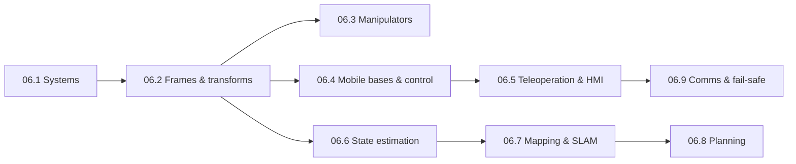

# Stage 6 · Robotics

**Purpose** Engineer the remote systems that put distance between a person and a hazard: the
platform, the arm, the controllers, the human interface, the estimators, maps and planners, and
the communications and failure behaviour that decide whether the robot is trustworthy in the
field. This is the deepest engineering stage of the course (about 60 h), and it maps directly onto
a software/AI/robotics background.

**Prerequisites** [00.2](lessons/stage-00/lesson-02.md) · [01.7 Electricity & EM](lessons/stage-01/lesson-07.md) · [05.6 Sensor fusion](lessons/stage-05/lesson-06.md) (for 06.6 onward) · linear algebra, ODEs, probability.

**Stage gate** [assessments/stage-06.md](assessments/stage-06.md)

Sim B · EOD RobotSim G · Robotics EngineeringP04–P08 · P11CS-1 · CS-6

## Lessons

| Id | Lesson | Core content | Time | Level |
|---|---|---|---|---|
| 06.1 | [EOD robot systems](lessons/stage-06/lesson-01.md) | history (Wheelbarrow → ANDROS → TALON/PackBot → tEODor → MTRS/CRS family), reference architecture, requirements trade-offs and multi-objective sizing, NIST/ASTM E54.09 standard test methods, operator–robot relationships | 6 h | Intermediate |
| 06.2 | [Spatial mathematics](lessons/stage-06/lesson-02.md) | frames, SO(3) (matrices, Rodrigues, quaternions, Euler and gimbal lock), SE(3), twists and exponential coordinates, pinhole camera + extrinsics, pan–tilt pointing | 7 h | Intermediate |
| 06.3 | [Manipulators](lessons/stage-06/lesson-03.md) | DH and PoE forward kinematics, analytic IK (planar 3R, 5-DOF turret arm), Newton–Raphson and DLS IK, Jacobians, singularities, manipulability, $J^\top F$ statics, payload vs reach, grasp closure | 8 h | Intermediate → Advanced |
| 06.4 | [Mobile bases & control](lessons/stage-06/lesson-04.md) | tracks vs wheels vs legs, skid-steer ICR slip model, unicycle odometry, stair stability, DC motors, energy budgets, PID + anti-windup, discrete implementation, state space and LQR | 8 h | Intermediate |
| 06.5 | [Teleoperation & HMI](lessons/stage-06/lesson-05.md) | latency and control, move-and-wait, predictive displays, supervisory control, haptics and bilateral teleoperation, situational awareness, workload | 6 h | Advanced |
| 06.6 | [State estimation](lessons/stage-06/lesson-06.md) | Bayes filter, KF, EKF, UKF (concept), particle filter, localisation, consistency (NEES/NIS) | 8 h | Advanced |
| 06.7 | [Mapping & SLAM](lessons/stage-06/lesson-07.md) | occupancy grids, scan matching, EKF-SLAM, pose-graph SLAM, loop closure, visual/LiDAR SLAM in practice | 7 h | Advanced → Expert |
| 06.8 | [Path & motion planning](lessons/stage-06/lesson-08.md) | Dijkstra/A*, RRT/RRT*, cost maps, coverage planning for survey, arm motion planning | 6 h | Advanced |
| 06.9 | [Communications, reliability & fail-safe design](lessons/stage-06/lesson-09.md) | propagation, link budgets, relays and tethers, loss-of-comms behaviours, FMEA, fault trees, reliability maths | 6 h | Advanced |

Total ≈ 62 h, plus projects [P04](projects/p04-localization/README.md),
[P05](projects/p05-robot-sim/README.md), [P06](projects/p06-path-planning/README.md),
[P07](projects/p07-slam/README.md), [P08](projects/p08-manipulator/README.md) and
[P11](projects/p11-teleoperation/README.md).

## Dependency order inside the stage

## Fast-track advice (for learners with a robotics background)

**Test out, don't skip.** If you already know rigid-body kinematics, manipulator kinematics and
Kalman filtering, you may fast-track **06.2, 06.3 and 06.6**. First attempt their *Assessment*
sections and stage-gate problems 2, 3 and 6 without notes. If you get them right with
justification (the "Proficient" band of the [assessment plan](curriculum/assessment-plan.md)),
skim the worked examples and go straight to the programming exercises. Those feed P05, P08 and P04,
which later lessons and Capstone C1 depend on.

**Do not fast-track 06.1, 06.5 or 06.9.** They carry the EOD-specific engineering constraints:
standoff as the purpose of the system, standard test methods, operator–robot relationships,
latency and workload, and what the robot must do when the link drops. General robotics experience
does not cover these. 06.4 is short for most engineers, but do its stair-stability, energy and
anti-windup sections: they are where field robots actually fail.

**What this stage deliberately leaves out.** Robot *engineering* is taught in full: kinematics,
control, estimation, planning, human–robot interaction, communications and reliability. The stage
does **not** describe how robots or their tools are used to disrupt, disarm, render safe or
otherwise act on explosive devices. It covers no tool techniques, no tool selection for devices
and no procedures. Manipulation is taught only through generic *manipulation tasks on fictional
objects* (reach, grasp, place, inspect), like the NIST dexterity test methods. Those operational
techniques are restricted, taught only inside accredited programmes with live supervision, and
their misuse potential outweighs any educational value here. Nothing in this stage needs them:
the mathematics and engineering are the same whatever the payload.

## Simulators and projects in this stage

**Sim B — EOD Robot** (`sims/eod-robot/`): drive a tracked robot, pan–tilt camera, arm and
gripper; simulated camera with occlusion and noise; battery, latency, packet loss, and a map with a
pose-uncertainty circle. Used in 06.1, 06.2, 06.4–06.6 and 06.9.
<a class="sim-link" href="sims/eod-robot/index.html" target="_blank">Open Sim B ↗</a>

**Sim G — Robotics Engineering** (`sims/robotics-engineering/`): challenge set (obstacle course,
reach, comms/relay placement, energy, manipulation of fictional objects, noisy sensors), with
in-browser JavaScript controllers. Used in 06.3 and 06.6–06.9 (mapping, survey and dynamic
re-planning are offline Python exercises).
<a class="sim-link" href="sims/robotics-engineering/index.html" target="_blank">Open Sim G ↗</a>

## Case studies for this stage

[CS-1 Wheelbarrow](case-studies/cs01-wheelbarrow.md) (after 06.1) ·
[CS-6 Counter-IED robots](case-studies/cs06-counter-ied-robots.md) (after 06.5).

## Stage gate

When you have finished the lessons, attempt [the Stage 6 assessment](assessments/stage-06.md):
8 problems, a Sim G / Sim B performance target, and a robot-specification and failure-mode design
review.
