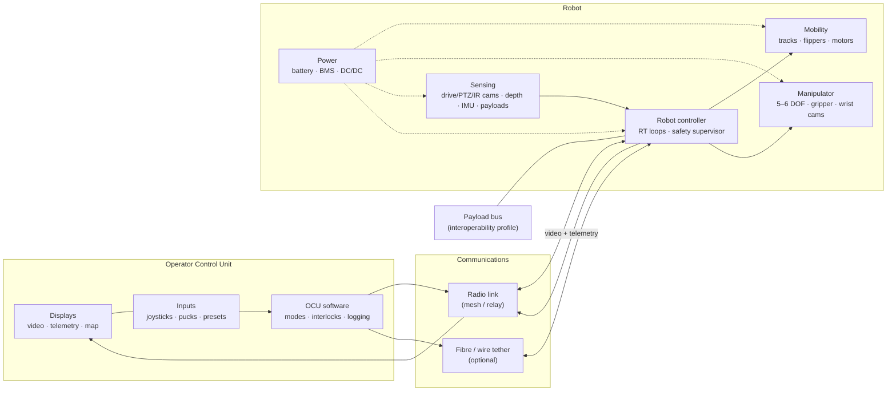

# 06.1 · EOD robot systems: history, architecture, requirements and test methods

<div class="module-card">

**Prerequisites** [00.2 How EOD organisations operate](lessons/stage-00/lesson-02.md) (roles, incident life-cycle) · [01.7 Electricity & EM](lessons/stage-01/lesson-07.md) (power, energy storage, RF) · basic optimisation and probability.

**Estimated time** 6 h (3 h theory · 1 h simulator · 2 h design & programming) · **Level** Intermediate

**Next** [06.2 Spatial mathematics](lessons/stage-06/lesson-02.md), then [06.3 Manipulators](lessons/stage-06/lesson-03.md) and [06.4 Mobile bases & control](lessons/stage-06/lesson-04.md).

<p class="tags"><span>robotics</span><span>systems engineering</span><span>requirements</span><span>test & evaluation</span><span>Sim B</span><span>CS-1 · CS-6</span></p>
</div>

## Why this matters

The single most important protective principle in EOD is **time–distance–shielding**: minimise
the time a person spends near a hazard, maximise the distance, put something in between. A remote
system is the purest expression of that principle. Every approach a robot makes is an approach a
technician does not make. The early British line was that the robot is the consumable: more than
400 Wheelbarrows were destroyed in service, and each one stood in for a person.

A robot only buys that protection if it can actually do the job. It has to get to the item up
stairs, through a doorway or across a ditch. It has to see well enough for the operator to
understand the scene, reach and lift what the task needs, keep the radio link, and last the whole
incident on one battery. Those requirements pull against each other. Reach and lift push mass up,
mass limits portability and endurance, and portability decides whether the robot arrives at all.
This lesson treats the EOD robot the way you would treat any safety-critical product. It covers
where the designs came from, the architecture they share, how the requirements trade against each
other, and how you prove performance with **standard test methods** instead of vendor brochures.

## Learning objectives

1. Trace the development of EOD robots from Wheelbarrow (1972) to the US Army's common robotic
   systems family. For each generation, name the engineering problem that changed.
2. Draw and explain the reference architecture (mobility, manipulation, sensing, communications,
   operator control unit, power) and the interfaces between its parts.
3. Break a mission need down into quantitative, testable requirements and show where they
   conflict: mass/portability, reach/lift, stair-climbing and endurance.
4. Set up and solve a small multi-objective sizing problem, find its Pareto front and explain the
   "mass spiral".
5. Explain why reproducible **standard test methods** (NIST / ASTM E54.09) matter. Compute how many
   trials support a claimed reliability at a stated confidence.
6. Discuss the human side of the system, meaning operator–robot relationships (Carpenter 2016), and
   what it implies for design and doctrine.

## Theory

### 1. A short engineering history

| Era | System (origin) | What changed, as an engineering problem |
|---|---|---|
| 1972 | **Wheelbarrow** (UK, Lt-Col Peter Miller, Northern Ireland) | Proof that remote means work at all. It began as a modified electric garden barrow towing a device away. Tracked chassis, cable/radio control, CCTV and tools followed through many marks. In service until 2019, when the L3Harris T7 replaced it. |
| 1980s–2000s | **ANDROS** family (Remotec, later Northrop Grumman) | The heavy multi-role police/military platform: F6A class about 220 kg (485 lb), articulated tracks for stairs, and an arm lift of roughly 11 kg (25 lb) at extension. |
| 2000– | **TALON** (Foster-Miller / QinetiQ NA) | First deployed in Bosnia in 2000 and at Ground Zero in 2001. The manufacturer reports about 20,000 EOD missions in Iraq and Afghanistan. It showed that a medium robot could be rugged and fast enough for high-tempo route-clearance support. |
| 2000s | **PackBot** (iRobot; Yamauchi 2004) | Man-portable. Its **flippers** let a small chassis climb stairs and self-right. A modular payload bus let one base carry many sensor and manipulator payloads. |
| 2000s– | **tEODor** (Telerob, later Cobham) | The heavy European class: about 375 kg, a 6-axis arm on a turret, about 100 kg lift, 2.86 m reach, used by 40+ nations. It sits at the far end of the payload/reach trade. |
| 2017– | **US Army MTRS Inc II, CRS-I, CRS-H** | A *family* instead of a single robot. Medium (MTRS Inc II), individual (CRS-I, about 14.5 kg / 32 lb, fits in an assault pack) and heavy (CRS-H) platforms share a **common interoperability profile**: plug-and-play payloads, a 5-DOF arm class and a common handheld operator control unit. |

The trend matters more than any single model. Early systems were bespoke *vehicles with tools*.
Modern programmes buy an **architecture**: standard interfaces (the Army's UGV Interoperability
Profile, IOP), a common controller and swappable payloads. The software analogy is exact. It is the
move from monoliths to services behind stable APIs, and it happened for the same reasons: vendor
lock-in, upgrade cost and the need to add sensors faster than platforms can be replaced.

The 2016 Dallas incident (an ANDROS-class police robot used to deliver lethal force against an
armed attacker) is a reminder that an architecture built for standoff can be re-tasked. That raises
questions about policy and ethics that engineering alone cannot answer. We come back to them in
07.x and 09.6.

<div class="callout key">

**Key idea.** The robot is a *standoff-generating system*. Its value is the exposure it removes
from a person, weighted by the probability that it can actually complete the task. A robot that
cannot climb the stairs removes no exposure. It only delays a manual approach.

</div>

### 2. Reference architecture

Every fielded EOD robot, from 14 kg to 375 kg, breaks down into the same six subsystems:

| Subsystem | Function | Key quantities | Typical failure modes |
|---|---|---|---|
| **Mobility** | move the platform over terrain, stairs and obstacles | mass, track/wheel geometry, tractive effort, max slope, step height, speed | loss of traction, track throw, tip-over, high-centring |
| **Manipulation** | position tools and sensors, grasp and move fictional objects in manipulation tasks | DOF, reach, lift at reach, precision, wrist dexterity | joint overload, singularity, occlusion of the gripper by the arm |
| **Sensing** | give the operator (and autonomy) situational awareness | camera count/FOV/resolution, zoom, IR, depth, audio, special payloads (05.x) | glare, darkness, low contrast, lens contamination |
| **Communications** | carry commands down and video and telemetry up | bandwidth, latency, range, link margin, tether option | multipath fade, loss of link in buildings (06.9) |
| **OCU** (operator control unit) | the human interface: video, telemetry, input devices | display latency, input mapping, workload | mode confusion, poor frame of reference (06.5) |
| **Power** | energy for everything above | pack energy (Wh), peak current, temperature range | cold-weather capacity loss, brown-out under arm load |

Five cross-cutting concerns tie these together: **thermal** (electronics in hot sun), **ingress
protection** (rain, dust), **EMC** (radios next to motors), **safety interlocks** (tool and payload
enables, see 01.7 on electromagnetic hazards) and **software** (the control stack and its failure
behaviour).

### 3. Requirements decomposition

A mission need such as "inspect a suspect item in a multi-storey building without exposing a
technician" must be turned into *verifiable* requirements. A useful chain is:

mission need → operational scenarios → capability requirements → subsystem requirements → test methods.

| Capability requirement | Driven by | Pushes mass… | Conflicts with |
|---|---|---|---|
| Carried by one person over 1 km | dismounted teams, no vehicle access | **down** (≤ about 25 kg) | reach, lift, endurance, stair performance |
| Climb standard stairs (about 33°) | buildings, transport | up (longer tracks, flippers, low CoM) | portability, turning in tight corridors |
| Reach 1.5 m and lift 2 kg at full reach | inspecting behind or under things | **up** (arm structure, shoulder torque ∝ reach²) | portability, tip-over margin |
| 2 h mission endurance | long incidents, cold weather | up (battery) | portability (and every extra kg costs more power) |
| Link at 300 m non-line-of-sight | standoff distance | up (radio, antenna mast, relays) | size, stealth, cost |
| Operator trained in < 1 week | reservists, police | none directly | feature creep in the OCU |

Two of these couplings are nonlinear and worth making explicit.

**(a) Lift at reach scales badly.** Holding payload $m_p$ at horizontal reach $\ell$ with a uniform
arm link of linear density $\lambda$ gives a shoulder torque of

$$ \tau_s = g\,\ell\left(m_p + \tfrac12\lambda\ell\right)\cdot SF . $$

| Symbol | Meaning | SI unit |
|---|---|---|
| $\tau_s$ | required shoulder holding torque | N m |
| $g$ | gravitational acceleration | m s⁻² (9.81) |
| $\ell$ | horizontal reach | m |
| $m_p$ | payload mass at the gripper | kg |
| $\lambda$ | arm linear mass density | kg m⁻¹ |
| $SF$ | safety factor for dynamic loads and wear | — |

*Intuition.* Torque grows linearly with reach for the payload term and *quadratically* for the
arm's own weight. Doubling reach much more than doubles the actuator you need, and a bigger actuator
is heavier, which adds more torque. *Example:* $m_p=2$ kg, $\ell=1.2$ m, $\lambda=2.5$ kg/m,
$SF=1.5$ gives $\tau_s = 1.5\cdot9.81\cdot1.2\cdot(2+1.5) = 61.8$ N m. At $\ell=2.0$ m it is
$132$ N m: 67 % more reach costs 114 % more torque.

**(b) Endurance has a closure.** Average power rises with total mass, and the battery is part of the
mass. With average power $P = P_0 + c\,m$, battery specific energy $e_b$ and required endurance
$T$:

$$ m_b = \frac{T\,(P_0 + c\,m_{\text{dry}})}{e_b - c\,T},\qquad T < T_{\max} = \frac{e_b}{c}. $$

| Symbol | Meaning | SI unit (course unit) |
|---|---|---|
| $m_b$ | battery mass | kg |
| $m_{\text{dry}}$ | everything except the battery | kg |
| $P_0$ | mass-independent power (radio, computers, cameras) | W |
| $c$ | locomotion power per unit mass (terrain-dependent) | W kg⁻¹ |
| $e_b$ | pack-level specific energy | Wh kg⁻¹ |
| $T$ | endurance | h |

*Intuition.* This is the ground-robot version of the aircraft range equation. As $T \to e_b/c$
the battery has to power its own carriage and the mass diverges. That is the **mass spiral**. With
$e_b = 120$ Wh/kg and $c = 3$ W/kg, no robot can exceed 40 h on that terrain *however large the
battery*. *Example:* $m_{\text{dry}}=21.51$ kg, $P_0=40$ W, $T=2$ h gives
$m_b = 2(40+64.5)/(120-6) = 1.83$ kg. For $T=20$ h the answer is 34.8 kg of battery, which is
absurd for this class.

```python
import numpy as np
G = 9.81

def shoulder_torque(reach, m_payload, lam=2.5, sf=1.5):
    """Static holding torque [N m] at the shoulder for a horizontal arm."""
    return sf * G * reach * (m_payload + 0.5 * lam * reach)

def battery_mass(m_dry, T_h, P0=40.0, c=3.0, e_b=120.0):
    """Battery mass [kg] closing the power-mass loop; inf if infeasible."""
    denom = e_b - c * T_h
    return np.inf if denom <= 0 else T_h * (P0 + c * m_dry) / denom

print(shoulder_torque(1.2, 2.0), battery_mass(21.51, 2.0))   # 61.8, 1.83
```

<details class="answer"><summary>Exercise 1 — then reveal</summary>

Using the model above, what is the *marginal* battery mass per extra kilogram of dry mass at
$T=2$ h? At $T=10$ h? What does this say about adding a 1 kg sensor payload to a long-endurance
robot?

*Answer.* $\partial m_b/\partial m_{\text{dry}} = cT/(e_b - cT)$. At 2 h: $6/114 = 0.053$ kg/kg.
At 10 h: $30/90 = 0.333$ kg/kg. On a long-endurance platform each kilogram of payload costs a third
of a kilogram of battery on top, and that battery adds its own locomotion power (already included
in the closure). Payload discipline matters most on endurance-driven designs.

</details>

### 4. A multi-objective sizing problem

We now combine the two couplings into a toy but structurally honest sizing model for a
man-portable robot. The numbers are fictional and chosen to be plausible.

| Component | Model |
|---|---|
| chassis + tracks | $5 + 12L$ kg, with track length $L$ [m] |
| arm link | $2.5\,\ell$ kg |
| shoulder actuator | $0.04\,\tau_s$ kg per N m (a geared actuator), $\tau_s$ from §3(a) with $m_p=2$ kg, $SF=1.5$ |
| electronics, radio, cameras | 3 kg |
| battery | closure §3(b), $P_0=40$ W, $c=3$ W/kg, $e_b=120$ Wh/kg |

The **stair constraint** is geometric. A standard stair with 0.28 m tread and 0.18 m riser has a
pitch of $\arctan(0.18/0.28) = 32.7°$ and a nosing-to-nosing distance of
$\sqrt{0.28^2+0.18^2}=0.333$ m. A track should always rest on at least two nosings, otherwise it
pitches into each step, so $L \ge 2\times0.333 = 0.666$ m. (The *stability* side of stair
climbing belongs to 06.4.)

With $L = 0.67$ m and $T = 2$ h:

| Reach $\ell$ [m] | $\tau_s$ [N m] | actuator [kg] | dry mass [kg] | battery [kg] | **total [kg]** |
|---|---|---|---|---|---|
| 0.8 | 35.3 | 1.41 | 19.45 | 1.73 | **21.2** |
| 1.0 | 47.8 | 1.91 | 20.45 | 1.78 | **22.2** |
| 1.2 | 61.8 | 2.47 | 21.51 | 1.83 | **23.4** |
| 1.5 | 85.5 | 3.42 | 23.21 | 1.92 | **25.1** |
| 1.8 | 112.6 | 4.50 | 25.04 | 2.02 | **27.1** |
| 2.0 | 132.4 | 5.30 | 26.34 | 2.09 | **28.4** |

Under a 25 kg portability cap, the maximum reach is **1.48 m**. Raising endurance to 3 h at
$\ell = 1.2$ m costs about 1 kg (23.4 → 24.3 kg). Raising payload-at-reach from 2 to 5 kg costs
about 2.2 kg (to 25.6 kg).

This is a **multi-objective** problem: minimise mass, maximise reach, maximise endurance. A design
$x$ **dominates** $y$ if it is no worse in every objective and strictly better in at least one. The
non-dominated set is the **Pareto front**. There are three standard ways to explore it:

- **Weighted sum** $\min_x \sum_i w_i f_i(x)$. Simple, but it cannot find points on non-convex
  parts of the front.
- **ε-constraint** $\min_x f_1(x)$ s.t. $f_i(x) \le \epsilon_i$. This is how procurement actually
  writes requirements ("≤ 25 kg, ≥ 2 h"), and it can reach non-convex regions.
- **Evolutionary** (NSGA-II and similar) for many objectives or discrete choices.

```python
import numpy as np
from itertools import product

def total_mass(reach, L=0.67, m_p=2.0, T=2.0):
    m_link = 2.5 * reach
    tau = 1.5 * 9.81 * reach * (m_p + 0.5 * m_link)
    m_dry = (5 + 12 * L) + m_link + 0.04 * tau + 3.0
    return m_dry + battery_mass(m_dry, T)

designs = [(total_mass(r, L, T=T), r, T, L)
           for L, r, T in product(np.linspace(0.5, 1.0, 11), np.linspace(0.6, 2.0, 15), [1, 2, 3, 4])
           if L >= 0.666]                      # stair constraint
D = np.array(designs)

def non_dominated(D):
    keep = []
    for i, (m, r, T, _) in enumerate(D):
        better_eq = (D[:, 0] <= m) & (D[:, 1] >= r) & (D[:, 2] >= T)
        strictly = (D[:, 0] < m) | (D[:, 1] > r) | (D[:, 2] > T)
        if not np.any(better_eq & strictly):
            keep.append(i)
    return D[keep]

front = non_dominated(D)
print(len(D), len(front), np.unique(front[:, 3]))   # 420 60 [0.7]
```

The front uses only the shortest feasible track ($L=0.7$ m on this grid). Nothing in the model
rewards a longer track, so the optimiser pushes it straight onto the constraint. That is a general
lesson: *an optimiser always sits on the constraint that your model forgot to trade against.* Add
a stair-stability benefit for longer tracks (06.4) and the answer moves.

<details class="answer"><summary>Exercise 2 — then reveal</summary>

A customer asks for "1.5 m reach, 2 kg at reach, 2 h, under 25 kg". Is it feasible in this
model? Which single requirement would you negotiate, and by how much, to create a 1 kg margin?

*Answer.* At $\ell=1.5$ m the total is 25.13 kg, so it is **infeasible** by 0.13 kg. For a 1 kg
margin you need total ≤ 24 kg. Options: reduce reach to about 1.3 m (roughly 23.9 kg); or keep
reach and drop endurance, but at 1 h the battery falls only to about 0.93 kg (24.1 kg), which is
not enough alone; or reduce payload-at-reach. Reach is the lever with the steepest mass gradient,
so it is usually the right one to negotiate. The better engineering answer is often a *different
architecture*, such as a telescoping arm or a counterbalanced shoulder, because both change the
$\tau_s \propto \ell^2$ scaling.

</details>

### 5. Standard test methods: NIST / ASTM E54.09

Vendor specifications are not comparable: "climbs stairs" says nothing about the stair geometry,
the surface, the payload, how many attempts or who drove. From the mid-2000s NIST's Intelligent
Systems Division (Adam Jacoff's group) developed, with responders and with **JIEDDO funding**
(the US Joint IED Defeat Organization), a suite of **Standard Test Methods for Response Robots**,
standardised through **ASTM subcommittee E54.09**. Each test method specifies:

- an **apparatus** that can be built cheaply and reproduced anywhere (standard stairs, inclined
  planes, symmetric-step terrain, "pipe-step" obstacles, dexterity boards with graded targets);
- a **procedure** (start and end conditions, what counts as a success, timing);
- a **metric** (e.g. successful repetitions, completion time, precision);
- a **statistical basis**: enough repetitions to support a claim of reliability at a stated
  confidence.

Test families cover mobility (terrains, stairs, gaps, towing), manipulator dexterity and
strength (rotate, grasp and place, extract, touch and insert, and underbody inspection with mirrors
and cameras, all on standard fixtures), sensors (visual acuity charts, lighting, thermal
targets), energy and endurance, radio communications (line-of-sight and non-line-of-sight range)
and **operator proficiency**. NIST also published guidance on using them for **counter-IED
training** (2015). The same apparatus that qualifies the robot then trains and certifies the
operator.

Why this matters, in software terms: standard test methods are **benchmarks with a fixed harness**.
They make results comparable across vendors, which supports procurement. They make them
*regression-testable* across software and hardware versions. And they separate robot capability
from operator skill, which is otherwise the confound in every field report.

**How many trials?** Suppose a robot succeeds on all $n$ independent trials. To claim success
probability at least $R$ with confidence $C$, you need $R^n \le 1-C$:

$$ n \;\ge\; \frac{\ln(1-C)}{\ln R}. $$

| Symbol | Meaning | Unit |
|---|---|---|
| $n$ | number of consecutive successful trials | — |
| $R$ | reliability (per-trial success probability) you want to demonstrate | — |
| $C$ | confidence level | — |

*Intuition.* If the true reliability were only $R$, getting $n$ straight successes would be
unlikely ($R^n$). Once that probability falls below $1-C$, you reject "worse than $R$".
*Example:* $R=0.8, C=0.8$ gives $n \ge \ln0.2/\ln0.8 = 7.2$, so **8** trials. $R=0.9, C=0.9$ gives
21.9, so **22** trials. $R=0.95, C=0.9$ gives **45** trials. With failures allowed you use the
exact binomial (Clopper–Pearson) bound: 9 successes out of 10 give a one-sided 90 % lower bound of
0.663. Ten out of ten give 0.794.

```python
import numpy as np
from scipy.stats import beta

def trials_needed(R, C):
    return int(np.ceil(np.log(1 - C) / np.log(R)))

def reliability_lower_bound(k, n, C=0.9):
    """One-sided Clopper–Pearson lower bound on success probability."""
    return 0.0 if k == 0 else beta.ppf(1 - C, k, n - k + 1)

print(trials_needed(0.8, 0.8), trials_needed(0.9, 0.9))          # 8 22
print(reliability_lower_bound(9, 10), reliability_lower_bound(10, 10))  # 0.663 0.794
```

<details class="answer"><summary>Exercise 3 — then reveal</summary>

Vendor A reports "28/30 stair ascents"; vendor B reports "10/10". Which has demonstrated the higher
reliability at 90 % one-sided confidence? What is wrong with comparing them at all if the stairs
differed?

*Answer.* A: lower bound 0.832. B: 0.794. **A** has demonstrated more, despite the two failures,
because 30 trials carry more information. If the apparatus differed (angle, nosing, surface), the
numbers measure different things. That is exactly the gap standard test methods close.

</details>

### 6. The human in the system

A robot is teleoperated by a person under stress, often in a two-person team (operator and
assistant). Julie Carpenter's interview study of EOD technicians (*Culture and Human–Robot
Interaction in Militarized Spaces*, 2016) documents the relationship that forms. Technicians name
their robots, talk about them in social terms, feel real emotion when a robot is destroyed, and
experience the robot as an *extension of themselves*. At the same time they insist that it is a
tool. Carpenter's point is not sentimentality. The operator–robot relationship affects **trust
calibration** (over-trust leads to risky tasking, under-trust leads to manual approaches that
should have been robotic), **workload**, and how units handle robot loss.

Engineering implications: design for predictable, legible behaviour (no surprising autonomy); make
robot state (battery, link, joint limits) visible without reading numbers; treat loss of the robot
as an expected, *acceptable* outcome in doctrine and interface design ("the robot is the
consumable"); and evaluate operator performance, not just robot capability. Teleoperation human
factors are formalised in [06.5](lessons/stage-06/lesson-05.md).

## Visual explanation



Read the diagram as a **control loop through a human**: sensing → comms → display → person →
input → comms → actuators. Every arrow carries latency and a failure mode. The safety supervisor in
the robot controller is what handles loss of the loop: stop, hold posture, or retro-traverse
(06.9).

<iframe class="sim-frame" src="sims/eod-robot/index.html?embed=1" height="720" loading="lazy"></iframe>

<a class="sim-link" href="sims/eod-robot/index.html" target="_blank">Open Sim B full-screen ↗</a>

## Worked example — specifying a robot for a fictional police bomb squad

*Scenario (fictional).* A city squad covers transit stations, office blocks and residential
streets. Most calls are suspect packages on upper floors or in stairwells. There is no vehicle
access inside buildings. The team has two technicians.

1. **Scenarios → capabilities.** Stairwells mean a ≥ 33° climb with a turn on landings. One-person
   carry up stairs means ≤ about 25 kg. Inspecting packages under benches and seats needs about 1.2 m
   reach with a wrist camera and 2 kg lift at reach for moving fictional test objects. Incidents
   last up to 3 h. Building interiors defeat radio, so non-line-of-sight comms are needed.
2. **Size the platform** with the §4 model: $\ell = 1.2$ m and $T = 3$ h give 24.3 kg, so it
   fits with 0.7 kg margin. The landing turn needs a turning footprint below the landing width, so
   the track length stays near the stair minimum (0.67–0.7 m).
3. **Comms.** Specify a deployable relay or a tether option instead of raising radio power (link
   budgets in 06.9). Add a requirement: *on loss of link > 2 s, stop and hold posture*.
4. **Verification plan.** Map each requirement to a test method: stairs (standard 35° apparatus,
   ascent and descent, 22 trials for R ≥ 0.9 at C = 0.9); dexterity (grasp/place and underbody
   inspection boards); NLOS radio range; endurance on a standard terrain loop; operator
   proficiency tests for both technicians.
5. **Residual risk.** Reach 1.2 m will not cover every case. Record it and plan the fallback (a
   second, heavier regional asset). This is the requirement you *did not* meet, written down
   explicitly.

## Simulation work

<div class="callout sim">

**Sim B, orientation mission.** (1) Drive to the target area using only the drive camera, then
repeat using the map view. Log time and collisions. (2) Parked, move the arm continuously (I/K, J/L)
to its full reach and back for one minute, and compare the battery drain rate with one minute of
driving (in this model the arm draws power only while its joints move). Which subsystem dominates
energy in your mission? (3) Induce a comms loss by driving behind buildings until the link margin
goes negative, and note the robot's default loss-of-comms behaviour (the selector's default). Is it the behaviour you would
specify? Write one requirement sentence for it.

</div>

## Practical exercises

<details class="answer"><summary>Exercise 4 — requirements conflict matrix — then reveal</summary>

Build a 6×6 matrix of the capability requirements in §3 and mark each pair as supporting (+),
conflicting (−) or independent (0). Which requirement conflicts with the most others, and what
does that suggest about where to spend engineering effort?

*Answer (typical).* Portability (≤ 25 kg) conflicts with reach/lift, endurance, stairs (longer
tracks, flippers) and NLOS comms (mast, relays). It is the hub. Effort goes into *mass-efficient
technology*: specific energy, actuator torque density and composite structures. Each of these
relaxes several conflicts at once. That is why battery chemistry and actuator improvements have
changed EOD robots more than any single mechanism.

</details>

<details class="answer"><summary>Exercise 5 — reading a spec sheet — then reveal</summary>

A heavy robot is listed as "100 kg lift" and "2.86 m reach". Estimate the shoulder holding torque if
both applied at once, with a 40 kg arm (uniform) and SF = 1. Is it plausible that both apply
simultaneously?

*Answer.* $\tau = 9.81\cdot2.86\cdot(100 + 20) \approx 3367$ N m. That is possible but very large.
Spec sheets usually quote lift **close in** and reach **unloaded**. Always ask for the lift-vs-reach
curve (06.3 derives it) and the test method behind it.

</details>

<details class="answer"><summary>Exercise 6 — test-plan budgeting — then reveal</summary>

You have two days of range time, and each stair trial takes 6 minutes including reset. You need
to demonstrate R ≥ 0.9 at C = 0.9 on ascent and descent, for two operators. Is it feasible?

*Answer.* 22 trials × 2 directions × 2 operators = 88 trials × 6 min = 8.8 h. That fits in two days
only if nothing fails. One failure raises the zero-failure requirement: with one failure you need
$n$ such that the Clopper–Pearson bound ≥ 0.9, which is about $n=38$. Plan for failures, or relax
to per-direction pooling across operators if proficiency tests have already shown the operators
are equivalent.

</details>

## Programming exercise — a robot sizing tool

**Goal.** Build `size_robot()`, a small design-space explorer that returns the Pareto front and
flags which constraint is active for each Pareto design.

- **Input:** requirement dict (`reach`, `payload_at_reach`, `endurance_h`, `max_mass`,
  `stair_riser`, `stair_tread`), and coefficient dict (the §4 model).
- **Output:** list of feasible designs `(L, reach, T, mass, battery_mass, active_constraints)` and
  the non-dominated subset.
- **Constraints:** NumPy/SciPy only; vectorised evaluation of ≥ 10⁵ designs in < 1 s.
- **Expected behaviour:** reproduces the §4 table to 0.01 kg; returns `inf` battery (infeasible)
  when $T \ge e_b/c$.
- **Test cases:** (i) `reach=1.2, T=2` gives 23.35 kg; (ii) max reach at 25 kg is 1.478 m (use
  `brentq`); (iii) `T=40` is infeasible for $e_b=120$, $c=3$.
- **Extensions:** add a tip-over constraint (06.4) that rewards longer tracks; add discrete
  catalogue choices (three battery packs, four actuators) and solve with NSGA-II; plot the 3D
  front.

This model feeds the platform parameters of [Project P05](projects/p05-robot-sim/README.md).

## Reading

- Yamauchi, B. M., *PackBot: a versatile platform for military robotics*, Proc. SPIE 5422 (2004),
  https://doi.org/10.1117/12.538328. Read it as a design paper: the requirements, the flipper
  rationale and the payload bus.
- NIST Intelligent Systems Division / ASTM E54.09, *Standard Test Methods for Response Robots*,
  https://www.nist.gov/el/intelligent-systems-division-73500/standard-test-methods-response-robots.
  Browse the test-method list, then the 2021 *Ground Test Methods – Introduction* deck
  (https://www.nist.gov/document/astm-e5409-ground-test-methods-introduction-2021a).
- NIST, *C-IED Training Using Standard Test Methods for Response Robots* (2015),
  https://www.nist.gov/document/c-ied-training-using-standard-test-methods-response-robots-v2015pdf.
  The most EOD-specific use of the methods.
- National Defense Magazine, *Army Developing Family of Explosive Ordnance Disposal Robots*
  (2018), https://www.nationaldefensemagazine.org/articles/2018/5/25/army-developing-family-of-explosive-ordnance-disposal-robots.
  MTRS Inc II / CRS-I / CRS-H as one family.
- Carpenter, J., *Culture and Human–Robot Interaction in Militarized Spaces: A War Story*,
  Routledge (2016),
  https://www.routledge.com/Culture-and-Human-Robot-Interaction-in-Militarized-Spaces-A-War-Story/Carpenter/p/book/9781032928456.
  Read the chapters on attachment and robot loss.
- Wheelbarrow (robot), https://en.wikipedia.org/wiki/Wheelbarrow_(robot), and the QUB history paper
  *Making safe* (https://pure.qub.ac.uk/files/194511128/Safe.pdf) for the origin story. See also
  [CS-1](case-studies/cs01-wheelbarrow.md) and [CS-6](case-studies/cs06-counter-ied-robots.md).

## Assessment

1. *(Conceptual)* Why did the US Army buy a *family* with a common interoperability profile rather
   than the best robot in each weight class? Give two lifecycle arguments.
2. *(Mathematical)* Show that with $P=P_0+c\,m$ the endurance of a robot with fixed dry mass is
   concave in battery mass, and find $\lim_{m_b\to\infty} T$.
3. *(Interpretation)* Two robots both "climb stairs". Robot X was tested 25 times on a 35° standard
   apparatus with 24 successes. Robot Y's brochure shows a video. What can you conclude about each?
4. *(Design)* Write three verifiable requirements (with a test method for each) for loss-of-comms
   behaviour.
5. *(Computation)* How many zero-failure trials demonstrate R ≥ 0.95 at C = 0.95?

<details class="answer"><summary>Answers to 2 and 5</summary>

2. $T(m_b) = e_b m_b/(P_0 + c(m_{\text{dry}}+m_b))$. $T'' = -2 e_b c (P_0+c\,m_{\text{dry}})/(P_0+c\,m)^3 < 0$,
   so it is concave, and $T \to e_b/c$ as $m_b\to\infty$ (40 h for the lesson numbers). Returns
   diminish steadily.
5. $\ln 0.05/\ln 0.95 = 58.4$, so **59** trials.

</details>

## Expert extension

- **Design structure matrices (DSM)** for the six subsystems: cluster the interfaces and compare
  with the IOP partition. Where does the standard cut the coupling, and where does it leave coupling
  in place?
- **Reliability growth** (Crow–AMSAA / Duane models) for a fleet: use failure logs across software
  versions to predict mean time between failures.
- **Bayesian test planning**: with a Beta prior from earlier test campaigns, how many new trials
  are needed? Relate this to the zero-failure formula (it is the uniform-prior limit).

## What comes next

[06.2](lessons/stage-06/lesson-02.md) builds the spatial mathematics that every subsystem above
depends on: frames, rotations and transforms. [06.3](lessons/stage-06/lesson-03.md) turns the
manipulator box into kinematics and Jacobians, and [06.4](lessons/stage-06/lesson-04.md) turns the
mobility and power boxes into models and controllers.
