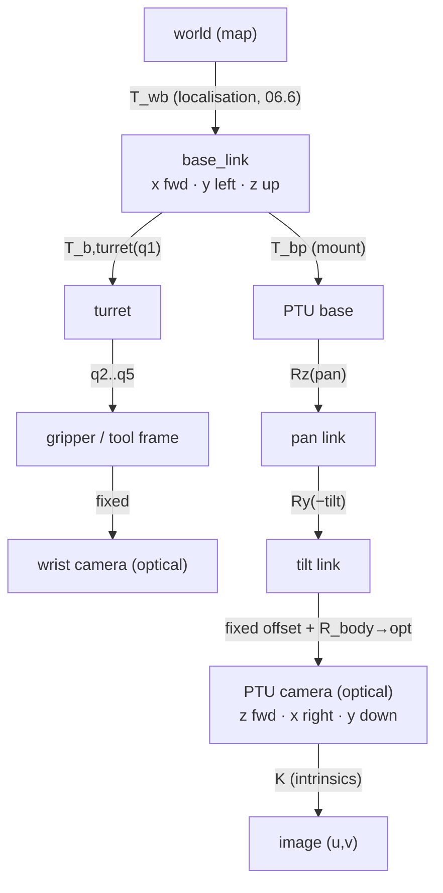

# 06.2 · Spatial mathematics: frames, rotations, transforms and cameras

<div class="module-card">

**Prerequisites** [06.1 EOD robot systems](lessons/stage-06/lesson-01.md) · linear algebra (orthogonal matrices, eigenvectors, matrix exponential) · basic ODEs.

**Estimated time** 7 h (4 h theory · 1 h simulator · 2 h programming) · **Level** Intermediate (fast-track available, see [Stage 6 overview](lessons/stage-06/README.md))

**Next** [06.3 Manipulators](lessons/stage-06/lesson-03.md), [06.4 Mobile bases & control](lessons/stage-06/lesson-04.md), [06.6 State estimation](lessons/stage-06/lesson-06.md).

<p class="tags"><span>linear algebra</span><span>Lie groups</span><span>SO(3) · SE(3)</span><span>camera models</span><span>Sim B</span><span>P05 · P08</span></p>
</div>

## Why this matters

An EOD robot is a tree of coordinate frames: world → robot base → turret → shoulder → … →
gripper, and base → mast → pan → tilt → camera. Every useful question is a transform question.
Where is the object the operator clicked in the video, in the arm's frame? Where must the
pan–tilt unit point to keep a marked item centred while the robot drives? Which way does "left" on
the joystick move the gripper when the wrist camera is upside down? Frame errors produce the most
dangerous class of robot bug: the software runs, the numbers look plausible, and the arm moves
somewhere else. This lesson builds the mathematics precisely enough that you can write those
transforms once, test them properly, and trust them.

Conventions used throughout Stage 6: right-handed frames. Robot body frame: $x$ forward, $y$ left,
$z$ up (REP-103 style). Camera *optical* frame: $z$ forward along the optical axis, $x$ right,
$y$ down. $T_{ab}$ is the pose of frame $b$ *expressed in* frame $a$, so it maps coordinates in
$b$ to coordinates in $a$: $p_a = T_{ab}\,p_b$.

## Learning objectives

1. Represent orientation as rotation matrices, axis–angle, unit quaternions and Euler angles.
   Convert between them and explain the singularities of each.
2. Derive Rodrigues' formula from the exponential map of $\mathfrak{so}(3)$, and invert it (the
   log map).
3. Compose and invert homogeneous transforms in SE(3) and use them to move points and frames
   through a kinematic tree without sign errors.
4. Use twists and exponential coordinates (Lynch & Park) to describe screw motions. Compute
   $e^{[\mathcal{S}]\theta}$ in closed form.
5. Project world points into an image with the pinhole model plus extrinsics, and back-project
   pixels into rays.
6. Solve pan–tilt inverse kinematics: compute the pan and tilt angles that put a world point on
   the optical axis, and estimate the pointing error caused by pose uncertainty.

## Theory

### 1. Rotation matrices and SO(3)

A rotation is a linear map that preserves lengths, angles and handedness:

$$ SO(3) = \{ R \in \mathbb{R}^{3\times3} : R^\top R = I,\ \det R = +1 \}. $$

| Symbol | Meaning | Unit |
|---|---|---|
| $R_{ab}$ | orientation of frame $b$ in frame $a$; its columns are $b$'s unit axes written in $a$ | — |
| $R^\top$ | inverse rotation ($R^{-1} = R^\top$) | — |
| $\det R$ | $+1$ for proper rotations ($-1$ would be a reflection) | — |

*Intuition.* Read a rotation matrix by columns: column $i$ is where the $i$-th axis of the rotated
frame points. The set is a 3-dimensional smooth manifold (a Lie group), even though the matrix
has 9 numbers. Six orthonormality constraints remove the rest. Composition is matrix product
($R_{ac} = R_{ab}R_{bc}$, with subscripts cancelling "inner to inner"), and it is **not**
commutative.

Elementary rotations about the coordinate axes:

$$
R_z(\theta)=\begin{bmatrix}c&-s&0\\ s&c&0\\ 0&0&1\end{bmatrix},\quad
R_y(\theta)=\begin{bmatrix}c&0&s\\ 0&1&0\\ -s&0&c\end{bmatrix},\quad
R_x(\theta)=\begin{bmatrix}1&0&0\\ 0&c&-s\\ 0&s&c\end{bmatrix}.
$$

*Example.* $R_z(30°)$ maps $(2,1,0)$ to $(2\cos30°-\sin30°,\ 2\sin30°+\cos30°,\ 0) =
(1.232, 1.866, 0)$.

```python
import numpy as np

def Rz(t): c, s = np.cos(t), np.sin(t); return np.array([[c, -s, 0], [s, c, 0], [0, 0, 1]])
def Ry(t): c, s = np.cos(t), np.sin(t); return np.array([[c, 0, s], [0, 1, 0], [-s, 0, c]])
def Rx(t): c, s = np.cos(t), np.sin(t); return np.array([[1, 0, 0], [0, c, -s], [0, s, c]])

def is_rotation(R, tol=1e-9):
    return np.allclose(R.T @ R, np.eye(3), atol=tol) and np.isclose(np.linalg.det(R), 1.0, atol=tol)

print(Rz(np.radians(30)) @ [2, 1, 0])        # [1.232 1.866 0.   ]
```

<details class="answer"><summary>Exercise 1 — then reveal</summary>

Show that $R_z(90°)R_x(90°) \ne R_x(90°)R_z(90°)$ by applying both to the vector $(1,0,0)$.
Describe the result physically.

*Answer.* $R_x(90°)$ leaves $\hat x$ fixed, and $R_z(90°)$ then sends it to $\hat y$, so the first
product gives $(0,1,0)$. In the other order, $R_z(90°)$ sends $\hat x \to \hat y$ and $R_x(90°)$
sends $\hat y \to \hat z$, giving $(0,0,1)$. Rotations about different axes do not commute. This
is why "yaw then pitch" and "pitch then yaw" on a pan–tilt head point the camera in different
directions.

</details>

### 2. Axis–angle, the exponential map and Rodrigues' formula

Any rotation is a rotation by angle $\theta$ about a unit axis $\hat\omega$ (Euler's theorem: $R$
has eigenvalue 1, and the eigenvector is the axis). Define the skew-symmetric "hat" operator
$[\hat\omega]$ with $[\hat\omega]v = \hat\omega\times v$. A point rotating at unit angular velocity
about $\hat\omega$ obeys $\dot p = [\hat\omega]p$, so after time $\theta$, $p(\theta) =
e^{[\hat\omega]\theta}p(0)$. Because $[\hat\omega]^3 = -[\hat\omega]$, the exponential series
collapses to:

<div class="callout eq">

$$ R = e^{[\hat\omega]\theta} = I + \sin\theta\,[\hat\omega] + (1-\cos\theta)\,[\hat\omega]^2
\qquad\text{(Rodrigues)} $$

$$ \theta = \arccos\!\frac{\operatorname{tr}R - 1}{2},\qquad [\hat\omega] = \frac{R-R^\top}{2\sin\theta}\quad (\theta\ne0,\pi)\qquad\text{(log map)} $$

</div>

| Symbol | Meaning | Unit |
|---|---|---|
| $\hat\omega$ | unit rotation axis | — |
| $\theta$ | rotation angle, $[0,\pi]$ from the log map | rad |
| $[\hat\omega]$ | $3\times3$ skew matrix, an element of $\mathfrak{so}(3)$ | — |
| $\hat\omega\theta \in \mathbb{R}^3$ | **exponential coordinates** (rotation vector) | rad |

*Intuition.* $\mathfrak{so}(3)$ (skew matrices, i.e. angular velocities) is the tangent space of
SO(3) at the identity. The exponential integrates a constant angular velocity for unit time. Three
numbers $\hat\omega\theta$ parametrise any rotation. This is the minimal representation used by
optimisers (06.6, 06.7): you perturb $R \leftarrow R\,e^{[\delta\phi]}$ with a small $\delta\phi
\in \mathbb{R}^3$ and never leave the group.

*Example.* $\hat\omega = (1,1,1)/\sqrt3$, $\theta = 120°$. Rodrigues gives the cyclic permutation
$R = \begin{bmatrix}0&0&1\\1&0&0\\0&1&0\end{bmatrix}$ (it sends $x\to y\to z\to x$). Check:
$\operatorname{tr}R=0$, so $\theta=\arccos(-1/2)=120°$. ✓ For $R = R_z(40°)R_x(30°)$ the log map
gives $\theta=49.63°$ about $\hat\omega=(0.580, 0.211, 0.787)$.

Singularities of the log map: at $\theta=0$ the axis is undefined (use the series
$\log R \approx \tfrac12(R-R^\top)$). At $\theta=\pi$, $\sin\theta=0$ and you must extract the
axis from $R+I = 2\hat\omega\hat\omega^\top$ instead.

```python
def hat(w):
    return np.array([[0, -w[2], w[1]], [w[2], 0, -w[0]], [-w[1], w[0], 0]])

def exp_so3(phi):
    """Rotation vector (rad) -> rotation matrix, via Rodrigues."""
    th = np.linalg.norm(phi)
    if th < 1e-12:
        return np.eye(3) + hat(phi)
    K = hat(phi / th)
    return np.eye(3) + np.sin(th) * K + (1 - np.cos(th)) * K @ K

def log_so3(R):
    """Rotation matrix -> rotation vector (rad). Handles theta ~ 0 and ~ pi."""
    th = np.arccos(np.clip((np.trace(R) - 1) / 2, -1, 1))
    if th < 1e-9:
        return np.array([R[2, 1] - R[1, 2], R[0, 2] - R[2, 0], R[1, 0] - R[0, 1]]) / 2
    if np.pi - th < 1e-6:
        B = (R + np.eye(3)) / 2
        w = np.sqrt(np.clip(np.diag(B), 0, None))
        i = np.argmax(w)
        w = B[:, i] / w[i]                          # fixes relative signs
        return th * w / np.linalg.norm(w)
    return th / (2 * np.sin(th)) * np.array([R[2, 1] - R[1, 2], R[0, 2] - R[2, 0], R[1, 0] - R[0, 1]])

R = exp_so3(np.radians(120) * np.ones(3) / np.sqrt(3))
print(np.round(R, 6))                                   # cyclic permutation
print(np.degrees(np.linalg.norm(log_so3(Rz(np.radians(40)) @ Rx(np.radians(30))))))   # 49.63
```

<details class="answer"><summary>Exercise 2 — derive, then reveal</summary>

(a) Prove $[\hat\omega]^3 = -[\hat\omega]$ for unit $\hat\omega$. (b) Use it to sum
$\sum_k ([\hat\omega]\theta)^k/k!$ and obtain Rodrigues.

*Answer.* (a) $[\hat\omega]^2 = \hat\omega\hat\omega^\top - I$ (check it on $v$:
$\hat\omega\times(\hat\omega\times v) = \hat\omega(\hat\omega\cdot v) - v$), so
$[\hat\omega]^3 = [\hat\omega]\hat\omega\hat\omega^\top - [\hat\omega] = -[\hat\omega]$ because
$[\hat\omega]\hat\omega=0$. (b) The odd powers are $(-1)^{j}\theta^{2j+1}[\hat\omega]/(2j+1)!$,
which sum to $\sin\theta\,[\hat\omega]$. The even powers ($k\ge2$) are
$(-1)^{j+1}\theta^{2j}[\hat\omega]^2/(2j)!$, which sum to $(1-\cos\theta)[\hat\omega]^2$. Add $I$. ∎

</details>

### 3. Unit quaternions

A unit quaternion $q = (w, \mathbf{v}) = (\cos\tfrac\theta2,\ \hat\omega\sin\tfrac\theta2)$,
$\|q\|=1$, represents the rotation by $\theta$ about $\hat\omega$. Rotating a vector is
$p' = q\,(0,p)\,q^{*}$, and composition is the Hamilton product:

$$ q_1 q_2 = \big(w_1w_2 - \mathbf v_1\!\cdot\!\mathbf v_2,\ \ w_1\mathbf v_2 + w_2\mathbf v_1 + \mathbf v_1\times\mathbf v_2\big). $$

| Symbol | Meaning | Unit |
|---|---|---|
| $w$ | scalar part, $\cos(\theta/2)$ | — |
| $\mathbf v$ | vector part, $\hat\omega\sin(\theta/2)$ | — |
| $q^{*}$ | conjugate $(w,-\mathbf v)$, the inverse for unit $q$ | — |

*Intuition.* Quaternions live on the unit 3-sphere $S^3$, which **double-covers** SO(3): $q$ and
$-q$ are the same rotation. They have no singularities, cost 4 numbers, renormalise cheaply
(drift in integration is fixed by $q/\|q\|$), and interpolate smoothly (slerp). They are the
standard for IMU attitude and ROS messages. Pitfalls: the sign ambiguity (always pick the
hemisphere $w\ge0$ before comparing or averaging), and **Hamilton vs JPL** ordering conventions
(ROS and Eigen use Hamilton with $(x,y,z,w)$ storage order; many aerospace papers use JPL).

*Example.* The 120° rotation of §2 is $q = (\cos60°, \sin60°(1,1,1)/\sqrt3) = (0.5, 0.5, 0.5,
0.5)$. Also $q_z(90°)\,q_x(90°) = (0.7071,0,0,0.7071)(0.7071,0.7071,0,0) = (0.5,0.5,0.5,0.5)$. So
$R_z(90°)R_x(90°)$ *is* that 120° rotation about $(1,1,1)$, which matches Exercise 1: $\hat x \to
\hat y$.

```python
def qmul(a, b):
    w1, x1, y1, z1 = a; w2, x2, y2, z2 = b
    return np.array([w1*w2 - x1*x2 - y1*y2 - z1*z2,
                     w1*x2 + x1*w2 + y1*z2 - z1*y2,
                     w1*y2 - x1*z2 + y1*w2 + z1*x2,
                     w1*z2 + x1*y2 - y1*x2 + z1*w2])

def q_axis_angle(w, th):
    return np.r_[np.cos(th / 2), np.sin(th / 2) * np.asarray(w, float)]

def q_to_R(q):
    w, x, y, z = q
    return np.array([[1 - 2*(y*y + z*z), 2*(x*y - w*z),     2*(x*z + w*y)],
                     [2*(x*y + w*z),     1 - 2*(x*x + z*z), 2*(y*z - w*x)],
                     [2*(x*z - w*y),     2*(y*z + w*x),     1 - 2*(x*x + y*y)]])

q = qmul(q_axis_angle([0, 0, 1], np.pi / 2), q_axis_angle([1, 0, 0], np.pi / 2))
print(q, np.allclose(q_to_R(q), Rz(np.pi / 2) @ Rx(np.pi / 2)))   # [0.5 0.5 0.5 0.5] True
```

<details class="answer"><summary>Exercise 3 — then reveal</summary>

An IMU filter outputs $q_1 = (0.7071, 0, 0, 0.7071)$ and a second estimator outputs
$q_2 = (-0.7071, 0, 0, -0.7071)$. A naive average gives the zero vector. What went wrong, and
what is the correct average?

*Answer.* $q_2 = -q_1$, the *same* rotation (90° yaw). Averaging on $S^3$ must first align
hemispheres (flip $q_2$ if $q_1\cdot q_2<0$), then normalise: the result is $q_1$. For many
quaternions, use the principal eigenvector of $\sum_i q_iq_i^\top$ (Markley's method).

</details>

### 4. Euler angles and gimbal lock

Euler angles compose three elementary rotations. For vehicles the usual choice is
**yaw–pitch–roll (ZYX, intrinsic)**: $R = R_z(\psi)R_y(\theta)R_x(\phi)$.

| Symbol | Meaning | Unit |
|---|---|---|
| $\psi$ | yaw (heading) | rad |
| $\theta$ | pitch | rad |
| $\phi$ | roll | rad |

*Intuition.* Euler angles are easy for humans to read ("nose up 20°"), which is why they belong on
the OCU display. They are wrong for computation. At $\theta=\pm90°$ the first and third rotation
axes line up and one degree of freedom disappears: only $\psi-\phi$ (or $\psi+\phi$) is
observable. This is **gimbal lock**. It is a property of the *chart*, not of the rotation: the
map from angles to SO(3) loses rank there.

*Example.* With $\theta = 90°$: $(\psi,\phi) = (30°,10°)$ and $(50°,30°)$ give the *identical*
matrix $\begin{bmatrix}0&-0.342&0.940\\0&0.940&0.342\\-1&0&0\end{bmatrix}$, because both have
$\psi-\phi=20°$. A robot climbing a near-vertical obstacle, or an arm wrist pointing straight
down, walks into exactly this.

```python
def R_zyx(yaw, pitch, roll):
    return Rz(yaw) @ Ry(pitch) @ Rx(roll)

def zyx_from_R(R):
    pitch = -np.arcsin(np.clip(R[2, 0], -1, 1))
    if np.isclose(abs(R[2, 0]), 1.0):              # gimbal lock: set roll = 0
        return np.arctan2(-R[0, 1], R[1, 1]), pitch, 0.0
    return np.arctan2(R[1, 0], R[0, 0]), pitch, np.arctan2(R[2, 1], R[2, 2])

A = R_zyx(np.radians(30), np.pi / 2, np.radians(10))
B = R_zyx(np.radians(50), np.pi / 2, np.radians(30))
print(np.allclose(A, B), np.degrees(zyx_from_R(A)))   # True [20. 90.  0.]
```

<details class="answer"><summary>Exercise 4 — then reveal</summary>

Compute the Jacobian of the ZYX parametrisation's angular-velocity map. That is, find $E(\cdot)$ in
$\omega_{\text{body}} = E(\phi,\theta)\,[\dot\phi,\dot\theta,\dot\psi]^\top$ and show that
$\det E = \cos\theta$.

*Answer.* $E = \begin{bmatrix}1&0&-\sin\theta\\0&\cos\phi&\sin\phi\cos\theta\\0&-\sin\phi&\cos\phi\cos\theta\end{bmatrix}$,
$\det E = \cos\theta(\cos^2\phi+\sin^2\phi) = \cos\theta$. It is singular at $\theta=\pm90°$:
Euler rates blow up for finite body rates. That is why integrating IMU gyros in Euler angles fails
near vertical and quaternion integration does not.

</details>

### 5. Rigid motions: SE(3) and homogeneous transforms

A pose combines a rotation and a translation. In homogeneous form:

<div class="callout eq">

$$ T_{ab} = \begin{bmatrix} R_{ab} & p_{ab}\\ 0^\top & 1\end{bmatrix} \in SE(3),\qquad
\begin{bmatrix}p_a\\1\end{bmatrix} = T_{ab}\begin{bmatrix}p_b\\1\end{bmatrix},\qquad
T_{ac} = T_{ab}T_{bc},\qquad
T_{ab}^{-1} = T_{ba} = \begin{bmatrix} R_{ab}^\top & -R_{ab}^\top p_{ab}\\ 0^\top & 1\end{bmatrix}. $$

</div>

| Symbol | Meaning | Unit |
|---|---|---|
| $p_{ab}$ | origin of frame $b$ expressed in frame $a$ | m |
| $R_{ab}$ | orientation of $b$ in $a$ | — |
| $p_a$, $p_b$ | the same physical point in frames $a$ and $b$ | m |

*Intuition.* Right-multiplying by $T_{bc}$ moves *along the chain in local coordinates* ("then
move 0.3 m forward in my own frame"). Left-multiplying applies a motion in the *fixed* frame. The
inverse is not a matrix inverse you should ever compute numerically: use the closed form, which is
exact and cheap. **Points** carry a homogeneous 1. **Directions** carry a 0, so they rotate but
do not translate.

*Example (fictional robot).* The robot base is at world $(5,2,0)$ with yaw 90°. A camera is
mounted at body $(0.3, 0, 0.8)$ with orientation $R_y(20°)$. Then
$T_{wc} = T_{wb}T_{bc}$ has translation $(5, 2.3, 0.8)$. A point 1 m along the camera's $x$ axis
maps to world $(5.000, 3.240, 0.458)$: forward in the robot's heading ($+y$ world), and down
because $R_y(+20°)$ tips $x$ toward $-z$. The closed-form inverse satisfies
$T_{wc}^{-1}T_{wc}=I$ to machine precision.

```python
def make_T(R, p):
    T = np.eye(4); T[:3, :3] = R; T[:3, 3] = p; return T

def inv_T(T):
    R, p = T[:3, :3], T[:3, 3]
    return make_T(R.T, -R.T @ p)

T_wb = make_T(Rz(np.radians(90)), [5, 2, 0])
T_bc = make_T(Ry(np.radians(20)), [0.3, 0, 0.8])
T_wc = T_wb @ T_bc
print(T_wc @ [1, 0, 0, 1])                           # [5.    3.24  0.458 1.   ]
print(np.allclose(inv_T(T_wc) @ T_wc, np.eye(4)))    # True
```

<div class="callout safety">

**Engineering practice.** Name every transform variable `T_<parent>_<child>` and check each product
by "cancelling" inner subscripts (`T_w_b @ T_b_c -> T_w_c`). Keep a single source of truth for the
frame tree (a URDF and `tf2` in ROS 2). Unit-test every chain with a round trip
($T\,T^{-1}=I$) and at least one hand-computed point. In a teleoperated system, a frame error
leads to an operator command producing motion in an unexpected direction. That is a safety
hazard, not a cosmetic bug.

</div>

<details class="answer"><summary>Exercise 5 — then reveal</summary>

The operator clicks an object that the camera's depth sensor places at $p_c = (0.2, -0.1, 1.5)$
in the **optical** frame. The optical frame relates to the camera body frame ($x$ forward, $y$
left, $z$ up) by $R_{\text{body,opt}} = \begin{bmatrix}0&0&1\\-1&0&0\\0&-1&0\end{bmatrix}$. Where
is the object in the camera body frame?

*Answer.* $R\,p_c = (1.5, -0.2, 0.1)$: 1.5 m ahead, 0.2 m to the *right* (negative $y$), 0.1 m
*up*. Optical $x$ right maps to body $-y$, and optical $y$ down maps to body $-z$. Forgetting this
fixed rotation is the most common camera-frame bug in robotics code.

</details>

### 6. Twists, screws and exponential coordinates (Lynch & Park)

Chasles' theorem says every rigid motion is a **screw motion**: a rotation about some axis
combined with a translation along it. The velocity of a rigid body is a **twist**
$\mathcal V = (\omega, v)\in\mathbb R^6$, where $\omega$ is the angular velocity and $v$ is the
velocity of the (possibly imaginary) point of the body at the frame origin. A unit **screw axis**
for a revolute joint with unit axis $\hat\omega$ through point $q$ is

<div class="callout eq">

$$ \mathcal S = \begin{bmatrix}\hat\omega\\ -\hat\omega\times q\end{bmatrix},\qquad
[\mathcal S] = \begin{bmatrix}[\hat\omega] & v\\ 0 & 0\end{bmatrix}\in\mathfrak{se}(3),\qquad
e^{[\mathcal S]\theta} = \begin{bmatrix} e^{[\hat\omega]\theta} & G(\theta)v\\ 0 & 1\end{bmatrix}, $$

$$ G(\theta) = I\theta + (1-\cos\theta)[\hat\omega] + (\theta-\sin\theta)[\hat\omega]^2 . $$

For a prismatic joint $\mathcal S = (0, \hat v)$ and $e^{[\mathcal S]\theta} = \begin{bmatrix}I & \hat v\theta\\0&1\end{bmatrix}$.

</div>

| Symbol | Meaning | Unit |
|---|---|---|
| $\mathcal S$ | unit screw axis (6-vector) | ($\omega$: rad⁻¹ normalised; $v$: m) |
| $\theta$ | joint coordinate (angle or distance) | rad or m |
| $q$ | any point on the joint axis | m |
| $G(\theta)$ | integrates the translational part along the helix | — |

*Intuition.* The same exponential idea as §2, one level up. The twist is the "velocity"; the
exponential integrates it for time $\theta$. A robot joint *is* a screw axis. This is why the
**product of exponentials** (06.3) needs no DH frame-placement rules: you write each joint's
$\mathcal S_i$ in the base frame at the home configuration and multiply exponentials.

*Example.* A revolute joint about $z$ through $q=(1,0,0)$: $\mathcal S = (0,0,1,\ 0,-1,0)$. At
$\theta = 90°$, the body point at the origin swings about the axis at $(1,0,0)$ to $(1,-1,0)$.
Check with $G$: $G(\pi/2)v = (1,-1,0)$. ✓ (Picture a door hinge at $x=1$: the corner at the
origin moves a quarter circle to $(1,-1)$.)

```python
from scipy.linalg import expm

def se3_hat(S):
    M = np.zeros((4, 4)); M[:3, :3] = hat(S[:3]); M[:3, 3] = S[3:]; return M

def exp_se3(S, th):
    """Closed-form exponential of a unit screw axis S (|w|=1 or w=0) times theta."""
    w, v = np.asarray(S[:3], float), np.asarray(S[3:], float)
    if np.linalg.norm(w) < 1e-12:
        return make_T(np.eye(3), v * th)
    K = hat(w)
    G = np.eye(3) * th + (1 - np.cos(th)) * K + (th - np.sin(th)) * K @ K
    return make_T(exp_so3(w * th), G @ v)

S = np.r_[0, 0, 1, -np.cross([0, 0, 1], [1, 0, 0])]      # (0,0,1, 0,-1,0)
E = exp_se3(S, np.pi / 2)
print(E @ [0, 0, 0, 1], np.allclose(E, expm(se3_hat(S) * np.pi / 2)))   # [ 1. -1.  0.  1.] True
```

<details class="answer"><summary>Exercise 6 — then reveal</summary>

A screw with $\hat\omega = (0,0,1)$ through the origin and pitch $h = 0.05$ m/rad (a lead screw on
a telescoping mast turret) has $\mathcal S = (0,0,1,0,0,h)$. Where does the point $(0.2,0,0)$ go
after $\theta = 2\pi$?

*Answer.* The rotation returns to identity, and $G(2\pi)v = 2\pi\,v + 0 + (2\pi)[\hat\omega]^2v$.
$[\hat\omega]^2 (0,0,h) = 0$ because $v$ is parallel to $\hat\omega$, so the translation is
$(0,0,2\pi h) = (0,0,0.314)$. The point goes to $(0.2, 0, 0.314)$: one full turn advances one
lead of 0.314 m.

</details>

### 7. Cameras: the pinhole model with extrinsics

A world point $P_w$ reaches pixel $(u,v)$ through the **extrinsics** (world → camera optical
frame) and the **intrinsics** (camera → pixels):

<div class="callout eq">

$$ \lambda\begin{bmatrix}u\\v\\1\end{bmatrix} = K\,[\,R_{cw}\mid t_{cw}\,]\begin{bmatrix}P_w\\1\end{bmatrix},\qquad
K = \begin{bmatrix} f_x & s & c_x\\ 0 & f_y & c_y\\ 0&0&1\end{bmatrix},\qquad \lambda = Z_c > 0. $$

Back-projection of a pixel is a **ray**: $P_c(\lambda) = \lambda\,K^{-1}(u,v,1)^\top$.

</div>

| Symbol | Meaning | Unit |
|---|---|---|
| $f_x, f_y$ | focal length in pixels ($f/\text{pixel pitch}$) | px |
| $c_x, c_y$ | principal point | px |
| $s$ | skew (≈ 0 for modern sensors) | px |
| $R_{cw}, t_{cw}$ | world → optical-frame rotation and translation ($T_{cw} = T_{wc}^{-1}$) | —, m |
| $Z_c$ | depth along the optical axis | m |

*Intuition.* Divide by depth: an object twice as far away looks half the size. A single camera
therefore measures **directions, not distances**. Depth has to come from stereo, motion, a depth
sensor or known object size (09.4). The focal length in pixels sets angular resolution. Each
pixel subtends about $1/f_x$ rad. That limits how much detail an operator sees at standoff, and
it is exactly what NIST's visual-acuity test methods measure.

*Example.* $f_x=f_y=800$ px, $(c_x,c_y)=(640,360)$, 1280×720 image. The horizontal FOV is
$2\arctan(640/800) = 77.3°$. The optical-frame point $(0.4,-0.2,4.0)$ projects to
$u = 800\cdot0.1+640 = 720$, $v = 800\cdot(-0.05)+360 = 320$. At 4 m one pixel covers
$4/800 = 5$ mm. Lens distortion (radial $k_1,k_2,\dots$) is ignored here. OpenCV calibration
estimates it, and it matters most at the edges of wide-angle drive cameras.

```python
K = np.array([[800, 0, 640], [0, 800, 360], [0, 0, 1.0]])

def project(K, T_cw, P_w):
    """World points (N,3) -> pixels (N,2); NaN for points behind the camera."""
    P = (T_cw[:3, :3] @ np.atleast_2d(P_w).T + T_cw[:3, 3:4])
    uv = (K @ P)[:2] / P[2]
    uv[:, P[2] <= 0] = np.nan
    return uv.T

def backproject(K, uv):
    ray = np.linalg.solve(K, np.r_[uv, 1.0])
    return ray / np.linalg.norm(ray)

print(project(K, np.eye(4), [0.4, -0.2, 4.0]))          # [[720. 320.]]
```

<details class="answer"><summary>Exercise 7 — then reveal</summary>

An operator must be able to see a feature 3 mm wide spanning at least 3 pixels. With $f_x = 800$
px, what is the maximum standoff? What focal length (px) gives the same detail at 5 m, and what
horizontal FOV does that camera then have at 1280 px width?

*Answer.* A 3 px span needs $0.003/Z \ge 3/800$, so $Z\le0.8$ m. At 5 m: $f_x \ge 3\cdot5/0.003 =
5000$ px, with HFOV $= 2\arctan(640/5000) = 14.6°$. Resolution at standoff costs field of view,
which is why EOD robots carry both wide drive cameras and zoom cameras (and why zoom lenses need
steady pan–tilt pointing).

</details>

### 8. Pan–tilt unit kinematics

A pan–tilt unit (PTU) is a 2-DOF serial chain: pan about the base $z$ axis, then tilt about the
*panned* $y$ axis. Assume the tilt axis intersects the pan axis at a point $o_t$ and the optical
axis passes through $o_t$ (true for most PTUs by design, or after calibration of small offsets).
Then the pointing problem has a closed form. Express the target in the PTU base frame relative to
$o_t$, $d = (d_x, d_y, d_z)$:

<div class="callout eq">

$$ \psi_{\text{pan}} = \operatorname{atan2}(d_y, d_x),\qquad
\theta_{\text{tilt}} = \operatorname{atan2}\!\big(d_z,\ \sqrt{d_x^2 + d_y^2}\big), $$

$$ d = \Big(T_{wb}\,T_{bp}\Big)^{-1} P_w - o_t,\qquad
\delta_{\perp} \approx r\,\delta\psi\quad(\text{lateral miss from yaw error } \delta\psi). $$

</div>

| Symbol | Meaning | Unit |
|---|---|---|
| $T_{wb}$ | robot base pose in world (from localisation, 06.6) | — |
| $T_{bp}$ | PTU base mount in robot frame (from CAD or calibration) | — |
| $o_t$ | tilt-axis centre in PTU base frame | m |
| $\psi_{\text{pan}}, \theta_{\text{tilt}}$ | joint angles (tilt positive = up) | rad |
| $r$ | horizontal range to target | m |

*Intuition.* Pan and tilt are just the azimuth and elevation of the target direction in the PTU
frame: spherical coordinates. The inverse kinematics is unique within joint limits, except at the
**zenith singularity** ($d_x=d_y=0$, target straight up or down). There pan is undefined and small
target motions demand huge pan rates. It is the same gimbal lock as §4, now in hardware. Pointing
error at the target is roughly range times angular error, so localisation errors become pixel
errors.

*Worked numbers (fictional).* The robot is at world $(5,2,0)$, yaw 90°. The PTU base is at body
$(0.3,0,0.8)$ and the tilt centre is 0.10 m above it. A marked item is at world $(4.2,4.5,0.1)$.

| Step | Result |
|---|---|
| $d$ in PTU frame | $(2.2,\ 0.8,\ -0.8)$ m |
| $\psi_{\text{pan}} = \operatorname{atan2}(0.8,2.2)$ | 19.98° (left) |
| $\theta_{\text{tilt}} = \operatorname{atan2}(-0.8, 2.341)$ | −18.87° (down) |
| range $\|d\|$ | 2.474 m |
| verification: target in optical frame | $(0,0,2.424)$ → pixel $(640,360)$ ✓ (the optical centre sits 0.05 m ahead of $o_t$) |
| a 2° yaw error in $T_{wb}$ | lateral miss $2.341\cdot0.0349 = 0.082$ m ≈ 28 px |

```python
def ptu_point(T_wb, T_bp, o_t, P_w):
    d = (inv_T(T_wb @ T_bp) @ np.r_[P_w, 1.0])[:3] - o_t
    pan = np.arctan2(d[1], d[0])
    tilt = np.arctan2(d[2], np.hypot(d[0], d[1]))
    return pan, tilt, np.linalg.norm(d)

T_bp = make_T(np.eye(3), [0.3, 0, 0.8])
pan, tilt, rng = ptu_point(T_wb, T_bp, np.array([0, 0, 0.10]), np.array([4.2, 4.5, 0.1]))
print(np.degrees(pan), np.degrees(tilt), rng)       # 19.98 -18.87 2.474

# Forward check: full camera chain must put the target on the optical axis
R_body_opt = np.array([[0, 0, 1], [-1, 0, 0], [0, -1, 0.0]])
T_wc = (T_wb @ T_bp @ make_T(np.eye(3), [0, 0, 0.10]) @ make_T(Rz(pan), [0, 0, 0])
        @ make_T(Ry(-tilt), [0, 0, 0]) @ make_T(np.eye(3), [0.05, 0, 0]) @ make_T(R_body_opt, [0, 0, 0]))
print(project(K, inv_T(T_wc), [4.2, 4.5, 0.1]))     # [[640. 360.]]
```

Note the `Ry(-tilt)` in the forward chain. With $z$ up, a *positive* rotation about $y$ tips $x$
*down*, so "tilt positive = up" needs a sign flip. A PTU driver's sign convention is the first
thing to verify on real hardware.

<details class="answer"><summary>Exercise 8 — then reveal</summary>

The robot drives forward at 0.5 m/s while the PTU tracks the item above. At the current pose, what
pan rate $\dot\psi$ (°/s) is required? (Hint: in the PTU frame the target moves at
$(-0.5, 0, 0)$ m/s, and $\dot\psi = (d_x\dot d_y - d_y\dot d_x)/(d_x^2+d_y^2)$.)

*Answer.* $\dot\psi = (2.2\cdot0 - 0.8\cdot(-0.5))/(4.84+0.64) = 0.4/5.48 = 0.0730$ rad/s =
**4.18°/s**. The rate grows as $1/r$ when passing close to the target, and without bound near the
zenith. This is why PTU trackers saturate when the robot drives past an item.

</details>

## Visual explanation



Every edge is an SE(3) element. Fixed edges come from CAD and calibration, joint edges from
encoders, and $T_{wb}$ from state estimation. Any point can be moved to any frame by walking the
tree: up to the common ancestor with inverses, then down.

<iframe class="sim-frame" src="sims/eod-robot/index.html?embed=1" height="720" loading="lazy"></iframe>

<a class="sim-link" href="sims/eod-robot/index.html" target="_blank">Open Sim B full-screen ↗</a>

## Worked example — clicking to point the arm camera

*Scenario (fictional).* The operator clicks pixel $(900, 500)$ in the PTU camera, which is posed
as in §8, looking at a fictional test object on the floor ($z_w = 0$). The system must (1)
find the object in the world, and (2) give the arm planner a target in the turret frame.

1. **Ray in the optical frame:** $K^{-1}(900,500,1)^\top = (0.325, 0.175, 1)$.
2. **Ray in the world:** direction $R_{wc}\,(0.325,0.175,1)$, origin $p_{wc}$ (the camera centre).
3. **Intersect with the floor** $z_w=0$: solve $p_{wc,z} + \lambda\,d_z = 0$ for $\lambda>0$.
   Reject the pixel if $d_z \ge 0$ (the ray does not reach the floor).
4. **To the turret frame:** $p_{\text{turret}} = T_{b,\text{turret}}^{-1}T_{wb}^{-1}p_w$.
5. **Uncertainty:** floor-plane intersection is ill-conditioned at grazing angles, since
   $\partial\lambda/\partial d_z = -p_{wc,z}/d_z^2$. With ground range $r = h/\tan\theta$ at
   depression angle $\theta$, $\Delta r/r \approx \Delta\theta/(\sin\theta\cos\theta)$. A 1° tilt
   error at 19° depression is then a **5.7 %** range error, growing without bound toward the
   horizon. Show the operator an uncertainty ellipse, not a point.

```python
uv = np.array([900, 500.0])
ray_c = np.linalg.solve(K, np.r_[uv, 1.0])
d_w = T_wc[:3, :3] @ ray_c
o_w = T_wc[:3, 3]
lam = -o_w[2] / d_w[2]
print(o_w + lam * d_w if lam > 0 else "no floor hit")
```

The hit is at world $(4.986, 4.056, 0)$. The robot faces world $+y$, so its right is world $+x$.
The pixel lies right of and below the image centre, so the hit is right of the tracked item
($4.99 > 4.2$) and nearer to the robot ($4.06 < 4.5$). This is the sanity check to run on every
back-projection.

## Simulation work

<div class="callout sim">

**Sim B, pan–tilt drill.** (1) Park the robot and centre the pan–tilt camera (Q/E, R/F) on a
landmark pole (yellow square on the map). Record pan and tilt from the camera overlay, then compute
the pan yourself from the robot pose and the pole position on the map (5 m grid). Do they agree?
(2) Drive past the pole while keeping it centred manually. Note where tracking becomes hard and
relate it to Exercise 8. (3) There is no pose-uncertainty setting: instead drive a long loop away
from the poles (or switch to Advanced, where odometry is noisier) and watch the uncertainty circle
and the pose σ read-out grow. Take $\delta\psi \approx \sigma/d$ for distance travelled $d$ and
predict the resulting pointing error in pixels using $r\,\delta\psi\,f_x$.

</div>

## Practical exercises

<details class="answer"><summary>Exercise 9 — calibration by hand-eye reasoning — then reveal</summary>

You suspect the PTU mount $T_{bp}$ has a 1.5° yaw error. Design a test with a single visual
marker at a known world position that isolates this error from localisation error.

*Answer.* Keep the robot stationary and localised against surveyed markers so $T_{wb}$ is known.
Point at a marker at two very different ranges on the same bearing. A mount yaw error produces a
constant *angular* offset (constant pixels, since pixels are proportional to angle). A position
error of the mount produces an offset that falls as $1/r$. Fit
$u_{\text{err}}(r) = f_x\,\delta\psi + f_x\,\delta y/r$. This is the simplest case of hand–eye
calibration ($AX = XB$).

</details>

<details class="answer"><summary>Exercise 10 — interpolation — then reveal</summary>

The OCU animates the PTU from $q_0 = (1,0,0,0)$ to a 170° yaw. Compare linear interpolation of
yaw angle, normalised linear interpolation of quaternions (nlerp) and slerp in terms of angular
velocity profile. Which one gives constant angular rate?

*Answer.* Slerp, $q(t) = q_0(q_0^{*}q_1)^t$, gives constant rate. Nlerp follows the same path but
speeds up in the middle; the effect is noticeable at 170°. Linear yaw interpolation is fine for a
single axis, but for general 3D orientation changes it does not follow the geodesic. Also, if the
target were 190° you would have to flip $q_1$ so the path takes the short way (170° the other way).

</details>

## Programming exercise — a frame-tree library

**Goal.** Implement `frames.py`: SO(3)/SE(3) utilities and a small `FrameTree` (like `tf2`) that
looks up $T_{ab}$ between any two frames and projects points into a camera.

- **Input:** a tree definition (parent, child, fixed transform or joint type + axis), joint
  values, and camera intrinsics.
- **Output:** `lookup(a, b) -> 4×4`, `project(camera, P_w) -> (u,v)`, `point_ptu(ptu, P_w) -> (pan, tilt)`.
- **Constraints:** NumPy only. No matrix inverses of transforms (closed form only). Property-based
  tests with random rotations (use `exp_so3` of Gaussian vectors).
- **Expected behaviour:** round trips $T_{ab}T_{ba}=I$ to 1e-12; log/exp consistency for
  $\theta\in[0,\pi]$ including the endpoints; quaternion ↔ matrix consistency with sign handling.
- **Test cases:** the §5 point $(5, 3.240, 0.458)$; the §6 screw point $(1,-1,0)$; the §7
  projection $(720,320)$; the §8 PTU solution (19.98°, −18.87°) and the forward check landing on
  $(640,360)$.
- **Extensions:** add PTU offsets (tilt axis not intersecting the pan axis, optical axis offset)
  and solve the pointing IK numerically; implement Markley quaternion averaging; add radial
  distortion and its iterative inverse.

This becomes the transform layer of [Project P05](projects/p05-robot-sim/README.md) and
[Project P08](projects/p08-manipulator/README.md).

## Reading

- Lynch, K. M. & Park, F. C., *Modern Robotics: Mechanics, Planning, and Control*, CUP (2017),
  free preprint at https://hades.mech.northwestern.edu/index.php/Modern_Robotics. **Ch. 3**
  (rigid-body motions, twists, exponential coordinates) is the core reading for this lesson.
- Barfoot, T. D., *State Estimation for Robotics*, 2nd ed., CUP (2024), free at
  https://asrl.utias.utoronto.ca/~tdb/bib/barfoot_ser24.pdf. **Ch. 7** (matrix Lie groups):
  perturbations, Jacobians and uncertainty on SO(3)/SE(3), which you need in 06.6–06.7.
- Corke, P., *Robotics, Vision and Control*, 3rd ed. (Python), Springer (2023),
  https://petercorke.com/rvc/home/. Ch. 2 (representing position and orientation) and Ch. 13
  (image formation) with runnable code.
- Hartley, R. & Zisserman, A., *Multiple View Geometry in Computer Vision*, 2nd ed., CUP (2004),
  https://www.robots.ox.ac.uk/~vgg/hzbook/. Ch. 6 (camera models) for the full projective
  treatment.
- OpenCV camera calibration tutorial, https://docs.opencv.org/4.x/dc/dbb/tutorial_py_calibration.html.
  Intrinsics and distortion in practice.

## Assessment

1. *(Conceptual)* Why do estimators store orientation as quaternions or rotation matrices but
   optimise over a 3-vector perturbation? What goes wrong if you optimise the 9 matrix entries
   directly?
2. *(Mathematical)* Prove that $R[\omega]R^\top = [R\omega]$ and use it to show how an angular
   velocity transforms between frames.
3. *(Computation)* Compute $T_{bc}^{-1}$ for the §5 camera mount by hand and verify it with code.
4. *(Interpretation)* A pan–tilt tracker works everywhere except when the robot drives directly
   under a high target. Diagnose the problem and propose two fixes.
5. *(Design)* The operator wants a "move gripper left" button that always moves left *in the wrist
   camera image*. Which frame should the command be expressed in, and how does the software turn it
   into a base-frame velocity?

<details class="answer"><summary>Answers to 3 and 4</summary>

3. $R_{bc}=R_y(20°)$ and $p_{bc}=(0.3,0,0.8)$. $R^\top p = (0.3\cos20° - 0.8\sin20°,\ 0,\ 0.3\sin20°
   + 0.8\cos20°) = (0.008, 0, 0.854)$, so the translation of $T_{cb}$ is $(-0.008, 0, -0.854)$.
4. The zenith singularity of the pan–tilt chain: $d_x, d_y\to0$ requires unbounded pan rate.
   Fixes: (a) a third axis or an offset (tilt range beyond 90° lets the unit "flip over"); (b) plan
   the robot path to avoid passing under the target; (c) switch to a different camera near the
   singularity (a common control-allocation pattern).

</details>

## Expert extension

- **Uncertainty on Lie groups.** Represent pose uncertainty as $T = \bar T\,e^{[\xi]}$ with
  $\xi\sim\mathcal N(0,\Sigma)$. Derive how $\Sigma$ transforms under composition with the adjoint
  $\mathrm{Ad}_T$ (Barfoot ch. 7), and propagate robot-pose uncertainty into a pixel-space ellipse
  for the §8 target.
- **Dual quaternions** as a compact SE(3) representation. Compare with $(q, p)$ pairs for
  interpolation (ScLERP) and numerical drift.
- **Hand–eye calibration** $AX=XB$ (Tsai–Lenz, Park–Martin). Solve it on SE(3) with the log map.

## What comes next

[06.3](lessons/stage-06/lesson-03.md) chains these transforms into manipulator kinematics (DH and
product of exponentials) and differentiates them into Jacobians. [06.4](lessons/stage-06/lesson-04.md)
uses the planar special case SE(2) for mobile-base motion, and [06.6](lessons/stage-06/lesson-06.md)
estimates $T_{wb}$ under uncertainty.
