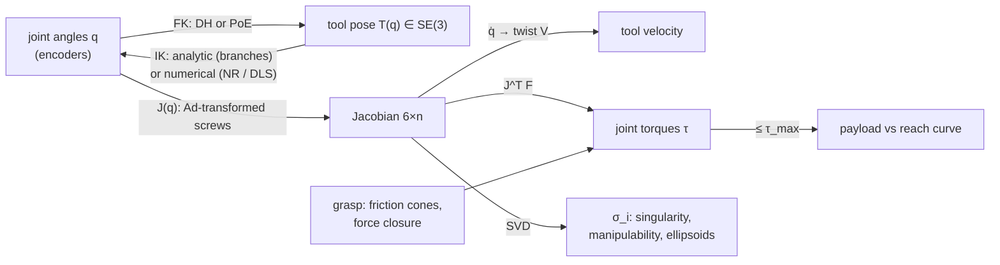

# 06.3 · Manipulators: kinematics, Jacobians, statics and grasping

<div class="module-card">

**Prerequisites** [06.2 Spatial mathematics](lessons/stage-06/lesson-02.md) (SE(3), twists, exponential coordinates) · linear algebra (SVD, pseudo-inverse) · Newton's method.

**Estimated time** 8 h (4 h theory · 1 h simulator · 3 h programming) · **Level** Intermediate → Advanced (fast-track available)

**Next** [06.8 Path & motion planning](lessons/stage-06/lesson-08.md) (arm motion planning) · [06.5 Teleoperation & HMI](lessons/stage-06/lesson-05.md) (how an operator drives this arm).

<p class="tags"><span>kinematics</span><span>DH · PoE</span><span>Jacobians</span><span>numerical IK</span><span>statics</span><span>grasping</span><span>Sim G</span><span>P08</span></p>
</div>

## Why this matters

The manipulator is the part of an EOD robot that replaces the technician's hands. Its generic tasks are
positioning cameras and sensors close to an item, opening doors, moving obstacles, and lifting and
placing objects. In this course these appear only as *manipulation tasks on fictional
objects*, like the dexterity boards of the NIST test methods. The arm's usefulness depends on
several things. First is *where* it can put the gripper (its workspace). Then *how well*: its
precision and dexterity at that point. Then *how much* it can hold there: payload at reach. Finally
*how predictably* it moves when the operator commands it through a camera image.

All four are the kinematics and statics of this lesson. Singularities, the configurations where
the arm loses a direction of motion, are the reason "move straight forward" sometimes makes a
real arm lurch. Manipulability is the reason some poses feel responsive and others sluggish. The
lift-vs-reach curve is the honest version of the "100 kg lift" on a spec sheet.

<div class="callout boundary">

**Scope.** This lesson is robot engineering: kinematics, Jacobians, statics and generic grasp
mechanics on fictional test objects. It does not describe tools, techniques or procedures for
acting on explosive devices. Those are operational, restricted and outside the course (see the
[Stage 6 boundary note](lessons/stage-06/README.md)).

</div>

## Learning objectives

1. Derive forward kinematics for a serial arm with both Denavit–Hartenberg (DH) parameters and the
   product of exponentials (PoE), and show numerically that they agree.
2. Solve inverse kinematics analytically for a planar 3R arm and a 5-DOF turret arm, enumerating
   all solution branches, and explain which 6-DOF poses a 5-DOF arm *cannot* reach.
3. Implement numerical IK (Newton–Raphson, damped least squares) and explain the convergence and
   stability behaviour of each near singularities.
4. Compute the geometric Jacobian (space form, via adjoints) and verify it by finite differences.
5. Use the SVD of the Jacobian to classify singularities and compute Yoshikawa manipulability and
   the manipulability ellipsoid.
6. Use $\tau = J^\top F$ to compute joint torques for payloads and derive a payload-vs-reach curve.
7. State force-closure and form-closure conditions and size a friction grasp.

## Theory

### 1. Forward kinematics: DH parameters

A serial arm is a chain of joints $q = (q_1,\dots,q_n)$. The **standard DH** convention attaches
frame $i$ to link $i$ so that each link transform is a product of four elementary motions:

<div class="callout eq">

$$ {}^{i-1}T_i = R_z(\theta_i)\,\mathrm{Trans}_z(d_i)\,\mathrm{Trans}_x(a_i)\,R_x(\alpha_i),\qquad
T_{0n}(q) = {}^{0}T_1\,{}^{1}T_2\cdots{}^{n-1}T_n . $$

</div>

| Symbol | Meaning | Unit |
|---|---|---|
| $\theta_i$ | joint angle about $z_{i-1}$ (the variable for a revolute joint; may include an offset) | rad |
| $d_i$ | offset along $z_{i-1}$ | m |
| $a_i$ | link length along $x_i$ (the common normal) | m |
| $\alpha_i$ | twist about $x_i$ between $z_{i-1}$ and $z_i$ | rad |

*Intuition.* DH minimises parameters (4 per joint) by forcing each frame's $z$ axis onto a joint
axis and each $x$ axis onto a common normal. That economy has a cost. Frame placement rules are
fiddly, and parallel consecutive axes make $d_i$ ill-defined, which is a known problem in
calibration. Always draw the frames.

**Our fictional 5-DOF EOD-style arm ("Arm-5")**, mounted on a turret: turret yaw $q_1$, shoulder
pitch $q_2$, elbow pitch $q_3$, wrist pitch $q_4$ and wrist roll $q_5$. Dimensions: $d_1 = 0.35$
m (turret to shoulder), $a_2 = 0.80$ m (upper arm), $a_3 = 0.70$ m (forearm), $d_5 = 0.25$ m
(wrist to tool point). Positive pitch raises the arm.

| $i$ | $\theta_i$ | $d_i$ [m] | $a_i$ [m] | $\alpha_i$ |
|---|---|---|---|---|
| 1 | $q_1$ | 0.35 | 0 | $+90°$ |
| 2 | $q_2$ | 0 | 0.80 | 0 |
| 3 | $q_3$ | 0 | 0.70 | 0 |
| 4 | $q_4 + 90°$ | 0 | 0 | $+90°$ |
| 5 | $q_5$ | 0.25 | 0 | 0 |

At $q=0$ the arm is stretched horizontally forward. The tool point is at $(1.75, 0, 0.35)$ and the
tool $z$ axis (the **approach** vector) points along $+x_0$.

```python
import numpy as np

def Rz4(t): c, s = np.cos(t), np.sin(t); return np.array([[c,-s,0,0],[s,c,0,0],[0,0,1,0],[0,0,0,1.]])
def Rx4(t): c, s = np.cos(t), np.sin(t); return np.array([[1,0,0,0],[0,c,-s,0],[0,s,c,0],[0,0,0,1.]])
def Tr(x, y, z): T = np.eye(4); T[:3, 3] = [x, y, z]; return T

D1, A2, A3, D5 = 0.35, 0.80, 0.70, 0.25

def dh(theta, d, a, alpha):
    return Rz4(theta) @ Tr(0, 0, d) @ Tr(a, 0, 0) @ Rx4(alpha)

def fk_dh(q):
    table = [(q[0], D1, 0, np.pi/2), (q[1], 0, A2, 0), (q[2], 0, A3, 0),
             (q[3] + np.pi/2, 0, 0, np.pi/2), (q[4], D5, 0, 0)]
    T = np.eye(4)
    for row in table:
        T = T @ dh(*row)
    return T

print(np.round(fk_dh(np.zeros(5)), 4))   # translation (1.75, 0, 0.35); approach column z = (1,0,0)
```

### 2. Forward kinematics: product of exponentials

The PoE formula needs only a **home configuration** $M = T_{0n}(0)$ and each joint's screw axis
$\mathcal S_i$ written in the base frame *at home* (06.2 §6):

<div class="callout eq">

$$ T_{0n}(q) = e^{[\mathcal S_1]q_1}\,e^{[\mathcal S_2]q_2}\cdots e^{[\mathcal S_n]q_n}\,M . $$

</div>

| Symbol | Meaning | Unit |
|---|---|---|
| $\mathcal S_i = (\hat\omega_i, -\hat\omega_i\times q_i)$ | screw axis of joint $i$ at home, base frame | —, m |
| $q_i$ (point) | any point on joint axis $i$ at home | m |
| $M$ | tool pose at $q=0$ | — |

*Intuition.* Read the formula right to left. Start at home, rotate the last joint about its
(home) axis, then the one before, and so on. Each rotation carries every more-distal body with
it, which is why the home axes stay valid. No link frames are needed, only axes and one pose. That
makes it the better representation for code and calibration.

For Arm-5 (pitch axes point along $-y_0$ so that positive angles lift):

| Joint | $\hat\omega_i$ | point on axis | $\mathcal S_i = (\hat\omega, v)$ |
|---|---|---|---|
| 1 turret | $(0,0,1)$ | $(0,0,0)$ | $(0,0,1,\ 0,0,0)$ |
| 2 shoulder | $(0,-1,0)$ | $(0,0,0.35)$ | $(0,-1,0,\ 0.35,0,0)$ |
| 3 elbow | $(0,-1,0)$ | $(0.80,0,0.35)$ | $(0,-1,0,\ 0.35,0,-0.80)$ |
| 4 wrist pitch | $(0,-1,0)$ | $(1.50,0,0.35)$ | $(0,-1,0,\ 0.35,0,-1.50)$ |
| 5 wrist roll | $(1,0,0)$ | $(0,0,0.35)$ | $(1,0,0,\ 0,0.35,0)$ |

$M$ has rotation columns $x_t=(0,0,1)$, $y_t=(0,-1,0)$, $z_t=(1,0,0)$ and translation
$(1.75,0,0.35)$. For random $q$, `fk_poe(q)` and `fk_dh(q)` agree to machine precision. Checking
that is the first unit test of any kinematics library.

```python
from scipy.linalg import expm

def hat(w): return np.array([[0,-w[2],w[1]],[w[2],0,-w[0]],[-w[1],w[0],0]])
def se3_hat(S): M = np.zeros((4, 4)); M[:3, :3] = hat(S[:3]); M[:3, 3] = S[3:]; return M

S_LIST = [np.r_[0, 0, 1, 0, 0, 0], np.r_[0, -1, 0, D1, 0, 0], np.r_[0, -1, 0, D1, 0, -A2],
          np.r_[0, -1, 0, D1, 0, -(A2 + A3)], np.r_[1, 0, 0, 0, D1, 0]]
M_HOME = np.eye(4); M_HOME[:3, :3] = [[0, 0, 1], [0, -1, 0], [1, 0, 0]]; M_HOME[:3, 3] = [A2 + A3 + D5, 0, D1]

def fk_poe(q):
    T = np.eye(4)
    for S, qi in zip(S_LIST, q):
        T = T @ expm(se3_hat(S) * qi)      # use the closed form of 06.2 in production code
    return T @ M_HOME

rng = np.random.default_rng(0)
print(all(np.allclose(fk_dh(q), fk_poe(q)) for q in rng.uniform(-2, 2, (100, 5))))   # True
```

<details class="answer"><summary>Exercise 1 — then reveal</summary>

Without computing, predict the tool position for $q = (90°, 0, 0, 0, 45°)$. Then explain why
$q_5$ does not affect the tool *position* in this arm.

*Answer.* A turret yaw of 90° swings the stretched arm to point along $+y_0$: the tool is at
$(0, 1.75, 0.35)$. The roll axis passes through the tool point (the tool point lies on the roll
axis), so roll changes only orientation. Designers do this on purpose. It **decouples** position
from final roll, which is what makes the analytic IK in §4 possible.

</details>

### 3. Inverse kinematics of a planar 3R arm

Given a planar target $(x, y, \phi)$ with $\phi$ the tool orientation, and links
$\ell_1,\ell_2,\ell_3$:

<div class="callout eq">

$$ x_w = x - \ell_3\cos\phi,\quad y_w = y - \ell_3\sin\phi,\qquad
c_2 = \frac{x_w^2+y_w^2-\ell_1^2-\ell_2^2}{2\ell_1\ell_2},\quad q_2 = \pm\arccos c_2, $$

$$ q_1 = \operatorname{atan2}(y_w,x_w) - \operatorname{atan2}(\ell_2\sin q_2,\ \ell_1+\ell_2\cos q_2),\qquad q_3 = \phi - q_1 - q_2 . $$

</div>

| Symbol | Meaning | Unit |
|---|---|---|
| $(x_w, y_w)$ | wrist-centre position | m |
| $c_2$ | cosine of the elbow angle (law of cosines); $|c_2|>1$ means unreachable | — |
| $\pm$ | the two branches, elbow-up and elbow-down | — |

*Intuition.* Fix the orientation and the last link becomes a rigid offset. Subtract it to get the
wrist centre, and what remains is a two-link triangle whose side lengths are known. The law of
cosines gives the elbow angle, and the triangle's two mirror images give the two branches.

*Example.* $\ell = (0.6, 0.5, 0.2)$ m, target $(0.7, 0.4, -30°)$. The wrist centre is
$(0.5268, 0.5000)$, $c_2 = -0.1375$, $q_2 = \pm97.90°$. The two solutions are
$(0.51°, 97.90°, -128.42°)$ and $(86.50°, -97.90°, -18.59°)$. FK of both returns the target
exactly.

```python
L3R = (0.6, 0.5, 0.2)

def ik_3r(x, y, phi, branch=+1, L=L3R):
    xw, yw = x - L[2] * np.cos(phi), y - L[2] * np.sin(phi)
    c2 = (xw**2 + yw**2 - L[0]**2 - L[1]**2) / (2 * L[0] * L[1])
    if abs(c2) > 1:
        return None                                   # outside the (dextrous) workspace
    q2 = branch * np.arccos(c2)
    q1 = np.arctan2(yw, xw) - np.arctan2(L[1] * np.sin(q2), L[0] + L[1] * np.cos(q2))
    return np.array([q1, q2, phi - q1 - q2])

for b in (+1, -1):
    print(np.degrees(ik_3r(0.7, 0.4, np.radians(-30), b)))
```

<details class="answer"><summary>Exercise 2 — then reveal</summary>

For $\ell=(0.6,0.5,0.2)$, what is the set of wrist-centre radii that can be reached, and for which
tool orientations can the point $(1.2, 0)$ be reached?

*Answer.* The wrist-centre radius lies in $[|\ell_1-\ell_2|, \ell_1+\ell_2] = [0.1, 1.1]$ m. For a
target at radius 1.2 you need $|(1.2,0) - 0.2(\cos\phi,\sin\phi)| \le 1.1$. Squaring:
$1.44 - 0.48\cos\phi + 0.04 \le 1.21$, so $\cos\phi \ge 0.5625$, giving $|\phi| \le 55.8°$. The
**dextrous workspace** (all orientations reachable) is smaller than the **reachable workspace**.
Near the edge only a cone of approach directions remains.

</details>

### 4. Analytic IK of the 5-DOF turret arm

A 5-DOF arm cannot realise an arbitrary 6-DOF pose. With a turret yaw and three parallel pitch
joints, the approach vector must lie in the **vertical plane through the turret axis** and the
target. So the natural task specification is: position $p$, approach **pitch** $\phi$ (angle of
the approach vector above horizontal) and roll $\rho$. Then:

<div class="callout eq">

$$ q_1 = \operatorname{atan2}(p_y,p_x),\quad r = \sqrt{p_x^2+p_y^2},\quad z = p_z - d_1, $$
$$ r_w = r - d_5\cos\phi,\quad z_w = z - d_5\sin\phi,\quad c_3 = \frac{r_w^2+z_w^2-a_2^2-a_3^2}{2a_2a_3}, $$
$$ q_3 = \mp\arccos c_3\ (\text{elbow up / down}),\quad q_2 = \operatorname{atan2}(z_w,r_w) - \operatorname{atan2}(a_3\sin q_3,\ a_2+a_3\cos q_3), $$
$$ q_4 = \phi - q_2 - q_3,\qquad q_5 = \rho . $$

</div>

It has up to **four** branches: elbow up or down, times turret "front" $q_1$ or "back"
$q_1+\pi$ (reaching over the top with $r\to-r$).

*Worked numbers.* Target $p=(1.1, 0.3, 0.0)$ m in the arm base frame (0.35 m below the shoulder,
for example near the ground ahead), approach pitch $\phi=-60°$ (pointing down), roll 0:

| Step | Value |
|---|---|
| $q_1 = \operatorname{atan2}(0.3,1.1)$ | 15.26° |
| $r$, $z$ | 1.1402 m, −0.35 m |
| $r_w = r - 0.25\cos(-60°)$, $z_w = z - 0.25\sin(-60°)$ | 1.0152 m, −0.1335 m |
| $c_3$ | −0.0729 |
| elbow-up $q_3$, $q_2$, $q_4$ | −94.18°, 35.50°, −1.32° |
| elbow-down $q_3$, $q_2$, $q_4$ | +94.18°, −50.48°, −103.70° |
| FK check | tool at $(1.1, 0.3, 0.0)$; approach $(0.482, 0.132, -0.866)$ = $(\cos q_1\cos\phi, \sin q_1\cos\phi, \sin\phi)$ ✓ |

Elbow-up is usually preferred on a robot. It keeps the forearm above ground clutter, and the
elbow does not hide the gripper from the drive camera.

```python
def ik_arm5(p, pitch, roll, elbow_up=True):
    q1 = np.arctan2(p[1], p[0])
    r, z = np.hypot(p[0], p[1]), p[2] - D1
    rw, zw = r - D5 * np.cos(pitch), z - D5 * np.sin(pitch)
    c3 = (rw**2 + zw**2 - A2**2 - A3**2) / (2 * A2 * A3)
    if abs(c3) > 1:
        return None
    q3 = -np.arccos(c3) if elbow_up else np.arccos(c3)
    q2 = np.arctan2(zw, rw) - np.arctan2(A3 * np.sin(q3), A2 + A3 * np.cos(q3))
    return np.array([q1, q2, q3, pitch - q2 - q3, roll])

q_star = ik_arm5(np.array([1.1, 0.3, 0.0]), np.radians(-60), 0.0)
print(np.degrees(q_star), fk_dh(q_star)[:3, 3])   # [15.26 35.50 -94.18 -1.32 0.] [1.1 0.3 0.]
```

<details class="answer"><summary>Exercise 3 — then reveal</summary>

The operator asks the arm to approach a fictional test object at $(1.1, 0.3, 0.0)$ *horizontally
from the left*, i.e. approach vector $(0,-1,0)$. Why can Arm-5 not do it, and what are the two
engineering remedies?

*Answer.* The approach must lie in the plane spanned by $z_0$ and the direction to the target,
$(\cos q_1,\sin q_1)$ with $q_1 = 15.3°$. The vector $(0,-1,0)$ is not in that plane. Remedies:
(a) move the *base*. The mobile platform supplies the missing yaw DOF, so the robot as a whole is
redundant (5 + 3 planar base DOF); (b) add a wrist yaw joint (a 6-DOF arm). On real platforms (a)
is common, which is why whole-body teleoperation matters (06.5).

</details>

### 5. The Jacobian

The Jacobian maps joint velocities to the end-effector **twist**, $\mathcal V = J(q)\dot q$. With
PoE the **space Jacobian** has a clean closed form:

<div class="callout eq">

$$ J_s(q) = \big[\ \mathcal S_1,\ \ \mathrm{Ad}_{e^{[\mathcal S_1]q_1}}\mathcal S_2,\ \ \dots,\ \ \mathrm{Ad}_{e^{[\mathcal S_1]q_1}\cdots e^{[\mathcal S_{n-1}]q_{n-1}}}\mathcal S_n\ \big],\qquad
\mathrm{Ad}_T = \begin{bmatrix} R & 0\\ [p]R & R\end{bmatrix}. $$

Linear velocity of the tool point $p$: $\;\dot p = v_s + \omega_s\times p = \big(J_{s,v} - [p]J_{s,\omega}\big)\dot q$.

</div>

| Symbol | Meaning | Unit |
|---|---|---|
| $J_s$ | space Jacobian, $6\times n$ | columns: (rad⁻¹-free, m) |
| $\mathcal V_s=(\omega_s, v_s)$ | spatial twist (velocity of the body point at the base origin) | rad/s, m/s |
| $\mathrm{Ad}_T$ | adjoint: transforms twists between frames | — |
| $J_{s,\omega}, J_{s,v}$ | top and bottom 3 rows | — |

*Intuition.* Column $i$ is joint $i$'s screw axis *where it currently is*, moved there by the
joints before it. The **analytic Jacobian** (derivative of a minimal pose parametrisation such as
position + Euler angles) differs from this geometric Jacobian by the Euler-rate map of 06.2 §4,
and it inherits the gimbal-lock singularity. Use the geometric one for control.

*Check.* At the §4 solution, the analytic $J_{s,v} - [p]J_{s,\omega}$ matches central finite
differences of the tool position to $10^{-6}$. Run that test on every Jacobian you write.

```python
def Ad(T):
    R, p = T[:3, :3], T[:3, 3]
    A = np.zeros((6, 6)); A[:3, :3] = R; A[3:, 3:] = R; A[3:, :3] = hat(p) @ R
    return A

def jacobian_space(q):
    J, T = np.zeros((6, len(q))), np.eye(4)
    for i, (S, qi) in enumerate(zip(S_LIST, q)):
        J[:, i] = Ad(T) @ S
        T = T @ expm(se3_hat(S) * qi)
    return J

def jacobian_point(q):
    J, p = jacobian_space(q), fk_poe(q)[:3, 3]
    return J[3:] - hat(p) @ J[:3]

def jacobian_fd(q, h=1e-6):
    return np.column_stack([(fk_poe(q + h*e)[:3, 3] - fk_poe(q - h*e)[:3, 3]) / (2*h) for e in np.eye(len(q))])

print(np.allclose(jacobian_point(q_star), jacobian_fd(q_star), atol=1e-6))   # True
```

### 6. Numerical IK: Newton–Raphson and damped least squares

Analytic IK exists only for special geometries. The general method is iteration on the pose error.
With current pose $T(q)$ and desired $T_d$, the error twist in the space frame is
$\mathcal V_e = \mathrm{Ad}_{T}\,\log\!\big(T^{-1}T_d\big)^\vee$. Then:

<div class="callout eq">

$$ \text{Newton–Raphson: } \Delta q = J^{+}\mathcal V_e,\qquad
\text{Damped least squares: } \Delta q = J^\top\big(JJ^\top + \lambda^2 I\big)^{-1}\mathcal V_e, $$

$$ \Delta q_{\text{DLS}} = \sum_i \frac{\sigma_i}{\sigma_i^2+\lambda^2}\,v_i\,u_i^\top\mathcal V_e
\quad\text{(SVD } J = \textstyle\sum_i \sigma_i u_i v_i^\top\text{)}. $$

</div>

| Symbol | Meaning | Unit |
|---|---|---|
| $J^{+}$ | Moore–Penrose pseudo-inverse | — |
| $\lambda$ | damping factor | same units as $J$ entries (m) |
| $\sigma_i, u_i, v_i$ | singular values and vectors of $J$ | — |

*Intuition.* Newton linearises and solves exactly. The convergence is quadratic near the solution,
but the gain $1/\sigma_i$ explodes as $\sigma_i\to0$ (near a singularity). DLS is Tikhonov
regularisation (the Levenberg–Marquardt step). It replaces $1/\sigma$ with $\sigma/(\sigma^2 +
\lambda^2)$, which is bounded by $1/(2\lambda)$. It trades a small tracking error for bounded
joint velocities, and that trade is exactly what a teleoperated arm near full extension needs.

*Numbers.* Solving for the §4 pose $T_d$ from $q_0 = (0, 20°, -60°, 0, 10°)$: Newton converges in
**4** steps with error norms $0.80 \to 7.8\times10^{-2} \to 2.1\times10^{-3} \to 2.3\times10^{-6}
\to 3.7\times10^{-12}$. That is quadratic: each error is roughly the square of the previous one.
DLS with $\lambda = 0.05$ needs 5 steps and converges linearly at the end. Both land on the
elbow-up solution. Near a singularity the picture reverses (Exercise 4).

```python
from scipy.linalg import logm

def inv_T(T): R, p = T[:3, :3], T[:3, 3]; Ti = np.eye(4); Ti[:3, :3] = R.T; Ti[:3, 3] = -R.T @ p; return Ti

def log_twist(T):
    L = np.real(logm(T))
    return np.r_[L[2, 1], L[0, 2], L[1, 0], L[:3, 3]]

def ik_numeric(T_d, q0, lam=0.0, tol=1e-8, it_max=100):
    q = np.array(q0, float)
    for k in range(it_max):
        T = fk_poe(q)
        Ve = Ad(T) @ log_twist(inv_T(T) @ T_d)
        if np.linalg.norm(Ve) < tol:
            return q, k
        J = jacobian_space(q)
        dq = np.linalg.pinv(J) @ Ve if lam == 0 else J.T @ np.linalg.solve(J @ J.T + lam**2 * np.eye(6), Ve)
        q += dq
    return q, it_max

q_nr, k = ik_numeric(fk_poe(q_star), np.radians([0, 20, -60, 0, 10]))
print(k, np.degrees(q_nr))                                   # 4 [15.26 35.50 -94.18 -1.32 0.]
```

<details class="answer"><summary>Exercise 4 — then reveal</summary>

A planar 2R arm ($\ell_1=0.8$, $\ell_2=0.7$ m) is nearly straight ($q_2=5°$, $q_1=0$). The
operator commands 0.1 m/s *along the arm* (the near-singular direction $u_2$). Compare the joint
speed $\|\dot q\|$ from $J^{-1}$ and from DLS with $\lambda=0.05$, and the actual tool velocity
each produces.

*Answer.* The singular values are 1.654 and 0.0295. Pseudo-inverse: $\|\dot q\| = 0.1/0.0295 =
3.39$ rad/s, so the tool moves exactly as asked but the joints whip round (and a real drive
saturates). DLS: $\|\dot q\| = 0.1\cdot0.0295/(0.0295^2+0.05^2) = 0.875$ rad/s, and the tool
moves at only about 0.026 m/s along the requested direction. DLS "refuses" motion that the
geometry makes expensive. The operator sees the arm slow down instead of lurch. That is the right
failure mode.

</details>

### 7. Singularities and manipulability

A configuration is **singular** when $\operatorname{rank} J(q)$ drops. The arm then cannot
generate some twist direction, and near it small task motions need large joint motions. Yoshikawa's
**manipulability** measure and the velocity ellipsoid are:

<div class="callout eq">

$$ w(q) = \sqrt{\det\big(J J^\top\big)} = \prod_i \sigma_i,\qquad
\{\ \dot x = J\dot q : \|\dot q\|\le1\ \} = \text{ellipsoid with semi-axes } \sigma_i u_i . $$

For a planar 2R arm (position only): $w = \ell_1\ell_2|\sin q_2|$.

</div>

| Symbol | Meaning | Unit |
|---|---|---|
| $w$ | manipulability (volume of the velocity ellipsoid, up to a constant) | m² (2R) |
| $\sigma_i$ | ellipsoid semi-axis lengths: tool speed per unit joint speed | m/rad |
| $\kappa = \sigma_{\max}/\sigma_{\min}$ | condition number: isotropy of the arm | — |

*Intuition.* Picture the unit ball of joint velocities squashed by $J$ into an ellipsoid of tool
velocities. Long thin ellipsoids mean the arm moves easily one way and hardly at all in another.
By statics duality (§8) the **force** ellipsoid is the reciprocal: the arm *resists* large forces
exactly along the directions in which it can barely move. That is why a straight arm holds a
radial load with little torque.

*Numbers* (2R, $\ell=(0.8,0.7)$, $q_1=0$):

| $q_2$ | $w$ [m²] | $\sigma_1,\sigma_2$ [m/rad] | $\kappa$ |
|---|---|---|---|
| 90° | 0.560 (maximum) | 1.181, 0.474 | 2.49 |
| 30° | 0.280 | 1.600, 0.175 | 9.14 |
| 5° | 0.049 | 1.654, 0.0295 | 56.0 |

Arm-5 singularities: (i) **elbow** straight or folded ($q_3=0,\pi$), at the boundary of the
workspace; (ii) **wrist centre on the turret axis** ($r_w=0$), where $q_1$ is undefined, the same
geometry as the pan–tilt zenith of 06.2; (iii) the roll axis aligned with a direction the pitch
joints already cover. This happens when combined with the 5-DOF limitation and shows as a rank
drop of the full $6\times5$ Jacobian.

```python
def manipulability(J):
    s = np.linalg.svd(J, compute_uv=False)
    return np.prod(s), s[0] / s[-1]

def J_2r(q1, q2, l1=0.8, l2=0.7):
    s1, c1, s12, c12 = np.sin(q1), np.cos(q1), np.sin(q1+q2), np.cos(q1+q2)
    return np.array([[-l1*s1 - l2*s12, -l2*s12], [l1*c1 + l2*c12, l2*c12]])

for d in (90, 30, 5):
    print(d, manipulability(J_2r(0, np.radians(d))))
```

<details class="answer"><summary>Exercise 5 — then reveal</summary>

Show that for the 2R arm $w$ is maximised at $q_2=\pm90°$ regardless of $\ell_1,\ell_2$, but the
*isotropic* configuration ($\kappa=1$) exists only if $\ell_2/\ell_1$ satisfies a condition. Find
it.

*Answer.* $w=\ell_1\ell_2|\sin q_2|$ is maximal at 90°. Isotropy requires $JJ^\top \propto I$,
i.e. the two columns of $J$ are orthogonal and of equal length. In link-1 coordinates, column 2 is
the vector $\ell_2(-\sin q_2, \cos q_2)$ and column 1 is that plus $(0,\ell_1)$. Equal length gives
$\ell_1^2 + 2\ell_1\ell_2\cos q_2 = 0$, and orthogonality gives $\ell_2 + \ell_1\cos q_2 = 0$.
Together: $\cos q_2 = -\ell_2/\ell_1$ and $\ell_1 = 2\ell_2\cdot\ell_2/\ell_1$, so
$\ell_2/\ell_1 = 1/\sqrt2$ and $q_2 = 135°$ (Salisbury & Craig). Check numerically: for
$\ell=(1, 0.7071)$ and $q_2=135°$, $\sigma_1=\sigma_2=0.7071$. This is a classic design criterion
for fingers and small wrists.

</details>

### 8. Statics: $\tau = J^\top F$ and payload vs reach

By virtual work, a wrench $\mathcal F$ at the tool (force $F$, moment $m$) is balanced by joint
torques:

<div class="callout eq">

$$ \tau = J^\top(q)\,\mathcal F,\qquad\text{and for a point force at } p:\ \ \tau = J_p^\top(q)\,F, $$

$$ \tau_{\text{gravity}}(q) = \sum_{k} J_{c_k}^\top(q)\,\big(-m_k g\,\hat z\big)\quad\text{(each link's CoM Jacobian)} . $$

</div>

| Symbol | Meaning | Unit |
|---|---|---|
| $\tau$ | joint torques required to hold the load statically | N m |
| $J_p$, $J_{c_k}$ | point Jacobian of the tool / of link $k$'s centre of mass | m/rad |
| $F$ | external force at the tool (e.g. payload weight $m_pg$) | N |
| $m_k$ | link masses | kg |

*Intuition.* Power balance: $\tau^\top\dot q = F^\top\dot p = F^\top J\dot q$ for all $\dot q$.
For gravity it reduces to "weight × horizontal lever arm about each pitch axis". The Jacobian
form is still worth using because it is general (inclined bases, forces in any direction) and it
is the same code path as velocity control.

*Numbers.* At the §4 pose with a 3 kg payload, $J_p^\top F$ gives $(0, 33.56, 14.39, 3.68, 0)$
N m. Check by hand: payload weight 29.43 N times horizontal distance from the shoulder (1.140 m)
= 33.55 N m ✓; from the elbow, $1.140 - 0.8\cos35.5° = 0.489$ m, giving 14.39 N m ✓; from the
wrist, $0.25\cos60° = 0.125$ m, giving 3.68 N m ✓.

**Payload vs reach.** Give Arm-5 link masses of 4 kg (upper arm), 3 kg (forearm) and 2 kg
(wrist + gripper), with holding-torque limits of 200, 100 and 40 N m (shoulder, elbow, wrist).
For each horizontal reach at shoulder height with a horizontal approach, the maximum payload is
$\min_j (\tau_{j,\max} - \tau_{j,\text{self}})/\tau_{j,\text{per kg}}$:

| Reach [m] | 0.6–1.0 | 1.2 | 1.4 | 1.6 | 1.7 | 1.75 (straight) |
|---|---|---|---|---|---|---|
| max payload [kg] | 15.3 | 12.4 | 9.9 | 8.0 | 7.3 | 6.9 |
| limiting joint | wrist | shoulder | shoulder | shoulder | shoulder | shoulder |

The straight-arm case by hand: arm self-torque at the shoulder is $9.81(4\cdot0.4 + 3\cdot1.15 +
2\cdot1.625) = 81.4$ N m, and each payload kg adds $9.81\cdot1.75 = 17.17$ N m, so
$(200-81.4)/17.17 = 6.9$ kg ✓. Close in, the *wrist* limits. Far out, the *shoulder* limits. A
single "max lift" number hides a curve with two regimes.

```python
G = 9.81

def gravity_torque(q, masses_and_com_fns, payload, tool_fn):
    """tau = sum_k Jc_k^T (-m_k g z) ; returns torques the motors must supply."""
    def J_of(fn, h=1e-6):
        return np.column_stack([(fn(q + h*e) - fn(q - h*e)) / (2*h) for e in np.eye(len(q))])
    tau = np.zeros(len(q))
    for m, fn in masses_and_com_fns + [(payload, tool_fn)]:
        tau += J_of(fn).T @ np.array([0, 0, m * G])
    return tau

tool = lambda q: fk_dh(q)[:3, 3]
print(gravity_torque(q_star, [], 3.0, tool))    # [0. 33.56 14.39 3.68 0.]
```

<details class="answer"><summary>Exercise 6 — then reveal</summary>

The robot sits on a 15° nose-down slope, and the arm is stretched forward at the same *joint*
angles as the straight-arm case. Does the shoulder torque from a 5 kg payload go up or down, and by
how much?

*Answer.* The whole arm is now tilted 15° down, so each horizontal lever arm is multiplied by
$\cos15° = 0.966$. Payload torque falls from $5\cdot17.17 = 85.8$ to 82.9 N m. But to hold the
tool at the *same world height* the arm must pitch up by 15°, and then the lever arms are unchanged.
The lesson: payload capability is a function of **world-frame** pose, which depends on base
attitude (from the IMU). Torque limits should be checked in the controller from the full $J^\top F$
with the gravity vector rotated into the base frame.

</details>

### 9. Grippers and grasp basics

Most EOD grippers are two-finger parallel or angular jaws with interchangeable finger pads,
sometimes with a continuous wrist roll. The mechanics of *holding* a (fictional) object rest on
contact models:

- **Frictionless point contact**: transmits only a normal push.
- **Hard finger (point contact with Coulomb friction)**: any force inside the **friction cone**
  $\|f_t\| \le \mu f_n$, with half-angle $\arctan\mu$.
- **Soft finger**: adds a limited torsional moment about the normal.

**Form closure**: the contacts *geometrically* prevent all motion, with no friction needed. First
order needs at least $n+1$ frictionless contacts for $n$ DOF of the object: 4 in the plane, 7 in
3D. **Force closure**: the contact wrenches (including friction) positively span the wrench
space, so any external disturbance can be resisted by squeezing hard enough. In the plane, two
hard-finger contacts achieve force closure if and only if the line joining them lies inside
**both** friction cones (the antipodal condition).

For a two-finger friction grasp holding an object of mass $m$ against gravity and acceleration $a$:

<div class="callout eq">

$$ 2\mu N \ \ge\ SF\cdot m\,(g + a)\quad\Longrightarrow\quad N_{\min} = \frac{SF\cdot m\,(g+a)}{2\mu} . $$

</div>

| Symbol | Meaning | Unit |
|---|---|---|
| $N$ | normal (squeeze) force per finger | N |
| $\mu$ | friction coefficient between pad and object | — |
| $a$ | worst-case vertical acceleration during motion | m s⁻² |
| $SF$ | safety factor | — |

*Example.* A 2 kg fictional test block, $\mu=0.4$ (rubber pad on painted metal), $a=2$ m/s², $SF=1.5$:
$N_{\min} = 1.5\cdot2\cdot11.81/0.8 = 44.3$ N per finger. The antipodal tolerance is
$\arctan0.4 = 21.8°$. If the contact normals are misaligned by more than that, no squeeze force
will hold the object. **Engineering point:** high grip force is not free. It can crush or deform
objects and loads the wrist. Controlled grip force and pad material selection (raising $\mu$)
are the usual levers.

```python
def min_grip_force(m, mu, a=0.0, sf=1.5):
    return sf * m * (G + a) / (2 * mu)

def antipodal_ok(n1, n2, p1, p2, mu):
    """Planar two-contact force closure: segment p1->p2 inside both friction cones (inward normals n)."""
    d = (p2 - p1) / np.linalg.norm(p2 - p1)
    half = np.arctan(mu)
    return np.arccos(np.clip(n1 @ d, -1, 1)) <= half and np.arccos(np.clip(n2 @ -d, -1, 1)) <= half

print(min_grip_force(2.0, 0.4, a=2.0), np.degrees(np.arctan(0.4)))   # 44.3 21.8
```

<details class="answer"><summary>Exercise 7 — then reveal</summary>

A cylindrical fictional test object is grasped across its diameter, but the gripper approaches
15° off the diameter. Pads with $\mu=0.3$ are fitted. Is the grasp force-closed? What is the
minimum $\mu$ that works?

*Answer.* The line between contacts is 15° off each surface normal. $\arctan0.3 = 16.7° > 15°$, so
the grasp **is** force-closed, just barely. A larger disturbance or lower $\mu$ (wet, dusty) breaks
it. The minimum is $\mu = \tan15° = 0.268$. That thin margin is why wrist-camera alignment before
closing the gripper matters.

</details>

## Visual explanation



<iframe class="sim-frame" src="sims/robotics-engineering/index.html?embed=1" height="720" loading="lazy"></iframe>

<a class="sim-link" href="sims/robotics-engineering/index.html" target="_blank">Open Sim G full-screen ↗</a>

## Worked example — can Arm-5 place a camera where the operator wants it?

*Scenario (fictional).* A fictional test object sits on the floor 1.3 m ahead of the turret axis
and 0.25 m to the left. The arm base (turret) is 0.30 m above the floor. The operator wants the
wrist camera 0.20 m above the object, looking straight down ($\phi=-90°$), and the tool must carry
a 1.5 kg sensor payload.

1. **Target in the arm frame.** The floor is at $z=-0.30$, so the tool point is at
   $p = (1.3, 0.25, -0.10)$.
2. **IK.** $q_1 = \operatorname{atan2}(0.25,1.3) = 10.89°$, $r = 1.3238$, $z = -0.45$. With
   $\phi=-90°$: $r_w = 1.3238$, $z_w = -0.45 + 0.25 = -0.20$. $c_3 = (1.3238^2 + 0.04 - 0.64 -
   0.49)/(1.12) = 0.5915$, so $q_3 = -53.74°$ (elbow up).
3. **Margin to singularity.** $|\sin q_3| = 0.806$: well away from a straight elbow. The wrist
   centre is 1.32 m from the turret axis, far from the $r_w = 0$ singularity.
4. **Payload.** At this pose `gravity_torque` gives a self-torque of 71.8 N m at the shoulder,
   plus 12.99 N m per payload kg. So the capacity is $(200-71.8)/12.99 = 9.9$ kg (shoulder-limited).
   A 1.5 kg payload is fine.
5. **Sensitivity.** Using $J_p$ at this pose, a 0.5° encoder error on the shoulder moves the tool by
   about $\|J_{p,2}\|\cdot0.0087$. Compute it (answer: ≈ 1.2 cm). Compare that with the wrist
   camera's pixel footprint at 0.2 m (06.2 §7).

<details class="answer"><summary>Check steps 2 and 5 — then reveal</summary>

$q_2 = \operatorname{atan2}(-0.20, 1.3238) - \operatorname{atan2}(0.7\sin(-53.74°), 0.8+0.7\cos(-53.74°))
= -8.59° - \operatorname{atan2}(-0.564, 1.214) = -8.59° + 24.93° = 16.34°$;
$q_4 = -90° - 16.34° + 53.74° = -52.61°$. FK returns $(1.3, 0.25, -0.10)$ ✓. The shoulder column of
$J_p$ has norm equal to the distance from the shoulder axis to the tool point,
$\sqrt{1.3238^2+0.45^2} = 1.398$ m. So $1.398\cdot0.00873 = 1.22$ cm.

</details>

## Simulation work

<div class="callout sim">

**Sim G, challenge 2 (inverse kinematics).** The challenge arm is a planar 2-link arm
($l_1 = 1.0$ m, $l_2 = 0.8$ m) — the positioning sub-problem of your `ik_arm5`. (1) Write
`ik(x, y)` (return `null` when unreachable). Before each run, predict for five of the targets
whether they are reachable and which elbow branch your code returns; check against the replay.
(2) *Offline Python* (Sim G has no manipulability overlay): compute $\sigma_{\min}$ of the 2-link
Jacobian along a straight line from $r = 1.0$ m to full extension $r = 1.8$ m and mark where it
collapses. In Sim B, drive the arm (I/K, J/L) toward full extension and note where the end-effector
reach read-out barely changes per key press. (3) *Offline paper exercise* (there is no lift
challenge): with fictional joint-torque limits, use $\tau = J^\top F$ to compute the largest test
weight the 2-link arm could hold at three reaches and plot it against the payload-vs-reach model.
(4) Rewrite `ik(x, y)` as an iterative damped-least-squares solver and compare the score (targets
within 1 cm, correct unreachable calls) at $\lambda = 0.01$ and $0.1$.

</div>

## Practical exercises

<details class="answer"><summary>Exercise 8 — workspace map — then reveal</summary>

Sample 10⁵ random joint vectors for Arm-5 within limits $q_2\in[-30°, 120°]$,
$q_3\in[-150°, 0°]$, and plot tool points in the $(r, z)$ plane coloured by $w(q)$ for the
position Jacobian. Where is the "sweet spot" for precise work?

*Answer (qualitative).* The reachable region is an annular sector between radii $|a_2-a_3|$ and
$a_2+a_3$ about the shoulder, offset by the wrist. Manipulability peaks at intermediate reach with
$q_3 \approx -90°$ (elbow near right angle) and collapses at both the inner and outer boundaries.
For precise camera placement, plan the base position so the target falls in the high-$w$ band.
This is **base placement for manipulation**, a standard mobile-manipulation subproblem.

</details>

<details class="answer"><summary>Exercise 9 — redundancy with the base — then reveal</summary>

Treat the tracked base as a planar prismatic ($x$) + revolute (yaw) pair in front of the arm,
giving 7 DOF in total. Write the combined Jacobian, and describe how to use the null space to
keep $q_3$ near $-90°$ while the tool tracks a Cartesian command.

*Answer.* $J_{\text{tot}} = [J_{\text{base}}\ \ J_{\text{arm}}]$, $6\times7$. Use
$\dot q = J^{+}\mathcal V + (I - J^{+}J)\,k\,\nabla_q h(q)$ with
$h = -\tfrac12(q_3+\pi/2)^2$ or $h = w(q)$. The secondary objective moves only in the null space and
does not disturb the tool. On real platforms, weight base motions as costlier (a weighted
pseudo-inverse), because track motion is imprecise (slip, 06.4).

</details>

## Programming exercise — a manipulator library

**Goal.** Implement `arm.py` for a general serial arm given by PoE screws (with a DH front-end),
and a report generator for workspace, singularities and payload.

- **Input:** screw list and $M$ (or a DH table); joint limits; link masses/CoMs; torque limits.
- **Output:** `fk(q)`, `jacobian_space(q)`, `jacobian_body(q)`, `ik_analytic_arm5(...)` (all
  branches), `ik_dls(T_d, q0, lam)`, `manipulability(q)`, `gravity_torque(q, payload)`,
  `payload_vs_reach(...)`, and workspace plots.
- **Constraints:** NumPy/SciPy; closed-form `exp_se3` (no `expm` in the hot loop); IK ≤ 1 ms per
  solve for Arm-5; all branches returned in a deterministic order.
- **Expected behaviour:** DH ≡ PoE on random $q$; analytic Jacobian ≡ finite differences; NR
  converges quadratically on reachable targets; DLS bounded near singularities; out-of-reach
  targets return `None` from analytic IK and a least-squares closest pose from DLS.
- **Test cases:** §3 planar solutions; §4 table (15.26°, 35.50°, −94.18°, −1.32°); §8 torques
  (33.56, 14.39, 3.68 N m); payload 6.9 kg at full extension; §9 grip force 44.3 N.
- **Extensions:** joint-limit-aware DLS with clamping and a null-space limit-avoidance term;
  selectively damped least squares (Buss & Kim); compute force ellipsoids and verify the duality
  with velocity ellipsoids; calibrate kinematic parameters from simulated noisy measurements
  (identifiability via the SVD of the regressor).

This is [Project P08](projects/p08-manipulator/README.md) (3-DOF version there; Arm-5 as an
extension).

## Reading

- Lynch & Park, *Modern Robotics* (2017), https://hades.mech.northwestern.edu/index.php/Modern_Robotics.
  **Ch. 4** (PoE forward kinematics), **ch. 5** (Jacobians, statics, manipulability), **ch. 6**
  (inverse kinematics, Newton–Raphson), **ch. 12** (grasping, form and force closure). The core
  text for this lesson. Videos cover every section.
- Siciliano, B., Sciavicco, L., Villani, L. & Oriolo, G., *Robotics: Modelling, Planning and
  Control*, Springer (2009), https://link.springer.com/book/10.1007/978-1-84628-642-1.
  **Ch. 2–3** (DH, analytic vs geometric Jacobian, kinematic singularities, DLS and redundancy).
- Corke, P., *Robotics, Vision and Control*, 3rd ed. (2023), https://petercorke.com/rvc/home/.
  Ch. 7–8 with the Robotics Toolbox for Python, useful to cross-check your library.
- NIST, *ASTM E54.09 Ground Test Methods – Dexterity and Strength* (2021),
  https://www.nist.gov/document/astm-e5409-ground-test-methods-dexterity-and-strength-2021a.
  How reach, dexterity and lift-at-reach are *measured*. Compare it with your model.
- MoveIt 2 documentation, https://moveit.picknik.ai/main/index.html. How IK solvers and planners
  are packaged for real arms in ROS 2.

## Assessment

1. *(Conceptual)* Why is the geometric Jacobian preferred over the analytic Jacobian for
   resolved-rate control, and when do you actually need the analytic one?
2. *(Mathematical)* Derive $\det J$ for the planar 2R arm and show that its singular set is
   $q_2\in\{0,\pi\}$. Interpret both physically.
3. *(Computation)* For Arm-5, find all IK branches (including turret "back" solutions) for
   $p=(0.9, 0, 0.8)$, $\phi = 0$. Which are within $q_2\in[-30°,120°]$?
4. *(Interpretation)* An operator reports that "jogging the gripper straight out makes the arm
   shake near full reach". Explain with singular values, and propose two software changes.
5. *(Design)* The customer wants 10 kg at 1.5 m reach on Arm-5. Which joint(s) must be upgraded,
   to what holding torque (SF 1.5), and what does that do to the mass budget in 06.1?

<details class="answer"><summary>Answers to 2 and 5</summary>

2. $\det J = \ell_1\ell_2\sin q_2$. At $q_2=0$ the arm is fully stretched and cannot move radially.
   At $q_2=\pi$ it is fully folded (on the inner boundary). Both are workspace-boundary
   singularities.
5. At a horizontal reach of 1.5 m (shoulder height, horizontal approach, elbow up), the payload
   torque at the shoulder is $10\cdot9.81\cdot1.5 = 147$ N m. `gravity_torque` at the IK pose
   gives totals of **216 N m** (shoulder) and **102 N m** (elbow) static; the wrist, at 27 N m, is
   fine. With SF 1.5 the requirements become about 324 N m and 153 N m, so both the shoulder
   (from 200) and the elbow (from 100) must be upgraded. Using 06.1's 0.04 kg per N m actuator
   model, that adds $(124+53)\cdot0.04 \approx 7$ kg before the battery closure. A 25 kg
   man-portable design cannot absorb it.

</details>

## Expert extension

- **Screw-theoretic singularity analysis**: find reciprocal screws to the Jacobian's column space
  at a singularity. They are the wrenches the arm can resist with zero torque.
- **Dynamic manipulability** (Yoshikawa 1985): replace $JJ^\top$ with $J M(q)^{-1}M(q)^{-\top}J^\top$
  to account for link inertia. Relevant to fast arm motion on a light, tippy base (06.4).
- **Grasp quality metrics**: the Ferrari–Canny $\epsilon$-metric (largest ball in the grasp wrench
  space) and its use in data-driven grasp planning. Compare analytic and learned grasp scoring on
  fictional objects in PyBullet.

## What comes next

[06.4](lessons/stage-06/lesson-04.md) puts the arm on a moving, tippable base with motors and
batteries. [06.5](lessons/stage-06/lesson-05.md) puts a human, a latency and a camera between the
operator and the Jacobian, and [06.8](lessons/stage-06/lesson-08.md) plans collision-free arm
motion.
