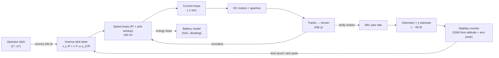

# 06.4 · Mobile bases and control: tracks, stairs, motors, batteries, PID and LQR

<div class="module-card">

**Prerequisites** [06.2 Spatial mathematics](lessons/stage-06/lesson-02.md) (SE(2)/SE(3), frames) · [01.7 Electricity & EM](lessons/stage-01/lesson-07.md) (circuits, energy storage) · Laplace transforms, linear ODEs, eigenvalues.

**Estimated time** 8 h (4 h theory · 1.5 h simulator · 2.5 h programming) · **Level** Intermediate

**Next** [06.5 Teleoperation & HMI](lessons/stage-06/lesson-05.md) (the human closes the outer loop), [06.6 State estimation](lessons/stage-06/lesson-06.md) (where odometry meets sensors).

<p class="tags"><span>vehicle kinematics</span><span>skid-steer</span><span>stability</span><span>DC motors</span><span>energy budgets</span><span>PID</span><span>LQR</span><span>Sim B</span><span>P05</span></p>
</div>

## Why this matters

An EOD robot that cannot reach the item provides no standoff (06.1). Reaching it means crossing
kerbs, gravel, rubble and grass, climbing stairwells, turning on landings, and doing it with an
arm that moves the centre of mass around. Several failures follow from getting this wrong. A robot
that tips over on a stair is a mission failure and may need a manual recovery, which is the exposure
the robot was supposed to remove. A robot whose odometry ignores track slip reports a wrong
position to the map and the operator. A battery budget built on room-temperature data runs out
halfway through a winter incident. And a speed loop with integrator windup lurches when the
operator releases the joystick.

This lesson builds the models an engineer needs for these problems: skid-steer kinematics with
slip, static stability on slopes and stairs, DC-motor and battery models, and the controllers
(PID, state space, LQR) that run on the robot. Everything is in Python so it can go straight into
[Project P05](projects/p05-robot-sim/README.md).

## Learning objectives

1. Compare tracks, wheels and legs for EOD terrain and stairs with quantitative arguments
   (ground pressure, obstacle height, efficiency, complexity).
2. Derive skid-steer kinematics with the ICR (instantaneous centre of rotation) slip model,
   estimate its parameters from data, and relate it to the unicycle model.
3. Compute the static stability margin and tip-over angle of a tracked robot on a stair,
   including the effect of arm pose and acceleration.
4. Size a DC drive (torque–speed line, gearing, current) and build a mission energy budget with
   temperature derating.
5. Derive PID gains by pole placement, explain and fix integrator windup, and implement the
   controller in discrete time.
6. Formulate a state-space model, discretise it exactly, and design an LQR controller. Explain the
   $Q$/$R$ trade-off.

## Theory

### 1. Tracks vs wheels vs legs

| Criterion | Tracks (+ flippers) | Wheels (4×4 / 6×6 skid-steer) | Legs (quadruped) |
|---|---|---|---|
| Ground pressure | lowest (long contact patch), so best on soft ground | higher | high point loads per foot |
| Stairs | good with track length ≥ 2 nosing pitches and flippers to mount the first step | poor unless wheel radius > riser height (large wheels) | good, and handles irregular stairs |
| Obstacle / step height | about flipper reach; self-righting possible | about 0.5 × wheel diameter | about leg length |
| Turning | skid-steer: high slip, high power, damages surfaces, odometry poor | skid-steer similar; Ackermann or omni options exist | agile, turns in place with little slip |
| Efficiency on hard ground | lowest (internal track friction plus skid losses) | high | moderate (active balance costs power even when standing) |
| Mechanical simplicity / ruggedness | high (a thrown track is the classic failure) | highest | lowest (many actuators, active control) |
| Stable manipulation platform | excellent (large support polygon, low CoM) | good | the platform itself moves, so whole-body control is needed |

This is why tracked, flippered platforms dominate EOD. The mission is dominated by stairs, rubble
and the need for a rock-steady base for arm work. Wheeled robots appear where speed on paved
surfaces matters, and legged platforms have been trialled by some police bomb squads for complex
interiors. Every choice is a trade-off in the sense of 06.1 §3.

### 2. Skid-steer kinematics and the ICR slip model

A tracked or skid-steer robot has no steering linkage. It turns by driving the left and right
sides at different speeds $v_L$ and $v_R$, and the tracks must *slide* sideways to turn. Model the
planar body twist $(v_x, v_y, \omega)$ in the body frame ($x$ forward, $y$ left). Each track has
an **instantaneous centre of rotation** at lateral offsets $y_L$ (left) and $y_R$ (right) where the
belt is stationary relative to the ground: $v_x - \omega y_L = v_L$ and $v_x - \omega y_R = v_R$.
Solving:

<div class="callout eq">

$$ \omega = \frac{v_R - v_L}{y_L - y_R},\qquad v_x = v_L + \omega\,y_L = \frac{v_R\,y_L - v_L\,y_R}{y_L-y_R},\qquad v_y = -\omega\,x_{\text{ICR}} . $$

Symmetric special case $y_L = -y_R = \chi B/2$:
$\quad v_x = \dfrac{v_L+v_R}{2},\qquad \omega = \dfrac{v_R-v_L}{\chi B}.$

</div>

| Symbol | Meaning | Unit |
|---|---|---|
| $v_L, v_R$ | track belt speeds (sprocket speed × radius) | m s⁻¹ |
| $B$ | track gauge (centre-to-centre) | m |
| $y_L, y_R$ | lateral positions of the track ICRs in the body frame | m |
| $\chi\ge1$ | effective-gauge factor (1 = no slip; about 1.3–2 typical, terrain-dependent) | — |
| $x_{\text{ICR}}$ | longitudinal ICR offset (lateral drift, often ≈ 0 on flat ground) | m |

*Intuition.* Without slip the tracks would be at their geometric positions ($\chi=1$). Real
tracks skid, so the robot turns *less* than the naive model predicts. The model behaves as if the
tracks were further apart. $\chi$ grows with track length-to-gauge ratio, ground friction and load.
It is a terrain parameter that must be *estimated*, typically from an IMU yaw rate against track
speeds.

*Example.* $B = 0.5$ m, $v_R = 0.6$, $v_L = 0.2$ m/s. The no-slip model gives $v_x = 0.4$ m/s,
$\omega = 0.8$ rad/s and turn radius 0.50 m. With $\chi=1.6$ ($y_L = 0.4$ m), $\omega = 0.5$
rad/s and the radius is **0.80 m**. Commanding a "0.5 m radius" turn produces a 0.8 m one. If the
IMU measures $\omega = 0.52$ rad/s for these track speeds, $\hat\chi = 0.4/(0.52\cdot0.5) = 1.54$.

```python
import numpy as np

def skid_steer_twist(vL, vR, yL, yR, x_icr=0.0):
    """Body twist (vx, vy, omega) from track speeds using the ICR kinematic model."""
    w = (vR - vL) / (yL - yR)
    return vL + w * yL, -w * x_icr, w

def chi_from_imu(vL, vR, omega_meas, B):
    return (vR - vL) / (omega_meas * B)

print(skid_steer_twist(0.2, 0.6, 0.25, -0.25))   # (0.4, -0.0, 0.8)  no slip
print(skid_steer_twist(0.2, 0.6, 0.40, -0.40))   # (0.4, -0.0, 0.5)  chi = 1.6
print(chi_from_imu(0.2, 0.6, 0.52, 0.5))          # 1.538
```

<details class="answer"><summary>Exercise 1 — then reveal</summary>

The same robot spins in place with $v_R = -v_L = 0.3$ m/s. Compare the heading rate with and
without slip, and estimate how many metres of track travel are "wasted" in lateral skidding per
full turn.

*Answer.* No slip: $\omega = 0.6/0.5 = 1.2$ rad/s. With $\chi=1.6$: $0.75$ rad/s. A full turn takes
$2\pi/0.75 = 8.38$ s, during which each belt travels $0.3\cdot8.38 = 2.51$ m. A no-slip turn would
need $2\pi/1.2 = 5.24$ s, i.e. 1.57 m of belt (the circumference $\pi B$ of the track's circle).
The extra 0.94 m per track (37 % of belt travel) is skidding: pure energy loss, wear and surface
damage. Spot turns are the most energy-expensive manoeuvre a tracked robot makes.

</details>

### 3. The unicycle model and odometry

Once $(v, \omega)$ are known, the pose $(x, y, \theta)$ in the world evolves as the **unicycle**
(the planar SE(2) kinematics of 06.2):

<div class="callout eq">

$$ \dot x = v\cos\theta,\qquad \dot y = v\sin\theta,\qquad \dot\theta = \omega . $$

Exact update for constant $(v,\omega)$ over $\Delta t$ (arc integration):

$$ x^{+} = x + \frac{v}{\omega}\big[\sin(\theta+\omega\Delta t)-\sin\theta\big],\quad
y^{+} = y - \frac{v}{\omega}\big[\cos(\theta+\omega\Delta t)-\cos\theta\big],\quad \theta^{+}=\theta+\omega\Delta t . $$

</div>

| Symbol | Meaning | Unit |
|---|---|---|
| $(x, y, \theta)$ | planar pose in the world | m, m, rad |
| $v$, $\omega$ | forward speed and yaw rate (from §2) | m s⁻¹, rad s⁻¹ |
| $\Delta t$ | control / odometry period | s |

*Intuition.* The unicycle is nonholonomic: it cannot slide sideways (in the ideal model). Forward
Euler integration cuts every arc into chords and drifts outward on curves. The arc update is
exact for piecewise-constant inputs and costs almost nothing extra. Use it, and switch to the
Euler form only when $|\omega| < 10^{-6}$.

*Example.* $v=0.4$ m/s, $\omega = 0.5$ rad/s traces a circle of radius 0.8 m. After a half-turn
(6.28 s) the true position is $(0, 1.6)$. Forward Euler gives an error of **0.040 m** at
$\Delta t = 0.1$ s and 0.004 m at $\Delta t = 0.01$ s (first order in $\Delta t$). The arc update
error is at machine precision. The *real* odometry error is dominated not by integration but by
slip (§2), which is why odometry is fused with IMU and exteroceptive sensors in 06.6.

```python
def unicycle_step(s, v, w, dt):
    x, y, th = s
    if abs(w) < 1e-6:
        return np.array([x + v*dt*np.cos(th), y + v*dt*np.sin(th), th])
    return np.array([x + v/w*(np.sin(th + w*dt) - np.sin(th)),
                     y - v/w*(np.cos(th + w*dt) - np.cos(th)),
                     th + w*dt])

s, dt = np.zeros(3), np.pi / 0.5 / 63
for _ in range(63):
    s = unicycle_step(s, 0.4, 0.5, dt)
print(s[:2])            # [0.  1.6] exactly (half circle)
```

<details class="answer"><summary>Exercise 2 — then reveal</summary>

Odometry uses $\chi = 1.3$ but the true value on this terrain is 1.6. The robot drives the "0.5
m-radius" arc with $v_L=0.2$, $v_R=0.6$ for 10 s. What heading error accumulates?

*Answer.* Believed $\omega = 0.4/(1.3\cdot0.5) = 0.615$ rad/s, true $0.5$ rad/s. The error is
$0.115\cdot10 = 1.15$ rad = **66°**. Heading error then grows position error roughly as
$v\,t\,\delta\theta$. This is why yaw from a gyro is almost always trusted over track-differential
yaw on tracked robots.

</details>

### 4. Stability on slopes and stairs

Model the robot on a slope of angle $\beta$ (a stair's pitch line: 32.7° for a 0.18/0.28 m stair,
35° on the NIST standard stair apparatus). In the slope frame put the **rear** contact edge at the
origin, with $x_c$ the CoM distance up-slope from it and $h$ the CoM height normal to the slope.
The robot tips backwards when the gravity vector through the CoM passes behind the rear contact:

<div class="callout eq">

$$ \beta_{\text{tip}} = \arctan\frac{x_c}{h},\qquad
\text{SSM} = x_c\cos\beta - h\sin\beta\ \ (\text{horizontal distance CoM} \to \text{edge}),\qquad
x_c = \frac{\sum_k m_k x_k}{\sum_k m_k},\ h = \frac{\sum_k m_k h_k}{\sum_k m_k} . $$

With acceleration $a$ up-slope, the effective tilt is $\beta_{\text{eff}} = \arctan\dfrac{g\sin\beta + a}{g\cos\beta}$.

</div>

| Symbol | Meaning | Unit |
|---|---|---|
| $\beta$ | slope / stair pitch angle | rad |
| $x_c, h$ | CoM position in the slope frame relative to the rear contact edge | m |
| SSM | static stability margin: distance from the CoM's vertical projection to the support-polygon edge (≤ 0 means tipping) | m |
| $m_k, (x_k,h_k)$ | subsystem masses and CoMs (base, arm, payload) | kg, m |
| $a$ | acceleration along the slope | m s⁻² |

*Intuition.* Stability is geometry: keep the CoM's plumb line inside the support polygon (the
convex hull of ground contacts). On a stair the support polygon is only the span between the
contacting *nosings*, not the whole track. A raised arm lifts $h$ *and* can move $x_c$ backwards,
so both reduce the margin. Acceleration tilts the effective gravity vector, which is the static
cousin of the zero-moment point (ZMP) used for legged robots. That is why operators are taught to
climb slowly and keep the arm low and forward.

*Numbers (fictional robot, ascending).* Base only: $x_c=0.30$ m, $h=0.20$ m gives
$\beta_{\text{tip}}=56.3°$, a margin of 23.6° at 32.7°, and SSM = 0.144 m. Now raise the arm up
and back (arm plus payload 7 kg with CoM at $(0.10, 0.55)$; base 18 kg at $(0.335, 0.15)$). The
combined CoM is $(0.269, 0.262)$, so $\beta_{\text{tip}} = 45.8°$, the margin falls to **13.1°**,
and SSM = 0.085 m. Accelerating up the stair at 1 m/s² adds 4.6° of effective tilt
($\beta_{\text{eff}} = 37.3°$). With the arm stowed forward instead (arm CoM at $(0.45,0.35)$) the
margin is 28.0°. Arm posture is a stability control input.

```python
G = 9.81

def combined_com(parts):
    """parts: list of (mass, x_c, h) in the slope frame."""
    m = sum(p[0] for p in parts)
    return (sum(p[0]*p[1] for p in parts) / m, sum(p[0]*p[2] for p in parts) / m)

def tip_margin_deg(xc, h, beta_deg, a=0.0):
    beta = np.radians(beta_deg)
    beta_eff = np.arctan2(G*np.sin(beta) + a, G*np.cos(beta))
    return np.degrees(np.arctan2(xc, h) - beta_eff)

xc, h = combined_com([(18, 0.335, 0.15), (7, 0.10, 0.55)])
print(xc, h, tip_margin_deg(xc, h, 32.7), tip_margin_deg(xc, h, 32.7, a=1.0))   # 0.269 0.262 13.1 8.4
```

<details class="answer"><summary>Exercise 3 — then reveal</summary>

For the base-only robot ($x_c=0.30$, $h=0.20$) on the 32.7° stair, what is the maximum up-slope
acceleration before static tip-over? And why is *descending* forwards usually the more dangerous
case for a robot whose CoM is forward of centre?

*Answer.* Tipping needs $g\sin\beta + a = g\cos\beta\,x_c/h$, so
$a_{\max} = 9.81(0.8415\cdot1.5 - 0.5402) = 7.08$ m/s². That is large, so static margin dominates.
Descending nose-first, the *front* contact edge is downhill. A CoM forward of centre now sits close
to that edge, and braking (a deceleration, i.e. an acceleration up-slope while facing downhill)
tilts effective gravity *forward*. Many robots descend backwards or use flippers to extend the
support polygon downhill.

</details>

### 5. DC motors and drives

A brushed (or, in equivalent form, a brushless with field-oriented control) DC motor:

<div class="callout eq">

$$ V = R\,i + L\frac{di}{dt} + k_e\,\omega_m,\qquad \tau_m = k_t\,i,\qquad J\dot\omega_m = \tau_m - \tau_{\text{load}} - b\,\omega_m . $$

Steady state (the torque–speed line):
$\ \omega_m = \dfrac{V}{k_e} - \dfrac{R}{k_tk_e}\tau_m,\quad \omega_0 = \dfrac{V}{k_e},\quad \tau_{\text{stall}} = \dfrac{k_tV}{R},\quad P_{\max} = \dfrac{\tau_{\text{stall}}\,\omega_0}{4}.$

</div>

| Symbol | Meaning | SI unit |
|---|---|---|
| $V$, $i$ | terminal voltage, current | V, A |
| $R$, $L$ | winding resistance, inductance | Ω, H |
| $k_t$, $k_e$ | torque constant, back-EMF constant (numerically equal in SI) | N m A⁻¹ = V s rad⁻¹ |
| $\omega_m$, $\tau_m$ | motor speed, torque | rad s⁻¹, N m |
| $J$, $b$ | rotor (+ reflected) inertia, viscous friction | kg m², N m s |
| $\tau_e = L/R$, $\tau_{\text{mech}} = JR/(k_tk_e)$ | electrical and mechanical time constants | s |

*Intuition.* Torque is current, and speed is voltage minus the IR drop. At stall, all the voltage
drives current through $R$: huge current, all dissipated as heat. That is why a robot pushing
against an obstacle cooks its motors and why drives need current limits. The gearbox (ratio $N$,
efficiency $\eta$) trades speed for torque. Load torque reflected to the motor is
$\tau_{\text{load}}/(N\eta)$, and load inertia is reflected as $J_{\text{load}}/N^2$.

*Sizing example (fictional).* Motor: 24 V, $R=0.2$ Ω, $k_t=k_e=0.05$. Then $\omega_0 = 480$ rad/s
(4584 rpm), $\tau_{\text{stall}} = 6.0$ N m (120 A!), $P_{\max} = 720$ W. The robot is 25 kg
climbing a 35° stair with an effective rolling-resistance coefficient of 0.1:
$F = 25\cdot9.81(\sin35° + 0.1\cos35°) = 160.8$ N, so 80.4 N per track. Sprocket radius 0.07 m
gives 5.63 N m. With gearing $N=40$, $\eta=0.8$, the motor supplies 0.176 N m at **3.5 A**, runs at
465.9 rad/s, and the track speed is $465.9/40\cdot0.07 = $ **0.815 m/s**. Mechanical power is
65.5 W per side against 84.4 W electrical (78 %). Time constants with $L = 0.5$ mH and
$J = 2\times10^{-4}$ kg m²: $\tau_e = 2.5$ ms, $\tau_{\text{mech}} = 16$ ms. The current loop
must be much faster than the speed loop (§7).

```python
def motor_operating_point(tau_load_out, V=24.0, R=0.2, kt=0.05, N=40, eta=0.8):
    tau_m = tau_load_out / (N * eta)
    i = tau_m / kt
    w_m = V / kt - R * tau_m / kt**2
    return dict(tau_m=tau_m, i=i, w_out=w_m / N, P_elec=V * i, P_mech=tau_load_out * w_m / N)

F_track = 25 * G * (np.sin(np.radians(35)) + 0.1 * np.cos(np.radians(35))) / 2
op = motor_operating_point(F_track * 0.07)
print(op, op["w_out"] * 0.07)            # i = 3.52 A, track speed 0.815 m/s
```

<details class="answer"><summary>Exercise 4 — then reveal</summary>

The same robot's track jams against a kerb and the operator holds full throttle. Estimate the
motor current and the winding heating power. Why does a sensible drive limit current to about 20 A
rather than to the stall value?

*Answer.* At stall $i = 24/0.2 = 120$ A and $P = i^2R = 2880$ W, which destroys a small motor in
seconds. A 20 A limit gives $\tau_m = 1$ N m, i.e. $1\cdot40\cdot0.8/0.07 = 457$ N of track force.
That is still ample traction (more than the 80 N stair requirement) while heating is limited to
$20^2\cdot0.2 = 80$ W. Current limiting is thermal protection *and* a traction/torque limit.

</details>

### 6. Batteries and power budgets

Pack energy is $E = V_{\text{nom}}\,C$ (Wh). *Usable* energy is smaller: depth-of-discharge limits
(for cycle life), cold-temperature capacity loss, high-rate losses and ageing. A mission budget is
$\sum_j P_j t_j \le \eta_{\text{use}}\,E$.

| Symbol | Meaning | Unit |
|---|---|---|
| $V_{\text{nom}}$, $C$ | nominal voltage, capacity | V, Ah |
| $E$ | pack energy | Wh |
| $\eta_{\text{use}}$ | usable fraction (DoD × temperature × ageing factors) | — |
| $P_j$, $t_j$ | average power and duration of mission phase $j$ | W, h |

*Intuition.* Plan in *energy per phase*, not "hours of runtime". A robot that idles for an hour
while the team gathers information uses little energy per minute, but it adds up. Stairs are
brief but high-power, and they set the peak-current requirement.

*Example (fictional).* A 24 V × 10 Ah pack gives 240 Wh. With 80 % DoD that is 192 Wh, and at
−10 °C (assume ×0.7 capacity) **134 Wh**.

| Phase | $P$ [W] | $t$ [h] | Energy [Wh] |
|---|---|---|---|
| standby / observing (cameras, radio, computer) | 40 | 1.5 | 60 |
| driving | 150 | 0.4 | 60 |
| stairs | 260 | 0.05 | 13 |
| arm work | 120 | 0.3 | 36 |
| **total** | | 2.25 | **169** |

At 20 °C this is feasible, with a 12 % margin. In winter it is **not**: 169 > 134 Wh. The design
responses are a second pack (hot-swap), a larger pack (the mass spiral of 06.1), heated battery
enclosures, or operating doctrine (power down cameras during standby).

```python
def mission_energy(phases):
    return sum(P * t for _, P, t in phases)

phases = [("standby", 40, 1.5), ("drive", 150, 0.4), ("stairs", 260, 0.05), ("arm", 120, 0.3)]
E_need = mission_energy(phases)
E_usable = 24 * 10 * 0.8 * np.array([1.0, 0.7])     # [20 °C, -10 °C]
print(E_need, E_usable, E_usable >= E_need)          # 169.0 [192. 134.4] [ True False]
```

<details class="answer"><summary>Exercise 5 — then reveal</summary>

Redesign the standby phase: turn off the arm controller and one camera to save 12 W, and cut the
radio to a low-rate telemetry mode for 1 h of the 1.5 h, saving a further 8 W. Is the winter
mission now feasible?

*Answer.* Standby becomes $28\cdot0.5 + 20\cdot1.0 = 34$ Wh (from 60), so the total is 143 Wh.
That is still more than 134 Wh, so it is still infeasible, by about 9 Wh (≈ 6 %). Energy management helps,
but the winter case needs hardware (heated or bigger pack). Note the trap: low-power radio modes
raise latency (06.5), a human-factors cost in exchange for the energy saving.

</details>

### 7. PID control: derivation, tuning, windup, discrete implementation

Take a track's speed loop. From commanded voltage $u$ to track speed $y$, a reduced model
(electrical dynamics are much faster, so neglect them) is first order:

$$ G(s) = \frac{Y(s)}{U(s)} = \frac{K}{\tau s + 1} . $$

With a PI controller $C(s) = K_p + K_i/s$, the closed-loop characteristic equation is
$\tau s^2 + (1 + KK_p)s + KK_i = 0$. Matching it to $s^2 + 2\zeta\omega_n s + \omega_n^2$:

<div class="callout eq">

$$ K_p = \frac{2\zeta\omega_n\tau - 1}{K},\qquad K_i = \frac{\omega_n^2\,\tau}{K},\qquad
u(t) = K_p e(t) + K_i\!\int_0^t\! e\,dt' + K_d\,\frac{de}{dt}\ \ (\text{PID}; K_d \text{ adds a pole-zero pair}). $$

Discrete (sample time $T_s$, backward-Euler integral, filtered derivative):
$$ I_k = I_{k-1} + T_s e_k,\quad D_k = \frac{T_f}{T_f+T_s}D_{k-1} + \frac{1}{T_f+T_s}(e_k - e_{k-1}),\quad u_k = \operatorname{sat}(K_pe_k + K_iI_k + K_dD_k). $$

</div>

| Symbol | Meaning | Unit |
|---|---|---|
| $K$ | plant DC gain | m s⁻¹ V⁻¹ |
| $\tau$ | plant time constant | s |
| $\zeta$, $\omega_n$ | desired damping ratio, natural frequency | —, rad s⁻¹ |
| $K_p$, $K_i$, $K_d$ | proportional, integral, derivative gains | V/(m s⁻¹), V/m, V s²/m |
| $T_s$, $T_f$ | sample time; derivative filter time constant | s |
| sat | actuator saturation (here ±24 V) | — |

*Intuition.* P reacts to the present error, I removes steady-state error (it keeps pushing until
the error is zero, which rejects constant disturbances such as a slope), and D anticipates, adding
damping. The PI zero at $s = -K_i/K_p$ adds overshoot beyond the pure second-order prediction.
Pole placement gets you close. Simulation tells you the truth.

*Numbers.* $K = 0.034$ m s⁻¹/V, $\tau = 0.4$ s, target $\zeta=0.8$, $\omega_n = 5$ rad/s gives
$K_p = (3.2-1)/0.034 = 64.7$ and $K_i = 25\cdot0.4/0.034 = 294$. For a small (unsaturated) 0.1 m/s
step, the discrete controller below gives **6.5 %** overshoot. The second-order formula
$e^{-\zeta\pi/\sqrt{1-\zeta^2}}$ predicts 1.5 %; the extra comes from the zero. Settling (2 %)
takes 0.97 s.

**Integrator windup.** Command a 0.7 m/s step. The initial $u = 64.7\cdot0.7 = 45$ V is clipped to
24 V. While the output is saturated, the integrator keeps accumulating error it cannot act on.
When the output finally reaches the setpoint, the stored integral drives it far past.

| Anti-windup | Overshoot | 2 % settling | Time saturated |
|---|---|---|---|
| none | **15.6 %** | 2.47 s | 1.92 s |
| conditional integration (clamping) | 0.7 % | 0.81 s | 0.26 s |

On a teleoperated robot, windup is felt as the robot surging after it frees itself from an
obstacle, or continuing after the stick is released. It is a safety issue. Always implement
anti-windup (clamping, or back-calculation with gain $1/T_t$) and reset or freeze integrators on
mode changes and e-stops.

```python
class PID:
    """Discrete PID with filtered derivative, output saturation and conditional-integration anti-windup."""
    def __init__(self, kp, ki, kd=0.0, ts=0.01, tf=0.05, umin=-24.0, umax=24.0):
        self.kp, self.ki, self.kd, self.ts, self.tf = kp, ki, kd, ts, tf
        self.umin, self.umax = umin, umax
        self.I = self.D = self.e_prev = 0.0

    def reset(self):
        self.I = self.D = self.e_prev = 0.0

    def __call__(self, r, y):
        e = r - y
        self.D = (self.tf * self.D + (e - self.e_prev)) / (self.tf + self.ts)
        u_unsat = self.kp * e + self.ki * (self.I + self.ts * e) + self.kd * self.D
        u = min(max(u_unsat, self.umin), self.umax)
        if u == u_unsat or np.sign(e) != np.sign(u_unsat):   # integrate only if not pushing further into saturation
            self.I += self.ts * e
        self.e_prev = e
        return u

def simulate(ctrl, r=0.7, K=0.034, tau=0.4, ts=0.01, T=4.0):
    a, y, ys = np.exp(-ts / tau), 0.0, []
    for _ in range(int(T / ts)):
        u = ctrl(r, y)
        y = a * y + (1 - a) * K * u         # exact ZOH discretisation of K/(tau s + 1)
        ys.append(y)
    ys = np.array(ys)
    return 100 * (ys.max() - r) / r

Kp, Ki = (2*0.8*5*0.4 - 1) / 0.034, 25 * 0.4 / 0.034
print(simulate(PID(Kp, Ki)))     # 0.67 % with anti-windup; about 15.6 % if the integrator runs unconditionally
```

<details class="answer"><summary>Exercise 6 — then reveal</summary>

(a) The robot drives onto a slope that acts as a constant input disturbance of −3 V equivalent.
Show that the PI loop has zero steady-state speed error but a P-only loop does not, and compute the
P-only error for $K_p = 64.7$ at a 0.5 m/s setpoint. (b) Why is the derivative term usually
applied to $-y$ rather than to $e$ in a speed loop?

*Answer.* (a) With an integrator in $C(s)$, the disturbance-to-error transfer function
$-G/(1+CG)$ has a zero at $s=0$, so the final-value theorem gives zero error for a step
disturbance. P-only: $y_{ss} = K(K_pe - 3)$ with $e = 0.5 - y_{ss}$, so
$y_{ss} = 0.034(64.7\cdot0.5 - 3)/(1 + 0.034\cdot64.7) = 0.997/3.200 = 0.312$ m/s, an error of
0.188 m/s (38 %). (b) Derivative on measurement avoids the "derivative kick", an impulse on setpoint
steps, which the operator's joystick produces constantly.

</details>

### 8. State space and LQR

Many robot subsystems are multi-state. Examples are a pan axis (angle, rate), a flipper (angle,
rate, motor current) and a balancing arm-plus-base. The state-space form $\dot x = Ax + Bu$
unifies them. For digital control, discretise **exactly** under zero-order hold:

<div class="callout eq">

$$ x_{k+1} = A_d x_k + B_d u_k,\qquad
\exp\!\left(\begin{bmatrix}A & B\\ 0 & 0\end{bmatrix}T_s\right) = \begin{bmatrix}A_d & B_d\\ 0 & I\end{bmatrix}. $$

**LQR:** minimise $J = \sum_k x_k^\top Q x_k + u_k^\top R u_k$ ⇒ $u_k = -Kx_k$,
$K = (R + B_d^\top PB_d)^{-1}B_d^\top PA_d$, with $P$ the solution of the discrete algebraic Riccati
equation
$P = A_d^\top PA_d - A_d^\top PB_d(R+B_d^\top PB_d)^{-1}B_d^\top PA_d + Q$.

</div>

| Symbol | Meaning | Unit |
|---|---|---|
| $x$ | state vector (e.g. $[\theta, \dot\theta]$) | rad, rad s⁻¹ |
| $u$ | input (e.g. motor torque) | N m |
| $A, B$ ($A_d, B_d$) | continuous (discrete) dynamics | — |
| $Q \succeq 0$, $R \succ 0$ | state and input cost weights | (unit)⁻² |
| $K$ | optimal state-feedback gain | N m rad⁻¹, N m s rad⁻¹ |
| $P$ | cost-to-go matrix, $J^\star = x_0^\top Px_0$ | — |

*Intuition.* LQR turns "fast but not too violent" into a quadratic cost and returns the unique
optimal linear feedback. Raising $Q$ relative to $R$ buys speed with actuator effort. For
controllable systems with $Q\succ0$ the closed loop is guaranteed stable, with classical robustness
margins in continuous time (at least 60° phase margin and infinite gain margin). The margins are
weaker after discretisation and with estimators in the loop (the LQG caveat).

*Example — pan axis of the PTU.* $J = 0.05$ kg m², $b = 0.1$ N m s, $x = [\theta,\dot\theta]$,
$u = \tau$: $A = \begin{bmatrix}0&1\\0&-2\end{bmatrix}$, $B = \begin{bmatrix}0\\20\end{bmatrix}$.
At $T_s = 10$ ms: $A_d = \begin{bmatrix}1 & 0.0099\\ 0 & 0.9802\end{bmatrix}$,
$B_d = (0.0010, 0.1980)^\top$. With $Q = \mathrm{diag}(100, 1)$, $R = 0.01$: $K = [39.86,\ 4.36]$.
The closed-loop poles are at $z = 0.905, 0.172$ ($s \approx -10.0, -176$ rad/s). A 0.5 rad step
needs a peak torque of 19.9 N m, has no overshoot, and settles within 2 % in 0.39 s. Check
feasibility: if the pan motor delivers only 5 N m, either raise $R$ or saturate and accept a slower
response (Exercise 7).

```python
from scipy.linalg import expm, solve_discrete_are

def c2d(A, B, ts):
    n, m = B.shape
    M = np.zeros((n + m, n + m)); M[:n, :n] = A * ts; M[:n, n:] = B * ts
    E = expm(M)
    return E[:n, :n], E[:n, n:]

def dlqr(Ad, Bd, Q, R):
    P = solve_discrete_are(Ad, Bd, Q, R)
    return np.linalg.solve(R + Bd.T @ P @ Bd, Bd.T @ P @ Ad), P

J_pan, b_pan = 0.05, 0.1
A = np.array([[0, 1], [0, -b_pan / J_pan]]); B = np.array([[0], [1 / J_pan]])
Ad, Bd = c2d(A, B, 0.01)
K, P = dlqr(Ad, Bd, np.diag([100.0, 1.0]), np.array([[0.01]]))
print(K, np.abs(np.linalg.eigvals(Ad - Bd @ K)))   # [[39.86 4.36]]  [0.905 0.172]
```

<details class="answer"><summary>Exercise 7 — then reveal</summary>

Find $R$ such that the 0.5 rad step never exceeds 5 N m (keep $Q = \mathrm{diag}(100,1)$). What
happens to the settling time? Why is this better than clipping the torque of the original LQR?

*Answer.* The peak torque is $K_1\cdot0.5$ at $k=0$, so you need $K_1 \le 10$. Root-finding on $R$
gives $R \approx 0.74$, $K \approx [10.0,\ 1.32]$, closed-loop poles at $s \approx -11.5, -20.2$
rad/s. Surprisingly, 2 % settling barely changes (about 0.41 s against 0.39 s). The original design
spent most of its torque on the very fast pole at −176 rad/s, which contributed almost nothing to
settling; the slow pole near −10 rad/s set the response. Always look at *where* the effort goes.
Tuning $R$ keeps the loop linear and optimal *for the real actuator*. Clipping
makes it a different, non-optimal nonlinear system, which can wind up in the same way as the PI
of §7 when there is integral action.

</details>

## Visual explanation



The inner loops (current, then speed) run fastest. The stability monitor is a *supervisor* that
constrains the operator's commands. That is the same pattern as a software rate limiter or
circuit breaker in front of a service.

<iframe class="sim-frame" src="sims/eod-robot/index.html?embed=1" height="720" loading="lazy"></iframe>

<a class="sim-link" href="sims/eod-robot/index.html" target="_blank">Open Sim B full-screen ↗</a>

## Worked example — can the robot do the stairwell mission?

*Scenario (fictional).* A fictional test object is on a third-floor landing. There are two flights
per floor, each 12 steps at 0.18/0.28 m (32.7°), so 72 steps in total, with a 180° turn on each
landing. The robot is 25 kg, from the 06.1 design.

1. **Traction and drive.** At 35° (conservative) the §5 drive gives 0.815 m/s at 3.5 A per motor.
   Climb at a commanded 0.3 m/s for control margin. The stair path length is
   $72\cdot0.333 = 24.0$ m, which takes 80 s.
2. **Stability.** Arm stowed low and forward: margin 28° static. Keep up-slope acceleration below
   about 1 m/s² (it costs 4.6°), so set a slope-aware acceleration limit in the speed loop.
3. **Landings.** Spot turns on landings: with $\chi \approx 1.6$ on concrete, a 180° spot turn at
   $\pm0.3$ m/s takes $\pi/0.75 = 4.2$ s and wastes about 0.47 m of belt travel per track. Budget
   six landing turns: about 25 s.
4. **Energy.** Stairs plus turns take about 105 s at about 260 W (both motors plus electronics),
   so about 7.6 Wh, well within §6. The standby phase at the landing dominates.
5. **Odometry.** Floor-to-floor turns with χ uncertainty accumulate heading error (Exercise 2).
   Plan a gyro-aided heading and visual landmarks at each landing (06.6).
6. **Residual risk.** A stair with open risers or a nosing overhang changes the contact geometry.
   Verify on the NIST-style standard stair and on the real building type before relying on it.

```python
stair_len = 72 * np.hypot(0.28, 0.18)
t_stairs = stair_len / 0.3
t_turns = 6 * np.pi / (0.6 / (1.6 * 0.5))
print(stair_len, t_stairs, t_turns, (t_stairs + t_turns) / 3600 * 260)   # 24.0 m, 80 s, 25 s, ~7.6 Wh
```

## Simulation work

<div class="callout sim">

**Sim B, mobility and control.** (1) On gravel and then on concrete, command a fixed track-speed
difference and measure the turn radius. Estimate $\chi$ for each surface. (2) Drive the stair
course with the arm stowed, then with the arm raised. Watch the stability indicator and relate it
to §4. (3) Enable *cold battery* and complete the standard mission. Record where energy goes. (4)
In the settings panel, switch the drive controller between "P", "PI" and "PI + anti-windup". Push
against an obstacle, then release, and observe the surge.

</div>

## Practical exercises

<details class="answer"><summary>Exercise 8 — identifying the plant — then reveal</summary>

A step of 12 V into the speed loop (open loop) gives track speeds of 0.000, 0.089, 0.175, 0.255,
0.315, 0.355, 0.380, 0.395, 0.402, 0.407 m/s at 0.1 s intervals (from $t = 0$, fictional log;
note a short transport delay). Estimate $K$, $\tau$ and the delay, and discuss what the delay does
to your PI design.

*Answer.* The steady state is about 0.41 m/s, so $K \approx 0.034$ m s⁻¹/V. The 63 % point
(0.258 m/s) is at about 0.3 s. After a delay of roughly 0.02–0.05 s this gives $\tau \approx 0.25$–0.3 s.
A least-squares fit of $K(1-e^{-(t-L)/\tau})$ is the right tool. The delay adds phase lag
$\omega L$ at crossover, so with $\omega_n = 5$ rad/s and $L = 0.04$ s you lose about 11°. It is
tolerable, but the same delay *in the teleoperation loop* (100s of ms, 06.5) is not.

</details>

<details class="answer"><summary>Exercise 9 — design review — then reveal</summary>

A colleague proposes removing the flippers to save 2.2 kg and lengthening the tracks by 0.15 m
instead. Evaluate against stairs, stability, turning and the 06.1 mass budget.

*Answer.* Longer tracks increase the support polygon (improving static margin: $x_c$ rises about
0.075 m if the CoM stays central) and span more nosings. But flippers are what *mount the first
step* and self-right after a roll. Without them, first-step climbing depends on the track's
approach angle alone. Longer tracks also raise $\chi$ (harder, costlier turns on landings) and add
chassis mass ($12\cdot0.15 = 1.8$ kg in the 06.1 model), which nearly cancels the saving. Verdict:
keep the flippers unless the stair test methods show that first-step mounting and self-righting
are unaffected.

</details>

## Programming exercise — a tracked-robot simulator core

**Goal.** Build `mobile.py`: skid-steer kinematics with slip, arc-exact odometry, DC-motor drive
models with current limits, a battery model and PI speed loops, plus an LQR pan–tilt axis.
Validate each piece against this lesson's numbers.

- **Input:** robot parameters (gauge, $\chi$, masses and CoMs, motor constants, gear ratio, pack
  size), a command sequence $(v^\ast(t), \omega^\ast(t))$, a terrain profile (slope, $\chi$
  per segment) and temperature.
- **Output:** time series of pose, track speeds, motor currents, state of charge, stability margin;
  flags for tip-over, current limit and brown-out.
- **Constraints:** NumPy/SciPy; fixed-step 100 Hz for speed loops with a 1 kHz current-loop
  substep option; deterministic under a seed; ≥ 20× real time.
- **Expected behaviour:** reproduces §2–§8 numbers; no surge after releasing a stalled robot when
  anti-windup is on; the SoC trace integrates the §6 budget within 1 %.
- **Test cases:** $(v_L,v_R) = (0.2,0.6)$, $\chi=1.6$ gives $\omega=0.5$ rad/s; arc-exact half
  circle to 1e-9 m; stair margin 13.1° with the raised arm; 3.5 A stair current; windup overshoot
  > 10 % without anti-windup and < 2 % with it; LQR gain $[39.86, 4.36]$.
- **Extensions:** an online $\chi$ estimator (recursive least squares on IMU yaw rate); a
  slope-aware acceleration limiter derived from the SSM; an MPC speed controller with voltage
  constraints (compare with PI + anti-windup); a Peukert or equivalent-circuit (R–RC) battery model
  with temperature.

This is the core of [Project P05](projects/p05-robot-sim/README.md). Sim B (`sims/eod-robot/`)
runs a JavaScript version of the same models.

## Reading

- Lynch & Park, *Modern Robotics* (2017),
  https://hades.mech.northwestern.edu/index.php/Modern_Robotics. **Ch. 13** (wheeled mobile robots:
  nonholonomic kinematics, odometry, mobile manipulation) and **ch. 11** (robot control, including
  PID for joints).
- Siciliano, Sciavicco, Villani & Oriolo, *Robotics: Modelling, Planning and Control*, Springer
  (2009), https://link.springer.com/book/10.1007/978-1-84628-642-1. Ch. 5 (actuators and sensors:
  DC motor models, drives) and ch. 11 (mobile robots).
- Yamauchi, *PackBot: a versatile platform for military robotics*, SPIE 5422 (2004),
  https://doi.org/10.1117/12.538328. The flipper-and-track mobility design rationale.
- NIST / ASTM E54.09 standard test methods,
  https://www.nist.gov/el/intelligent-systems-division-73500/standard-test-methods-response-robots.
  The mobility (stairs, inclines, terrains) and energy/endurance methods. Compare them with your
  models.
- Corke, *Robotics, Vision and Control*, 3rd ed. (2023), https://petercorke.com/rvc/home/. Ch. 4
  (mobile robot vehicles), with runnable Python.

## Assessment

1. *(Conceptual)* Explain why a tracked robot's odometry is worse in turns than in straight lines,
   and why the error is *systematic* (biased) rather than random.
2. *(Mathematical)* Derive $\beta_{\text{eff}}$ for acceleration $a$ along the slope, and show that
   the ZMP-style criterion (moment balance about the rear edge including inertial force) gives the
   same result.
3. *(Computation)* With the §5 motor, what gear ratio maximises track speed at the 35° stair load
   while keeping the motor current ≤ 10 A? (Hint: maximise output speed subject to the torque–speed
   line and the current limit.)
4. *(Interpretation)* An operator reports that the robot "creeps" for half a second after the
   joystick returns to centre, but only after pushing against an obstacle. Diagnose it and specify
   the fix.
5. *(Design)* Choose $Q$ and $R$ for a flipper-angle LQR where overshoot could tip the robot.
   Justify the relative weights and state how you would verify the design.

<details class="answer"><summary>Answers to 3 and 4</summary>

3. Output speed is $\omega_m/N$ with $\omega_m = 480 - 80\,\tau_m$ and $\tau_m = 5.63/(0.8N)$. At
   10 A, $\tau_m \le 0.5$ N m, so $N \ge 5.63/(0.8\cdot0.5) = 14.1$. Output speed
   $f(N) = (480 - 563/N)/N$ is maximised where $f'(N)=0$: $-480/N^2 + 2\cdot563/N^3 = 0$, giving
   $N = 2.35$. That is below the current-limited minimum, so the constraint is active: $N = 14.1$,
   $\omega_m = 440$ rad/s, track speed $440/14.1\cdot0.07 = 2.19$ m/s. It is far too fast for
   control resolution on stairs. The real design picks $N$ for low-speed controllability and
   efficiency, not for top speed.
4. Integrator windup in the speed loop. While stalled against the obstacle the integrator
   accumulated. When the stick is released, it discharges. Fix: anti-windup (conditional
   integration or back-calculation), plus resetting integrators on zero command and on current
   limit.

</details>

## Expert extension

- **Terramechanics.** Bekker–Wong pressure–sinkage and shear-displacement models give tractive
  effort and slip on soft soil from first principles. Extend §2 to a dynamic skid-steer model with
  lateral friction forces.
- **Tip-over prediction with dynamics.** The force–angle stability measure (Papadopoulos & Rey) and
  energy stability margin (Messuri & Klein) include inertial and manipulator reaction forces. Use
  them to limit arm speed on slopes.
- **Robust and optimal control.** $H_\infty$ loop shaping for speed loops with uncertain $\chi$ and
  mass; MPC with explicit tip-over and current constraints; learning-based residual models on top
  of the physics model (and how to validate them for a safety-critical platform).

## What comes next

[06.5](lessons/stage-06/lesson-05.md) adds the human and the delay: the operator becomes the outer
loop around the speed loops of §7, and latency changes everything. [06.6](lessons/stage-06/lesson-06.md)
fuses the odometry of §3 with IMU and exteroceptive sensors, and [06.9](lessons/stage-06/lesson-09.md)
covers what the robot does when the command link drops.
