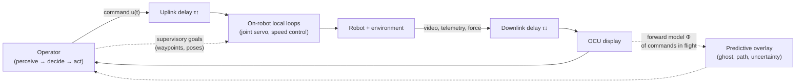

# 06.5 · Teleoperation & human–machine interfaces

<div class="module-card">

**Prerequisites** [06.2 Spatial mathematics](lessons/stage-06/lesson-02.md) (frames, camera geometry) · [06.4 Mobile bases and control](lessons/stage-06/lesson-04.md) (PID, state-space, skid-steer kinematics) · Laplace transforms and Bode/Nyquist basics.

**Estimated time** 7 h (3.5 h theory · 1.5 h simulator · 2 h programming) · **Level** Advanced

**Next** [06.9 Communications, reliability & fail-safe design](lessons/stage-06/lesson-09.md), then [07.2 Incident management](lessons/stage-07/lesson-02.md).

<p class="tags"><span>human factors</span><span>control theory</span><span>time delay</span><span>haptics</span><span>HRI</span><span>Sim B</span><span>P11</span></p>
</div>

## Why this matters

An EOD robot exists to put distance between a person and a hazard. The price of that distance
is that the person now perceives the scene through a few cameras, acts through a joystick and a
radio link, and receives the consequences of each action a fraction of a second — sometimes
seconds — late. Most field failures of teleoperated robots are not mechanical; they are failures
of the *human–robot system*: the operator did not see the obstacle behind the track, misjudged
depth to a gripper target, over-corrected under delay, or lost track of where the arm was
relative to the body (Murphy's analysis of disaster deployments and Chen, Haas & Barnes' review
of teleoperation human factors both make this point). Designing a good operator control unit
(OCU) and a good control architecture is therefore as safety-critical as designing the chassis.

This lesson treats the human operator as a component in a feedback loop with a delay, derives
what that delay does to stability, and then works outward to the tools that restore
performance: predictive displays, supervisory control, force feedback made passive under delay,
and interface design grounded in situational-awareness and workload theory.

## Learning objectives

1. Model the operator–robot loop with transmission delay and **derive the stability limit** for a
   proportional controller acting on an integrating plant with delay ($K\tau < \pi/2$); compute
   phase margin and delay margin for a given loop.
2. Explain Ferrell's **move-and-wait** result quantitatively and predict task time as a function of
   delay and required precision.
3. Design a **Smith predictor** and a **predictive display**, and state exactly what model errors
   each is sensitive to.
4. Allocate functions of an EOD robot across the **four stages × ten levels** of automation of
   Parasuraman, Sheridan & Wickens (2000) and justify which must remain human.
5. Explain why naive force-reflecting teleoperation becomes unstable under delay, show that the
   **wave-variable** transformation makes the channel passive, and quantify the transparency
   cost ($m \approx b\tau$, $k \approx b/\tau$).
6. Evaluate an OCU design using Endsley's three-level SA model, **NASA-TLX** workload, a latency
   budget, and stereo depth-resolution arithmetic.

## Theory

### 1. The operator in the loop: delay budget

Every teleoperation loop has an end-to-end (glass-to-glass plus command) delay that is the sum of
many small pieces. A typical digital video loop:

| Stage | Typical (ms) | Notes |
|---|---|---|
| Camera exposure + readout | 33 | one frame at 30 fps |
| Encode (H.264/H.265) | 15 | depends on GOP/latency tuning |
| Packetisation + radio MAC | 20 | retransmissions add jitter |
| Radio / relay transport | 60 | multi-hop and congestion dominate |
| Jitter buffer + decode | 15 | a buffer trades delay for smoothness |
| Display scan-out | 17 | 60 Hz panel |
| Command uplink + motor controller | 10 | the "other half" of the loop |
| **Round trip seen by the operator** | **≈ 170** | |

```python
import numpy as np
budget_ms = {"capture": 33, "encode": 15, "mac": 20, "transport": 60,
             "decode": 15, "display": 17, "uplink": 10}
print(sum(budget_ms.values()))   # 170 ms
```

Two lessons follow. First, a *jitter buffer* is a deliberate delay: a system tuned for smooth
video can be worse for control than one that drops frames. Second, the network term is the only
one that grows with distance and relays (06.9), so it dominates in the field. The research
reviewed by Chen, Haas & Barnes (2007) reports measurable performance degradation from delays of
a few hundred milliseconds and, as delays approach a second or more, a qualitative change of
strategy — operators stop controlling continuously.

<details class="answer"><summary>Exercise 1 — then reveal</summary>

A team adds a second relay hop that contributes 45 ms of transport delay and needs a 60 ms jitter
buffer instead of 15 ms to keep the video smooth. What is the new round-trip, and by what fraction
has it grown?

*Answer.* $170 + 45 + (60-15) = 260$ ms, a 53 % increase. With the stability limit derived in §3
($K < \pi/2\tau$), the maximum usable loop gain drops by the same factor ($170/260 = 0.65$).

</details>

### 2. Move-and-wait (Ferrell 1965)

Ferrell asked operators to perform positioning tasks through a manipulator with a transmission
delay of up to a few seconds. The robust observation was that operators abandon continuous
control and adopt a **move-and-wait** strategy: make an open-loop move, stop, wait for the
delayed picture to settle, then correct. Completion time grows approximately linearly with delay,
with a slope equal to the number of discrete corrective moves — and that number grows with the
precision required.

A stylised model that reproduces this: each open-loop move leaves a residual error that is a
fraction $\varepsilon$ of the error before it. To bring an initial error $D$ inside a target of
width $W$ (i.e. error $\le W/2$) needs

$$ n = \left\lceil \frac{\ln(2D/W)}{\ln(1/\varepsilon)} \right\rceil, \qquad T(\tau) \approx n\,(t_m + \tau), $$

| Symbol | Meaning | Unit |
|---|---|---|
| $D$ | initial distance to target | m |
| $W$ | target width (tolerance) | m |
| $\varepsilon$ | fractional residual error per open-loop move | — |
| $n$ | number of move-and-wait cycles | — |
| $t_m$ | duration of one move | s |
| $\tau$ | round-trip delay | s |
| $T$ | task completion time | s |

**Intuition.** $\ln(2D/W)$ is (up to a base change) Fitts' index of difficulty: the information
the operator must "transmit" to the manipulator. Each move transmits $\ln(1/\varepsilon)$ nats;
each move costs one round-trip of waiting. Delay does not change *what* must be done, it
multiplies the cost of each feedback cycle.

**Numerical example.** $D=0.50$ m, $W=0.02$ m, $\varepsilon=0.2$, $t_m=0.8$ s:
$\ln 50/\ln 5 = 2.43 \Rightarrow n=3$. Then $T = 2.4$ s (no delay), 3.9 s ($\tau=0.5$ s),
5.4 s ($\tau=1$ s), 8.4 s ($\tau = 2$ s). Slope $\partial T/\partial\tau = n = 3$.

```python
import math
def move_and_wait_time(D, W, eps, t_move, tau):
    n = math.ceil(math.log(2 * D / W) / math.log(1 / eps))
    return n, n * (t_move + tau)

for tau in (0, 0.5, 1, 2):
    print(tau, move_and_wait_time(0.5, 0.02, 0.2, 0.8, tau))
```

<div class="callout key">

**Key idea.** The model is a simplification (real $\varepsilon$ varies with distance, fatigue and
display quality), but its structure is right: under delay, *precision* is paid for in round-trips.
Two design levers follow: reduce $\tau$, or reduce $n$ — by making each open-loop move more
accurate (better depth cues, predictive displays, automated fine positioning).

</div>

<details class="answer"><summary>Exercise 2 — then reveal</summary>

The tolerance is tightened from 20 mm to 5 mm. With $\varepsilon=0.2$ and $\tau=1$ s, how much
longer does the task take? What $\varepsilon$ would restore the original $n=3$?

*Answer.* $\ln(200)/\ln 5 = 3.29 \Rightarrow n = 4$; $T = 4 \times 1.8 = 7.2$ s (vs 5.4 s).
For $n=3$ we need $\ln(1/\varepsilon) \ge \ln(200)/3 = 1.766$, i.e. $\varepsilon \le 0.171$ — a
17 % better open-loop move buys back a whole round-trip.

</details>

### 3. The control-theoretic view: delay eats phase margin

A pure delay has transfer function $e^{-s\tau}$: magnitude 1 at every frequency, phase
$-\omega\tau$ that grows without bound. In a loop with crossover frequency $\omega_c$ it removes
phase margin

$$ \Delta\phi = \omega_c \tau \quad [\text{rad}], \qquad \tau_{\max} = \frac{\mathrm{PM}}{\omega_c} . $$

$\tau_{\max}$ is the **delay margin**: the extra delay that brings the loop to the edge of
instability.

**Derivation of the proportional-control limit.** Model the operator (or an automatic
position loop) as a proportional controller with gain $K$ acting on position error, driving a
velocity-commanded base — an integrator, $G(s)=1/s$. With round-trip delay $\tau$ the open loop is

$$ L(s) = \frac{K e^{-s\tau}}{s}. $$

1. Gain crossover: $|L(j\omega)| = K/\omega = 1 \Rightarrow \omega_c = K$ (delay does not change
   the magnitude).
2. Phase at crossover: $\angle L(j\omega_c) = -\tfrac{\pi}{2} - K\tau$.
3. Nyquist/Bode stability requires phase above $-\pi$ at crossover:
   $-\tfrac{\pi}{2} - K\tau > -\pi$, hence

<div class="callout eq">

$$ K\tau < \frac{\pi}{2}, \qquad \mathrm{PM} = \frac{\pi}{2} - K\tau, \qquad K_{\mathrm{PM}} = \frac{\pi/2 - \mathrm{PM}}{\tau}. $$

</div>

(Exactly at $K\tau = \pi/2$ the closed-loop characteristic equation $s + Ke^{-s\tau}=0$ has roots
$s=\pm jK$: a sustained oscillation at $\omega = K$.)

| Symbol | Meaning | Unit |
|---|---|---|
| $K$ | proportional gain (velocity per unit position error) | s⁻¹ |
| $\tau$ | round-trip delay | s |
| $\omega_c$ | gain-crossover frequency | rad s⁻¹ |
| PM | phase margin | rad (or °) |

**Intuition.** The loop's bandwidth $\omega_c \approx K$ sets how fast it reacts; delay sets how
stale its information is. When the loop tries to react faster than about a quarter-period of its
own delay, it corrects errors that have already been corrected — and oscillates. A human operator
does the same thing and "learns" to lower their own gain, which is move-and-wait seen through
control theory.

**Numerical example.** $\tau=0.5$ s: $K_{\max}=\pi/(2\cdot0.5)=3.14$ s⁻¹. For a 45° phase
margin, $K = \pi/(4\tau) = 1.57$ s⁻¹, giving a closed-loop time constant of roughly
$1/K \approx 0.64$ s. Simulated step responses (integrator plant, $\tau=0.5$ s): $K=1$ is
well-damped; $K=1.57$ overshoots by 29 %; $K=2.5$ rings for many seconds; $K=4$ diverges.
Delay margin of a loop with PM = 50° at $\omega_c = 2$ rad/s: $0.873/2 = 0.44$ s.

```python
import numpy as np
def p_loop_with_delay(K, tau, T=10.0, dt=1e-3, r=1.0):
    """Integrator plant x' = u(t - tau), u = K (r - x). Returns x(t)."""
    N, d = int(T / dt), int(round(tau / dt))
    u = np.zeros(N); x = np.zeros(N)
    for k in range(1, N):
        u[k - 1] = K * (r - x[k - 1])
        x[k] = x[k - 1] + (u[k - 1 - d] if k - 1 - d >= 0 else 0.0) * dt
    return x

for K in (1.0, 1.57, 2.5, 4.0):
    x = p_loop_with_delay(K, 0.5)
    print(K, round(x.max(), 3), round(x[-1], 3))
```

<details class="answer"><summary>Exercise 3 — derive, then reveal</summary>

Repeat the derivation for a plant with a first-order lag, $G(s) = 1/\big(s(T_m s+1)\big)$ (motor
time constant $T_m$), and show that the stability condition becomes
$K\tau + \arctan(\omega_c T_m) < \pi/2$ with $\omega_c$ solving $K = \omega_c\sqrt{1+\omega_c^2T_m^2}$.
For $T_m = 0.2$ s and $\tau = 0.5$ s, what is the maximum $K$ (numerically)?

*Answer.* Phase is $-\pi/2 - \arctan(\omega T_m) - \omega\tau$; the crossover condition replaces
$\omega_c = K$. Solving $\omega\tau + \arctan(0.2\,\omega) = \pi/2$ gives $\omega_c \approx 2.28$ rad/s,
and $K_{\max} = 2.28\sqrt{1+0.457^2} \approx 2.51$ s⁻¹ — lower than 3.14 because the lag already
spends phase.

</details>

### 4. Smith predictor: removing the delay from the characteristic equation

If the plant model $G_0(s)$ and delay are known, the controller can close its loop around a
*delay-free model* and use the real (delayed) measurement only to correct model error. With
controller $C(s)$, Smith (1957) showed the effective controller

$$ C^\ast(s) = \frac{C(s)}{1 + C(s)G_0(s)\big(1-e^{-s\tau}\big)} $$

yields the closed loop

$$ \frac{Y(s)}{R(s)} = \frac{C G_0}{1 + C G_0}\,e^{-s\tau} . $$

The delay has moved *outside* the loop: the response is the delay-free design, shifted by $\tau$.

**Numerical example.** Integrator plant, $\tau = 0.5$ s, $K = 4$ s⁻¹ (unstable without the
predictor, since $K\tau = 2 > \pi/2$). With a Smith predictor the response is a first-order lag
of time constant $1/K=0.25$ s after a 0.5 s dead time: at $t = 1.5$ s,
$y = 1 - e^{-(1.5-0.5)/0.25} = 0.982$ (simulation: 0.983).

**Sensitivity.** The Smith predictor is only as good as its delay and plant model. In the same
simulation, the loop remained stable with model delays from about 0.1 s to 0.8 s but went
unstable at 0.9 s (true 0.5 s): *over-estimating* the delay by 80 % destroyed it. Radio links
have *variable* delay, so field implementations time-stamp commands and telemetry and predict
using the measured delay per packet.

```python
def smith_loop(K, tau, tau_model, T=10.0, dt=1e-3, r=1.0):
    N, d, dm = int(T / dt), int(round(tau / dt)), int(round(tau_model / dt))
    u = np.zeros(N); x = np.zeros(N); xm = np.zeros(N)   # xm: undelayed model output
    for k in range(1, N):
        xm_delayed = xm[k - 1 - dm] if k - 1 - dm >= 0 else 0.0
        e = r - (x[k - 1] + xm[k - 1] - xm_delayed)       # measured + (model - delayed model)
        u[k - 1] = K * e
        xm[k] = xm[k - 1] + u[k - 1] * dt
        x[k] = x[k - 1] + (u[k - 1 - d] if k - 1 - d >= 0 else 0.0) * dt
    return x

print(smith_loop(4.0, 0.5, 0.5)[1500])   # ~0.98
```

<details class="answer"><summary>Exercise 4 — then reveal</summary>

Why is a Smith predictor fundamentally unable to help the operator react to an *unexpected*
event in the scene (e.g. debris shifting), even with a perfect model?

*Answer.* It cancels delay only for the *consequences of the operator's own commands*, which the
model can predict. Exogenous events enter through the delayed measurement and cannot be seen
earlier than $\tau_{\text{down}}$ by any predictor. Disturbance rejection is still delay-limited,
which is why reducing physical delay remains valuable.

</details>

### 5. Predictive displays

A predictive display is a Smith predictor for the human. The OCU draws, over the delayed video,
where the robot (or gripper) *will be* when the commands already sent have taken effect:

$$ \hat{\mathbf{x}}(t) = \Phi\big(\mathbf{x}_{\text{meas}}(t-\tau_{\downarrow}),\ \{\mathbf{u}(s)\}_{s\in[t-\tau,\,t]}\big), $$

where $\Phi$ integrates the kinematic model (06.4) from the last measured state over the commands
still "in flight". Typical renderings: a ghost outline of the chassis or arm, a projected track
path on the ground plane, or a wireframe gripper overlaid on video.

| Symbol | Meaning | Unit |
|---|---|---|
| $\mathbf{x}_{\text{meas}}$ | last received state (pose, joint angles) | m, rad |
| $\tau_{\downarrow}$, $\tau$ | downlink delay, round-trip delay | s |
| $\mathbf{u}$ | commands sent but not yet reflected in telemetry | m s⁻¹, rad s⁻¹ |
| $\Phi$ | forward model (kinematics, possibly with slip) | — |

**Error growth.** If the model's speed has relative error $\sigma_v/v$, the prediction error grows
linearly with horizon: $\sigma_x \approx \sigma_v\,\tau$. For $v=0.5$ m/s, 5 % speed error and
$\tau=1$ s, the ghost is uncertain by $\approx 2.5$ cm — small compared with a 1 s×0.5 m/s =
50 cm uncorrected lag. Heading errors under skid-steer slip grow faster (06.6), so good
predictive displays draw an uncertainty band, not a sharp ghost.

```python
def predict_pose(x, y, th, cmds, dt):
    """Integrate unicycle commands (v, w) still in flight from the last measured pose."""
    for v, w in cmds:
        x += v * np.cos(th) * dt; y += v * np.sin(th) * dt; th += w * dt
    return x, y, th

print(predict_pose(0, 0, 0, [(0.5, 0.0)] * 10, 0.1))   # 0.5 m ahead after 1 s in flight
```

<details class="answer"><summary>Exercise 5 — then reveal</summary>

The predictive display integrates track speeds with the no-slip skid-steer model, but on gravel
the effective yaw rate is only 2/3 of the model's. For a commanded turn of 0.6 rad/s over
$\tau=1.2$ s, how large is the heading error of the ghost, and how far is the ghost's position
off after the robot then drives 2 m straight?

*Answer.* Heading error $= 0.6\times1.2\times(1-2/3) = 0.24$ rad (13.8°). Lateral error after 2 m
$\approx 2\sin(0.24) = 0.475$ m. Slip parameters must be estimated online (06.6) or the ghost lies.

</details>

### 6. Supervisory control and levels of automation

Sheridan's **supervisory control** reframes the operator as someone who plans, teaches,
monitors, intervenes and learns, while local loops on the robot close fast control. Under delay
this is the principled escape from move-and-wait: send *goals* ("move gripper 10 cm along the
camera ray", "drive to that waypoint") instead of rates, and let an onboard controller with no
transmission delay execute them.

Parasuraman, Sheridan & Wickens (2000) give a two-axis framework: four **stages** of
information processing — (1) information acquisition, (2) information analysis, (3) decision and
action selection, (4) action implementation — each of which can be automated at one of ten
**levels**, from 1 (the computer offers no assistance) to 10 (the computer decides and acts,
ignoring the human). Intermediate levels include suggesting alternatives (≈3–4), executing a
suggestion if the human approves (5), allowing a veto window before automatic execution (6), and
executing then informing (7).

| Robot function | Stage | Reasonable level | Why |
|---|---|---|---|
| Camera stabilisation, auto-exposure | 1 | 8–10 | fast, low consequence, human cannot do it |
| Obstacle / drop-off highlighting | 2 | 5–7 | aids SA; false alarms tolerable |
| Suggested approach path (06.8) | 3 | 3–4 | human must own route choice near a hazard |
| Stair-climb posture, track tension | 4 | 7 | low-level execution, monitored |
| Arm joint servoing to a commanded pose | 4 | 8 | delay-free local loop |
| Any interaction with the suspected item | 3–4 | ≤ 5 | consequence is irreversible; human decision |
| Loss-of-comms behaviour (06.9) | 3–4 | 10 (by necessity) | no human in the loop when the link is down |

<div class="callout safety">

**Design principle.** Automate by *consequence and reversibility*, not by capability. High levels
of automation for reversible, well-modelled actions; human authority for irreversible ones. And
note the automation paradoxes the framework was built to expose: complacency, skill decay, and
"automation surprises" when the operator's mental model of the mode differs from the robot's.
Every automated mode must be *visible* on the OCU.

</div>

There is no equation here, but there is a quantitative argument. If an operator must approve
each of $m$ automated suggestions with probability $p$ of a lapse (approving a wrong one), the
chance of at least one bad approval in a task is $1-(1-p)^m$. For $p = 0.02$ and $m = 30$ that is
45 %. Level 5 is not free: approval fatigue is a failure mode, which argues for fewer,
higher-value human decisions.

```python
p, m = 0.02, 30
print(1 - (1 - p) ** m)   # 0.455
```

<details class="answer"><summary>Exercise 6 — then reveal</summary>

Redesign the above so that the operator makes only 5 decisions per task, each with lapse
probability 0.03 (harder decisions). What is the task-level failure probability, and what does
this imply about where to put the human?

*Answer.* $1-0.97^5 = 0.141$. Fewer, well-framed decisions beat many rubber-stamp approvals — as
long as the automation between decisions is reliable. Put the human at the high-consequence
branch points.

</details>

### 7. Situational awareness (Endsley 1995)

Endsley defines SA as (1) **perception** of the elements in the environment, (2)
**comprehension** of their meaning, and (3) **projection** of their status into the near future.
For an EOD robot operator:

| SA level | Robot-operator example | Typical interface failure |
|---|---|---|
| 1 Perception | a cable snagged on the rear track | "keyhole" camera view; no rear/overview camera |
| 2 Comprehension | the arm is near its joint limit, the robot is on a slope | joint angles shown as numbers, not as a pose |
| 3 Projection | turning now will swing the arm into the door frame | no predictive display; no footprint overlay |

SA is measured, not asserted: **SAGAT** freezes a simulation at random times and asks queries at
each level; accuracy against ground truth is the score. This is directly implementable in Sim B
and P11.

### 8. Workload: NASA-TLX

NASA-TLX (Hart & Staveland, 1988) rates six subscales on 0–100 — mental demand, physical demand,
temporal demand, performance, effort, frustration — and weights them by 15 pairwise comparisons:

$$ \mathrm{TLX}_w = \frac{1}{15}\sum_{i=1}^{6} w_i r_i, \qquad \sum_i w_i = 15, \qquad \mathrm{RTLX} = \frac16\sum_i r_i . $$

| Symbol | Meaning | Unit |
|---|---|---|
| $r_i$ | subscale rating | 0–100 |
| $w_i$ | number of times subscale $i$ was chosen in the 15 pairs | 0–5 |
| RTLX | "raw" unweighted variant, widely used | 0–100 |

**Numerical example.** $r = (70, 40, 80, 30, 60, 50)$, $w = (4, 1, 5, 0, 3, 2)$:
$\mathrm{TLX}_w = 1000/15 = 66.7$; RTLX $= 330/6 = 55.0$. The weighting emphasises the
subscales this operator found most relevant (temporal and mental demand).

```python
r = np.array([70, 40, 80, 30, 60, 50]); w = np.array([4, 1, 5, 0, 3, 2])
assert w.sum() == 15
print((w * r).sum() / 15, r.mean())   # 66.7, 55.0
```

<details class="answer"><summary>Exercise 7 — then reveal</summary>

In a P11 experiment, 10 operators do a task with and without a predictive display. Mean RTLX
drops from 62 to 54 and completion time drops from 140 s to 118 s. Why is it wrong to conclude
the display "reduced workload by 13 %"? What design would you use?

*Answer.* TLX is ordinal-ish, subjective, and between-person scales differ; with 10 subjects the
difference may not be significant. Use a within-subject (crossover) design with counterbalanced
order, report paired differences with confidence intervals, and triangulate with performance
(time, errors, collisions) and SA (SAGAT) rather than headline percentages.

</details>

### 9. Force feedback and bilateral teleoperation under delay

In **bilateral** teleoperation the master (hand controller) sends motion to the slave (robot arm)
and the slave sends contact force back. Without delay this gives the operator a sense of touch —
valuable when probing or when the camera cannot see contact. With delay, the naive
"position forward, force back" architecture is notoriously unstable: Anderson & Spong (1989)
showed that the communication block itself is *non-passive* — it can generate energy — and
Hokayem & Spong (2006) survey the resulting line of work.

**Passivity.** A two-port with inputs/outputs (force $F$, velocity $v$) at each end is passive if
the net energy it outputs never exceeds what was put in:

$$ \int_0^t \big(F_m(s)\,v_m(s) - F_s(s)\,v_s(s)\big)\,ds \;\ge\; -E(0) \quad \forall t. $$

Humans and passive environments are (approximately) passive; interconnections of passive systems
are stable. So if the channel is passive, the whole loop is stable *for any delay*.

**Wave variables** (Niemeyer & Slotine 1991) encode power variables as

$$ u = \frac{F + b\,v}{\sqrt{2b}}, \qquad w = \frac{F - b\,v}{\sqrt{2b}}, \qquad F\,v = \tfrac12\left(u^2 - w^2\right), $$

and transmit $u$ forward and $w$ backward. A delay applied to $u$ and $w$ can only store energy
(what is in flight), never create it, so the channel is passive for any constant delay.

| Symbol | Meaning | Unit |
|---|---|---|
| $F$ | force at a port | N |
| $v$ | velocity at a port | m s⁻¹ |
| $b$ | wave impedance (tuning parameter) | N s m⁻¹ |
| $u$, $w$ | forward / returning wave variables | $\sqrt{\text{W}}$ |

**Numerical example.** $b=10$ N s/m, $F=5$ N, $v=0.2$ m/s: $u = 7/\sqrt{20} = 1.565$,
$w = 3/\sqrt{20} = 0.671$; $\tfrac12(u^2-w^2) = 1.00$ W $= Fv$. Power is exactly accounted for.

**The price: transparency.** At low frequency a wave channel with one-way delay $T$ feels, in free
motion, like an added mass $m \approx bT$, and against a rigid wall like a spring
$k \approx b/T$. For $b = 10$ N s/m and $T = 0.2$ s: 2 kg of phantom inertia and a "wall" of
50 N/m — softer than a rubber band. Raising $b$ stiffens contact but makes free motion heavier.
This stability–transparency trade-off is fundamental; wave-variable prediction, time-domain
passivity control and model-mediated teleoperation are ways of spending model knowledge to buy
some of it back.

```python
def wave_encode(F, v, b):
    s = np.sqrt(2 * b)
    return (F + b * v) / s, (F - b * v) / s

u, w = wave_encode(5.0, 0.2, 10.0)
print(u, w, 0.5 * (u**2 - w**2))          # 1.565, 0.671, 1.0 W
b, T = 10.0, 0.2
print("phantom mass", b * T, "kg; wall stiffness", b / T, "N/m")
```

<details class="answer"><summary>Exercise 8 — then reveal</summary>

The operator wants contact to feel at least 500 N/m stiff while one-way delay is 0.2 s. What $b$
is needed, and what free-motion inertia will they then feel? Is force feedback worth it at this
delay?

*Answer.* $b = kT = 100$ N s/m; phantom mass $bT = 20$ kg. Free motion becomes sluggish. At 0.2 s
one-way delay, a common engineering answer is to use force information *locally* (on-robot
compliance/impedance control and force thresholds that stop motion) and display force
*visually or as a vibrotactile cue* rather than full bilateral coupling.

</details>

### 10. Cameras, depth perception and the OCU

Most EOD robot manipulation is done with monocular cameras, so depth is inferred from cues —
occlusion, relative size, shadows, motion parallax from moving the camera, and the robot's own
body in view. Two practical rules: (1) give at least one camera a view roughly **orthogonal** to
the approach direction (a side or overview camera), so the depth error of the gripper camera
becomes a lateral error in the other; (2) mount a camera so part of the gripper is always in the
frame, so the operator judges gripper–object relationships, not absolute distance.

With stereo, depth resolution follows from $Z = fB/d$:

$$ \delta Z \approx \frac{Z^2}{f B}\,\delta d, \qquad \mathrm{HFOV} = 2\arctan\frac{w_{\text{px}}}{2f}. $$

| Symbol | Meaning | Unit |
|---|---|---|
| $Z$ | depth | m |
| $f$ | focal length | px |
| $B$ | stereo baseline | m |
| $d$, $\delta d$ | disparity and its error | px |
| $w_{\text{px}}$ | image width | px |

**Numerical example.** $f = 800$ px, $B = 0.12$ m, $Z = 1.5$ m, $\delta d = 0.5$ px: disparity
64 px, $\delta Z = 2.25\times0.5/96 = 1.2$ cm. At 3 m it is 4.7 cm — quadratic growth. A 640 px
wide image with $f = 800$ px has HFOV $43.6°$: a "keyhole".

```python
f, B, Z, dd = 800.0, 0.12, 1.5, 0.5
print(Z**2 * dd / (f * B))                        # 0.0117 m
print(np.degrees(2 * np.arctan(640 / (2 * f))))   # 43.6 deg
```

**OCU design principles** (synthesised from Chen et al. 2007, Endsley 1995 and field experience
reported by Murphy 2014):

| Principle | Rationale |
|---|---|
| Show the robot's pose as a 3D model, not numbers | supports SA level 2 (comprehension) |
| Fuse camera views around a common frame; draw the footprint and arm envelope | combats keyhole effect |
| Display latency, link quality and battery with trend, not only value | supports SA level 3 (projection) |
| Make modes explicit; one control mapping per mode; no hidden mode changes | prevents automation surprises |
| Controls in the camera's frame when manipulating ("push right moves right in the image") | reduces mental rotation (06.2) |
| Two-person operation: driver plus observer | Murphy's field data: a second person markedly improves SA |
| Glove-compatible, sunlight-readable, robust to one-handed use | real field conditions |

<details class="answer"><summary>Exercise 9 — then reveal</summary>

You can either double the stereo baseline or double the focal length (halving the FOV). Which
gives better depth resolution at 1.5 m, and what does each cost?

*Answer.* Both halve $\delta Z$ (0.59 cm). Doubling $f$ halves the FOV to ≈ 22.6°, worsening the
keyhole effect; doubling $B$ increases the minimum working distance (larger disparities up close,
more occlusion differences between views) and the size of the camera head. For manipulation near
the gripper, baseline is usually the better spend.

</details>

## Visual explanation



The dashed paths are the two ways out of the delay trap: predict (display the future) or
delegate (send goals to delay-free local loops).

<iframe class="sim-frame" src="sims/eod-robot/index.html?embed=1" height="720" loading="lazy"></iframe>

<a class="sim-link" href="sims/eod-robot/index.html" target="_blank">Open Sim B full-screen ↗</a>

## Worked example — sizing a manipulation interface for a 0.8 s link

*Fictional scenario.* A team operates a tracked robot through two relays; measured round-trip
delay is 0.8 s ± 0.15 s. The task: position the gripper within ±1 cm of a fictional marker on a
box 60 cm away, then inspect it with a close-up camera.

1. **Direct rate control?** The operator-as-P-controller limit is $K < \pi/(2\cdot0.95) = 1.65$
   s⁻¹ at the worst-case delay; for 45° PM, $K\approx0.83$ s⁻¹: a closed-loop time constant of
   1.2 s. Continuous control will be slow and oscillation-prone.
2. **Move-and-wait estimate.** $D=0.6$, $W=0.02$, $\varepsilon=0.2$: $\ln 60/\ln 5 = 2.54
   \Rightarrow n=3$; with $t_m=1$ s, $T\approx 3\times1.8=5.4$ s per axis-aligned approach, more
   with poor depth cues ($\varepsilon=0.35$ gives $n=4$, 7.2 s).
3. **Supervisory alternative.** The operator clicks the marker in two orthogonal views; the OCU
   triangulates (06.2) and sends a Cartesian goal; the onboard joint loop (no transmission delay)
   executes with a speed limit; a predictive ghost shows the commanded pose before execution
   (level 5: execute on approval). Human decisions: 1 approval per approach.
4. **Error budget of the automated approach.** Triangulation with two cameras at 90° and 0.5 px
   click error at 1.5 m range with $f=800$ px gives ≈ 1 mm lateral error per view; arm
   repeatability and calibration dominate (a few mm). Meets ±1 cm.
5. **Force.** One-way delay 0.4 s is too long for comfortable bilateral coupling
   ($k=b/T$ requires $b=200$ N s/m for 500 N/m ⇒ 80 kg phantom mass). Use on-robot force
   thresholds that stop motion, and a visual force bar.
6. **Evaluation.** Crossover experiment in P11: direct vs supervisory, measure time, final error,
   collisions, RTLX and SAGAT accuracy.

## Simulation work

<div class="callout sim">

**Sim B, latency panel.** (1) Set latency to 0, 250, 500 and 1000 ms and drive the robot through
the doorway course using continuous joystick control; record time and collisions. Plot time vs
latency — is it linear, and what is the slope? (2) At 1000 ms, enable the predictive overlay and
repeat. (3) Turn on jitter (±30 %) with the predictive overlay on: how does the ghost behave, and
why? (4) Switch the arm to waypoint (supervisory) mode and repeat the gripper-positioning task.
Record your subjective RTLX after each condition.

</div>

## Practical exercises

<details class="answer"><summary>Practical 1 — delay margin of an existing loop</summary>

A robot's heading loop has crossover 1.5 rad/s and phase margin 55° with the operator's typical
gain on a local network (40 ms). The field radio adds 300 ms. Is it still stable, and what is the
remaining phase margin?

*Answer.* Added phase at crossover: $1.5\times0.3 = 0.45$ rad $= 25.8°$. Remaining PM ≈ 29° —
stable but lightly damped (expect ≈ 35–40 % overshoot). Delay margin was $0.96/1.5 = 0.64$ s total
extra delay.

</details>

<details class="answer"><summary>Practical 2 — function allocation</summary>

Place "detect that the robot is about to tip on a slope" and "correct tip-over by moving the arm
to lower the centre of mass" on the Parasuraman stage/level grid. Justify.

*Answer.* Detection: stage 2 (analysis), level 7 — the system should warn autonomously and
continuously (fast, well-modelled physics, humans are poor at judging tilt through a camera).
Correction: stage 4 (implementation), level 6 — propose and execute unless vetoed within a short
window; but if the arm is holding or near an item, drop to level 4–5, because arm motion there is
a high-consequence action.

</details>

<details class="answer"><summary>Practical 3 — interface critique</summary>

An OCU shows four camera tiles of equal size, battery as a percentage, and a text log of warnings.
List three changes grounded in SA theory and one grounded in the delay analysis.

*Answer.* (SA-1) enlarge the task camera and make others context views; add a synthetic top-down
view with the footprint. (SA-2) show battery as time remaining at current draw; show arm pose on
a 3D model. (SA-3) trend arrows on link quality; predicted remaining range. (Delay) show measured
round-trip latency prominently and a predictive ghost, and grey out continuous-rate modes when
latency exceeds a threshold.

</details>

## Programming exercise — a teleoperation experiment harness

**Goal.** Build a minimal delayed-teleoperation simulator and quantify the benefit of prediction.

- **Input:** a 2D unicycle robot (06.4), a course of waypoints, a channel with delay
  $\tau\sim\mathcal{U}[\tau_0-j,\tau_0+j]$ and packet loss $p$; a synthetic "operator" = P
  controller on the *displayed* heading and distance error, with its own reaction time.
- **Output:** trajectory, completion time, path-length ratio, cross-track error RMS; plots vs
  $\tau_0$ for three display modes: raw delayed, Smith-style predictive, predictive with 20 %
  model gain error.
- **Constraints:** NumPy + Matplotlib; fixed seeds; time-stamped packets (no global clock
  cheating on the operator side).
- **Expected behaviour:** raw mode goes oscillatory near $K\tau \approx \pi/2$; predictive mode
  stays stable well beyond; model error degrades it gracefully until instability at large
  mismatch.
- **Test cases:** (i) $\tau=0$: all modes identical; (ii) constant delay, perfect model:
  predictive completion time equals the zero-delay time plus $\tau$ (± one time-step); (iii) the
  oscillation frequency at the stability limit equals $K$ within 5 %.
- **Extensions:** replace the synthetic operator with keyboard input (pygame) and run a small
  within-subject study; add wave-variable force feedback to a 1-DOF master–slave pair and verify
  energy balance numerically.

This is [Project P11](projects/p11-teleoperation/README.md); P05 provides the robot and channel
models.

## Reading

- Chen, J. Y. C., Haas, E. C. & Barnes, M. J., "Human Performance Issues and User Interface
  Design for Teleoperated Robots", *IEEE Trans. SMC Part C* 37(6) (2007),
  https://doi.org/10.1109/TSMCC.2007.905819 — read the sections on latency, frame rate and field of
  view; the best single review.
- Ferrell, W. R., "Remote manipulation with transmission delay", *IEEE Trans. Human Factors in
  Electronics* 6 (1965), https://ntrs.nasa.gov/citations/19660064449 — short; the origin of
  move-and-wait.
- Parasuraman, R., Sheridan, T. B. & Wickens, C. D., "A model for types and levels of human
  interaction with automation", *IEEE Trans. SMC Part A* 30(3) (2000),
  https://doi.org/10.1109/3468.844354 — the four-stage model and its evaluative criteria.
- Endsley, M. R., "Toward a Theory of Situation Awareness in Dynamic Systems", *Human Factors*
  37(1) (1995), https://journals.sagepub.com/doi/10.1518/001872095779049543 — the three levels and
  their measurement.
- Hokayem, P. F. & Spong, M. W., "Bilateral teleoperation: An historical survey", *Automatica*
  42(12) (2006), https://doi.org/10.1016/j.automatica.2006.06.027 — passivity, scattering and
  wave variables.
- Farajiparvar, P., Ying, H. & Pandya, A., "A Brief Survey of Telerobotic Time Delay Mitigation",
  *Frontiers in Robotics and AI* (2020),
  https://www.frontiersin.org/journals/robotics-and-ai/articles/10.3389/frobt.2020.578805/full —
  open access; bridges predictive control and learned predictors.

Also: Sheridan, *Telerobotics, Automation, and Human Supervisory Control*, MIT Press (1992),
https://archive.org/details/teleroboticsauto0000sher (chapters on supervisory control), and
Murphy, *Disaster Robotics*, MIT Press (2014). Full bibliographic entries:
[curriculum/sources.md](curriculum/sources.md).

## Assessment

1. *(Mathematical)* Show that for $L(s)=Ke^{-s\tau}/s$ the closed loop at $K\tau=\pi/2$
   oscillates at $\omega=K$. What is the period for $\tau = 0.4$ s?
2. *(Conceptual)* Explain why a Smith predictor improves command-following but not
   disturbance rejection, and relate this to what a predictive display can and cannot show.
3. *(Computation)* A wave-variable channel has $b = 40$ N s/m and one-way delay 50 ms. What
   phantom mass and wall stiffness does the operator feel?
4. *(Design)* Choose automation levels for the four stages for a *search-and-inspect* phase
   (robot approaching an area to look, not touch). Justify the level for stage 3.
5. *(Interpretation)* In an experiment, move-and-wait time vs delay has slope 5.2 s/s for task A
   and 2.1 s/s for task B. What does this say about the tasks, and which benefits more from a
   predictive display?

<details class="answer"><summary>Answers to 1, 3 and 5</summary>

1. Characteristic equation $s + Ke^{-s\tau}=0$; try $s=j\omega$: $j\omega + K(\cos\omega\tau -
   j\sin\omega\tau)=0 \Rightarrow \cos\omega\tau=0$, $\omega=K\sin\omega\tau$; with
   $\omega\tau=\pi/2$, $\omega=K$. $K=\pi/(2\cdot0.4)=3.93$ rad/s, period $2\pi/K = 1.6$ s ($=4\tau$).
3. $m = bT = 2$ kg; $k = b/T = 800$ N/m.
5. Slope ≈ number of move-and-wait cycles: A needs ~5 corrections (precise/poorly perceived), B
   ~2. A benefits more — prediction and better depth cues reduce $n$, which multiplies delay.

</details>

## Expert extension

- **Model-mediated teleoperation.** Instead of transmitting force, transmit an estimated local
  environment model (stiffness, geometry) and render haptics locally from the model; stability
  no longer depends on delay, fidelity depends on model identification (see the survey by
  Farajiparvar et al.).
- **Time-domain passivity control.** Hannaford & Ryu (2002) observe the energy flow and inject
  damping only when a passivity observer goes negative — less conservative than wave variables.
- **Learned predictors.** Sequence models can predict the robot's future video or state; they
  inherit the Smith predictor's weakness (unmodelled exogenous events) and add distribution-shift
  risk — connect to calibration and abstention in [09.2](lessons/stage-09/lesson-02.md).
- **Shared control / blending.** $u = \alpha u_{\text{human}} + (1-\alpha)u_{\text{auto}}$ with
  $\alpha$ adapted to predicted intent; analyse the closed loop as a switched system.

## What comes next

[06.9](lessons/stage-06/lesson-09.md) examines the link that creates the delay — propagation,
relays, loss-of-comms behaviours and the reliability maths behind fail-safe design.
[06.6](lessons/stage-06/lesson-06.md) provides the state estimates that predictive displays and
supervisory goals depend on, and [07.2](lessons/stage-07/lesson-02.md) places the robot operator
inside incident command.
