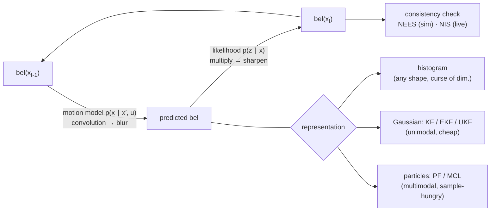

# 06.6 · State estimation

<div class="module-card">

**Prerequisites** [05.6 Sensor fusion](lessons/stage-05/lesson-06.md) (Bayes' rule, likelihoods) · [06.2 Spatial mathematics](lessons/stage-06/lesson-02.md) (SE(2)/SE(3)) · [06.4 Mobile bases and control](lessons/stage-06/lesson-04.md) (skid-steer kinematics) · multivariate Gaussians, linear algebra.

**Estimated time** 8 h (4 h theory · 1 h simulator · 3 h programming) · **Level** Advanced

**Next** [06.7 Mapping & SLAM](lessons/stage-06/lesson-07.md), then [06.8 Path & motion planning](lessons/stage-06/lesson-08.md).

<p class="tags"><span>probability</span><span>Kalman filter</span><span>EKF · UKF</span><span>particle filter</span><span>consistency</span><span>Sim B · Sim G</span><span>P04</span></p>
</div>

## Why this matters

A robot that does not know where it is cannot be told where *not* to go. In EOD work, the
important locations are relative — the robot's pose relative to a suspected item, a cordon line,
a doorway, the place where the radio link was last good — and they must be known with an honest
uncertainty. An estimate that is precise but wrong (an *overconfident* filter) is worse than a
vague one, because the operator, the planner (06.8) and the loss-of-comms behaviour (06.9) will
all act on it. Tracked EOD robots make this hard: skid-steering slips by design, wheel odometry
lies about heading, GNSS is absent indoors, and the interesting environments (culverts,
basements, vehicles) are exactly where features are scarce.

This lesson derives the recursive Bayes filter and its Gaussian specialisations from first
principles, shows how to *test* that a filter is telling the truth about its own uncertainty
(NEES/NIS), and ends with a concrete odometry–IMU fusion design for a tracked robot.

## Learning objectives

1. Derive the recursive **Bayes filter** from the Markov assumptions and implement it on a
   discrete grid.
2. Derive the **Kalman filter update as conditioning of a joint Gaussian**, and the prediction as
   a linear-Gaussian marginalisation; state the Joseph-form update and why it exists.
3. Linearise a range–bearing landmark model for an **EKF**, compute its Jacobians by hand, and
   explain when linearisation fails; explain the **unscented transform** and show why it
   captures second-order moments that the EKF misses.
4. Implement a **particle filter** (SIR) with systematic resampling and use effective sample
   size to decide when to resample.
5. Apply **NEES and NIS** chi-square tests to detect an inconsistent filter.
6. Design a **wheel-odometry + gyro** fusion filter for a skid-steer robot that estimates gyro
   bias and slip, and reason about **observability**.

## Theory

### 1. The Bayes filter

State $x_t$, controls $u_{1:t}$, measurements $z_{1:t}$. The **belief** is
$\mathrm{bel}(x_t) = p(x_t \mid z_{1:t}, u_{1:t})$. Assume (i) the state is complete (Markov):
$p(x_t\mid x_{0:t-1}, z_{1:t-1}, u_{1:t}) = p(x_t\mid x_{t-1},u_t)$, and (ii) measurements depend only
on the current state: $p(z_t\mid x_{0:t}, z_{1:t-1}, u_{1:t}) = p(z_t\mid x_t)$. Bayes' rule plus
total probability give

<div class="callout eq">

$$ \overline{\mathrm{bel}}(x_t) = \int p(x_t \mid x_{t-1}, u_t)\,\mathrm{bel}(x_{t-1})\,dx_{t-1} \quad(\text{predict}),\qquad
\mathrm{bel}(x_t) = \eta\,p(z_t\mid x_t)\,\overline{\mathrm{bel}}(x_t) \quad(\text{update}). $$

</div>

| Symbol | Meaning | Unit |
|---|---|---|
| $x_t$ | state (e.g. pose $(x,y,\theta)$) | m, rad |
| $u_t$ | control / odometry input | m s⁻¹, rad s⁻¹ |
| $z_t$ | measurement | sensor units |
| $p(x_t\mid x_{t-1},u_t)$ | motion model | density |
| $p(z_t\mid x_t)$ | measurement likelihood | density |
| $\eta$ | normaliser $1/p(z_t\mid z_{1:t-1},u_{1:t})$ | — |

**Intuition.** Prediction *blurs* (convolution with motion noise, entropy rises); update
*sharpens* (multiplication by a likelihood, entropy usually falls). Every filter in this lesson is
this recursion with a different representation of $\mathrm{bel}$: a histogram, a Gaussian, a
cloud of samples.

**Numerical example (histogram filter).** A robot is in a circular corridor of 10 cells; cells
1, 4, 7 have a doorway. Prior uniform. The sensor reports "door" with $p(\text{door}\mid\text{door})=0.8$,
$p(\text{door}\mid\text{wall})=0.1$. After one "door" reading: 0.258 on each door cell, 0.032
elsewhere. The robot moves +3 cells (80 % exact, 10 % each ±1) and again reads "door". Now cells
4 and 7 each hold 0.390, cell 1 holds 0.100: still **bimodal**, because doors 1→4 and 4→7 are both
consistent. A Gaussian cannot represent this belief; a histogram or particle filter can.

```python
import numpy as np
bel = np.full(10, 0.1); door = np.isin(np.arange(10), [1, 4, 7])
lik = np.where(door, 0.8, 0.1)

def update(bel, lik):
    b = lik * bel; return b / b.sum()

def predict(bel, shift=3, kernel=((-1, 0.1), (0, 0.8), (1, 0.1))):
    out = np.zeros_like(bel)
    for off, p in kernel:
        out += p * np.roll(bel, shift + off)
    return out

bel = update(bel, lik); bel = update(predict(bel), lik)
print(np.round(bel, 3))   # peaks 0.390 at cells 4 and 7
```

<details class="answer"><summary>Exercise 1 — then reveal</summary>

The robot moves +3 again and this time reads "wall". Compute the new belief at cells 7 and 0
(= 10 mod 10). Which hypothesis wins, and why is one "wall" reading so informative here?

*Answer.* After prediction, mass from cell 4 goes mostly to 7 (a door) and mass from 7 goes mostly
to 0 (a wall). The "wall" likelihood ratio wall:door is $0.9/0.2 = 4.5$, so the hypothesis now at
cell 0 dominates (run the code with `lik = np.where(door, 0.2, 0.9)`: ≈ 0.49 at cell 0 vs ≈ 0.11
at cell 7). A negative reading is
informative precisely because the two hypotheses predict different things *at this step*.

</details>

### 2. The Kalman filter as Gaussian conditioning

Take a linear-Gaussian model

$$ x_t = F x_{t-1} + B u_t + w_t,\ w_t\sim\mathcal N(0,Q);\qquad z_t = H x_t + v_t,\ v_t\sim\mathcal N(0,R). $$

**Prediction** is the distribution of an affine function of a Gaussian:
$\bar\mu = F\mu + Bu$, $\bar P = FPF^\top + Q$.

**Update.** Before seeing $z_t$, the pair $(x_t, z_t)$ is jointly Gaussian:

$$ \begin{bmatrix} x \\ z \end{bmatrix} \sim \mathcal N\!\left(\begin{bmatrix}\bar\mu \\ H\bar\mu\end{bmatrix},
\begin{bmatrix} \bar P & \bar P H^\top \\ H\bar P & H\bar P H^\top + R \end{bmatrix}\right). $$

The standard Gaussian conditioning identity $p(a\mid b)$: mean $\mu_a + \Sigma_{ab}\Sigma_{bb}^{-1}(b-\mu_b)$,
covariance $\Sigma_{aa} - \Sigma_{ab}\Sigma_{bb}^{-1}\Sigma_{ba}$ (a Schur complement) gives
immediately

<div class="callout eq">

$$ S = H\bar P H^\top + R,\quad K = \bar P H^\top S^{-1},\quad \mu = \bar\mu + K(z - H\bar\mu),\quad P = (I-KH)\bar P . $$

</div>

| Symbol | Meaning | Unit |
|---|---|---|
| $\mu$, $P$ | posterior mean and covariance | state units, (state units)² |
| $F$, $B$, $H$ | transition, control, measurement matrices | — |
| $Q$, $R$ | process and measurement noise covariances | (units)² |
| $\nu = z - H\bar\mu$ | innovation | measurement units |
| $S$ | innovation covariance | (meas. units)² |
| $K$ | Kalman gain | state/meas. units |

**Intuition.** $K$ is a regression coefficient: how much the state is expected to move per unit of
surprise in the measurement. When $R\to0$ the filter trusts the sensor; when $\bar P \to 0$ it
ignores it. The KF is also the solution of a least-squares problem (the MAP estimate of a
Gaussian), which is why it reappears as the Gauss–Newton step of graph SLAM in 06.7.

**Numerical example.** Prior $\bar\mu=2.0$ m, $\bar P=0.25$ m², measurement $z=2.6$ m with
$R=0.09$ m²: $K = 0.25/0.34 = 0.735$, $\mu = 2.0 + 0.735\cdot0.6 = 2.441$ m,
$P = 0.265\cdot0.25 = 0.066$ m² (σ from 0.50 to 0.26 m).

**Joseph form.** $P = (I-KH)\bar P(I-KH)^\top + KRK^\top$ is algebraically equal for the optimal
$K$, but stays symmetric positive-semidefinite under rounding and for *suboptimal* gains. Use it.

```python
def kf_update(mu, P, z, H, R):
    S = H @ P @ H.T + R
    K = P @ H.T @ np.linalg.inv(S)
    nu = z - H @ mu
    I_KH = np.eye(len(mu)) - K @ H
    return mu + K @ nu, I_KH @ P @ I_KH.T + K @ R @ K.T, nu, S

mu, P, *_ = kf_update(np.array([2.0]), np.array([[0.25]]), np.array([2.6]),
                      np.array([[1.0]]), np.array([[0.09]]))
print(mu, P)   # [2.441] [[0.0662]]
```

<details class="answer"><summary>Exercise 2 — derive, then reveal</summary>

Prove that $P = (I-KH)\bar P$ equals the Joseph form when $K$ is optimal, and show that for
$K=0.5$ (not optimal) in the example above the Joseph form gives the correct posterior variance
while $(1-K)\bar P$ does not.

*Answer.* Expand Joseph: $\bar P - KH\bar P - \bar P H^\top K^\top + K S K^\top$. With
$K=\bar P H^\top S^{-1}$, $KSK^\top = \bar P H^\top K^\top$, cancelling the third term. For
$K=0.5$: true variance of $\mu+0.5(z-\mu)$ is $0.25\cdot0.25 + 0.25\cdot0.09 = 0.085$ m²; Joseph
gives $0.5^2\cdot0.25+0.5^2\cdot0.09=0.085$; the short form gives 0.125 — wrong.

</details>

### 3. The extended Kalman filter

Nonlinear models $x_t = f(x_{t-1},u_t)+w_t$, $z_t = h(x_t)+v_t$ are linearised about the current
estimate: $F = \partial f/\partial x|_{\mu}$, $H = \partial h/\partial x|_{\bar\mu}$, and the KF
equations are applied with $f$, $h$ themselves used for the mean.

For a unicycle with speed $v$, yaw rate $\omega$ and step $\Delta t$ (06.4):

$$ f(x,u) = \begin{bmatrix} x + v\Delta t\cos\theta \\ y + v\Delta t\sin\theta \\ \theta + \omega\Delta t\end{bmatrix},\qquad
F = \begin{bmatrix} 1 & 0 & -v\Delta t\sin\theta \\ 0 & 1 & v\Delta t\cos\theta \\ 0 & 0 & 1\end{bmatrix}. $$

For a range–bearing measurement of a known landmark $(\ell_x,\ell_y)$, with $\delta_x=\ell_x-x$,
$\delta_y = \ell_y - y$, $q = \delta_x^2+\delta_y^2$:

$$ h(x) = \begin{bmatrix} \sqrt q \\ \operatorname{atan2}(\delta_y,\delta_x) - \theta \end{bmatrix},\qquad
H = \begin{bmatrix} -\delta_x/\sqrt q & -\delta_y/\sqrt q & 0 \\ \delta_y/q & -\delta_x/q & -1 \end{bmatrix}. $$

**Numerical example.** Robot at $(1, 2)$ m, $\theta = 30°$; landmark at $(4, 6)$:
$\delta=(3,4)$, range 5.00 m, bearing $53.13° - 30° = 23.13°$,
$H = \begin{bmatrix}-0.6 & -0.8 & 0\\ 0.16 & -0.12 & -1\end{bmatrix}$ (second row in rad/m).
Read the second row: a 1 m sideways error at 5 m range changes bearing by $1/5$ rad — bearing
information about position *weakens with range*, while bearing information about heading does
not.

**When the EKF fails.** Linearisation error scales with curvature × uncertainty. Heading
uncertainty is the usual culprit: $\cos\theta$ is not linear over ±30°. Symptoms: inconsistent
covariances (§6), divergence after large turns, and wrongly signed corrections near
$\pm\pi$ unless innovations are angle-wrapped. Remedies: iterate the update (IEKF), use the UKF,
or use an error-state / Lie-group formulation (Barfoot 2024).

<details class="answer"><summary>Exercise 3 — then reveal</summary>

Using the example, the prior covariance is $\mathrm{diag}(0.04, 0.04, 0.01)$ (m², m², rad²) and
$R = \mathrm{diag}(0.01, 0.0012)$. Compute $S$ and say which measurement component is more
informative about heading.

*Answer.* $HPH^\top$: range row $0.04(0.36+0.64) = 0.04$; bearing row
$0.04(0.0256+0.0144)+0.01 = 0.0116$; cross term $0.04(-0.096+0.096) = 0$. So
$S = \mathrm{diag}(0.05, 0.0128)$. Only the bearing depends on $\theta$ ($H_{23}=-1$); range says
nothing about heading.

</details>

### 4. The unscented transform (concept, with a proof-by-example)

Instead of linearising $f$, propagate $2n+1$ deterministically chosen **sigma points** through the
true nonlinearity and refit a Gaussian:

$$ \mathcal X_0 = \mu,\quad \mathcal X_{\pm i} = \mu \pm \big(\sqrt{(n+\lambda)P}\big)_i,\qquad
W_0 = \frac{\lambda}{n+\lambda},\ W_{\pm i} = \frac{1}{2(n+\lambda)}, $$

$\mu_y = \sum W_i f(\mathcal X_i)$, $P_y = \sum W_i (f(\mathcal X_i) - \mu_y)(\cdot)^\top$. (The
scaled version with $\lambda = \alpha^2(n+\kappa)-n$ and separate covariance weights is standard
in practice.)

**Numerical example.** $y = x^2$, $x\sim\mathcal N(1, 0.5^2)$, $n=1$, $\kappa = 3-n = 2$ so
$\lambda=2$. Sigma points $1,\ 1\pm\sqrt3\cdot0.5 = 1.866, 0.134$, weights $2/3, 1/6, 1/6$.

| | Mean of $y$ | Variance of $y$ |
|---|---|---|
| Exact | $\mu^2+\sigma^2 = 1.25$ | $4\mu^2\sigma^2+2\sigma^4 = 1.125$ |
| EKF (linearise at 1) | 1.00 | $(2\mu)^2\sigma^2 = 1.00$ |
| UT | **1.25** | **1.125** |

The EKF misses the mean shift $\sigma^2$ entirely — a *bias*, not just a variance error. For a
Gaussian input, $\kappa = 3-n$ matches the fourth moment, which is why the UT is exact here.

```python
def unscented(mu, var, f, kappa):
    n = 1; lam = kappa; c = np.sqrt((n + lam) * var)
    X = np.array([mu, mu + c, mu - c]); W = np.array([lam, 0.5, 0.5]) / (n + lam)
    Y = f(X); m = W @ Y
    return m, W @ (Y - m) ** 2

print(unscented(1.0, 0.25, lambda x: x**2, kappa=2))   # (1.25, 1.125)
```

<details class="answer"><summary>Exercise 4 — then reveal</summary>

Repeat with $\kappa=0$ (so $W_0 = 0$). What mean and variance does the UT give now?

*Answer.* Points $1\pm0.5$, weights ½ each: $y = 2.25, 0.25$; mean 1.25 (still exact — second
moments are always matched), variance $1.0$ (low). $\kappa$ tunes the fourth-moment match.

</details>

### 5. The particle filter

Represent $\mathrm{bel}(x_t)$ by $N$ weighted samples $\{x^{(i)}, w^{(i)}\}$. The SIR step:

1. Sample $x_t^{(i)} \sim p(x_t\mid x_{t-1}^{(i)},u_t)$ (the proposal is the motion model).
2. Weight $w^{(i)} \propto w^{(i)}\,p(z_t\mid x_t^{(i)})$; normalise.
3. If the **effective sample size** $N_{\text{eff}} = 1/\sum_i (w^{(i)})^2$ falls below, say, $N/2$,
   resample (systematic resampling: one uniform draw, $N$ equally spaced pointers — $O(N)$ and
   low variance).

| Symbol | Meaning | Unit |
|---|---|---|
| $N$ | number of particles | — |
| $w^{(i)}$ | normalised importance weight | — |
| $N_{\text{eff}}$ | effective sample size, $1\le N_{\text{eff}}\le N$ | — |

**Intuition.** Particles can represent the bimodal corridor belief of §1 and the "kidnapped
robot" (global relocalisation). Their weaknesses: sample impoverishment when the likelihood is
very peaked relative to the proposal (a precise LiDAR with a sloppy odometry model), and cost
exponential in state dimension for fixed accuracy. Monte Carlo Localization (MCL) with KLD-adaptive
$N$ is the standard indoor localiser (Thrun, Burgard & Fox 2005).

**Numerical example.** Weights $(0.5, 0.2, 0.1, 0.1, 0.05, 0.05)$: $\sum w^2 = 0.315$,
$N_{\text{eff}} = 3.17$ of 6 — just above $N/2 = 3$, so no resampling yet.

```python
def systematic_resample(w, rng):
    N = len(w); positions = (rng.random() + np.arange(N)) / N
    return np.searchsorted(np.cumsum(w), positions)

def n_eff(w): return 1.0 / np.sum(w**2)

w = np.array([0.5, 0.2, 0.1, 0.1, 0.05, 0.05])
print(n_eff(w), systematic_resample(w, np.random.default_rng(1)))
```

<details class="answer"><summary>Exercise 5 — then reveal</summary>

A LiDAR likelihood has σ = 2 cm while particles are spread with σ = 20 cm (1D for simplicity).
Roughly what fraction of particles will carry significant weight, and what are two fixes?

*Answer.* For Gaussian particles and a Gaussian likelihood,
$N_{\text{eff}}/N \to (\mathbb E L)^2/\mathbb E L^2 = \sigma_z\sqrt{\sigma_z^2+2\sigma_p^2}/(\sigma_z^2+\sigma_p^2)
= 2\sqrt{804}/404 \approx 0.14$: only ~14 % of the particles do useful work, and the ratio falls
roughly as $\sqrt2\,\sigma_z/\sigma_p$ in 1D — and as its $d$-th power in $d$ dimensions.
Fixes: inflate the likelihood (tempering) during convergence; use a better proposal that includes
the measurement (e.g. scan-matched proposals as in FastSLAM 2.0 / GMapping); more particles only
helps linearly.

</details>

### 6. Is the filter honest? NEES and NIS

A filter is **consistent** if its errors are zero-mean and its covariance matches their actual
spread. Two scalar statistics test this:

$$ \epsilon_t = e_t^\top P_t^{-1} e_t,\ e_t = x_t - \mu_t\quad(\text{NEES; needs ground truth}),\qquad
\epsilon_{\nu,t} = \nu_t^\top S_t^{-1}\nu_t\quad(\text{NIS; needs only the filter}). $$

If consistent, $\epsilon_t\sim\chi^2_{n}$ and $\epsilon_{\nu,t}\sim\chi^2_{m}$. Averaging over $N$
Monte Carlo runs, $N\bar\epsilon_t \sim \chi^2_{Nn}$, which gives a tight acceptance band
(Bar-Shalom, Li & Kirubarajan 2001).

| Symbol | Meaning | Unit |
|---|---|---|
| $n$, $m$ | state and measurement dimension | — |
| $\bar\epsilon_t$ | NEES averaged over $N$ runs at time $t$ | — |
| $\chi^2_k$ | chi-square with $k$ degrees of freedom | — |

**Numerical example.** $n=3$, $N=50$ runs: the 95 % band for $\bar\epsilon$ is
$[\chi^2_{150}(0.025), \chi^2_{150}(0.975)]/50 = [2.36, 3.72]$. A single run ($N=1$) gives
$[0.22, 9.35]$ — nearly useless, which is why NEES is a *simulation* tool. In the EKF
localiser below, 50 runs with the correct $Q$ give mean NEES 3.04 with 95 % of time steps inside
the band; with $Q$ under-stated 20× (a common "the filter looks smoother" tuning mistake) mean
NEES is 27.5 and 0 % of steps are inside: grossly overconfident.

```python
from scipy.stats import chi2
lo, hi = chi2.ppf([0.025, 0.975], 3 * 50) / 50
print(lo, hi)   # 2.36, 3.72
```

<div class="callout key">

**Key idea.** In the field there is no ground truth, but NIS is always available: monitor it
online. A sustained NIS above its chi-square band means the filter's model is wrong *now* —
tracks slipping on a slope, a wheel stuck, a mis-associated landmark — and is a trigger to inflate
covariance, reject measurements, or tell the operator that the pose display is untrustworthy.

</div>

<details class="answer"><summary>Exercise 6 — then reveal</summary>

A 2D measurement's NIS averaged over the last 20 updates of one run is 3.1. Is that consistent
at 95 %?

*Answer.* $20\cdot3.1 = 62$ vs $\chi^2_{40}$: 95 % band $[24.4, 59.3]$. 62 is above: the filter is
mildly overconfident (or there are outliers). Investigate — inflate $R$ or check data association.

</details>

### 7. Landmark-based localisation

With known landmark positions, the EKF update of §3 is applied for each observed landmark.
Practical issues dominate the mathematics:

- **Data association.** Which landmark did I see? Use the Mahalanobis gate
  $\nu^\top S^{-1}\nu < \chi^2_{2}(0.99) = 9.21$, then nearest-neighbour or joint compatibility
  (JCBB). A wrong association is a catastrophic, *confident* error.
- **Geometry.** Bearings to landmarks spread widely in azimuth constrain position well; collinear
  landmarks leave an unobservable direction (compare GDOP in GNSS).
- **Landmark choice in EOD settings.** Fiducial markers (AprilTag/ArUco) placed by the team at
  the entry point give known, unambiguous landmarks — cheap and robust, and a good practice when
  operating in a building.

### 8. Odometry + IMU fusion for a tracked robot

For skid-steer tracks with speeds $v_r, v_l$ and track separation $B$, the ideal kinematics give
$v = (v_r+v_l)/2$, $\omega = (v_r - v_l)/B$. Real tracks skid when turning; empirically the
instantaneous centres of rotation of the tracks lie *outside* the tracks, modelled by an
effective track width $\chi B$ with $\chi > 1$ (typically 1.2–2, depending on ground and load —
an empirical parameter):

$$ \omega_{\text{true}} = \frac{v_r - v_l}{\chi B} = s\,\omega_{\text{odo}},\qquad s = 1/\chi \in(0,1]. $$

A MEMS gyro measures $\omega_g = \omega_{\text{true}} + b_g + n_g$ with slowly drifting bias
$b_g$. Neither sensor is sufficient: odometry has an unknown, terrain-dependent scale on yaw;
the gyro has a bias that integrates into heading drift.

**Numerical example.** $v_r = 0.6$, $v_l = 0.2$ m/s, $B=0.5$ m, $\chi = 1.5$: odometry says
0.80 rad/s, truth is 0.533 rad/s. Ten seconds of turning with pure odometry gives a heading error
of 2.67 rad (153°). A gyro with an uncorrected bias of 0.1 °/s gives 1° in the same 10 s. And a
2° heading error, over 20 m of driving, displaces the position by $20\cdot0.0349 = 0.70$ m.

**Fusion design.** Estimate $\beta = [b_g, s]^\top$ by treating the gyro as a measurement of the
odometry yaw rate:

$$ \omega_g = \begin{bmatrix} 1 & \omega_{\text{odo}} \end{bmatrix}\begin{bmatrix} b_g \\ s \end{bmatrix} + n_g, $$

a *linear* KF (recursive least squares with a random-walk prior). Then propagate pose with
$v$ from the tracks (longitudinal slip is smaller) and $\omega = \omega_g - \hat b_g$ from the
gyro. The full filter is an EKF with state $[x,y,\theta,b_g,s]$.

**Observability.** When $\omega_{\text{odo}} = 0$ (driving straight) the measurement row is
$[1, 0]$: only the bias is observable. During a turn, $[1, \omega_{\text{odo}}]$ mixes both. Both
are observable only if the robot *does both*. In simulation (alternating 10 s straight and 10 s
turning, gyro noise 0.5 °/s per sample at 50 Hz), $s$ stays at its prior (1.00 ± 0.30) for the
first straight segment, then snaps to 0.665 ± 0.003 within one turn; the bias converges to
0.09 ± 0.03 °/s (true 0.10).

```python
def fuse_bias_slip(omega_odo, omega_gyro, R=np.radians(0.5)**2,
                   Q=np.diag([np.radians(1e-3)**2, 1e-6])):
    beta = np.array([0.0, 1.0]); P = np.diag([np.radians(1.0)**2, 0.3**2])
    for wo, wg in zip(omega_odo, omega_gyro):
        P = P + Q
        H = np.array([1.0, wo]); S = H @ P @ H + R; K = P @ H / S
        beta = beta + K * (wg - H @ beta); P = (np.eye(2) - np.outer(K, H)) @ P
    return beta, P

rng = np.random.default_rng(0)
wo = np.where((np.arange(3000) // 500) % 2 == 0, 0.0, 0.8)
wg = np.radians(0.1) + 0.667 * wo + rng.normal(0, np.radians(0.5), wo.size)
beta, P = fuse_bias_slip(wo, wg)
print(np.degrees(beta[0]), beta[1])   # ~0.09 deg/s, ~0.665
```

<details class="answer"><summary>Exercise 7 — then reveal</summary>

The robot climbs a ramp and the gyro (body-fixed $z$) is tilted 20° from vertical. What does it
now measure while the robot turns about the world vertical at 0.5 rad/s, and how should the
filter handle it?

*Answer.* Body $z$-rate $= 0.5\cos20° = 0.47$ rad/s (the rest appears on body $x$/$y$). The fix is
to use the full 3-axis gyro with attitude from the accelerometer/gyro (an AHRS) and project to the
world vertical — i.e. estimate attitude in SO(3) (06.2), not just yaw. On stairs this matters a
lot.

</details>

## Visual explanation



<iframe class="sim-frame" src="sims/eod-robot/index.html?embed=1" height="720" loading="lazy"></iframe>

<a class="sim-link" href="sims/eod-robot/index.html" target="_blank">Open Sim B full-screen ↗</a>

## Worked example — localising in a basement with three fiducials

*Fictional scenario.* A tracked robot enters a basement (no GNSS). The team has placed three
fiducial markers at surveyed positions $(5,0)$, $(5,8)$, $(-2,6)$ m. The robot drives an arc at
0.5 m/s and 0.2 rad/s; odometry noise per 0.1 s step is σ = 2 cm in position and 1° in heading;
the camera gives range (σ = 10 cm) and bearing (σ = 2°) to each visible marker every 0.5 s.

1. **Model.** EKF with the unicycle $f$ and the range–bearing $h$ of §3; Joseph update;
   innovations angle-wrapped.
2. **Gating.** Accept a marker observation only if NIS $< 9.21$; markers have IDs, so association
   is known and gating only rejects outliers (e.g. a reflection).
3. **Consistency.** 50 Monte Carlo runs: mean NEES 3.04, 95 % of steps within $[2.36, 3.72]$.
   Consistent.
4. **Mis-tuning.** Divide $Q$ by 20 to make the trajectory "look smoother": mean NEES 27.5.
   The displayed uncertainty ellipse is ~3× too small in each axis ($\sqrt{27.5/3}\approx3$) —
   exactly the kind of false confidence that a standoff check (06.8) must not be built on.
5. **Operational reading.** The team should see the covariance ellipse on the OCU (06.5), and a
   NIS alarm should flag when the pose estimate stops being trustworthy.

## Simulation work

<div class="callout sim">

**Sim B, map panel.** (1) Drive a long loop kept away from the landmark poles (odometry only);
watch the uncertainty circle and pose σ grow, and compare with the estimated-vs-true position error
the debrief reports. (2) *Offline Python* (Sim B has no gyro option): add a gyro to your
dead-reckoning model and compare the heading error during turns with and without it. (3) Drive
past the poles: note how fast σ shrinks. Sim B draws an isotropic circle, so sketch by hand the
ellipse a single range–bearing update would leave and the direction along which it shrinks.
**Sim G, challenge 6 (noisy localisation)**: write your own EKF inside `controller(obs, mem)` from
`obs.odo` and `obs.marks`; compute NIS for each landmark update yourself (keep it in `mem`, print it
with `console.log` in the browser's developer tools), deliberately set $R$ too small, and watch
your NIS exceed its χ² bound and the stop-within-0.5 m success rate drop.

</div>

## Practical exercises

<details class="answer"><summary>Practical 1 — one-dimensional fusion by hand</summary>

A robot's odometry predicts it is 12.0 m along a corridor with σ = 0.8 m. A tape-measure mark
recognised by the camera gives 12.9 m with σ = 0.3 m, and an independent UWB range gives 12.5 m
with σ = 0.5 m. Fuse sequentially and check that the order does not matter.

*Answer.* Information form: precision $1/0.64+1/0.09+1/0.25 = 1.5625+11.111+4 = 16.674$; mean
$=(12/0.64+12.9/0.09+12.5/0.25)/16.674 = (18.75+143.33+50)/16.674 = 12.72$ m, σ = 0.245 m. Sequential
KF updates in either order give the same (linear-Gaussian updates commute).

</details>

<details class="answer"><summary>Practical 2 — diagnose from NIS</summary>

During a stair climb, range–bearing NIS jumps from ~2 to ~40 for 5 s, then returns. Heading
innovations are large and one-signed. What happened and what should the filter do?

*Answer.* The 2D planar model is violated (pitch; the camera's bearings are now in a tilted
frame), or tracks slipped. One-signed heading innovations indicate a model bias, not noise.
Filter response: inflate $Q$ when the IMU reports large pitch/roll, gate out measurements, and
switch to a 3D attitude-aware model; tell the operator the map pose is degraded.

</details>

<details class="answer"><summary>Practical 3 — choose a filter</summary>

For each, pick KF/EKF/UKF/PF and justify: (a) global relocalisation after the robot was carried
into a building with the power off; (b) tracking a pan–tilt camera's angles from encoders plus a
gyro; (c) pose tracking with a good initial estimate and 5 landmarks; (d) estimating the position
of a (fictional) object from bearing-only observations taken from two robot poses.

*Answer.* (a) PF/MCL — multimodal, global. (b) linear KF — near-linear, cheap. (c) EKF or UKF —
unimodal; UKF if heading uncertainty is large. (d) UKF or PF initially (bearing-only is highly
nonlinear with a banana-shaped posterior at short baselines), then EKF once converged; or batch
least squares.

</details>

## Programming exercise — EKF and PF localisation with a consistency test

**Goal.** Implement EKF and particle-filter localisation for a skid-steer robot with landmarks,
and prove (statistically) that the EKF is consistent.

- **Input:** landmark map; control sequence; noise parameters; true slip factor $\chi$ (hidden
  from the filter unless it estimates it).
- **Output:** estimated trajectories; RMSE; averaged NEES and NIS with 95 % bands; a plot of the
  fraction of time steps inside the band vs $Q$ scaling.
- **Constraints:** NumPy/SciPy only; 50 Monte Carlo runs in < 30 s; all angles wrapped.
- **Expected behaviour:** correctly tuned EKF: ≈ 95 % inside; $Q$ under-stated: NEES far above;
  PF with 500 particles: similar RMSE on tracking, succeeds on global relocalisation where the
  EKF fails.
- **Test cases:** (i) no noise → estimate equals truth; (ii) the reference script above (landmarks
  at $(5,0),(5,8),(-2,6)$, $v=0.5$, $\omega=0.2$) gives mean NEES 2.8–3.3; (iii) the
  $\omega_g$/$\omega_{\text{odo}}$ fusion converges to $s$ within 0.01 after one turn.
- **Extensions:** add $s$ and $b_g$ to the EKF state; implement the UKF and compare NEES during
  aggressive turns; implement KLD-sampling to adapt $N$.

This is [Project P04](projects/p04-localization/README.md), built on the P05 simulator.

```python
# Reference EKF localiser used for the numbers in this lesson (abridged)
def wrap(a): return (a + np.pi) % (2 * np.pi) - np.pi

def ekf_landmark_update(mu, P, z, lm, Rz):
    dx, dy = lm - mu[:2]; q = dx * dx + dy * dy; r = np.sqrt(q)
    zhat = np.array([r, wrap(np.arctan2(dy, dx) - mu[2])])
    H = np.array([[-dx / r, -dy / r, 0.0], [dy / q, -dx / q, -1.0]])
    nu = z - zhat; nu[1] = wrap(nu[1])
    S = H @ P @ H.T + Rz; K = P @ H.T @ np.linalg.inv(S)
    mu = mu + K @ nu; mu[2] = wrap(mu[2])
    I_KH = np.eye(3) - K @ H
    return mu, I_KH @ P @ I_KH.T + K @ Rz @ K.T, nu @ np.linalg.solve(S, nu)

mu, P, nis = ekf_landmark_update(np.array([1.0, 2.0, np.radians(30)]), np.diag([0.04, 0.04, 0.01]),
                                 np.array([5.1, np.radians(22.0)]), np.array([4.0, 6.0]),
                                 np.diag([0.01, 0.0012]))
print(mu, nis)
```

## Reading

- Thrun, S., Burgard, W. & Fox, D., *Probabilistic Robotics*, MIT Press (2005),
  https://mitpress.mit.edu/9780262201629/probabilistic-robotics/ — ch. 2–4 (Bayes filter, KF/EKF/UKF,
  particle filter) and ch. 7–8 (localisation, MCL). The canonical text for this lesson.
- Barfoot, T. D., *State Estimation for Robotics*, 2nd ed., CUP (2024),
  https://asrl.utias.utoronto.ca/~tdb/bib/barfoot_ser24.pdf — free; ch. 3–4 for the Gaussian
  derivations and batch/recursive equivalence, ch. 7–8 for estimation on SO(3)/SE(3).
- Welch, G. & Bishop, G., *An Introduction to the Kalman Filter*, UNC TR 95-041 (1995/2006),
  https://www.cs.utexas.edu/~pstone/Courses/393Rfall15/readings/Welch+Bishop-TR-95.pdf — a quick,
  gentle first pass if the KF is rusty.
- Corke, P., *Robotics, Vision and Control*, 3rd ed., Springer (2023), https://petercorke.com/rvc/home/ —
  the localisation chapter with runnable Python (Robotics Toolbox) for EKF/PF examples.

Also: Bar-Shalom, Li & Kirubarajan, *Estimation with Applications to Tracking and Navigation*
(Wiley, 2001), ch. 5, for NEES/NIS tests. Full bibliographic entries:
[curriculum/sources.md](curriculum/sources.md).

## Assessment

1. *(Mathematical)* Derive the information-form KF update ($P^{-1} = \bar P^{-1} + H^\top R^{-1}H$)
   from the Gaussian-conditioning form, and explain why it is attractive for fusing many
   independent sensors.
2. *(Conceptual)* Why can an EKF be *inconsistent* even when every noise covariance is correct?
3. *(Computation)* For $n = 3$ and $N=25$ runs, compute the 95 % NEES band.
4. *(Interpretation)* A particle filter's $N_{\text{eff}}$ collapses to ~1 every time a LiDAR scan
   arrives, although tracking seems fine. What is happening and why is it dangerous?
5. *(Design)* Specify the state vector, process model and measurements for fusing tracks, a
   3-axis IMU and a downward optical-flow sensor on a robot that must climb stairs.

<details class="answer"><summary>Answers to 2, 3 and 4</summary>

2. Linearisation errors: the EKF's covariance is the covariance of the *linearised* model; with
   large heading uncertainty the true posterior is non-Gaussian (banana-shaped) and the Jacobian
   evaluated at a wrong estimate injects spurious information (the classic EKF-SLAM
   inconsistency, 06.7).
3. $\chi^2_{75}(0.025)/25 = 52.9/25 = 2.12$; $\chi^2_{75}(0.975)/25 = 100.8/25 = 4.03$.
4. The likelihood is far narrower than the particle spread: sample impoverishment. After
   resampling, all particles are copies of one; diversity is lost and the filter cannot recover
   from a wrong mode. Use better proposals, likelihood tempering, or more process noise.

</details>

## Expert extension

- **Invariant EKF.** For systems on Lie groups with group-affine dynamics (e.g. IMU kinematics),
  the invariant EKF's error dynamics are independent of the estimate, restoring consistency
  guarantees the standard EKF lacks (Barrau & Bonnabel 2017).
- **Smoothing vs filtering.** A fixed-lag smoother (factor graph over the last $k$ poses) beats a
  filter when measurements arrive late or out of order — common with multi-hop radio links.
  This is the bridge to 06.7.
- **Robust estimation.** Replace Gaussian likelihoods with Student-$t$ or use NIS-based
  switching to handle outliers; relate to robust kernels in 06.7.
- **Learned components.** Learned odometry (e.g. from IMU data) can reduce drift but must be
  evaluated with NEES on held-out terrain types — connect to distribution shift in
  [09.2](lessons/stage-09/lesson-02.md).

## What comes next

[06.7](lessons/stage-06/lesson-07.md) removes the assumption that the map is known and turns
localisation into SLAM; its pose-graph optimiser is the batch version of the filters here.
[06.8](lessons/stage-06/lesson-08.md) uses the covariance you now trust to plan with chance
constraints.
