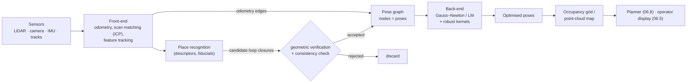

# 06.7 · Mapping & SLAM

<div class="module-card">

**Prerequisites** [06.6 State estimation](lessons/stage-06/lesson-06.md) (Bayes filter, EKF, Gaussian conditioning) · [06.2 Spatial mathematics](lessons/stage-06/lesson-02.md) (SE(2)/SE(3), composition) · SVD, sparse linear algebra, nonlinear least squares.

**Estimated time** 9 h (4 h theory · 1 h simulator · 4 h programming) · **Level** Expert

**Next** [06.8 Path & motion planning](lessons/stage-06/lesson-08.md), then [09.5 Active perception & autonomous exploration](lessons/stage-09/lesson-05.md).

<p class="tags"><span>SLAM</span><span>occupancy grids</span><span>ICP</span><span>pose graphs</span><span>Gauss–Newton</span><span>robust estimation</span><span>Sim G</span><span>P07</span></p>
</div>

## Why this matters

The environments where EOD robots are most valuable — the inside of a building, a culvert, a
vehicle interior, a tunnel, a ship's hold — are the ones without a prior map and without GNSS.
A map built by the robot serves three purposes at once: it lets the robot know where it is (and
therefore where the suspected item, the entry point and the last good radio position are); it
gives the planner (06.8) something to plan on; and it is a *record* of the scene, useful to the
team leader during the incident and to investigators afterwards (08.2). The DARPA Subterranean
Challenge (2018–2021) was, in effect, a large public experiment in exactly this problem —
mapping unknown, degraded, communications-denied underground spaces with robots supervised by
one human — and its lessons transfer directly.

## Learning objectives

1. Build an **occupancy grid** with log-odds updates and an inverse sensor model; explain
   clamping and the independence assumption it rests on.
2. Derive the **closed-form rigid alignment** (Kabsch/Arun SVD solution) used inside ICP,
   including the reflection fix, and explain ICP's convergence basin and **degeneracy**.
3. Formulate **EKF-SLAM**, explain why its cost is $O(n^2)$ per update in the number of
   landmarks, and why it becomes inconsistent.
4. Formulate **pose-graph SLAM** as nonlinear least squares on SE(2), derive the Gauss–Newton
   normal equations with edge Jacobians, and handle the gauge freedom.
5. Explain **loop closure** and why a single false positive can destroy a map; apply **robust
   kernels** and state their weight functions.
6. Compare visual and LiDAR SLAM systems (ORB-SLAM, Cartographer and others) and extract design
   lessons for degraded, GPS-denied environments from the SubT teams CERBERUS and NeBula.

## Theory

### 1. Occupancy grids with log-odds

Discretise the world into cells $m_i$, each occupied or free. Assume cells are independent
given the poses (a strong but workable approximation). The Bayes filter for a *static* binary
state collapses to an additive update in **log-odds** $\ell = \ln\frac{p}{1-p}$:

<div class="callout eq">

$$ \ell_{t,i} = \ell_{t-1,i} + \underbrace{\ln\frac{p(m_i \mid z_t, x_t)}{1-p(m_i\mid z_t,x_t)}}_{\text{inverse sensor model}} - \ell_0, \qquad p = 1 - \frac{1}{1+e^{\ell}} . $$

</div>

| Symbol | Meaning | Unit |
|---|---|---|
| $\ell_{t,i}$ | log-odds of occupancy of cell $i$ after $t$ scans | — (nats) |
| $p(m_i\mid z_t,x_t)$ | inverse sensor model: occupancy probability given one scan | — |
| $\ell_0$ | prior log-odds (0 for $p_0 = 0.5$) | — |

**Inverse sensor model for a range beam.** Cells the beam passes *through* get
$p_{\text{free}}<0.5$; the cell at the *return* gets $p_{\text{occ}}>0.5$; cells beyond the
return are not updated (unknown). Cells are found by ray traversal (Bresenham/Amanatides–Woo).

**Numerical example.** $p_{\text{occ}}=0.7 \Rightarrow +0.847$; $p_{\text{free}}=0.35
\Rightarrow -0.619$. Three hits: $\ell = 2.54$, $p=0.927$. One subsequent pass-through:
$\ell = 1.92$, $p = 0.872$. Clamping $\ell\in[-2, 3.5]$ ($p\in[0.12, 0.97]$) keeps cells
revisable — essential when things move (a door opens, a person walks through) — and bounds
overconfidence from correlated errors between successive scans, which the independence
assumption ignores.

```python
import numpy as np
L_OCC, L_FREE, L_MIN, L_MAX = np.log(0.7 / 0.3), np.log(0.35 / 0.65), -2.0, 3.5

def bresenham(x0, y0, x1, y1):
    cells, dx, dy = [], abs(x1 - x0), -abs(y1 - y0)
    sx, sy, err = (1 if x0 < x1 else -1), (1 if y0 < y1 else -1), abs(x1 - x0) - abs(y1 - y0)
    while True:
        cells.append((x0, y0))
        if (x0, y0) == (x1, y1): return cells
        e2 = 2 * err
        if e2 >= dy: err += dy; x0 += sx
        if e2 <= dx: err += dx; y0 += sy

def integrate_beam(L, origin, hit):
    ray = bresenham(*origin, *hit)
    for (i, j) in ray[:-1]: L[j, i] = np.clip(L[j, i] + L_FREE, L_MIN, L_MAX)
    i, j = ray[-1];          L[j, i] = np.clip(L[j, i] + L_OCC,  L_MIN, L_MAX)

L = np.zeros((20, 20))
for _ in range(3): integrate_beam(L, (0, 0), (10, 5))
print(1 - 1 / (1 + np.exp(L[5, 10])))   # 0.927
```

<details class="answer"><summary>Exercise 1 — then reveal</summary>

A cell has been hit 10 times (clamped at 3.5). A door opens and the cell is now traversed by
beams. How many pass-throughs until $p<0.5$? Without clamping (10 hits = 8.47), how many?

*Answer.* Need $\ell<0$: with clamping $\lceil 3.5/0.619\rceil = 6$ scans; without,
$\lceil 8.47/0.619\rceil = 14$. Clamping is a crude but effective forgetting mechanism.

</details>

### 2. Scan matching: ICP and the closed-form alignment

Scan matching estimates the rigid transform between two scans (or a scan and a map). **ICP**
(Besl & McKay 1992; Chen & Medioni 1992) alternates: (1) associate each point with its nearest
neighbour in the other scan; (2) solve for the best rigid transform given those pairs; repeat.

**Step (2) in closed form.** Minimise $E(R,t) = \sum_i \lVert R p_i + t - q_i\rVert^2$ over
$R\in SO(d)$, $t\in\mathbb R^d$.

1. $\partial E/\partial t = 0 \Rightarrow t = \bar q - R\bar p$ (centroids). Substituting,
   with centred points $p_i' = p_i - \bar p$, $q_i' = q_i - \bar q$:
   $E = \sum \lVert R p_i' - q_i'\rVert^2 = \text{const} - 2\sum q_i'^\top R p_i'$.
2. So maximise $\sum q_i'^\top R p_i' = \operatorname{tr}\!\big(R\, H\big)$ with
   $H = \sum_i p_i' q_i'^\top$.
3. Take the SVD $H = U\Sigma V^\top$. Then $\operatorname{tr}(RU\Sigma V^\top) = \operatorname{tr}(\Sigma\, V^\top R U)$.
   $M = V^\top R U$ is orthogonal, so $\operatorname{tr}(\Sigma M) = \sum \sigma_k M_{kk} \le \sum\sigma_k$,
   with equality iff $M = I$, i.e. $R = VU^\top$.
4. If $\det(VU^\top) = -1$ that is a reflection. The best *rotation* flips the sign on the
   smallest singular value (Arun, Huang & Blostein 1987; Umeyama 1991):

<div class="callout eq">

$$ R^\ast = V\,\mathrm{diag}\big(1,\ldots,1,\det(VU^\top)\big)\,U^\top,\qquad t^\ast = \bar q - R^\ast\bar p . $$

</div>

| Symbol | Meaning | Unit |
|---|---|---|
| $p_i$, $q_i$ | corresponding points in source and target scans | m |
| $\bar p$, $\bar q$ | centroids | m |
| $H$ | cross-covariance of centred points | m² |
| $R$, $t$ | rotation and translation mapping source to target | —, m |

**Numerical example.** Points $(0,0),(2,0),(2,1),(0,3)$, rotated by 30° and translated by
$(1, 0.5)$: the formula recovers 30.000° and $(1.000, 0.500)$. With 2 cm Gaussian noise on the
targets: 30.7°, $(1.016, 0.478)$ — four points is not much data.

```python
def rigid_align(P, Q):
    """Least-squares R, t with R @ p + t ≈ q (Kabsch/Arun/Umeyama, no scale)."""
    pc, qc = P.mean(0), Q.mean(0)
    H = (P - pc).T @ (Q - qc)
    U, S, Vt = np.linalg.svd(H)
    D = np.eye(P.shape[1]); D[-1, -1] = np.sign(np.linalg.det(Vt.T @ U.T))
    R = Vt.T @ D @ U.T
    return R, qc - R @ pc

th = np.radians(30); Rt = np.array([[np.cos(th), -np.sin(th)], [np.sin(th), np.cos(th)]])
P = np.array([[0, 0], [2, 0], [2, 1], [0, 3.0]]); Q = P @ Rt.T + [1, 0.5]
R, t = rigid_align(P, Q); print(np.degrees(np.arctan2(R[1, 0], R[0, 0])), t)
```

**Convergence and degeneracy.** ICP converges to a *local* minimum; its basin depends on
geometry and initial guess (from odometry, 06.6). Point-to-plane ICP (residual along the surface
normal) converges much faster on structured scenes. Its Gauss–Newton information matrix for
translation is $\sum_i n_i n_i^\top$: in a straight corridor all normals are $\pm\hat y$, so
the matrix is singular along $\hat x$ — **degeneracy** (Zhang, Kaess & Singh 2016). With 200
wall points and 5 door-frame points the translational eigenvalues are 200 and 5: the along-
corridor estimate rests on 5 points. A robust system monitors the smallest eigenvalue and, when
it is small, falls back to other sensors in that direction.

<details class="answer"><summary>Exercise 2 — derive, then reveal</summary>

Show that if all $p_i'$ lie on a line (collinear points) in 2D, the rotation is not determined,
and relate this to the singular values of $H$.

*Answer.* Collinear centred points $p_i' = a_i u$ give $H = u\,(\sum a_i q_i')^\top$: rank 1, one
zero singular value. In 2D the rotation is still recoverable if the target is also a line (it
aligns the directions), but the sign ambiguity/reflection and, in 3D, rotation about the line are
unconstrained. Rank of $H$ tells you which rotational degrees of freedom the data constrain.

</details>

### 3. EKF-SLAM and its quadratic cost

Augment the state with landmark positions: $\mathbf y = [x, y, \theta, \ell_{1x}, \ell_{1y},
\ldots, \ell_{Nx}, \ell_{Ny}]^\top$, dimension $n = 3+2N$. Prediction touches only the robot
block (and its cross-covariances, $O(n)$); each landmark update has a sparse $H$ (robot + one
landmark) but the gain $K = PH^\top S^{-1}$ is dense, and $P \leftarrow (I-KH)P$ changes every
entry:

$$ \text{memory } O(n^2),\qquad \text{time per observation } O(n^2). $$

**Numerical example.** $N = 1000$ landmarks: $n = 2003$, $P$ has $4.0\times10^6$ entries
(32 MB in float64) and each observation costs ~$4\times10^6$ multiply-adds. $N = 10^4$: 3.2 GB
and $4\times10^8$ per observation — infeasible at sensor rates.

**Why the density?** Landmark estimates become correlated through the robot pose that observed
them. That correlation is *correct* and is what makes a loop closure correct the whole map — but
it is also why the covariance is dense. The *information* matrix of the full trajectory, by
contrast, is sparse: this is the key insight behind graph SLAM.

**Inconsistency.** Linearising at changing estimates gives the EKF spurious information about
the unobservable global heading; EKF-SLAM becomes overconfident over long runs (Huang &
Dissanayake, and others). NEES (06.6) exposes it.

```python
for N in (100, 1000, 10_000):
    n = 3 + 2 * N
    print(N, n * n, f"{n * n * 8 / 1e6:.1f} MB")
```

<details class="answer"><summary>Exercise 3 — then reveal</summary>

A robot sees on average 15 landmarks per scan at 10 Hz. What landmark count $N$ can a CPU doing
$2\times10^9$ useful multiply-adds per second sustain with EKF-SLAM, taking cost $\approx 2n^2$
per observation?

*Answer.* Budget per observation $= 2\times10^9/150 = 1.33\times10^7 = 2n^2 \Rightarrow n = 2582$,
$N\approx 1290$ landmarks. A small building, at best.

</details>

### 4. Pose-graph SLAM as nonlinear least squares

Keep only robot poses $X = \{x_0,\ldots,x_T\}$, $x_k = (x,y,\theta)\in SE(2)$. Odometry and
scan matching give **edges**: relative-pose measurements $z_{ij}$ with information matrix
$\Omega_{ij}$. Loop closures are edges between non-consecutive poses. The MAP estimate under
Gaussian noise is

$$ X^\ast = \arg\min_X \sum_{(i,j)} e_{ij}^\top \Omega_{ij}\, e_{ij},\qquad e_{ij} = \operatorname{t2v}\!\big(Z_{ij}^{-1}(X_i^{-1}X_j)\big). $$

For SE(2), writing $R_i = R(\theta_i)$, $R_{ij} = R(\theta_{ij})$:

$$ e_{ij} = \begin{bmatrix} R_{ij}^\top\big(R_i^\top(t_j - t_i) - t_{ij}\big) \\ \theta_j - \theta_i - \theta_{ij} \end{bmatrix},\quad
A_{ij} = \frac{\partial e_{ij}}{\partial x_i} = \begin{bmatrix} -R_{ij}^\top R_i^\top & R_{ij}^\top \frac{\partial R_i^\top}{\partial\theta_i}(t_j - t_i) \\ 0 & -1\end{bmatrix},\quad
B_{ij} = \begin{bmatrix} R_{ij}^\top R_i^\top & 0 \\ 0 & 1\end{bmatrix}. $$

**Gauss–Newton.** Linearise $e_{ij}(X\oplus\Delta) \approx e_{ij} + A_{ij}\Delta_i + B_{ij}\Delta_j$
and set the gradient of the quadratic to zero:

<div class="callout eq">

$$ H\,\Delta = -b,\qquad H = \sum_{(i,j)} J_{ij}^\top \Omega_{ij} J_{ij},\qquad b = \sum_{(i,j)} J_{ij}^\top\Omega_{ij}\,e_{ij}, $$

with $J_{ij}$ zero except for blocks $A_{ij}$ at $i$ and $B_{ij}$ at $j$.

</div>

| Symbol | Meaning | Unit |
|---|---|---|
| $z_{ij} = (t_{ij},\theta_{ij})$ | measured pose of $j$ in frame of $i$ | m, rad |
| $\Omega_{ij}$ | information (inverse covariance) of the edge | m⁻², rad⁻² |
| $e_{ij}$ | residual in the frame of the measurement | m, rad |
| $H$, $b$ | approximate Hessian and gradient | — |
| $\Delta$ | pose increment | m, rad |

**Structure.** Each edge fills four $3\times3$ blocks of $H$, so $H$ is sparse with the
sparsity pattern of the graph; sparse Cholesky with a good ordering (COLAMD) solves thousands of
poses in milliseconds. $H$ is singular as written: the whole map can be translated and rotated
without changing any residual (**gauge freedom**) — fix $x_0$ (add a strong prior or remove its
block). Angles must be wrapped. Levenberg–Marquardt adds damping $\lambda I$ for robustness far
from the optimum. This is the formulation used in g2o, GTSAM, Ceres-based systems and
Cartographer's back-end.

**Numerical example.** A robot drives a 2 m × 2 m square and returns to its start. Odometry
reports 92° per turn instead of 90°. Chaining odometry puts the end 0.194 m from the start. A
loop-closure edge ("pose 4 = pose 0") with 4× the odometry information is added. Gauss–Newton
converges in three iterations ($\chi^2$: 46.2 → 2.10 → 1.84), and the maximum position error
drops from 0.194 m to 0.009 m. Repeat with odometry that *also* over-reports distance by 2 %:
after optimisation errors of 4–5 cm remain — a uniformly scaled square still closes, so **a loop
closure cannot reveal scale error**. Scale must come from a metric sensor (LiDAR, stereo, a
known landmark spacing).

```python
def rot(th): c, s = np.cos(th), np.sin(th); return np.array([[c, -s], [s, c]])
def wrap(a): return (a + np.pi) % (2 * np.pi) - np.pi
def compose(a, b): return np.r_[a[:2] + rot(a[2]) @ b[:2], wrap(a[2] + b[2])]

def edge(xi, xj, z):
    Ri, Rij, dt = rot(xi[2]), rot(z[2]), xj[:2] - xi[:2]
    e = np.r_[Rij.T @ (Ri.T @ dt - z[:2]), wrap(xj[2] - xi[2] - z[2])]
    dRiT = np.array([[-np.sin(xi[2]), np.cos(xi[2])], [-np.cos(xi[2]), -np.sin(xi[2])]])
    A = np.zeros((3, 3)); B = np.zeros((3, 3))
    A[:2, :2] = -Rij.T @ Ri.T; A[:2, 2] = Rij.T @ dRiT @ dt; A[2, 2] = -1
    B[:2, :2] = Rij.T @ Ri.T; B[2, 2] = 1
    return e, A, B

def gauss_newton(X, edges, iters=10):
    X = X.copy(); n = len(X)
    for _ in range(iters):
        H = np.zeros((3 * n, 3 * n)); b = np.zeros(3 * n)
        for i, j, z, Om in edges:
            e, A, B = edge(X[i], X[j], z)
            si, sj = slice(3 * i, 3 * i + 3), slice(3 * j, 3 * j + 3)
            H[si, si] += A.T @ Om @ A; H[si, sj] += A.T @ Om @ B
            H[sj, si] += B.T @ Om @ A; H[sj, sj] += B.T @ Om @ B
            b[si] += A.T @ Om @ e;     b[sj] += B.T @ Om @ e
        H[:3, :3] += 1e6 * np.eye(3)                       # fix the gauge: anchor x0
        dx = np.linalg.solve(H, -b); X += dx.reshape(n, 3); X[:, 2] = wrap(X[:, 2])
        if np.abs(dx).max() < 1e-9: break
    return X

odo = np.array([2.0, 0.0, np.radians(92)]); true = np.array([2.0, 0.0, np.pi / 2])
X, T = [np.zeros(3)], [np.zeros(3)]
for _ in range(4): X.append(compose(X[-1], odo)); T.append(compose(T[-1], true))
X, T = np.array(X), np.array(T)
edges = [(k, k + 1, odo, np.diag([100., 100., 400.])) for k in range(4)]
edges.append((4, 0, np.zeros(3), np.diag([400., 400., 1600.])))
Xo = gauss_newton(X, edges)
print(np.linalg.norm(X[:, :2] - T[:, :2], axis=1).max(),     # 0.194 before
      np.linalg.norm(Xo[:, :2] - T[:, :2], axis=1).max())    # 0.009 after
```

<details class="answer"><summary>Exercise 4 — derive, then reveal</summary>

Show that for a pure chain (odometry only, no loop closures) with $x_0$ anchored, Gauss–Newton
converges in one step to the dead-reckoned trajectory with zero residual. Why does this mean
SLAM without loop closures (or revisits) is just odometry?

*Answer.* With $T$ edges and $T$ free poses the system is exactly determined: each $x_{k+1}$ can
be set to $x_k \oplus z_{k,k+1}$, which makes every residual zero — the global minimum. GN
reaches it (the residuals are consistent). Only redundant constraints (loop closures, landmark
re-observations) create disagreement to average away.

</details>

### 5. Loop closure and robust kernels

A loop closure is recognising a previously visited place: by scan-to-map matching near the
predicted pose, by place-recognition descriptors (bag-of-words on ORB features, Scan Context for
LiDAR), or by fiducials. It is the single most valuable and most dangerous measurement in SLAM:
one **false** closure with high information bends the whole map to satisfy it.

**Robust kernels** replace $e^\top\Omega e = r^2$ with $\rho(r)$, implemented as iteratively
reweighted least squares with weight $w(r) = \rho'(r)/r$:

| Kernel | $\rho(r)$ | Weight $w(r)$ |
|---|---|---|
| Quadratic | $r^2/2$ | 1 |
| Huber ($k$) | $r^2/2$ if $\lvert r\rvert\le k$, else $k\lvert r\rvert - k^2/2$ | $\min(1, k/\lvert r\rvert)$ |
| Cauchy ($c$) | $\tfrac{c^2}{2}\ln\!\big(1+(r/c)^2\big)$ | $1/\big(1+(r/c)^2\big)$ |

| Symbol | Meaning | Unit |
|---|---|---|
| $r$ | whitened residual $\sqrt{e^\top\Omega e}$ | — (σ units) |
| $k$, $c$ | kernel width (95 %-efficiency values: $k=1.345$, $c=2.385$) | — |

**Numerical example.** A 5σ residual gets Huber weight $1.345/5 = 0.27$ and Cauchy weight
$1/(1 + (5/2.385)^2) = 0.19$. Huber's influence never goes to zero (a gross outlier still pulls
linearly); Cauchy's redescends. Non-convex kernels need a good initial guess — or **graduated
non-convexity** (start convex, sharpen). Alternatives designed for SLAM: switchable constraints,
dynamic covariance scaling, and pairwise-consistency maximisation (PCM) for multi-robot closures.

```python
def huber_w(r, k=1.345): return np.minimum(1.0, k / np.maximum(np.abs(r), 1e-12))
def cauchy_w(r, c=2.3849): return 1.0 / (1.0 + (r / c) ** 2)
print(huber_w(5.0), cauchy_w(5.0))   # 0.269, 0.185
```

<details class="answer"><summary>Exercise 5 — then reveal</summary>

In the square example, add a *false* loop-closure edge claiming pose 2 coincides with pose 0
(information diag(400, 400, 1600)). Without a robust kernel, what happens qualitatively? With a
Cauchy kernel, what whitened residual would that edge have at the correct solution, and what
weight?

*Answer.* Least squares obeys the false edge: running the code with the extra edge, pose 2 lands
≈ 0.36 m from the origin (a 2.96 m error), the square folds up, and final $\chi^2$ is ~3600 —
large residuals on every edge. At the true solution the false edge claims 2.83 m of translation
and a 180° heading difference that do not exist: whitened residual
$\sqrt{400\cdot8 + 1600\pi^2} \approx 138\sigma$; Cauchy weight $\approx 3\times10^{-4}$ —
effectively ignored, *provided* the optimiser starts near the truth (from odometry).

</details>

### 6. The landscape: visual and LiDAR SLAM in practice

| System | Sensors | Front-end | Back-end | Notes for EOD use |
|---|---|---|---|---|
| ORB-SLAM2/3 (Mur-Artal et al. 2015–17; Campos et al. 2021) | mono/stereo/RGB-D (+IMU in v3) | ORB features, bag-of-words place recognition | local bundle adjustment + pose graph | good in textured, lit scenes; fails in darkness, smoke, motion blur, featureless walls |
| Cartographer (Hess et al. 2016) | 2D/3D LiDAR (+IMU, odometry) | scan-to-submap matching (correlative + Ceres) | sparse pose adjustment with branch-and-bound loop closure | robust indoor 2D mapping; a common default on ROS robots |
| LOAM / LeGO-LOAM / LIO-SAM (Zhang & Singh 2014; Shan et al. 2018/2020) | 3D LiDAR + IMU | edge/planar features | factor graph (GTSAM) | strong in structured environments; degenerates in long uniform tunnels |
| VINS-Mono / VINS-Fusion (Qin et al. 2018) | camera + IMU | KLT features | sliding-window optimisation | metric scale from IMU; sensitive to IMU calibration and time sync |

<div class="callout key">

**Key idea.** Every front-end has environments where it is blind: cameras in darkness or smoke,
LiDAR in featureless corridors or dense dust, wheel odometry on loose ground, IMUs over time.
Resilience comes from **heterogeneous sensors whose failure modes do not overlap**, plus a
back-end that can weight or reject a front-end when it degrades — exactly the design argument
that separated the SubT finalists.

</div>

### 7. Lessons from the DARPA Subterranean Challenge

The SubT Challenge asked teams to find artefacts in tunnels, urban underground structures and
caves with minimal communications and one human supervisor (Chung, Orekhov & Maio 2023).

- **CERBERUS** (winner, systems track; Tranzatto et al. 2022) fielded legged and aerial robots
  with a *complementary multi-modal* localisation and mapping approach — fusing LiDAR, visual,
  thermal and inertial cues so that a degraded modality (e.g. LiDAR in a self-similar tunnel,
  vision in darkness or dust) could be compensated — together with graph-based exploration
  planning and a single-operator command interface.
- **NeBula / Team CoSTAR** (NASA JPL et al.; Agha et al. 2021) built an explicitly
  *uncertainty-aware* architecture: odometry that selects among sources according to their health,
  multi-robot pose-graph mapping with outlier-robust loop-closure handling, and belief-space
  (risk-aware) planning.
- **Common lessons** reported across the finalists: robots spent most of the time *out of
  communications* and had to act autonomously and share maps opportunistically when links
  returned; teams deployed communications relay nodes as the robots advanced; dust, fog,
  water and darkness were routine; false loop closures in self-similar environments were a real
  failure mode; and a single human supervisor could only manage a multi-robot team if the
  autonomy reported *its own confidence* and the interface summarised rather than streamed.

For an EOD robot operating in a basement, a culvert or a ship, each point maps directly: plan
for comms loss (06.9), fuse heterogeneous sensors, monitor degeneracy and NIS, treat loop
closures with suspicion, and show the operator the map's uncertainty.

## Visual explanation



<iframe class="sim-frame" src="sims/robotics-engineering/index.html?embed=1" height="720" loading="lazy"></iframe>

<a class="sim-link" href="sims/robotics-engineering/index.html" target="_blank">Open Sim G full-screen ↗</a>

## Worked example — mapping a basement corridor loop

*Fictional scenario.* A tracked robot with a 2D LiDAR (270°, 1° resolution, σ = 2 cm, 20 m range)
and a gyro maps a basement: a 30 m corridor, a side room, and a return along a parallel corridor
to the stairs. Duration 6 min.

1. **Front-end.** Scan-to-submap matching every 0.2 m of travel; the IMU provides the rotation
   prior. In the first corridor, the point-to-plane information matrix has translational
   eigenvalues ≈ 5 (along) and ≈ 400 (across): *degenerate along the corridor*. The system
   down-weights the LiDAR along-axis component and relies on track odometry there (with its
   2–5 % scale error).
2. **Accumulated error.** On reaching the stairs (≈ 80 m travelled), dead-reckoned drift is
   ≈ 1.5 m along-track and 3° in heading (gyro bias).
3. **Loop closure.** The stairwell, seen at the start, is recognised; ICP from the predicted
   pose converges with NIS 4.1 (χ²₃ 95 % bound 7.8) — accepted.
4. **Optimisation.** Pose graph of ~400 nodes and ~420 edges; Gauss–Newton with Cauchy kernel,
   4 iterations, < 50 ms. Corridor walls that appeared doubled (drift) merge into one.
5. **What the loop did *not* fix.** Along-track scale in the first corridor is constrained only
   if a closure or a known dimension constrains it — here the parallel corridor's shared end
   walls do. Without them, a residual scale error would remain, as the square example showed.
6. **Deliverable.** A clamped log-odds grid at 5 cm, with the robot trajectory, the entry point
   and uncertainty annotations — handed to the planner and archived with the incident record.

## Simulation work

<div class="callout sim">

**Sim G, "mapping" challenge.** (1) Drive the loop with the SLAM overlay off and observe the
wall doubling from odometry drift. (2) Turn on scan matching: which corridor segments show
degeneracy (the sim draws the along-corridor uncertainty)? (3) Enable loop closure and watch the
map snap. (4) Toggle "false closure" in the Expert level: compare least-squares and robust-kernel
back-ends. Record map error vs ground truth from the debrief.

</div>

## Practical exercises

<details class="answer"><summary>Practical 1 — log-odds design</summary>

You want a cell to be declared occupied ($p > 0.9$) after 2 hits from a fresh start, but freed
after 3 pass-throughs once clamped at the upper limit. Choose $p_{\text{occ}}$ and the clamp.

*Answer.* $2\ell_{occ} > \ln 9 = 2.197 \Rightarrow \ell_{occ} > 1.099$, $p_{occ} > 0.75$ (take
0.76, $\ell = 1.153$). With $p_{\text{free}}=0.35$ ($-0.619$), three pass-throughs remove 1.857;
clamp upper limit $<1.857$ — but that is below 2.197 ($p = 0.9$)! The requirements conflict. Use
$p_{\text{free}} = 0.3$ ($-0.847$, 3 × = 2.54), clamp at 2.5 ($p=0.924$). Design choices must be
checked against each other.

</details>

<details class="answer"><summary>Practical 2 — which SLAM?</summary>

Choose a SLAM configuration for (a) a small robot inside a dark, dusty road culvert 1.2 m in
diameter and 40 m long; (b) a large office floor with good lighting; (c) a vehicle interior
inspection with an arm-mounted camera.

*Answer.* (a) Culvert: LiDAR is degenerate along the axis and dust degrades it; vision fails in
darkness unless illuminated; use tracks + IMU odometry along the axis, LiDAR for cross-section,
and (if possible) a tether length counter as a metric along-axis measurement. (b) Office: 2D
LiDAR SLAM (Cartographer-style) is mature and reliable. (c) Vehicle interior: visual(-inertial)
SLAM or RGB-D reconstruction with the arm's forward kinematics as a strong pose prior (06.3).

</details>

<details class="answer"><summary>Practical 3 — scale and gauge</summary>

Your pose graph has 500 poses, odometry edges and two loop closures. The optimiser returns a map
rotated 12° from the building's survey drawing but otherwise perfect. Is this an error?

*Answer.* No: it is the gauge freedom — the absolute orientation is fixed only by the anchor
$x_0$, whose heading was set arbitrarily at start-up. Align to the survey with one known
direction (a landmark pair or a compass/door alignment) — a single Procrustes alignment (§2).

</details>

## Programming exercise — a complete 2D SLAM pipeline

**Goal.** Build 2D pose-graph SLAM with an occupancy-grid output on simulated LiDAR data.

- **Input:** a simulated environment (P05), noisy odometry, 2D LiDAR scans.
- **Output:** optimised trajectory; log-odds occupancy grid; plots of $\chi^2$ per iteration;
  pose-error statistics vs ground truth; a report on degeneracy events.
- **Constraints:** NumPy/SciPy (sparse); point-to-point or point-to-plane ICP written by you;
  Gauss–Newton with sparse Cholesky (`scipy.sparse.linalg.spsolve` acceptable); ≤ 5 s for 1000
  poses.
- **Expected behaviour:** without loop closures, map error grows with distance; with them, the
  error at closure points drops to the scan-matching noise level; a false closure distorts the map
  unless a robust kernel is used.
- **Test cases:** (i) the square example above: max error before 0.194 m, after < 0.01 m;
  (ii) `rigid_align` recovers a known transform to $10^{-10}$ and handles a reflection-prone
  configuration; (iii) the optimiser's result is invariant (up to a rigid transform) to the
  choice of anchor pose.
- **Extensions:** EKF-SLAM on the same data and a comparison of NEES; Levenberg–Marquardt;
  Scan Context place recognition; submaps; an exploration planner that chooses routes to create
  loop closures (active SLAM, see 09.5).

This is [Project P07](projects/p07-slam/README.md).

## Reading

- Durrant-Whyte, H. & Bailey, T., "Simultaneous Localization and Mapping: Part I / Part II",
  *IEEE Robotics & Automation Magazine* 13(2)/13(3) (2006),
  https://doi.org/10.1109/MRA.2006.1638022 — the standard tutorial; Part I for EKF-SLAM
  structure, Part II for computation and data association.
- Thrun, S., Burgard, W. & Fox, D., *Probabilistic Robotics*, MIT Press (2005),
  https://mitpress.mit.edu/9780262201629/probabilistic-robotics/ — ch. 9 (occupancy grids),
  ch. 10–11 (EKF-SLAM, GraphSLAM).
- Barfoot, T. D., *State Estimation for Robotics*, 2nd ed. (2024),
  https://asrl.utias.utoronto.ca/~tdb/bib/barfoot_ser24.pdf — batch estimation on matrix Lie
  groups; pose-graph relaxation and the proper way to perturb poses.
- Tranzatto, M. et al., "Team CERBERUS Wins the DARPA Subterranean Challenge: Technical Overview
  and Lessons Learned" (2022), https://arxiv.org/abs/2207.04914 — read the localisation/mapping
  and lessons-learned sections.
- Agha, A. et al., "NeBula: Team CoSTAR at the DARPA Subterranean Challenge" (2021),
  https://arxiv.org/abs/2103.11470 — the uncertainty-aware architecture and its SLAM component.
- Chung, T. H., Orekhov, V. & Maio, A., "Into the Robotic Depths: Analysis and Insights from the
  DARPA Subterranean Challenge", *Annu. Rev. Control Robot. Auton. Syst.* (2023),
  https://www.annualreviews.org/content/journals/10.1146/annurev-control-062722-100728 — the
  programme's own cross-team analysis.

Full bibliographic entries: [curriculum/sources.md](curriculum/sources.md).

## Assessment

1. *(Mathematical)* Prove that the optimal translation in rigid alignment is
   $t = \bar q - R\bar p$ for any fixed $R$, and explain why the reflection fix changes the sign of
   the *smallest* singular value's term.
2. *(Computation)* An EKF-SLAM map has 400 landmarks. How many bytes does the covariance occupy
   in float64, and how many does the sparse information matrix of a pose graph with 2000 poses
   and 2100 edges need (count nonzero 3×3 blocks, float64)?
3. *(Conceptual)* Why is the information matrix of the full SLAM problem sparse while the
   covariance of the filtered problem is dense?
4. *(Interpretation)* After a loop closure, the optimised map shows a corridor bent by 3° in the
   middle. The closure's post-optimisation residual is 0.8σ while two odometry edges have 6σ
   residuals. Diagnose.
5. *(Design)* List three independent checks you would require before accepting a loop closure
   on an EOD robot working in a building with many identical rooms.

<details class="answer"><summary>Answers to 2, 3 and 4</summary>

2. $n=803$: $803^2\cdot8 = 5.16$ MB. Pose graph: 2000 diagonal blocks + 2·2100 off-diagonal
   blocks = 6200 blocks × 9 × 8 B ≈ 0.45 MB (half with symmetry).
3. Marginalising out past poses (what a filter does) couples every landmark that was seen from
   any of them; keeping the poses keeps each measurement's effect local to the two variables it
   connects.
4. The optimiser satisfied the closure by bending the trajectory through two edges — likely those
   odometry edges are wrong (slip/stuck track) or the closure is a false positive that happens to
   be consistent-ish. Robust kernel on odometry edges too; re-verify the closure geometrically;
   check NIS/degeneracy at those poses.

</details>

## Expert extension

- **Factor graphs and iSAM2.** Incremental smoothing re-linearises only affected variables using
  the Bayes tree; this is what makes online graph SLAM real-time (Kaess et al. 2012).
- **Certifiable SLAM.** SE-Sync solves pose-graph optimisation via a semidefinite relaxation that
  is provably globally optimal under moderate noise (Rosen et al. 2019) — relevant where a
  local minimum would be dangerous.
- **Degeneracy-aware fusion.** Derive the "solution remapping" of Zhang et al. (2016): update
  only in the well-conditioned eigen-directions of the ICP Hessian.
- **Semantic and object-level maps** that label regions (doorways, suspected-item zone, safe
  route) for the planner and the incident record — see 09.5.

## What comes next

[06.8](lessons/stage-06/lesson-08.md) plans on the map you can now build — including cost layers
that encode standoff from suspected hazards. [09.5](lessons/stage-09/lesson-05.md) closes the
loop between mapping and planning with information-gain exploration.
