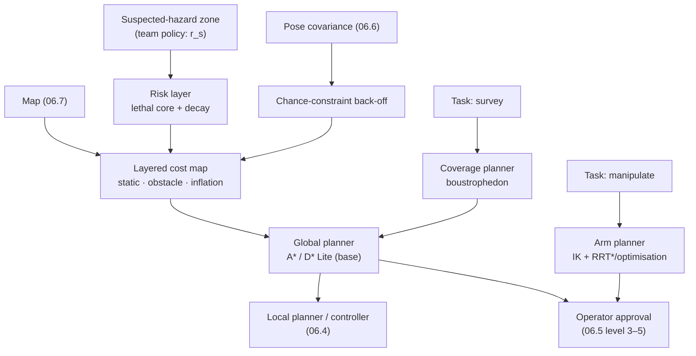

# 06.8 · Path & motion planning

<div class="module-card">

**Prerequisites** [06.7 Mapping & SLAM](lessons/stage-06/lesson-07.md) (occupancy grids) · [06.6 State estimation](lessons/stage-06/lesson-06.md) (covariances) · [06.3 Manipulators](lessons/stage-06/lesson-03.md) (joint space, forward kinematics) · [05.7 Search theory](lessons/stage-05/lesson-07.md) (sweep width) · algorithms (priority queues, graph search).

**Estimated time** 8 h (3.5 h theory · 1.5 h simulator · 3 h programming) · **Level** Advanced

**Next** [06.9 Communications, reliability & fail-safe design](lessons/stage-06/lesson-09.md), then [09.5 Active perception & autonomous exploration](lessons/stage-09/lesson-05.md).

<p class="tags"><span>planning</span><span>A*</span><span>D* Lite</span><span>RRT*</span><span>cost maps</span><span>coverage</span><span>chance constraints</span><span>Sim G</span><span>P06</span></p>
</div>

## Why this matters

In most robotics, the planner's job is to find a short, collision-free path. In EOD work the
objective is different: the robot must approach a suspected hazard only as closely and only
along the routes the team has chosen, avoid disturbing anything else on the way, keep its radio
link, keep enough battery to come back, and — for survey tasks — cover an area completely with
a sensor whose sweep width is known. "Shortest" is rarely the right objective; *least exposure
subject to constraints* usually is. This lesson builds the standard planning toolbox (graph
search, incremental replanning, sampling-based planners, coverage, arm planning) and shows how
to encode EOD-specific preferences — standoff, uncertainty, risk — in the cost function and the
constraints, where they belong.

## Learning objectives

1. Construct the **configuration space** of a mobile base and an arm and explain obstacle
   inflation (Minkowski sums) and why footprint shape and heading matter for tracked robots.
2. Prove that A* with an **admissible** heuristic returns an optimal path and that a
   **consistent** heuristic ensures no node is expanded twice; compute octile distances.
3. Build a layered **cost map** with lethal, inflation and **risk** layers, and interpret an
   additive risk cost as a log-survival probability.
4. Explain **D\* Lite**'s incremental replanning (keys, $g$ vs $rhs$, $k_m$) and when it pays off.
5. State the guarantees of **RRT** (probabilistic completeness) and **RRT\*** (asymptotic
   optimality) and compute the RRT* rewiring radius.
6. Plan a **boustrophedon coverage** survey from sensor sweep width, and outline **arm motion
   planning** (MoveIt pipeline) and **chance-constrained** planning under uncertainty.

## Theory

### 1. Configuration space

A robot's **configuration** $q$ is the minimal set of parameters that fixes the position of
every point of the robot: $(x,y,\theta)\in SE(2)$ for a base; $(\theta_1,\ldots,\theta_n)\in T^n$
for an arm. The **configuration-space obstacle** is
$\mathcal C_{\text{obs}} = \{q : \mathcal A(q)\cap\mathcal O \ne\emptyset\}$ and planning happens
in $\mathcal C_{\text{free}} = \mathcal C\setminus\mathcal C_{\text{obs}}$ (Lozano-Pérez 1983;
LaValle 2006).

For a disc robot of radius $r$ translating in the plane,
$\mathcal C_{\text{obs}} = \mathcal O \oplus B_r$ (Minkowski sum): **inflate obstacles by $r$
and plan for a point**. A tracked EOD robot is a rectangle (often with a protruding arm), so
$\mathcal C_{\text{obs}}$ depends on heading: a 0.7 m × 1.1 m chassis fits through a 0.9 m door
only nearly aligned with it. Practical planners inflate by the *inscribed* radius (necessary
collision) for search and check the true footprint along the result.

| Symbol | Meaning | Unit |
|---|---|---|
| $q$ | configuration | m, rad |
| $\mathcal C_{\text{free}}$, $\mathcal C_{\text{obs}}$ | free / obstacle configuration space | — |
| $r_{\text{in}}$, $r_{\text{circ}}$ | inscribed / circumscribed radius of the footprint | m |

**Numerical example.** Chassis 0.7 × 1.1 m: $r_{\text{in}} = 0.35$ m,
$r_{\text{circ}} = \tfrac12\sqrt{0.7^2+1.1^2} = 0.652$ m. A 0.9 m doorway appears passable when
inflating by $r_{\text{in}}$ (needs > 0.70 m) but impassable when inflating by
$r_{\text{circ}}$ (needs > 1.30 m) — a conservative planner would declare the building
inaccessible. Maximum heading misalignment for the rectangle to pass: $0.7\cos\psi + 1.1\sin\psi
\le 0.9$ with the wall thickness ignored gives $\psi \le 11.2°$.

```python
import numpy as np
from scipy.optimize import brentq
w, l, door = 0.7, 1.1, 0.9
print(0.5 * np.hypot(w, l))
psi = brentq(lambda p: w * np.cos(p) + l * np.sin(p) - door, 0, np.pi / 4)
print(np.degrees(psi))   # 11.2 deg
```

<details class="answer"><summary>Exercise 1 — then reveal</summary>

The arm is stowed so that it protrudes 0.25 m beyond the front of the chassis on the centreline.
How does this change $r_{\text{circ}}$ (measured from the chassis centre) and why does it
matter most when turning in place in a corridor?

*Answer.* The farthest point becomes the arm tip at $(0.55+0.25, 0) = 0.80$ m versus the
corner at 0.652 m. Turning in place sweeps a disc of radius $r_{\text{circ}}$: a corridor must be
> 1.60 m wide instead of > 1.30 m. Stowed-arm geometry is a mobility parameter.

</details>

### 2. Dijkstra and A\*

On a graph with non-negative edge costs $c(n,n')$, **Dijkstra** expands nodes in order of
cost-to-come $g(n)$. **A\*** (Hart, Nilsson & Raphael 1968) expands in order of
$f(n) = g(n) + h(n)$, where $h$ estimates the cost-to-go $h^\ast(n)$.

<div class="callout eq">

$$ \text{admissible: } h(n)\le h^\ast(n)\ \ \forall n;\qquad \text{consistent: } h(n) \le c(n,n') + h(n')\ \ \forall (n,n'),\ h(\text{goal}) = 0 . $$

</div>

**Optimality (admissible $h$).** Suppose A\* pops the goal with cost $g(\text{goal}) > C^\ast$.
Some node $n$ on an optimal path is still open with $g(n) = g^\ast(n)$, so
$f(n) = g^\ast(n) + h(n) \le g^\ast(n) + h^\ast(n) = C^\ast < f(\text{goal})$ — contradicting that
the goal was popped first. **Consistency** implies $f$ is non-decreasing along any path, so each
node is expanded at most once (the first pop has optimal $g$), and consistency implies
admissibility. Weighted A\* with $f = g + \varepsilon h$ ($\varepsilon>1$) returns a path with cost
$\le \varepsilon C^\ast$, usually with far fewer expansions.

On an 8-connected grid with unit cells the exact obstacle-free cost-to-go is the **octile
distance** $h = \max(\Delta x,\Delta y) + (\sqrt2-1)\min(\Delta x,\Delta y)$ — admissible and
consistent (Euclidean is also, but weaker).

| Symbol | Meaning | Unit |
|---|---|---|
| $g(n)$ | best known cost from start to $n$ | cost (m if cost = length) |
| $h(n)$ | heuristic cost-to-go | same |
| $h^\ast(n)$ | true optimal cost-to-go | same |
| $C^\ast$ | optimal path cost | same |

**Numerical example.** $\Delta x = 7$, $\Delta y = 3$ cells at 0.1 m: octile $= 4 + 3\sqrt2 =
8.243$ cells $= 0.824$ m; Euclidean $= 7.616$ cells. In the cost-map experiment of §3 (81 × 81
grid), Dijkstra expanded 6086 nodes, A\* 2115 with identical optimal cost 26.42; weighted A\*
($\varepsilon=2$) expanded 907 but returned cost 32.88 ($\le 2\times26.42$), taking a shorter
path closer to the hazard — a reminder that "suboptimal" means *riskier* here.

```python
import heapq

def astar(cost, start, goal, res=1.0, hw=1.0):
    """8-connected A* on a cost map; cost[r, c] = extra cost per metre (np.inf = lethal).
    Edge cost = length * (1 + mean cell cost). hw = heuristic weight (0 → Dijkstra)."""
    R, C = cost.shape
    def h(n):
        dr, dc = abs(n[0] - goal[0]), abs(n[1] - goal[1])
        return hw * res * (max(dr, dc) + (np.sqrt(2) - 1) * min(dr, dc))
    g, parent, openq, closed = {start: 0.0}, {start: None}, [(h(start), start)], set()
    while openq:
        _, n = heapq.heappop(openq)
        if n in closed: continue
        if n == goal: break
        closed.add(n)
        for dr in (-1, 0, 1):
            for dc in (-1, 0, 1):
                m = (n[0] + dr, n[1] + dc)
                if (dr, dc) == (0, 0) or not (0 <= m[0] < R and 0 <= m[1] < C): continue
                if not np.isfinite(cost[m]): continue
                step = res * np.hypot(dr, dc) * (1 + 0.5 * (cost[n] + cost[m]))
                if g[n] + step < g.get(m, np.inf):
                    g[m], parent[m] = g[n] + step, n
                    heapq.heappush(openq, (g[m] + h(m), m))
    path, n = [], goal
    while n is not None: path.append(n); n = parent[n]
    return path[::-1], g[goal], len(closed)
```

<details class="answer"><summary>Exercise 2 — then reveal</summary>

In the edge cost above, cells have cost $\ge 0$ so the true cost of any move is at least its
length. Is the octile heuristic (scaled by `res`) still admissible? What if the cost map allowed
*negative* costs to reward, e.g., staying in radio coverage?

*Answer.* Yes: every edge costs $\ge$ its length, and octile is the minimum length, so
$h\le h^\ast$. With negative cell costs, edge costs can drop below length (and, if negative, break
Dijkstra/A\* entirely). Encode "reward" as a *penalty elsewhere* (penalise leaving coverage)
so all costs stay $\ge$ length.

</details>

### 3. Cost maps with risk layers

A **layered cost map** (as in ROS Nav2) combines: a static layer (the map), an obstacle layer
(live sensor data), an **inflation** layer (cost decaying with distance from obstacles, so paths
keep clearance), and task-specific layers. For EOD, the essential task layer is **standoff from
suspected hazards**: a lethal core that the base must not enter, surrounded by a cost that
decays with distance, so that the planner prefers routes that stay away when it can.

$$ c(\mathbf p) = \begin{cases} \infty & d(\mathbf p) < r_s \\ w\,\exp\!\left(-\dfrac{(d(\mathbf p)-r_s)^2}{2\sigma^2}\right) & d(\mathbf p)\ge r_s \end{cases} $$

| Symbol | Meaning | Unit |
|---|---|---|
| $d(\mathbf p)$ | distance from cell to the suspected hazard | m |
| $r_s$ | standoff radius set by the team (policy input, not computed here) | m |
| $w$ | weight of the risk layer relative to path length | — (per metre) |
| $\sigma$ | decay length of the risk layer | m |

**Risk as log-survival.** Interpret $\lambda(\mathbf p)$ as a hazard rate per metre — the
probability per metre of an undesired event (disturbing the scene, a tip-over on debris,
entanglement). Then the probability of completing a path $\gamma$ without the event is
$P_s = \exp\!\big(-\int_\gamma \lambda\,ds\big)$, and $-\ln P_s = \int\lambda\,ds$ is *additive
along the path*. Minimising $\int (1 + \lambda/\lambda_0)\,ds$ trades metres against survival at
an explicit exchange rate $\lambda_0$. This is the principled reading of "risk cost".

**Numerical example.** *Illustrative numbers only.* An 81 × 81 grid of 0.25 m cells, a suspected
hazard at the centre, $r_s = 3$ m, $w = 2$, $\sigma = 1.5$ m. Start and goal lie on opposite sides
20 m apart. Lethal core only: path 22.49 m, grazing the 3.0 m boundary. With the risk layer:
25.38 m, closest approach 6.5 m. The team pays 2.9 m of travel for 3.5 m of extra standoff —
and they can *see* and tune that exchange rate.

A second view: with (abstract) hazard rates of 0.02 m⁻¹ for 10 m near the item and 0.001 m⁻¹
elsewhere, a direct 20 m route has $P(\text{event}) = 1 - e^{-0.21} = 0.19$; a 28 m detour
entirely at 0.001 m⁻¹ has $1 - e^{-0.028} = 0.028$.

```python
res, N = 0.25, 81
yy, xx = np.mgrid[0:N, 0:N] * res
d = np.hypot(yy - 10.0, xx - 10.0)                  # fictional suspected hazard at (10, 10) m
r_s, w, sigma = 3.0, 2.0, 1.5                       # illustrative policy parameters
cost = w * np.exp(-((d - r_s) ** 2) / (2 * sigma**2)) * (d >= r_s)
cost[d < r_s] = np.inf
path, c, n_exp = astar(cost, (40, 0), (40, 80), res)
p = np.array(path) * res
print(np.sum(np.hypot(*np.diff(p, axis=0).T)), np.min(np.hypot(p[:, 0] - 10, p[:, 1] - 10)))
# ≈ 25.38 m long, closest approach ≈ 6.5 m
```

<div class="callout safety">

**Where the numbers come from.** A planner must never *derive* the standoff radius; it is a
policy input from the team, informed by published public-safety guidance (04.4) and the
incident commander's judgement (07.2). The planner's job is to respect it exactly (lethal
layer) and to prefer margin beyond it (risk layer) — and to show the operator the resulting
closest approach, not just the path.

</div>

<details class="answer"><summary>Exercise 3 — then reveal</summary>

The hazard position is uncertain: the team's estimate has σ = 1 m in each axis (from 06.6-style
estimation of a bearing-only sighting). How would you modify the cost map, and by roughly how
much should the lethal radius grow for a 99 % containment of the true position in 2D?

*Answer.* Convolve the risk layer with the position uncertainty (or equivalently use the
*expected* cost), and inflate the lethal core by the 99 % radius of a 2D Gaussian:
$\sigma\sqrt{-2\ln 0.01} = 1\times3.03 = 3.03$ m — the lethal radius becomes $r_s + 3.0$ m. This
is §7's chance constraint in disguise.

</details>

### 4. Incremental replanning: D\* Lite

A tracked robot moving through a building keeps discovering obstacles. Replanning from scratch
with A\* each time is correct but wasteful when changes are local. **D\* Lite** (Koenig &
Likhachev 2002) searches *backwards* from the goal, keeps for each node $g(s)$ and a one-step
lookahead $rhs(s) = \min_{s'} \big(c(s,s') + g(s')\big)$, and repairs only locally inconsistent
nodes ($g \ne rhs$) using priority

$$ k(s) = \big[\min(g(s), rhs(s)) + h(s_{\text{start}}, s) + k_m;\ \ \min(g(s), rhs(s))\big], $$

compared lexicographically; $k_m$ accumulates $h(s_{\text{last}}, s_{\text{start}})$ each time the
robot moves, so queued keys stay valid without re-sorting the queue.

| Symbol | Meaning | Unit |
|---|---|---|
| $g(s)$ | current cost-to-goal estimate | cost |
| $rhs(s)$ | one-step lookahead value | cost |
| $h(s_{\text{start}}, s)$ | heuristic from the robot to $s$ | cost |
| $k_m$ | key modifier accumulated as the robot moves | cost |

**Numerical example.** $g = 12$, $rhs = 10$, $h = 5$, $k_m = 2$: key $= [17; 10]$. After the
robot moves by a heuristic distance 3, $k_m = 5$ and a newly inserted node with $g = rhs = 10$,
$h=4$ gets $[19; 10]$.

**When it pays.** Changes near the robot (typical when sensing range is short) invalidate little
of the backward search tree; D\* Lite then does a small fraction of A\*'s work. Changes near the
goal invalidate most of the tree, and it degrades to roughly a full replan. Nav2-style systems
often simply replan with A\* at 1–5 Hz on local windows, which is simpler and good enough on
modern CPUs; D\* Lite matters on embedded hardware and large maps.

```python
def dstar_key(g, rhs, h, km):
    m = min(g, rhs); return (m + h + km, m)
print(dstar_key(12, 10, 5, 2), dstar_key(10, 10, 4, 5))   # (17, 10) (19, 10)
```

<details class="answer"><summary>Exercise 4 — then reveal</summary>

Why does D\* Lite search from the goal to the robot rather than from the robot to the goal?

*Answer.* The goal is fixed, the robot moves. Backward search keeps $g(s)$ = cost-to-goal, which
remains valid as the start changes; only the heuristic term (to the moving start) changes, which
$k_m$ handles. Forward search would have to recompute cost-to-come from every new start.

</details>

### 5. Sampling-based planning: RRT and RRT\*

Grids scale exponentially with dimension; a 6-DOF arm or a base with $(x,y,\theta,\text{flipper})$
needs sampling. **RRT** (LaValle 1998) grows a tree by sampling $q_{\text{rand}}$, extending the
nearest node toward it by a step $\eta$ if the segment is collision-free. It is
**probabilistically complete**: if a path with positive clearance exists, the probability of
finding it tends to 1 as samples grow. It is *not* asymptotically optimal — the path cost
converges to a suboptimal value with probability 1 (Karaman & Frazzoli 2011).

**RRT\*** adds (i) choosing the best parent among neighbours within radius $r_n$, and (ii)
**rewiring** neighbours through the new node if that lowers their cost. With

<div class="callout eq">

$$ r_n = \min\!\left\{\gamma\left(\frac{\ln n}{n}\right)^{1/d},\ \eta\right\},\qquad
\gamma > \gamma^\ast = 2\left(1+\frac1d\right)^{1/d}\left(\frac{\mu(\mathcal C_{\text{free}})}{\zeta_d}\right)^{1/d}, $$

</div>

RRT\* is **asymptotically optimal**: cost converges almost surely to $C^\ast$, at $O(\log n)$
extra cost per sample.

| Symbol | Meaning | Unit |
|---|---|---|
| $n$ | number of nodes | — |
| $d$ | dimension of $\mathcal C$ | — |
| $\mu(\mathcal C_{\text{free}})$ | Lebesgue measure (area/volume) of free space | m$^d$ (or rad$^d$) |
| $\zeta_d$ | volume of the unit ball in $\mathbb R^d$ ($\pi$ for $d=2$) | — |
| $\eta$ | steering step | m |

**Numerical example.** $d=2$, free area 100 m²: $\gamma^\ast = 2\sqrt{1.5}\sqrt{100/\pi} = 13.82$ m.
With $\gamma = \gamma^\ast$: $r_{100} = 2.97$ m, $r_{1000} = 1.15$ m, $r_{10000} = 0.42$ m — the
neighbourhood shrinks just slowly enough that each node keeps $O(\log n)$ neighbours.

```python
from math import gamma as Gamma, pi, log
def rrt_star_radius(n, d, free_measure):
    zeta = pi ** (d / 2) / Gamma(d / 2 + 1)
    g = 2 * (1 + 1 / d) ** (1 / d) * (free_measure / zeta) ** (1 / d)
    return g * (log(n) / n) ** (1 / d)

print([round(rrt_star_radius(n, 2, 100.0), 3) for n in (100, 1000, 10000)])   # 2.966 1.149 0.419
```

<details class="answer"><summary>Exercise 5 — then reveal</summary>

Why do sampling-based planners struggle with narrow passages (e.g. a doorway only 10 cm wider
than the robot), and name two remedies.

*Answer.* The probability that a uniform sample lands in the passage is proportional to its
measure, which is tiny (and shrinks further with heading constraints). Remedies: bridge/Gaussian
sampling biased toward obstacle boundaries; hybrid approaches that use a grid planner for the
base and sampling only for the arm; or explicitly encoding the doorway as a waypoint.

</details>

### 6. Coverage planning for survey

Survey tasks (sweeping an area with a detector; 05.7) need **complete coverage**, not a path to a
point. **Boustrophedon** ("ox-turning") coverage decomposes free space into cells without
interior obstacles (Choset 2000) and sweeps each with parallel lanes spaced by the effective
sensor width:

$$ s = W(1-o),\qquad N_{\text{lanes}} = \left\lceil \frac{B}{s} \right\rceil,\qquad L \approx N_{\text{lanes}}\,A_{\ell} + (N_{\text{lanes}}-1)\,s,\qquad T = L / v . $$

| Symbol | Meaning | Unit |
|---|---|---|
| $W$ | sensor sweep width (05.7) | m |
| $o$ | lane overlap fraction | — |
| $s$ | lane spacing | m |
| $A_\ell$, $B$ | lane length and area width | m |
| $L$, $T$, $v$ | path length, time, survey speed | m, s, m s⁻¹ |

**Numerical example.** A 40 m × 25 m area, $W = 1.0$ m, 20 % overlap: $s = 0.8$ m, 32 lanes,
$L = 32\times40 + 31\times0.8 = 1304.8$ m; at 0.3 m/s, 72.5 min — before turns, battery swaps
and re-surveys of alarms. Lanes aligned with the long side minimise the number of turns, which
for skid-steer robots are slow and odometry-destroying (06.6).

```python
def boustrophedon(x0, y0, length, width, spacing):
    lanes = int(np.ceil(width / spacing)); wps = []
    for k in range(lanes):
        y = y0 + min(k * spacing + spacing / 2, width)
        xs = (x0, x0 + length) if k % 2 == 0 else (x0 + length, x0)
        wps += [(xs[0], y), (xs[1], y)]
    return np.array(wps)

wps = boustrophedon(0, 0, 40, 25, 0.8)
print(len(wps) // 2, np.sum(np.hypot(*np.diff(wps, axis=0).T)))   # 32 lanes, 1304.6 m (last lane clipped to the boundary)
```

<details class="answer"><summary>Exercise 6 — then reveal</summary>

Localisation drift (06.6) makes lane positions uncertain with σ = 0.1 m perpendicular to the
lanes. What overlap keeps the probability of a gap between adjacent lanes below ~2.5 % (treat the
relative error of two adjacent lanes as Gaussian with σ√2)?

*Answer.* A gap occurs if lanes separate by more than the overlap $Wo$: need
$Wo \ge 1.96\cdot0.1\sqrt2 = 0.277$ m (one-sided 2.5 %), so $o\ge 28$ %. Localisation quality
directly buys survey speed.

</details>

### 7. Arm motion planning (the MoveIt pipeline)

Planning for a 5–6 DOF EOD arm happens in joint space $T^n$ where obstacles are complicated
(the robot's own body, the ground, the object, the environment). The MoveIt 2 pipeline is the
standard architecture:

1. **Planning scene**: robot model (URDF/SRDF), current joint state, collision objects from
   sensors (octomap) and allowed-collision matrix.
2. **Goal**: joint target, or Cartesian pose converted by **IK** (06.3) — often several IK
   solutions; choose by distance from current configuration and manipulability.
3. **Planner**: OMPL sampling planners (RRTConnect, RRT\*, PRM), or optimisation-based (CHOMP,
   STOMP, TrajOpt), or Pilz industrial (linear/circular Cartesian).
4. **Collision checking** of the path at a resolution tied to the swept distance of the links.
5. **Time parameterisation** (velocity/acceleration limits; e.g. TOTG) and execution with
   monitoring.

**Collision-check resolution.** Along a joint-space segment, the tip of a link of length $\ell$
moves at most $\ell\,\lVert\Delta q\rVert_\infty$ per step (per joint; sum along the chain for
the end effector). A move with largest joint change 1.0 rad checked every 1° needs
$\lceil 57.3\rceil = 58$ checks, and a 1 m link sweeps 1.75 cm between checks — so objects must
be inflated by at least that.

<details class="answer"><summary>Exercise 7 — then reveal</summary>

A 3-link arm has links 0.6, 0.5, 0.3 m. With joint-space checks every 0.5°, what is the maximum
end-effector sweep between checks if all three joints move?

*Answer.* Bound: the tip distance from joint 1 is ≤ 1.4 m, from joint 2 ≤ 0.8 m, from joint 3
≤ 0.3 m; sweep $\le (1.4+0.8+0.3)\times0.00873 = 2.2$ cm. Inflate collision geometry by ≥ 2.2 cm
or refine the resolution near obstacles.

</details>

### 8. Planning under uncertainty: chance constraints

When the robot's position is uncertain (06.6), "collision-free" becomes probabilistic. A
**chance constraint** requires $P(\text{collision}) \le \Delta$. For Gaussian position
$x\sim\mathcal N(\mu,\Sigma)$ and a linear obstacle boundary $a^\top x \le b$ (unit normal $a$),

<div class="callout eq">

$$ P(a^\top x > b) \le \Delta \iff a^\top\mu \le b - \Phi^{-1}(1-\Delta)\sqrt{a^\top\Sigma a} . $$

</div>

The deterministic constraint is **tightened** by a back-off proportional to the uncertainty
along the obstacle normal. With $N$ constraints and a joint budget $\Delta$, Boole's inequality
allows $\Delta_i = \Delta/N$ each (conservative; optimal *risk allocation* shares the budget
unevenly, Blackmore & Ono).

| Symbol | Meaning | Unit |
|---|---|---|
| $\mu$, $\Sigma$ | mean and covariance of position | m, m² |
| $a$, $b$ | obstacle half-plane normal and offset | —, m |
| $\Delta$ | allowed probability of violation | — |
| $\Phi^{-1}$ | standard normal quantile | — |

**Numerical example.** σ = 0.2 m along the normal, $\Delta = 10^{-3}$: $\Phi^{-1}(0.999) =
3.09$, back-off 0.62 m. Split over 5 constraints: $\Delta_i = 2\times10^{-4}$,
$\Phi^{-1} = 3.54$, back-off 0.71 m. Uncertainty is literally distance.

```python
from scipy.stats import norm
def backoff(sigma_n, delta): return norm.ppf(1 - delta) * sigma_n
print(backoff(0.2, 1e-3), backoff(0.2, 1e-3 / 5))   # 0.618, 0.708
```

<details class="answer"><summary>Exercise 8 — then reveal</summary>

A planner can either drive a longer route past fiducial markers (σ stays 0.05 m) or a shorter
route where σ grows to 0.3 m. With $\Delta = 10^{-3}$ on a 1.2 m wide passage for a robot that
needs 0.7 m, which route is feasible?

*Answer.* Free lateral slack is $(1.2-0.7)/2 = 0.25$ m each side. Back-off with σ = 0.05:
0.155 m — feasible. With σ = 0.3: 0.93 m — infeasible. Planning *where to be well-localised* is
part of planning (belief-space planning; NeBula's approach in 06.7).

</details>

## Visual explanation



<iframe class="sim-frame" src="sims/robotics-engineering/index.html?embed=1" height="720" loading="lazy"></iframe>

<a class="sim-link" href="sims/robotics-engineering/index.html" target="_blank">Open Sim G full-screen ↗</a>

## Worked example — approaching a fictional object across a car park

*Fictional scenario.* A robot must bring a camera to a viewing position 8 m from a fictional
"Object K-3" in a car park, starting 60 m away. The team sets a lethal standoff for the base of
6 m around a second, unrelated suspicious item (not the target) near the direct route. The map
comes from a quick SLAM pass (06.7).

1. **C-space.** Inflate parked cars by $r_{\text{in}} = 0.35$ m for search, check the true
   footprint along the result.
2. **Cost map.** Lethal disc of 6 m around the second item; risk layer $w=2$, $\sigma = 3$ m;
   inflation layer around cars; a mild penalty for cells outside the measured radio coverage
   map (06.9).
3. **Uncertainty.** Pose σ grows to 0.4 m on the open asphalt (few features): chance constraint
   with $\Delta = 10^{-3}$ adds $3.09\times0.4 = 1.24$ m to the lethal radius → 7.24 m.
4. **Search.** A\* with octile heuristic returns a route somewhat longer than the 60 m direct
   line. What must be *reported* with it: length, closest approach to the second item (≥ 7.24 m
   by construction, more where the risk layer pushes it out), time outside radio coverage, and
   the chance-constraint budget used.
5. **Replan.** A vehicle door found open blocks a lane; D\* Lite repairs the path locally.
6. **Final approach.** The last 2 m are planned for the arm/camera mast with RRT\* in joint
   space, then shown to the operator as a predictive ghost (06.5) for approval before execution.

## Simulation work

<div class="callout sim">

**Sim G, "obstacle course" and "survey" challenges.** (1) Write an A\* controller in the
in-browser editor; compare expansions with $h=0$, octile and $2\times$octile. (2) Add a risk
layer around the marked (fictional) hazard; sweep $w$ and plot path length vs closest approach —
a Pareto front. (3) Survey challenge: generate boustrophedon lanes for the given sensor width;
turn on localisation noise and measure coverage gaps. (4) Expert level: obstacles appear during
execution — compare replan-from-scratch with your incremental planner.

</div>

## Practical exercises

<details class="answer"><summary>Practical 1 — heuristic design</summary>

Your cost is time, not distance: the robot drives 0.8 m/s on asphalt and 0.3 m/s on grass,
and turning in place costs 2 s per 90°. Propose an admissible, consistent heuristic.

*Answer.* $h = \text{octile distance}/0.8$ (the fastest possible speed), ignoring turns — a lower
bound on time and consistent because each edge costs at least its length/0.8. Adding the minimum
unavoidable turn (e.g. the heading difference to the goal direction, costed at 2 s/90°) keeps it
admissible only if that turn is truly unavoidable — prove it or leave it out.

</details>

<details class="answer"><summary>Practical 2 — coverage with obstacles</summary>

A 30 × 20 m survey area contains a 6 × 4 m obstruction in the middle. Sketch the boustrophedon
cell decomposition with lanes along the 30 m side, and estimate the path length for $s = 0.8$ m.

*Answer.* The obstruction splits the sweep into cells: left (full height), top and bottom (above
and below the obstruction), right (full height). Total lane length ≈ covered area / $s$ = $(600-24)/0.8
= 720$ m, plus inter-lane moves (~25 × 0.8 = 20 m) plus cell-to-cell transits (~2 × 15 m): ≈
770 m.

</details>

<details class="answer"><summary>Practical 3 — critique a cost function</summary>

A colleague sets the hazard risk layer weight so high ($w = 1000$) that the path is "as far as
possible". What goes wrong?

*Answer.* The planner becomes indifferent to everything else — path length, terrain, radio
coverage, battery — and may choose absurd routes (hugging the map boundary, through poor terrain
where tip-over risk is real). The layer's slope also becomes huge, making local controllers
oscillate. Encode hard requirements as constraints (lethal) and preferences with calibrated
weights; show the Pareto trade-off to the team rather than hiding it in one number.

</details>

## Programming exercise — planners with benchmarks

**Goal.** Implement A\*, D\* Lite (or incremental A\*), RRT\* and boustrophedon coverage, and
benchmark them on EOD-flavoured scenarios.

- **Input:** occupancy grids from P07 or synthetic maps; hazard zones (position, uncertainty,
  policy radius); start/goal; sensor sweep width.
- **Output:** paths; length, closest approach to each hazard, integrated risk
  $\int\lambda\,ds$, expansions/time; coverage percentage and gap map for surveys.
- **Constraints:** Python + NumPy; A\* on a 500 × 500 grid < 2 s; RRT\* 5000 samples < 10 s.
- **Expected behaviour:** A\* expansions ≤ Dijkstra's with identical cost; RRT\* cost decreases
  with $n$ toward the grid optimum; D\* Lite replanning after a local change takes a small
  fraction of a full replan.
- **Test cases:** (i) the §3 scenario reproduces length 25.38 m and closest approach 6.5 m;
  (ii) the octile heuristic never exceeds the Dijkstra cost-to-go (check on random maps);
  (iii) boustrophedon on 40 × 25 m with $s=0.8$ gives 32 lanes.
- **Extensions:** Hybrid-A\* with heading for the rectangular footprint; chance-constrained A\*
  using the pose covariance along the path; multi-objective (length, risk, coverage) with a
  Pareto front.

This is [Project P06](projects/p06-path-planning/README.md).

## Reading

- LaValle, S. M., *Planning Algorithms*, CUP (2006), https://lavalle.pl/planning/ — free; ch. 4
  (configuration space), ch. 5 (sampling-based planning), ch. 2 (discrete planning).
- Lynch, K. M. & Park, F. C., *Modern Robotics*, CUP (2017),
  https://hades.mech.northwestern.edu/index.php/Modern_Robotics — ch. 10 (motion planning) with
  videos; good for C-space of arms.
- Nav2 documentation, https://docs.nav2.org/ — the layered costmap and planner/controller
  servers; read the costmap and inflation pages to see §3 in production code.
- MoveIt 2 documentation, https://moveit.picknik.ai/main/index.html — the planning-scene and
  motion-planning pipeline concepts of §7.

Also (primary papers, no links here): Hart, Nilsson & Raphael (1968) on A\*; Koenig & Likhachev
(2002) on D\* Lite; Karaman & Frazzoli (2011), "Sampling-based algorithms for optimal motion
planning"; Choset (2000) on coverage. Full bibliographic entries:
[curriculum/sources.md](curriculum/sources.md).

## Assessment

1. *(Mathematical)* Prove that a consistent heuristic is admissible.
2. *(Computation)* Compute the RRT\* radius for $d=3$, $\mu(\mathcal C_{\text{free}}) = 50$ m³,
   $n = 2000$, $\gamma=\gamma^\ast$.
3. *(Conceptual)* Why is RRT not asymptotically optimal, and what exactly does rewiring fix?
4. *(Interpretation)* A risk-layer sweep gives: $w=0$: 22.5 m / 3.0 m; $w=2$: 25.4 m / 6.5 m;
   $w=5$: 26.3 m / 7.3 m (length / closest approach). Which would you present to the team, and
   how?
5. *(Design)* Specify the cost-map layers and planner stack for a robot inspecting the
   underside of a (fictional) vehicle in a narrow alley.

<details class="answer"><summary>Answers to 1, 2 and 4</summary>

1. Induction on the number of edges to the goal along an optimal path: $h(\text{goal})=0=h^\ast$;
   if $h(n')\le h^\ast(n')$ then $h(n)\le c(n,n') + h(n') \le c(n,n') + h^\ast(n') = h^\ast(n)$.
2. $\zeta_3 = 4\pi/3 = 4.189$; $\gamma^\ast = 2(4/3)^{1/3}(50/4.189)^{1/3} = 2\cdot1.1006\cdot2.2855 =
   5.031$; $(\ln2000/2000)^{1/3} = (0.0038)^{1/3} = 0.1561$; $r = 0.785$ m.
4. Present all three as a Pareto table/plot: the marginal cost of standoff is 0.83 m of
   travel per metre of standoff from $w=0$ to 2, then 1.1 m/m from 2 to 5 — diminishing returns.
   Let the team choose; record the choice.

</details>

## Expert extension

- **Belief-space planning.** Plan over $(\mu,\Sigma)$ rather than $x$ (e.g. LQG-MP, FIRM,
  POMDP solvers); this is what NeBula did at scale (06.7) and what 09.5 builds on with
  information gain.
- **Kinodynamic planning** for tracked robots on slopes: sampling in state space with dynamics
  (Kinodynamic RRT\*, SST) and stability margins as constraints.
- **Optimisation-based planning** (TrajOpt, CHOMP): sequential convex programming with signed
  distance constraints; compare with sampling for arm tasks near clutter.
- **Formal guarantees**: temporal-logic specifications ("never enter zone Z; eventually visit V;
  always keep link") with automata-based planning.

## What comes next

[06.9](lessons/stage-06/lesson-09.md) supplies the radio coverage and loss-of-comms behaviours
the planner must respect. [09.5](lessons/stage-09/lesson-05.md) turns planning toward
*information*: where to go to learn the most, safely.
