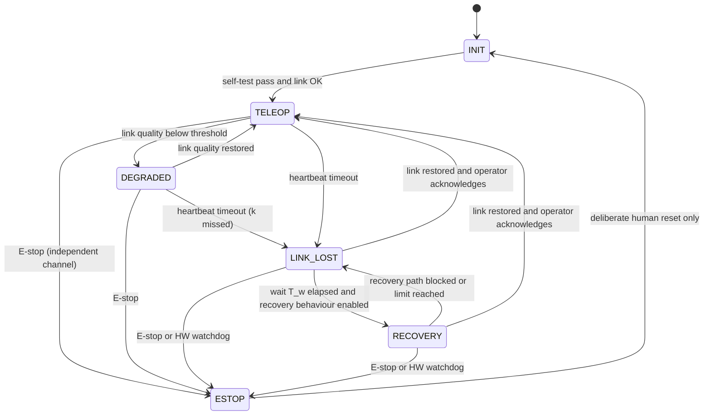

# 06.9 · Communications, reliability & fail-safe design

<div class="module-card">

**Prerequisites** [01.7 Electricity & EM](lessons/stage-01/lesson-07.md) (EM waves, RF, HERO/ESD as safety concepts) · [06.5 Teleoperation & HMI](lessons/stage-06/lesson-05.md) (delay, levels of automation) · probability (exponential and Gaussian distributions), decibels.

**Estimated time** 7 h (3.5 h theory · 1.5 h simulator · 2 h programming) · **Level** Advanced

**Next** [07.1 Decisions under uncertainty](lessons/stage-07/lesson-01.md), [07.2 Incident management](lessons/stage-07/lesson-02.md) and Capstone C1.

<p class="tags"><span>RF propagation</span><span>link budgets</span><span>reliability</span><span>FMEA</span><span>fault trees</span><span>state machines</span><span>Sim B · Sim G</span><span>P11</span></p>
</div>

## Why this matters

A teleoperated robot is only as good as its link, and the link is the least reliable part of
the system. Robots are driven into buildings, basements, culverts and vehicles — exactly the
places radio does not like — with antennas a few tens of centimetres above the ground. When the
link fails, the robot is alone near a hazard with whatever behaviour its designers gave it.
Murphy's analysis of disaster-robot deployments and the DARPA SubT results (06.7) both identify
communications as a dominant failure mode. On top of physics, EOD teams frequently work in an
**RF-controlled environment**: transmissions near a suspected item may be deliberately
restricted or affected by protective systems, so a robot that *needs* an unrestricted radio link
may simply not be usable.

This lesson gives the physics to predict link quality (free-space and two-ray propagation,
Fresnel zones, penetration, fading), the arithmetic of a link budget, the design space of relays,
tethers and loss-of-comms behaviours, and the reliability engineering — exponential failure
models, redundancy, FMEA, fault trees, watchdogs and safety state machines — that makes the
robot's behaviour predictable when things fail.

## Learning objectives

1. Compute free-space path loss with **Friis**, the **two-ray** ground-reflection loss and its
   breakpoint distance, and the **first Fresnel zone** radius; explain why low antennas are so
   costly.
2. Build a **link budget** from transmit power, antenna gains, losses, receiver noise figure and
   required SNR; add **fade** and **shadowing** margins with stated outage probabilities.
3. Compare **relays**, **mast antennas** and **tethers** quantitatively and qualitatively.
4. Design **loss-of-comms behaviours** (stop, retro-traverse, return-to-last-good-comms) as a
   verified state machine with watchdog timeouts, and compute false-trigger rates.
5. Compute mission reliability with **exponential failure** models, series/parallel and
   k-out-of-n structures, including **common-cause** failures.
6. Perform an **FMEA** (with RPN and its limitations) and a **fault tree** analysis with minimal
   cut sets for a robot safety function.

## Theory

### 1. Free-space propagation: Friis

For isotropic radiation, power density at distance $d$ is $P_t G_t/(4\pi d^2)$; a receiving
antenna of effective aperture $A_e = G_r\lambda^2/4\pi$ collects

<div class="callout eq">

$$ P_r = P_t\,G_t\,G_r\left(\frac{\lambda}{4\pi d}\right)^2,\qquad
\mathrm{FSPL_{dB}} = 20\log_{10}d_{\text{km}} + 20\log_{10}f_{\text{MHz}} + 32.44 . $$

</div>

| Symbol | Meaning | Unit |
|---|---|---|
| $P_t$, $P_r$ | transmitted / received power | W (or dBm) |
| $G_t$, $G_r$ | antenna gains (relative to isotropic) | — (dBi) |
| $\lambda = c/f$ | wavelength | m |
| $d$ | distance | m (km in the dB form) |
| $f$ | frequency | Hz (MHz in the dB form) |

**Intuition.** The $1/d^2$ is geometry (energy spread over a sphere). The $\lambda^2$ is an
antenna effect: at higher frequency an antenna of the same gain is physically smaller and
collects less. "Higher frequencies propagate worse in free space" is really "small antennas
catch less".

**Numerical example.** 2.4 GHz over 200 m: $20\log 0.2 + 20\log 2400 + 32.44 = -13.98 + 67.60 +
32.44 = 86.1$ dB. Doubling distance adds 6.0 dB.

```python
import numpy as np
C = 299_792_458.0
def fspl_db(d_m, f_hz): return 20 * np.log10(4 * np.pi * d_m * f_hz / C)
print(fspl_db(200, 2.4e9))   # 86.07 dB
```

<details class="answer"><summary>Exercise 1 — then reveal</summary>

Compare FSPL at 200 m for 433 MHz, 2.4 GHz and 5.8 GHz. What does this suggest, and what does
it ignore?

*Answer.* 71.2, 86.1 and 93.7 dB. Lower frequencies lose less for fixed-gain antennas and
diffract and penetrate better; but they need larger antennas, offer less bandwidth (video!), and
the choice is constrained by regulation and by the RF-control considerations of §6.

</details>

### 2. The ground matters: two-ray model and Fresnel zones

Near the ground, the direct ray interferes with a ground-reflected ray. For $d \gg h_t, h_r$ and
reflection coefficient ≈ −1, beyond the **breakpoint** $d_c$:

$$ P_r \approx P_t G_t G_r \frac{h_t^2 h_r^2}{d^4},\qquad d_c = \frac{4\pi h_t h_r}{\lambda},\qquad
\mathrm{PL_{2ray,dB}} = 40\log_{10}d - 20\log_{10}(h_t h_r). $$

The **first Fresnel zone** — the ellipsoid within which path lengths differ by less than
$\lambda/2$ — has radius at a point $d_1$, $d_2$ from the ends

$$ r_1 = \sqrt{\frac{\lambda\, d_1 d_2}{d_1 + d_2}} ; $$

keeping ~60 % of $r_1$ clear of obstructions (including the ground) keeps loss near free space.

| Symbol | Meaning | Unit |
|---|---|---|
| $h_t$, $h_r$ | antenna heights above ground | m |
| $d_c$ | breakpoint distance | m |
| $r_1$ | first Fresnel-zone radius | m |
| $d_1$, $d_2$ | distances from each end | m |

**Intuition.** Beyond $d_c$ the direct and reflected rays nearly cancel, and loss grows at
40 dB/decade instead of 20. Antenna height enters *squared* on each end: raising an antenna is
worth 6 dB per doubling. Beyond the breakpoint, loss is (to first order) frequency-independent.

**Numerical example.** Robot antenna $h_t = 0.5$ m, operator antenna $h_r = 1.5$ m, 2.4 GHz
($\lambda = 0.125$ m): $d_c = 4\pi\cdot0.75/0.125 = 75.4$ m (at 900 MHz, 28.3 m). At 300 m:
two-ray loss $101.6$ dB versus FSPL $89.6$ dB — 12 dB worse. The Fresnel radius at the midpoint of
200 m is $\sqrt{0.125\cdot100\cdot100/200} = 2.50$ m; 60 % clearance needs 1.5 m, yet the robot
antenna is at 0.5 m. A 3 m mast on the operator's end doubles $h_r$: +6 dB and $d_c = 151$ m.

```python
def tworay_db(d, ht, hr): return 40 * np.log10(d) - 20 * np.log10(ht * hr)
def breakpoint(ht, hr, f): return 4 * np.pi * ht * hr / (C / f)
def fresnel_r1(d1, d2, f): lam = C / f; return np.sqrt(lam * d1 * d2 / (d1 + d2))

print(breakpoint(0.5, 1.5, 2.4e9), tworay_db(300, 0.5, 1.5), fresnel_r1(100, 100, 2.4e9))
# 75.4 m, 101.6 dB, 2.50 m
def path_loss_db(d, ht, hr, f): return np.maximum(fspl_db(d, f), tworay_db(d, ht, hr))
```

<details class="answer"><summary>Exercise 2 — then reveal</summary>

The robot lowers its antenna from 0.5 m to 0.25 m to pass under a vehicle. How many dB does the
link lose beyond the breakpoint, and how does the maximum range change for a fixed budget?

*Answer.* $20\log(0.5/0.25) = 6.0$ dB. With $d^4$ scaling, range falls by $10^{-6/40} = 0.71$ —
a 29 % range loss from one posture change. Posture-dependent link quality belongs in the OCU
display.

</details>

### 3. Penetration, shadowing and fading

**Building penetration.** Each wall or floor adds loss that depends on material, thickness,
moisture, reinforcement and frequency. Indicative single-wall values at 2.4 GHz in the
literature range from a few dB (plasterboard, wood) through roughly 5–15 dB (brick, blockwork)
to 15–30 dB or more (reinforced concrete, metal-backed insulation); ITU-R Recommendations P.2040
(material effects) and P.1238 (indoor propagation) provide models. Treat such numbers as
*order-of-magnitude*: measure on site when it matters. Lower frequencies generally penetrate
better. Metal (vehicles, shipping containers, ship compartments) is effectively opaque.

**Shadowing.** Location-to-location variation around the mean path loss is approximately
log-normal with σ of roughly 4–12 dB (larger indoors and in clutter). With margin $M$ dB,

$$ P_{\text{out,shadow}} = Q\!\left(\frac{M}{\sigma_{\text{dB}}}\right). $$

**Fast (multipath) fading.** Moving the robot a fraction of a wavelength changes received power
by tens of dB. For Rayleigh fading (no dominant path) with mean power $\bar P$, the probability
that power drops below threshold $P_{\min}$ is

$$ P_{\text{out,fade}} = 1 - \exp\!\left(-\frac{P_{\min}}{\bar P}\right) \;\Rightarrow\; \text{margin for outage } \epsilon:\ \ 10\log_{10}\!\frac{\bar P}{P_{\min}} = -10\log_{10}\!\big(-\ln(1-\epsilon)\big). $$

| Symbol | Meaning | Unit |
|---|---|---|
| $M$ | link margin above threshold | dB |
| $\sigma_{\text{dB}}$ | shadowing standard deviation | dB |
| $Q(\cdot)$ | standard normal tail probability | — |
| $\epsilon$ | target outage probability | — |

**Numerical example.** Rayleigh: 1 % outage needs 20.0 dB of fade margin, 0.1 % needs 30.0 dB.
Shadowing with $M=16.4$ dB and σ = 8 dB: $Q(2.05) = 2.0$ % of locations out. This is why diversity
(two antennas a half-wavelength or more apart; MIMO) is standard on robot radios: independent
fades rarely coincide.

```python
from scipy.stats import norm
def rayleigh_margin_db(eps): return -10 * np.log10(-np.log(1 - eps))
print(rayleigh_margin_db(0.01), rayleigh_margin_db(0.001))   # 20.0, 30.0 dB
print(norm.sf(16.4 / 8))                                      # 0.020
```

<details class="answer"><summary>Exercise 3 — then reveal</summary>

With two independent Rayleigh branches and selection diversity, outage is the product of branch
outages. What single-branch margin gives 1 % overall outage?

*Answer.* Need per-branch $\epsilon = \sqrt{0.01} = 0.1$: margin $= -10\log(-\ln0.9) = 9.8$ dB —
about 10 dB less than without diversity.

</details>

### 4. The link budget

<div class="callout eq">

$$ M = \underbrace{P_t + G_t + G_r - L_{\text{path}} - L_{\text{misc}}}_{P_r\ [\text{dBm}]} - \underbrace{\big(-174 + 10\log_{10}B + \mathrm{NF} + \mathrm{SNR}_{\text{req}}\big)}_{\text{sensitivity } S\ [\text{dBm}]} $$

</div>

| Symbol | Meaning | Unit |
|---|---|---|
| $P_t$ | transmit power | dBm |
| $G_t$, $G_r$ | antenna gains | dBi |
| $L_{\text{path}}$ | path loss (FSPL / two-ray / walls) | dB |
| $L_{\text{misc}}$ | cables, connectors, body blockage | dB |
| $-174$ | thermal noise density $kT_0$ at 290 K | dBm/Hz |
| $B$ | receiver bandwidth | Hz |
| NF | receiver noise figure | dB |
| $\mathrm{SNR}_{\text{req}}$ | SNR needed for the modulation/coding (and hence data rate) | dB |
| $M$ | margin available for fading, shadowing, walls | dB |

**Numerical example** (*generic, illustrative* radio): $P_t = 27$ dBm (0.5 W), 3 dBi antennas
each end, 3 dB misc. losses, $B = 10$ MHz, NF = 6 dB, SNR = 10 dB → $S = -174+70+6+10 = -88$ dBm.
Using $\max(\text{FSPL}, \text{two-ray})$ with $h_t=0.5$, $h_r=1.5$ m:

| $d$ (m) | $L_{\text{path}}$ (dB) | $P_r$ (dBm) | Margin (dB) |
|---|---|---|---|
| 100 | 82.5 | −52.5 | 35.5 |
| 200 | 94.5 | −64.5 | 23.5 |
| 300 | 101.6 | −71.6 | 16.4 |
| 500 | 110.5 | −80.5 | 7.5 |

Requiring a 20 dB fade margin, the allowed path loss is 98 dB → range ≈ 244 m in the open; one
12 dB wall halves it to ≈ 122 m (the $d^4$ law: 12 dB ⇒ factor 2). A 3 m operator mast extends
the open-ground figure to ≈ 345 m.

```python
def link_margin(d, Pt=27, Gt=3, Gr=3, Lmisc=3, B=10e6, NF=6, snr=10, ht=0.5, hr=1.5, f=2.4e9, walls_db=0):
    S = -174 + 10 * np.log10(B) + NF + snr
    Pr = Pt + Gt + Gr - path_loss_db(d, ht, hr, f) - Lmisc - walls_db
    return Pr - S

for d in (100, 200, 300, 500):
    print(d, round(link_margin(d), 1))
```

<details class="answer"><summary>Exercise 4 — then reveal</summary>

The video stream needs 4× the bandwidth (40 MHz) at the same SNR. How much range is lost beyond
the breakpoint? What does a practical radio do instead of failing?

*Answer.* Sensitivity worsens by $10\log4 = 6$ dB; range scales by $10^{-6/40}=0.71$. Practical
radios adapt modulation/coding and bandwidth: video quality degrades (lower rate, resolution,
frame rate) before the control channel fails — so the control channel should be the most robust
(lowest-rate) service, prioritised over video.

</details>

### 5. Relays and tethers

**Relays.** Splitting a path into hops shortens each hop; beyond the breakpoint, halving distance
gains $40\log_{10}2 = 12$ dB. At 300 m, one relay at 150 m raises the per-hop margin from 16.4 to
28.5 dB. Costs: each hop adds latency (06.5) and, for single-radio half-duplex store-and-forward
relays on one channel, roughly halves throughput per hop. Relays can be placed by people, dropped
by the robot as "breadcrumbs" (as several SubT teams did), or carried by a second robot or a
tethered aerial platform. Placement is an optimisation: maximise the minimum per-hop margin
subject to where a relay can safely be put — itself a planning problem (06.8; Sim G's challenge 3,
"maintain communications").

**Mesh networking** makes relays self-organising; it also makes latency and routing variable,
which predictive displays must tolerate.

**Tethers.** A fibre-optic or copper tether removes the radio link from the equation:

| Property | Fibre tether | Radio |
|---|---|---|
| Bandwidth / latency | very high / negligible | limited / variable |
| Loss vs length | ~0.35 dB/km (single-mode, 1310 nm): irrelevant at robot scales | $d^2$–$d^4$ plus walls |
| RF emissions | none — compatible with RF-controlled environments | emits; may be restricted |
| Failure modes | snag, cut, crush, spool jam, drag on stairs/corners, limited length | fading, shadowing, interference |
| Mobility | constrained; retracing needed to avoid tangles | free |

The tether does not eliminate the loss-of-comms problem — it changes its failure modes (a
snagged or severed tether *is* a comms loss), so the behaviours of §7 are still needed.

### 6. The RF environment in EOD operations (conceptual)

EOD teams often operate where the use of radio is **deliberately controlled**. Two reasons are
public and conceptual: (i) some hazards may be sensitive to electromagnetic energy (the HERO/ESD
safety concepts of 01.7), which leads to emission-control rules near a suspected item; and (ii)
protective electronic systems may be operating on scene and can degrade friendly links. The
engineering consequences — without any detail of those systems — are clear:

- the robot must be operable over a **tether** or with radio emissions restricted, and the OCU
  must make the robot's emission state *visible*;
- the link design must assume **interference and degradation from friendly systems**, and the
  robot's loss-of-comms behaviour must be safe when that happens;
- equipment choice and frequency planning are **coordinated with the team** as part of incident
  management (07.2), not left to the robot operator alone.

<div class="callout boundary">

This course deliberately does not discuss electronic countermeasures, their frequencies, powers
or tactics, nor any aspect of how radio might initiate anything. The engineering point is only
that a robot must remain safe and useful when its radio is restricted or degraded.

</div>

### 7. Loss-of-comms behaviours (design options)

When the link is lost, the robot must do something *without* a human. The options form a design
space; the right choice depends on what the robot is doing and where:

| Behaviour | What it does | Strengths | Weaknesses |
|---|---|---|---|
| Stop and hold | brake tracks, hold arm joints, keep sensors running | predictable; disturbs nothing | robot may stay out of contact indefinitely |
| Stop, wait $T_w$, then retro-traverse | after a timeout, drive back along the recorded path (breadcrumbs) until the link returns | reuses a path known to be traversable | the path may have changed; backwards driving has poor sensing; odometry drift (06.6) |
| Return to last-good-comms | navigate to the pose where link quality was last above a threshold (from a logged RSSI map) | shortest recovery | needs reliable localisation and planning (06.7–06.8) |
| Continue mission autonomously | complete a pre-approved autonomous segment | useful in comms-denied search (SubT) | high automation level near hazards — rarely acceptable (06.5) |

Design principles: the **arm** should normally *hold* (any autonomous arm motion near an item is a
high-consequence action); base recovery should be **speed-limited** and **confined** to
previously traversed or pre-approved space; every transition should be **logged and visible**
when the link returns; and the behaviour must be **selectable and testable** in advance.

**Watchdog timeout and false triggers.** Heartbeats arrive at rate $r$; each is lost with
probability $p$. A timeout of $k$ missed heartbeats has, for independent losses, a false-trigger
rate of approximately

$$ \Lambda_{\text{false}} \approx r\,(1-p)\,p^{k}\quad[\text{per unit time}], $$

(each successful packet can start a run of $k$ losses). Real links lose packets in **bursts**
(Gilbert–Elliott models), so measure the distribution of gap lengths rather than trust
independence.

| Symbol | Meaning | Unit |
|---|---|---|
| $r$ | heartbeat rate | s⁻¹ |
| $p$ | packet loss probability | — |
| $k$ | consecutive losses that trigger the timeout ($T = k/r$) | — |

**Numerical example.** $r = 20$ Hz, $p = 0.1$: $k=5$ (250 ms) → $0.65$ false triggers per hour;
$k=10$ (500 ms) → $6.5\times10^{-6}$ per hour. Longer timeouts cost reaction time: at 0.5 m/s the
robot travels 0.25 m in 500 ms before stopping — which must be inside the planner's margins.

```python
def false_trigger_rate_per_hour(rate_hz, p_loss, k):
    return rate_hz * 3600 * (1 - p_loss) * p_loss ** k

print(false_trigger_rate_per_hour(20, 0.1, 5), false_trigger_rate_per_hour(20, 0.1, 10))
```

<details class="answer"><summary>Exercise 5 — then reveal</summary>

Measured gap statistics show bursts: after a loss, the next packet is lost with probability
0.6 (not 0.1). Estimate the false-trigger rate for $k=10$ using a two-state Markov chain
(P(loss | previous delivered) = 0.05, P(loss | previous lost) = 0.6).

*Answer.* A run of 10 losses starts with a 0.05 transition from a delivered packet and continues
with $0.6^9 = 0.0101$: probability per delivered packet $\approx 5.0\times10^{-4}$. Delivered
packets ≈ $20\cdot3600\cdot0.89$ (stationary delivered fraction $0.4/0.45 = 0.89$) ≈ 64 000 per
hour ⇒ ≈ 32 false triggers per hour, about five million times the independent-loss estimate.
Burstiness dominates — measure gap statistics, don't assume independence.

</details>

### 8. Reliability mathematics

For a component with constant failure rate $\lambda$ (the flat part of the bathtub curve):

<div class="callout eq">

$$ R(t) = e^{-\lambda t},\quad \mathrm{MTBF} = \frac1\lambda;\qquad
R_{\text{series}} = \prod_i R_i = e^{-t\sum\lambda_i};\qquad
R_{\text{parallel}} = 1 - \prod_i (1-R_i);\qquad
R_{2\text{oo}3} = 3R^2 - 2R^3 . $$

</div>

| Symbol | Meaning | Unit |
|---|---|---|
| $\lambda$ | failure rate | h⁻¹ |
| $t$ | mission time | h |
| $R(t)$ | probability of surviving to $t$ | — |
| MTBF | mean time between failures | h |
| $\beta$ | common-cause fraction (β-factor model) | — |

**Numerical example** (*illustrative rates*). Drive 1e-3, arm 2e-3, radio 5e-3, OCU 1e-3,
battery 5e-4 per hour; 2 h mission. Series: $\lambda = 9.5\times10^{-3}$ h⁻¹, MTBF 105 h,
$R = e^{-0.019} = 0.9812$ (1.9 % mission failure). Note $R(\text{MTBF}) = e^{-1} = 0.37$: MTBF is
not a "guaranteed life".

Duplicate the radio (independent): $R_{\text{radio}} = 1 - (1-0.99005)^2 = 0.99990$; system
$R = 0.9909$ — failure probability roughly halved. Now admit **common cause** (same
interference, same antenna mast, same software bug) with $\beta = 0.1$: $\lambda_c = 5\times10^{-4}$,
$\lambda_i = 4.5\times10^{-3}$; radio-pair unreliability rises from $1.0\times10^{-4}$ to
$1.08\times10^{-3}$ — a 10× degradation, entirely from the shared part. Redundancy buys little
unless the channels are **diverse** (different frequency bands, a tether *plus* a radio).

```python
lam = dict(drive=1e-3, arm=2e-3, radio=5e-3, ocu=1e-3, battery=5e-4); t = 2.0
R_series = np.exp(-t * sum(lam.values()))
R_rad = np.exp(-t * lam["radio"]); R_pair = 1 - (1 - R_rad) ** 2
beta = 0.1; Ri = np.exp(-t * (1 - beta) * lam["radio"]); Rc = np.exp(-t * beta * lam["radio"])
R_pair_ccf = (1 - (1 - Ri) ** 2) * Rc
others = np.exp(-t * (sum(lam.values()) - lam["radio"]))
print(R_series, others * R_pair, others * R_pair_ccf)   # 0.9812 0.9909 0.9900
```

<details class="answer"><summary>Exercise 6 — then reveal</summary>

Three independent tilt sensors each have $R = 0.95$ for the mission. Compare 1-out-of-3,
2-out-of-3 and 3-out-of-3 voting. Which would you use for a "stop if about to tip" function, and
why is the answer different for a "permit motion" function?

*Answer.* 1oo3: $1-0.05^3 = 0.999875$; 2oo3: $3(0.9025)-2(0.857375) = 0.99275$; 3oo3:
$0.857$. For a protective *trip* ("stop"), 1oo3 minimises missed trips but maximises spurious
trips; 2oo3 balances both. For a *permissive* ("allow motion only if all agree"), the safe
failure direction flips. Always ask: which failure direction is safe?

</details>

### 9. FMEA

**Failure Modes and Effects Analysis** walks through each component/function, lists how it can
fail, the effect at system level, the cause, current detection, and ranks them. A common (and
criticised) ranking is the **Risk Priority Number** $\mathrm{RPN} = S\times O\times D$, each on
1–10 (severity, occurrence, detection — where 10 means *hard* to detect).

| Item | Failure mode | System effect | S | O | D | RPN |
|---|---|---|---|---|---|---|
| Arm joint encoder | stale value after comms glitch | arm pose on OCU wrong; operator commands from a false picture | 9 | 4 | 6 | 216 |
| Video encoder | freezes, last frame repeated | operator believes robot is stationary | 10 | 2 | 8 | 160 |
| Track motor driver | overheats on stairs | robot stops on stairs | 7 | 3 | 3 | 63 |

**Limitations.** RPN multiplies ordinal scales (a 10-2-8 = 160 is ranked below 9-4-6 = 216 even
though severity 10 may be unacceptable at any occurrence); rank severity-10 items first regardless
of RPN (criticality analysis, FMECA). The frozen-video row is a classic: detection is hard
because the failure *looks like* normal operation — the fix is a design change (frame counter
and timestamp overlaid and checked by the OCU), which moves D from 8 to 2.

### 10. Fault trees

A **fault tree** starts from an undesired top event and decomposes it through AND/OR gates into
basic events. For independent basic events with small probabilities,

$$ P(\text{OR}) = 1-\prod(1-p_i) \approx \sum p_i,\qquad P(\text{AND}) = \prod p_i . $$

A **minimal cut set** is a smallest set of basic events that together cause the top event; single-
element cut sets are single points of failure.

**Example.** Top event: *robot continues driving more than $T$ after link loss.* It occurs if the
motor driver fails stuck-on ($p_A = 10^{-3}$ per demand) **OR** both the software watchdog
($p_B = 5\times10^{-3}$) **AND** the independent hardware watchdog ($p_C = 2\times10^{-2}$) fail.
Minimal cut sets: $\{A\}$, $\{B, C\}$. $P_{\text{top}} = 1-(1-10^{-3})(1-10^{-4}) = 1.10\times10^{-3}$
— 91 % from the single point of failure $A$. Improving the watchdogs further is nearly
worthless; a fail-safe brake that engages on loss of power (so "stuck-on driver" no longer
causes motion) removes the dominant cut set.

```python
pA, pB, pC = 1e-3, 5e-3, 2e-2
top = 1 - (1 - pA) * (1 - pB * pC)
print(top, pA / top)   # 1.10e-3, 0.91
```

<details class="answer"><summary>Exercise 7 — then reveal</summary>

Add a spring-applied, power-off brake that fails to engage with probability $p_D = 10^{-3}$ per
demand and is triggered by either watchdog. Redraw the tree and compute the top-event
probability, assuming the stuck driver is now only dangerous if the brake also fails.

*Answer.* Top $= (A \wedge D) \vee (B \wedge C)$: a stuck driver now causes motion only if the
brake also fails to engage, while if both watchdogs fail the brake is never commanded at all.
Minimal cut sets $\{A, D\}$ and $\{B, C\}$. $P \approx 10^{-6} + 10^{-4} = 1.01\times10^{-4}$
— an order of magnitude better, now dominated by the watchdog pair; common-cause between the two
watchdogs (shared clock or power) would need a β-factor too.

</details>

### 11. Safety state machines and watchdogs

The robot's safety behaviour should be an explicit, reviewable **state machine** with guarded
transitions, not logic scattered through the code. Principles (reflected in functional-safety
standards such as IEC 61508 and ISO 13849, which formalise them as safety integrity and
performance levels):

- **Fail-safe defaults.** Loss of power, signal or software must lead to the safe state
  (brakes on, arm holding) — *de-energise to safe*.
- **Independence.** The watchdog that stops the robot must not share the failure modes of the
  thing it watches: a hardware watchdog timer that cuts motor enable if the main computer stops
  refreshing it; an **independent emergency-stop** channel.
- **Latching.** An emergency stop latches: recovery needs a deliberate human action, not the
  link coming back.
- **Heartbeats carry meaning.** Sequence numbers and timestamps detect stale and replayed
  commands; commands expire (a "move at 0.5 m/s" message is valid for, say, 200 ms, then speed
  decays to zero).
- **Verification.** Model-check the state machine (no deadlock; E-STOP reachable from every
  state; no path from LINK_LOST to arm motion) and test every transition in simulation (Sim B,
  Sim G) and on hardware.

The analogy to Stage 3's treatment of safety-and-arming as a state machine with independent
interlocks is deliberate: good safety engineering looks the same everywhere.

## Visual explanation



In DEGRADED the speed is limited and continuous-rate arm modes are disabled; in LINK_LOST and
RECOVERY the arm holds; ESTOP latches.

<iframe class="sim-frame" src="sims/eod-robot/index.html?embed=1" height="720" loading="lazy"></iframe>

<a class="sim-link" href="sims/eod-robot/index.html" target="_blank">Open Sim B full-screen ↗</a>

<iframe class="sim-frame" src="sims/robotics-engineering/index.html?embed=1" height="720" loading="lazy"></iframe>

<a class="sim-link" href="sims/robotics-engineering/index.html" target="_blank">Open Sim G full-screen ↗</a>

## Worked example — a link plan for a building search

*Fictional scenario.* A robot must search a two-storey brick building whose entrance is 150 m
from the control point across open ground. The generic radio of §4 is available, plus one relay
and a 300 m fibre tether reel.

1. **Open-ground leg.** Two-ray loss at 150 m with the 1.5 m operator antenna: 89.5 dB → margin
   28.5 dB. Adequate for 20 dB fade margin with 8.5 dB to spare.
2. **Inside.** Two brick walls (assume 8–12 dB each, *to be measured*) plus 20 m inside:
   path loss at 170 m is 91.7 dB, plus 16–24 dB of walls → margin 2–10 dB. **Not adequate**
   against 20 dB of fading.
3. **Options.** (a) A relay at the doorway: the inside hop is ~20 m through at most two walls
   (~16–24 dB wall loss plus 66.1 dB free-space loss — 20 m is inside the breakpoint) →
   margin ≈ 28–36 dB; the outside hop is 150 m in the open → 28.5 dB. (b) A mast at the control point: +6 dB outside only — insufficient
   indoors. (c) Fibre tether: no RF, fully compatible with an RF-controlled scene, but stairs and
   doorways create snag risk and the robot must retrace its route to avoid tangles.
4. **Decision framework.** If emissions near the building are restricted by the team, (c) is the
   only option. Otherwise (a), with the relay placed by the robot on its way in (planned as a
   waypoint, 06.8), and (c) as a fallback.
5. **Loss-of-comms behaviour.** Heartbeat 20 Hz, $k=10$ (500 ms); stop and hold; after
   $T_w = 30$ s, return to the last pose with margin > 20 dB using the logged link map;
   arm holds throughout; all transitions logged.
6. **Reliability.** Radio + relay in series with each other for the inside leg: the relay is a
   single point of failure; the tether in parallel (diverse channel) turns it into a
   two-element cut set.

## Simulation work

<div class="callout sim">

**Sim B, telemetry and loss-of-comms.** (1) Drive round and behind buildings A and B and log
the link-margin read-out (and its obstruction count) vs position; identify each obstruction from
the steps in your log. (2) Set extra loss to 10 % in the experiment settings and count the
loss-of-comms events the debrief reports per simulated minute. Sim B's watchdog is fixed (hold
after 250 ms, loss-of-comms after 1 s), so vary the timeout *offline in Python*: simulate
Bernoulli packet loss at 10 Hz and plot false stops per hour against timeout. (3) Select each
loss-of-comms behaviour in turn and drive out of range: where does each leave the robot?
**Sim G, challenge 3 (maintain communications):** place relays so every route point has a working
chain (46 − 20 log₁₀ d − 22 · buildings ≥ 6 dB per hop); compute the minimum hop margin of your
placement and compare with your link-budget calculation.

</div>

## Practical exercises

<details class="answer"><summary>Practical 1 — link budget from scratch</summary>

900 MHz radio, 30 dBm, 2 dBi antennas, 2 dB misc., 2 MHz bandwidth, NF 5 dB, SNR 6 dB; robot
antenna 0.4 m, operator 2 m. Compute sensitivity, breakpoint and the open-ground range for a 20 dB
margin.

*Answer.* $S = -174 + 63.0 + 5 + 6 = -100.0$ dBm. $\lambda = 0.333$ m; $d_c = 4\pi\cdot0.8/0.333 =
30.2$ m. Allowed path loss $= 30+4-2+100-20 = 112$ dB; two-ray: $40\log d = 112 + 20\log0.8 =
110.06 \Rightarrow d = 564$ m.

</details>

<details class="answer"><summary>Practical 2 — FMEA for the tether</summary>

Write three FMEA rows for a fibre tether and propose a design change for the highest-severity one.

*Answer (example).* (1) Tether severed by track (S 8, O 4, D 3); (2) tether snags on a corner and
drags an object in the scene (S 10, O 3, D 7); (3) spool jams, robot stops (S 5, O 3, D 2). Row 2
is the priority by severity: add tether-tension sensing with an automatic stop and tension display
on the OCU (D 7 → 2), and plan routes with minimum turning (06.8).

</details>

<details class="answer"><summary>Practical 3 — choose a loss-of-comms behaviour</summary>

For each: (a) robot in an open car park, driving; (b) robot inside a building, arm extended near
a (fictional) object; (c) robot in a culvert on a tether. Choose a behaviour and justify.

*Answer.* (a) Stop, wait, then return-to-last-good-comms over open ground (well-localised, low
consequence). (b) Stop and hold, arm holds, no autonomous recovery — any motion near the object
is high-consequence; the team decides the next step. (c) Tether loss means a severed or
disconnected tether: stop and hold; a retro-traverse would drive over the tether; recovery is a
team decision.

</details>

## Programming exercise — a comms-aware safety supervisor

**Goal.** Implement and verify a safety supervisor for a simulated robot with a lossy link.

- **Input:** a robot simulation (P05) with a channel model (distance-dependent path loss,
  log-normal shadowing, Gilbert–Elliott burst loss, delay); heartbeat and command streams;
  a logged link-quality map.
- **Output:** the state-machine trace; stops, recoveries and false triggers per hour; robot
  displacement after link loss; a reliability/fault-tree report for the supervisor.
- **Constraints:** the supervisor is a pure function `(state, inputs, t) → (state, outputs)`;
  commands expire after 200 ms; E-STOP latches; no transition from LINK_LOST to arm motion.
- **Expected behaviour:** with independent 10 % loss and $k=10$, no false triggers in 10 simulated
  hours; with bursty loss, false triggers appear and your tuned timeout trades them against
  stopping distance.
- **Test cases:** (i) exhaustive transition coverage; (ii) property test: from any state and input
  sequence, E-STOP is reached within one step of the E-stop input; (iii) after link loss at
  0.5 m/s with $k=10$ at 20 Hz, the robot travels ≤ 0.25 m + braking distance.
- **Extensions:** model-check the state machine (e.g. with a small explicit-state search in
  Python); add return-to-last-good-comms with A\* (06.8) on the link map; compute the fault-tree
  top-event probability from simulated component failures by Monte Carlo and compare with the
  analytic value.

This extends [Project P11](projects/p11-teleoperation/README.md) (whose channel model it reuses).

## Reading

- Murphy, R. R., *Disaster Robotics*, MIT Press (2014),
  https://direct.mit.edu/books/monograph/3408/Disaster-Robotics — the chapters on deployments
  and failures: communications loss, tethers and operator practice from real incidents.
- Chung, T. H., Orekhov, V. & Maio, A., "Into the Robotic Depths: Analysis and Insights from the
  DARPA Subterranean Challenge" (2023),
  https://www.annualreviews.org/content/journals/10.1146/annurev-control-062722-100728 — the
  communications and autonomy-under-comms-loss findings.
- Tranzatto, M. et al., "Team CERBERUS Wins the DARPA Subterranean Challenge" (2022),
  https://arxiv.org/abs/2207.04914 — the networking and single-operator sections.
- NIST, *Standard Test Methods for Response Robots* (ASTM E54.09),
  https://www.nist.gov/el/intelligent-systems-division-73500/standard-test-methods-response-robots —
  the radio communications test methods (line-of-sight and non-line-of-sight range tests) show how
  link performance is measured reproducibly.

Also (textbooks and standards, no links here): Rappaport, *Wireless Communications: Principles and
Practice* (two-ray model, fading, link budgets); ITU-R P.2040 and P.1238 (building materials and
indoor propagation); the NASA *Fault Tree Handbook with Aerospace Applications* (2002);
IEC 61508 and ISO 13849 (functional safety). Full bibliographic entries:
[curriculum/sources.md](curriculum/sources.md).

## Assessment

1. *(Mathematical)* Derive the two-ray breakpoint $d_c = 4\pi h_t h_r/\lambda$ from the path-length
   difference $\Delta \approx 2h_th_r/d$ and the phase at which the rays stop adding
   constructively.
2. *(Computation)* A system has MTBF 200 h. What is the probability it survives a 6 h shift? Two
   such units in parallel, with β = 0.05?
3. *(Conceptual)* Why is "the link came back" not sufficient to leave ESTOP, but sufficient
   (with acknowledgement) to leave LINK_LOST?
4. *(Interpretation)* RSSI logs show a 15 dB step when the robot passes a doorway, and packet
   loss rising from 1 % to 30 % over 3 m beyond it. What is happening, and what should the
   supervisor do?
5. *(Design)* Draw a fault tree for "arm moves without operator command" and identify its
   single points of failure in a design with one motor controller per joint and one main
   computer.

<details class="answer"><summary>Answers to 1, 2 and 4</summary>

1. The reflected path is longer by $\Delta \approx 2h_th_r/d$; phase difference
   $\phi = 2\pi\Delta/\lambda = 4\pi h_t h_r/(\lambda d)$. With reflection coefficient −1 the rays
   add as $|1 - e^{-j\phi}| = 2\sin(\phi/2)$; beyond $\phi = 1$ rad ($d > d_c$) the small-angle
   regime $2\sin(\phi/2)\approx\phi\propto 1/d$ gives the $1/d^4$ power law.
2. $R = e^{-6/200} = 0.970$. Parallel with β = 0.05: $\lambda = 0.005$; independent part
   $\lambda_i = 0.00475$, common $\lambda_c = 0.00025$: $R = (1-(1-e^{-0.0285})^2)e^{-0.0015} =
   (1 - 0.000789)\times0.9985 = 0.9977$.
4. The doorway is a wall/Fresnel-zone transition (penetration step), and beyond it the robot is
   near the edge of the margin — shadowing and fading now dominate. The supervisor should enter
   DEGRADED (speed limit, suspend continuous arm modes), and the OCU should warn the operator
   and suggest a relay; continuing will probably trigger LINK_LOST.

</details>

## Expert extension

- **Ray tracing and measured maps.** Replace empirical models with ray-traced predictions from
  the SLAM map (06.7) and update them with measured RSSI (Gaussian-process link maps), so the
  planner (06.8) can optimise *expected* connectivity.
- **Multi-robot relaying** as a joint planning problem: some robots act as mobile relays
  (connectivity-constrained exploration, as in SubT).
- **Markov reliability models** with repair, dormant failures and periodic proof testing — the
  mathematics behind "probability of failure on demand" in IEC 61508.
- **Formal verification** of the supervisor with a model checker (e.g. TLA+ or UPPAAL for timed
  automata): prove timing properties such as "motion stops within 600 ms of link loss".

## What comes next

Stage 7 ([07.1](lessons/stage-07/lesson-01.md), [07.2](lessons/stage-07/lesson-02.md)) places the
robot, its link and its failure behaviours inside the team's decision-making and incident
management. Capstone C1 integrates teleoperation, estimation, SLAM, planning and the safety
supervisor into one mission.
