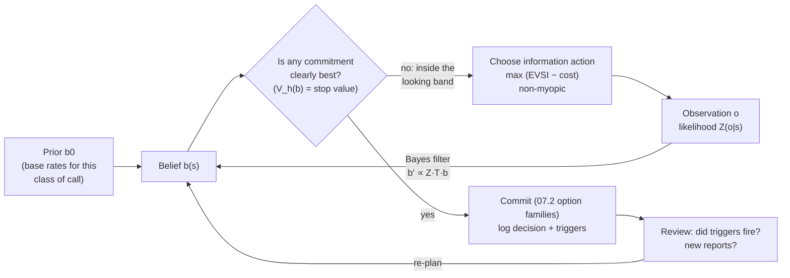

# 07.1 · Decisions under uncertainty

<div class="module-card">

**Prerequisites** [05.1 Detection theory](lessons/stage-05/lesson-01.md) (Bayes, likelihood ratios, ROC) · [05.6 Sensor fusion](lessons/stage-05/lesson-06.md) (log-odds fusion, expected information gain) · [04.4 Injury, fragments & secondary hazards](lessons/stage-04/lesson-04.md) · [03.4 Improvised hazards](lessons/stage-03/lesson-04.md) (the suspicious-item assessment) · probability and dynamic programming.

**Estimated time** 8 h (3.5 h theory · 2 h simulators · 2.5 h programming) · **Level** Advanced

**Next** [07.2 Incident management](lessons/stage-07/lesson-02.md), then [Project P12](projects/p12-hitl-decision/README.md) and [09.5 Active perception](lessons/stage-09/lesson-05.md).

<p class="tags"><span>decision theory</span><span>Bayes</span><span>value of information</span><span>POMDP</span><span>human factors</span><span>Sim F · Sim A</span><span>P12</span></p>
</div>

## Why this matters

An incident is not a puzzle that is solved once. It is a **sequence of commitments made on
incomplete, noisy, sometimes adversarial information**, under time pressure, where the worst
outcomes are irreversible. A report arrives; a cordon is set; a witness contradicts the caller; a
standoff image is ambiguous; a second report arrives from elsewhere. At every step the person in
charge chooses between *acting now* and *learning more first*, and each piece of learning costs
time, and time is exposure — for the public held behind a cordon, for the city whose transit is
closed, and above all for any person who has to go close.

The professional literature treats this as judgement acquired through years of supervised
experience; the UN IEDD Standards describe threat assessment at national, area and scene levels,
and every training pathway in [research/01](research/01-training-pathways.md) lists "risk
management and decision-making under uncertainty; human factors" as a core conceptual need. What
the literature rarely does is write the problem down mathematically. For an engineer that is the
fastest route to intuition: once you see the incident as a **partially observable sequential
decision problem**, familiar ideas — Bayes filters, value of information, Bellman recursion,
myopic vs non-myopic policies — explain *why* experienced practitioners behave as they do, and
where the known cognitive traps are.

<div class="callout boundary">

**Scope.** This lesson is a *decision framework* and a *simulation* vocabulary. The hypotheses,
sensors, actions and loss numbers below are deliberately abstract and fictional ("full response",
"release", "abstract sensor", loss units LU). Nothing here is a procedure for approaching,
diagnosing or dealing with any real item; real practice is governed by national doctrine and
certified training.

</div>

## Learning objectives

1. Formulate an incident as a sequential decision problem: hidden state, observations, actions,
   losses, and the belief state that summarises everything observed.
2. Perform Bayesian updating in odds and log-odds form, and explain why likelihood ratios — not
   raw "hit rates" — are the currency of evidence.
3. Derive expected-loss decisions, the **decision threshold** $p^{*}$, the **expected value of
   perfect information** (EVPI) and **of sample information** (EVSI); compute them for a
   fictional incident and explain when information is worth exactly zero.
4. Express **exposure minimisation** as an objective (integrated hazard over people and time) and
   use it to compare options.
5. Explain the POMDP framing, solve a one-dimensional belief-state problem by Bellman recursion,
   and show numerically why a myopic value-of-information policy can fail.
6. Recognise anchoring, confirmation bias, sunk cost and plan-continuation bias in a decision log,
   and name a structural debiasing counter-measure for each.
7. Contrast naturalistic (recognition-primed) and analytic decision making, and say when each is
   appropriate.

## Theory

### 1. The incident as a sequential decision problem

Write the incident as a tuple $(\mathcal S, \mathcal A, \mathcal O, T, Z, \ell)$:

| Symbol | Meaning | In an incident (abstract) |
|---|---|---|
| $s \in \mathcal S$ | hidden state of the world | "item is hazardous" $H$ / "item is benign" $B$; plus secondary hazards, crowd state, … |
| $a \in \mathcal A$ | action | request information, task a sensor or robot, change the cordon, escalate, commit to an outcome |
| $o \in \mathcal O$ | observation | witness statement, CCTV finding, sensor return, robot image |
| $T(s' \mid s,a)$ | state dynamics | the world can change: crowds move, a second report appears, time passes |
| $Z(o \mid s',a)$ | observation model | likelihood of each observation under each state (sensor ROC, witness reliability) |
| $\ell(s,a)$ | loss (negative utility) | disruption, exposure, harm, lost evidence — in loss units (LU) |
| $b(s)$ | **belief** — posterior over $s$ given everything observed | the incident commander's current picture |

The key structural fact: **the decision maker never observes $s$**. Everything rational she can
do is a function of $b$. The belief is a *sufficient statistic* of the history — the same idea
that makes a Kalman filter's mean and covariance sufficient in [06.6](lessons/stage-06/lesson-06.md).

Two families of actions matter, and confusing them is the root of many poor decisions:

- **Information actions** change $b$ but not $s$ (ask, look, measure). Their value is indirect.
- **Commitment actions** change the world (evacuate, reopen, choose a disposal-outcome family —
  07.2) and are often irreversible.

### 2. Hypotheses and Bayesian updating

For a binary hypothesis the cleanest form of Bayes' rule is in **odds**:

$$
\underbrace{\frac{P(H\mid e)}{P(B\mid e)}}_{\text{posterior odds } O_1}
= \underbrace{\frac{P(e\mid H)}{P(e\mid B)}}_{\text{likelihood ratio } \Lambda(e)}
\times \underbrace{\frac{P(H)}{P(B)}}_{\text{prior odds } O_0},
\qquad
\operatorname{logit} P(H\mid e_{1:n}) = \operatorname{logit} P(H) + \sum_{i=1}^n \ln \Lambda(e_i)
$$

(the sum requires the $e_i$ to be conditionally independent given the hypothesis).

| Symbol | Meaning | Unit |
|---|---|---|
| $P(H)$ | prior probability the item is hazardous (base rate for this *kind* of call, place, time) | — |
| $\Lambda(e)$ | likelihood ratio of evidence $e$: how much more probable $e$ is under $H$ than $B$ | — |
| $\operatorname{logit} p = \ln\frac{p}{1-p}$ | log-odds; "evidence units" that add | nepers (dimensionless) |

**Intuition.** Evidence does not "have a probability"; it *moves* the odds by a factor. A sensor
with $P_d = 0.9$, $P_{fa}=0.1$ moves the odds by $\Lambda = 9$ on a positive and by
$(1-0.9)/(1-0.1) = 0.111$ on a negative. Two weak, *independent* indicators can outweigh one
strong one; two *correlated* indicators (two witnesses who talked to each other; two sensors that
share a clutter source) must not be multiplied as if independent — this is the double-counting
error from [05.6](lessons/stage-05/lesson-06.md).

**Numerical example (fictional).** Unattended-bag calls at a fictional transit hub historically
turn out to be hazardous with base rate $P(H)=0.02$ (odds $0.0204$, logit $-3.89$). An abstract
standoff sensor with $P_d=0.9$, $P_{fa}=0.1$ reports positive: odds $0.0204\times9 = 0.184$,
$P(H\mid e)=0.184/1.184=0.155$. A subsequent independent observation with $\Lambda = 0.5$ (say,
CCTV showing the owner walking away distracted rather than deliberately) gives odds $0.0918$,
$P=0.084$.

```python
import numpy as np

def logit(p): return np.log(p / (1 - p))
def expit(x): return 1 / (1 + np.exp(-x))

def update(prior, likelihood_ratios):
    """Sequential Bayes in log-odds; assumes conditionally independent evidence."""
    return expit(logit(prior) + np.sum(np.log(likelihood_ratios)))

print(update(0.02, [9]))        # 0.155
print(update(0.02, [9, 0.5]))   # 0.084
```

<details class="answer"><summary>Exercise 1 — then reveal</summary>

Two witnesses independently say the bag was placed deliberately; each such statement has
$\Lambda = 3$. But you later learn they are a couple who discussed it before calling. (a) What
posterior would a naive analyst compute from prior 0.155? (b) What is a defensible range, and
what is the general lesson?

*Answer.* (a) Naive: odds $0.184\times 9=1.65$, $P=0.62$. (b) If fully dependent the two
statements are one piece of evidence: odds $0.184\times3=0.55$, $P=0.36$. The defensible answer
lies between 0.36 and 0.62 and should be reported as such. Lesson: *provenance* of evidence
(who saw what, who talked to whom) is as important as its content; the likelihood-ratio
arithmetic is only as good as the independence assumption.

</details>

### 3. Expected loss and the decision threshold

Consider two commitment actions (abstract): **F** = maintain a full response (cordon, disruption,
specialist assessment) and **R** = release the scene as benign. A fictional loss matrix in loss
units:

| $\ell(s,a)$ [LU] | $s = B$ (benign) | $s=H$ (hazardous) |
|---|---|---|
| $a = F$ (full response) | 20 (disruption) | 25 (disruption + residual risk) |
| $a = R$ (release) | 0 | 1000 (catastrophic) |

With belief $p = P(H)$, the expected losses are linear in $p$:

$$
\bar\ell(F) = 20(1-p) + 25p = 20 + 5p, \qquad \bar\ell(R) = 1000p,
$$

and the **decision threshold** where they cross is

$$
p^{*} = \frac{\ell(F,B)-\ell(R,B)}{\big(\ell(F,B)-\ell(R,B)\big) + \big(\ell(R,H)-\ell(F,H)\big)} = \frac{20}{20+975} = 0.0201 .
$$

| Symbol | Meaning | Unit |
|---|---|---|
| $\bar\ell(a)=\sum_s b(s)\ell(s,a)$ | expected loss of action $a$ under belief $b$ | LU |
| $p^{*}$ | belief above which F is optimal | — |

**Intuition.** $p^{*}$ is the ratio of the *cost of a false alarm* to the *total cost of both
errors*. When the catastrophic cost dwarfs the disruption cost, the threshold is tiny: you
maintain the full response even when you believe the item is 98 % likely to be benign. That is
not paranoia; it is arithmetic. It is also why false alarms are not "mistakes" — at a 2 %
threshold, the vast majority of correctly handled calls will turn out benign.

At $p=0.155$: $\bar\ell(F)=20.78$, $\bar\ell(R)=155$ → F.

<div class="callout key">

**Losses are value judgements, and many organisations do not use pure expected loss.** Society
typically refuses to trade a small probability of catastrophe against certain disruption at a
fixed exchange rate. A common structure is a **risk constraint**: release only if $P(H) <
\varepsilon$ *regardless* of disruption cost — a lexicographic rule. Mathematically this is an
expected-loss rule with a threshold imposed from policy rather than derived. Know which regime
you are in, and write it down.

</div>

<details class="answer"><summary>Exercise 2 — then reveal</summary>

A policy change raises the disruption loss of F to 60 LU (a major transport interchange at rush
hour). Compute the new $p^{*}$. Does the optimal action at $p=0.03$ change?

*Answer.* $p^{*} = 60/(60 + 975) = 0.058$. At $p=0.03$: $\bar\ell(F) = 60+5\cdot0.03 = 60.15$,
$\bar\ell(R)=30$ → release becomes optimal under pure expected loss. A risk-constraint regime
(e.g. release only if $p<0.01$) would still hold the full response. This is exactly the tension
the Frankfurt 2017 and London City Airport 2018 cases in [research/03](research/03-detection-forensics-sources.md)
illustrate: disruption costs are real and large, and organisations still chose large exclusion
zones.

</details>

### 4. Value of information: EVPI and EVSI

Information has value only through the decisions it changes. Let the current best expected loss be

$$ \mathcal L_0 = \min_a \sum_s b(s)\,\ell(s,a). $$

**Perfect information.** If an oracle revealed $s$ before you acted, you would pick the best
action for each state; averaged over your current belief,

$$
\mathcal L_{\text{PI}} = \sum_s b(s)\min_a \ell(s,a), \qquad \boxed{\text{EVPI} = \mathcal L_0 - \mathcal L_{\text{PI}} \ \ge 0 .}
$$

**Sample (imperfect) information.** An information action yields observation $o$ with predictive
probability $P(o)=\sum_s Z(o\mid s)b(s)$ and posterior $b_o$. Then

$$
\mathcal L_{\text{SI}} = \sum_o P(o)\,\min_a \sum_s b_o(s)\ell(s,a), \qquad
\boxed{\text{EVSI} = \mathcal L_0 - \mathcal L_{\text{SI}}, \quad 0 \le \text{EVSI} \le \text{EVPI}.}
$$

*Derivation of the bounds.* $\mathcal L_0 = \min_a \sum_o P(o)\,\bar\ell_{b_o}(a) \ge \sum_o
P(o)\min_a \bar\ell_{b_o}(a) = \mathcal L_{\text{SI}}$ because the minimum of a sum is at least
the sum of minima (you can adapt the action to $o$). And the oracle can always simulate the
sensor, so $\mathcal L_{\text{SI}} \ge \mathcal L_{\text{PI}}$. ∎

| Symbol | Meaning | Unit |
|---|---|---|
| $\mathcal L_0$ | best expected loss acting now | LU |
| $\mathcal L_{\text{PI}}, \mathcal L_{\text{SI}}$ | expected loss after perfect / sample information | LU |
| EVPI, EVSI | expected value of perfect / sample information | LU |
| $c_I$ | cost of acquiring the information (time, exposure, disruption) | LU |

**Rule:** gather information iff $\text{EVSI} > c_I$. EVPI is the *ceiling*: no sensor, robot or
analyst can be worth more.

**Worked numbers** (belief $p=0.155$, loss matrix above):

| Quantity | Computation | Value |
|---|---|---|
| $\mathcal L_0$ | $\min(20.775,\ 155)$ | 20.78 LU |
| $\mathcal L_{\text{PI}}$ | $0.845\cdot 0 + 0.155\cdot 25$ | 3.88 LU |
| **EVPI** | | **16.90 LU** |
| Test A: $P_d=0.90$, $P_{fa}=0.20$ | $P(+)=0.309$; $P(H\mid+)=0.452$; $P(H\mid-)=0.0224$ | |
| $\mathcal L_{\text{SI}}$ (A) | both posteriors $>p^{*}$ → F either way | 20.78 LU |
| **EVSI (A)** | | **0** |
| Test B: $P_d=0.97$, $P_{fa}=0.20$ | $P(+)=0.319$; $P(H\mid+)=0.471$; $P(H\mid-)=0.0068$ | |
| $\mathcal L_{\text{SI}}$ (B) | $0.319\cdot22.35 + 0.681\cdot6.83$ | 11.79 LU |
| **EVSI (B)** | | **8.99 LU** |

Test A is a *good* sensor — and worth exactly nothing here, because neither of its outcomes can
move the belief below $p^{*}=0.0201$ (the negative result lands at 0.0224). Test B is only
slightly better in sensitivity, but a negative result from it crosses the threshold, so it has
value. **Sensitivity matters most exactly where a negative result must carry you across a very low
threshold** — the same asymmetry that drives humanitarian clearance requirements in
[05.7](lessons/stage-05/lesson-07.md).

```python
import numpy as np

L = np.array([[20.0, 25.0],      # rows: actions (F, R); cols: states (B, H)
              [0.0, 1000.0]])

def exp_loss(p):                  # vector of expected losses over actions
    return L @ np.array([1 - p, p])

def evpi(p):
    return exp_loss(p).min() - (np.array([1 - p, p]) * L.min(axis=0)).sum()

def evsi(p, pd, pfa):
    p_pos = pd * p + pfa * (1 - p)
    post_pos = pd * p / p_pos
    post_neg = (1 - pd) * p / (1 - p_pos)
    after = p_pos * exp_loss(post_pos).min() + (1 - p_pos) * exp_loss(post_neg).min()
    return exp_loss(p).min() - after

print(round(evpi(0.155), 2))                 # 16.9
print(round(evsi(0.155, 0.90, 0.20), 2))     # 0.0
print(round(evsi(0.155, 0.97, 0.20), 2))     # 8.99
```

<details class="answer"><summary>Exercise 3 — derive, then reveal</summary>

(a) Show that for a two-action, two-state problem EVSI $=0$ whenever both posteriors $b_+$ and
$b_-$ lie on the same side of $p^{*}$. (b) For Test B, what is the largest acquisition cost $c_I$
(in LU) for which gathering it is rational? (c) Find the smallest $P_d$ (with $P_{fa}=0.2$) that
gives Test A non-zero value.

*Answer.* (a) If both posteriors favour the same action $a^{*}$, then
$\mathcal L_{\text{SI}}=\sum_o P(o)\bar\ell_{b_o}(a^{*})=\bar\ell_b(a^{*})=\mathcal L_0$ by the
law of total probability (expected loss is linear in $b$). (b) 8.99 LU. (c) Need
$P(H\mid-) < 0.0201$: $\frac{(1-P_d)\,0.155}{(1-P_d)0.155 + 0.8\cdot0.845} < 0.0201$ ⇒
$(1-P_d) < 0.0201\cdot0.676/(0.155\cdot0.9799) = 0.0895$ ⇒ $P_d > 0.911$.

</details>

### 5. Exposure minimisation as an objective

The loss $\ell$ above hides *who* bears risk and *for how long*. A cleaner objective for
protective decisions is **expected harm from exposure**, the integrated hazard:

$$
\mathbb E[\text{harm}] \;\approx\; \sum_{j\in\text{people}} \int_0^{T} P(H)\,\lambda(t)\,v\big(r_j(t)\big)\,dt
\quad\text{(small-probability limit of } 1-e^{-\int\lambda v\,dt}\text{)} .
$$

| Symbol | Meaning | Unit |
|---|---|---|
| $\lambda(t)$ | hazard rate: probability per unit time that a hazardous item functions, *given* $H$ | min⁻¹ |
| $v(r)$ | conditional vulnerability of a person at distance $r$ if it functions (from Stage 4 physics) | — (probability) |
| $r_j(t)$ | trajectory (position over time) of person $j$ | m |
| $T$ | duration of the incident phase considered | min |

**Intuition.** Risk is **time × rate × vulnerability**, summed over people. The three
protective levers of 07.2 — *time, distance, shielding* — act on the three factors: shorten
$\int dt$, increase $r$ (which reduces $v$ steeply, Stage 4), or reduce $v$ at fixed $r$. The
long-standing professional principle of minimising the number of people exposed and the duration
of any close exposure is this integral, written in words.

**Numerical example (all numbers fictional).** $P(H)=0.155$, $\lambda=10^{-3}$ min⁻¹. Option 1:
one person spends 10 min at the item ($v=1$): $0.155\cdot10^{-3}\cdot10\cdot1 =
1.6\times10^{-3}$. Option 2: remote means take 25 min longer, during which 40 members of the public
wait at the cordon line ($v=10^{-4}$ each): $0.155\cdot10^{-3}\cdot25\cdot40\cdot10^{-4} =
1.6\times10^{-5}$. Remote information-gathering reduces expected harm by two orders of magnitude
even though it *lengthens* the incident — which is why the robot is "the consumable"
([06.1](lessons/stage-06/lesson-01.md)). The comparison flips only when $v$ at the cordon is poor
(cordon too tight, glazing — 07.2) or the extra time is very long.

```python
def exposure(p_h, lam, groups):
    """groups: list of (n_people, minutes, vulnerability). Small-probability approximation."""
    return sum(p_h * lam * n * t * v for n, t, v in groups)

print(exposure(0.155, 1e-3, [(1, 10, 1.0)]))        # 1.55e-3
print(exposure(0.155, 1e-3, [(40, 25, 1e-4)]))      # 1.55e-5
```

<details class="answer"><summary>Exercise 4 — then reveal</summary>

The cordon in Option 2 is set too tight, so $v=5\times10^{-3}$ for the 40 people. How long can
the remote option take before it is worse than Option 1?

*Answer.* Break-even: $40\cdot t\cdot 5\times10^{-3} = 10\cdot 1$ ⇒ $t = 50$ min. The lesson:
the robot does not make the cordon irrelevant — the *pair* (remote means, correct cordon) is what
produces the hundred-fold reduction.

</details>

### 6. The POMDP framing: belief states and Bellman recursion

With hidden state, noisy observations and costly information, the incident is a **partially
observable Markov decision process**. Its belief evolves by the Bayes filter

$$
b'(s') = \eta\; Z(o\mid s',a) \sum_{s} T(s'\mid s,a)\, b(s),
$$

and the optimal value function over beliefs satisfies the Bellman equation

$$
V_h(b) = \min\Big\{ \underbrace{\min_{a\in\mathcal A_{\text{commit}}} \bar\ell_b(a)}_{\text{stop and commit}},\;
\underbrace{c_I + \sum_o P(o\mid b)\, V_{h-1}(b_o)}_{\text{look once more}} \Big\}, \qquad V_0(b)=\min_a \bar\ell_b(a).
$$

| Symbol | Meaning | Unit |
|---|---|---|
| $\eta$ | normaliser so that $b'$ sums to 1 | — |
| $V_h(b)$ | optimal expected remaining loss from belief $b$ with at most $h$ more looks | LU |
| $c_I$ | cost per look (time, exposure, disruption) | LU |

**Intuition.** $V_h$ is a concave, piecewise-linear function of $b$ (a minimum of linear
functions). Near $b=0$ and $b=1$ stopping is optimal; in a band around $p^{*}$ looking is optimal.
This band is the mathematical version of "we don't know enough yet". It is exactly Wald's
sequential probability ratio test, generalised to arbitrary losses.

**Why myopic VOI fails.** A tempting heuristic is: "look once more if the one-step EVSI exceeds
$c_I$". But one look may be unable to cross $p^{*}$ while *three* looks can — so the myopic rule
says "stop" at a belief where the Bellman solution says "keep looking". The simulation below
shows this happening at the prior.

```python
import numpy as np
from functools import lru_cache

L = np.array([[20.0, 25.0], [0.0, 1000.0]])   # actions F, R x states B, H
PD, PFA, C_LOOK, PRIOR, H = 0.85, 0.15, 1.0, 0.155, 10
LLR = np.log(PD / PFA)     # here log((1-PD)/(1-PFA)) = -LLR, so belief depends on (#pos - #neg)

def belief(d):             # d = (#positive - #negative) observations: an exact sufficient statistic
    return 1 / (1 + np.exp(-(np.log(PRIOR / (1 - PRIOR)) + d * LLR)))

def exp_loss(b): return L @ np.array([1 - b, b])

@lru_cache(maxsize=None)
def V(d, h):               # Bellman recursion on the belief index
    b = belief(d); stop = exp_loss(b).min()
    if h == 0: return stop
    p_pos = PD * b + PFA * (1 - b)
    return min(stop, C_LOOK + p_pos * V(d + 1, h - 1) + (1 - p_pos) * V(d - 1, h - 1))

def one_step_voi(d):
    b = belief(d); p_pos = PD * b + PFA * (1 - b)
    after = p_pos * exp_loss(belief(d + 1)).min() + (1 - p_pos) * exp_loss(belief(d - 1)).min()
    return max(0.0, exp_loss(b).min() - after)

policies = {
    "decide now":        lambda d, k: False,
    "always 3 looks":    lambda d, k: k < 3,
    "myopic VOI > cost": lambda d, k: one_step_voi(d) > C_LOOK,
    "threshold band":    lambda d, k: 0.002 < belief(d) < 0.6,
    "Bellman (H=10)":    lambda d, k: V(d, H - k) < exp_loss(belief(d)).min() - 1e-12,
}

def simulate(policy, n=200_000, seed=1):
    rng = np.random.default_rng(seed); total = looks = 0.0
    for _ in range(n):
        s = rng.random() < PRIOR                         # hidden truth
        d = k = 0
        while k < H and policy(d, k):
            d += 1 if rng.random() < (PD if s else PFA) else -1
            k += 1
        a = exp_loss(belief(d)).argmin()
        total += L[a, int(s)] + C_LOOK * k; looks += k
    return total / n, looks / n

for name, pol in policies.items():
    m, k = simulate(pol)
    print(f"{name:18s} mean loss {m:6.2f} LU, mean looks {k:4.2f}")
print("V_10(prior) =", round(V(0, H), 2), "; one-step VOI at prior =", one_step_voi(0))
```

Output (200 000 fictional incidents, about 30 s):

| Policy | Mean loss [LU] | Mean looks |
|---|---|---|
| decide now | 20.77 | 0 |
| always 3 looks | 14.02 | 3 |
| myopic VOI > cost | 20.77 | 0 (one-step VOI at the prior is 0) |
| threshold band 0.002–0.6 | 9.22 | 3.85 |
| Bellman, horizon 10 | **9.09** | 4.07 |

The exact Bellman value at the prior is $V_{10}=9.12$ LU; the Monte Carlo estimate agrees within
sampling error. A hand-tuned threshold band is nearly optimal — which is precisely what
experienced practitioners' "keep gathering until you are clearly on one side" amounts to — but
the thresholds must come from the losses, not from habit.

<details class="answer"><summary>Exercise 5 — then reveal</summary>

(a) Why is $V_h(b)$ concave in $b$? (b) Double $C_{\text{LOOK}}$ to 2 LU. Predict qualitatively
what happens to the looking band and to the mean number of looks, then run it.

*Answer.* (a) $V_0$ is a minimum of linear functions of $b$, hence concave; the look branch is
$c_I$ plus an expectation of concave functions of $b_o$ weighted by $P(o\mid b)$, which is also
concave (this is the standard perspective-function argument), and the minimum of concave
functions is concave. (b) The band narrows, mean looks fall (≈ 4.1 → ≈ 3.9 in a 50 000-incident
run) and the optimal value at the prior rises from 9.12 to 12.98 LU. Information you pay more for
is bought less often. The rise (≈ 3.9 LU) is bounded above by old mean looks × $\Delta c$
(≈ 4.1 LU): the policy adapts, and $\partial V/\partial c_I$ equals the expected number of looks
(envelope theorem).

</details>

### 7. Cognitive biases and structural debiasing

The mathematics assumes an ideal Bayesian. People — including highly trained ones — deviate in
predictable directions, and the deviations are *worse* under time pressure, fatigue and threat.
The concepts below come from the judgement-and-decision-making literature (Tversky and Kahneman's
heuristics-and-biases programme); NFPA 921 (2024) explicitly added guidance on confirmation bias
for investigators ([research/03](research/03-detection-forensics-sources.md), B4).

| Bias | In belief-state terms | How it shows in a decision log | Structural counter-measure |
|---|---|---|---|
| **Anchoring** | prior $b_0$ set by the first report and under-updated ($\Lambda$ effectively shrunk toward 1) | the caller's description ("it's just a lost bag") persists after contrary evidence | write down *base rates* before reading the narrative; update in explicit log-odds |
| **Confirmation bias** | seeking and over-weighting observations with $\Lambda$ favouring the current hypothesis | every new request is designed to confirm; disconfirming items are "noted" | list competing hypotheses and ask "which observation would best *discriminate*?" (maximise expected KL divergence, 05.6) |
| **Sunk cost** | treating already-spent $c_I$ as a reason to continue | "we've been here three hours, let's finish it this way" | decisions depend only on *future* losses: $V_h(b)$ has no memory of past costs |
| **Plan-continuation bias** | failure to re-solve when $b$ or $T$ changes | the plan survives a new report that should trigger re-evaluation | pre-agreed **decision triggers** ("if X is observed, we re-plan"); scheduled reviews in the loop of 07.2 |
| **Availability / recency** | prior shaped by vivid recent events rather than base rates | after a publicised incident, every call is treated as the same threat | maintain and consult data-based priors (bomb-data centres, [research/01](research/01-training-pathways.md) §5) |

Other effective structural measures: a **pre-mortem** ("assume this plan failed — why?"), a
designated **devil's advocate / independent reviewer**, **decision logs** written *before* the
outcome is known (so hindsight bias cannot rewrite them), and team cross-checks that separate
the person gathering information from the person committing.

<details class="answer"><summary>Exercise 6 — then reveal</summary>

A fictional decision log reads: "09:10 caller says lost bag. 09:25 standoff image ambiguous —
consistent with lost bag. 09:40 second, unrelated caller reports a similar bag 300 m away —
noted. 10:30 continuing with current plan, significant effort invested." Identify each bias and
the single most important missed update.

*Answer.* Anchoring (09:10 frame persists), confirmation ("ambiguous" read as confirming),
plan-continuation and sunk cost (10:30). The critical miss is at 09:40: a second similar item
changes the hypothesis space itself (coordinated hazards, secondary hazards, a hoax pattern) —
it should have triggered a re-plan including cordon geometry and responder positions (07.2).

</details>

### 8. Naturalistic vs analytic decision making

Field research on experienced firefighters, military commanders and similar professionals (Gary
Klein's **recognition-primed decision (RPD)** model) found that experts rarely compare options.
They recognise the situation as typical of a class, which brings a plausible goal, cues to watch,
expectations and a first workable action; they then **mentally simulate** that action and adopt
it unless the simulation reveals a flaw. That is *satisficing* with a very good generative prior.

| | Recognition-primed (naturalistic) | Analytic (this lesson's maths) |
|---|---|---|
| Strength | fast, robust under time pressure, uses tacit cues | explicit, auditable, handles novel combinations and rare events |
| Failure mode | a situation that *looks* typical but is not (novel adversary, rare hazard) | slow; garbage-in (priors, losses) gives confident garbage-out |
| When appropriate | familiar class, time-critical, good feedback history | novel situations, high stakes with time available, post-incident review, policy design |
| Engineering analogue | a learned policy $\pi(o)$ (amortised inference) | online planning in belief space |

The two are complementary. RPD's *expectancies* ("if this is class X, I should see Y within 10
minutes") are exactly the **decision triggers** that guard against plan continuation. And the
analytic framework is how organisations *train* the recognition: case studies (Stage 10) and
simulators (Sims A, F) generate the experience that tunes the prior. Endsley's situation-awareness
model (perceive → comprehend → project, [research/04](research/04-robotics-ai-sources.md) 2.7)
sits naturally between them: level-3 SA *is* forward simulation of the belief.

## Visual explanation



The loop is a Bayes filter with a stopping rule. Sim F makes you live inside it: reports arrive
over time, each information request costs scenario time, and the debrief scores your reasoning
(what you asked, what you ignored, when you committed), not speed.

<iframe class="sim-frame" src="sims/incident-command/index.html?embed=1" height="720" loading="lazy"></iframe>

<a class="sim-link" href="sims/incident-command/index.html" target="_blank">Open Sim F full-screen ↗</a>

Sim A is the spatial counterpart: the same belief/information trade-off, but with a scene you
inspect, sensors and a robot you deploy, and a cordon you draw — so exposure (Section 5) becomes
visible geometry.

<iframe class="sim-frame" src="sims/scene-assessment/index.html?embed=1" height="720" loading="lazy"></iframe>

<a class="sim-link" href="sims/scene-assessment/index.html" target="_blank">Open Sim A full-screen ↗</a>

## Worked example — a fictional unattended-item call, end to end

A fictional regional transit hub, 07:50 on a weekday. Base rate for this call class $P(H)=0.02$.
Loss matrix as in Section 3 (policy: expected loss, no additional risk constraint). Each
information action has a time cost converted to LU by the planning cell (1 LU per 5 min of
full-response disruption).

1. **07:50 — initial report.** Belief 0.02 ≈ $p^{*}$ (0.0201). Commitment is a knife-edge; the
   right move is to take the *cheap, reversible* protective action (initial isolation, 07.2)
   and gather information. EVPI at $p=0.02$: $\mathcal L_0 = \min(20.1, 20.0) = 20.0$,
   $\mathcal L_{\text{PI}} = 0.5$ → EVPI $=19.5$ LU. Information is worth a great deal.
2. **07:58 — CCTV request** (cost ≈ 2 LU). CCTV shows a person placing the item and leaving
   quickly without looking back; the planning cell assigns $\Lambda=4$ (a judgement, logged with
   its rationale). Belief: odds $0.0204\cdot4=0.0816$ → $p=0.075$.
3. **08:05 — abstract standoff sensor** with $P_d=0.9$, $P_{fa}=0.1$, positive → odds $0.735$,
   $p=0.42$. Now both a positive and a negative from any *further* modest sensor would leave
   the belief above $p^{*}$ — one-step EVSI of more of the same is ≈ 0. The Bellman view asks a
   different question: is there an information action with a *large* likelihood ratio (e.g.
   remote imaging that could clearly show benign contents)? If so, it has value; if not, stop
   gathering and commit to F.
4. **08:07 — second report 300 m away.** The hypothesis space changes (secondary or coordinated
   hazards, hoax pattern). This is a **decision trigger**: re-plan the cordon geometry and
   responder positions (07.2), and request escalation per organisational criteria — do not
   simply "note" it.
5. **Commit and log.** F with enlarged isolation; the log records beliefs, likelihood-ratio
   rationales, triggers and the time each was reviewed. Post-incident, the log — not the outcome
   — is what a review should judge (outcome bias is the last trap).

## Simulation work

<div class="callout sim">

**Sim F — Incident Command.** Play the *Intermediate* scenario twice. Run 1: decide as you
naturally would. Run 2: before each information request, write down your belief as a
probability and the likelihood ratio you expect the request to deliver; request only when you
can articulate a decision it could change. Compare debrief scores for *information gathering*,
*escalation timing* and *uncertainty handling*. Observe: which requests had zero value because
no outcome could cross your threshold?

**Sim A — Scene Assessment.** At *Advanced*, complete a scene twice: once with manual approach
disabled (remote means only), once allowing it. Record the debrief's exposure metric
(person-minutes weighted by distance) and compare with Section 5. Which cordon line placement
made the remote option dominant?

</div>

## Practical exercises

<details class="answer"><summary>Practical 1 — Threshold sensitivity (interpretation) — then reveal</summary>

A reviewer argues your 1000 LU catastrophic loss is "made up" and could be anything from 300 to
5000. Compute $p^{*}$ over that range and state what this means for the robustness of the
decision at $p=0.155$ and at $p=0.02$.

*Answer.* $p^{*} = 20/(20 + \ell_{RH}-25)$: 300 → 0.068; 1000 → 0.0201; 5000 → 0.0040. At
$p=0.155$ the decision (F) is robust across the range. At $p=0.02$ it is not: the choice depends
on the value judgement. Robust decisions are those insensitive to the numbers nobody can defend;
flag the others for policy-level, not incident-level, resolution.

</details>

<details class="answer"><summary>Practical 2 — Designing an information request (design) — then reveal</summary>

You can request one of: (i) a witness re-interview ($\Lambda_+=2$, $\Lambda_-=0.7$, P(+) from
belief), 3 LU; (ii) a remote imaging run ($P_d=0.97$, $P_{fa}=0.2$), 6 LU. Belief $p=0.155$.
Which do you choose?

*Answer.* (i) Posteriors: odds 0.184 → ×2 = 0.367 ($p=0.27$) or ×0.7 = 0.129 ($p=0.114$). Both
above $p^{*}$ → EVSI $=0$; net −3 LU. (ii) EVSI $= 8.99$ LU (Section 4), net +2.99 LU. Choose
(ii). Note that (i) might still be valuable for *other* reasons (evidence, 07.2) — which a
richer loss function would capture.

</details>

<details class="answer"><summary>Practical 3 — Time-varying hazard (modelling) — then reveal</summary>

Suppose the hazard rate given $H$ is not constant but the reported context implies
$\lambda(t)$ is concentrated in the next 30 minutes. Qualitatively, how do the Section 5
exposure comparison and the Section 6 looking band change?

*Answer.* Exposure accumulated during the high-$\lambda$ window dominates. Information actions
that take people *into* the hazard area during the window become much more costly, while
remote or distant information actions are less affected; the Bellman band shifts toward
"protect first, look later". This is the formal reason why, in many doctrines, time since
emplacement or reported timing information changes the whole plan — at the level of
*when to accept exposure*, never of *how to interact with an item*.

</details>

## Programming exercise — a VOI-driven information scheduler

**Goal.** Build a small decision engine that, given a belief, a loss matrix and a menu of
information actions, chooses to *gather* (which action) or *commit* (which action), using
finite-horizon Bellman lookahead over beliefs.

- **Input:** prior $P(H)$; loss matrix $\ell$ (actions × states); list of information actions,
  each with $(P_d, P_{fa}, c_I)$; horizon $h$.
- **Output:** a policy function `decide(belief, remaining_h) -> ("gather", i) | ("commit", a)` and
  an evaluation harness returning mean loss, mean cost and error rates over simulated incidents.
- **Constraints:** NumPy only; exact recursion for $h\le 6$ with up to 3 information actions (the
  observation tree is small); must run 100 000 simulated incidents in under 60 s.
- **Expected behaviour:** reproduces EVSI $=0$ for Test A and $8.99$ LU for Test B at
  $p=0.155$; never gathers when all EVSI values over the horizon are below their cost; with
  $c_I\to0$ it gathers until the horizon.
- **Test cases:** (i) $h=0$ equals the one-shot expected-loss rule; (ii) policy value is
  non-increasing in $h$; (iii) with two identical sensors, the policy is invariant to their
  order; (iv) the Section 6 table is reproduced within Monte Carlo error.
- **Extensions:** correlated sensors (a shared nuisance variable); a risk-constraint regime
  ($P(H)<\varepsilon$ to release); add a secondary-hazard state and show how it changes the
  optimal first action.

This is the core of [Project P12](projects/p12-hitl-decision/README.md), which adds calibrated
classifiers and conformal prediction sets as the "sensors".

## Reading

- UNMAS/DPKO/DFS, *United Nations Improvised Explosive Device Disposal Standards* (May 2018),
  https://unmas.org/sites/default/files/un_iedd_standards.pdf — read the sections on threat
  assessment levels and IEDD principles to see how an organisation structures the *hypothesis
  space* and decision authority. ([research/01](research/01-training-pathways.md) S22)
- UNODA, *IATG 02.10 Introduction to risk management principles and processes*, 3rd ed. (2021),
  https://data.unsaferguard.org/iatg/en/V3_IATG-02.10_en.pdf — risk tolerability and
  "as low as reasonably practicable": the institutional form of the loss matrix and risk
  constraints. ([research/02](research/02-physics-chemistry-blast-sources.md) 2.8)
- M. R. Endsley, "Toward a Theory of Situation Awareness in Dynamic Systems", *Human Factors*
  37(1):32–64 (1995), https://journals.sagepub.com/doi/10.1518/001872095779049543 — the
  perceive/comprehend/project model; map each level onto the belief-state loop.
  ([research/04](research/04-robotics-ai-sources.md) 2.7)
- R. Parasuraman, T. B. Sheridan, C. D. Wickens, "A model for types and levels of human
  interaction with automation", *IEEE Trans. SMC-A* 30(3) (2000),
  https://doi.org/10.1109/3468.844354 — which of acquisition, analysis, decision and action a
  decision-support tool (P12) should automate. ([research/04](research/04-robotics-ai-sources.md) 2.6)
- NFPA 921, *Guide for Fire and Explosion Investigations* (2024), chapter on the scientific method
  and the new guidance on confirmation bias,
  https://www.nfpa.org/product/nfpa-921-guide-for-fire-and-explosion-investigations/p0921code/nfpa-921-guide-for-fire-and-explosion-investigations-2024/92124
  ([research/03](research/03-detection-forensics-sources.md) B4)
- FBI, *Harvey's Casino Bomb* (case history), https://www.fbi.gov/history/cases-and-criminals/harveys-casino-bomb
  — read it as a decision problem: which protective commitments made the outcome survivable when
  the technical plan failed? See [case study CS02](case-studies/cs02-harveys-1980.md).

## Assessment

1. *(Conceptual)* Explain why a sensor with excellent ROC performance can have zero value of
   information in a particular incident, and why the same sensor may be highly valuable in
   another.
2. *(Mathematical)* Derive $p^{*}$ for a general 2×2 loss matrix and show it depends only on the
   two *regret* terms $\ell(F,B)-\ell(R,B)$ and $\ell(R,H)-\ell(F,H)$.
3. *(Mathematical)* For the Section 3 matrix at $p=0.05$, compute EVPI and the EVSI of Test B.
4. *(Interpretation)* A Sim F debrief shows you requested five information actions after your
   belief had exceeded 0.6. Using the Bellman band, explain what the debrief is criticising and
   under what loss structure your behaviour would have been right.
5. *(Design)* Propose three decision triggers for the worked example that would guard against
   plan-continuation bias, each tied to an observable.

<details class="answer"><summary>Answers to 2 and 3</summary>

2. Setting $\bar\ell(F)=\bar\ell(R)$: $(1-p)\ell_{FB} + p\ell_{FH} = (1-p)\ell_{RB} + p\ell_{RH}$
   ⇒ $p^{*} = \dfrac{\ell_{FB}-\ell_{RB}}{(\ell_{FB}-\ell_{RB}) + (\ell_{RH}-\ell_{FH})}$. Adding a
   constant to a *column* (state) leaves it unchanged — only regrets matter.
3. $\mathcal L_0 = \min(20.25, 50) = 20.25$; $\mathcal L_{\text{PI}} = 0.05\cdot25=1.25$ → EVPI
   $=19.0$ LU. Test B: $P(+) = 0.97\cdot0.05+0.2\cdot0.95=0.2385$; $P(H\mid+)=0.2034$;
   $P(H\mid-) = 0.0015/0.7615 = 0.00197$; $\mathcal L_{\text{SI}} = 0.2385\cdot21.02 +
   0.7615\cdot1.97 = 5.01+1.50 = 6.51$ → EVSI $=13.7$ LU.

</details>

## Expert extension

- **Point-based POMDP solvers** (PBVI, SARSOP) handle beliefs over many states; try a
  three-state model (benign / hazardous / hoax-with-secondary) and plot the belief-simplex
  policy regions.
- **Information-theoretic surrogates.** Expected entropy reduction is cheaper than EVSI but
  decision-agnostic; construct a case where maximising information gain chooses a different
  sensor than maximising EVSI (hint: information about a question that cannot change the
  decision).
- **Robust and distributionally-robust decisions.** Replace the point prior with a credal set
  (all priors in $[0.01, 0.05]$) and solve for the min-max action; relate to the practitioner's
  instinct to "assume the worst plausible case".
- **Adversarial dynamics.** In improvised-hazard settings the "nature" player may adapt to your
  policy. Read about Bayesian games and why predictable policies are exploitable (03.4's
  "treat every item as unique").

## What comes next

[07.2](lessons/stage-07/lesson-02.md) turns the abstract actions of this lesson into the
organisational toolkit of an incident — cordons derived from Stage 4 physics, information
sources, sensor and robot tasking as scheduling, evacuation vs shelter, escalation and the
families of disposal outcome — all as a decision framework. [P12](projects/p12-hitl-decision/README.md)
and [09.5](lessons/stage-09/lesson-05.md) make the Bellman loop computational.
