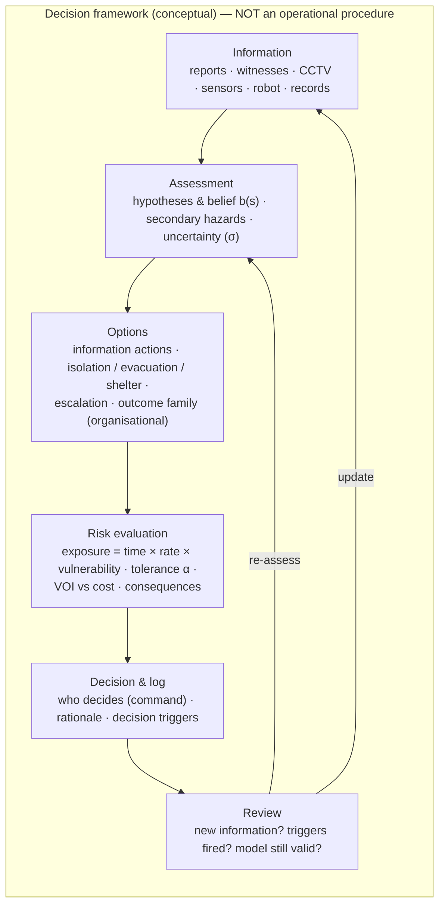

# 07.2 · Incident management: the conceptual framework

<div class="module-card">

**Prerequisites** [07.1 Decisions under uncertainty](lessons/stage-07/lesson-01.md) (belief, VOI, exposure) · [04.2 Distance, reflection, confinement](lessons/stage-04/lesson-02.md) (scaled distance, Kinney–Graham fit) · [04.4 Injury, fragments & secondary hazards](lessons/stage-04/lesson-04.md) (stand-off tables, glazing) · [06.5 Teleoperation & HMI](lessons/stage-06/lesson-05.md).

**Estimated time** 6 h (3 h theory · 1.5 h simulator · 1.5 h programming) · **Level** Advanced

**Next** [08.1 The post-blast scene](lessons/stage-08/lesson-01.md) and the [Stage 7 gate](assessments/stage-07.md).

<p class="tags"><span>incident management</span><span>cordons</span><span>risk tolerance</span><span>scheduling</span><span>ICS</span><span>Sim A · Sim F</span></p>
</div>

## Why this matters

When the 1980 Harvey's device functioned despite more than a day of careful work, nobody was hurt
— because the building had been evacuated and a stand-off maintained
([research/03](research/03-detection-forensics-sources.md) C1). When a 1.4-tonne legacy air mine
was found in Frankfurt in 2017, the decisive engineering problem was not the item but a 1.5 km
evacuation of about 60 000 residents (C4). Most of what protects people at an explosive-hazard
incident is **incident management**: isolating the hazard, getting the right information in the
right order, positioning people, escalating early, and choosing — at the organisational level —
what kind of outcome to pursue. This lesson builds each of these as a quantitative decision
component that plugs into the belief-state loop of [07.1](lessons/stage-07/lesson-01.md).

<div class="callout boundary">

**Scope.** Cordon, evacuation, tasking and escalation are taught as *reasoning frameworks* with
abstract yield units (YU) and fictional parameters. Disposal outcomes appear only as three
organisational **families** — remove, destroy in place, render safe — and only at the level of
*what drives the choice*. This lesson contains no procedure, no tool technique and no guidance on
how any outcome is achieved. Real stand-off distances come from published public-safety tables
and national doctrine, not from these examples.

</div>

## Learning objectives

1. Derive a cordon radius from an explicit **risk tolerance** and an *uncertain* abstract yield,
   using Stage 4 scaled-distance physics, and explain why the answer depends on a quantile, not
   the median.
2. Compare blast- and fragment-governed distances and explain why published stand-off tables are
   larger than blast-only calculations.
3. Apply time–distance–shielding as operations on the exposure integral of 07.1.
4. Formulate sensor and robot tasking as a scheduling problem, prove the weighted-shortest-
   processing-time rule by an exchange argument, and state its limitations.
5. Decide between evacuation and shelter-in-place with an explicit model including glazing
   hazard, and identify the parameter that flips the decision.
6. Place evidence preservation, escalation to specialist resources and command interfaces (ICS,
   unified command) into the decision loop.
7. Explain the three disposal-outcome families as organisational choices and list the risk and
   information factors that drive selection — without any procedural content.

## Theory

### 1. Isolation logic: a cordon radius from a risk tolerance

A cordon is a statement: *outside this line, the probability that a person is exposed to more
than a harm threshold is below an accepted tolerance.* Make that literal.

From Stage 4, the peak incident overpressure is a decreasing function of scaled distance only:
$\Delta p = p_0\, f(Z)$ with $Z = R/W^{1/3}$ (Hopkinson–Cranz), where $f$ is, for a free-air
burst, the Kinney–Graham fit. For a harm threshold $p_{\text{th}}$ define
$Z_{\text{th}} = f^{-1}(p_{\text{th}}/p_0)$. Then, **for a given yield**,

$$ \Delta p(R) > p_{\text{th}} \iff Z < Z_{\text{th}} \iff W > (R/Z_{\text{th}})^3 . $$

The yield $W$ of an unknown item is uncertain. Model it as lognormal, $\ln W \sim
\mathcal N(\mu, \sigma^2)$ (median $W_{50}=e^\mu$). The risk-tolerance requirement
$P\big(\Delta p(R) > p_{\text{th}}\big) \le \alpha$ becomes $P\big(W > (R/Z_{\text{th}})^3\big)\le
\alpha$, i.e. $(R/Z_{\text{th}})^3 \ge W_{1-\alpha}$, so

<div class="callout eq">

$$
R_\alpha = Z_{\text{th}}\; W_{1-\alpha}^{1/3} = Z_{\text{th}}\, W_{50}^{1/3}\, \exp\!\Big(\frac{\sigma\, z_{1-\alpha}}{3}\Big),
\qquad z_{1-\alpha} = \Phi^{-1}(1-\alpha).
$$

</div>

| Symbol | Meaning | Unit |
|---|---|---|
| $R_\alpha$ | cordon radius meeting tolerance $\alpha$ | m |
| $Z_{\text{th}}$ | scaled distance at which $\Delta p = p_{\text{th}}$ | m YU⁻¹ᐟ³ |
| $p_{\text{th}}$ | harm threshold overpressure (illustrative) | kPa |
| $W_{50}, \sigma$ | median yield and log-standard deviation of the yield belief | YU, — |
| $\alpha$ | accepted probability that the threshold is exceeded at the line | — |
| $\Phi^{-1}$ | standard normal quantile function | — |

**Intuition.** The cordon is set by a *high quantile* of the yield belief, not by its median. The
cube root is forgiving — an eightfold yield uncertainty only doubles the radius — but the
exponential in $\sigma z$ is not: tightening the tolerance or widening the belief both push the
line out. Better information about *what the item is* (07.1) shrinks $\sigma$ and is therefore
worth metres of cordon, i.e. people and infrastructure released.

**Numerical example.** Kinney–Graham inversion (sea level) gives $Z_{\text{th}}$ = 84.1, 42.4,
17.8, 13.3, 10.0, 6.2 m YU⁻¹ᐟ³ for $p_{\text{th}}$ = 1, 2, 5, 7, 10, 20 kPa. Take an illustrative
$p_{\text{th}} = 5$ kPa, $W_{50}=10$ YU, $\sigma=0.8$:

| Tolerance $\alpha$ | $z_{1-\alpha}$ | $W_{1-\alpha}$ [YU] | $R_\alpha$ [m] |
|---|---|---|---|
| median only | 0 | 10 | 38.3 |
| 0.1 | 1.282 | 27.9 | 53.9 |
| 0.01 | 2.326 | 64.3 | 71.3 |
| 0.001 | 3.090 | 118.5 | 87.4 |

Going from "median" to a 1 % tolerance multiplies the radius by $e^{0.8\cdot2.326/3}=1.86$; the
area — and roughly the number of people to move — by 3.5.

```python
import numpy as np
from scipy.optimize import brentq
from scipy.stats import norm

P0 = 101.325  # kPa
def kg_ratio(Z):
    """Kinney & Graham (1985) free-air peak overpressure ratio dp/p0; Z in m / YU^(1/3)."""
    return 808 * (1 + (Z / 4.5)**2) / (np.sqrt(1 + (Z / 0.048)**2) *
                                       np.sqrt(1 + (Z / 0.32)**2) * np.sqrt(1 + (Z / 1.35)**2))

def z_threshold(p_th_kpa):
    return brentq(lambda Z: kg_ratio(Z) * P0 - p_th_kpa, 0.05, 500.0)

def cordon_radius(p_th_kpa, w50, sigma, alpha):
    w_q = w50 * np.exp(sigma * norm.ppf(1 - alpha))
    return z_threshold(p_th_kpa) * w_q ** (1 / 3)

print(round(z_threshold(5.0), 1))                      # 17.8
print(round(cordon_radius(5.0, 10, 0.8, 0.01), 1))     # 71.3
```

<details class="answer"><summary>Exercise 1 — then reveal</summary>

(a) Show that $dR_\alpha/R_\alpha = \tfrac13\, dW_{50}/W_{50}$ and $\partial \ln R_\alpha/\partial
\sigma = z_{1-\alpha}/3$. (b) A better identification reduces $\sigma$ from 0.8 to 0.3 at
$\alpha=0.01$. By what factor does the cordon *area* shrink? (c) The item is on the ground, so the
blast is closer to a hemispherical surface burst; textbooks commonly scale the yield by ≈1.8 for
real ground (Baker et al. 1983, flagged as unverified in research/02). What happens to $R$?

*Answer.* (a) Direct differentiation of $R_\alpha = Z_{\text{th}} W_{50}^{1/3}e^{\sigma z/3}$.
(b) Radius factor $e^{(0.3-0.8)\cdot2.326/3}=e^{-0.388}=0.679$; area factor $0.679^2=0.46$ — less
than half the area. (c) $R$ scales by $1.8^{1/3}=1.22$: 71.3 → 86.7 m. Geometry assumptions matter
as much as a fair amount of yield uncertainty.

</details>

### 2. Why published stand-off tables are larger: fragments and glazing

Blast overpressure is only one hazard. For items with a casing or nearby debris, **fragments**
usually govern. A simple, standard model: if $N$ hazardous fragments leave a point source
isotropically, the expected number striking a person of presented area $A_p$ at range $R$ is
$N A_p/(4\pi R^2)$, and with Poisson statistics

$$ P_{\text{hit}}(R) = 1 - \exp\!\left(-\frac{N A_p}{4\pi R^2}\right) . $$

US explosives-safety standards define a **hazardous fragment distance** as the range at which the
density of hazardous fragments falls to one per 55.7 m² (600 ft²) (DESR 6055.09,
[research/02](research/02-physics-chemistry-blast-sources.md) 2.9). For isotropic throw that
distance is $R_{\text{HFD}} = \sqrt{55.7\,N/(4\pi)}$.

| Symbol | Meaning | Unit |
|---|---|---|
| $N$ | number of hazardous fragments (abstract) | — |
| $A_p$ | presented area of a person | m² |
| $R_{\text{HFD}}$ | hazardous fragment distance | m |

**Intuition.** Fragment density falls as $R^{-2}$; far-field overpressure falls only as about
$R^{-1.1}$ (the local log-slope of the Kinney–Graham fit near 5 kPa is −1.11). But fragment
*numbers* can be large and their throw is strongly directional, so the fragment envelope is
usually the outer one. Glass is the third envelope: annealed glazing fails at overpressures of a
few kPa (04.3), converting a benign pressure into a fragment hazard *inside* buildings far beyond
the blast-injury radius. Published public-safety charts such as the DHS–DOJ *Bomb Threat
Stand-Off Card* ([research/02](research/02-physics-chemistry-blast-sources.md) 2.10) encode all
three envelopes — which is why they list both a mandatory-evacuation and a larger
**shelter-in-place** distance, and why their values exceed a blast-only calculation. Always use
the published table; the physics here explains its shape.

**Numerical example.** Abstract $N=2000$, $A_p=0.5$ m²: $P_{\text{hit}}$ = 0.18, 0.031, 0.0079 at
20, 50, 100 m; $R_{\text{HFD}}=94$ m. Compare the 5 kPa, 1 %-tolerance blast radius of 71 m for a
10 YU median item: fragments govern.

```python
def p_hit(R, n_frag, area=0.5):
    return 1 - np.exp(-n_frag * area / (4 * np.pi * R**2))

def hazardous_fragment_distance(n_frag, density_area=55.7, solid_angle=4 * np.pi):
    return np.sqrt(n_frag * density_area / solid_angle)

print([round(p_hit(R, 2000), 4) for R in (20, 50, 100)])   # [0.1804, 0.0313, 0.0079]
print(round(hazardous_fragment_distance(2000), 1))         # 94.2
```

<details class="answer"><summary>Exercise 2 — then reveal</summary>

Fragments from an item on the ground go mostly into the upper hemisphere. How does
$R_{\text{HFD}}$ change? And by what factor must $N$ grow to double $R_{\text{HFD}}$?

*Answer.* Solid angle $2\pi$ instead of $4\pi$ doubles the density: $R_{\text{HFD}}$ grows by
$\sqrt2$ (94 → 133 m). $R_{\text{HFD}}\propto\sqrt N$, so $N$ must quadruple. Compare blast:
doubling $R$ at fixed threshold needs 8× the yield. Fragment distances are *more* sensitive to
the source term than blast distances.

</details>

### 3. Time, distance, shielding — operations on the exposure integral

From 07.1, expected harm is $\sum_j \int P(H)\,\lambda(t)\,v(r_j(t))\,dt$. The three classical
protective principles are three ways to shrink it:

| Principle | Acts on | Physics behind it | Typical management lever |
|---|---|---|---|
| **Time** | $\int dt$ | exposure accumulates linearly with time near the hazard | minimise people and minutes in the inner area; remote means (06.x) |
| **Distance** | $v(r)$ | overpressure $\sim R^{-1.1}$ far field; fragment density $\sim R^{-2}$; glazing thresholds | cordon radius (Section 1), placement of control points |
| **Shielding** | $v$ at fixed $r$ | fragments need line of sight; blast diffracts around obstacles but is reduced behind robust structure (04.2) | positions behind substantial cover, away from glazing |

Doubling distance reduces far-field overpressure by $2^{1.11}\approx2.2$ and fragment density by
4 — which is why, when in doubt, *distance* is the cheapest protection. Shielding is subtle for
blast (walls re-radiate, streets channel — 04.2) but decisive for fragments.

### 4. Information gathering and its sources

Each information source is an observation channel with a likelihood structure, a latency, a cost
and an *exposure* cost. Thinking of them this way makes the 07.1 machinery directly applicable.

| Source | What it can discriminate | Typical weaknesses (likelihood structure) | Exposure cost |
|---|---|---|---|
| Caller / witnesses | placement behaviour, timing, owner | memory reconstruction, contagion between witnesses (correlated evidence), anchoring on first account | none |
| CCTV / video | who, when, behaviour; route | coverage gaps, clock offsets (08.2), resolution | none; time cost to review |
| Area records / context | base rates, history of the site, events | stale data, availability bias | none |
| Standoff sensors (Stage 5) | material or anomaly indicators at distance | ROC trade-off, clutter, base-rate effects (05.1) | low |
| Robot reconnaissance (Stage 6) | close imaging, multiple viewpoints | comms and latency (06.5, 06.9), mobility limits | robot at risk, not people |
| Specialist advice (remote) | interpretation, escalation criteria | availability, bandwidth of the link | none |

Two management principles follow directly from 07.1: **gather cheap, zero-exposure information
first** (it can only help, if it is fast), and **ask what each request could change** before
spending exposure or time on it.

### 5. Sensor and robot tasking as a scheduling problem

With one robot (or one analyst) and several information tasks $j$ with processing time $p_j$ and
value $w_j$ (e.g. EVSI rate, or the importance of the answer to the next decision), a natural
objective is to get valuable answers *early*: minimise the weighted completion time
$\sum_j w_j C_j$.

**Theorem (Smith 1956, WSPT).** On a single resource without preemption, $\sum_j w_j C_j$ is
minimised by processing tasks in decreasing order of $w_j/p_j$.

*Proof (exchange argument).* Take any schedule with adjacent tasks $i$ then $k$ starting at time
$t$. Swapping them changes only their two terms: before, $w_i(t+p_i) + w_k(t+p_i+p_k)$; after,
$w_k(t+p_k) + w_i(t+p_k+p_i)$. The difference (before − after) is $w_k p_i - w_i p_k$, which is
positive iff $w_k/p_k > w_i/p_i$. So any adjacent pair out of ratio order can be swapped to
improve the objective; the optimum has no such pairs. ∎

| Symbol | Meaning | Unit |
|---|---|---|
| $p_j$ | processing time of task $j$ (including travel/setup) | min |
| $w_j$ | value weight of task $j$ | LU min⁻¹ (value per minute of delay) |
| $C_j$ | completion time of task $j$ | min |

**Numerical example (fictional tasks).**

| Task | $p_j$ [min] | $w_j$ | $w_j/p_j$ |
|---|---|---|---|
| witness interview | 5 | 4 | 0.80 |
| CCTV review | 10 | 6 | 0.60 |
| standoff imaging | 15 | 9 | 0.60 |
| robot reconnaissance | 25 | 12 | 0.48 |

WSPT order gives $\sum w_jC_j = 4\cdot5 + 6\cdot15 + 9\cdot30 + 12\cdot55 = 1040$; the worst order
gives 1180 (brute force over all 24 permutations confirms 1040 is optimal).

```python
from itertools import permutations
tasks = {"witness": (5, 4), "cctv": (10, 6), "standoff": (15, 9), "robot": (25, 12)}

def weighted_completion(order):
    t = cost = 0
    for k in order:
        p, w = tasks[k]; t += p; cost += w * t
    return cost

wspt = sorted(tasks, key=lambda k: -tasks[k][1] / tasks[k][0])
print(wspt, weighted_completion(wspt))                              # 1040
print(min(weighted_completion(o) for o in permutations(tasks)))     # 1040
```

**Where the simple model breaks — and what replaces it.**

- *Parallel resources.* Witness interviews and CCTV review use people, not the robot: it is a
  multi-resource problem (and the WSPT result holds per resource only approximately).
- *Travel and energy.* Robot tasks at different places have sequence-dependent set-up times and
  a battery budget (06.4): an **orienteering** problem (TSP with rewards) — NP-hard, but tiny
  instances are solved exactly.
- *Adaptivity.* The value of a task changes after each result (07.1): the right algorithm
  re-plans after every observation — a receding-horizon policy, exactly what Sim A and Sim F
  reward.
- *Deadlines.* If an answer is useless after a decision time, the objective becomes weighted
  number of on-time tasks (Moore–Hodgson-type rules).

<details class="answer"><summary>Exercise 3 — then reveal</summary>

The CCTV review is reassigned to a second analyst who works in parallel. Re-optimise the robot's
and the first analyst's queues and compute the new $\sum w_j C_j$.

*Answer.* Analyst 2: CCTV, $C=10$ → 60. Remaining single queue (witness, standoff, robot) in
ratio order 0.80, 0.60, 0.48: witness $C=5$ (20), standoff $C=20$ (180), robot $C=45$ (540).
Total $60+20+180+540 = 800$ (was 1040). (Strictly, the interviewer and the robot are also
different resources; with interviewer, analyst and robot in parallel — standoff imaging and
reconnaissance both on the robot, in ratio order — total $=20+60+135+480=695$.) Resource
parallelism is worth more than clever ordering.

</details>

### 6. Secondary-hazard awareness

The hypothesis space of 07.1 must include hazards *other* than the reported item: additional
items, structural instability, damaged utilities (gas, electrical), fire, and chemical,
biological or radiological contamination (04.4). Two consequences for management:

- **Responder positions are exposures too.** Control points, assembly areas and access routes are
  where many people will stand for a long time; in the exposure integral they have large
  $n_j\,t_j$. They should be selected, and checked, with the same suspicion as the incident
  scene, and obvious or habitual locations deserve particular scrutiny.
- **New reports change the model, not just the belief.** A second item or an anomalous
  observation should trigger re-planning (the decision triggers of 07.1), including cordon
  geometry, not merely an update of $P(H)$.

### 7. Evacuation vs shelter-in-place

Moving people is not free: while they move they are *outdoors, possibly closer, in the open*.
Staying put is not free: glazing fails at low overpressure and turns rooms into fragment zones.
A minimal model (fictional parameters): if the hazard functions (probability $P(H)$), it does so at
a random time with rate $\lambda$ over an incident duration $T$. Evacuation takes $t_e$, during
which $N$ people have conditional vulnerability $v_{\text{out}}$, and afterwards ≈ 0; sheltering
leaves them at $v_{\text{in}}$ for the whole duration:

$$
\mathbb E[\text{harm}]_{\text{evac}} = P(H)\,\big(1-e^{-\lambda t_e}\big)\,N\,v_{\text{out}},\qquad
\mathbb E[\text{harm}]_{\text{shelter}} = P(H)\,\big(1-e^{-\lambda T}\big)\,N\,v_{\text{in}} .
$$

Evacuate iff

$$
\frac{1-e^{-\lambda t_e}}{1-e^{-\lambda T}} < \frac{v_{\text{in}}}{v_{\text{out}}}
\;\;\xrightarrow{\;\lambda T \ll 1\;}\;\; \frac{t_e}{T} < \frac{v_{\text{in}}}{v_{\text{out}}} .
$$

| Symbol | Meaning | Unit |
|---|---|---|
| $t_e$ | time to complete evacuation past the hazard envelope | min |
| $T$ | expected duration of the hazardous phase | min |
| $v_{\text{out}}, v_{\text{in}}$ | conditional vulnerability while evacuating / while sheltering | — |
| $\lambda$ | function rate given $H$ | min⁻¹ |

**Intuition.** Evacuation wins when it is fast relative to the incident and when sheltering
locations are poor (window-facing rooms, light construction). Sheltering wins when evacuation
routes pass through the hazard envelope or take long, and when interior refuges away from glazing
exist. The shelter-in-place band of published charts expresses exactly this.

**Numerical example.** $P(H)=0.3$, $\lambda=0.01$ min⁻¹, $N=300$, $t_e=15$ min, $T=90$ min,
$v_{\text{out}}=0.05$:

| Sheltering location | $v_{\text{in}}$ | $\mathbb E_{\text{evac}}$ | $\mathbb E_{\text{shelter}}$ | Decision |
|---|---|---|---|---|
| interior rooms, away from glazing | 0.004 | 0.63 | 0.21 | shelter |
| mixed | 0.010 | 0.63 | 0.53 | shelter (just) |
| window-facing rooms | 0.040 | 0.63 | 2.14 | evacuate |

The middle row is instructive: the small-$\lambda$ rule says evacuate ($t_e/T = 0.167 < 0.2$),
but the exact ratio is $(1-e^{-0.15})/(1-e^{-0.9}) = 0.235 > 0.2$ → shelter. When the hazard
window is long relative to $1/\lambda$, cumulative exposure saturates and the approximation fails.

```python
def evac_vs_shelter(p_h, lam, n, t_e, T, v_out, v_in):
    e_evac = p_h * (1 - np.exp(-lam * t_e)) * n * v_out
    e_shel = p_h * (1 - np.exp(-lam * T)) * n * v_in
    return round(e_evac, 3), round(e_shel, 3), "evacuate" if e_evac < e_shel else "shelter"

for v_in in (0.004, 0.010, 0.040):
    print(v_in, evac_vs_shelter(0.3, 0.01, 300, 15, 90, 0.05, v_in))
```

<details class="answer"><summary>Exercise 4 — then reveal</summary>

The only evacuation route passes within the blast envelope for the first 5 of its 15 minutes, so
$v_{\text{out}}$ is 0.2 for 5 min and 0.01 for 10 min. Recompute $\mathbb E_{\text{evac}}$ and the
decision for $v_{\text{in}}=0.010$.

*Answer.* Hazard during minutes 0–5: $1-e^{-0.05}=0.0488$; during 5–15:
$e^{-0.05}-e^{-0.15}=0.0905$. $\mathbb E_{\text{evac}} = 0.3\cdot300\cdot(0.0488\cdot0.2 +
0.0905\cdot0.01) = 90\cdot0.01066 = 0.96$ vs shelter 0.53 → shelter, more clearly. *Route*
geometry, not just duration, matters.

</details>

### 8. Evidence preservation inside the safety envelope

Every incident may become a crime scene or an accident investigation (Stage 8). The generally
stated priority order in incident management is **life safety → incident stabilisation →
property and evidence conservation**. Within that order, evidence-conscious management means:
minimise the number of people and paths entering the inner area (which is also exposure
minimisation — the two objectives align); record who entered, when and why; preserve
video, logs and witness details early, before they are overwritten or contaminated
(information decays); and record the state of the scene before and after each intervention. The
NIJ *Guide for Explosion and Bombing Scene Investigation* treats the first-responder phase as part
of the investigative workflow for exactly this reason ([research/03](research/03-detection-forensics-sources.md) B1).

### 9. Escalation and specialist resources

Some hypotheses require capabilities a local team does not hold: chemical, biological,
radiological or nuclear aspects (the CBRN EOD subset of NATO AJP-3.18), underwater or maritime
items, very large or multiple items, or incidents crossing jurisdictions
([research/01](research/01-training-pathways.md) §3.2). Escalation is itself a decision under
uncertainty with a **lead time**: specialists take $\tau$ to arrive, so the decision must be made
while the need is still uncertain. With $q$ = P(specialist capability needed), $c_{\text{esc}}$ =
cost of an unnecessary escalation and $c_{\text{late}}(\tau)$ = extra loss if the need is
confirmed only later and the capability arrives $\tau$ late, escalate now iff

$$ q\, c_{\text{late}}(\tau) > (1-q)\,c_{\text{esc}} \iff q > q^{*} = \frac{c_{\text{esc}}}{c_{\text{esc}} + c_{\text{late}}(\tau)} . $$

Because $c_{\text{late}}$ grows with $\tau$, **the longer the lead time, the lower the belief at
which you should escalate** — the formal reason why organisations write escalation *criteria*
triggered by indicators rather than by confirmation. Example: $c_{\text{esc}}=10$ LU,
$c_{\text{late}}=190$ LU gives $q^{*}=0.05$.

<details class="answer"><summary>Exercise 5 — then reveal</summary>

A specialist team is 3 h away and $c_{\text{late}}$ grows linearly at 80 LU/h of delay;
$c_{\text{esc}} = 30$ LU. Compute $q^{*}$. What if a closer team (45 min) exists?

*Answer.* 3 h: $c_{\text{late}}=240$, $q^{*} = 30/270=0.111$. 45 min: $c_{\text{late}}=60$,
$q^{*}=30/90=0.33$. Distant capabilities must be requested on weaker indicators.

</details>

### 10. Command interfaces: ICS and unified command

Most civil jurisdictions organise multi-agency incidents with an **Incident Command System**
(ICS; in the US, part of NIMS): an Incident Commander with command staff (safety, liaison,
public information) and general staff sections — **Operations, Planning, Logistics,
Finance/Administration**. Where several agencies have jurisdiction, **unified command** lets
them share one incident action plan without merging chains of command; the Boston 2013 response
is a well-documented example of its importance ([research/03](research/03-detection-forensics-sources.md) C2).

Mapped onto 07.1's loop:

| Decision-loop element | ICS home |
|---|---|
| belief $b$ (situation picture), decision log | Planning — situation and documentation units |
| information actions (sensor/robot/witness tasking) | Operations (technical specialists, including the bomb squad or EOD team), with requests from Planning |
| commitment actions (cordon changes, evacuation, outcome family) | Incident Commander / unified command, on technical advice |
| resources, lead times (Section 9) | Logistics |
| risk tolerance $\alpha$, loss weights | set by command and policy, *not* improvised at the tape |

The interface lesson for engineers: the EOD technical specialist owns the *technical* belief and
advice; command owns the *commitments* and the value judgements. Decision support tools (P12)
must respect that split — present beliefs, uncertainties and options, not verdicts.

### 11. The families of disposal outcome (organisational level only)

Public doctrine and humanitarian standards describe the end-state of an explosive-hazard incident
in a few broad families ([research/01](research/01-training-pathways.md) §8.1 item 10):

| Family | What it means organisationally | Public example (research/03) |
|---|---|---|
| **Remove** | the item is moved to a place where the remaining risk can be managed | London City Airport 2018: item removed and destroyed at sea (C5) |
| **Destroy in place** | the hazard is eliminated where it lies, accepting local consequences | common in humanitarian clearance of items not safe to move (IMAS 09.30, research/01 §4.1) |
| **Render safe** | the hazard is neutralised so that it no longer presents an explosive risk | Frankfurt 2017: item defused by the state ordnance-disposal service (C4) |
| *(Monitor / manage)* | intervention judged riskier than managed presence | SS *Richard Montgomery*: long-term monitoring (C6) |

How any of these is achieved is the preserve of certified professionals and restricted doctrine,
and is outside this course. What *is* in scope is **which factors drive the choice**, because
they are the same risk and information quantities developed above:

| Driver | Direction of influence (conceptual) |
|---|---|
| Consequence of the item functioning *where it is* (people, critical infrastructure, heritage) | high consequence in place weighs against destroy-in-place |
| Uncertainty about the item's state and stability (the $\sigma$ and hypothesis spread of 07.1) | high uncertainty weighs against options requiring handling or movement |
| Exposure each option imposes (people × time × vulnerability, Section 3) | the option with the lowest credible exposure is preferred, other things equal |
| Evidential and intelligence value (08.x, TEDAC) | favours outcomes that preserve material for examination, *only* within the safety envelope |
| Time and disruption (Section 1 cordon area × duration) | long closures of critical infrastructure add pressure — which must not override risk tolerance |
| Environment (underwater, confined, contaminated) and available specialist capability (Section 9) | may restrict the feasible set and trigger escalation |
| Legal authority and organisational policy | define who may choose and within what tolerance |

The decision is multi-criteria and made by the responsible technical authority under doctrine.
The engineering contribution is better *inputs*: sharper beliefs, exposure estimates, cordon
geometry, and a clear record of why.

## Visual explanation

The loop below is a **reasoning framework, not a procedure**: it describes how information,
assessment and risk connect, in any order the situation demands. It contains no operational
steps and must not be read as a checklist.



Sim A turns Sections 1–7 into geometry: you draw the cordon, place control points, task sensors
and the robot, and the debrief reports exposure, information value and missed secondary hazards.

<iframe class="sim-frame" src="sims/scene-assessment/index.html?embed=1" height="720" loading="lazy"></iframe>

<a class="sim-link" href="sims/scene-assessment/index.html" target="_blank">Open Sim A full-screen ↗</a>

## Worked example — a fictional legacy item on a city construction site

A fictional excavation in a dense city district uncovers a large, corroded legacy item. Initial
identification from images supports a class whose abstract yield belief is $W_{50}=100$ YU with
$\sigma=0.5$. Policy sets an illustrative outer blast threshold of 5 kPa at $\alpha=0.01$ and an
illustrative abstract fragment count $N=20\,000$ into the upper hemisphere.

1. **Blast envelope.** $Z_{\text{th}}=17.8$; $W_{0.99}=100\,e^{0.5\cdot2.326}=320$ YU;
   $R=17.8\cdot320^{1/3}=121.7$ m (free air). Treating it as a surface burst ($\times1.8$ on $W$):
   148 m. At a 2 kPa glazing-oriented threshold: 290 m (free air).
2. **Fragment envelope.** Hemispherical: $R_{\text{HFD}}=\sqrt{55.7\cdot20\,000/(2\pi)} = 421$ m.
   Fragments govern the evacuation radius; glazing governs the wider shelter-in-place band. In
   practice both are read from published tables for the identified class — the calculation shows
   *why* those tables have the shape they do.
3. **Evacuation vs shelter.** Inside ≈ 420 m: evacuate (people would otherwise be in line of
   fragments). In a band beyond it where glazing may fail: compare Section 7 — with good interior
   refuges, shelter; for schools and glass-fronted offices, evacuate on routes leading *away*.
4. **Information and tasking.** Highest value per minute: archival records and site history
   (zero exposure), then imagery to reduce $\sigma$ (each halving of $\sigma$ at $\alpha=0.01$
   shrinks the radius by $e^{-0.25\cdot 2.326/3}=0.82$, i.e. area by 32 %).
5. **Escalation.** No CBRN indicators; item class within team capability → no escalation, but a
   pre-agreed trigger: any indicator of a chemical fill → immediate escalation (Section 9).
6. **Command.** Unified command (police, city, utilities, transport); the EOD team advises on the
   technical belief and envelopes; command decides the evacuation scope and timing.
7. **Outcome family.** The consequences of functioning in place (dense housing, a utility main)
   weigh against destroy-in-place; the choice between the remaining families rests with the
   technical authority under doctrine — outside this course. The log records the drivers.

## Simulation work

<div class="callout sim">

**Sim A — Scene Assessment (Advanced/Expert).** (1) Draw your cordon *before* any sensor use,
then again after two information actions; record how the radius the debrief recommends changes
as the yield belief narrows. (2) Place the control point in the most convenient spot, then in a
less convenient but shielded spot; compare the exposure score. (3) Find the secondary hazard the
scenario hides.

**Sim F — Incident Command.** In the *Expert* scenario, a second report arrives mid-incident.
Log the trigger you set beforehand, whether it fired, and how your escalation timing compared
with the $q^{*}$ logic of Section 9.

</div>

## Practical exercises

<details class="answer"><summary>Practical 1 — Cordon under two uncertainties (Monte Carlo) — then reveal</summary>

The threshold is itself uncertain: $\ln p_{\text{th}} \sim \mathcal N(\ln 5, 0.3^2)$ (fragility of
the glazing stock), independent of $\ln W\sim\mathcal N(\ln10, 0.8^2)$. Estimate by Monte Carlo
the radius $R$ at which $P(\Delta p > p_{\text{th}})=0.01$. Compare with 71.3 m.

*Answer.* For each sample, the exceedance radius is $R_i = Z_{\text{th}}(p_i)\,W_i^{1/3}$; take
the 99th percentile of $R_i$. With 10⁶ samples the result is ≈ 94 m — about 32 % larger than
71 m. Check analytically: near 5 kPa, $\sigma_{\ln Z}\approx 0.3/1.11 = 0.27$, so
$\sigma_{\ln R}=\sqrt{(0.8/3)^2+0.27^2}=0.38$ and $R_{99}\approx 38.3\,e^{2.326\cdot0.38}\approx 92$ m.
A modest fragility uncertainty matters as much as a large yield uncertainty, because the cube
root damps the latter but not the former. Code: vectorise `z_threshold` by interpolation on a
grid of $p$.

</details>

<details class="answer"><summary>Practical 2 — Critique a cordon (interpretation) — then reveal</summary>

A fictional after-action note says: "Cordon set at 50 m, based on the median yield estimate, from
the tape to the item." List three technical objections.

*Answer.* (1) Median, not a tolerance quantile — at $\sigma=0.8$ and $\alpha=0.01$ the radius
should be 1.86× larger for the same threshold. (2) Blast-only: fragments and glazing (Section 2)
usually govern; published stand-off tables should have been consulted. (3) Geometry: ground burst
and street channelling (04.2) increase effective loading; "from the tape" suggests people were at
the line in the open, i.e. no shielding and possibly glazing behind them.

</details>

<details class="answer"><summary>Practical 3 — Tasking with a battery budget (design) — then reveal</summary>

The robot has 40 min of useful energy. Using the Section 5 tasks, which subset of robot-executable
tasks (standoff imaging, robot recon) and order maximises total value delivered before the battery
runs out, if a task's value is only realised on completion?

*Answer.* Both need 15 + 25 = 40 min — both fit exactly, order by ratio (standoff first). If
travel adds 5 min between them, only one fits: robot recon (value 12) beats standoff imaging (9).
The ordering rule and the selection rule differ: selection under a budget is a knapsack, ordering
is WSPT.

</details>

## Programming exercise — an incident isolation and tasking planner

**Goal.** Build a small planner that, given a belief about an abstract item and a scene, proposes
cordon radii (blast, fragment, glazing envelopes) with explicit tolerances and a tasking schedule.

- **Input:** yield belief $(W_{50},\sigma)$ in YU; thresholds and tolerances; abstract fragment
  count and hemisphere flag; list of information tasks $(p_j, w_j, \text{resource})$; robot
  energy budget.
- **Output:** a report with each envelope radius, which one governs, the sensitivity
  $\partial R/\partial\sigma$, a per-resource task order, and the evacuation-vs-shelter decision
  per zone with the flipping parameter value.
- **Constraints:** NumPy/SciPy only; deterministic given a seed; runs in < 2 s.
- **Expected behaviour:** reproduces the numbers of Sections 1, 2, 5 and 7; the reported
  governing envelope changes from blast to fragments as $N$ increases.
- **Test cases:** (i) `cordon_radius(5, 10, 0.8, 0.01)` ≈ 71.3 m; (ii) $\sigma=0$ reduces to
  $Z_{\text{th}}W^{1/3}$; (iii) WSPT equals brute force for ≤ 8 tasks; (iv) evacuation/shelter
  decision flips exactly where the exact ratio equals $v_{\text{in}}/v_{\text{out}}$.
- **Extensions:** street-canyon channelling as a directional multiplier on $W$; a
  Monte Carlo threshold uncertainty (Practical 1); a receding-horizon re-plan after each simulated
  task outcome using the 07.1 belief update.

Pairs with [Project P12](projects/p12-hitl-decision/README.md) (the decision engine) and
[Project P01](projects/p01-blast-wave/README.md) (the blast library).

## Reading

- DHS/CISA, DOJ, FBI, *Bomb Threat Stand-Off Card* (2025),
  https://www.cisa.gov/resources-tools/resources/dhs-doj-bomb-threat-stand-card — read the
  structure (threat classes, mandatory evacuation vs shelter-in-place) and relate each column to
  Sections 1, 2 and 7. ([research/02](research/02-physics-chemistry-blast-sources.md) 2.10)
- UNODA, *IATG 02.20 Quantity and separation distances* (2021),
  https://data.unsaferguard.org/iatg/en/V3_IATG-02.20_en.pdf — how scaled distance becomes
  institutional separation rules. ([research/02](research/02-physics-chemistry-blast-sources.md) 2.8)
- USD(A&S)/DDESB, *DESR 6055.09*, Vol. 3 (QD concepts, hazardous fragment distance),
  https://www.denix.osd.mil/ddes/denix-files/sites/32/2022/08/DESR-6055.09-Edition1-Change-2-251208.pdf
  ([research/02](research/02-physics-chemistry-blast-sources.md) 2.9)
- NATO, *AJP-3.18 Allied Joint Doctrine for EOD Support to Operations* (2023), ch. 1 and 3,
  https://assets.publishing.service.gov.uk/media/65d48f3f38fef90011b5b03b/AJP_3_18_EOD_EdB_V1.pdf
  — capability subsets (including CBRN and underwater) and command and control of EOD.
  ([research/01](research/01-training-pathways.md) S15)
- NIJ, *A Guide for Explosion and Bombing Scene Investigation* (2000), first-responder chapter,
  https://www.ojp.gov/pdffiles1/nij/181869.pdf ([research/03](research/03-detection-forensics-sources.md) B1)
- PBS NewsHour/AP on Frankfurt 2017 and London City Airport 2018 (research/03 C4, C5) — read
  both as incident-management problems: radius, population, compliance, infrastructure.

## Assessment

1. *(Mathematical)* Derive $R_\alpha$ from the tolerance requirement and show that at fixed
   $\alpha$ the cordon *area* scales as $W_{50}^{2/3}e^{2\sigma z/3}$.
2. *(Conceptual)* Why can better identification of an item be worth more to a city than a faster
   robot? Answer using Section 1 and 07.1.
3. *(Interpretation)* A plan places the public 300 m away in a glass-fronted atrium "for
   comfort". Using Sections 2 and 7, explain the problem and propose an alternative.
4. *(Mathematical)* Prove that if all $p_j$ are equal, WSPT reduces to "highest value first", and
   if all $w_j$ are equal, to "shortest first".
5. *(Design)* List the decision-log fields you would require for an outcome-family choice so
   that a later review can judge the *reasoning* independent of the outcome.

<details class="answer"><summary>Answers to 1 and 4</summary>

1. From $P(W > (R/Z_{\text{th}})^3) \le \alpha$ and monotonicity, $R^3 \ge Z_{\text{th}}^3
   W_{1-\alpha}$; with lognormal $W_{1-\alpha}=W_{50}e^{\sigma z}$. Area $\pi R^2 \propto
   W_{50}^{2/3}e^{2\sigma z/3}$.
4. The ratio $w_j/p_j$ with constant $p$ orders by $w_j$; with constant $w$ orders by $1/p_j$,
   i.e. shortest processing time first (which minimises mean completion time).

</details>

## Expert extension

- **Spatial risk fields.** Replace the radial model with a 2D field: channelled overpressure from
  a street-canyon CFD run (Sim D's Euler solver) combined with a glazing-fragility map of building
  façades. The cordon becomes an iso-risk contour, not a circle.
- **Stochastic scheduling.** Processing times are random and outcomes change values: study the
  Gittins index and when it reduces to WSPT.
- **Crowd dynamics.** Evacuation times $t_e$ come from pedestrian models (social-force or
  cellular automata); couple one to Section 7 and find where congestion flips the decision.
- **Multi-criteria choice with explicit value trade-offs.** Formalise outcome-family selection as
  multi-attribute utility with a risk constraint, and show how the constraint, not the weights,
  dominates in high-consequence cases.

## What comes next

The incident does not always end before the hazard functions. [08.1](lessons/stage-08/lesson-01.md)
takes over after an explosion: scene safety, search, documentation and chain of custody — where
the evidence-preservation habits of Section 8 pay off. Take the [Stage 7 gate](assessments/stage-07.md).
